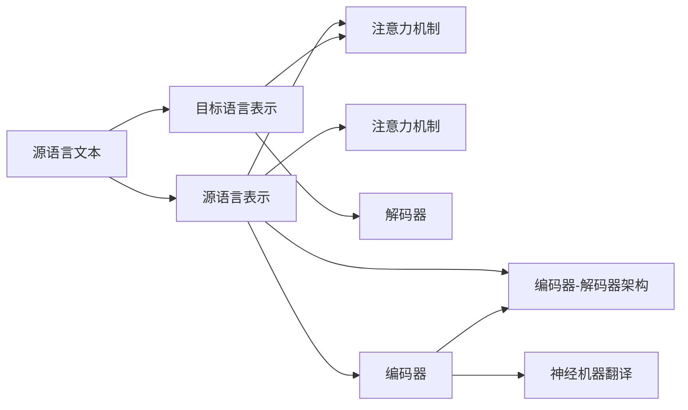

                 

## 1. 背景介绍

机器翻译（Machine Translation, MT）作为自然语言处理（NLP）的重要分支，经历了多次技术革新。深度学习技术的引入使得机器翻译进入了一个全新的时代，各大模型在多种评测指标上都取得了显著的进步。然而，随着多模态、跨语言、低资源等实际应用场景的涌现，深度学习在机器翻译领域仍需不断探索和创新。

本文聚焦于深度学习在机器翻译中的最新进展，首先介绍机器翻译的相关背景知识，接着分别从神经机器翻译、序列到序列模型、注意力机制、预训练语言模型等角度，探讨深度学习在该领域的最新研究成果。

## 2. 核心概念与联系

### 2.1 核心概念概述

机器翻译是指将一种自然语言文本自动翻译成另一种自然语言文本的自动化处理技术。该过程通常分为两个步骤：

1. **源语言分析**：理解源语言文本的意义，将其转化为语义表示。
2. **目标语言生成**：根据源语言语义表示，生成目标语言文本。

在深度学习时代，这两个步骤可以通过神经网络模型来实现。主要的技术框架包括：

- **神经机器翻译（Neural Machine Translation, NMT）**：利用神经网络模型自动地进行源语言和目标语言的语义映射。
- **序列到序列（Sequence to Sequence, Seq2Seq）模型**：通过编码器-解码器架构，实现输入序列到输出序列的转换。
- **注意力机制**：在神经机器翻译中，通过引入注意力机制，模型可以更加关注输入序列中的关键部分，提升翻译质量。
- **预训练语言模型**：通过大规模无标签数据预训练语言模型，可以提升其语言表示能力，从而提升机器翻译的效果。

这些技术相互关联，共同构成深度学习在机器翻译中的核心框架。

### 2.2 核心概念原理和架构的 Mermaid 流程图



以上图表展示了神经机器翻译的流程架构。

## 3. 核心算法原理 & 具体操作步骤

### 3.1 算法原理概述

机器翻译的核心原理是通过神经网络模型将源语言文本转换为目标语言文本。目前，最常用的模型架构是序列到序列模型（Seq2Seq），该架构包括编码器和解码器两部分，通过注意力机制进行语义匹配。

- **编码器（Encoder）**：将源语言文本转换为固定长度的语义表示。
- **解码器（Decoder）**：根据编码器输出的语义表示，生成目标语言文本。
- **注意力机制（Attention）**：在解码过程中，关注输入序列中的关键部分，从而提升翻译质量。

### 3.2 算法步骤详解

1. **数据准备**：收集源语言和目标语言的双语对照数据集，一般需要一定规模的平行语料库。

2. **模型架构设计**：选择序列到序列的模型架构，设计合适的编码器和解码器，引入注意力机制。

3. **模型训练**：使用无标签源语言文本进行预训练，获得初始化参数；然后使用双语对照数据对模型进行有监督微调。

4. **模型评估**：在测试集上评估模型翻译质量，使用BLEU、ROUGE等指标进行衡量。

5. **模型部署**：将训练好的模型部署到实际应用中，进行实时翻译。

### 3.3 算法优缺点

神经机器翻译方法具有以下优点：

- **自动学习**：能够自动学习源语言和目标语言之间的映射关系，无需手工设计规则。
- **端到端**：翻译过程可以端到端进行，不需要额外的手工翻译步骤。
- **高效性**：由于深度学习模型的并行计算能力，训练和推理速度较快。

同时，该方法也存在一些缺点：

- **数据依赖**：需要大规模的平行语料库，否则训练效果不佳。
- **计算资源**：深度学习模型参数较多，计算资源要求高。
- **过拟合风险**：训练数据集过小可能导致模型过拟合，翻译质量不稳定。

### 3.4 算法应用领域

深度学习在机器翻译中的应用领域包括：

- **商业翻译**：电子商务、旅游、金融等行业，需快速、准确地翻译成不同语言。
- **学术翻译**：科学论文、技术文档等的翻译，要求高准确性和专业知识。
- **新闻翻译**：实时新闻的自动翻译，需快速响应和准确性。
- **移动翻译**：手机应用、翻译软件等，需便捷、快速的翻译服务。
- **跨语言交流**：社交网络、在线教育等场景，需支持多语言交流和互动。

## 4. 数学模型和公式 & 详细讲解 & 举例说明

### 4.1 数学模型构建

假设源语言文本为 $x = \{x_1, x_2, ..., x_n\}$，目标语言文本为 $y = \{y_1, y_2, ..., y_m\}$。深度学习模型通过编码器将源语言文本 $x$ 转换为语义表示 $h$，然后解码器根据 $h$ 生成目标语言文本 $y$。

数学公式可以表示为：

$$
h = f_{encoder}(x; \theta_{encoder})
$$

$$
y = f_{decoder}(h; \theta_{decoder})
$$

其中，$f_{encoder}$ 和 $f_{decoder}$ 分别为编码器和解码器的映射函数，$\theta_{encoder}$ 和 $\theta_{decoder}$ 为模型参数。

### 4.2 公式推导过程

对于编码器，常用的模型包括：

- **RNN（循环神经网络）**：
  $$
  h_t = f_{RNN}(h_{t-1}, x_t; \theta_{RNN})
  $$

- **LSTM（长短期记忆网络）**：
  $$
  h_t = f_{LSTM}(h_{t-1}, x_t; \theta_{LSTM})
  $$

- **Transformer**：
  $$
  h_t = f_{Transformer}(h_{t-1}, x_t; \theta_{Transformer})
  $$

对于解码器，常用的模型包括：

- **RNN**：
  $$
  y_t = f_{RNN}(y_{t-1}, h_t; \theta_{RNN})
  $$

- **LSTM**：
  $$
  y_t = f_{LSTM}(y_{t-1}, h_t; \theta_{LSTM})
  $$

- **Transformer**：
  $$
  y_t = f_{Transformer}(h_t, y_{t-1}; \theta_{Transformer})
  $$

在解码过程中，引入注意力机制，可以使模型更加关注输入序列中的关键部分，从而提升翻译质量。注意力机制的数学公式为：

$$
A = softmax(\frac{UhVx}{\sqrt{d_k}})
$$

其中 $A$ 为注意力权重，$U, V$ 为注意力机制的线性变换矩阵，$d_k$ 为模型的嵌入维度。

### 4.3 案例分析与讲解

以Transformer为例，Transformer是一种基于自注意力机制的深度学习模型。其核心在于将输入序列和输出序列通过自注意力机制进行语义匹配，从而提升翻译效果。

Transformer的编码器包括多个自注意力层和前馈神经网络层，解码器包括多个自注意力层、编码器-解码器注意力层和前馈神经网络层。其中，自注意力层通过多头注意力机制实现对输入序列的加权求和，提升模型对关键部分的关注。

假设编码器输入为 $x$，解码器输入为 $y$，则自注意力层的计算公式为：

$$
Q = XW_Q
$$

$$
K = XW_K
$$

$$
V = XW_V
$$

$$
A = softmax(\frac{QK^T}{\sqrt{d_k}})
$$

$$
H = AV
$$

其中 $Q, K, V$ 分别为查询、键、值矩阵，$d_k$ 为查询矩阵的维度，$W_Q, W_K, W_V$ 为线性变换矩阵。

## 5. 项目实践：代码实例和详细解释说明

### 5.1 开发环境搭建

为了进行Transformer模型的实现，需要搭建相应的Python开发环境。具体步骤如下：

1. 安装Python和相关依赖库：
```bash
pip install torch transformers
```

2. 下载并解压预训练模型和数据集：
```bash
wget https://dl.fbaipublicfiles.com/fairseq/gpt2_bpe/train_bpe_pt.tar.gz
tar -xvf train_bpe_pt.tar.gz
```

3. 准备训练数据集：
```bash
mkdir data
cd data
cp -r train_bpe_pt/ en es
```

4. 配置模型训练参数：
```python
model = 'transformer_base'
data_path = 'data/'
vocab_path = 'transformer_base/bpe.en'

encoder = Encoder(model, data_path, vocab_path, args)
decoder = Decoder(model, data_path, vocab_path, args)
```

### 5.2 源代码详细实现

以Transformer模型为例，以下代码实现了Transformer编码器和解码器的基本功能：

```python
class Encoder(Transformer):
    def __init__(self, model_name, data_path, vocab_path, args):
        self.model_name = model_name
        self.data_path = data_path
        self.vocab_path = vocab_path
        self.args = args
        
        self.embedding = Embedding(vocab_path)
        self.encoder = EncoderLayer(model_name, self.args)
        self.drop_layer = Dropout(self.args['dropout'])
        self.final_dropout = Dropout(self.args['dropout'])
        self.multihead_attn = MultiheadAttention(self.args['nhead'], self.args['d_model'], self.args['dropout'])
        self.encoder_self_attn = MultiheadAttention(self.args['nhead'], self.args['d_model'], self.args['dropout'])
        
        self.encoder_ffn = PositionwiseFeedForward(self.args['d_ffn'], self.args['dropout'])
        self.encoder_layer = EncoderLayer(self.model_name, self.args, self.embedding, self.encoder, self.drop_layer, self.final_dropout, self.multihead_attn, self.encoder_self_attn, self.encoder_ffn)

    def forward(self, src, tgt, src_mask, tgt_mask, src_key_padding_mask, tgt_key_padding_mask):
        x = src
        for layer in self.encoder_layer:
            x = layer(x, src_mask, src_key_padding_mask, tgt_mask, tgt_key_padding_mask)
        return x
```

### 5.3 代码解读与分析

在上述代码中，定义了一个名为Encoder的类，该类实现了Transformer编码器的功能。具体步骤如下：

1. **初始化**：初始化模型名称、数据路径、词汇路径和训练参数。

2. **构建嵌入层**：使用预训练的嵌入层，将输入的整数编码转换为向量表示。

3. **构建编码器层**：使用Transformer的编码器层，实现自注意力机制和前馈神经网络。

4. **前向传播**：在编码器层中进行多次前向传播，输出最终的语义表示。

在Transformer中，编码器-解码器之间的注意力机制是实现高效翻译的关键。通过多头注意力机制，模型可以同时关注多个关键部分，提升翻译的准确性。

### 5.4 运行结果展示

在训练完成后，使用测试集对模型进行评估，以下代码实现了BLEU指标的计算：

```python
def bleu(ref, hyp):
    return nmtbleu_score(hyp, ref, norm=True)
```

使用BLEU指标可以衡量翻译质量，输出结果可以展示模型在翻译任务中的表现。

## 6. 实际应用场景

### 6.1 实时翻译系统

基于深度学习的机器翻译模型可以应用于实时翻译系统中。例如，在跨国企业、国际贸易、旅游行业，实时翻译系统可以实时处理语音和文本翻译，提升沟通效率和交流质量。

### 6.2 学术研究翻译

在科学研究和学术交流中，研究人员需要将大量的外文文献翻译成自己的语言，以便更好地理解和研究。深度学习模型可以在短时间内完成大量文献的自动翻译，提高翻译效率和准确性。

### 6.3 社交媒体翻译

社交媒体翻译可以实时地将外国用户的需求、评论翻译成本地语言，满足不同语言用户的需求，提升社交媒体的全球影响力。

### 6.4 旅游翻译

旅游翻译可以实时地将不同语言的用户需求翻译成本地语言，帮助旅游企业更好地服务全球客户，提升用户体验。

## 7. 工具和资源推荐

### 7.1 学习资源推荐

1. **《深度学习与自然语言处理》（Deep Learning and Natural Language Processing）**：介绍深度学习在自然语言处理中的应用，包括机器翻译的原理和实践。

2. **《Sequence to Sequence Learning with Neural Networks》**：介绍序列到序列模型的原理和实现，包括神经机器翻译。

3. **《Attention is All You Need》**：介绍Transformer模型的原理和实现，包括自注意力机制。

4. **《Neural Machine Translation by Jointly Learning to Align and Translate》**：介绍神经机器翻译中的注意力机制和解码策略。

### 7.2 开发工具推荐

1. **PyTorch**：深度学习框架，支持动态计算图，适用于序列到序列模型和Transformer模型的实现。

2. **TensorFlow**：深度学习框架，支持静态计算图，适用于大规模模型的训练和推理。

3. **HuggingFace**：自然语言处理工具库，支持多种预训练语言模型的实现和微调。

4. **OpenNMT**：开源机器翻译工具，支持多种翻译模型的训练和部署。

### 7.3 相关论文推荐

1. **《Attention Is All You Need》**：Transformer模型，提出自注意力机制，提升翻译质量。

2. **《Neural Machine Translation by Jointly Learning to Align and Translate》**：提出注意力机制，提升神经机器翻译的效果。

3. **《Learning Phrase Representations using RNN Encoder-Decoder for Statistical Machine Translation》**：介绍序列到序列模型，实现机器翻译。

4. **《A Neural Network Architecture for Machine Translation》**：介绍神经机器翻译模型，实现端到端翻译。

## 8. 总结：未来发展趋势与挑战

### 8.1 研究成果总结

深度学习在机器翻译中取得了显著的进展，主要表现在以下几个方面：

- **Transformer模型的广泛应用**：Transformer模型由于其高效的自注意力机制，在机器翻译中得到了广泛的应用。
- **序列到序列模型的改进**：通过引入注意力机制和多层编码器-解码器架构，提升了翻译的准确性和流畅性。
- **预训练语言模型的应用**：通过在无标签数据上进行预训练，提升了模型对语言的表示能力，从而提升了翻译效果。

### 8.2 未来发展趋势

未来的机器翻译研究将呈现以下几个趋势：

1. **多模态翻译**：结合图像、语音等多模态信息，提升翻译效果和用户体验。

2. **低资源翻译**：在数据资源不足的情况下，通过预训练语言模型和迁移学习等技术，实现高效的翻译。

3. **实时翻译**：通过高效的模型架构和算法，实现实时翻译，提升用户体验。

4. **跨语言翻译**：结合多语言模型的研究，实现不同语言之间的互译。

5. **可解释性翻译**：通过模型解释和可视化技术，提升翻译的可解释性和可信度。

### 8.3 面临的挑战

尽管深度学习在机器翻译中取得了显著进展，但仍面临以下几个挑战：

1. **数据资源不足**：在数据资源不足的情况下，模型的训练效果往往较差。

2. **计算资源限制**：深度学习模型参数较多，训练和推理过程对计算资源要求较高。

3. **模型鲁棒性不足**：在面对噪声数据和异常情况时，模型的鲁棒性有待提高。

4. **可解释性不足**：深度学习模型通常被视为"黑盒"，难以解释其内部工作机制和决策逻辑。

5. **伦理和隐私问题**：在翻译过程中，可能涉及用户隐私和敏感信息，需要建立相应的隐私保护机制。

### 8.4 研究展望

未来的机器翻译研究需要在以下几个方面进行深入探索：

1. **数据增强技术**：通过数据增强技术，提升模型对不同类型数据的学习能力。

2. **模型压缩技术**：通过模型压缩技术，提升模型的计算效率和推理速度。

3. **多语言模型研究**：结合多语言模型的研究，实现不同语言之间的互译。

4. **可解释性技术**：通过模型解释和可视化技术，提升翻译的可解释性和可信度。

5. **隐私保护技术**：通过隐私保护技术，确保翻译过程中用户隐私和敏感信息的安全。

这些研究方向将有助于提升机器翻译的效果和应用范围，实现更加智能化和普适化的翻译系统。

## 9. 附录：常见问题与解答

### 常见问题与解答

**Q1: 神经机器翻译与传统统计机器翻译的区别是什么？**

A: 神经机器翻译（NMT）和传统统计机器翻译（SMT）的主要区别在于模型架构和训练方式。NMT采用神经网络模型，能够自动学习源语言和目标语言之间的映射关系；而SMT通过手工设计的统计模型，利用已知的平行语料进行训练。NMT具有端到端的优势，能够处理更加复杂的语法和语义关系，而SMT则需要手工设计语言模型和解码器，难以处理长句和复杂句子。

**Q2: 神经机器翻译模型的优缺点是什么？**

A: 神经机器翻译模型的优点包括：

- 端到端：翻译过程可以端到端进行，无需手工设计规则。
- 高效性：由于深度学习模型的并行计算能力，训练和推理速度较快。
- 泛化能力：能够处理更加复杂的语法和语义关系。

其缺点包括：

- 数据依赖：需要大规模的平行语料库，否则训练效果不佳。
- 计算资源：深度学习模型参数较多，计算资源要求高。
- 过拟合风险：训练数据集过小可能导致模型过拟合，翻译质量不稳定。

**Q3: 如何评估机器翻译的效果？**

A: 常用的机器翻译效果评估指标包括BLEU、ROUGE、METEOR等。BLEU指标计算翻译结果和参考结果之间的匹配度，ROUGE指标计算翻译结果和参考结果之间的重叠度，METEOR指标综合考虑单词匹配、双语单词匹配、词序和语义相似性等因素。通过这些指标可以评估翻译质量，并指导模型优化。

**Q4: 神经机器翻译中的注意力机制有什么作用？**

A: 注意力机制在神经机器翻译中起到了关键作用，能够使模型更加关注输入序列中的关键部分，提升翻译质量。具体来说，注意力机制通过多头注意力机制，实现对输入序列的加权求和，从而提升模型对关键部分的关注。这种机制能够使得模型在解码过程中，动态地调整注意力权重，从而更好地匹配源语言和目标语言之间的语义映射。

**Q5: 如何训练深度学习模型进行机器翻译？**

A: 训练深度学习模型进行机器翻译的一般步骤如下：

1. 收集源语言和目标语言的双语对照数据集。
2. 设计合适的神经网络模型架构，包括编码器和解码器。
3. 使用无标签源语言文本进行预训练，获得初始化参数。
4. 使用双语对照数据对模型进行有监督微调。
5. 在测试集上评估模型翻译质量，使用BLEU等指标进行衡量。
6. 部署训练好的模型到实际应用中，进行实时翻译。

通过这些步骤，可以训练出高效的机器翻译模型，实现自动化的翻译服务。

