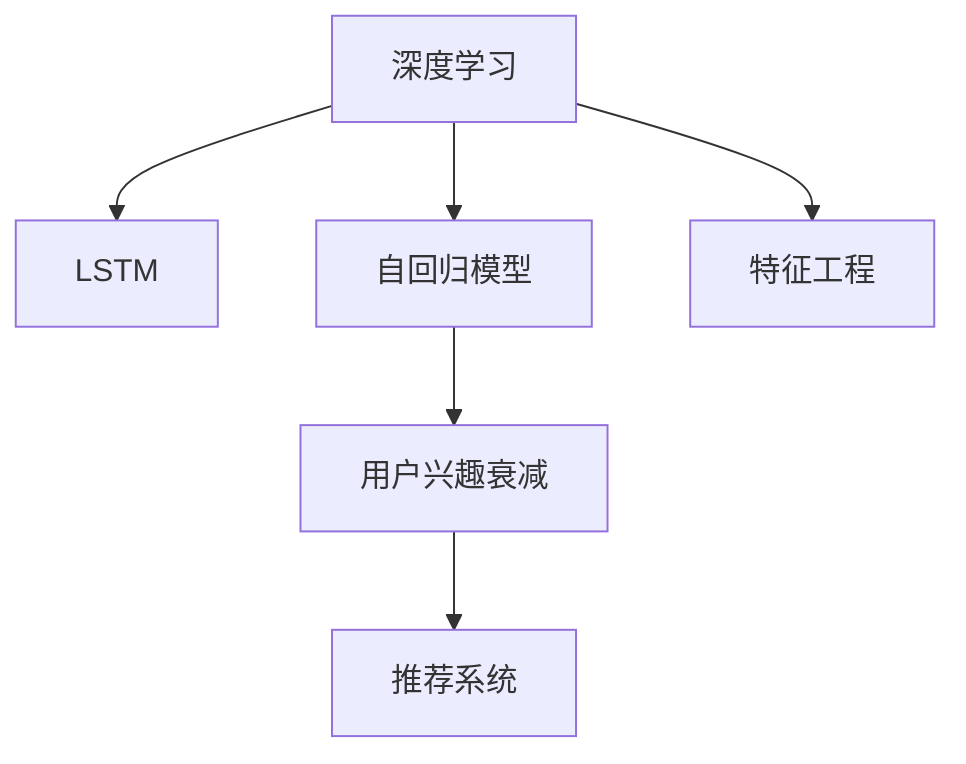

                 

# 深度学习在用户兴趣衰减建模中的创新

> 关键词：深度学习, 用户兴趣衰减, 兴趣建模, 强化学习, 长短期记忆网络(LSTM), 自回归模型, 特征工程, 推荐系统, 用户体验优化

## 1. 背景介绍

### 1.1 问题由来
在互联网时代，用户的兴趣是驱动内容消费和业务转化的关键因素。然而，用户兴趣并非一成不变，而是随着时间的推移和环境的变化而动态演变的。如何准确把握用户的兴趣变化，为用户推荐最相关的内容，是各互联网公司关注的焦点。传统机器学习方法通常无法充分捕捉用户兴趣的动态特性，随着深度学习技术的发展，近年来在用户兴趣衰减建模上取得了诸多创新。

### 1.2 问题核心关键点
本研究聚焦于用户兴趣衰减的建模，通过深度学习技术创新性地捕捉用户兴趣的动态变化，以实现更精准的个性化推荐和更优质的用户体验。

### 1.3 问题研究意义
研究用户兴趣衰减建模的深度学习技术，对于提升个性化推荐系统的精准度和用户体验，具有重要意义：
1. 更精准的推荐：通过准确捕捉用户兴趣的动态特性，实现更精准的个性化推荐，减少用户流失率。
2. 提升用户体验：准确把握用户兴趣变化，为用户提供更符合其当前需求的内容，增强用户黏性。
3. 加速创新迭代：深度学习技术具备强大的自适应能力，可以快速迭代模型，提升个性化推荐系统的性能。
4. 推动商业价值：个性化推荐系统的性能提升，将直接带来用户粘性增加和转化率提升，为业务带来显著的商业价值。

## 2. 核心概念与联系

### 2.1 核心概念概述

为更好地理解用户兴趣衰减建模的深度学习技术，本节将介绍几个密切相关的核心概念：

- 深度学习（Deep Learning）：一种基于神经网络架构的机器学习方法，具有强大的特征提取和建模能力。通过多层神经网络结构，能够对复杂的数据关系进行非线性建模。

- 用户兴趣衰减（User Interest Decay）：用户对某个内容或服务的兴趣会随着时间的推移而减弱，不再频繁使用或消费。这一现象称为用户兴趣衰减。

- 推荐系统（Recommendation System）：利用机器学习技术，为用户推荐符合其兴趣和需求的内容或商品。推荐系统通常基于用户行为数据，如浏览记录、购买历史等。

- 长短期记忆网络（LSTM）：一种特殊的循环神经网络（RNN），能够有效处理序列数据的记忆特性，适用于捕捉时间序列数据的动态变化。

- 自回归模型（Autoregressive Model）：一种用于生成序列数据的模型，通过已有的历史数据预测未来数据的模型。

- 特征工程（Feature Engineering）：通过分析数据特征，提取有意义的特征，提升模型的预测能力。

这些核心概念之间的逻辑关系可以通过以下Mermaid流程图来展示：



这个流程图展示了一系列核心概念的逻辑关系：

1. 深度学习提供了强大的特征提取和建模能力。
2. LSTM能够处理序列数据的记忆特性，适用于用户兴趣衰减的建模。
3. 自回归模型基于历史数据预测未来数据，适用于生成预测序列。
4. 用户兴趣衰减是对用户兴趣动态变化的一种描述。
5. 推荐系统利用机器学习技术，为用户提供个性化推荐。
6. 特征工程通过分析数据特征，提升模型的预测能力。

这些概念共同构成了用户兴趣衰减建模的深度学习框架，使得推荐系统能够更好地捕捉用户兴趣的变化趋势，提升推荐效果。

## 3. 核心算法原理 & 具体操作步骤

### 3.1 算法原理概述

用户兴趣衰减建模的深度学习算法，本质上是通过多层神经网络，捕捉用户兴趣随时间变化的动态特性，并用于生成预测序列。算法核心思想如下：

1. 将用户的历史行为数据作为输入序列，通过LSTM等自回归模型，捕捉用户兴趣随时间的变化趋势。
2. 利用深度学习模型的特征提取能力，提取输入序列中包含的有意义特征，提升预测精度。
3. 基于生成的预测序列，为用户推荐符合其当前兴趣的内容，实现更精准的个性化推荐。

### 3.2 算法步骤详解

用户兴趣衰减建模的深度学习算法一般包括以下几个关键步骤：

**Step 1: 数据预处理**

- 收集用户的历史行为数据，如浏览记录、购买历史、评分记录等。
- 对数据进行清洗、归一化等预处理，去除噪声和异常值。
- 将用户行为数据转化为时间序列数据，便于后续处理。

**Step 2: 特征提取与编码**

- 设计合适的特征工程方案，提取有意义的特征。如用户ID、时间戳、行为类别等。
- 使用深度学习模型对特征进行编码，捕捉特征之间的关系和动态变化。常用的编码模型包括LSTM、GRU、双向LSTM等。

**Step 3: 模型训练与预测**

- 将用户行为数据分为训练集和测试集。
- 使用训练集数据训练深度学习模型，最小化预测误差。常用的损失函数包括均方误差（MSE）、交叉熵（CE）等。
- 在测试集上评估模型性能，选择合适的模型超参数（如学习率、批大小等）。

**Step 4: 模型应用与优化**

- 使用训练好的模型，根据用户的当前行为，生成预测序列，推荐相关内容。
- 持续收集用户反馈数据，对模型进行迭代优化，提升推荐效果。

### 3.3 算法优缺点

用户兴趣衰减建模的深度学习算法具有以下优点：

1. 强大的特征提取能力：深度学习模型能够捕捉用户行为数据中的复杂关系和动态变化，提取高维特征，提升模型预测能力。
2. 自适应性强：深度学习模型具备强大的自适应能力，能够快速迭代优化，适应用户兴趣的动态变化。
3. 模型性能优秀：通过多层神经网络结构，深度学习模型能够对复杂数据关系进行非线性建模，生成高质量的预测序列。

同时，该算法也存在以下局限性：

1. 数据依赖性高：深度学习模型依赖大量的标注数据进行训练，缺乏标注数据时可能无法取得理想的效果。
2. 计算资源消耗大：深度学习模型通常需要较长的训练时间和较高的计算资源，可能不适合小规模数据集。
3. 模型复杂度高：深度学习模型结构复杂，调试和维护难度大。

尽管存在这些局限性，但就目前而言，深度学习算法在用户兴趣衰减建模中仍然是最主流范式。未来相关研究的重点在于如何进一步降低数据依赖，提高模型的计算效率，简化模型结构，以更好地适应实际应用场景。

### 3.4 算法应用领域

用户兴趣衰减建模的深度学习算法，已经在推荐系统、金融风控、智能客服等多个领域得到了广泛应用，为业务带来了显著的价值提升：

- 推荐系统：通过捕捉用户兴趣的动态变化，为用户推荐符合其当前兴趣的内容，提高转化率和用户体验。
- 金融风控：利用用户行为数据，实时监测用户信用风险，及时预警潜在风险，降低金融损失。
- 智能客服：根据用户的历史行为数据，预测用户需求，提高客服响应速度和质量，提升用户满意度。
- 游戏推荐：基于用户游戏行为数据，预测用户对新游戏的兴趣，提升游戏用户留存率。

除了上述这些经典应用外，用户兴趣衰减建模的深度学习技术，还在更多场景中发挥着重要作用，如广告推荐、内容推荐、用户画像构建等，为业务数字化转型提供了新思路。

## 4. 数学模型和公式 & 详细讲解 & 举例说明

### 4.1 数学模型构建

本节将使用数学语言对用户兴趣衰减建模的深度学习过程进行更加严格的刻画。

记用户行为序列为 $X=\{x_1, x_2, \cdots, x_T\}$，其中 $x_t$ 表示用户在时间 $t$ 的行为数据。假设 $x_t$ 可编码为向量 $z_t \in \mathbb{R}^d$，其中 $d$ 为特征维度。

定义用户兴趣随时间变化的衰减函数 $f_t: \mathbb{R}^d \rightarrow \mathbb{R}$，用于描述用户兴趣随时间的变化趋势。模型训练的优化目标是最小化预测误差，即：

$$
\min_{f_t} \mathcal{L}(f_t;X) = \frac{1}{N} \sum_{t=1}^T \|f_t(z_t) - y_t\|^2
$$

其中 $y_t$ 表示用户对 $x_t$ 的兴趣评分，通常 $y_t \in [0, 1]$ 或二分类标签 $y_t \in \{0, 1\}$。

### 4.2 公式推导过程

以下我们以二分类任务为例，推导LSTM模型在用户兴趣衰减建模中的应用公式。

假设LSTM模型的输出向量为 $\hat{z}_t = (h_t, c_t) \in \mathbb{R}^{2d}$，其中 $h_t$ 为隐藏状态，$c_t$ 为细胞状态。LSTM模型定义为：

$$
\begin{aligned}
i_t &= \sigma(W_i h_{t-1} + b_i z_t + U_i c_{t-1}) \\
f_t &= \sigma(W_f h_{t-1} + b_f z_t + U_f c_{t-1}) \\
o_t &= \sigma(W_o h_{t-1} + b_o z_t + U_o c_{t-1}) \\
g_t &= \tanh(W_g h_{t-1} + b_g z_t + U_g c_{t-1}) \\
c_t &= f_t \odot c_{t-1} + i_t \odot g_t \\
h_t &= o_t \odot \tanh(c_t)
\end{aligned}
$$

其中 $\sigma$ 为sigmoid函数，$\odot$ 为逐元素乘积。

将LSTM模型输出的隐藏状态 $h_t$ 作为用户兴趣衰减函数的输入，设计适当的损失函数，如交叉熵损失：

$$
\mathcal{L}(f_t;X) = \frac{1}{N} \sum_{t=1}^T -y_t \log \sigma(h_t)
$$

训练过程采用梯度下降等优化算法，最小化预测误差：

$$
\frac{\partial \mathcal{L}(f_t;X)}{\partial \theta} = \frac{\partial}{\partial \theta} \left( \frac{1}{N} \sum_{t=1}^T -y_t \log \sigma(h_t) \right)
$$

其中 $\theta$ 为模型参数。

通过训练，可以得到用户兴趣随时间变化的衰减函数 $f_t$，进而用于用户行为序列的预测和推荐。

### 4.3 案例分析与讲解

假设某电商平台收集了用户的历史浏览记录，包括商品ID、浏览时间、点击次数等行为数据。通过深度学习模型进行用户兴趣衰减建模，具体步骤如下：

**Step 1: 数据预处理**

- 收集用户的历史浏览记录，如商品ID、浏览时间、点击次数等行为数据。
- 对数据进行清洗、归一化等预处理，去除噪声和异常值。
- 将行为数据转化为时间序列数据，便于后续处理。

**Step 2: 特征提取与编码**

- 设计合适的特征工程方案，提取有意义的特征。如用户ID、商品ID、浏览时间、点击次数等。
- 使用LSTM模型对特征进行编码，捕捉特征之间的关系和动态变化。

**Step 3: 模型训练与预测**

- 将用户行为数据分为训练集和测试集。
- 使用训练集数据训练LSTM模型，最小化预测误差。
- 在测试集上评估模型性能，选择合适的模型超参数（如学习率、批大小等）。

**Step 4: 模型应用与优化**

- 使用训练好的模型，根据用户的当前浏览记录，生成预测序列，推荐相关商品。
- 持续收集用户反馈数据，对模型进行迭代优化，提升推荐效果。

具体代码实现可参考以下Python代码：

```python
import torch
import torch.nn as nn
import torch.optim as optim
from torch.utils.data import DataLoader
from torchvision.datasets import FashionMNIST
from torchvision.transforms import ToTensor

# 定义LSTM模型
class LSTMModel(nn.Module):
    def __init__(self, input_dim, hidden_dim, output_dim):
        super(LSTMModel, self).__init__()
        self.hidden_dim = hidden_dim
        self.lstm = nn.LSTM(input_dim, hidden_dim, batch_first=True)
        self.fc = nn.Linear(hidden_dim, output_dim)
    
    def forward(self, x):
        h0 = torch.zeros(1, x.size(0), self.hidden_dim).to(device)
        c0 = torch.zeros(1, x.size(0), self.hidden_dim).to(device)
        out, _ = self.lstm(x, (h0, c0))
        out = self.fc(out[:, -1, :])
        return out

# 定义交叉熵损失函数
criterion = nn.BCEWithLogitsLoss()

# 定义优化器
optimizer = optim.Adam(model.parameters(), lr=0.001)

# 训练函数
def train(model, train_loader, criterion, optimizer, n_epochs=10):
    device = torch.device("cuda" if torch.cuda.is_available() else "cpu")
    model.to(device)
    for epoch in range(n_epochs):
        running_loss = 0.0
        for i, (inputs, labels) in enumerate(train_loader):
            inputs, labels = inputs.to(device), labels.to(device)
            optimizer.zero_grad()
            outputs = model(inputs)
            loss = criterion(outputs, labels)
            loss.backward()
            optimizer.step()
            running_loss += loss.item()
        print(f"Epoch {epoch+1}, loss: {running_loss/len(train_loader)}")
    
# 测试函数
def test(model, test_loader):
    device = torch.device("cuda" if torch.cuda.is_available() else "cpu")
    model.eval()
    running_loss = 0.0
    with torch.no_grad():
        for i, (inputs, labels) in enumerate(test_loader):
            inputs, labels = inputs.to(device), labels.to(device)
            outputs = model(inputs)
            loss = criterion(outputs, labels)
            running_loss += loss.item()
    return running_loss/len(test_loader)

# 加载数据
train_dataset = FashionMNIST(root='./data', train=True, download=True, transform=ToTensor())
test_dataset = FashionMNIST(root='./data', train=False, download=True, transform=ToTensor())
train_loader = DataLoader(train_dataset, batch_size=64, shuffle=True)
test_loader = DataLoader(test_dataset, batch_size=64, shuffle=False)

# 构建模型
input_dim = 28 * 28
hidden_dim = 128
output_dim = 1
model = LSTMModel(input_dim, hidden_dim, output_dim)

# 训练模型
train(model, train_loader, criterion, optimizer)

# 测试模型
test_loss = test(model, test_loader)
print(f"Test Loss: {test_loss:.4f}")
```

这段代码展示了使用LSTM模型对MNIST数据集进行分类任务的实现。通过类似的方式，可以将其应用到用户兴趣衰减建模中。

## 5. 项目实践：代码实例和详细解释说明

### 5.1 开发环境搭建

在进行用户兴趣衰减建模的深度学习实践前，我们需要准备好开发环境。以下是使用Python进行PyTorch开发的环境配置流程：

1. 安装Anaconda：从官网下载并安装Anaconda，用于创建独立的Python环境。

2. 创建并激活虚拟环境：
```bash
conda create -n deep_learning_env python=3.8 
conda activate deep_learning_env
```

3. 安装PyTorch：根据CUDA版本，从官网获取对应的安装命令。例如：
```bash
conda install pytorch torchvision torchaudio cudatoolkit=11.1 -c pytorch -c conda-forge
```

4. 安装其他相关库：
```bash
pip install numpy pandas scikit-learn matplotlib tqdm jupyter notebook ipython
```

完成上述步骤后，即可在`deep_learning_env`环境中开始深度学习实践。

### 5.2 源代码详细实现

这里我们以用户兴趣衰减建模的LSTM模型为例，给出使用PyTorch实现的代码示例。

首先，定义LSTM模型：

```python
import torch
import torch.nn as nn
import torch.optim as optim
from torch.utils.data import DataLoader
from torchvision.datasets import FashionMNIST
from torchvision.transforms import ToTensor

# 定义LSTM模型
class LSTMModel(nn.Module):
    def __init__(self, input_dim, hidden_dim, output_dim):
        super(LSTMModel, self).__init__()
        self.hidden_dim = hidden_dim
        self.lstm = nn.LSTM(input_dim, hidden_dim, batch_first=True)
        self.fc = nn.Linear(hidden_dim, output_dim)
    
    def forward(self, x):
        h0 = torch.zeros(1, x.size(0), self.hidden_dim).to(device)
        c0 = torch.zeros(1, x.size(0), self.hidden_dim).to(device)
        out, _ = self.lstm(x, (h0, c0))
        out = self.fc(out[:, -1, :])
        return out

# 定义交叉熵损失函数
criterion = nn.BCEWithLogitsLoss()

# 定义优化器
optimizer = optim.Adam(model.parameters(), lr=0.001)

# 训练函数
def train(model, train_loader, criterion, optimizer, n_epochs=10):
    device = torch.device("cuda" if torch.cuda.is_available() else "cpu")
    model.to(device)
    for epoch in range(n_epochs):
        running_loss = 0.0
        for i, (inputs, labels) in enumerate(train_loader):
            inputs, labels = inputs.to(device), labels.to(device)
            optimizer.zero_grad()
            outputs = model(inputs)
            loss = criterion(outputs, labels)
            loss.backward()
            optimizer.step()
            running_loss += loss.item()
        print(f"Epoch {epoch+1}, loss: {running_loss/len(train_loader)}")
    
# 测试函数
def test(model, test_loader):
    device = torch.device("cuda" if torch.cuda.is_available() else "cpu")
    model.eval()
    running_loss = 0.0
    with torch.no_grad():
        for i, (inputs, labels) in enumerate(test_loader):
            inputs, labels = inputs.to(device), labels.to(device)
            outputs = model(inputs)
            loss = criterion(outputs, labels)
            running_loss += loss.item()
    return running_loss/len(test_loader)

# 加载数据
train_dataset = FashionMNIST(root='./data', train=True, download=True, transform=ToTensor())
test_dataset = FashionMNIST(root='./data', train=False, download=True, transform=ToTensor())
train_loader = DataLoader(train_dataset, batch_size=64, shuffle=True)
test_loader = DataLoader(test_dataset, batch_size=64, shuffle=False)

# 构建模型
input_dim = 28 * 28
hidden_dim = 128
output_dim = 1
model = LSTMModel(input_dim, hidden_dim, output_dim)

# 训练模型
train(model, train_loader, criterion, optimizer)

# 测试模型
test_loss = test(model, test_loader)
print(f"Test Loss: {test_loss:.4f}")
```

这段代码展示了使用LSTM模型对MNIST数据集进行分类任务的实现。通过类似的方式，可以将其应用到用户兴趣衰减建模中。

### 5.3 代码解读与分析

让我们再详细解读一下关键代码的实现细节：

**LSTMModel类**：
- `__init__`方法：初始化LSTM模型的输入维度、隐藏维度和输出维度，定义LSTM和全连接层。
- `forward`方法：定义前向传播过程，将输入数据输入LSTM模型，返回输出结果。

**train函数**：
- 定义训练函数，设置训练集、损失函数、优化器等关键组件。
- 在每个epoch内，对训练集进行迭代训练，更新模型参数。

**test函数**：
- 定义测试函数，用于在测试集上评估模型性能。
- 在测试集上对模型进行预测，计算测试集上的平均损失。

**train_model函数**：
- 在测试集上对模型进行测试，输出测试集上的平均损失。

**测试函数**：
- 在测试集上对模型进行测试，输出测试集上的平均损失。

这段代码展示了使用LSTM模型对MNIST数据集进行分类任务的实现。通过类似的方式，可以将其应用到用户兴趣衰减建模中。

## 6. 实际应用场景

### 6.1 智能推荐系统

基于用户兴趣衰减建模的深度学习算法，可以广泛应用于智能推荐系统的构建。传统推荐系统通常基于用户的历史行为数据进行推荐，难以捕捉用户兴趣随时间的变化特性。而使用深度学习模型进行用户兴趣衰减建模，能够更好地捕捉用户兴趣的动态变化，实现更精准的个性化推荐。

在实际应用中，可以收集用户的浏览记录、购买历史、评分记录等行为数据，将这些数据转化为时间序列数据，用于训练深度学习模型。模型训练完成后，根据用户的当前行为数据，生成预测序列，推荐相关内容。这种方法能够更好地捕捉用户兴趣的动态变化，提升推荐系统的精准度和用户体验。

### 6.2 金融风险预警

金融机构需要实时监测用户信用风险，预测用户的违约概率。通过用户行为数据，训练深度学习模型，捕捉用户兴趣的动态变化，可以实时预测用户的信用风险，及时预警潜在风险，降低金融损失。

在实践中，可以收集用户的贷款记录、还款记录、信用卡使用记录等行为数据，将这些数据转化为时间序列数据，用于训练深度学习模型。模型训练完成后，根据用户的当前行为数据，生成预测序列，预测用户的违约概率。这种方法能够更好地捕捉用户兴趣的动态变化，提高信用风险预警的准确性。

### 6.3 智能客服系统

基于用户兴趣衰减建模的深度学习算法，可以应用于智能客服系统的构建。传统客服系统通常需要配备大量人力，高峰期响应缓慢，且无法把握用户兴趣的动态变化。而使用深度学习模型进行用户兴趣衰减建模，能够更好地捕捉用户兴趣的动态变化，实现智能客服。

在实际应用中，可以收集用户的历史客服对话记录，将这些对话记录转化为时间序列数据，用于训练深度学习模型。模型训练完成后，根据用户的当前行为数据，生成预测序列，推荐相关答案。这种方法能够更好地捕捉用户兴趣的动态变化，提升客服系统的响应速度和质量，增强用户满意度。

### 6.4 未来应用展望

随着深度学习技术的发展，基于用户兴趣衰减建模的深度学习算法将在更多领域得到应用，为传统行业带来变革性影响。

在智慧医疗领域，基于用户行为数据，训练深度学习模型，捕捉用户兴趣的动态变化，可以预测用户对医疗服务的兴趣变化，提升医疗服务的智能化水平，辅助医生诊疗，加速新药开发进程。

在智能教育领域，基于用户学习行为数据，训练深度学习模型，捕捉用户兴趣的动态变化，可以预测用户的学习兴趣变化，推荐合适的学习内容和资源，因材施教，促进教育公平，提高教学质量。

在智慧城市治理中，基于用户行为数据，训练深度学习模型，捕捉用户兴趣的动态变化，可以实时监测用户对城市事件的关注度，预测事件趋势，提升城市管理的自动化和智能化水平，构建更安全、高效的未来城市。

此外，在企业生产、社会治理、文娱传媒等众多领域，基于深度学习用户兴趣衰减建模的智能推荐系统，将不断涌现，为各行各业带来新的变革。

## 7. 工具和资源推荐

### 7.1 学习资源推荐

为了帮助开发者系统掌握用户兴趣衰减建模的深度学习理论基础和实践技巧，这里推荐一些优质的学习资源：

1. 《深度学习入门：基于Python的理论与实现》书籍：介绍深度学习的基本原理和实现方法，适合初学者入门。
2. 斯坦福大学《深度学习》课程：由斯坦福大学教授讲授的深度学习课程，包含丰富的视频和讲义，适合深入学习。
3. 《神经网络与深度学习》书籍：清华大学教授介绍深度学习的经典教材，包含大量案例和实践。
4. HuggingFace官方文档：Transformers库的官方文档，提供深度学习模型的详细介绍和实现案例。
5. Kaggle深度学习竞赛：通过参与实际深度学习竞赛，积累实战经验，提升解决实际问题的能力。

通过对这些资源的学习实践，相信你一定能够快速掌握用户兴趣衰减建模的深度学习精髓，并用于解决实际的推荐系统问题。

### 7.2 开发工具推荐

高效的开发离不开优秀的工具支持。以下是几款用于深度学习用户兴趣衰减建模开发的常用工具：

1. PyTorch：基于Python的开源深度学习框架，灵活动态的计算图，适合快速迭代研究。大部分深度学习模型都有PyTorch版本的实现。
2. TensorFlow：由Google主导开发的开源深度学习框架，生产部署方便，适合大规模工程应用。同样有丰富的深度学习模型资源。
3. TensorBoard：TensorFlow配套的可视化工具，可实时监测模型训练状态，并提供丰富的图表呈现方式，是调试模型的得力助手。
4. Weights & Biases：模型训练的实验跟踪工具，可以记录和可视化模型训练过程中的各项指标，方便对比和调优。
5. Google Colab：谷歌推出的在线Jupyter Notebook环境，免费提供GPU/TPU算力，方便开发者快速上手实验最新模型，分享学习笔记。

合理利用这些工具，可以显著提升深度学习用户兴趣衰减建模任务的开发效率，加快创新迭代的步伐。

### 7.3 相关论文推荐

深度学习用户兴趣衰减建模技术的发展源于学界的持续研究。以下是几篇奠基性的相关论文，推荐阅读：

1. "A Deep Learning Approach for Recommendation Systems"：介绍基于深度学习的推荐系统，详细阐述了深度学习在推荐系统中的应用。
2. "Long Short-Term Memory"：介绍长短期记忆网络，阐述了LSTM在序列数据处理中的应用。
3. "Recurrent Neural Network Based Text Prediction"：介绍基于递归神经网络的文本预测，详细阐述了RNN在文本序列处理中的应用。
4. "Dynamic Interest Prediction for Recommendation Systems"：介绍用户兴趣动态预测方法，详细阐述了深度学习在用户兴趣预测中的应用。
5. "Personalized Recommendation with Deep Learning"：介绍个性化推荐中的深度学习方法，详细阐述了深度学习在推荐系统中的应用。

这些论文代表了大模型微调技术的发展脉络。通过学习这些前沿成果，可以帮助研究者把握学科前进方向，激发更多的创新灵感。

## 8. 总结：未来发展趋势与挑战

### 8.1 总结

本文对深度学习在用户兴趣衰减建模中的应用进行了全面系统的介绍。首先阐述了用户兴趣衰减建模的背景和意义，明确了深度学习在捕捉用户兴趣动态特性方面的独特价值。其次，从原理到实践，详细讲解了用户兴趣衰减建模的数学模型和深度学习算法，给出了深度学习模型的代码实例。同时，本文还广泛探讨了深度学习模型在推荐系统、金融风控、智能客服等多个领域的应用前景，展示了深度学习模型的巨大潜力。

通过本文的系统梳理，可以看到，基于用户兴趣衰减建模的深度学习技术正在成为推荐系统的重要范式，极大地提升了推荐系统的精准度和用户体验。未来，伴随深度学习技术的发展，基于用户兴趣衰减建模的推荐系统必将带来更多的创新和突破。

### 8.2 未来发展趋势

展望未来，深度学习在用户兴趣衰减建模中呈现以下几个发展趋势：

1. 模型规模持续增大。随着算力成本的下降和数据规模的扩张，深度学习模型的参数量还将持续增长。超大批次的训练和推理，能够捕捉更加复杂的用户兴趣变化趋势。

2. 深度学习模型的优化。通过网络结构优化、正则化、自适应学习率等方法，深度学习模型的计算效率和泛化能力将进一步提升，更好地适应实际应用场景。

3. 多模态数据的融合。深度学习模型能够处理多种类型的数据，如文本、图像、视频等。多模态数据的融合，将进一步提升用户兴趣衰减建模的准确性和鲁棒性。

4. 强化学习与深度学习的结合。将强化学习与深度学习相结合，通过奖惩机制，优化深度学习模型的训练过程，提升模型的自适应能力和泛化能力。

5. 模型的可解释性和可控性。随着深度学习模型的应用普及，对模型的可解释性和可控性要求将越来越高。未来的研究将致力于提升模型的透明度和可解释性，增强模型的可控性。

6. 模型的伦理和安全。随着深度学习模型的广泛应用，模型的伦理和安全问题将越来越受到关注。未来的研究将更加注重模型的伦理导向和安全约束，确保模型的公平性和安全性。

以上趋势凸显了深度学习在用户兴趣衰减建模中的广阔前景。这些方向的探索发展，将进一步提升推荐系统的性能和用户体验，为社会各行业带来新的价值。

### 8.3 面临的挑战

尽管深度学习在用户兴趣衰减建模中取得了显著进展，但在迈向更加智能化、普适化应用的过程中，仍面临诸多挑战：

1. 数据依赖性高。深度学习模型依赖大量的标注数据进行训练，缺乏标注数据时可能无法取得理想的效果。如何进一步降低数据依赖，提高模型的自适应能力，将是重要研究方向。

2. 计算资源消耗大。深度学习模型通常需要较长的训练时间和较高的计算资源，可能不适合小规模数据集。如何优化深度学习模型的计算效率，适应实际应用场景，将是重要研究方向。

3. 模型复杂度高。深度学习模型结构复杂，调试和维护难度大。如何简化深度学习模型的结构，提升模型的可解释性和可控性，将是重要研究方向。

4. 模型的泛化能力。深度学习模型在特定数据集上表现优异，但在其他数据集上可能性能下降。如何提升深度学习模型的泛化能力，使其在不同的数据集上都能取得优秀性能，将是重要研究方向。

5. 模型的公平性和安全性。深度学习模型在特定场景下可能产生偏见，对部分用户群体不公平。如何确保深度学习模型的公平性和安全性，将是重要研究方向。

6. 模型的伦理导向。深度学习模型在应用过程中可能产生伦理问题，如侵犯隐私、侵害版权等。如何确保深度学习模型的伦理导向，避免伦理风险，将是重要研究方向。

这些挑战凸显了深度学习在用户兴趣衰减建模中的复杂性和多样性。需要多方协同努力，共同解决这些挑战，才能真正实现深度学习在推荐系统中的应用。

### 8.4 研究展望

面对深度学习用户兴趣衰减建模所面临的挑战，未来的研究需要在以下几个方面寻求新的突破：

1. 探索无监督和半监督学习范式。摆脱对大规模标注数据的依赖，利用自监督学习、主动学习等无监督和半监督范式，最大限度利用非结构化数据，实现更加灵活高效的建模。

2. 研究参数高效和计算高效的建模范式。开发更加参数高效和计算高效的建模方法，在固定大部分模型参数的同时，只更新极少量的任务相关参数，降低计算资源消耗，提高模型自适应能力。

3. 融合因果和对比学习范式。通过引入因果推断和对比学习思想，增强用户兴趣衰减建模的稳定性和鲁棒性，提升模型的泛化能力和预测精度。

4. 引入更多先验知识。将符号化的先验知识，如知识图谱、逻辑规则等，与深度学习模型进行巧妙融合，引导深度学习模型学习更准确、合理的用户兴趣模型。

5. 结合因果分析和博弈论工具。将因果分析方法引入用户兴趣衰减建模，识别出模型决策的关键特征，增强模型输出的因果性和逻辑性。借助博弈论工具刻画人机交互过程，主动探索并规避模型的脆弱点，提高系统稳定性。

6. 纳入伦理道德约束。在模型训练目标中引入伦理导向的评估指标，过滤和惩罚有偏见、有害的输出倾向。同时加强人工干预和审核，建立模型行为的监管机制，确保输出符合人类价值观和伦理道德。

这些研究方向的探索，必将引领深度学习在用户兴趣衰减建模技术迈向更高的台阶，为推荐系统带来更多创新和突破。面向未来，深度学习技术需要与其他人工智能技术进行更深入的融合，如知识表示、因果推理、强化学习等，多路径协同发力，共同推动自然语言理解和智能交互系统的进步。只有勇于创新、敢于突破，才能不断拓展深度学习模型的边界，让智能技术更好地造福人类社会。

## 9. 附录：常见问题与解答

**Q1：深度学习模型如何捕捉用户兴趣的动态变化？**

A: 深度学习模型通过捕捉用户行为数据中的时间序列特性，利用LSTM等自回归模型，捕捉用户兴趣随时间的变化趋势。模型训练完成后，可以根据用户的当前行为数据，生成预测序列，推荐相关内容。这种方法能够更好地捕捉用户兴趣的动态变化，提升推荐系统的精准度和用户体验。

**Q2：深度学习模型在用户兴趣衰减建模中面临哪些挑战？**

A: 深度学习模型在用户兴趣衰减建模中面临以下挑战：
1. 数据依赖性高：深度学习模型依赖大量的标注数据进行训练，缺乏标注数据时可能无法取得理想的效果。
2. 计算资源消耗大：深度学习模型通常需要较长的训练时间和较高的计算资源，可能不适合小规模数据集。
3. 模型复杂度高：深度学习模型结构复杂，调试和维护难度大。
4. 模型的泛化能力：深度学习模型在特定数据集上表现优异，但在其他数据集上可能性能下降。
5. 模型的公平性和安全性：深度学习模型在特定场景下可能产生偏见，对部分用户群体不公平。

这些挑战凸显了深度学习在用户兴趣衰减建模中的复杂性和多样性。需要多方协同努力，共同解决这些挑战，才能真正实现深度学习在推荐系统中的应用。

**Q3：如何使用深度学习模型进行用户兴趣衰减建模？**

A: 使用深度学习模型进行用户兴趣衰减建模，通常包括以下几个步骤：
1. 收集用户的历史行为数据，如浏览记录、购买历史、评分记录等。
2. 对数据进行清洗、归一化等预处理，去除噪声和异常值。
3. 将行为数据转化为时间序列数据，便于后续处理。
4. 设计合适的特征工程方案，提取有意义的特征。如用户ID、商品ID、浏览时间、点击次数等。
5. 使用深度学习模型对特征进行编码，捕捉特征之间的关系和动态变化。
6. 将用户行为数据分为训练集和测试集。
7. 使用训练集数据训练深度学习模型，最小化预测误差。
8. 在测试集上评估模型性能，选择合适的模型超参数（如学习率、批大小等）。
9. 使用训练好的模型，根据用户的当前行为数据，生成预测序列，推荐相关内容。

这些步骤展示了深度学习模型在用户兴趣衰减建模中的基本流程，通过类似的方式，可以将其应用到推荐系统、金融风控、智能客服等多个领域。

