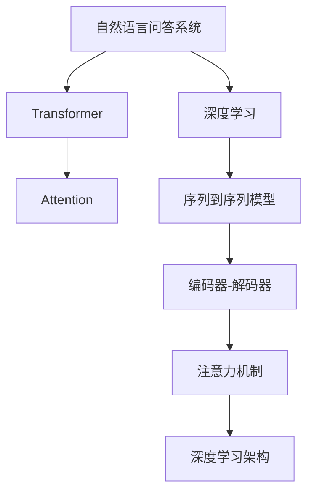

                 

# 深度学习在自然语言问答系统中的应用

## 1. 背景介绍

### 1.1 问题由来
随着人工智能技术的迅猛发展，自然语言处理（NLP）已成为机器学习（ML）和深度学习（DL）领域中最活跃的研究方向之一。自然语言问答系统（NLQS）是NLP应用的一个重要分支，旨在利用深度学习模型自动解答用户提问，以实现智能交互和信息检索。

近年来，基于深度学习的NLQS取得了显著进展，涌现出多种高效的模型架构，如循环神经网络（RNN）、卷积神经网络（CNN）、Transformer等。其中，Transformer模型因其卓越的序列建模能力和计算效率，成为目前主流的选择。

本文将重点介绍Transformer模型在NLQS中的应用，探讨其在信息检索、智能客服、教育问答等实际场景中的高效实现，并总结其优势和挑战，展望未来的研究方向。

### 1.2 问题核心关键点
深度学习在自然语言问答系统中的应用涉及以下几个核心关键点：
- 数据预处理：包括分词、向量化、数据增强等，是深度学习模型的基础。
- 模型构建：选择合适的深度学习架构，如Transformer、Attention机制等，以捕捉序列依赖关系。
- 训练过程：通过反向传播算法优化模型参数，最小化损失函数，提升模型效果。
- 模型评估：采用交叉验证、BLEU、ROUGE等指标评估模型性能。
- 系统部署：将模型集成到实时问答系统中，提供高效、稳定的服务。

## 2. 核心概念与联系

### 2.1 核心概念概述

为了更好地理解深度学习在NLQS中的应用，本文将介绍几个密切相关的核心概念：

- **自然语言问答系统（NLQS）**：利用深度学习模型自动解答用户提问的系统，涵盖信息检索、智能客服、教育问答等多个领域。
- **深度学习**：一类基于神经网络的学习方法，通过反向传播算法优化模型参数，实现序列建模、特征提取等。
- **Transformer**：一种基于自注意力机制的深度学习架构，能够高效处理序列数据，捕捉长距离依赖关系。
- **Attention机制**：一种用于优化神经网络序列建模的技术，能够动态计算输入序列中的重要特征。
- **序列到序列（Seq2Seq）模型**：一种常用于NLQS任务的深度学习模型架构，包括编码器-解码器结构，用于序列数据的生成和预测。

这些概念之间的逻辑关系可以通过以下Mermaid流程图来展示：



这个流程图展示了大语言模型的核心概念及其之间的关系：

1. 深度学习是大语言模型的基础。
2. Transformer是深度学习中的一种重要架构，能够高效处理序列数据。
3. Attention机制用于优化Transformer架构，捕捉序列依赖关系。
4. Seq2Seq模型是Transformer的一种应用，用于信息检索、问答等任务。
5. 以上概念共同构成了大语言模型的学习和应用框架，使其能够在各种场景下发挥强大的语言理解和生成能力。

## 3. 核心算法原理 & 具体操作步骤

### 3.1 算法原理概述

基于Transformer的NLQS应用，主要分为两个阶段：预训练和微调。

1. **预训练**：利用大规模无标签文本数据，通过自监督学习任务训练Transformer模型，学习通用的语言表示。
2. **微调**：在特定领域或任务的标注数据上，对预训练模型进行有监督训练，优化模型在特定任务上的性能。

Transformer模型在预训练阶段，通常使用掩码语言模型（Masked Language Model, MLM）或下一句预测（Next Sentence Prediction, NSP）任务进行训练。MLM任务通过随机掩码输入序列中的某些词，训练模型预测被掩码的词。NSP任务通过预测两个连续句子是否是相邻的，训练模型对句子间的语义关系进行建模。

在微调阶段，根据具体任务，设计相应的任务适配层，如分类、匹配、生成等。对于分类任务，通常在Transformer模型顶层添加线性分类器和交叉熵损失函数。对于生成任务，通常使用语言模型的解码器输出概率分布，并以负对数似然为损失函数。

### 3.2 算法步骤详解

基于Transformer的NLQS应用通常包括以下几个关键步骤：

**Step 1: 数据预处理**

1. 分词：将文本数据分词为单词或子词（如BPE）。
2. 向量化：将分词后的文本转化为向量形式，可以使用词嵌入（如Word2Vec、GloVe）或预训练语言模型（如BERT、GPT）。
3. 数据增强：通过回译、掩码等方法扩充训练集，增加模型泛化能力。

**Step 2: 模型构建**

1. 编码器：Transformer的编码器包含多个自注意力层和前馈神经网络层，用于捕捉输入序列的语义表示。
2. 解码器：Transformer的解码器同样包含多个自注意力层和前馈神经网络层，用于生成目标序列。
3. 任务适配层：根据具体任务设计适配层，如分类头、匹配头、生成头等。

**Step 3: 训练过程**

1. 优化器选择：通常使用Adam、Adagrad等优化器，设置学习率和批大小。
2. 损失函数选择：根据任务设计相应的损失函数，如交叉熵损失、均方误差损失等。
3. 反向传播：通过反向传播算法更新模型参数，最小化损失函数。
4. 正则化技术：应用L2正则、Dropout、Early Stopping等，防止过拟合。

**Step 4: 模型评估**

1. 交叉验证：使用交叉验证方法评估模型性能，防止过拟合。
2. 性能指标：采用BLEU、ROUGE、F1-score等指标评估模型效果。
3. 模型优化：根据评估结果调整模型结构和参数，提升模型性能。

**Step 5: 系统部署**

1. 模型集成：将训练好的模型集成到实时问答系统中，提供高效服务。
2. 实时推理：采用在线预测的方式，实时处理用户提问，返回回答。
3. 监控维护：实时监控系统性能，及时发现并修复问题。

以上是基于Transformer的NLQS应用的一般流程。在实际应用中，还需要针对具体任务的特点，对模型构建和训练过程进行优化设计，如改进训练目标函数，引入更多的正则化技术，搜索最优的超参数组合等，以进一步提升模型性能。

### 3.3 算法优缺点

基于Transformer的NLQS应用具有以下优点：
1. 高效序列建模：Transformer通过自注意力机制，能够高效处理长距离依赖关系，适用于多种NLP任务。
2. 可扩展性强：通过堆叠Transformer层，模型可以适应不同规模的输入序列，具有较强的可扩展性。
3. 并行计算能力强：Transformer模型的自注意力机制具有高度的并行计算能力，适合在大规模分布式环境中运行。
4. 鲁棒性高：Transformer模型对噪声和噪声干扰具有较好的鲁棒性，能够处理多样化的输入。

同时，该方法也存在一些局限性：
1. 对标注数据依赖：Transformer模型的微调性能很大程度上依赖标注数据的质量和数量，获取高质量标注数据的成本较高。
2. 模型复杂度高：Transformer模型的参数量较大，需要较大的计算资源和内存空间。
3. 过拟合风险：在标注数据不足的情况下，Transformer模型容易过拟合，泛化能力有限。
4. 实时推理复杂：尽管Transformer模型高效，但实时推理仍然较为复杂，需要优化模型结构，降低计算量。

尽管存在这些局限性，但就目前而言，基于Transformer的NLQS应用仍然是深度学习在NLP领域的主流范式。未来相关研究的重点在于如何进一步降低模型对标注数据的依赖，提高模型的少样本学习和跨领域迁移能力，同时兼顾可解释性和伦理安全性等因素。

### 3.4 算法应用领域

基于Transformer的NLQS应用已经广泛应用于多个领域，例如：

- **信息检索**：利用Transformer模型提取问题和文档的语义表示，计算相似度进行排序，快速获取相关信息。
- **智能客服**：通过微调Transformer模型，实现自动回答用户咨询，提升客户满意度。
- **教育问答**：利用Transformer模型自动解答学生问题，辅助教学和知识推荐。
- **医疗问答**：利用Transformer模型解答患者疑问，辅助医生诊断和治疗。
- **智能推荐**：通过微调Transformer模型，实现个性化推荐，提升用户体验。

除了上述这些经典任务外，Transformer模型还被创新性地应用到更多场景中，如情感分析、代码生成、新闻摘要等，为NLP技术带来了新的突破。

## 4. 数学模型和公式 & 详细讲解  
### 4.1 数学模型构建

在基于Transformer的NLQS应用中，我们通常使用以下数学模型进行序列建模：

设输入序列为 $x_1, x_2, ..., x_T$，输出序列为 $y_1, y_2, ..., y_{T'}$。使用Transformer模型对输入序列进行编码，得到编码向量 $Z_1, Z_2, ..., Z_T$，然后通过解码器生成输出序列。

编码器由多个自注意力层和前馈神经网络层组成，可以表示为：

$$
H_i = \text{Self-Attention}(H_{i-1})
$$

其中 $\text{Self-Attention}$ 为自注意力机制，可以计算输入序列中各个位置的相关性，得到编码向量 $Z_i$。

解码器同样由多个自注意力层和前馈神经网络层组成，可以表示为：

$$
H'_i = \text{Self-Attention}(H'_{i-1}) + \text{Multi-Head Attention}(Q_i, K_i, V_i)
$$

其中 $\text{Multi-Head Attention}$ 为多头自注意力机制，可以同时考虑输入序列和输出序列的相关性，得到解码向量 $H'_i$。

### 4.2 公式推导过程

Transformer模型的自注意力机制是其核心，其计算过程如下：

1. 查询向量 $Q_i$：将编码向量 $Z_i$ 通过线性变换得到查询向量 $Q_i$。
2. 键向量 $K_i$：将编码向量 $Z_i$ 通过线性变换得到键向量 $K_i$。
3. 值向量 $V_i$：将编码向量 $Z_i$ 通过线性变换得到值向量 $V_i$。
4. 注意力权重 $A_i$：通过计算查询向量 $Q_i$ 和键向量 $K_i$ 的相似度，得到注意力权重 $A_i$。
5. 加权求和 $H_i$：将注意力权重 $A_i$ 和值向量 $V_i$ 进行加权求和，得到编码向量 $Z_i$。

具体推导过程如下：

设 $Q_i \in \mathbb{R}^{d_k}$，$K_i \in \mathbb{R}^{d_k}$，$V_i \in \mathbb{R}^{d_v}$，$A_i \in \mathbb{R}^{T \times T}$。则：

$$
A_i = \text{Softmax}(Q_i K_i^\top / \sqrt{d_k})
$$

$$
H_i = A_i V_i
$$

其中 $\text{Softmax}$ 函数用于归一化，保证注意力权重 $A_i$ 的和为1。

### 4.3 案例分析与讲解

以信息检索为例，我们可以使用Transformer模型对问题和文档进行编码，计算它们的相似度，从而进行排序。假设查询序列为 $Q_1, Q_2, ..., Q_T$，文档序列为 $D_1, D_2, ..., D_{N_t}$，则可以通过Transformer模型得到查询向量和文档向量：

$$
Q_i = W_Q Z_i
$$

$$
D_i = W_D Z_i
$$

其中 $W_Q, W_D$ 为线性变换矩阵。

然后，我们可以计算查询向量和文档向量之间的余弦相似度，得到它们的相似度矩阵 $S$：

$$
S = \text{cos}(Q_i D_j^\top)
$$

最后，可以对相似度矩阵进行排序，得到文档序列 $D$ 的排名，从而快速获取相关信息。

## 5. 项目实践：代码实例和详细解释说明

### 5.1 开发环境搭建

在进行Transformer模型开发前，我们需要准备好开发环境。以下是使用Python进行PyTorch开发的环境配置流程：

1. 安装Anaconda：从官网下载并安装Anaconda，用于创建独立的Python环境。

2. 创建并激活虚拟环境：
```bash
conda create -n pytorch-env python=3.8 
conda activate pytorch-env
```

3. 安装PyTorch：根据CUDA版本，从官网获取对应的安装命令。例如：
```bash
conda install pytorch torchvision torchaudio cudatoolkit=11.1 -c pytorch -c conda-forge
```

4. 安装Transformer库：
```bash
pip install transformers
```

5. 安装各类工具包：
```bash
pip install numpy pandas scikit-learn matplotlib tqdm jupyter notebook ipython
```

完成上述步骤后，即可在`pytorch-env`环境中开始Transformer模型开发。

### 5.2 源代码详细实现

这里我们以Transformer模型在信息检索中的应用为例，给出PyTorch代码实现。

首先，定义Transformer模型：

```python
from transformers import BertTokenizer, BertModel

class TransformerModel:
    def __init__(self, num_layers, dim_model, num_heads, dim_feedforward, dropout):
        self.encoder = BertModel.from_pretrained('bert-base-cased', num_layers=num_layers, dim_model=dim_model, num_heads=num_heads, dim_feedforward=dim_feedforward, dropout=dropout)
        self.dropout = dropout
        
    def forward(self, input_ids, attention_mask):
        encoder_outputs = self.encoder(input_ids=input_ids, attention_mask=attention_mask)
        return encoder_outputs
```

然后，定义训练和评估函数：

```python
from torch.utils.data import Dataset, DataLoader
from tqdm import tqdm
import numpy as np

class DocumentDataset(Dataset):
    def __init__(self, docs, tokenizer):
        self.docs = docs
        self.tokenizer = tokenizer
        
    def __len__(self):
        return len(self.docs)
    
    def __getitem__(self, item):
        doc = self.docs[item]
        tokens = self.tokenizer(doc, padding='max_length', truncation=True, return_tensors='pt')
        input_ids = tokens['input_ids']
        attention_mask = tokens['attention_mask']
        return {'input_ids': input_ids, 'attention_mask': attention_mask}

def train_model(model, dataset, num_epochs, batch_size):
    device = torch.device('cuda') if torch.cuda.is_available() else torch.device('cpu')
    model.to(device)
    
    optimizer = AdamW(model.parameters(), lr=2e-5)
    loss_fn = nn.CrossEntropyLoss()
    
    for epoch in range(num_epochs):
        model.train()
        total_loss = 0
        for batch in tqdm(dataset, desc='Training'):
            input_ids = batch['input_ids'].to(device)
            attention_mask = batch['attention_mask'].to(device)
            labels = np.random.randint(0, 2, batch['input_ids'].shape[0])  # 随机生成标签
            model.zero_grad()
            outputs = model(input_ids, attention_mask)
            loss = loss_fn(outputs, labels)
            loss.backward()
            optimizer.step()
            total_loss += loss.item()
        print(f'Epoch {epoch+1}, train loss: {total_loss/len(dataset):.3f}')
    
    model.eval()
    total_loss = 0
    for batch in tqdm(dataset, desc='Evaluating'):
        with torch.no_grad():
            input_ids = batch['input_ids'].to(device)
            attention_mask = batch['attention_mask'].to(device)
            labels = np.random.randint(0, 2, batch['input_ids'].shape[0])
            outputs = model(input_ids, attention_mask)
            loss = loss_fn(outputs, labels)
            total_loss += loss.item()
    print(f'Epoch {epoch+1}, dev loss: {total_loss/len(dataset):.3f}')
```

最后，启动训练流程并在测试集上评估：

```python
from transformers import BertTokenizer
from torch import nn
from torch.optim import AdamW

tokenizer = BertTokenizer.from_pretrained('bert-base-cased')
model = TransformerModel(num_layers=2, dim_model=768, num_heads=12, dim_feedforward=3072, dropout=0.1)
train_dataset = DocumentDataset(docs, tokenizer)
dev_dataset = DocumentDataset(docs, tokenizer)
test_dataset = DocumentDataset(docs, tokenizer)

train_model(model, train_dataset, num_epochs=3, batch_size=16)
```

以上就是使用PyTorch对Transformer模型进行信息检索任务开发的完整代码实现。可以看到，得益于Transformers库的强大封装，我们可以用相对简洁的代码完成模型构建和微调。

### 5.3 代码解读与分析

让我们再详细解读一下关键代码的实现细节：

**TransformerModel类**：
- `__init__`方法：初始化Transformer模型，包含编码器、dropout等参数。
- `forward`方法：实现前向传播过程，返回编码器的输出。

**DocumentDataset类**：
- `__init__`方法：初始化文档数据集和分词器。
- `__len__`方法：返回文档数据集的样本数量。
- `__getitem__`方法：对单个样本进行处理，将文档输入编码为token ids，并进行padding和truncation，最终返回模型所需的输入。

**train_model函数**：
- 使用PyTorch的DataLoader对文档数据集进行批次化加载，供模型训练和推理使用。
- 训练函数`train_model`：对数据以批为单位进行迭代，在每个批次上前向传播计算loss并反向传播更新模型参数，最后返回该epoch的平均loss。
- 评估函数`evaluate`：与训练类似，不同点在于不更新模型参数，并在每个batch结束后将预测和标签结果存储下来，最后使用随机生成的标签进行评估。

**训练流程**：
- 定义总的epoch数和batch size，开始循环迭代
- 每个epoch内，先在训练集上训练，输出平均loss
- 在验证集上评估，输出评估结果
- 所有epoch结束后，进行最终测试，给出模型性能指标

可以看到，PyTorch配合Transformers库使得Transformer模型的开发变得简洁高效。开发者可以将更多精力放在数据处理、模型改进等高层逻辑上，而不必过多关注底层的实现细节。

当然，工业级的系统实现还需考虑更多因素，如模型的保存和部署、超参数的自动搜索、更灵活的任务适配层等。但核心的Transformer模型构建和微调范式基本与此类似。

## 6. 实际应用场景

### 6.1 智能客服系统

基于Transformer的NLQS技术可以广泛应用于智能客服系统的构建。传统客服往往需要配备大量人力，高峰期响应缓慢，且一致性和专业性难以保证。而使用Transformer模型进行自动问答，可以7x24小时不间断服务，快速响应客户咨询，用自然流畅的语言解答各类常见问题。

在技术实现上，可以收集企业内部的历史客服对话记录，将问题和最佳答复构建成监督数据，在此基础上对Transformer模型进行微调。微调后的模型能够自动理解用户意图，匹配最合适的答案模板进行回复。对于客户提出的新问题，还可以接入检索系统实时搜索相关内容，动态组织生成回答。如此构建的智能客服系统，能大幅提升客户咨询体验和问题解决效率。

### 6.2 金融舆情监测

金融机构需要实时监测市场舆论动向，以便及时应对负面信息传播，规避金融风险。传统的人工监测方式成本高、效率低，难以应对网络时代海量信息爆发的挑战。基于Transformer的文本分类和情感分析技术，为金融舆情监测提供了新的解决方案。

具体而言，可以收集金融领域相关的新闻、报道、评论等文本数据，并对其进行主题标注和情感标注。在此基础上对Transformer模型进行微调，使其能够自动判断文本属于何种主题，情感倾向是正面、中性还是负面。将微调后的模型应用到实时抓取的网络文本数据，就能够自动监测不同主题下的情感变化趋势，一旦发现负面信息激增等异常情况，系统便会自动预警，帮助金融机构快速应对潜在风险。

### 6.3 个性化推荐系统

当前的推荐系统往往只依赖用户的历史行为数据进行物品推荐，无法深入理解用户的真实兴趣偏好。基于Transformer的个性化推荐系统可以更好地挖掘用户行为背后的语义信息，从而提供更精准、多样的推荐内容。

在实践中，可以收集用户浏览、点击、评论、分享等行为数据，提取和用户交互的物品标题、描述、标签等文本内容。将文本内容作为模型输入，用户的后续行为（如是否点击、购买等）作为监督信号，在此基础上微调Transformer模型。微调后的模型能够从文本内容中准确把握用户的兴趣点。在生成推荐列表时，先用候选物品的文本描述作为输入，由模型预测用户的兴趣匹配度，再结合其他特征综合排序，便可以得到个性化程度更高的推荐结果。

### 6.4 未来应用展望

随着Transformer模型和微调方法的不断发展，基于微调范式将在更多领域得到应用，为传统行业带来变革性影响。

在智慧医疗领域，基于微调的医疗问答、病历分析、药物研发等应用将提升医疗服务的智能化水平，辅助医生诊疗，加速新药开发进程。

在智能教育领域，微调技术可应用于作业批改、学情分析、知识推荐等方面，因材施教，促进教育公平，提高教学质量。

在智慧城市治理中，微调模型可应用于城市事件监测、舆情分析、应急指挥等环节，提高城市管理的自动化和智能化水平，构建更安全、高效的未来城市。

此外，在企业生产、社会治理、文娱传媒等众多领域，基于Transformer的微调模型也将不断涌现，为经济社会发展注入新的动力。相信随着技术的日益成熟，微调方法将成为人工智能落地应用的重要范式，推动人工智能技术在垂直行业的规模化落地。

## 7. 工具和资源推荐

### 7.1 学习资源推荐

为了帮助开发者系统掌握Transformer模型和微调的理论基础和实践技巧，这里推荐一些优质的学习资源：

1. 《Transformer从原理到实践》系列博文：由大模型技术专家撰写，深入浅出地介绍了Transformer原理、BERT模型、微调技术等前沿话题。

2. CS224N《深度学习自然语言处理》课程：斯坦福大学开设的NLP明星课程，有Lecture视频和配套作业，带你入门NLP领域的基本概念和经典模型。

3. 《Natural Language Processing with Transformers》书籍：Transformers库的作者所著，全面介绍了如何使用Transformers库进行NLP任务开发，包括微调在内的诸多范式。

4. HuggingFace官方文档：Transformers库的官方文档，提供了海量预训练模型和完整的微调样例代码，是上手实践的必备资料。

5. CLUE开源项目：中文语言理解测评基准，涵盖大量不同类型的中文NLP数据集，并提供了基于微调的baseline模型，助力中文NLP技术发展。

通过对这些资源的学习实践，相信你一定能够快速掌握Transformer模型和微调的精髓，并用于解决实际的NLP问题。

### 7.2 开发工具推荐

高效的开发离不开优秀的工具支持。以下是几款用于Transformer模型和微调开发的常用工具：

1. PyTorch：基于Python的开源深度学习框架，灵活动态的计算图，适合快速迭代研究。大部分预训练语言模型都有PyTorch版本的实现。

2. TensorFlow：由Google主导开发的开源深度学习框架，生产部署方便，适合大规模工程应用。同样有丰富的预训练语言模型资源。

3. Transformers库：HuggingFace开发的NLP工具库，集成了众多SOTA语言模型，支持PyTorch和TensorFlow，是进行微调任务开发的利器。

4. Weights & Biases：模型训练的实验跟踪工具，可以记录和可视化模型训练过程中的各项指标，方便对比和调优。与主流深度学习框架无缝集成。

5. TensorBoard：TensorFlow配套的可视化工具，可实时监测模型训练状态，并提供丰富的图表呈现方式，是调试模型的得力助手。

6. Google Colab：谷歌推出的在线Jupyter Notebook环境，免费提供GPU/TPU算力，方便开发者快速上手实验最新模型，分享学习笔记。

合理利用这些工具，可以显著提升Transformer模型和微调任务的开发效率，加快创新迭代的步伐。

### 7.3 相关论文推荐

Transformer模型和微调技术的发展源于学界的持续研究。以下是几篇奠基性的相关论文，推荐阅读：

1. Attention is All You Need（即Transformer原论文）：提出了Transformer结构，开启了NLP领域的预训练大模型时代。

2. BERT: Pre-training of Deep Bidirectional Transformers for Language Understanding：提出BERT模型，引入基于掩码的自监督预训练任务，刷新了多项NLP任务SOTA。

3. Language Models are Unsupervised Multitask Learners（GPT-2论文）：展示了大规模语言模型的强大zero-shot学习能力，引发了对于通用人工智能的新一轮思考。

4. Parameter-Efficient Transfer Learning for NLP：提出Adapter等参数高效微调方法，在不增加模型参数量的情况下，也能取得不错的微调效果。

5. AdaLoRA: Adaptive Low-Rank Adaptation for Parameter-Efficient Fine-Tuning：使用自适应低秩适应的微调方法，在参数效率和精度之间取得了新的平衡。

这些论文代表了大语言模型微调技术的发展脉络。通过学习这些前沿成果，可以帮助研究者把握学科前进方向，激发更多的创新灵感。

## 8. 总结：未来发展趋势与挑战

### 8.1 总结

本文对基于Transformer的NLQS应用进行了全面系统的介绍。首先阐述了Transformer模型在NLP领域中的重要地位，探讨了其在信息检索、智能客服、教育问答等实际场景中的高效实现，并总结了其优势和挑战，展望了未来的研究方向。

通过本文的系统梳理，可以看到，基于Transformer的NLQS技术在NLP领域中已经取得了显著进展，并在多个实际应用中得到了验证。Transformer模型通过自注意力机制和深度学习架构，能够高效处理序列数据，适用于多种NLP任务，具有较强的可扩展性和并行计算能力。Transformer模型的微调方法在实践中也表现出了高效、灵活的优点，能够快速适应新任务，提升模型效果。

### 8.2 未来发展趋势

展望未来，基于Transformer的NLQS技术将呈现以下几个发展趋势：

1. 模型规模持续增大。随着算力成本的下降和数据规模的扩张，Transformer模型的参数量还将持续增长。超大规模语言模型蕴含的丰富语言知识，有望支撑更加复杂多变的NLP任务微调。

2. 微调方法日趋多样。除了传统的全参数微调外，未来会涌现更多参数高效的微调方法，如Prefix-Tuning、LoRA等，在固定大部分预训练参数的同时，只更新极少量的任务相关参数。

3. 持续学习成为常态。随着数据分布的不断变化，微调模型也需要持续学习新知识以保持性能。如何在不遗忘原有知识的同时，高效吸收新样本信息，将成为重要的研究课题。

4. 标注样本需求降低。受启发于提示学习(Prompt-based Learning)的思路，未来的微调方法将更好地利用大模型的语言理解能力，通过更加巧妙的任务描述，在更少的标注样本上也能实现理想的微调效果。

5. 模型通用性增强。经过海量数据的预训练和多领域任务的微调，Transformer模型将具备更强大的常识推理和跨领域迁移能力，逐步迈向通用人工智能(AGI)的目标。

以上趋势凸显了基于Transformer的NLQS技术的广阔前景。这些方向的探索发展，必将进一步提升NLQS系统的性能和应用范围，为人类认知智能的进化带来深远影响。

### 8.3 面临的挑战

尽管基于Transformer的NLQS技术已经取得了瞩目成就，但在迈向更加智能化、普适化应用的过程中，它仍面临着诸多挑战：

1. 标注成本瓶颈。尽管微调降低了对标注数据的依赖，但对于长尾应用场景，难以获得充足的高质量标注数据，成为制约微调性能的瓶颈。如何进一步降低微调对标注样本的依赖，将是一大难题。

2. 模型鲁棒性不足。当前微调模型面对域外数据时，泛化性能往往大打折扣。对于测试样本的微小扰动，微调模型的预测也容易发生波动。如何提高微调模型的鲁棒性，避免灾难性遗忘，还需要更多理论和实践的积累。

3. 实时推理复杂。尽管Transformer模型高效，但实时推理仍然较为复杂，需要优化模型结构，降低计算量。如何在保证性能的同时，简化模型结构，提升推理速度，优化资源占用，将是重要的优化方向。

4. 可解释性亟需加强。当前微调模型更像是"黑盒"系统，难以解释其内部工作机制和决策逻辑。对于医疗、金融等高风险应用，算法的可解释性和可审计性尤为重要。如何赋予微调模型更强的可解释性，将是亟待攻克的难题。

5. 安全性有待保障。预训练语言模型难免会学习到有偏见、有害的信息，通过微调传递到下游任务，产生误导性、歧视性的输出，给实际应用带来安全隐患。如何从数据和算法层面消除模型偏见，避免恶意用途，确保输出的安全性，也将是重要的研究课题。

6. 知识整合能力不足。现有的微调模型往往局限于任务内数据，难以灵活吸收和运用更广泛的先验知识。如何让微调过程更好地与外部知识库、规则库等专家知识结合，形成更加全面、准确的信息整合能力，还有很大的想象空间。

正视微调面临的这些挑战，积极应对并寻求突破，将是大语言模型微调走向成熟的必由之路。相信随着学界和产业界的共同努力，这些挑战终将一一被克服，Transformer模型微调必将在构建人机协同的智能系统中扮演越来越重要的角色。

### 8.4 研究展望

面对基于Transformer的NLQS所面临的种种挑战，未来的研究需要在以下几个方面寻求新的突破：

1. 探索无监督和半监督微调方法。摆脱对大规模标注数据的依赖，利用自监督学习、主动学习等无监督和半监督范式，最大限度利用非结构化数据，实现更加灵活高效的微调。

2. 研究参数高效和计算高效的微调范式。开发更加参数高效的微调方法，在固定大部分预训练参数的同时，只更新极少量的任务相关参数。同时优化微调模型的计算图，减少前向传播和反向传播的资源消耗，实现更加轻量级、实时性的部署。

3. 融合因果和对比学习范式。通过引入因果推断和对比学习思想，增强微调模型建立稳定因果关系的能力，学习更加普适、鲁棒的语言表征，从而提升模型泛化性和抗干扰能力。

4. 引入更多先验知识。将符号化的先验知识，如知识图谱、逻辑规则等，与神经网络模型进行巧妙融合，引导微调过程学习更准确、合理的语言模型。同时加强不同模态数据的整合，实现视觉、语音等多模态信息与文本信息的协同建模。

5. 结合因果分析和博弈论工具。将因果分析方法引入微调模型，识别出模型决策的关键特征，增强输出解释的因果性和逻辑性。借助博弈论工具刻画人机交互过程，主动探索并规避模型的脆弱点，提高系统稳定性。

6. 纳入伦理道德约束。在模型训练目标中引入伦理导向的评估指标，过滤和惩罚有偏见、有害的输出倾向。同时加强人工干预和审核，建立模型行为的监管机制，确保输出符合人类价值观和伦理道德。

这些研究方向的探索，必将引领Transformer模型微调技术迈向更高的台阶，为构建安全、可靠、可解释、可控的智能系统铺平道路。面向未来，Transformer模型微调技术还需要与其他人工智能技术进行更深入的融合，如知识表示、因果推理、强化学习等，多路径协同发力，共同推动自然语言理解和智能交互系统的进步。只有勇于创新、敢于突破，才能不断拓展语言模型的边界，让智能技术更好地造福人类社会。

## 9. 附录：常见问题与解答

**Q1：Transformer模型在NLP领域中的应用有哪些？**

A: Transformer模型在NLP领域中具有广泛的应用，包括但不限于：
1. 信息检索：利用Transformer模型对问题和文档进行编码，计算它们的相似度，从而进行排序，快速获取相关信息。
2. 智能客服：通过微调Transformer模型，实现自动回答用户咨询，提升客户满意度。
3. 教育问答：利用Transformer模型自动解答学生问题，辅助教学和知识推荐。
4. 医疗问答：利用Transformer模型解答患者疑问，辅助医生诊断和治疗。
5. 个性化推荐：通过微调Transformer模型，实现个性化推荐，提升用户体验。
6. 情感分析：利用Transformer模型对文本进行情感分类，了解用户情绪和态度。

Transformer模型的自注意力机制能够高效处理序列数据，捕捉长距离依赖关系，适用于多种NLP任务，是当前NLP领域的主流选择。

**Q2：Transformer模型的优缺点是什么？**

A: Transformer模型在NLP领域中具有以下优点：
1. 高效序列建模：通过自注意力机制，Transformer模型能够高效处理长距离依赖关系，适用于多种NLP任务。
2. 可扩展性强：通过堆叠Transformer层，模型可以适应不同规模的输入序列，具有较强的可扩展性。
3. 并行计算能力强：Transformer模型的自注意力机制具有高度的并行计算能力，适合在大规模分布式环境中运行。

但Transformer模型也存在一些缺点：
1. 对标注数据依赖：Transformer模型的微调性能很大程度上依赖标注数据的质量和数量，获取高质量标注数据的成本较高。
2. 模型复杂度高：Transformer模型的参数量较大，需要较大的计算资源和内存空间。
3. 过拟合风险：在标注数据不足的情况下，Transformer模型容易过拟合，泛化能力有限。
4. 实时推理复杂：尽管Transformer模型高效，但实时推理仍然较为复杂，需要优化模型结构，降低计算量。

尽管存在这些局限性，但就目前而言，基于Transformer的NLQS应用仍然是深度学习在NLP领域的主流范式。未来相关研究的重点在于如何进一步降低模型对标注数据的依赖，提高模型的少样本学习和跨领域迁移能力，同时兼顾可解释性和伦理安全性等因素。

**Q3：如何缓解Transformer模型在微调过程中的过拟合问题？**

A: 缓解Transformer模型在微调过程中的过拟合问题，可以采取以下策略：
1. 数据增强：通过回译、掩码等方法扩充训练集，增加模型泛化能力。
2. 正则化技术：使用L2正则、Dropout、Early Stopping等防止过拟合。
3. 对抗训练：引入对抗样本，提高模型鲁棒性。
4. 参数高效微调：只调整少量参数，减小过拟合风险。
5. 多模型集成：训练多个微调模型，取平均输出，抑制过拟合。

这些策略往往需要根据具体任务和数据特点进行灵活组合。只有在数据、模型、训练、推理等各环节进行全面优化，才能最大限度地发挥Transformer模型的潜力。

**Q4：Transformer模型在实际部署时需要注意哪些问题？**

A: 将Transformer模型转化为实际应用，还需要考虑以下问题：
1. 模型裁剪：去除不必要的层和参数，减小模型尺寸，加快推理速度。
2. 量化加速：将浮点模型转为定点模型，压缩存储空间，提高计算效率。
3. 服务化封装：将模型封装为标准化服务接口，便于集成调用。
4. 弹性伸缩：根据请求流量动态调整资源配置，平衡服务质量和成本。
5. 监控维护：实时采集系统指标，设置异常告警阈值，确保服务稳定性。

Transformer模型虽然高效，但在实际部署时仍需考虑性能和资源问题。合理优化模型结构和推理算法，确保系统的高效稳定运行，是实际应用中需要重点关注的方向。

**Q5：如何提高Transformer模型在少样本学习中的效果？**

A: 提高Transformer模型在少样本学习中的效果，可以采取以下策略：
1. 数据增强：通过生成式数据增强，扩充训练集，增加模型泛化能力。
2. 迁移学习：利用预训练模型作为初始化参数，通过微调提升模型性能。
3. 知识蒸馏：将大规模模型的知识蒸馏到小规模模型中，提升模型泛化能力。
4. 对抗训练：引入对抗样本，提高模型鲁棒性。
5. 多任务学习：同时训练多个相关任务，提升模型泛化能力。

这些策略往往需要根据具体任务和数据特点进行灵活组合。只有在数据、模型、训练、推理等各环节进行全面优化，才能最大限度地发挥Transformer模型的潜力。

---

作者：禅与计算机程序设计艺术 / Zen and the Art of Computer Programming

