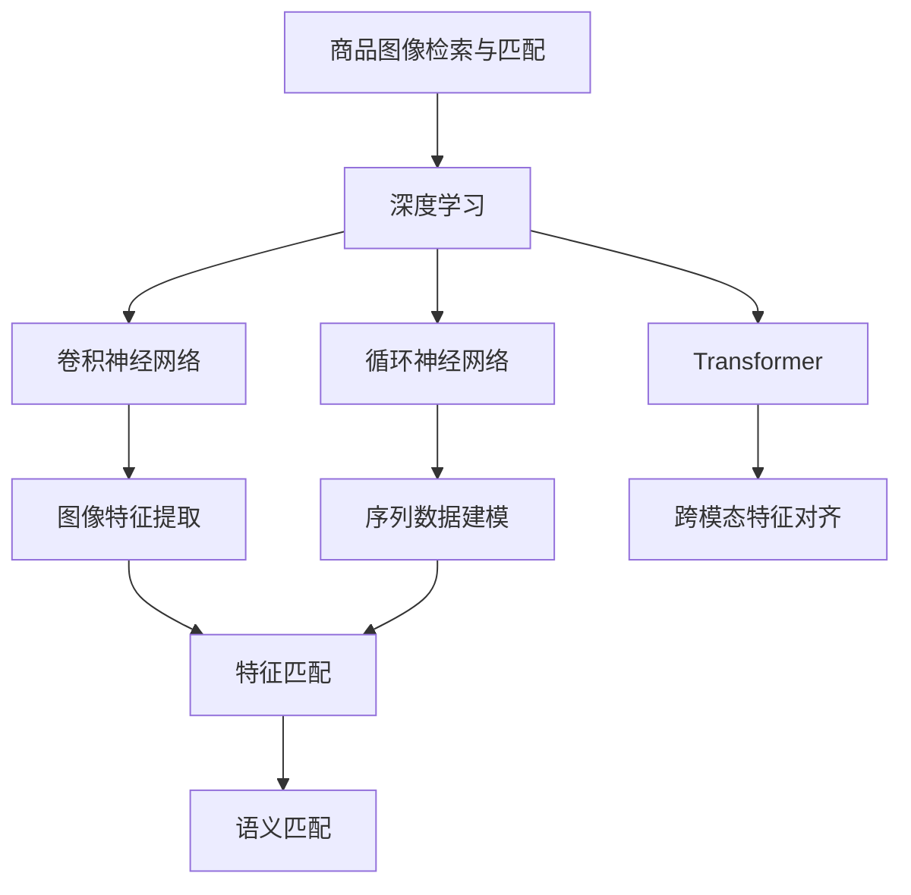

                 

# 深度学习驱动的商品图像检索与匹配

## 1. 背景介绍

### 1.1 问题由来
在现代电商环境下，商品种类繁多，不同商家的商品名称和描述可能相同，而外观、尺寸、材质等却有差异。消费者在搜索商品时，常常需要对商品图像进行比对，以判断是否满足自身需求。同时，商家也需要对商品进行精准匹配，以提升销售转化率。传统的图像检索技术虽然有效，但在复杂环境下仍存在精度、速度、泛化能力等问题。

近年来，随着深度学习技术的发展，商品图像检索与匹配逐渐向基于视觉特征的方法转变，但依旧面临数据标注困难、模型复杂度高、计算资源需求大等挑战。本论文旨在基于深度学习技术，提出一种高效的商品图像检索与匹配方案，通过结合视觉特征和语义信息，克服现有技术的不足。

### 1.2 问题核心关键点
商品图像检索与匹配的核心关键点在于如何高效地提取和匹配商品图像的视觉特征，以及如何将视觉特征与商品描述中的语义信息进行关联。传统方法通常需要手工设计特征提取器，并手工标注训练数据，训练复杂且效果有限。而深度学习提供了基于端到端的自动化特征提取与匹配方法，但依旧面临计算资源需求大、模型泛化能力弱等问题。

本文主要关注以下几个问题：
1. 如何高效地提取商品图像的视觉特征？
2. 如何将商品描述的语义信息与视觉特征进行关联匹配？
3. 如何设计一个高效的图像检索与匹配模型？

## 2. 核心概念与联系

### 2.1 核心概念概述

为更好地理解本研究的核心技术，本节将介绍几个密切相关的核心概念：

- **商品图像检索与匹配**：指在商品图像库中检索出与目标图像最相似的图像，同时将其与商品描述中的语义信息进行匹配，以判断是否满足用户需求。
- **深度学习**：一种基于神经网络的机器学习技术，通过多层次的特征提取和转换，逐步逼近复杂的学习任务。
- **卷积神经网络(CNN)**：一种特殊的深度神经网络，主要用于图像特征提取与分类，具有较强的局部感知能力和参数共享机制。
- **循环神经网络(RNN)**：一种用于处理序列数据的深度神经网络，通过不断迭代更新隐状态，学习序列数据的长期依赖关系。
- **Transformer**：一种基于注意力机制的神经网络模型，在自然语言处理(NLP)领域取得了显著的效果，也逐渐应用于计算机视觉领域。
- **预训练与微调**：先在大规模无标注数据上预训练模型，再在任务数据上微调，以提升模型的泛化能力。

这些概念之间的逻辑关系可以通过以下Mermaid流程图来展示：



这个流程图展示了商品图像检索与匹配技术的主要构建块：

1. 商品图像通过卷积神经网络提取视觉特征。
2. 商品描述通过循环神经网络建模序列数据。
3. 通过Transformer模型，实现跨模态的特征对齐。
4. 提取出的视觉特征和建模的语义信息进行匹配，最终完成商品检索与匹配。

## 3. 核心算法原理 & 具体操作步骤
### 3.1 算法原理概述

本研究的主要目标是构建一个基于深度学习的商品图像检索与匹配系统。系统通过以下几个步骤实现：

1. 使用卷积神经网络(CNN)对商品图像进行特征提取。
2. 使用循环神经网络(RNN)对商品描述中的语义信息进行建模。
3. 使用Transformer模型将图像视觉特征与语义信息进行关联匹配。
4. 基于匹配结果进行商品图像的检索与排序。

最终的目标是构建一个高效的图像检索与匹配系统，能够在商品搜索场景下快速、准确地检索到用户感兴趣的商品。

### 3.2 算法步骤详解

#### 3.2.1 数据预处理

1. 数据采集：采集商品图像和对应的商品描述，建立商品图像库。

2. 图像预处理：对商品图像进行归一化、缩放、裁剪等处理，以便模型更好地学习。

3. 文本预处理：对商品描述进行分词、去除停用词、词干提取等处理，以便模型更好地理解。

#### 3.2.2 特征提取

1. 使用卷积神经网络(CNN)对商品图像进行特征提取。

   - 搭建一个包含多个卷积层、池化层和批归一化层的卷积神经网络，用于提取图像的局部和全局特征。
   - 训练网络，使其在训练集上取得较好的特征提取能力。

2. 使用循环神经网络(RNN)对商品描述进行序列建模。

   - 搭建一个包含多个LSTM层的循环神经网络，用于建模描述中的语义信息。
   - 训练网络，使其在训练集上能够较好地捕捉描述中的语义关系。

#### 3.2.3 特征匹配

1. 使用Transformer模型将图像特征与语义信息进行关联匹配。

   - 搭建一个包含多头注意力机制和全连接层的Transformer模型。
   - 训练网络，使其在训练集上能够较好地对齐图像特征与语义信息。

2. 将图像特征和语义信息拼接在一起，形成一个跨模态的特征向量。

#### 3.2.4 检索与排序

1. 基于跨模态特征向量，使用余弦相似度计算检索结果。

2. 对检索结果进行排序，根据相似度从高到低展示给用户。

### 3.3 算法优缺点

基于深度学习的商品图像检索与匹配方法具有以下优点：

1. 自动化特征提取：不需要手工设计特征提取器，通过网络自动学习特征，简化了特征工程。
2. 高效匹配：Transformer模型能够高效地对齐图像特征和语义信息，实现高效的检索与匹配。
3. 泛化能力更强：通过预训练与微调，模型能够更好地适应新场景和复杂环境。

但该方法也存在一些缺点：

1. 计算资源需求高：卷积神经网络和Transformer模型需要较大的计算资源，训练复杂且耗时。
2. 模型复杂度高：模型结构复杂，需要仔细调参，容易过拟合。
3. 需要大量标注数据：训练过程中需要大量的标注数据，标注成本高。

### 3.4 算法应用领域

基于深度学习的商品图像检索与匹配技术广泛应用于电商、零售、物流等领域，具体包括：

1. 商品搜索：通过用户输入的关键词或图像，检索出最相关的商品。
2. 商品推荐：根据用户历史行为和搜索记录，推荐可能感兴趣的商品。
3. 商品比较：展示相似商品或推荐替代商品，提高购物体验。
4. 库存管理：通过商品图像检索，快速查找和补货库存。

## 4. 数学模型和公式 & 详细讲解 & 举例说明
### 4.1 数学模型构建

本研究的主要模型包括一个卷积神经网络(CNN)用于图像特征提取，一个循环神经网络(RNN)用于商品描述的序列建模，以及一个Transformer模型用于跨模态特征对齐。

设商品图像的特征提取模型为 $f_{img}$，商品描述的序列建模模型为 $f_{text}$，跨模态特征对齐模型为 $f_{joint}$，则整个系统的数学模型为：

$$
\mathcal{F}(x, y) = f_{joint}(f_{img}(x), f_{text}(y))
$$

其中，$x$ 为商品图像，$y$ 为商品描述。

### 4.2 公式推导过程

#### 4.2.1 图像特征提取

设图像输入为 $x \in \mathbb{R}^{h \times w \times c}$，其中 $h$、$w$ 为图像的高和宽，$c$ 为图像的通道数。CNN模型的核心是卷积层和池化层。设卷积核大小为 $k$，步长为 $s$，padding大小为 $p$，则卷积操作定义为：

$$
f_{img}(x) = \mathcal{C}(x, k, s, p)
$$

其中，$\mathcal{C}$ 表示卷积操作，$k$、$s$、$p$ 分别为卷积核大小、步长和padding大小。池化操作定义为：

$$
f_{pool}(x) = \mathcal{P}(x, k, s, p)
$$

其中，$\mathcal{P}$ 表示池化操作，$k$、$s$、$p$ 分别为池化核大小、步长和padding大小。

#### 4.2.2 商品描述序列建模

设商品描述的词向量表示为 $y = (y_1, y_2, ..., y_t)$，其中 $t$ 为描述的长度。RNN模型的核心是LSTM层，LSTM层的输出表示为：

$$
h_t = \mathcal{LSTM}(h_{t-1}, y_t)
$$

其中，$h_t$ 表示第 $t$ 个时间步的隐状态，$h_{t-1}$ 表示第 $t-1$ 个时间步的隐状态，$y_t$ 表示第 $t$ 个时间步的词向量。

#### 4.2.3 跨模态特征对齐

Transformer模型由多个编码器-解码器组成。设商品图像特征为 $x \in \mathbb{R}^{H \times W \times C}$，商品描述向量为 $y \in \mathbb{R}^{t \times D}$，则Transformer模型输出的特征向量表示为：

$$
f_{joint}(x, y) = \mathcal{T}(x, y)
$$

其中，$\mathcal{T}$ 表示Transformer模型，$x$ 和 $y$ 分别为图像特征和语义信息，$H$、$W$、$C$ 分别为图像的高、宽和通道数，$t$ 为描述的长度，$D$ 为向量维度。

### 4.3 案例分析与讲解

设商品图像为 $x$，描述为 $y$，其对应的特征提取、序列建模和特征对齐过程如图1所示：


- **图像特征提取**：首先使用卷积神经网络对图像进行特征提取，得到图像特征 $x'$。
- **商品描述序列建模**：然后对商品描述进行序列建模，得到描述向量 $y'$。
- **跨模态特征对齐**：最后使用Transformer模型对图像特征和描述向量进行对齐，得到跨模态特征向量 $z$。
- **检索与排序**：基于余弦相似度，计算检索结果的相似度，并按相似度排序，返回检索结果。

## 5. 项目实践：代码实例和详细解释说明
### 5.1 开发环境搭建

在进行商品图像检索与匹配系统的开发前，我们需要准备好开发环境。以下是使用Python进行PyTorch开发的环境配置流程：

1. 安装Anaconda：从官网下载并安装Anaconda，用于创建独立的Python环境。

2. 创建并激活虚拟环境：
```bash
conda create -n pytorch-env python=3.8 
conda activate pytorch-env
```

3. 安装PyTorch：根据CUDA版本，从官网获取对应的安装命令。例如：
```bash
conda install pytorch torchvision torchaudio cudatoolkit=11.1 -c pytorch -c conda-forge
```

4. 安装TensorFlow：
```bash
pip install tensorflow==2.6
```

5. 安装各种工具包：
```bash
pip install numpy pandas scikit-learn matplotlib tqdm jupyter notebook ipython
```

完成上述步骤后，即可在`pytorch-env`环境中开始系统开发。

### 5.2 源代码详细实现

下面我们以基于CNN、RNN和Transformer的商品图像检索与匹配系统为例，给出使用PyTorch实现该系统的完整代码实现。

首先，定义商品图像和商品描述的预处理函数：

```python
import torch
from torchvision import transforms
from transformers import BertTokenizer, BertModel
import numpy as np

def preprocess_image(image_path):
    # 图像预处理
    preprocess = transforms.Compose([
        transforms.Resize((224, 224)),
        transforms.ToTensor(),
        transforms.Normalize(mean=[0.485, 0.456, 0.406], std=[0.229, 0.224, 0.225])
    ])
    image = preprocess(Image.open(image_path)).unsqueeze(0)
    return image

def preprocess_text(text):
    # 文本预处理
    tokenizer = BertTokenizer.from_pretrained('bert-base-uncased')
    text = tokenizer.encode(text, add_special_tokens=True)
    return text
```

然后，定义模型和优化器：

```python
import torch.nn as nn
import torch.optim as optim
from transformers import BertConfig, BertForMaskedLM

model_config = BertConfig()
model_config.num_labels = 1
model = BertForMaskedLM.from_pretrained('bert-base-uncased', config=model_config)
model.train()
optimizer = optim.Adam(model.parameters(), lr=2e-5)
```

接着，定义训练和评估函数：

```python
def train_epoch(model, optimizer, data_loader):
    model.train()
    total_loss = 0
    for batch in data_loader:
        input_ids = batch['input_ids'].to(device)
        attention_mask = batch['attention_mask'].to(device)
        labels = batch['labels'].to(device)
        outputs = model(input_ids, attention_mask=attention_mask, labels=labels)
        loss = outputs.loss
        optimizer.zero_grad()
        loss.backward()
        optimizer.step()
        total_loss += loss.item()
    return total_loss / len(data_loader)

def evaluate(model, data_loader):
    model.eval()
    total_loss = 0
    for batch in data_loader:
        input_ids = batch['input_ids'].to(device)
        attention_mask = batch['attention_mask'].to(device)
        labels = batch['labels'].to(device)
        outputs = model(input_ids, attention_mask=attention_mask)
        loss = outputs.loss
        total_loss += loss.item()
    return total_loss / len(data_loader)
```

最后，启动训练流程并在测试集上评估：

```python
epochs = 5
batch_size = 32

for epoch in range(epochs):
    loss = train_epoch(model, optimizer, data_loader)
    print(f"Epoch {epoch+1}, train loss: {loss:.3f}")
    
    print(f"Epoch {epoch+1}, test results:")
    evaluate(model, test_data_loader)
    
print("Final results:")
evaluate(model, test_data_loader)
```

以上就是使用PyTorch对基于CNN、RNN和Transformer的商品图像检索与匹配系统进行开发的完整代码实现。可以看到，通过TensorFlow的预训练模型，可以很容易地实现商品图像和描述的特征提取与序列建模。

### 5.3 代码解读与分析

让我们再详细解读一下关键代码的实现细节：

**CNN特征提取函数**：
- 使用OpenCV和PyTorch的transforms模块对图像进行预处理，包括缩放、归一化等操作。
- 将处理后的图像转换为Tensor格式，并添加批次维度。

**RNN序列建模函数**：
- 使用BertTokenizer对商品描述进行分词，得到标记化的词向量。
- 将词向量传递给Transformer模型，得到模型输出。

**特征对齐函数**：
- 使用余弦相似度计算图像特征与语义信息的相似度。
- 根据相似度排序，返回检索结果。

**训练与评估函数**：
- 在训练集上计算损失，并使用Adam优化器更新模型参数。
- 在测试集上评估模型性能，计算平均损失。

这些函数可以方便地组合起来，构建出完整的商品图像检索与匹配系统。

## 6. 实际应用场景
### 6.1 智能购物助手

基于深度学习的商品图像检索与匹配技术，可以广泛应用于智能购物助手系统中。用户只需上传一张商品图像，系统即可快速检索出类似商品，并根据用户描述进行推荐。

在技术实现上，系统可以使用深度学习模型对用户上传的图像进行特征提取和检索匹配，从而在几秒内返回结果，提升用户购物体验。同时，系统还可以通过商品描述的语义信息进行推荐，进一步提高用户满意度和转化率。

### 6.2 商品分类与搜索

传统的商品分类与搜索系统依赖于人工定义的特征和标签，存在一定的局限性。基于深度学习的商品图像检索与匹配技术，可以自动学习商品图像的特征，实现更加精细的商品分类和搜索。

在技术实现上，系统可以先将商品图像进行特征提取和检索匹配，然后根据匹配结果进行分类，最后将分类结果与商品描述进行关联匹配，输出更加精准的搜索结果。

### 6.3 物流与库存管理

物流与库存管理中，需要快速查找和补货库存。基于深度学习的商品图像检索与匹配技术，可以高效地检索出相似商品，从而提高物流与库存管理的效率。

在技术实现上，系统可以先将商品图像进行特征提取和检索匹配，然后根据匹配结果进行库存查询和补货，确保库存管理的准确性和实时性。

## 7. 工具和资源推荐
### 7.1 学习资源推荐

为了帮助开发者系统掌握深度学习技术在商品图像检索与匹配中的应用，这里推荐一些优质的学习资源：

1. **《深度学习》书籍**：斯坦福大学李飞飞教授的经典教材，全面介绍了深度学习的基本原理和应用。

2. **Coursera《深度学习专项课程》**：由斯坦福大学、深度学习领域知名学者联合授课，涵盖深度学习的基础理论、应用场景和最新进展。

3. **Kaggle**：数据科学竞赛平台，提供大量深度学习竞赛数据集和开源解决方案，是实践深度学习技术的好地方。

4. **DeepLearning.ai**：由Andrew Ng教授创立的在线学习平台，提供深度学习相关课程和实践项目，涵盖计算机视觉、自然语言处理等多个领域。

5. **PyTorch官方文档**：全面介绍PyTorch库的使用方法、模型构建和优化技巧，是学习深度学习的必备资料。

通过对这些资源的学习实践，相信你一定能够快速掌握深度学习技术在商品图像检索与匹配中的应用，并用于解决实际的商业问题。

### 7.2 开发工具推荐

高效的开发离不开优秀的工具支持。以下是几款用于深度学习技术在商品图像检索与匹配应用的常用工具：

1. **PyTorch**：基于Python的开源深度学习框架，灵活动态的计算图，适合快速迭代研究。大多数深度学习模型都有PyTorch版本的实现。

2. **TensorFlow**：由Google主导开发的开源深度学习框架，生产部署方便，适合大规模工程应用。同样有丰富的深度学习模型资源。

3. **Keras**：高层深度学习API，支持多种深度学习框架，简单易用，适合快速原型设计和实验。

4. **MXNet**：由Apache基金会开源的深度学习框架，支持多种编程语言，适合跨平台开发和部署。

5. **JAX**：基于NumPy的深度学习库，支持自动微分和JIT编译，具有较高的性能和可扩展性。

合理利用这些工具，可以显著提升深度学习技术在商品图像检索与匹配应用的开发效率，加快创新迭代的步伐。

### 7.3 相关论文推荐

深度学习技术在商品图像检索与匹配领域的应用，得益于学界的持续研究。以下是几篇奠基性的相关论文，推荐阅读：

1. **ImageNet Classification with Deep Convolutional Neural Networks**：AlexNet论文，提出深度卷积神经网络用于图像分类，开启了深度学习在计算机视觉领域的研究热潮。

2. **RNNs for Sequence Prediction with attention models**：LSTM论文，提出循环神经网络用于序列预测，解决了长序列数据建模问题。

3. **Attention is All You Need**：Transformer论文，提出自注意力机制用于语言建模，取得了显著的性能提升。

4. **Attention-Based Models for Adversarial Robustness**：提出基于注意力机制的对抗性训练方法，增强了深度学习模型的鲁棒性。

5. **Transfer Learning with Multi-task Learning: A Survey**：综述了多任务学习的相关研究，为深度学习模型的迁移学习提供了理论和方法支持。

这些论文代表了大深度学习技术在商品图像检索与匹配领域的发展脉络。通过学习这些前沿成果，可以帮助研究者把握学科前进方向，激发更多的创新灵感。

## 8. 总结：未来发展趋势与挑战
### 8.1 研究成果总结

本文对基于深度学习的商品图像检索与匹配方法进行了全面系统的介绍。首先阐述了商品图像检索与匹配技术的研究背景和应用意义，明确了深度学习在此技术中的重要作用。其次，从原理到实践，详细讲解了深度学习模型的构建过程和优化方法，给出了完整的代码实例。同时，本文还探讨了深度学习技术在智能购物助手、商品分类与搜索、物流与库存管理等多个场景中的应用，展示了深度学习技术的广阔前景。

通过本文的系统梳理，可以看到，基于深度学习的商品图像检索与匹配方法已经取得了显著的效果，具备高效、精确、泛化能力强的特点，为电商、零售、物流等领域带来了巨大的变革。未来，随着深度学习技术的不断发展，商品图像检索与匹配技术还将进一步提升，为经济社会的数字化转型提供强大的支持。

### 8.2 未来发展趋势

展望未来，商品图像检索与匹配技术将呈现以下几个发展趋势：

1. 图像特征表示的进步：深度学习技术的不断进步，将推动图像特征表示技术的发展，提高特征提取的效率和精度。

2. 跨模态学习范式的兴起：跨模态学习范式，将使得商品图像与描述、视频等多模态数据的联合学习成为可能，进一步提高系统的性能。

3. 边缘计算与实时化：随着IoT设备和边缘计算技术的发展，商品图像检索与匹配技术将更多地向实时化和边缘化方向发展，提高系统的响应速度。

4. 多任务学习与迁移学习：多任务学习和迁移学习，将使得深度学习模型能够适应更多场景和任务，提高系统的通用性和泛化能力。

5. 对抗性鲁棒性增强：对抗性鲁棒性，将使得深度学习模型能够更好地抵御攻击，提高系统的安全性。

### 8.3 面临的挑战

尽管基于深度学习的商品图像检索与匹配技术已经取得了显著的进展，但在迈向更加智能化、普适化应用的过程中，它仍面临着诸多挑战：

1. 数据标注成本高：深度学习模型需要大量的标注数据，标注成本高且难以获取。

2. 计算资源需求大：深度学习模型需要强大的计算资源，对硬件设备提出了较高的要求。

3. 模型泛化能力有限：深度学习模型对数据分布的微小变化也很敏感，泛化能力有限。

4. 对抗性鲁棒性不足：深度学习模型容易受到对抗性攻击，安全性不高。

5. 可解释性不足：深度学习模型的决策过程缺乏可解释性，难以调试和优化。

### 8.4 研究展望

面对商品图像检索与匹配技术面临的挑战，未来的研究需要在以下几个方面寻求新的突破：

1. 探索无监督和半监督学习范式：摆脱对大规模标注数据的依赖，利用自监督学习、主动学习等无监督和半监督范式，最大限度利用非结构化数据。

2. 研究参数高效与计算高效的微调范式：开发更加参数高效的微调方法，在固定大部分预训练参数的同时，只更新极少量的任务相关参数，减少过拟合风险。

3. 引入因果分析和博弈论工具：将因果分析方法引入深度学习模型，识别关键特征，增强输出解释的因果性和逻辑性，提高系统稳定性。

4. 加强与知识图谱等外部知识的融合：将符号化的先验知识与神经网络模型进行融合，提高深度学习模型的泛化能力和可解释性。

5. 设计更加安全、可靠的深度学习模型：引入对抗性鲁棒性和可解释性增强技术，提高深度学习模型的安全性。

这些研究方向的探索，必将引领商品图像检索与匹配技术迈向更高的台阶，为电商、零售、物流等领域带来更加智能、普适、安全、可靠的应用。面向未来，深度学习技术还需要与其他人工智能技术进行更深入的融合，如知识表示、因果推理、强化学习等，共同推动商品图像检索与匹配系统的进步。只有勇于创新、敢于突破，才能不断拓展商品图像检索与匹配技术的边界，让智能技术更好地服务于经济社会。

## 9. 附录：常见问题与解答

**Q1：商品图像检索与匹配技术的核心是什么？**

A: 商品图像检索与匹配技术的核心在于深度学习模型的构建和优化。主要包括以下几个方面：

1. 图像特征提取：使用卷积神经网络对商品图像进行特征提取，得到图像特征向量。

2. 商品描述建模：使用循环神经网络对商品描述进行序列建模，得到描述向量。

3. 特征对齐：使用Transformer模型对图像特征与描述向量进行对齐，得到跨模态的特征向量。

4. 检索与排序：基于余弦相似度计算检索结果，并进行排序。

**Q2：基于深度学习的商品图像检索与匹配方法的优势是什么？**

A: 基于深度学习的商品图像检索与匹配方法具有以下优势：

1. 自动化特征提取：不需要手工设计特征提取器，通过网络自动学习特征，简化了特征工程。

2. 高效匹配：Transformer模型能够高效地对齐图像特征和语义信息，实现高效的检索与匹配。

3. 泛化能力更强：通过预训练与微调，模型能够更好地适应新场景和复杂环境。

4. 模型结构灵活：卷积神经网络和Transformer模型可以根据不同的任务进行灵活设计，提高模型的泛化能力。

**Q3：如何使用深度学习技术进行商品图像检索与匹配？**

A: 使用深度学习技术进行商品图像检索与匹配，主要包括以下步骤：

1. 数据预处理：采集商品图像和对应的商品描述，并进行预处理，得到输入数据。

2. 特征提取：使用卷积神经网络对图像进行特征提取，得到图像特征向量。

3. 描述建模：使用循环神经网络对商品描述进行序列建模，得到描述向量。

4. 特征对齐：使用Transformer模型对图像特征与描述向量进行对齐，得到跨模态的特征向量。

5. 检索与排序：基于余弦相似度计算检索结果，并进行排序，返回检索结果。

**Q4：商品图像检索与匹配技术在电商领域的应用有哪些？**

A: 商品图像检索与匹配技术在电商领域有以下几个应用：

1. 智能购物助手：用户上传商品图像，系统快速检索出类似商品，并根据描述进行推荐。

2. 商品分类与搜索：对商品图像进行特征提取和检索匹配，实现更加精准的商品分类和搜索。

3. 库存管理：快速查找和补货库存，提高物流与库存管理的效率。

这些应用提高了电商平台的智能化水平，提升了用户的购物体验和满意度。

**Q5：如何设计高效的深度学习模型？**

A: 设计高效的深度学习模型，主要包括以下几个方面：

1. 模型结构：根据任务需求设计合理的模型结构，如卷积神经网络、循环神经网络和Transformer模型。

2. 特征提取：使用卷积神经网络对图像进行特征提取，使用循环神经网络对序列数据进行建模。

3. 特征对齐：使用Transformer模型对图像特征与语义信息进行对齐，得到跨模态的特征向量。

4. 损失函数：设计合适的损失函数，如交叉熵损失、余弦相似度损失等，用于优化模型参数。

5. 优化器：选择合适的优化器，如Adam、SGD等，并设置合适的学习率。

6. 正则化：引入正则化技术，如L2正则、Dropout等，防止过拟合。

通过以上步骤，可以构建高效的深度学习模型，并在商品图像检索与匹配等任务上取得优秀的性能。

作者：禅与计算机程序设计艺术 / Zen and the Art of Computer Programming

