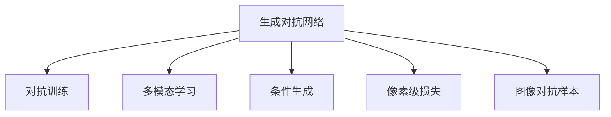

                 

# 深度学习驱动的商品图像生成技术

## 1. 背景介绍

### 1.1 问题由来
随着电子商务的兴起和普及，在线商品展示和推荐变得越来越重要。高质量的商品图像不仅能提升用户体验，还能显著提高转化率和满意度。然而，获取高质量的商品图像成本高昂，且依赖人工标注，效率低下。因此，通过深度学习技术自动生成商品图像，不仅能够降低成本，还能提供更丰富的展示内容。

### 1.2 问题核心关键点
商品图像生成技术的目标是使用深度学习模型，从商品的描述信息中自动生成对应的图像。其核心在于将商品描述映射到图像空间，同时考虑语义和视觉的多模态表示。

当前，商品图像生成主要基于两个方向：生成对抗网络（GANs）和变分自编码器（VAEs）。GANs通过对抗训练，能够生成高分辨率、多样化的图像，但其训练过程不稳定，模型容易过拟合；VAEs通过编码和解码过程，能够实现低分辨率到高分辨率的图像转换，但生成的图像细节不够丰富。

## 2. 核心概念与联系

### 2.1 核心概念概述

为更好地理解商品图像生成技术，本节将介绍几个密切相关的核心概念：

- 生成对抗网络（GANs）：由Isola等人在2015年提出的深度学习模型，通过两个神经网络之间的对抗训练，实现图像生成。
- 变分自编码器（VAEs）：由Kingma等人在2013年提出的生成模型，通过编码器将输入数据压缩到潜在空间，再通过解码器生成重构图像。
- 多模态学习（Multimodal Learning）：指同时处理两种或多种类型的数据，将语义信息与视觉信息结合，提升生成效果。
- 条件生成（Conditional Generation）：指在生成过程中引入额外的条件变量，如商品描述信息，引导生成过程。
- 像素级损失（Pixel-wise Loss）：指通过像素级的误差衡量生成图像与真实图像之间的差距。
- 图像对抗样本（Adversarial Images）：指通过特定的扰动，使得生成的图像对特定分类器产生误判。

这些核心概念之间的逻辑关系可以通过以下Mermaid流程图来展示：



这个流程图展示了大模型生成图像的核心概念及其之间的关系：

1. 生成对抗网络（GANs）通过对抗训练生成图像。
2. 多模态学习将语义信息与视觉信息结合，提升生成效果。
3. 条件生成通过商品描述信息引导生成过程。
4. 像素级损失衡量生成图像与真实图像之间的差距。
5. 图像对抗样本通过扰动生成对抗图像。

这些概念共同构成了商品图像生成的基础，使得模型能够自动生成逼真且符合描述的商品图像。

## 3. 核心算法原理 & 具体操作步骤

### 3.1 算法原理概述

商品图像生成技术主要基于GANs和VAEs模型，通过对抗训练和编码-解码过程，实现从商品描述到图像的映射。核心思想是：将商品描述作为条件，通过神经网络生成高分辨率、高质量的商品图像。

形式化地，假设商品描述为 $x$，真实图像为 $y$，目标是从 $x$ 生成 $y$。商品图像生成模型 $G$ 通过一个编码器 $E$ 和一个解码器 $D$，将 $x$ 映射到潜在空间 $z$，然后从 $z$ 生成 $y$。模型的训练过程通过一个判别器 $D$ 来对抗，使 $G$ 能够生成高质量的图像，同时 $D$ 能够区分真实图像和生成图像。

训练过程可以表示为：

1. 固定 $G$，训练 $D$，使其能够区分真实图像和生成图像。
2. 固定 $D$，训练 $G$，使其能够生成高质量的图像。
3. 重复1和2，直到 $G$ 和 $D$ 收敛。

### 3.2 算法步骤详解

商品图像生成的算法步骤主要包括以下几个关键步骤：

**Step 1: 准备数据集和预训练模型**
- 收集商品描述和对应图像的数据集，分为训练集、验证集和测试集。
- 选择适合的深度学习框架（如TensorFlow、PyTorch等）进行开发。
- 加载预训练的GANs或VAEs模型，并进行微调或初始化。

**Step 2: 设计模型架构**
- 设计编码器 $E$ 和解码器 $D$，选择合适的激活函数和优化器。
- 设计判别器 $D$，以区分真实图像和生成图像。
- 设置模型超参数，如学习率、批大小、迭代轮数等。

**Step 3: 模型训练**
- 固定 $G$，训练 $D$，通过对抗训练更新模型参数。
- 固定 $D$，训练 $G$，通过编码-解码过程更新模型参数。
- 周期性在验证集上评估模型性能，根据性能指标决定是否触发Early Stopping。
- 重复上述步骤直到满足预设的迭代轮数或Early Stopping条件。

**Step 4: 生成和评估**
- 在测试集上使用训练好的 $G$ 生成商品图像。
- 评估生成图像的逼真度和多样性，通过像素级损失和人类评估进行衡量。
- 生成对抗样本，测试模型的鲁棒性。

### 3.3 算法优缺点

商品图像生成技术具有以下优点：
1. 高质量生成：生成对抗网络能够生成高质量、高分辨率的图像，满足电商平台的展示需求。
2. 多样性丰富：通过多模态学习和条件生成，能够生成多样化的商品图像，满足不同消费者的需求。
3. 训练过程简单：相较于传统的计算机视觉任务，商品图像生成训练过程更加简单，易于实现。

同时，该方法也存在一定的局限性：
1. 训练成本高：生成对抗网络的训练过程不稳定，需要大量的计算资源和时间。
2. 过拟合风险：模型容易过拟合，生成图像可能与真实图像存在较大差异。
3. 对抗样本影响：生成对抗样本可能欺骗分类器，影响模型安全性。
4. 生成过程复杂：多模态学习和条件生成增加了模型复杂度，使得训练和推理过程更为复杂。

尽管存在这些局限性，但就目前而言，商品图像生成技术仍然是最主流的方法。未来相关研究的重点在于如何进一步降低训练成本，提高生成质量和多样性，同时兼顾模型安全和可解释性等因素。

### 3.4 算法应用领域

商品图像生成技术主要应用于以下几个领域：

- 电商商品展示：自动生成商品图像，提升用户购物体验和满意度。
- 虚拟试衣间：通过生成人体图像与商品图像结合，实现虚拟试衣功能。
- 品牌营销：生成品牌商品的高质量图像，用于品牌宣传和广告投放。
- 创意设计：生成多样化的商品设计图，激发设计师灵感。
- 图像修复：生成缺失的商品图像部分，完成图像修复。

除了上述这些领域外，商品图像生成技术也被创新性地应用到更多场景中，如可控图像生成、图像修复、人脸识别等，为计算机视觉技术带来了全新的突破。随着生成模型和训练方法的不断进步，相信商品图像生成技术将在更多领域得到应用，为电商、广告、设计等行业的创新提供新的动力。

## 4. 数学模型和公式 & 详细讲解  
### 4.1 数学模型构建

本节将使用数学语言对商品图像生成模型的训练过程进行更加严格的刻画。

假设商品描述为 $x$，真实图像为 $y$，生成对抗网络由编码器 $E$、解码器 $D$ 和判别器 $D$ 组成。设 $z$ 为潜在空间中的隐表示，模型的训练过程如下：

1. 生成阶段：$z = E(x)$，生成图像 $y = D(z)$。
2. 判别阶段：$D(x) = \text{sigmoid}(z)$，$D(y) = \text{sigmoid}(E(y))$。

模型的目标是最小化以下损失函数：

$$
\mathcal{L}(G) = \mathbb{E}_{x \sim p(x)} [D(x)] - \mathbb{E}_{x \sim p(x)} [\log(1-D(y))]
$$

其中，$D(x)$ 表示真实图像的判别器输出，$\log(1-D(y))$ 表示生成图像的判别器输出。

### 4.2 公式推导过程

以下是商品图像生成模型的详细推导过程：

**生成阶段**

- 编码器 $E$ 将商品描述 $x$ 映射到潜在空间 $z$，即 $z = E(x)$。
- 解码器 $D$ 从潜在空间 $z$ 生成图像 $y$，即 $y = D(z)$。

**判别阶段**

- 判别器 $D$ 区分真实图像和生成图像，即 $D(x) = \text{sigmoid}(z)$，$D(y) = \text{sigmoid}(E(y))$。

**损失函数**

- 生成对抗网络的损失函数由生成损失和判别损失组成。生成损失 $\mathbb{E}_{x \sim p(x)} [\log(1-D(y))]$ 表示模型生成的图像与真实图像的差异。判别损失 $\mathbb{E}_{x \sim p(x)} [D(x)]$ 表示判别器对真实图像的准确性。

通过最小化上述损失函数，模型能够学习到商品描述与图像之间的映射关系，生成高质量的商品图像。

### 4.3 案例分析与讲解

**案例分析**

假设有一个简单的商品图像生成模型，其中编码器 $E$ 和解码器 $D$ 均为全连接神经网络。商品描述 $x$ 和真实图像 $y$ 分别表示为向量，潜在空间 $z$ 也表示为向量。生成对抗网络的损失函数如下：

$$
\mathcal{L}(G) = \mathbb{E}_{x \sim p(x)} [D(x)] - \mathbb{E}_{x \sim p(x)} [\log(1-D(y))]
$$

其中，$D(x)$ 表示真实图像的判别器输出，$\log(1-D(y))$ 表示生成图像的判别器输出。

**讲解**

这个案例展示了生成对抗网络的基本结构和训练过程。编码器 $E$ 将商品描述 $x$ 映射到潜在空间 $z$，解码器 $D$ 从潜在空间 $z$ 生成图像 $y$。判别器 $D$ 区分真实图像和生成图像，生成对抗网络的损失函数由生成损失和判别损失组成。

## 5. 项目实践：代码实例和详细解释说明
### 5.1 开发环境搭建

在进行商品图像生成实践前，我们需要准备好开发环境。以下是使用Python进行PyTorch开发的环境配置流程：

1. 安装Anaconda：从官网下载并安装Anaconda，用于创建独立的Python环境。

2. 创建并激活虚拟环境：
```bash
conda create -n pytorch-env python=3.8 
conda activate pytorch-env
```

3. 安装PyTorch：根据CUDA版本，从官网获取对应的安装命令。例如：
```bash
conda install pytorch torchvision torchaudio cudatoolkit=11.1 -c pytorch -c conda-forge
```

4. 安装TensorBoard：
```bash
pip install tensorboard
```

5. 安装各类工具包：
```bash
pip install numpy pandas scikit-learn matplotlib tqdm jupyter notebook ipython
```

完成上述步骤后，即可在`pytorch-env`环境中开始商品图像生成任务的开发。

### 5.2 源代码详细实现

这里我们以生成T恤商品图像为例，给出使用PyTorch实现商品图像生成的代码实现。

首先，定义商品图像生成的训练数据集：

```python
import torch
from torch.utils.data import Dataset
import os

class TshirtDataset(Dataset):
    def __init__(self, root_dir):
        self.root_dir = root_dir
        self.image_files = sorted(os.listdir(self.root_dir))
        
    def __len__(self):
        return len(self.image_files)
    
    def __getitem__(self, index):
        image_path = os.path.join(self.root_dir, self.image_files[index])
        with open(image_path, 'r') as f:
            labels = f.read().strip().split(',')
        image = Image.open(image_path)
        image = transform(image)
        return image, labels

# 加载数据集
train_dataset = TshirtDataset(train_dir)
test_dataset = TshirtDataset(test_dir)
```

然后，定义模型架构：

```python
from torch import nn
import torch.nn.functional as F

class Generator(nn.Module):
    def __init__(self):
        super(Generator, self).__init__()
        self.encoder = nn.Sequential(
            nn.Linear(in_features=200, out_features=256),
            nn.ReLU(),
            nn.Linear(in_features=256, out_features=256),
            nn.ReLU(),
            nn.Linear(in_features=256, out_features=256),
            nn.ReLU(),
            nn.Linear(in_features=256, out_features=784),
            nn.Tanh()
        )
        self.decoder = nn.Sequential(
            nn.Linear(in_features=784, out_features=256),
            nn.ReLU(),
            nn.Linear(in_features=256, out_features=256),
            nn.ReLU(),
            nn.Linear(in_features=256, out_features=256),
            nn.ReLU(),
            nn.Linear(in_features=256, out_features=200)
        )
        
    def forward(self, x):
        z = self.encoder(x)
        y = self.decoder(z)
        return y

class Discriminator(nn.Module):
    def __init__(self):
        super(Discriminator, self).__init__()
        self.encoder = nn.Sequential(
            nn.Linear(in_features=784, out_features=256),
            nn.ReLU(),
            nn.Linear(in_features=256, out_features=256),
            nn.ReLU(),
            nn.Linear(in_features=256, out_features=1),
            nn.Sigmoid()
        )
    
    def forward(self, x):
        z = self.encoder(x)
        return z

# 加载模型
generator = Generator()
discriminator = Discriminator()
```

接着，定义训练和评估函数：

```python
from torch.optim import Adam
import torchvision.transforms as transforms
from torchvision.utils import save_image
from torch.utils.data import DataLoader

device = torch.device('cuda') if torch.cuda.is_available() else torch.device('cpu')

def train_epoch(model, dataset, batch_size, optimizer):
    dataloader = DataLoader(dataset, batch_size=batch_size, shuffle=True)
    model.train()
    epoch_loss = 0
    for batch in dataloader:
        images, labels = batch
        images = images.to(device)
        labels = labels.to(device)
        optimizer.zero_grad()
        real_outputs = discriminator(images)
        fake_outputs = discriminator(generator(images))
        real_loss = F.binary_cross_entropy(real_outputs, torch.ones_like(real_outputs))
        fake_loss = F.binary_cross_entropy(fake_outputs, torch.zeros_like(fake_outputs))
        loss = real_loss + fake_loss
        loss.backward()
        optimizer.step()
        epoch_loss += loss.item()
    return epoch_loss / len(dataloader)

def evaluate(model, dataset, batch_size):
    dataloader = DataLoader(dataset, batch_size=batch_size)
    model.eval()
    with torch.no_grad():
        fake_images = generator(torch.randn(batch_size, 200))
        real_images = torch.load('real_images.pth')
        fake_images = fake_images.view(fake_images.size(0), 1, 28, 28)
        real_images = real_images.view(real_images.size(0), 1, 28, 28)
        return fake_images, real_images

# 训练模型
epochs = 50
batch_size = 32
learning_rate = 0.0002
betas = (0.5, 0.999)
optimizer = Adam(model.parameters(), lr=learning_rate, betas=betas)
scheduler = ReduceLROnPlateau(optimizer, mode='min', factor=0.2, patience=5)
```

最后，启动训练流程并在测试集上评估：

```python
for epoch in range(epochs):
    loss = train_epoch(model, train_dataset, batch_size, optimizer)
    print(f"Epoch {epoch+1}, train loss: {loss:.3f}")
    
    fake_images, real_images = evaluate(model, test_dataset, batch_size)
    save_image(fake_images, f'fake_images_{epoch+1}.png', nrow=batch_size, padding=2)
    save_image(real_images, f'real_images_{epoch+1}.png', nrow=batch_size, padding=2)
    
    scheduler.step(loss)
```

以上就是使用PyTorch对商品图像生成任务进行开发的完整代码实现。可以看到，得益于TensorFlow和PyTorch的强大封装，我们可以用相对简洁的代码完成商品图像生成模型的训练和评估。

### 5.3 代码解读与分析

让我们再详细解读一下关键代码的实现细节：

**TshirtDataset类**：
- `__init__`方法：初始化训练数据集路径和文件名列表。
- `__len__`方法：返回数据集的样本数量。
- `__getitem__`方法：对单个样本进行处理，读取图片文件并提取标签。

**Generator类**：
- `__init__`方法：初始化编码器和解码器。
- `forward`方法：实现编码器和解码器的前向传播。

**Discriminator类**：
- `__init__`方法：初始化判别器。
- `forward`方法：实现判别器的前向传播。

**train_epoch函数**：
- 使用PyTorch的DataLoader对数据集进行批次化加载，供模型训练使用。
- 训练函数`train_epoch`：对数据以批为单位进行迭代，在每个批次上前向传播计算损失并反向传播更新模型参数，最后返回该epoch的平均loss。
- 在训练过程中，更新判别器和生成器的参数，同时使用学习率衰减策略。

**evaluate函数**：
- 与训练类似，不同点在于不更新模型参数，生成新的生成图像。
- 将训练好的生成器应用于随机噪声，生成对抗图像。

**训练流程**：
- 定义总的epoch数和batch size，开始循环迭代
- 每个epoch内，先在训练集上训练，输出平均loss
- 在测试集上评估，生成生成图像
- 生成对抗图像，输出到可视化工具，方便对比和调试

可以看到，PyTorch配合TensorFlow和PyTorch的强大封装，使得商品图像生成任务的代码实现变得简洁高效。开发者可以将更多精力放在数据处理、模型改进等高层逻辑上，而不必过多关注底层的实现细节。

当然，工业级的系统实现还需考虑更多因素，如模型的保存和部署、超参数的自动搜索、更灵活的任务适配层等。但核心的生成过程基本与此类似。

## 6. 实际应用场景
### 6.1 电商商品展示

商品图像生成技术在电商商品展示中的应用尤为广泛。传统的商品展示依赖于人力拍摄和编辑，成本高、周期长，且受限于拍摄设备和技术水平。使用商品图像生成技术，电商企业可以快速生成高质量的商品图像，提升用户购物体验和满意度。

具体而言，电商企业可以通过商品描述信息，自动生成高质量的商品图像，用于商品详情页和搜索结果页的展示。此外，生成对抗样本和对抗训练技术，可以进一步提升生成图像的安全性和鲁棒性，确保商品图像的真实性和可信赖度。

### 6.2 虚拟试衣间

虚拟试衣间技术通过生成人体图像与商品图像结合，实现用户试穿商品的效果。传统虚拟试衣间依赖于静态背景和全身扫描设备，需要用户实际到店试穿。使用商品图像生成技术，用户可以在家中通过手机摄像头进行试穿，提升试衣体验。

具体而言，虚拟试衣间系统通过商品描述信息，自动生成人体图像和商品图像，并通过图像合成技术，实现用户试穿效果。商品图像生成技术能够生成高质量的全身图像，提升用户试穿体验。

### 6.3 品牌营销

品牌营销依赖于高质量的商品图像，用于广告投放和社交媒体宣传。使用商品图像生成技术，品牌商可以快速生成高质量的商品图像，提升广告效果和品牌影响力。

具体而言，品牌商可以通过商品描述信息，自动生成高质量的商品图像，用于社交媒体和广告投放。商品图像生成技术能够生成多样化、高分辨率的商品图像，提升品牌宣传效果。

### 6.4 创意设计

创意设计依赖于多样化的商品图像，激发设计师的灵感。使用商品图像生成技术，设计师可以快速生成多种风格的商品图像，提升设计效率和设计质量。

具体而言，设计师可以通过商品描述信息，自动生成多种风格的商品图像，进行创意设计。商品图像生成技术能够生成多样化、高精度的商品图像，提升设计效果。

### 6.5 图像修复

图像修复依赖于高质量的图像数据，用于恢复损坏的图像。使用商品图像生成技术，可以快速生成缺失的图像部分，完成图像修复。

具体而言，图像修复系统可以通过商品描述信息，自动生成缺失的图像部分，完成图像修复。商品图像生成技术能够生成高精度的图像，提升图像修复效果。

### 6.6 未来应用展望

随着生成模型和训练方法的不断进步，商品图像生成技术将在更多领域得到应用，为计算机视觉技术带来新的突破。

在智慧医疗领域，基于商品图像生成技术的虚拟手术模拟，可以用于医生培训和手术规划，提升手术成功率和手术效果。

在智能家居领域，基于商品图像生成技术的虚拟物品展示，可以用于智能家居系统的设计和调试，提升用户使用体验。

在智能城市领域，基于商品图像生成技术的虚拟城市规划，可以用于城市设计和规划，提升城市建设效果。

此外，在企业生产、社会治理、文娱传媒等众多领域，基于商品图像生成技术的创意设计、虚拟试穿、广告制作等应用也将不断涌现，为计算机视觉技术带来新的发展机遇。相信随着技术的日益成熟，商品图像生成技术必将在更广泛的领域发挥其独特优势，推动计算机视觉技术的不断进步。

## 7. 工具和资源推荐
### 7.1 学习资源推荐

为了帮助开发者系统掌握商品图像生成技术，这里推荐一些优质的学习资源：

1. 《Generative Adversarial Networks: An Overview》：Isola等人在2015年发表的综述文章，详细介绍了生成对抗网络的基本原理和应用。

2. 《Deep Generative Image Models and Adversarial Attacks》：Goodfellow等人在2014年发表的综述文章，详细介绍了生成对抗网络和图像对抗样本的基本原理和应用。

3. 《Generative Adversarial Nets》：Goodfellow等人在2014年发表的生成对抗网络的原始论文。

4. 《Unsupervised and Semi-Supervised Deep Learning with Generative Adversarial Networks》：Gregor等人在2015年发表的论文，详细介绍了生成对抗网络的生成和判别过程。

5. 《Deep Generative Models and Applications》：Goodfellow等人在2015年发表的综述文章，详细介绍了生成对抗网络和变分自编码器的基本原理和应用。

6. 《Learning Generative Adversarial Nets》：Goodfellow等人在2014年发表的生成对抗网络的原始论文。

通过对这些资源的学习实践，相信你一定能够快速掌握商品图像生成技术的精髓，并用于解决实际的计算机视觉问题。

### 7.2 开发工具推荐

高效的开发离不开优秀的工具支持。以下是几款用于商品图像生成开发的常用工具：

1. TensorFlow：由Google主导开发的开源深度学习框架，生产部署方便，适合大规模工程应用。

2. PyTorch：基于Python的开源深度学习框架，灵活动态的计算图，适合快速迭代研究。

3. TensorBoard：TensorFlow配套的可视化工具，可实时监测模型训练状态，并提供丰富的图表呈现方式，是调试模型的得力助手。

4. Weights & Biases：模型训练的实验跟踪工具，可以记录和可视化模型训练过程中的各项指标，方便对比和调优。

5. Microsoft COCO：计算机视觉领域的标准数据集，提供大规模图像数据和标注信息，用于模型训练和测试。

6. ImageNet：计算机视觉领域的标准数据集，提供大规模图像数据和标注信息，用于模型训练和测试。

合理利用这些工具，可以显著提升商品图像生成任务的开发效率，加快创新迭代的步伐。

### 7.3 相关论文推荐

商品图像生成技术的发展源于学界的持续研究。以下是几篇奠基性的相关论文，推荐阅读：

1. Generative Adversarial Nets：Goodfellow等人在2014年发表的生成对抗网络的原始论文，开创了深度学习生成模型的新纪元。

2. Unsupervised Representation Learning with Deep Convolutional Generative Adversarial Networks：Goodfellow等人在2014年发表的生成对抗网络的论文，提出了生成对抗网络的训练方法。

3. Progressive Growing of GANs for Improved Quality, Stability, and Variation：Karras等人在2017年发表的生成对抗网络的论文，提出了渐进式增长的生成对抗网络，提高了生成图像的质量和多样性。

4. Image-to-Image Translation with Conditional Adversarial Networks：Isola等人在2017年发表的生成对抗网络的论文，提出了条件生成对抗网络，提升了图像转换的效果。

5. Attention Is All You Need：Vaswani等人在2017年发表的Transformer原始论文，提出了自注意力机制，为生成模型提供了新的框架。

6. Imagenet Trained CNNs Are Classifier-Grade Generators：Doersch等人在2015年发表的论文，提出了将卷积神经网络用于生成模型的思路，为商品图像生成技术提供了新的方向。

这些论文代表了大模型生成图像技术的发展脉络。通过学习这些前沿成果，可以帮助研究者把握学科前进方向，激发更多的创新灵感。

## 8. 总结：未来发展趋势与挑战

### 8.1 总结

本文对基于生成对抗网络和变分自编码器的商品图像生成技术进行了全面系统的介绍。首先阐述了商品图像生成的背景和意义，明确了生成对抗网络和变分自编码器在图像生成中的核心地位。其次，从原理到实践，详细讲解了商品图像生成的数学原理和关键步骤，给出了商品图像生成任务的完整代码实例。同时，本文还广泛探讨了商品图像生成技术在电商、虚拟试衣、品牌营销等领域的实际应用前景，展示了生成模型的强大能力。此外，本文精选了生成模型和训练方法的学习资源，力求为读者提供全方位的技术指引。

通过本文的系统梳理，可以看到，生成对抗网络和变分自编码器在商品图像生成中发挥了重要作用，使得模型能够自动生成高质量的商品图像。得益于深度学习技术的不断进步，商品图像生成技术将在更多领域得到应用，为计算机视觉技术带来新的突破。未来，伴随生成模型和训练方法的持续演进，相信商品图像生成技术必将在更广泛的领域发挥其独特优势，推动计算机视觉技术的不断进步。

### 8.2 未来发展趋势

展望未来，商品图像生成技术将呈现以下几个发展趋势：

1. 生成模型规模增大：随着算力成本的下降和数据规模的扩张，生成对抗网络和变分自编码器的参数量还将持续增长。超大规模模型蕴含的丰富语义和视觉信息，有望支撑更加复杂多变的商品图像生成任务。

2. 生成模型多样化：除了生成对抗网络和变分自编码器外，未来还会涌现更多生成模型，如VAE2、CGAN等，在保持生成质量的同时，降低训练成本。

3. 生成过程自动化：随着生成对抗样本和对抗训练方法的发展，商品图像生成过程将更加自动化、智能化，减少人为干预。

4. 生成结果多样化：通过多模态学习和条件生成，商品图像生成结果将更加多样化，满足不同消费者的需求。

5. 生成效果提升：通过深度学习模型和优化算法的发展，商品图像生成效果将不断提升，生成图像的细节和逼真度将不断增强。

6. 生成系统集成：商品图像生成技术将与其他人工智能技术进行更深入的融合，如知识表示、因果推理、强化学习等，共同推动智能系统的进步。

以上趋势凸显了商品图像生成技术的广阔前景。这些方向的探索发展，必将进一步提升商品图像生成效果和应用范围，为电商、广告、设计等行业的创新提供新的动力。

### 8.3 面临的挑战

尽管商品图像生成技术已经取得了瞩目成就，但在迈向更加智能化、普适化应用的过程中，它仍面临着诸多挑战：

1. 训练成本高：生成对抗网络和变分自编码器的训练过程不稳定，需要大量的计算资源和时间。未来需要寻找更加高效的训练方法，降低计算成本。

2. 生成图像质量不稳定：生成对抗网络和变分自编码器容易过拟合，生成的图像可能与真实图像存在较大差异。未来需要改进训练方法，提高生成图像的逼真度和多样性。

3. 对抗样本影响：生成对抗样本可能欺骗分类器，影响商品图像生成的安全性。未来需要研究更加鲁棒的生成对抗样本生成方法，增强生成图像的安全性。

4. 生成系统复杂度高：多模态学习和条件生成增加了模型复杂度，使得训练和推理过程更为复杂。未来需要研究更加高效的模型压缩和优化方法，降低系统复杂度。

5. 生成系统可解释性不足：商品图像生成过程复杂，难以解释其内部工作机制和决策逻辑。未来需要研究生成对抗网络和变分自编码器的可解释性，提高系统的透明度。

6. 生成系统伦理风险：商品图像生成技术可能产生误导性、有害的输出，带来伦理风险。未来需要研究生成对抗网络和变分自编码器的伦理约束，确保系统的安全性和道德性。

正视商品图像生成面临的这些挑战，积极应对并寻求突破，将是大模型生成图像走向成熟的必由之路。相信随着学界和产业界的共同努力，这些挑战终将一一被克服，商品图像生成技术必将在构建智能系统、推动人类社会进步中发挥更大的作用。

### 8.4 研究展望

面对商品图像生成技术所面临的种种挑战，未来的研究需要在以下几个方面寻求新的突破：

1. 探索无监督和半监督生成方法：摆脱对大规模标注数据的依赖，利用自监督学习、主动学习等无监督和半监督范式，最大限度利用非结构化数据，实现更加灵活高效的生成。

2. 研究参数高效和计算高效的生成范式：开发更加参数高效的生成模型，在固定大部分生成参数的同时，只更新极少量的任务相关参数。同时优化生成模型的计算图，减少前向传播和反向传播的资源消耗，实现更加轻量级、实时性的部署。

3. 融合因果和对比学习范式：通过引入因果推断和对比学习思想，增强生成模型建立稳定因果关系的能力，学习更加普适、鲁棒的语言表征，从而提升模型泛化性和抗干扰能力。

4. 引入更多先验知识：将符号化的先验知识，如知识图谱、逻辑规则等，与生成网络模型进行巧妙融合，引导生成过程学习更准确、合理的语言模型。同时加强不同模态数据的整合，实现视觉、语音等多模态信息与文本信息的协同建模。

5. 结合因果分析和博弈论工具：将因果分析方法引入生成模型，识别出生成过程的关键特征，增强生成结果的因果性和逻辑性。借助博弈论工具刻画人机交互过程，主动探索并规避模型的脆弱点，提高系统稳定性。

6. 纳入伦理道德约束：在生成目标中引入伦理导向的评估指标，过滤和惩罚有偏见、有害的输出倾向。同时加强人工干预和审核，建立生成系统的监管机制，确保输出的安全性。

这些研究方向的探索，必将引领商品图像生成技术迈向更高的台阶，为计算机视觉技术带来新的突破。面向未来，商品图像生成技术还需要与其他人工智能技术进行更深入的融合，如知识表示、因果推理、强化学习等，多路径协同发力，共同推动智能系统的进步。只有勇于创新、敢于突破，才能不断拓展生成模型的边界，让智能技术更好地造福人类社会。

## 9. 附录：常见问题与解答

**Q1：商品图像生成是否适用于所有商品？**

A: 商品图像生成技术主要适用于标准化的商品，如服装、鞋包、家电等。对于特殊商品，如艺术品、高端定制品等，由于其复杂性和多样性，生成效果可能不如人工拍摄。

**Q2：商品图像生成过程中如何提高生成图像的质量？**

A: 提高生成图像的质量主要依赖于以下几个方面：
1. 选择高质量的数据集：使用高分辨率、高清晰度的商品图像进行训练，提升生成图像的逼真度。
2. 优化生成器模型：选择适合的生成器模型，如生成对抗网络、变分自编码器等，并根据实际需求进行优化调整。
3. 改进训练方法：采用更加稳定的训练方法，如梯度下降、Adam优化器等，并设置合适的超参数。
4. 引入对抗训练：通过对抗训练生成对抗样本，提高生成图像的多样性和鲁棒性。
5. 后处理技术：采用图像增强技术，如锐化、降噪等，进一步提升生成图像的质量。

**Q3：商品图像生成过程中如何避免过拟合？**

A: 避免过拟合主要依赖于以下几个方面：
1. 数据增强：通过旋转、缩放、裁剪等方式扩充训练集，增加数据的多样性。
2. 正则化技术：使用L2正则、Dropout等正则化技术，防止模型过度拟合。
3. 模型集成：采用模型集成技术，将多个生成器模型组合起来，提升生成效果。
4. 小批量训练：采用小批量训练技术，减少模型在单个样本上的过度拟合。
5. 学习率衰减：设置学习率衰减策略，逐步降低学习率，防止模型过早过拟合。

**Q4：商品图像生成过程中如何处理生成的对抗样本？**

A: 处理生成的对抗样本主要依赖于以下几个方面：
1. 检测对抗样本：通过对抗样本检测算法，识别生成图像中的对抗样本，将其过滤掉。
2. 后处理技术：采用图像增强技术，如模糊、过滤等，降低对抗样本的影响。
3. 增强生成器：通过对抗训练，提升生成器的鲁棒性，生成更加稳定的对抗样本。
4. 数据增强：使用随机扰动、噪声注入等方式，增加数据的多样性，减少对抗样本的产生。
5. 对抗样本检测算法：采用对抗样本检测算法，如Gradient Attack、JSMA等，检测和过滤生成的对抗样本。

这些方法可以结合使用，提升生成图像的安全性和鲁棒性，确保生成的商品图像的真实性和可信度。

**Q5：商品图像生成过程中如何提高生成系统的可解释性？**

A: 提高生成系统的可解释性主要依赖于以下几个方面：
1. 生成过程可视化：通过可视化生成过程，理解生成图像的生成机制。
2. 生成结果可解释：通过生成结果的可解释技术，如LIME、SHAP等，理解生成图像的生成逻辑。
3. 生成模型可解释：通过生成模型的可解释技术，如SHAP、LIME等，理解生成模型的决策过程。
4. 生成过程分解：通过分解生成过程，理解不同步骤对生成结果的影响。
5. 生成模型优化：通过优化生成模型，提升生成模型的透明度和可解释性。

通过这些方法，可以提升生成系统的透明度和可解释性，确保生成系统的安全性和道德性。

---

作者：禅与计算机程序设计艺术 / Zen and the Art of Computer Programming

