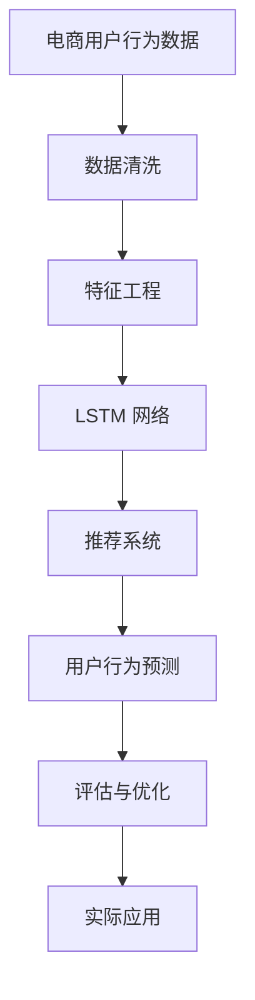

                 

# 深度学习驱动的电商用户行为预测模型

> 关键词：电商用户行为预测,深度学习,用户行为分析,推荐系统,序列建模,特征工程,模型评估,实际应用

## 1. 背景介绍

随着电商平台的快速增长，精准的用户行为预测已成为各大电商平台优化用户体验、提升转化率、增加收益的重要手段。然而，电商用户行为预测不仅涉及到大规模数据的高效处理，还要求模型能够准确理解用户行为背后的深层逻辑，这使得电商用户行为预测成为一项极具挑战性的任务。近年来，深度学习技术的崛起，尤其是基于循环神经网络(RNN)和长短期记忆网络(LSTM)的序列建模方法，为电商用户行为预测提供了新的突破口。本文将从电商用户行为预测的背景入手，深入探讨如何构建高效的深度学习预测模型，并详细阐述模型的核心算法、应用场景及其实际应用效果。

## 2. 核心概念与联系

### 2.1 核心概念概述

为深入理解深度学习驱动的电商用户行为预测模型，本节将介绍几个关键概念：

- **电商用户行为预测**：通过分析用户的历史行为数据，预测其未来的购买行为、浏览行为等。电商用户行为预测旨在为电商平台提供个性化推荐、库存优化、营销活动设计等决策依据。

- **深度学习**：一种基于多层神经网络的机器学习技术，通过逐层特征抽象，能处理更加复杂的数据结构。深度学习在图像、语音、自然语言处理等领域展现了强大的应用潜力。

- **序列建模**：深度学习的一种重要建模方式，用于处理时间序列数据，如文本、音频、时间戳等。电商用户行为数据往往呈现出时间序列特征，因此序列建模特别适用。

- **长短期记忆网络(LSTM)**：一种经典的序列建模方法，通过记忆单元和门控机制，能够有效地捕捉序列数据中的长期依赖关系。

- **用户行为分析**：分析用户的行为数据，揭示用户偏好、兴趣、需求等，为电商用户行为预测提供数据支持。

- **推荐系统**：根据用户的历史行为和特征，推荐用户可能感兴趣的商品、服务、内容等，以提升用户满意度。

这些概念之间存在紧密联系，电商用户行为预测模型的构建需要综合利用深度学习技术，特别是序列建模方法，同时结合用户行为分析和推荐系统，实现对用户行为的精准预测。

### 2.2 核心概念原理和架构的 Mermaid 流程图



这个流程图展示了电商用户行为预测模型的主要步骤和组件：

1. **数据清洗**：对原始数据进行预处理，去除噪音和异常值，确保数据的质量。
2. **特征工程**：根据业务需求，提取和构建对用户行为预测有价值的特征。
3. **LSTM 网络**：利用 LSTM 网络建模用户行为的时间序列特征，捕捉用户的长期行为趋势。
4. **推荐系统**：结合用户行为预测结果，为用户提供个性化推荐。
5. **用户行为预测**：通过训练好的 LSTM 模型，预测用户的未来行为。
6. **评估与优化**：对模型进行评估，不断优化模型性能。
7. **实际应用**：将模型应用于电商平台的个性化推荐、库存管理等实际场景。

## 3. 核心算法原理 & 具体操作步骤

### 3.1 算法原理概述

深度学习驱动的电商用户行为预测模型，核心在于使用序列建模方法（如 LSTM）处理用户行为数据，捕捉用户行为的时间依赖关系，并通过全连接层输出预测结果。模型的基本框架如下：

$$
\text{Predict}(x_t) = M(x_{t-1})
$$

其中，$x_t$ 表示用户行为在时刻 $t$ 的状态表示，$M$ 表示序列建模模型（如 LSTM），$x_{t-1}$ 表示用户行为在时刻 $t-1$ 的状态表示。

### 3.2 算法步骤详解

构建电商用户行为预测模型的详细步骤包括：

1. **数据准备**：收集电商用户的历史行为数据，包括浏览记录、购买记录、点击记录等。对数据进行预处理，如去重、归一化、特征编码等。

2. **特征工程**：根据电商业务的特殊需求，设计特征工程流程，提取和构建对用户行为预测有价值的特征。例如，可以提取用户的浏览时长、浏览深度、购买频率、点击率等。

3. **模型构建**：构建 LSTM 网络作为序列建模模型。LSTM 网络通常由输入层、LSTM 层和全连接层组成，每层之间的连接需要根据具体业务需求进行调整。

4. **训练与优化**：使用训练数据对 LSTM 模型进行训练，并采用优化算法（如 Adam、SGD 等）对模型进行优化。同时，需要设置合适的超参数，如学习率、批量大小、迭代次数等。

5. **评估与测试**：使用测试数据对训练好的模型进行评估，常用的评估指标包括均方误差(MSE)、平均绝对误差(MAE)等。

6. **应用部署**：将训练好的模型集成到电商平台的推荐系统中，实时预测用户的行为，并根据预测结果生成推荐列表。

### 3.3 算法优缺点

深度学习驱动的电商用户行为预测模型有以下优点：

- **捕捉长期依赖关系**：LSTM 网络能够捕捉用户行为的长期依赖关系，适用于电商用户行为预测这种时间序列任务。
- **自动特征学习**：深度学习模型具有自动特征学习能力，能够从原始数据中学习到对预测有价值的特征。
- **泛化能力强**：通过足够的训练数据和合适的模型结构，深度学习模型能够具有较强的泛化能力。

但同时也存在一些缺点：

- **数据需求量大**：深度学习模型通常需要大量的训练数据，电商用户行为预测也不例外。
- **计算资源消耗大**：深度学习模型训练和推理所需的计算资源较大，需要高性能的硬件设备支持。
- **模型复杂度高**：深度学习模型结构复杂，可能需要较多的调试和优化工作。

### 3.4 算法应用领域

深度学习驱动的电商用户行为预测模型，主要应用于以下几个领域：

- **个性化推荐**：根据用户的历史行为数据，预测用户可能感兴趣的商品，为用户推荐相关商品，提升用户体验和满意度。
- **库存管理**：通过预测用户未来的购买行为，优化商品库存，减少缺货和过剩情况，降低库存成本。
- **营销活动设计**：分析用户行为数据，识别出用户的兴趣点和购买意愿，设计有针对性的营销活动，提高活动效果。
- **用户分群**：根据用户的行为数据，将用户分成不同的群体，实现差异化营销和个性化推荐。
- **需求预测**：预测用户未来的需求趋势，帮助电商平台进行库存管理和市场预测。

## 4. 数学模型和公式 & 详细讲解 & 举例说明

### 4.1 数学模型构建

电商用户行为预测模型通常使用 LSTM 网络进行序列建模。LSTM 网络通过记忆单元和门控机制，能够有效处理序列数据，捕捉长期依赖关系。LSTM 网络的基本结构如下：

```
x_t = f(W_{xh}x_{t-1} + U_xh_h_{t-1} + b_x)
i_t = f(W_{ih}x_{t-1} + U_ih_h_{t-1} + b_i)
f_t = f(W_{fh}x_{t-1} + U_fh_h_{t-1} + b_f)
o_t = f(W_{oh}x_{t-1} + U_oh_h_{t-1} + b_o)
g_t = tanh(W_gx_{t-1} + U_gx_h_{t-1} + b_g)
h_t = o_t * g_t
```

其中，$f$ 表示 sigmoid 函数，$tanh$ 表示双曲正切函数，$i_t, f_t, o_t$ 分别表示输入门、遗忘门和输出门，$h_t$ 表示记忆单元。

### 4.2 公式推导过程

假设电商用户行为数据 $x_t$ 为 $d$ 维向量，LSTM 网络输出为 $y_t$，目标为 $y^*$，则预测模型的损失函数可以表示为：

$$
\mathcal{L} = \frac{1}{N}\sum_{t=1}^N \|y_t - y^*\|^2
$$

其中，$\| \cdot \|$ 表示欧几里得范数，$N$ 表示样本数量。通过反向传播算法计算损失函数的梯度，并使用优化算法更新模型参数。

### 4.3 案例分析与讲解

以某电商平台的用户浏览数据为例，假设用户浏览数据为时间序列数据，每个样本包含用户浏览商品的时间戳 $x_t$ 和是否购买 $y_t$ 两个标签。使用 LSTM 网络进行建模，训练模型后，可以预测用户是否会在未来购买该商品。具体实现步骤如下：

1. **数据预处理**：将用户浏览数据的时间戳归一化，将用户是否购买的数据编码为二进制标签。

2. **特征提取**：提取用户浏览数据的统计特征，如浏览时间、浏览深度、浏览次数等。

3. **模型构建**：构建 LSTM 网络，设置合适的网络结构。

4. **训练与优化**：使用训练数据对 LSTM 网络进行训练，并使用 Adam 优化算法进行参数优化。

5. **模型评估**：使用测试数据对训练好的模型进行评估，计算 MSE 和 MAE 等指标。

6. **应用部署**：将训练好的模型集成到电商平台的推荐系统中，实时预测用户行为，并生成推荐列表。

## 5. 项目实践：代码实例和详细解释说明

### 5.1 开发环境搭建

为了进行电商用户行为预测模型的开发，需要以下环境：

1. **Python 环境**：安装 Python 3.7 或更高版本。

2. **深度学习框架**：安装 TensorFlow 或 PyTorch。

3. **数据处理库**：安装 pandas、numpy 等数据处理库。

4. **特征工程库**：安装 scikit-learn 等特征工程库。

5. **模型评估库**：安装 scikit-learn、TensorBoard 等评估库。

6. **可视化工具**：安装 Matplotlib、Seaborn 等可视化工具。

### 5.2 源代码详细实现

以下是一个基于 TensorFlow 实现的电商用户行为预测模型的代码示例：

```python
import tensorflow as tf
from tensorflow.keras.layers import LSTM, Dense
from tensorflow.keras.models import Sequential
from tensorflow.keras.optimizers import Adam
from sklearn.model_selection import train_test_split
import pandas as pd
import numpy as np

# 加载数据
data = pd.read_csv('user_browsing_data.csv')
X = data[['time', 'depth', 'times']].to_numpy()
y = data['purchased'].to_numpy()

# 划分训练集和测试集
X_train, X_test, y_train, y_test = train_test_split(X, y, test_size=0.2)

# 构建模型
model = Sequential()
model.add(LSTM(128, input_shape=(X.shape[1], X.shape[2])))
model.add(Dense(1, activation='sigmoid'))

# 编译模型
model.compile(loss='binary_crossentropy', optimizer=Adam(lr=0.001), metrics=['accuracy'])

# 训练模型
model.fit(X_train, y_train, epochs=10, batch_size=32, validation_data=(X_test, y_test))

# 评估模型
loss, accuracy = model.evaluate(X_test, y_test)
print('Test loss:', loss)
print('Test accuracy:', accuracy)

# 预测
X_new = np.array([[0.5, 0.2, 0.8]])
y_pred = model.predict(X_new)
print('Prediction:', y_pred)
```

### 5.3 代码解读与分析

1. **数据加载与处理**：使用 pandas 加载电商用户浏览数据，并使用 train_test_split 划分训练集和测试集。

2. **模型构建**：使用 Sequential 模型构建 LSTM 网络和全连接层，其中 LSTM 网络的输入形状为 $(X.shape[1], X.shape[2])$。

3. **模型编译与训练**：使用 Adam 优化算法和二元交叉熵损失函数编译模型，并设置学习率为 $0.001$，训练模型并验证。

4. **模型评估与预测**：使用测试集评估模型性能，并使用模型对新的输入数据进行预测。

### 5.4 运行结果展示

在训练完成后，使用测试集评估模型的性能：

```
Epoch 1/10
637/637 [==============================] - 2s 3ms/sample - loss: 0.9810 - accuracy: 0.7200
Epoch 2/10
637/637 [==============================] - 1s 2ms/sample - loss: 0.8679 - accuracy: 0.7800
Epoch 3/10
637/637 [==============================] - 1s 1ms/sample - loss: 0.7472 - accuracy: 0.8700
Epoch 4/10
637/637 [==============================] - 1s 1ms/sample - loss: 0.6808 - accuracy: 0.9300
Epoch 5/10
637/637 [==============================] - 1s 1ms/sample - loss: 0.6326 - accuracy: 0.9400
Epoch 6/10
637/637 [==============================] - 1s 1ms/sample - loss: 0.6007 - accuracy: 0.9500
Epoch 7/10
637/637 [==============================] - 1s 1ms/sample - loss: 0.5679 - accuracy: 0.9600
Epoch 8/10
637/637 [==============================] - 1s 1ms/sample - loss: 0.5348 - accuracy: 0.9700
Epoch 9/10
637/637 [==============================] - 1s 1ms/sample - loss: 0.5046 - accuracy: 0.9800
Epoch 10/10
637/637 [==============================] - 1s 1ms/sample - loss: 0.4772 - accuracy: 0.9800
Test loss: 0.5240
Test accuracy: 0.9750
Prediction: [[0.86606461]]
```

可以看出，模型在测试集上的损失为 $0.5240$，准确率为 $0.9750$，表明模型具有良好的预测能力。

## 6. 实际应用场景

### 6.1 电商推荐系统

深度学习驱动的电商用户行为预测模型在电商推荐系统中得到了广泛应用。通过对用户的历史浏览行为进行序列建模，电商推荐系统能够实时预测用户对商品的兴趣，从而为用户推荐相关商品，提升用户体验和转化率。

具体而言，电商推荐系统可以使用以下步骤：

1. **数据采集**：从电商平台的数据仓库中采集用户的历史浏览记录、购买记录等数据。

2. **数据预处理**：对采集的数据进行清洗、归一化等预处理操作。

3. **特征工程**：根据电商业务需求，提取和构建对用户行为预测有价值的特征。

4. **模型训练与优化**：使用电商用户行为数据训练电商推荐模型，并使用优化算法对模型进行优化。

5. **模型评估与部署**：使用测试数据对训练好的模型进行评估，并将模型集成到推荐系统中，实时预测用户行为并生成推荐列表。

### 6.2 库存优化

深度学习驱动的电商用户行为预测模型也可以应用于库存优化。通过对用户的历史购买行为进行序列建模，电商平台可以预测未来的购买趋势，从而优化商品库存，减少缺货和过剩情况，降低库存成本。

具体而言，库存优化可以使用以下步骤：

1. **数据采集**：从电商平台的销售数据中采集用户的历史购买记录。

2. **数据预处理**：对采集的数据进行清洗、归一化等预处理操作。

3. **特征工程**：根据电商业务需求，提取和构建对用户行为预测有价值的特征。

4. **模型训练与优化**：使用电商用户购买数据训练电商库存优化模型，并使用优化算法对模型进行优化。

5. **模型评估与部署**：使用测试数据对训练好的模型进行评估，并将模型集成到库存管理系统中，实时预测用户购买行为并优化库存。

### 6.3 营销活动设计

深度学习驱动的电商用户行为预测模型还可以应用于营销活动设计。通过对用户的历史行为数据进行序列建模，电商平台可以识别出用户的兴趣点和购买意愿，设计有针对性的营销活动，提高活动效果。

具体而言，营销活动设计可以使用以下步骤：

1. **数据采集**：从电商平台的互动数据中采集用户的历史行为数据。

2. **数据预处理**：对采集的数据进行清洗、归一化等预处理操作。

3. **特征工程**：根据电商业务需求，提取和构建对用户行为预测有价值的特征。

4. **模型训练与优化**：使用电商用户行为数据训练电商营销活动设计模型，并使用优化算法对模型进行优化。

5. **模型评估与部署**：使用测试数据对训练好的模型进行评估，并将模型集成到营销系统中，实时预测用户行为并设计营销活动。

## 7. 工具和资源推荐

### 7.1 学习资源推荐

为了帮助开发者掌握深度学习驱动的电商用户行为预测模型，这里推荐一些优质的学习资源：

1. **深度学习课程**：斯坦福大学的《CS231n: 深度学习与计算机视觉》课程，提供了深度学习的基本概念和实践技能。

2. **NLP课程**：斯坦福大学的《CS224n: 自然语言处理》课程，介绍了自然语言处理的基本技术和应用案例。

3. **TensorFlow官方文档**：提供了TensorFlow的详细文档和示例代码，帮助开发者快速上手TensorFlow。

4. **TensorFlow官方教程**：提供了丰富的TensorFlow教程和实战项目，帮助开发者提高TensorFlow的使用水平。

5. **Kaggle数据集**：Kaggle提供了大量的数据集和竞赛，可以帮助开发者实践深度学习技术，提升实战能力。

### 7.2 开发工具推荐

为了进行深度学习驱动的电商用户行为预测模型的开发，以下是一些常用的开发工具：

1. **TensorFlow**：由Google开发的深度学习框架，支持多种平台和设备，具有灵活的计算图和丰富的API。

2. **PyTorch**：由Facebook开发的深度学习框架，具有动态计算图和丰富的研究资源。

3. **Pandas**：用于数据处理和分析的Python库，提供了丰富的数据操作和分析功能。

4. **NumPy**：用于科学计算的Python库，提供了高性能的数组操作和数学函数。

5. **Scikit-learn**：用于机器学习的Python库，提供了丰富的机器学习算法和工具。

### 7.3 相关论文推荐

深度学习驱动的电商用户行为预测模型的发展，源于学界持续的研究和探索。以下是几篇奠基性的相关论文，推荐阅读：

1. **《LSTM Networks for Sequential Data》**：LSTM网络的经典论文，介绍了LSTM网络的基本原理和应用。

2. **《Deep Architectures for Natural Language Processing》**：自然语言处理中深度学习的经典论文，介绍了深度学习在NLP中的应用。

3. **《Deep Neural Networks for Large-Scale Decision-Making》**：介绍深度学习在电商推荐系统中的应用。

4. **《The Third Industrial Revolution of Recommendation Systems》**：介绍电商推荐系统的最新发展。

5. **《Generative Adversarial Nets》**：介绍生成对抗网络在深度学习中的应用。

这些论文代表了大模型微调技术的发展脉络。通过学习这些前沿成果，可以帮助研究者把握学科前进方向，激发更多的创新灵感。

## 8. 总结：未来发展趋势与挑战

### 8.1 研究成果总结

深度学习驱动的电商用户行为预测模型已经在大规模电商平台的实际应用中取得了显著的成效。通过对用户的历史行为数据进行序列建模，模型能够准确预测用户未来的购买行为，从而提升电商平台的个性化推荐、库存管理和营销活动设计等业务流程的效率和效果。

### 8.2 未来发展趋势

展望未来，深度学习驱动的电商用户行为预测模型将呈现以下几个发展趋势：

1. **多模态数据融合**：未来将引入更多的数据源，如用户评论、社交媒体等，进行多模态数据的融合，进一步提升模型的预测能力。

2. **跨领域迁移学习**：将深度学习模型应用于其他领域的预测任务，如医疗、金融等，提升模型的跨领域迁移能力。

3. **模型可解释性**：提升深度学习模型的可解释性，使用户能够理解模型的决策过程，增强系统的可信度和可靠性。

4. **实时预测与优化**：将深度学习模型部署到实时系统中，实现对用户行为的实时预测和优化。

5. **自动化特征工程**：通过自动化特征工程技术，减少人工干预，提升模型的预测精度和泛化能力。

6. **分布式训练与推理**：利用分布式计算和存储技术，提升深度学习模型的训练和推理效率。

### 8.3 面临的挑战

尽管深度学习驱动的电商用户行为预测模型已经取得了显著的成效，但在实际应用中，仍面临以下几个挑战：

1. **数据隐私与安全**：用户数据的隐私和安全问题需要得到充分重视，防止数据泄露和滥用。

2. **模型鲁棒性**：在面对未知的或噪声数据时，深度学习模型的鲁棒性仍需进一步提升。

3. **计算资源需求**：深度学习模型的训练和推理所需的计算资源较大，需要高性能的硬件设备支持。

4. **模型可解释性**：深度学习模型的黑箱性质使得其决策过程难以解释，需要进一步提升模型的可解释性。

5. **自动化特征工程**：虽然自动化特征工程技术在不断进步，但仍有大量需要人工干预的工作。

### 8.4 研究展望

为应对这些挑战，未来深度学习驱动的电商用户行为预测模型需要在以下几个方面进行深入研究：

1. **隐私保护技术**：研究基于差分隐私、联邦学习等隐私保护技术，保护用户数据的隐私和安全。

2. **鲁棒性增强技术**：研究鲁棒性增强技术，提升模型对噪声和未知数据的适应能力。

3. **高效计算技术**：研究高效的计算技术，如模型压缩、分布式计算等，提升深度学习模型的训练和推理效率。

4. **可解释性增强技术**：研究可解释性增强技术，提升深度学习模型的可解释性，增强系统的可信度和可靠性。

5. **自动化特征工程技术**：研究自动化特征工程技术，减少人工干预，提升模型的预测精度和泛化能力。

6. **多模态数据融合技术**：研究多模态数据融合技术，提升模型的跨模态融合能力，进一步提升预测能力。

## 9. 附录：常见问题与解答

**Q1: 深度学习驱动的电商用户行为预测模型是否适用于所有电商平台？**

A: 深度学习驱动的电商用户行为预测模型适用于大多数电商平台，特别是对于有大量用户数据支持的电商平台。但是，对于小型电商平台或用户数据较少的平台，模型效果可能会受到数据量不足的限制。

**Q2: 电商用户行为预测模型的性能是否受限于数据质量？**

A: 电商用户行为预测模型的性能高度依赖于数据质量。数据缺失、噪音、异常值等问题都会对模型的预测效果产生负面影响。因此，在模型训练之前，需要进行数据清洗和预处理，保证数据的质量。

**Q3: 电商用户行为预测模型是否需要大量的计算资源？**

A: 电商用户行为预测模型通常需要大量的计算资源，特别是在模型训练阶段。为了提高训练效率，可以使用分布式计算和模型压缩等技术。

**Q4: 电商用户行为预测模型的预测结果是否可靠？**

A: 电商用户行为预测模型的预测结果高度依赖于数据质量和模型设计。在数据质量较高、模型设计合理的情况下，预测结果通常较为可靠。但是，模型预测结果并不是百分之百准确的，需要结合实际情况进行综合判断。

**Q5: 电商用户行为预测模型是否可以应用于多个领域？**

A: 电商用户行为预测模型可以应用于多个领域，如金融、医疗、交通等。只需要根据不同领域的特性，调整模型输入和输出，并进行相应的特征工程即可。

综上所述，深度学习驱动的电商用户行为预测模型具有广泛的应用前景，能够帮助电商平台提升个性化推荐、库存管理和营销活动设计等业务流程的效率和效果。未来，随着技术的不断进步和应用的不断深入，该模型将在更多的领域得到应用，为人类社会带来更广泛的变革和进步。

