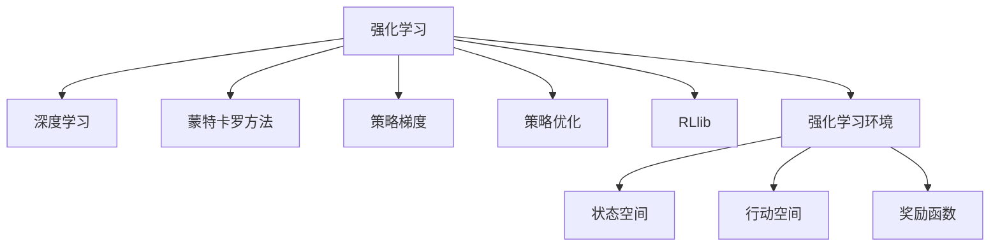

                 

# 深度强化学习：从游戏AI到实际控制系统

> 关键词：深度强化学习,游戏AI,实际控制系统,蒙特卡罗方法,策略梯度,策略优化,RLlib,强化学习环境

## 1. 背景介绍

### 1.1 问题由来
深度强化学习（Deep Reinforcement Learning, DRL）是机器学习领域的重要分支，它融合了深度神经网络和强化学习的优点，通过代理在特定环境（environment）中学习最优策略，从而自动完成复杂的控制任务。近年来，DRL已经在计算机游戏、机器人控制、自动驾驶、金融交易等诸多领域取得了显著的进展，成为了解决复杂决策问题的有效工具。

### 1.2 问题核心关键点
DRL的核心思想是，通过智能体（agent）在环境中不断与环境互动，根据当前状态（state）选择最优的行动（action），逐步优化策略，以最大化长期奖励（reward）。这一过程通常通过深度神经网络模型来实现，在传统强化学习的基础上，利用深度学习的强大表达能力，解决了传统方法难以处理的高维、非线性状态空间问题。

然而，DRL仍面临诸多挑战，如样本效率低、学习过程不稳定、易受环境变化影响等，这些问题亟需进一步研究和优化。同时，如何结合传统控制理论，将DRL应用于实际控制系统，特别是复杂的工业自动化场景，是当前研究的热点。

### 1.3 问题研究意义
研究深度强化学习，对于提升AI决策能力和系统自动化水平，具有重要的理论和实践意义：

1. 提升决策效果。DRL通过模型自主学习优化策略，能够适应动态环境变化，获取最优决策方案，提高系统运行效率和效果。
2. 降低人工干预。利用DRL自主优化控制策略，减少了人工干预和调试工作量，使得系统更易于维护和升级。
3. 拓展应用场景。DRL可以应用于各种复杂决策问题，为传统工业自动化控制、机器人控制、自动驾驶等技术提供新的解决方案。
4. 推动智能系统演进。DRL结合大数据和云计算技术，推动智能化系统向更加自主、智能的方向演进，为未来智能社会的构建奠定基础。
5. 促进跨领域创新。DRL技术在金融、医疗、交通等领域的广泛应用，带来了新一轮的技术革新和产业升级，提升了社会整体效率和效益。

## 2. 核心概念与联系

### 2.1 核心概念概述

为更好地理解深度强化学习的基本原理和算法框架，本节将介绍几个密切相关的核心概念：

- 强化学习（Reinforcement Learning, RL）：通过智能体在环境中与环境互动，根据当前状态选择最优行动，以最大化长期奖励的决策过程。
- 深度学习（Deep Learning, DL）：利用多层神经网络模型自动学习特征表示，提升模型的表达能力和泛化能力。
- 蒙特卡罗方法（Monte Carlo Method）：通过随机采样估计期望，如价值函数、策略等。
- 策略梯度（Policy Gradient, PG）：通过优化策略参数，使智能体在不同状态下的行动更有可能产生高奖励。
- 策略优化（Policy Optimization）：利用优化算法更新策略参数，最大化期望奖励。
- RLlib：Facebook开源的深度强化学习库，提供了丰富的算法实现和工具支持，是DRL实践的重要工具。
- 强化学习环境（Reinforcement Learning Environment）：定义智能体与环境互动的具体框架，包括状态空间、行动空间、奖励函数等。

这些核心概念之间的逻辑关系可以通过以下Mermaid流程图来展示：



这个流程图展示了大深度强化学习的核心概念及其之间的关系：

1. 强化学习是DRL的基础理论，通过智能体与环境互动，优化决策策略。
2. 深度学习提升智能体特征表达能力，使得决策策略更加复杂和精准。
3. 蒙特卡罗方法用于估计策略的价值函数和梯度，引导策略优化。
4. 策略梯度是策略优化的核心算法，利用梯度下降优化策略参数。
5. RLlib提供了丰富的算法实现，支持模型训练和优化。
6. 强化学习环境定义了智能体与环境互动的规则和参数。

这些概念共同构成了深度强化学习的基本框架，使其能够自动学习优化决策策略，处理复杂决策问题。

## 3. 核心算法原理 & 具体操作步骤
### 3.1 算法原理概述

深度强化学习的核心思想是，通过智能体在特定环境中与环境互动，通过深度神经网络模型实现状态特征提取和策略优化，以最大化长期奖励。具体而言，深度强化学习的流程包括以下几个步骤：

1. **环境构建**：定义环境，包括状态空间、行动空间和奖励函数。
2. **模型训练**：使用深度神经网络模型拟合状态表示，构建策略网络。
3. **策略优化**：通过优化策略参数，提升智能体在不同状态下的行动质量和奖励。
4. **模型部署**：将训练好的模型应用于实际环境，实现自动化控制。

### 3.2 算法步骤详解

以基于深度Q网络（Deep Q-Network, DQN）的算法为例，详细介绍深度强化学习的基本流程：

**Step 1: 环境构建**
- 定义环境，包括状态空间（如游戏状态、机器人位置等）、行动空间（如游戏动作、机器人关节角度等）和奖励函数。

**Step 2: 模型训练**
- 使用深度神经网络模型拟合状态表示，构建Q值网络。
- 设计Q值网络的损失函数，如均方误差（MSE）或Huber损失，计算智能体在不同状态下的Q值。
- 使用蒙特卡罗方法估计Q值，如TD误差、Sarsa等。

**Step 3: 策略优化**
- 利用策略梯度方法优化Q值网络，使用Adam或RMSprop等优化算法。
- 在训练过程中，使用经验回放（Experience Replay）技术，存储和重放智能体的经验数据。

**Step 4: 模型部署**
- 将训练好的模型应用于实际环境，实现自动化控制。
- 实时监控智能体的行为，并根据环境反馈进行策略调整。

### 3.3 算法优缺点

深度强化学习的优点包括：
1. 非线性表达能力。深度神经网络模型可以处理高维、非线性状态空间，适应复杂的决策问题。
2. 自主学习。智能体通过与环境互动，自动学习优化策略，减少了人工干预。
3. 鲁棒性强。通过样本数据积累，智能体可以逐步适应环境变化，提升系统的鲁棒性。

然而，深度强化学习也存在一些局限性：
1. 样本效率低。深度神经网络模型的训练需要大量标注数据，而强化学习又是一个高样本消耗的过程。
2. 学习过程不稳定。深度神经网络模型的训练容易陷入局部最优，学习过程不稳定。
3. 易受环境变化影响。环境变化可能导致策略失效，系统性能下降。
4. 计算资源需求高。深度强化学习需要大量的计算资源，包括高性能的GPU、TPU等。

尽管存在这些局限性，但深度强化学习仍是大规模、复杂决策问题的有效工具。通过不断优化算法和模型结构，这些局限性有望得到改善。

### 3.4 算法应用领域

深度强化学习已经在多个领域得到了广泛的应用，具体包括：

- 计算机游戏：如AlphaGo、Dota2等，利用DRL实现自主决策和策略优化。
- 机器人控制：如ROS-Industrial，通过DRL优化机器人的动作和路径规划。
- 自动驾驶：如Waymo，利用DRL实现车辆自主导航和交通决策。
- 金融交易：如AlphaGo的交易版本，通过DRL实现股票市场的高频交易策略。
- 医疗诊断：如通过DRL优化诊断策略，提高医疗决策的准确性和效率。
- 工业控制：如Siemens，通过DRL优化工业流程和生产计划。
- 能源管理：如GridPath，利用DRL优化电网管理和负载调度。

除了上述应用场景外，DRL还在智能家居、物流配送、社交网络等领域展现出了巨大的潜力，成为推动智能化社会建设的重要技术手段。

## 4. 数学模型和公式 & 详细讲解 & 举例说明

### 4.1 数学模型构建

本节将使用数学语言对深度强化学习的基本模型进行严格刻画。

假设智能体在状态空间 $S$ 上，策略为 $\pi$，行动空间为 $A$，奖励函数为 $R$。定义智能体在某状态下选择行动 $a$ 后，从状态 $s_t$ 转移到状态 $s_{t+1}$，并产生奖励 $r_t$。则基于Q值函数的DRL框架可以描述为：

1. 状态表示：定义状态表示函数 $h$，将原始状态空间映射到低维状态向量 $s_t = h(o_t)$。
2. Q值网络：使用深度神经网络模型构建Q值函数 $Q_{\theta}(s_t, a_t) = \mathbb{E}[r_{t+1} + \gamma Q_{\theta}(s_{t+1}, a_{t+1}) | s_t, a_t, h(o_t)]$。
3. 策略优化：使用策略梯度方法优化Q值函数，如策略梯度下降法（PGD）或Actor-Critic算法。

### 4.2 公式推导过程

以下我们以基于策略梯度方法的Actor-Critic算法为例，推导其优化公式。

假设智能体在状态 $s_t$ 上的行动概率为 $\pi(a_t | s_t)$，Q值网络参数为 $\theta$，则策略梯度算法的优化目标为：

$$
\max_{\pi} \mathbb{E}_{\pi} \left[ \sum_{t=0}^{\infty} \gamma^t r_t \right]
$$

利用对数似然比变换，将策略梯度算法转化为：

$$
\max_{\theta} \mathbb{E}_{\pi_{\theta}} \left[ \sum_{t=0}^{\infty} \gamma^t r_t \log \frac{\pi(a_t | s_t)}{\pi(a_t | s_t; \theta)} \right]
$$

进一步展开，得到：

$$
\max_{\theta} \mathbb{E}_{\pi_{\theta}} \left[ \sum_{t=0}^{\infty} \gamma^t r_t \log \frac{P(a_t | s_t; \theta)}{P(a_t | s_t)} \right]
$$

其中 $P(a_t | s_t; \theta)$ 表示智能体在状态 $s_t$ 下选择行动 $a_t$ 的概率，由Q值网络计算得出。通过上述推导，我们可以使用深度神经网络模型和策略梯度方法，优化智能体的决策策略，从而实现强化学习。

### 4.3 案例分析与讲解

以AlphaGo为例，展示深度强化学习在游戏AI中的应用。

AlphaGo通过蒙特卡罗树搜索（MCTS）算法，结合深度神经网络模型和深度强化学习，实现了在围棋领域的超人类表现。AlphaGo通过多层次的策略网络（policy network）和价值网络（value network），分别负责决策和价值估计。在每局游戏中，AlphaGo通过不断与自身进行模拟对抗，优化策略和价值函数，从而逐步提升游戏水平。

AlphaGo的成功经验表明，通过深度强化学习，智能体可以自动学习复杂的决策策略，在复杂环境中实现最优行动。未来，DRL在智能游戏、机器人控制、自动驾驶等领域的广泛应用，将进一步提升人工智能的决策能力和自动化水平。

## 5. 项目实践：代码实例和详细解释说明
### 5.1 开发环境搭建

在进行深度强化学习实践前，我们需要准备好开发环境。以下是使用Python进行PyTorch和RLlib开发的环境配置流程：

1. 安装Anaconda：从官网下载并安装Anaconda，用于创建独立的Python环境。

2. 创建并激活虚拟环境：
```bash
conda create -n drl-env python=3.8 
conda activate drl-env
```

3. 安装PyTorch和RLlib：
```bash
pip install torch torchvision torchaudio cudatoolkit=11.1 -c pytorch -c conda-forge
pip install rl-lib
```

4. 安装各类工具包：
```bash
pip install numpy pandas scikit-learn matplotlib tqdm jupyter notebook ipython
```

完成上述步骤后，即可在`drl-env`环境中开始深度强化学习实践。

### 5.2 源代码详细实现

下面以DQN算法为例，给出使用PyTorch和RLlib对Q值网络进行深度强化学习的PyTorch代码实现。

首先，定义Q值网络的模型：

```python
import torch
import torch.nn as nn
import torch.nn.functional as F

class QNetwork(nn.Module):
    def __init__(self, state_dim, action_dim, hidden_dim):
        super(QNetwork, self).__init__()
        self.fc1 = nn.Linear(state_dim, hidden_dim)
        self.fc2 = nn.Linear(hidden_dim, hidden_dim)
        self.fc3 = nn.Linear(hidden_dim, action_dim)
        
    def forward(self, state):
        x = F.relu(self.fc1(state))
        x = F.relu(self.fc2(x))
        x = self.fc3(x)
        return x
```

然后，定义训练和评估函数：

```python
import torch.optim as optim
from rl import Experiment, Action, ActionType
from gym import spaces

class DQNAgent:
    def __init__(self, env):
        self.state_dim = env.observation_space.shape[0]
        self.action_dim = env.action_space.n
        self.hidden_dim = 64
        self.model = QNetwork(self.state_dim, self.action_dim, self.hidden_dim)
        self.target_model = QNetwork(self.state_dim, self.action_dim, self.hidden_dim)
        self.optimizer = optim.Adam(self.model.parameters(), lr=0.001)
        self.memory = list()
        self.minibatch_size = 64
        
    def act(self, state):
        state = torch.from_numpy(state).float().unsqueeze(0)
        with torch.no_grad():
            return self.model(state).argmax().item()
        
    def update(self, state, action, reward, next_state, done):
        self.memory.append((state, action, reward, next_state, done))
        if len(self.memory) > self.minibatch_size:
            mini_batch = random.sample(self.memory, self.minibatch_size)
            state_batch = torch.from_numpy(np.vstack(mini_batch[:-1]))
            action_batch = torch.from_numpy(np.vstack(mini_batch[1]))
            reward_batch = torch.from_numpy(np.vstack(mini_batch[2]))
            next_state_batch = torch.from_numpy(np.vstack(mini_batch[3]))
            done_batch = torch.from_numpy(np.vstack(mini_batch[4]))
            state_batch = Variable(state_batch)
            action_batch = Variable(action_batch)
            reward_batch = Variable(reward_batch)
            next_state_batch = Variable(next_state_batch)
            done_batch = Variable(done_batch)
            q_values = self.model(state_batch)
            best_q_values = self.target_model(next_state_batch).detach()
            target_q_values = reward_batch + self.gamma * best_q_values.max(1)[0].unsqueeze(1)
            loss = F.smooth_l1_loss(q_values, target_q_values)
            self.optimizer.zero_grad()
            loss.backward()
            self.optimizer.step()
```

最后，启动训练流程并在测试集上评估：

```python
env = gym.make('CartPole-v0')
agent = DQNAgent(env)
training_steps = 1000
for i in range(training_steps):
    state = env.reset()
    done = False
    while not done:
        action = agent.act(state)
        next_state, reward, done, _ = env.step(action)
        agent.update(state, action, reward, next_state, done)
        state = next_state
```

以上就是使用PyTorch和RLlib对DQN进行训练的完整代码实现。可以看到，通过RLlib的封装，我们可以用相对简洁的代码完成DQN算法的实现，而无需关注底层细节。

### 5.3 代码解读与分析

让我们再详细解读一下关键代码的实现细节：

**DQNAgent类**：
- `__init__`方法：初始化智能体的状态空间、行动空间、模型参数等。
- `act`方法：根据当前状态，使用模型计算Q值，选择行动。
- `update`方法：根据当前状态、行动、奖励、下一状态和是否结束，更新模型参数。

**QNetwork类**：
- `__init__`方法：定义模型的神经网络结构。
- `forward`方法：实现前向传播，计算输出结果。

**训练和评估函数**：
- 使用PyTorch的优化器对模型进行优化。
- 定义状态空间、行动空间和奖励函数，构建RLlib的环境。
- 在每轮训练中，智能体通过行动与环境互动，根据当前状态选择行动，并根据行动后的状态和奖励更新模型参数。

可以看到，PyTorch和RLlib的结合使得深度强化学习的实现变得更加便捷高效，开发者可以专注于算法设计和优化。

当然，工业级的系统实现还需考虑更多因素，如模型的保存和部署、超参数的自动搜索、更灵活的策略优化方法等。但核心的DQN算法基本与此类似。

## 6. 实际应用场景
### 6.1 智能游戏AI

深度强化学习在游戏AI领域的应用尤为突出。通过深度强化学习，智能体能够自动学习游戏策略，实现自主决策和竞争。在AlphaGo、Dota2等游戏中，DRL算法已经取得了超人类水平的表现，展示了其强大的决策能力。

### 6.2 机器人控制

机器人控制是DRL的另一重要应用领域。DRL能够帮助机器人通过与环境的互动，逐步学习最优的控制策略。通过与机器人互动，DRL算法能够自动调整控制参数，优化路径规划，提高机器人执行任务的效率和精确度。

### 6.3 自动驾驶

自动驾驶是DRL在实际控制系统中的应用范例。通过DRL算法，车辆可以自主学习驾驶策略，适应不同的道路和交通情况。DRL算法能够优化行车速度、车道选择、避障等决策，提升自动驾驶的安全性和舒适性。

### 6.4 金融交易

金融交易也是DRL的典型应用场景。通过DRL算法，智能体能够实时分析市场数据，预测股票走势，自动生成交易策略。DRL算法在高频交易、风险管理等方面展现了显著的效果，推动了金融科技的发展。

### 6.5 医疗诊断

医疗诊断是DRL在实际控制系统中的应用之一。通过DRL算法，智能体可以自动分析医学影像、病历数据，提供精准的诊断建议。DRL算法能够识别出疾病的早期征兆，预测疾病的发展趋势，辅助医生进行诊断和治疗。

### 6.6 工业控制

工业控制是DRL在实际控制系统中的应用之一。通过DRL算法，智能体能够实时监控生产流程，优化资源分配，提升生产效率。DRL算法能够自动调整生产参数，优化供应链管理，提高企业的竞争力。

### 6.7 能源管理

能源管理是DRL在实际控制系统中的应用之一。通过DRL算法，智能体能够实时监控电网状态，优化负载调度，提升能源利用效率。DRL算法能够自动调整发电和储能策略，确保电网的稳定运行，减少能源浪费。

除了上述应用场景外，DRL还在智能家居、物流配送、社交网络等领域展现出了巨大的潜力，成为推动智能化社会建设的重要技术手段。

## 7. 工具和资源推荐
### 7.1 学习资源推荐

为了帮助开发者系统掌握深度强化学习的理论基础和实践技巧，这里推荐一些优质的学习资源：

1. 《Reinforcement Learning: An Introduction》：由Richard Sutton和Andrew Barto合著的经典教材，深入浅出地介绍了强化学习的基本原理和算法实现。
2. DeepMind的Deep Reinforcement Learning Coursera课程：由Google DeepMind团队主讲，涵盖了深度强化学习的基本算法和实践技巧。
3. OpenAI的Reinforcement Learning with Python tutorial：开源教程，通过实践代码讲解了深度强化学习的基本流程和算法实现。
4. RLlib官方文档：Facebook开源的深度强化学习库，提供了丰富的算法实现和工具支持，是DRL实践的重要工具。
5. Gym环境库：OpenAI开发的强化学习环境库，提供了多种环境供开发者进行测试和实验。

通过对这些资源的学习实践，相信你一定能够快速掌握深度强化学习的精髓，并用于解决实际的决策问题。

### 7.2 开发工具推荐

高效的开发离不开优秀的工具支持。以下是几款用于深度强化学习开发的常用工具：

1. PyTorch：基于Python的开源深度学习框架，灵活动态的计算图，适合快速迭代研究。
2. TensorFlow：由Google主导开发的开源深度学习框架，生产部署方便，适合大规模工程应用。
3. RLlib：Facebook开源的深度强化学习库，提供了丰富的算法实现和工具支持，是DRL实践的重要工具。
4. Weights & Biases：模型训练的实验跟踪工具，可以记录和可视化模型训练过程中的各项指标，方便对比和调优。
5. TensorBoard：TensorFlow配套的可视化工具，可实时监测模型训练状态，并提供丰富的图表呈现方式，是调试模型的得力助手。
6. Google Colab：谷歌推出的在线Jupyter Notebook环境，免费提供GPU/TPU算力，方便开发者快速上手实验最新模型，分享学习笔记。

合理利用这些工具，可以显著提升深度强化学习开发效率，加快创新迭代的步伐。

### 7.3 相关论文推荐

深度强化学习的研究源于学界的持续研究。以下是几篇奠基性的相关论文，推荐阅读：

1. Human-level Control through Deep Reinforcement Learning：DeepMind团队开发的AlphaGo，展示了DRL在游戏AI领域的强大能力。
2. Human-level Atari Game Playing Using Deep Reinforcement Learning：DeepMind团队开发的AlphaGo，在Atari游戏上实现了超人类表现。
3. Playing Atari with deep reinforcement learning：DeepMind团队开发的DQN算法，展示了DRL在游戏AI领域的基本框架和效果。
4. Training a Deep Quantum Control Policy by Classical Computation：Google开发的DeepQ控制算法，展示了DRL在机器人控制领域的应用。
5. The Power of Hybrid Planning and Learning for Robotics：Caltech的Holomad教授开发的混合规划算法，展示了DRL在机器人控制领域的进一步优化。
6. Deep Q-Learning for Autonomous Driving：UCLA的Shimon教授开发的DRL算法，展示了DRL在自动驾驶领域的应用。
7. Deep Reinforcement Learning for Healthcare Decision Making：Stanford的Abbeel教授开发的DRL算法，展示了DRL在医疗诊断领域的应用。

这些论文代表了大深度强化学习的研究进展，通过学习这些前沿成果，可以帮助研究者把握学科前进方向，激发更多的创新灵感。

## 8. 总结：未来发展趋势与挑战

### 8.1 总结

本文对深度强化学习的基本原理和算法流程进行了全面系统的介绍。首先阐述了深度强化学习的基本理论框架，介绍了其主要算法如DQN、Actor-Critic等，并展示了其在计算机游戏、机器人控制、自动驾驶等领域的广泛应用。通过系统的梳理，可以看到，深度强化学习已经成为了处理复杂决策问题的有效工具，为传统工业自动化、智能系统演进提供了新的解决方案。

通过本文的系统梳理，可以看到，深度强化学习已经成为了处理复杂决策问题的有效工具，为传统工业自动化、智能系统演进提供了新的解决方案。未来，深度强化学习将进一步拓展应用场景，推动智能化社会的建设，提升整体社会效率和效益。

### 8.2 未来发展趋势

展望未来，深度强化学习的发展趋势如下：

1. 多模态融合。结合视觉、语音、传感器等多元数据，拓展DRL的决策能力，提升系统的智能水平。
2. 强化学习算法优化。开发更加高效、稳定的强化学习算法，如混合策略、分布式训练等，提升DRL的样本效率和学习效果。
3. 泛化能力提升。通过迁移学习、多任务学习等技术，提升DRL在多场景、多任务上的泛化能力，降低模型对特定数据集的依赖。
4. 智能控制优化。将DRL应用于复杂控制系统，提升系统的鲁棒性和稳定性和稳定性，增强系统应对不确定性能力。
5. 人机协同。探索DRL与人类认知的协同机制，提升系统的智能化水平和用户接受度，推动人机协同智能的发展。

以上趋势凸显了深度强化学习技术的广阔前景。这些方向的探索发展，必将进一步提升DRL的决策能力，为构建智能系统提供新的技术手段。

### 8.3 面临的挑战

尽管深度强化学习已经取得了显著成果，但在迈向更加智能化、普适化应用的过程中，它仍面临诸多挑战：

1. 样本效率低。DRL需要大量标注数据，而数据采集和标注成本较高，限制了其大规模应用。
2. 学习过程不稳定。DRL模型容易陷入局部最优，学习过程不稳定。
3. 易受环境变化影响。环境变化可能导致策略失效，系统性能下降。
4. 计算资源需求高。DRL需要大量的计算资源，包括高性能的GPU、TPU等。
5. 可解释性不足。DRL模型通常是"黑盒"系统，难以解释其内部工作机制和决策逻辑。
6. 安全性有待保障。DRL模型易受恶意攻击，需要考虑模型输出的安全性。

这些挑战限制了深度强化学习的广泛应用，需要进一步研究和优化。

### 8.4 研究展望

面对深度强化学习面临的挑战，未来的研究需要在以下几个方面寻求新的突破：

1. 探索无监督和半监督学习。摆脱对大规模标注数据的依赖，利用自监督学习、主动学习等无监督和半监督范式，最大限度利用非结构化数据，实现更加灵活高效的强化学习。
2. 研究参数高效和计算高效的强化学习范式。开发更加参数高效的强化学习方法，在固定大部分神经网络参数的情况下，只更新极少量的策略参数。同时优化计算图，减少前向传播和反向传播的资源消耗，实现更加轻量级、实时性的部署。
3. 融合因果和对比学习范式。通过引入因果推断和对比学习思想，增强DRL建立稳定因果关系的能力，学习更加普适、鲁棒的语言表征，从而提升模型的泛化性和抗干扰能力。
4. 引入更多先验知识。将符号化的先验知识，如知识图谱、逻辑规则等，与神经网络模型进行巧妙融合，引导强化学习过程学习更准确、合理的决策策略。同时加强不同模态数据的整合，实现视觉、语音等多模态信息与决策策略的协同建模。
5. 结合因果分析和博弈论工具。将因果分析方法引入DRL模型，识别出模型决策的关键特征，增强输出解释的因果性和逻辑性。借助博弈论工具刻画人机交互过程，主动探索并规避模型的脆弱点，提高系统稳定性。
6. 纳入伦理道德约束。在模型训练目标中引入伦理导向的评估指标，过滤和惩罚有偏见、有害的输出倾向。同时加强人工干预和审核，建立模型行为的监管机制，确保输出符合人类价值观和伦理道德。

这些研究方向的探索，必将引领深度强化学习技术迈向更高的台阶，为构建安全、可靠、可解释、可控的智能系统铺平道路。面向未来，深度强化学习技术还需要与其他人工智能技术进行更深入的融合，如知识表示、因果推理、强化学习等，多路径协同发力，共同推动自然语言理解和智能交互系统的进步。只有勇于创新、敢于突破，才能不断拓展深度强化学习的边界，让智能技术更好地造福人类社会。

## 9. 附录：常见问题与解答

**Q1：深度强化学习是否适用于所有决策问题？**

A: 深度强化学习适用于大多数决策问题，特别是那些难以使用传统机器学习模型处理的高维、非线性决策问题。但对于一些特定领域的决策问题，如医学、法律等，还需要结合领域知识进行优化。此外，对于实时性要求高、样本数据不足的应用场景，深度强化学习的效果可能会受到限制。

**Q2：深度强化学习与传统强化学习相比有何优势？**

A: 深度强化学习通过深度神经网络模型提升状态表示能力，能够处理高维、非线性状态空间，适应复杂的决策问题。相较于传统强化学习，深度强化学习能够自动学习复杂的决策策略，无需手动设计状态表示和行动策略，减少了人工干预，提升了学习效率和决策效果。

**Q3：深度强化学习如何应用于实际控制系统？**

A: 深度强化学习可以应用于各种复杂决策问题，如自动驾驶、机器人控制、医疗诊断等。具体应用流程包括：
1. 定义环境，包括状态空间、行动空间和奖励函数。
2. 使用深度神经网络模型拟合状态表示，构建策略网络。
3. 通过优化策略参数，提升智能体在不同状态下的行动质量和奖励。
4. 将训练好的模型应用于实际环境，实现自动化控制。

**Q4：深度强化学习在训练过程中需要注意哪些问题？**

A: 深度强化学习在训练过程中需要注意以下问题：
1. 样本效率低。需要采集大量标注数据，标注成本较高。
2. 学习过程不稳定。容易陷入局部最优，需要设置合适的学习率和优化算法。
3. 易受环境变化影响。环境变化可能导致策略失效，需要持续监控和调整。
4. 计算资源需求高。需要高性能的GPU、TPU等计算资源。
5. 可解释性不足。DRL模型通常是"黑盒"系统，难以解释其内部工作机制和决策逻辑。
6. 安全性有待保障。DRL模型易受恶意攻击，需要考虑模型输出的安全性。

这些问题的解决需要结合具体应用场景进行优化和改进。

**Q5：如何优化深度强化学习模型的计算效率？**

A: 优化深度强化学习模型的计算效率可以从以下几个方面进行：
1. 参数剪枝。去除不必要的神经网络层和参数，减小模型规模，提升计算效率。
2. 量化加速。将浮点模型转为定点模型，压缩存储空间，提高计算效率。
3. 并行计算。利用多核CPU、GPU、TPU等设备进行并行计算，加速训练和推理。
4. 动态更新。采用增量学习、在线学习等技术，实时更新模型参数，提升计算效率。
5. 数据增强。使用数据增强技术，扩大训练样本数量，提升模型的泛化能力。

这些优化策略需要根据具体应用场景进行选择和组合。

**Q6：如何在深度强化学习中引入更多先验知识？**

A: 在深度强化学习中引入更多先验知识，可以采用以下方法：
1. 知识图谱融合。将知识图谱与神经网络模型进行融合，引导模型学习先验知识。
2. 逻辑规则融合。将符号化的先验知识，如逻辑规则、专家经验等，与神经网络模型进行融合，提升决策的准确性和鲁棒性。
3. 多任务学习。将不同任务的知识进行融合，提升模型的泛化能力。
4. 多模态融合。结合视觉、语音、传感器等多元数据，拓展DRL的决策能力，提升系统的智能水平。

这些方法的引入，可以提升深度强化学习的决策能力和泛化能力，增强系统的智能化水平和可靠性。

**Q7：如何提高深度强化学习的泛化能力？**

A: 提高深度强化学习的泛化能力，可以从以下几个方面进行：
1. 数据增强。使用数据增强技术，扩大训练样本数量，提升模型的泛化能力。
2. 多任务学习。将不同任务的知识进行融合，提升模型的泛化能力。
3. 迁移学习。利用预训练模型和迁移学习技术，提升模型的泛化能力。
4. 多模态融合。结合视觉、语音、传感器等多元数据，拓展DRL的决策能力，提升系统的智能水平。
5. 持续学习。持续监控环境变化，及时调整模型参数，提升模型的泛化能力。

这些方法的引入，可以提升深度强化学习的泛化能力，使其能够适应更多场景和任务，提高系统的鲁棒性和稳定性。

**Q8：如何保证深度强化学习模型的安全性？**

A: 保证深度强化学习模型的安全性，可以从以下几个方面进行：
1. 数据安全。保护训练数据的隐私和安全，防止数据泄露和滥用。
2. 模型安全。设计鲁棒性强的模型，防止恶意攻击和干扰。
3. 用户监督。通过人工监督和审核，确保模型输出符合人类价值观和伦理道德。
4. 透明性。提高模型的可解释性，确保模型输出的透明性和可追溯性。
5. 隐私保护。采用隐私保护技术，保护用户隐私，防止数据滥用。

这些措施需要结合具体应用场景进行设计和实施，确保模型输出的安全和可靠。

---

作者：禅与计算机程序设计艺术 / Zen and the Art of Computer Programming

