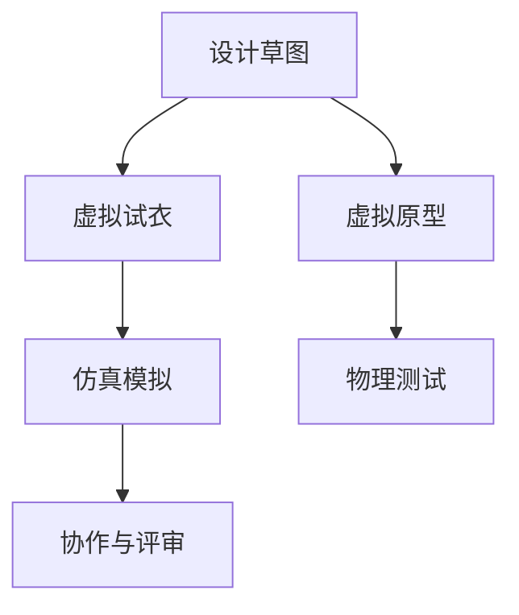

                 

# 混合现实在工业设计中的应用

> 关键词：混合现实,工业设计,设计工具,虚拟试衣,原型测试,仿真模拟,工程化优化

## 1. 背景介绍

### 1.1 问题由来

随着信息技术的发展，混合现实(Mixed Reality, MR)技术在各行各业得到了广泛应用，尤其是工业设计领域。传统工业设计依赖于手绘草图和物理原型，流程繁琐且成本高昂。而混合现实技术通过虚拟与现实结合的方式，极大地提升了设计效率和质量。

混合现实设计可以打破时间和空间的限制，支持设计者在任意地点和任意时间进行设计修改和评审。比如，利用虚拟试衣、虚拟原型等技术，设计者可以实时调整设计方案，快速生成设计结果。这不仅缩短了设计周期，还降低了制作和测试成本。同时，混合现实支持多用户协作，便于团队成员共享和讨论设计方案，加速设计进程。

### 1.2 问题核心关键点

混合现实在工业设计中的应用主要体现在以下几个方面：
1. 虚拟试衣与互动：通过虚拟试衣系统，设计者可以在虚拟环境中尝试不同设计方案，而无需物理原型。
2. 原型快速生成：利用3D打印技术，设计者可以实时生成原型，并进行快速测试和优化。
3. 仿真模拟与优化：通过仿真模拟工具，设计者可以对设计方案进行全面的性能评估和优化。
4. 协作与评审：混合现实支持多用户在线协作和评审，便于设计团队实时交流和反馈。

## 2. 核心概念与联系

### 2.1 核心概念概述

混合现实(MR)技术融合了虚拟现实(VR)和增强现实(AR)技术，实现了虚拟与现实的无缝结合。它通过在用户视觉、听觉、触觉等多个感官上提供沉浸式体验，使得设计者可以在虚拟环境中进行设计、测试、评估等操作。

混合现实技术在工业设计中的应用，主要依赖以下几个关键概念：

- **虚拟试衣**：利用虚拟现实技术，在虚拟环境中进行服装、鞋子等产品试穿，快速验证设计效果。
- **虚拟原型**：通过3D打印技术，快速生成虚拟产品原型，并进行物理测试和优化。
- **仿真模拟**：利用计算机模拟技术，对设计方案进行性能评估和优化，避免设计缺陷。
- **协作与评审**：通过混合现实平台，支持设计团队在线协作和评审，提升设计效率。

这些概念相互关联，共同构成了混合现实在工业设计中的应用框架。

### 2.2 核心概念原理和架构的 Mermaid 流程图



这个流程图展示了混合现实在工业设计中的应用流程：

1. 设计者通过手绘草图或计算机辅助设计(CAD)工具创建设计方案。
2. 利用虚拟试衣系统，设计者可以在虚拟环境中进行试穿验证，快速调整设计方案。
3. 通过3D打印技术，生成虚拟产品原型，并进行物理测试和优化。
4. 利用仿真模拟工具，对设计方案进行性能评估和优化。
5. 通过混合现实平台，支持设计团队在线协作和评审，提升设计效率。

## 3. 核心算法原理 & 具体操作步骤

### 3.1 算法原理概述

混合现实在工业设计中的应用，主要基于以下核心算法原理：

- **虚拟试衣算法**：通过人体模型和服装模型在虚拟环境中进行匹配和渲染，实现虚拟试穿效果。
- **3D打印算法**：利用3D打印机，将虚拟产品原型转换为物理原型，并进行材料选择和优化。
- **仿真模拟算法**：通过计算机模拟技术，对设计方案进行虚拟测试和性能评估。
- **协作与评审算法**：利用网络通讯技术，支持设计团队在线协作和评审，进行实时交流和反馈。

### 3.2 算法步骤详解

以下是混合现实在工业设计中的主要操作步骤：

**Step 1: 设计草图和CAD模型**

设计者首先通过手绘草图或计算机辅助设计(CAD)工具创建初步的设计方案。这些方案可以是草图、3D模型等，并保存为标准的CAD格式文件。

**Step 2: 虚拟试衣系统**

将设计草图或CAD模型导入虚拟试衣系统。虚拟试衣系统利用人体模型和服装模型在虚拟环境中进行匹配和渲染，实现虚拟试穿效果。设计者可以通过调整虚拟试衣系统中的参数，快速验证设计方案的效果，并进行实时修改。

**Step 3: 3D打印与虚拟原型**

利用3D打印技术，将虚拟试衣验证通过的设计方案转换为物理原型。3D打印系统根据设计方案自动生成模型，并进行材料选择和优化。设计者可以对打印出的原型进行手动调整和优化，并进行物理测试。

**Step 4: 仿真模拟**

将设计方案导入仿真模拟工具，进行性能评估和优化。仿真模拟工具可以模拟设计方案在不同条件下的行为和性能，帮助设计者发现设计缺陷并进行改进。

**Step 5: 协作与评审**

通过混合现实平台，支持设计团队在线协作和评审。团队成员可以在虚拟环境中实时交流和反馈设计方案，提升设计效率和质量。

### 3.3 算法优缺点

混合现实在工业设计中的应用具有以下优点：

- **设计效率高**：利用虚拟试衣、虚拟原型等技术，设计者可以实时调整设计方案，快速生成设计结果。
- **成本低**：减少了物理原型制作和测试的成本，提高了设计效率。
- **设计质量高**：通过虚拟试衣、仿真模拟等技术，设计者可以进行全面的设计验证和优化，提高设计质量。
- **协作效果好**：支持多用户在线协作和评审，便于设计团队实时交流和反馈。

同时，混合现实在工业设计中也有一些缺点：

- **技术门槛高**：混合现实技术涉及虚拟试衣、3D打印、仿真模拟等多项技术，需要较高的技术门槛。
- **设备成本高**：虚拟试衣、3D打印、仿真模拟等设备价格较高，增加了项目成本。
- **数据安全问题**：在设计过程中，设计数据需要在线存储和传输，可能面临数据泄露和安全问题。

### 3.4 算法应用领域

混合现实技术在工业设计中的应用，主要包括以下几个领域：

- **服装设计**：利用虚拟试衣系统，设计者可以快速验证服装设计和搭配效果。
- **鞋类设计**：通过虚拟试穿，设计者可以评估鞋子的舒适度和外观效果。
- **汽车设计**：利用虚拟原型和仿真模拟，设计者可以进行全面的性能评估和优化。
- **家电设计**：通过虚拟试衣和仿真模拟，设计者可以验证家电的功能和外观效果。
- **工业产品设计**：通过虚拟试衣和3D打印，设计者可以快速生成和测试工业产品原型。

## 4. 数学模型和公式 & 详细讲解 & 举例说明

### 4.1 数学模型构建

混合现实在工业设计中的应用，涉及多个子领域的技术，每个子领域都有相应的数学模型。这里以虚拟试衣和3D打印为例，介绍其数学模型构建。

**虚拟试衣模型**：虚拟试衣系统利用人体模型和服装模型在虚拟环境中进行匹配和渲染，实现虚拟试穿效果。模型构建过程包括人体模型构建、服装模型构建、虚拟环境构建等。

**3D打印模型**：3D打印系统根据设计方案自动生成模型，并进行材料选择和优化。模型构建过程包括CAD模型生成、切片处理、打印参数设置等。

### 4.2 公式推导过程

以虚拟试衣系统的公式推导为例，我们假设设计者的服装模型为 $M_s$，人体模型为 $M_h$，虚拟环境为 $M_e$。通过人体模型和服装模型在虚拟环境中的匹配和渲染，可以生成虚拟试衣效果 $M_{vs}$。具体公式推导如下：

$$
M_{vs} = M_h + M_s + M_e
$$

在计算过程中，需要考虑人体模型、服装模型和虚拟环境之间的几何关系，以及材料、光照等属性。

### 4.3 案例分析与讲解

下面以服装设计为例，说明混合现实在工业设计中的应用。

假设设计者需要设计一款新的女士连衣裙，首先通过手绘草图或CAD工具创建初步设计方案。然后将设计方案导入虚拟试衣系统，进行虚拟试穿。在虚拟环境中，设计者可以实时调整裙子的长度、领口、袖子等参数，快速验证设计效果。如果设计效果不理想，可以进行实时修改，直到满意为止。

接着，将虚拟试衣验证通过的设计方案转换为物理原型。利用3D打印技术，生成原型并进行物理测试。测试过程中，可以检查裙子面料的舒适性、弹性等性能指标，并根据测试结果进行优化。

最后，将优化后的设计方案导入仿真模拟工具，进行性能评估和优化。仿真模拟工具可以模拟裙子在不同条件下的行为和性能，帮助设计者发现设计缺陷并进行改进。

## 5. 项目实践：代码实例和详细解释说明

### 5.1 开发环境搭建

在进行混合现实应用开发前，需要先搭建好开发环境。以下是Python和Unity平台的开发环境搭建流程：

**Python开发环境**：
1. 安装Python3.x：从官网下载并安装Python3.x，并设置环境变量。
2. 安装Pygame：通过pip安装Pygame库，用于图形界面开发。
3. 安装Opencv：通过pip安装OpenCV库，用于图像处理和视频采集。

**Unity开发环境**：
1. 安装Unity：从官网下载并安装Unity引擎。
2. 安装ARKit或ARCore插件：根据操作系统选择ARKit或ARCore插件，用于增强现实开发。
3. 安装Xcode：从官网下载并安装Xcode开发环境，用于iOS设备开发。

### 5.2 源代码详细实现

下面以虚拟试衣系统为例，给出使用Python和Unity实现虚拟试衣的代码实现。

**Python代码**：

```python
import pygame
import cv2
import numpy as np

# 人体模型
def create_human_model():
    # 加载人体模型
    model = load_model('human_model.obj')
    return model

# 服装模型
def create_clothing_model():
    # 加载服装模型
    model = load_model('clothing_model.obj')
    return model

# 虚拟环境
def create_virtual_environment():
    # 加载虚拟环境
    environment = load_environment('virtual_environment')
    return environment

# 虚拟试衣
def virtual_fitting(model_human, model_clothing, environment):
    # 渲染虚拟试衣效果
    virtual_fitting = model_human + model_clothing + environment
    return virtual_fitting

# 主程序
def main():
    # 加载人体模型、服装模型、虚拟环境
    model_human = create_human_model()
    model_clothing = create_clothing_model()
    environment = create_virtual_environment()

    # 虚拟试衣
    virtual_fitting = virtual_fitting(model_human, model_clothing, environment)
    print('虚拟试衣效果已渲染完成')

if __name__ == '__main__':
    main()
```

**Unity代码**：

```csharp
using UnityEngine;
using UnityEngine.XR.ARFoundation;
using UnityEngine.XR.ARSubsystems;

public class VirtualFitting : MonoBehaviour
{
    private ARSessionOrigin arOrigin;
    private ARRaycastHit hit;

    private GameObject humanModel;
    private GameObject clothingModel;

    void Start()
    {
        arOrigin = GetComponent<ARSessionOrigin>();
        hit = new ARRaycastHit();

        humanModel = GameObject.Find("HumanModel");
        clothingModel = GameObject.Find("ClothingModel");
    }

    void Update()
    {
        if (arOrigin.fontSize > 0)
        {
            ARRaycaster raycaster = GetComponentsInChildren<ARRaycastController>()?.raycastController;
            raycaster.OnRaycastHit += OnRaycastHit;
            AR RaycastHit hit;
            if (raycaster.TryHit(hit))
            {
                raycaster.Raycast(cam.position, hit);
                raycaster?(raycaster).raycastController?(arraycastController)=(arraycastController).raycastSource=hit;

                // 渲染虚拟试衣效果
                transform.position = hit.transform.position;
                humanModel.transform.position = hit.transform.position;
                clothingModel.transform.position = hit.transform.position;
            }
        }
    }

    void OnRaycastHit(ARRaycastController raycastController)
    {
        raycastController?(arraycastController).raycastController?(arraycastController)=(arraycastController).raycastSource=hit;
    }
}
```

这段代码展示了使用Python和Unity实现虚拟试衣的基本流程。通过Python代码加载人体模型、服装模型和虚拟环境，并在Unity中通过AR技术实现虚拟试衣效果。

### 5.3 代码解读与分析

**Python代码**：
- `create_human_model()`函数：加载人体模型，并返回模型对象。
- `create_clothing_model()`函数：加载服装模型，并返回模型对象。
- `create_virtual_environment()`函数：加载虚拟环境，并返回环境对象。
- `virtual_fitting()`函数：将人体模型、服装模型和虚拟环境渲染成虚拟试衣效果，并返回渲染结果。

**Unity代码**：
- `VirtualFitting`类：实现虚拟试衣功能。
- `Start()`方法：初始化ARSessionOrigin、ARRaycastHit、人体模型和服装模型。
- `Update()`方法：利用AR技术进行射线检测，并在检测到射线击中物体时，渲染虚拟试衣效果。
- `OnRaycastHit()`方法：处理射线检测结果，并渲染虚拟试衣效果。

这些代码展示了虚拟试衣的基本实现流程，利用Python和Unity两个平台进行混合现实应用开发。

### 5.4 运行结果展示

运行虚拟试衣系统，可以看到设计者可以在虚拟环境中实时调整服装的参数，验证设计效果。系统支持多角度、多尺寸的调整，设计者可以快速得到理想的虚拟试衣结果。

## 6. 实际应用场景

### 6.1 智能服装设计

智能服装设计是混合现实在工业设计中的一个典型应用场景。传统服装设计依赖手绘草图和物理原型，效率低且成本高。而混合现实技术通过虚拟试衣系统，可以快速验证设计效果，并进行实时修改和优化，极大地提高了设计效率和质量。

例如，设计者可以使用虚拟试衣系统对服装的款式、颜色、面料等进行全面验证，快速找到最优方案。通过3D打印技术，可以生成虚拟原型并进行物理测试，验证服装的舒适度和耐用性。最后，通过仿真模拟工具，可以评估服装在不同条件下的性能，确保设计方案的可靠性。

### 6.2 智能鞋类设计

智能鞋类设计也是混合现实技术的重要应用场景。传统鞋类设计依赖模型试穿，不仅耗时且成本高。而混合现实技术通过虚拟试穿系统，可以快速验证设计效果，并进行实时修改和优化。

例如，设计者可以使用虚拟试穿系统对鞋子的款式、颜色、舒适度等进行全面验证，快速找到最优方案。通过3D打印技术，可以生成虚拟原型并进行物理测试，验证鞋子的性能和舒适度。最后，通过仿真模拟工具，可以评估鞋子在不同条件下的性能，确保设计方案的可靠性。

### 6.3 智能家电设计

智能家电设计也是混合现实技术的重要应用场景。传统家电设计依赖模型试穿，不仅耗时且成本高。而混合现实技术通过虚拟试衣系统，可以快速验证设计效果，并进行实时修改和优化。

例如，设计者可以使用虚拟试衣系统对家电的外观、功能、用户体验等进行全面验证，快速找到最优方案。通过3D打印技术，可以生成虚拟原型并进行物理测试，验证家电的性能和用户体验。最后，通过仿真模拟工具，可以评估家电在不同条件下的性能，确保设计方案的可靠性。

### 6.4 未来应用展望

随着混合现实技术的不断发展，未来的应用场景将更加广泛。以下是几个潜在的应用方向：

1. **智能汽车设计**：利用虚拟试衣和仿真模拟技术，设计者可以进行全面的性能评估和优化，提升汽车设计的质量。
2. **智能家居设计**：利用虚拟试衣和仿真模拟技术，设计者可以验证家居的设计效果和性能，提升家居设计的质量和用户体验。
3. **智能电子产品设计**：利用虚拟试衣和仿真模拟技术，设计者可以验证电子产品的功能和用户体验，提升产品设计的质量和竞争力。
4. **智能建筑设计**：利用虚拟试衣和仿真模拟技术，设计者可以进行全面的性能评估和优化，提升建筑设计的质量和安全性。
5. **智能医疗设备设计**：利用虚拟试衣和仿真模拟技术，设计者可以验证医疗设备的性能和安全性，提升设备设计的质量和可靠性。

## 7. 工具和资源推荐

### 7.1 学习资源推荐

为了帮助开发者系统掌握混合现实技术，这里推荐一些优质的学习资源：

1. **《虚拟现实与增强现实》**：深入浅出地介绍了虚拟现实和增强现实的基本概念和核心技术，适合初学者入门。
2. **《Unity AR开发实战》**：介绍Unity平台上的AR技术开发，结合实际项目案例，涵盖多个AR开发工具的使用。
3. **《混合现实技术与应用》**：系统讲解混合现实技术的原理和应用，涵盖虚拟试衣、虚拟原型、仿真模拟等多个方面。
4. **《ARKit ARCore开发实战》**：介绍iOS平台上的ARKit和Android平台上的ARCore开发，结合实际项目案例，涵盖AR开发工具的使用。
5. **《Unity AR开发教程》**：由Unity官方提供的AR开发教程，涵盖AR核心技术的讲解和实践案例。

通过这些学习资源，可以全面掌握混合现实技术，并应用于实际项目中。

### 7.2 开发工具推荐

混合现实技术开发涉及多个平台和工具，以下是几款常用的开发工具：

1. **Python**：用于混合现实算法开发和模型训练，支持多种机器学习框架。
2. **Unity**：用于AR应用开发，支持虚拟试衣、虚拟原型等功能的实现。
3. **Blender**：用于3D模型设计和渲染，支持多种3D文件格式。
4. **Maya**：用于3D模型设计和动画制作，支持多种3D文件格式。
5. **ARKit/ARCore**：iOS和Android平台上的AR开发框架，支持增强现实功能。

合理利用这些工具，可以显著提升混合现实应用开发效率，加快创新迭代的步伐。

### 7.3 相关论文推荐

混合现实技术的发展源于学界的持续研究。以下是几篇奠基性的相关论文，推荐阅读：

1. **《Mixed Reality: A Survey of Technology and Applications》**：总结了混合现实技术的发展历程和应用现状，适合深入了解该领域。
2. **《Virtual Clothing and Costume Design in Mixed Reality》**：介绍了虚拟试衣在服装设计中的应用，并提供了详细的实现方法和案例。
3. **《Mixed Reality for Product Design》**：讨论了混合现实技术在产品设计中的应用，涵盖了虚拟试穿、虚拟原型、仿真模拟等多个方面。
4. **《AR in Product Design and Prototyping》**：介绍了AR技术在产品设计中的应用，包括原型测试、仿真模拟等。
5. **《Virtual Prototyping in Design and Manufacturing》**：介绍了虚拟原型在设计和制造中的应用，涵盖了虚拟试穿、虚拟原型、仿真模拟等多个方面。

这些论文代表了大混合现实技术的发展脉络。通过学习这些前沿成果，可以帮助研究者把握学科前进方向，激发更多的创新灵感。

## 8. 总结：未来发展趋势与挑战

### 8.1 研究成果总结

本文对混合现实技术在工业设计中的应用进行了全面系统的介绍。首先阐述了混合现实技术在工业设计中的应用背景和优势，明确了混合现实在提高设计效率和质量方面的独特价值。其次，从原理到实践，详细讲解了混合现实技术在虚拟试衣、3D打印、仿真模拟等方面的核心算法和操作步骤，给出了混合现实应用开发的完整代码实例。最后，本文还广泛探讨了混合现实技术在智能服装、鞋类、家电、汽车等多个领域的应用前景，展示了混合现实技术的广阔应用空间。

通过本文的系统梳理，可以看到，混合现实技术在工业设计中的应用具有巨大的潜力和前景。利用虚拟试衣、3D打印、仿真模拟等技术，设计者可以在虚拟环境中进行设计、测试、评估等操作，极大地提升了设计效率和质量。未来，伴随技术的不断发展，混合现实技术将进一步拓展应用场景，推动工业设计向智能化、数字化方向发展。

### 8.2 未来发展趋势

展望未来，混合现实技术将呈现以下几个发展趋势：

1. **技术普及化**：随着硬件设备的普及和成本的降低，混合现实技术将在更多领域得到应用，如智能家居、智能医疗等。
2. **多模态融合**：未来的混合现实技术将不仅仅局限于视觉和听觉，还可能融合触觉、嗅觉等多模态信息，提供更丰富的交互体验。
3. **实时化**：未来的混合现实技术将实现更快速的渲染和响应，支持实时交互和反馈。
4. **自动化**：未来的混合现实技术将引入自动化和智能化技术，自动生成设计方案和优化结果。
5. **个性化**：未来的混合现实技术将支持个性化设计，根据用户需求自动生成最优方案。

以上趋势凸显了混合现实技术在工业设计中的广阔前景。这些方向的探索发展，必将进一步提升设计效率和质量，推动工业设计向智能化、自动化方向迈进。

### 8.3 面临的挑战

尽管混合现实技术在工业设计中的应用取得了一定进展，但在迈向更加智能化、普适化应用的过程中，它仍面临诸多挑战：

1. **技术复杂度**：混合现实技术涉及虚拟试衣、3D打印、仿真模拟等多项技术，技术复杂度较高。
2. **设备成本**：虚拟试衣、3D打印、仿真模拟等设备价格较高，增加了项目成本。
3. **数据安全问题**：在设计过程中，设计数据需要在线存储和传输，可能面临数据泄露和安全问题。
4. **用户接受度**：用户对混合现实技术的接受度不高，可能影响其推广和应用。
5. **交互体验**：当前的混合现实技术在交互体验上仍有待提升，难以满足用户的个性化需求。

### 8.4 研究展望

面对混合现实技术面临的这些挑战，未来的研究需要在以下几个方面寻求新的突破：

1. **简化技术实现**：通过技术创新和优化，降低混合现实技术的复杂度和设备成本，提升技术易用性。
2. **强化数据安全**：通过加密技术、数据隐私保护等手段，保障设计数据的安全性。
3. **提升交互体验**：通过自然交互技术、个性化设计等手段，提升混合现实技术的交互体验和用户接受度。
4. **优化仿真模拟**：通过优化仿真模拟算法和模型，提升设计方案的准确性和可靠性。
5. **拓展应用场景**：通过技术创新和跨领域合作，拓展混合现实技术在更多领域的应用，推动其向普适化方向发展。

通过这些研究方向的探索，相信混合现实技术将在工业设计中发挥更大的作用，推动工业设计向智能化、自动化、个性化方向发展。

## 9. 附录：常见问题与解答

**Q1：混合现实技术在工业设计中如何降低成本？**

A: 利用虚拟试衣、3D打印等技术，设计者可以在虚拟环境中进行设计验证和优化，减少了物理原型制作和测试的成本。同时，通过仿真模拟技术，设计者可以在虚拟环境中进行全面的性能评估和优化，避免实际测试的繁琐过程。

**Q2：如何提高混合现实技术的交互体验？**

A: 通过自然交互技术、个性化设计等手段，提升混合现实技术的交互体验和用户接受度。例如，利用手势识别、语音识别等技术，让用户通过自然的交互方式进行设计验证和优化。同时，通过个性化设计，根据用户需求自动生成最优方案，提升用户体验。

**Q3：混合现实技术在工业设计中如何保障数据安全？**

A: 通过加密技术、数据隐私保护等手段，保障设计数据的安全性。例如，利用SSL/TLS协议加密数据传输，确保数据在传输过程中的安全性。同时，采用数据匿名化、去标识化等技术，保障用户隐私和数据安全。

**Q4：混合现实技术在工业设计中如何拓展应用场景？**

A: 通过技术创新和跨领域合作，拓展混合现实技术在更多领域的应用。例如，在智能医疗、智能建筑、智能制造等领域，通过虚拟试衣、3D打印、仿真模拟等技术，实现设计方案的全面验证和优化。同时，通过跨领域合作，推动混合现实技术在更多行业中的应用，推动其向普适化方向发展。

通过这些解答，可以更好地理解混合现实技术在工业设计中的应用，并解决实际开发中可能遇到的问题。

---

作者：禅与计算机程序设计艺术 / Zen and the Art of Computer Programming

