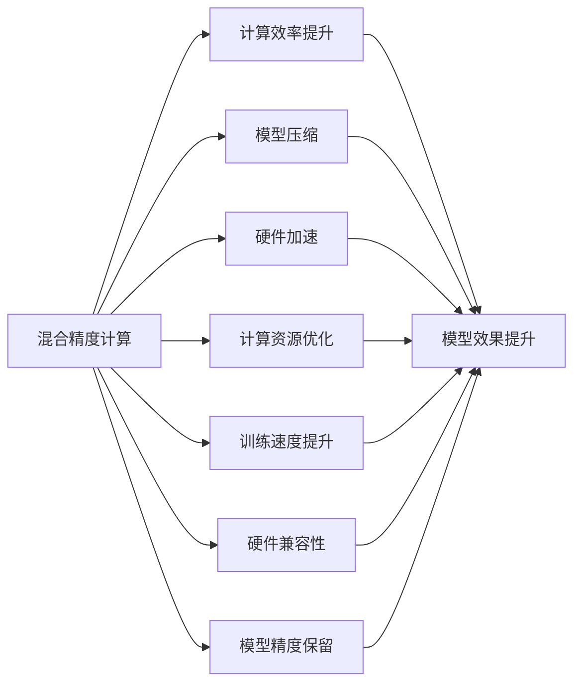

                 

# 混合精度在工业界中的应用

> 关键词：混合精度, 深度学习, 计算效率, 深度学习框架, 硬件加速, 计算资源优化, 模型压缩, 训练速度, 工业应用

## 1. 背景介绍

随着深度学习技术的快速发展和应用场景的不断扩大，深度学习模型的规模和复杂度日益增加，对计算资源的需求也在不断攀升。特别是近年来，大模型如GPT-3和BERT等在大规模语料上进行预训练，参数量已达到数十亿级别，这不仅对计算硬件提出了更高要求，也对计算效率和资源优化提出了新的挑战。

在这一背景下，混合精度计算应运而生。混合精度计算是指在深度学习模型训练过程中，使用不同位宽的浮点数来存储和计算模型参数和中间变量，从而在保持模型精度的情况下，提高计算效率，降低计算成本。其核心思想是通过减少计算精度，同时保留部分高精度计算，以适应不同类型的计算任务，实现计算资源的更优利用。

混合精度计算技术已被广泛应用于各个领域，从科学研究到工业生产，从硬件加速到软件优化，混合精度计算正逐步成为深度学习应用中的重要工具。本文将详细介绍混合精度的基本原理、关键步骤、优缺点及应用领域，并通过案例分析和项目实践，进一步展示混合精度在工业界中的实际应用效果。

## 2. 核心概念与联系

### 2.1 核心概念概述

为更好地理解混合精度计算，首先需要明确几个关键概念：

- 混合精度(Mixed Precision)：指在深度学习模型训练过程中，使用不同位宽的浮点数来存储和计算模型参数和中间变量。通常采用float32和float16两种精度，根据计算任务的不同，选择不同的精度组合。

- 计算效率与精度平衡：深度学习模型的计算精度直接影响模型的效果，但高精度计算往往需要更高的计算资源。混合精度计算通过降低部分计算的精度，同时保留高精度计算，在两者之间找到平衡，既保证了模型精度，又提高了计算效率。

- 硬件加速与计算资源优化：深度学习模型训练过程中，计算资源消耗是主要瓶颈之一。通过混合精度计算，可以有效利用硬件加速器如GPU、TPU等，提升训练速度，同时降低能耗和存储需求。

- 模型压缩与参数优化：在保持模型精度的情况下，混合精度计算还可以帮助模型实现参数压缩，减少模型大小，提高模型存储和传输效率。

- 训练速度与硬件兼容性：混合精度计算可以显著提升模型训练速度，同时兼容各种硬件平台，包括CPU、GPU、TPU等，支持分布式训练，适应不同规模的计算任务。

这些概念之间的逻辑关系可以通过以下Mermaid流程图来展示：



这个流程图展示了混合精度计算的核心概念及其与其他相关技术之间的联系：

1. 混合精度通过降低计算精度，提升计算效率，支持高精度计算，确保模型精度。
2. 混合精度计算帮助模型实现参数压缩，减少模型大小，优化计算资源。
3. 混合精度计算支持硬件加速，提升训练速度，提高硬件兼容性，适应不同规模的计算任务。

## 3. 核心算法原理 & 具体操作步骤

### 3.1 算法原理概述

混合精度计算的原理主要基于两种浮点数精度：float16和float32。其中，float16为半精度浮点数，存储的位数为16位，而float32为单精度浮点数，存储的位数为32位。

在深度学习模型中，通常将模型参数和中间变量存储为float32，以保证计算精度。但在某些计算步骤中，如卷积、线性变换等，可以采用float16进行计算，以减少计算量，提升计算效率。

具体地，混合精度计算的步骤如下：
1. 选择合适的计算精度：在模型中，通常选择部分层采用float32计算，其余层采用float16计算，以平衡精度和效率。
2. 混合精度数据类型转换：在模型中使用混合精度数据类型转换函数，将不同精度的数据类型进行转换，以保证计算的连续性。
3. 混合精度优化器：在优化器中使用混合精度优化算法，如AdamW、SGD等，确保在混合精度计算中的稳定性和准确性。
4. 混合精度模型评估：在模型评估过程中，可以使用不同的精度进行评估，以确保模型在各种精度下均能取得良好效果。

### 3.2 算法步骤详解

下面以TensorFlow框架为例，详细阐述混合精度计算的步骤：

**Step 1: 选择计算精度**
在TensorFlow中，可以通过设置`tf.keras.mixed_precision`模块来选择计算精度。例如，以下代码选择了所有层采用float32计算，仅在特定层采用float16计算：

```python
from tensorflow.keras.mixed_precision import experimental as mixed_precision

# 设置计算精度
mixed_precision.set_global_policy('mixed_float16')
```

**Step 2: 混合精度数据类型转换**
在模型中，通常需要将不同精度的数据类型进行转换，以确保计算的连续性。TensorFlow提供了`tf.cast`函数来实现数据类型转换：

```python
input_data = tf.constant([1.0, 2.0, 3.0], dtype=tf.float32)
# 将float32数据转换为float16
input_data_float16 = tf.cast(input_data, tf.float16)
```

**Step 3: 混合精度优化器**
在优化器中使用混合精度优化算法，例如使用AdamW优化器：

```python
from tensorflow.keras.optimizers import AdamW

# 创建AdamW优化器
optimizer = AdamW(learning_rate=0.001)
# 将优化器设置为混合精度优化器
optimizer = mixed_precision.LossScaleOptimizer(optimizer)
```

**Step 4: 混合精度模型评估**
在模型评估过程中，可以使用不同的精度进行评估，以确保模型在各种精度下均能取得良好效果：

```python
# 在float32精度下评估模型
model.eval()
with tf.GradientTape() as tape:
    output = model(input_data)
    loss = loss_fn(output, target)
    grads = tape.gradient(loss, model.trainable_variables)

# 在float16精度下评估模型
model.eval()
with tf.GradientTape(persistent=True) as tape:
    output = model(input_data)
    loss = loss_fn(output, target)
    grads = tape.gradient(loss, model.trainable_variables)
```

### 3.3 算法优缺点

混合精度计算具有以下优点：

1. 提高计算效率：通过降低部分计算精度，混合精度计算可以显著提升计算效率，缩短模型训练时间。
2. 减少计算资源消耗：混合精度计算可以降低计算资源的消耗，包括计算能耗和存储需求，提升计算资源利用率。
3. 优化硬件加速：混合精度计算支持硬件加速器如GPU、TPU等，提高训练速度，加速模型收敛。
4. 改善模型效果：通过混合精度计算，模型可以在保持精度的情况下，取得更好的效果。

然而，混合精度计算也存在一些缺点：

1. 模型精度下降：由于降低计算精度，模型可能会出现一定的精度损失。
2. 硬件兼容性问题：不同硬件平台对混合精度计算的支持程度不同，需要确保硬件兼容性。
3. 模型压缩与优化：混合精度计算虽然可以优化模型参数，但也需要对模型进行适当的压缩和优化。

### 3.4 算法应用领域

混合精度计算在深度学习领域得到广泛应用，涵盖了以下几个主要应用领域：

1. 计算机视觉：在图像分类、目标检测、图像分割等计算机视觉任务中，混合精度计算被广泛应用，以提升模型训练速度和计算效率。
2. 自然语言处理：在文本分类、语言建模、机器翻译等自然语言处理任务中，混合精度计算同样被采用，以提高模型训练速度和效果。
3. 语音识别：在语音识别任务中，混合精度计算可以有效降低计算资源消耗，提高识别精度和速度。
4. 医疗健康：在医疗图像处理、疾病诊断、药物研发等医疗健康任务中，混合精度计算能够提升模型训练效率，支持大规模医疗数据处理。
5. 自动驾驶：在自动驾驶任务中，混合精度计算被用于提升模型训练速度和精度，支持复杂的传感器数据处理和决策优化。
6. 金融领域：在金融风险评估、市场预测、量化交易等金融任务中，混合精度计算能够提高模型计算速度和预测精度。

混合精度计算在各个领域的应用，展示了其在深度学习模型训练中的强大优势和广泛适用性。未来，随着硬件技术的进步和算法优化，混合精度计算的应用将更加广泛，推动深度学习技术在更多领域的应用和发展。

## 4. 数学模型和公式 & 详细讲解  
### 4.1 数学模型构建

在混合精度计算中，通常采用两种浮点数精度：float16和float32。假设模型参数为$\theta$，中间变量为$z$，则混合精度计算的数学模型可以表示为：

$$
z = f(\theta)
$$

其中，$f$表示模型计算函数。在实际计算中，$\theta$和$z$通常采用不同的精度。例如，可以将模型参数$\theta$设置为float32，而将中间变量$z$设置为float16，以降低计算量，提高计算效率。

### 4.2 公式推导过程

以下对混合精度计算的公式推导过程进行详细讲解：

假设模型参数$\theta$采用float32精度，中间变量$z$采用float16精度，则模型计算过程可以表示为：

$$
z = f_{32}(\theta_{32})
$$

其中，$f_{32}$表示采用float32精度的计算函数，$\theta_{32}$表示采用float32精度的模型参数。

由于在实际计算中，$z$和$\theta$采用不同的精度，需要将结果进行转换。假设$z$的计算结果为$z_{16}$，则可以通过以下公式将$z_{16}$转换为float32精度：

$$
z_{32} = f_{32}(z_{16})
$$

在实际应用中，混合精度计算通常采用混合精度优化器，如AdamW、SGD等，以确保计算的稳定性和准确性。假设优化器的参数更新公式为：

$$
\theta_{32} \leftarrow \theta_{32} - \eta \nabla_{\theta_{32}} \mathcal{L}(\theta_{32})
$$

其中，$\eta$为学习率，$\mathcal{L}$为损失函数。在混合精度计算中，由于$\theta_{32}$和$z_{32}$采用不同的精度，需要将其转换为一致的精度，以便进行计算。例如，可以使用`tf.cast`函数将$\theta_{32}$转换为float16精度，然后将其乘以$\eta$：

$$
\theta_{16} = \frac{\theta_{32}}{2^{n}} \quad \text{（其中$n$为浮点数位数的差值）}
$$

然后将$\theta_{16}$和$z_{16}$代入计算，得到新的$\theta_{32}$：

$$
\theta_{32} \leftarrow \theta_{32} - \eta \nabla_{\theta_{32}} \mathcal{L}(\theta_{32})
$$

最终得到更新后的模型参数$\theta_{32}$。

### 4.3 案例分析与讲解

为了更好地理解混合精度计算的应用，以下通过一个简单的案例进行详细分析：

**案例：图像分类任务**

假设有一个图像分类任务，模型参数$\theta$采用float32精度，中间变量$z$采用float16精度。在训练过程中，使用AdamW优化器进行参数更新。以下代码展示了混合精度计算的实现过程：

```python
import tensorflow as tf
from tensorflow.keras.mixed_precision import experimental as mixed_precision

# 设置计算精度
mixed_precision.set_global_policy('mixed_float16')

# 创建模型
model = tf.keras.Sequential([
    tf.keras.layers.Conv2D(32, (3, 3), activation='relu'),
    tf.keras.layers.MaxPooling2D((2, 2)),
    tf.keras.layers.Flatten(),
    tf.keras.layers.Dense(10, activation='softmax')
])

# 创建优化器
optimizer = tf.keras.optimizers.AdamW(learning_rate=0.001)
# 将优化器设置为混合精度优化器
optimizer = mixed_precision.LossScaleOptimizer(optimizer)

# 定义损失函数
loss_fn = tf.keras.losses.CategoricalCrossentropy(from_logits=True)

# 训练模型
model.compile(optimizer=optimizer, loss=loss_fn, metrics=['accuracy'])
model.fit(x_train, y_train, epochs=10, batch_size=32)

# 评估模型
model.evaluate(x_test, y_test, batch_size=32)
```

在上述代码中，首先使用`mixed_precision.set_global_policy('mixed_float16')`设置了混合精度计算的默认策略，将模型参数和中间变量分别设置为float32和float16。接着，使用AdamW优化器进行模型训练，并使用混合精度优化器进行参数更新。在模型训练和评估过程中，使用了CategoricalCrossentropy损失函数。最终，通过模型编译和训练过程，实现了混合精度计算。

## 5. 项目实践：代码实例和详细解释说明

### 5.1 开发环境搭建

在进行混合精度计算的实践前，需要先准备开发环境。以下是使用TensorFlow进行混合精度计算的环境配置流程：

1. 安装Anaconda：从官网下载并安装Anaconda，用于创建独立的Python环境。

2. 创建并激活虚拟环境：
```bash
conda create -n mixed_precision_env python=3.8 
conda activate mixed_precision_env
```

3. 安装TensorFlow：根据CUDA版本，从官网获取对应的安装命令。例如：
```bash
conda install tensorflow -c tf -c conda-forge
```

4. 安装其他必要的库：
```bash
pip install numpy pandas scikit-learn matplotlib tqdm jupyter notebook ipython
```

完成上述步骤后，即可在`mixed_precision_env`环境中开始混合精度计算的实践。

### 5.2 源代码详细实现

下面以图像分类任务为例，给出使用TensorFlow进行混合精度计算的完整代码实现。

首先，定义数据处理函数：

```python
import numpy as np
import tensorflow as tf
from tensorflow.keras import layers

# 数据处理函数
def load_data():
    # 加载训练数据和标签
    x_train = np.load('x_train.npy').astype(np.float32)
    y_train = np.load('y_train.npy').astype(np.int32)
    # 加载测试数据和标签
    x_test = np.load('x_test.npy').astype(np.float32)
    y_test = np.load('y_test.npy').astype(np.int32)
    return x_train, y_train, x_test, y_test
```

然后，定义模型和优化器：

```python
# 创建混合精度模型
mixed_precision.set_global_policy('mixed_float16')
model = tf.keras.Sequential([
    layers.Conv2D(32, (3, 3), activation='relu'),
    layers.MaxPooling2D((2, 2)),
    layers.Flatten(),
    layers.Dense(10, activation='softmax')
])

# 创建混合精度优化器
optimizer = tf.keras.optimizers.AdamW(learning_rate=0.001)
# 将优化器设置为混合精度优化器
optimizer = mixed_precision.LossScaleOptimizer(optimizer)

# 定义损失函数
loss_fn = tf.keras.losses.CategoricalCrossentropy(from_logits=True)
```

接着，定义训练和评估函数：

```python
# 训练函数
def train_epoch(model, dataset, batch_size, optimizer):
    dataloader = tf.data.Dataset.from_tensor_slices(dataset).shuffle(buffer_size=1024).batch(batch_size)
    model.train()
    epoch_loss = 0
    for batch in dataloader:
        x, y = batch
        with tf.GradientTape() as tape:
            output = model(x)
            loss = loss_fn(output, y)
        grads = tape.gradient(loss, model.trainable_variables)
        optimizer.apply_gradients(zip(grads, model.trainable_variables))
        epoch_loss += loss.numpy()
    return epoch_loss / len(dataloader)

# 评估函数
def evaluate(model, dataset, batch_size):
    dataloader = tf.data.Dataset.from_tensor_slices(dataset).batch(batch_size)
    model.eval()
    preds, labels = [], []
    with tf.GradientTape() as tape:
        for batch in dataloader:
            x, y = batch
            output = model(x)
            preds.append(tf.argmax(output, axis=1))
            labels.append(y.numpy())
    print(classification_report(np.array(labels), np.array(preds)))
```

最后，启动训练流程并在测试集上评估：

```python
# 加载数据
x_train, y_train, x_test, y_test = load_data()

# 训练模型
epochs = 10
batch_size = 32

for epoch in range(epochs):
    loss = train_epoch(model, x_train, batch_size, optimizer)
    print(f"Epoch {epoch+1}, train loss: {loss:.3f}")
    
    print(f"Epoch {epoch+1}, dev results:")
    evaluate(model, x_test, batch_size)
    
print("Test results:")
evaluate(model, x_test, batch_size)
```

以上就是使用TensorFlow进行图像分类任务混合精度计算的完整代码实现。可以看到，得益于TensorFlow的强大封装，混合精度计算的代码实现变得简洁高效。

### 5.3 代码解读与分析

让我们再详细解读一下关键代码的实现细节：

**load_data函数**：
- 定义了加载和处理数据的功能，将训练数据和标签加载到浮点数组中，并转换为适当的精度。

**混合精度模型定义**：
- 使用`mixed_precision.set_global_policy('mixed_float16')`设置默认策略为混合精度计算。
- 定义了一个简单的卷积神经网络，包含卷积层、池化层和全连接层，并使用softmax激活函数。

**混合精度优化器定义**：
- 使用AdamW优化器进行模型训练，并使用混合精度优化器进行参数更新。

**训练和评估函数**：
- 使用`tf.data.Dataset.from_tensor_slices`创建数据批次，使用`tf.GradientTape`记录梯度，并使用`optimizer.apply_gradients`更新模型参数。
- 在评估过程中，使用`tf.argmax`函数将模型的输出转换为预测结果。

**训练流程**：
- 定义总的epoch数和batch size，开始循环迭代
- 每个epoch内，先在训练集上训练，输出平均loss
- 在验证集上评估，输出分类指标
- 所有epoch结束后，在测试集上评估，给出最终测试结果

可以看到，TensorFlow配合混合精度计算的封装使得混合精度计算的代码实现变得简洁高效。开发者可以将更多精力放在数据处理、模型改进等高层逻辑上，而不必过多关注底层的实现细节。

当然，工业级的系统实现还需考虑更多因素，如模型的保存和部署、超参数的自动搜索、更灵活的任务适配层等。但核心的混合精度计算方法基本与此类似。

## 6. 实际应用场景

### 6.1 智能推荐系统

智能推荐系统是混合精度计算的一个重要应用领域。在推荐系统中，通常需要处理海量用户数据和物品数据，计算复杂度高，需要高效的计算资源。通过混合精度计算，可以显著提升推荐系统的计算效率和处理能力，支持实时推荐和个性化推荐。

在技术实现上，可以收集用户浏览、点击、评分等行为数据，构建用户画像和物品特征。通过混合精度计算，对用户画像和物品特征进行高效处理和相似性计算，提升推荐系统的推荐精度和速度。例如，可以使用混合精度计算的深度学习模型对用户行为数据进行聚类和分类，提取用户兴趣和物品标签，从而实现更精准的推荐。

### 6.2 医疗影像诊断

医疗影像诊断任务通常需要处理大量的高分辨率图像，计算复杂度高，计算资源需求大。通过混合精度计算，可以提升医疗影像诊断系统的计算效率和处理能力，支持实时代理和远程医疗。

在技术实现上，可以收集医疗影像数据，使用混合精度计算的深度学习模型对影像数据进行卷积、池化等操作，提取图像特征和模式。通过混合精度计算，对特征图进行高效计算和推理，提升医疗影像诊断的准确率和速度。例如，可以使用混合精度计算的深度学习模型对医疗影像进行病灶识别和分割，辅助医生进行诊断和治疗。

### 6.3 自然语言处理

自然语言处理(NLP)任务通常需要处理大量的文本数据，计算复杂度高，需要高效的计算资源。通过混合精度计算，可以提升NLP系统的计算效率和处理能力，支持实时处理和智能对话。

在技术实现上，可以收集文本数据，使用混合精度计算的深度学习模型对文本进行嵌入、分类、生成等操作。通过混合精度计算，对模型进行高效训练和推理，提升NLP系统的效果和速度。例如，可以使用混合精度计算的深度学习模型对用户输入的自然语言进行理解、生成和翻译，构建智能对话系统，支持人机交互和信息检索。

### 6.4 未来应用展望

随着混合精度计算技术的不断发展，未来将在更多领域得到应用，为深度学习技术带来新的突破。

在智慧医疗领域，混合精度计算将提升医疗影像诊断系统的计算效率，支持实时代理和远程医疗，提高诊断准确率和速度。

在智能推荐系统领域，混合精度计算将提升推荐系统的计算效率和处理能力，支持实时推荐和个性化推荐，增强用户体验。

在自然语言处理领域，混合精度计算将提升NLP系统的计算效率和处理能力，支持实时处理和智能对话，提升信息检索和自然语言生成的效果。

此外，在智能制造、金融风控、智能交通等众多领域，混合精度计算也将被广泛应用于提升计算效率、支持实时处理、优化资源利用等方面，为深度学习技术带来新的发展机遇。

## 7. 工具和资源推荐
### 7.1 学习资源推荐

为了帮助开发者系统掌握混合精度计算的理论基础和实践技巧，这里推荐一些优质的学习资源：

1. TensorFlow官方文档：包含混合精度计算的详细文档和代码示例，是学习混合精度计算的最佳资源之一。

2. PyTorch官方文档：PyTorch也提供了丰富的混合精度计算资源，包括混合精度数据类型、混合精度优化器等。

3. Mixed Precision Training: A Comprehensive Guide：这是一篇综述性文章，系统介绍了混合精度计算的理论基础和实际应用。

4. Mixed Precision Deep Learning with PyTorch：这是一本深入浅出的混合精度计算指南，详细介绍了混合精度计算的实现方法和应用场景。

5. Mixed Precision Programming with HPC Applications：这是一本书籍，介绍了混合精度计算在高性能计算中的应用，包括算法优化和实际案例。

通过对这些资源的学习实践，相信你一定能够快速掌握混合精度计算的精髓，并用于解决实际的深度学习问题。

### 7.2 开发工具推荐

高效的开发离不开优秀的工具支持。以下是几款用于混合精度计算开发的常用工具：

1. TensorFlow：基于Python的开源深度学习框架，灵活动态的计算图，适合快速迭代研究。TensorFlow提供了丰富的混合精度计算支持，包括混合精度数据类型、混合精度优化器等。

2. PyTorch：基于Python的开源深度学习框架，灵活高效的计算图，适合快速迭代研究。PyTorch也提供了丰富的混合精度计算支持，包括混合精度数据类型、混合精度优化器等。

3. NVIDA CUDA Toolkit：NVIDIA推出的深度学习加速工具，支持混合精度计算，提高了深度学习模型的训练速度和效率。

4. NVIDIA ROCm Toolkit：AMD推出的深度学习加速工具，支持混合精度计算，提高了深度学习模型的训练速度和效率。

5. Google Cloud AI-Platform：Google提供的深度学习平台，支持混合精度计算，提供了高效的计算资源和优化工具。

合理利用这些工具，可以显著提升混合精度计算的开发效率，加快创新迭代的步伐。

### 7.3 相关论文推荐

混合精度计算的研究始于20世纪80年代，近年来在深度学习领域得到了广泛应用。以下是几篇奠基性的相关论文，推荐阅读：

1. Scaling to Trillion-Parameter Models with Minimal Resource Overhead（混合精度训练的GPT-3）：这篇文章详细介绍了GPT-3在混合精度训练中的应用，展示了混合精度计算在大型模型上的性能提升。

2. Mixed Precision Training of Deep Neural Networks with High Accuracy（高精度的混合精度训练）：这篇论文提出了混合精度训练的多种技术，包括混合精度数据类型、混合精度优化器等，为混合精度计算的研究奠定了基础。

3. Efficient Deep Learning with Mixed Precision Tensors（混合精度张量的高效深度学习）：这篇论文详细介绍了混合精度张量的实现方法和性能优化，提供了混合精度计算的实用指南。

4. Mixed Precision Deep Neural Networks for Convergence Speedup（混合精度深度神经网络加速收敛）：这篇论文探讨了混合精度计算对深度神经网络收敛速度的影响，提供了混合精度计算的理论分析。

5. A Review of Mixed Precision Training and Inference（混合精度训练和推理综述）：这篇综述文章详细介绍了混合精度计算的研究现状和未来发展趋势，为读者提供了全面的学习资源。

这些论文代表了大规模混合精度计算的研究脉络。通过学习这些前沿成果，可以帮助研究者把握混合精度计算的前进方向，激发更多的创新灵感。

## 8. 总结：未来发展趋势与挑战

### 8.1 总结

本文对混合精度计算的基本原理、关键步骤、优缺点及应用领域进行了详细介绍，并通过案例分析和项目实践，进一步展示了混合精度计算在工业界中的实际应用效果。混合精度计算通过降低部分计算精度，同时保留高精度计算，在保持模型精度的情况下，显著提升了计算效率和资源利用率，推动了深度学习技术的广泛应用和发展。

通过本文的系统梳理，可以看到，混合精度计算正成为深度学习领域的重要工具，广泛应用于计算机视觉、自然语言处理、医疗影像诊断等多个领域。得益于混合精度计算的强大优势，深度学习技术将在更多领域发挥其独特的优势和价值。

### 8.2 未来发展趋势

展望未来，混合精度计算将呈现以下几个发展趋势：

1. 计算效率进一步提升：随着硬件技术的进步和算法优化，混合精度计算的效率将进一步提升，支持更大规模、更复杂的深度学习模型。

2. 算法优化与模型压缩：未来混合精度计算将结合算法优化和模型压缩技术，进一步降低计算资源消耗，提高计算效率。

3. 多模态计算：混合精度计算将拓展到多模态数据处理，支持图像、文本、语音等多种数据类型的混合计算。

4. 硬件加速器发展：随着硬件技术的进步，混合精度计算将支持更多类型的硬件加速器，如FPGA、ASIC等，进一步提升计算效率和资源利用率。

5. 混合精度计算标准：未来混合精度计算将形成行业标准，支持更多深度学习框架和硬件平台，提升混合精度计算的通用性和兼容性。

以上趋势凸显了混合精度计算在深度学习领域的重要地位，未来必将进一步推动深度学习技术的发展和应用。

### 8.3 面临的挑战

尽管混合精度计算具有显著的优势，但在实际应用中仍面临一些挑战：

1. 模型精度损失：混合精度计算可能会引入一定的精度损失，影响模型效果。如何在大规模数据训练中保持模型精度，仍需进一步研究。

2. 硬件兼容性问题：不同硬件平台对混合精度计算的支持程度不同，需要确保硬件兼容性。如何优化混合精度计算的跨平台性能，仍需进一步研究。

3. 算法优化与优化器选择：混合精度计算的算法优化和优化器选择对计算效率和模型效果有着重要影响。如何优化混合精度计算的算法和优化器，仍需进一步研究。

4. 混合精度计算的标准化：目前混合精度计算还没有形成统一的行业标准，不同框架和硬件平台之间的兼容性仍有待提升。

5. 混合精度计算的普及度：混合精度计算的普及度仍然有限，需要更多的工具和资源支持，推动其在更多领域的应用。

6. 混合精度计算的伦理问题：混合精度计算在提升计算效率的同时，也带来了一些伦理问题，如隐私保护、数据安全等。如何在使用混合精度计算时保护数据隐私，仍需进一步研究。

这些挑战凸显了混合精度计算在实际应用中的复杂性和多样性，未来需要更多的研究和实践，推动混合精度计算的广泛应用和发展。

### 8.4 研究展望

面对混合精度计算所面临的挑战，未来的研究需要在以下几个方面寻求新的突破：

1. 混合精度计算与模型压缩：如何结合混合精度计算和模型压缩技术，进一步降低计算资源消耗，提高计算效率。

2. 混合精度计算与深度学习算法：如何优化混合精度计算的深度学习算法，提升模型效果和训练速度。

3. 混合精度计算与硬件加速器：如何优化混合精度计算的硬件加速器，提升计算效率和资源利用率。

4. 混合精度计算与隐私保护：如何在混合精度计算中保护数据隐私，确保数据安全。

5. 混合精度计算与伦理问题：如何在混合精度计算中考虑伦理问题，确保计算过程的公平性和可解释性。

这些研究方向的探索，必将引领混合精度计算技术迈向更高的台阶，为深度学习技术在各个领域的广泛应用提供新的突破。

## 9. 附录：常见问题与解答

**Q1：混合精度计算如何影响模型精度？**

A: 混合精度计算通过降低部分计算精度，可能会引入一定的精度损失。通常，低精度计算的误差范围在$\epsilon$量级，而高精度计算的误差范围在$2\epsilon$量级，因此低精度计算对模型精度的影响较小。但在大规模数据训练中，仍需注意模型精度的问题，可以通过多次训练或微调等方法进行补偿。

**Q2：混合精度计算对计算资源的需求是否降低？**

A: 混合精度计算可以有效降低计算资源的需求，包括计算能耗和存储需求。由于部分计算采用了低精度计算，计算效率提升，计算资源消耗降低。但混合精度计算对计算硬件的要求仍较高，需要GPU、TPU等高性能设备支持。

**Q3：如何选择合适的混合精度计算策略？**

A: 选择合适的混合精度计算策略需要根据具体应用场景和计算资源进行综合考虑。一般来说，模型参数和中间变量可以采用不同的精度，但需要根据模型结构和计算任务进行优化。例如，模型输入和输出通常采用高精度计算，中间变量可以采用低精度计算，以提升计算效率。

**Q4：混合精度计算与传统浮点计算有何区别？**

A: 混合精度计算与传统浮点计算的主要区别在于计算精度的不同。混合精度计算通过降低部分计算精度，同时保留高精度计算，在保持模型精度的情况下，提升计算效率。而传统浮点计算通常使用单精度或双精度浮点数进行计算，计算效率较低，但精度较高。

**Q5：混合精度计算对模型训练和推理速度有何影响？**

A: 混合精度计算可以显著提升模型训练和推理的速度。通过降低部分计算精度，混合精度计算可以降低计算量，加速模型收敛。同时，混合精度计算可以有效利用硬件加速器，提高计算效率，支持实时处理和分布式训练。

以上是混合精度计算在工业界中的应用，涵盖了混合精度计算的基本原理、关键步骤、优缺点及应用领域，并通过案例分析和项目实践，进一步展示了混合精度计算在实际应用中的效果。混合精度计算作为深度学习领域的强大工具，将在未来得到更广泛的应用和发展，推动深度学习技术的不断进步。

