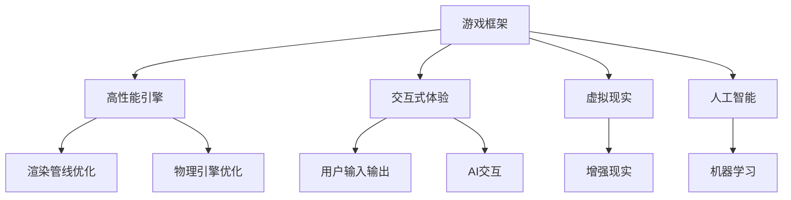

                 

# 游戏框架开发：创建高性能交互式体验

> 关键词：游戏框架，高性能，交互式体验，虚拟现实，人工智能，机器学习，游戏引擎，代码优化，性能优化

## 1. 背景介绍

### 1.1 问题由来
随着数字技术的发展，游戏已成为一种广受欢迎的娱乐方式。从简单的文字冒险到复杂的3D游戏，从单机游戏到多人在线游戏，游戏产业的创新和多样性不断突破。但游戏开发仍是一个高门槛、高成本的领域，特别是在需要创造高性能交互式体验时。因此，一种高效、稳定、易用且可扩展的游戏框架开发技术显得尤为重要。

### 1.2 问题核心关键点
本文将重点探讨游戏框架开发的核心概念和技术，如何在游戏框架中创建高性能交互式体验。这包括但不限于：

- **游戏框架**：定义、原理和架构。
- **高性能**：游戏引擎和渲染管线的优化。
- **交互式体验**：用户输入与输出、AI交互、游戏物理引擎。
- **虚拟现实和人工智能**：增强现实、混合现实、机器学习在游戏中的融合。

本文通过逻辑清晰、结构紧凑、专业的技术语言，为游戏开发从业人员提供有深度、有思考、有见解的指导。

## 2. 核心概念与联系

### 2.1 核心概念概述

为了更好地理解游戏框架开发的技术细节，首先需要明确几个核心概念：

- **游戏框架**：为游戏开发者提供一套基础架构和工具，以便快速开发和构建游戏。
- **高性能**：游戏引擎和渲染管线的优化，以实现流畅的游戏体验。
- **交互式体验**：实现用户与游戏世界的自然交互，增强沉浸感和真实感。
- **虚拟现实和人工智能**：利用VR/AR技术增强游戏沉浸感，利用AI技术提高游戏智能性。

这些概念之间存在紧密联系。例如，高性能的游戏引擎是实现交互式体验的基础，而虚拟现实和人工智能技术的融合则进一步提升了游戏体验的沉浸性和智能性。

### 2.2 核心概念原理和架构的 Mermaid 流程图(Mermaid 流程节点中不要有括号、逗号等特殊字符)


这个图表展示了游戏框架与核心概念之间的联系。高性能引擎和渲染管线优化是实现交互式体验的基础，而虚拟现实和人工智能技术的融合则进一步提升了游戏体验。

## 3. 核心算法原理 & 具体操作步骤
### 3.1 算法原理概述

游戏框架开发的核心算法原理主要围绕以下三个方面：

- **游戏引擎架构**：一种架构模式，用于管理游戏中的各个组件和系统，如物理引擎、渲染管线、用户输入、AI交互等。
- **渲染管线优化**：通过算法和技术手段，提高渲染效率和视觉效果。
- **物理引擎和AI交互**：通过仿真和机器学习技术，实现游戏世界中的自然物理行为和智能交互。

### 3.2 算法步骤详解

创建高性能交互式体验的游戏框架需要遵循以下步骤：

**Step 1: 设计游戏框架**

- 确定游戏类型、引擎类型（如Unity、Unreal Engine、CryEngine等）和开发平台（如PC、手机、VR等）。
- 设计游戏框架的组件和系统架构，包括物理引擎、渲染管线、用户输入、AI交互等。

**Step 2: 选择游戏引擎**

- 根据项目需求选择合适的游戏引擎，如Unity 3D、Unreal Engine、CryEngine等。
- 熟悉游戏引擎的API和工具，包括编辑器、脚本语言、物理引擎、渲染管线等。

**Step 3: 渲染管线优化**

- 确定渲染管线架构，包括顶点着色器、片元着色器、光照模型等。
- 优化渲染管线，如纹理压缩、多采样抗锯齿、动态分辨率调整等。
- 使用硬件加速技术，如GPU并行处理、SIMD指令集等。

**Step 4: 物理引擎和AI交互**

- 实现物理引擎，如刚体动力学、碰撞检测、布料物理等。
- 实现AI交互，如基于规则的系统、基于学习的方法、基于感知的方法等。

**Step 5: 实现交互式体验**

- 设计用户输入输出系统，如键盘、鼠标、触摸屏、手柄等。
- 设计游戏界面，如UI组件、动画、音效等。
- 实现游戏逻辑，如游戏流程控制、状态机、行为树等。

**Step 6: 集成虚拟现实和人工智能**

- 实现虚拟现实环境，如头显、手柄、空间跟踪等。
- 利用机器学习技术，实现NPC行为、游戏推荐、场景生成等。

### 3.3 算法优缺点

**优点**：

- 可扩展性：框架架构灵活，易于添加新的组件和系统。
- 高性能：通过优化渲染管线和物理引擎，实现流畅的游戏体验。
- 交互式体验：通过设计合理的用户输入和输出，实现自然的游戏交互。
- 可移植性：适用于多种平台，如PC、手机、VR等。

**缺点**：

- 学习曲线陡峭：需要熟悉游戏引擎和架构。
- 复杂性高：组件和系统众多，管理复杂。
- 依赖性强：依赖游戏引擎和硬件设备。

### 3.4 算法应用领域

高性能交互式体验的游戏框架在游戏开发、虚拟现实、人工智能等领域都有广泛应用：

- **游戏开发**：适用于各种类型的游戏，如动作、冒险、策略、角色扮演等。
- **虚拟现实**：增强现实和混合现实，用于教育、医疗、训练等领域。
- **人工智能**：在游戏AI和智能推荐中，提高游戏智能性和用户体验。

## 4. 数学模型和公式 & 详细讲解 & 举例说明（备注：数学公式请使用latex格式，latex嵌入文中独立段落使用 $$，段落内使用 $)
### 4.1 数学模型构建

在本节中，我们将使用数学模型来描述游戏框架中涉及的关键组件和系统。以一个简单的物理引擎为例，我们可以构建一个运动模型来描述游戏角色的运动。

**运动方程**：

$$
\mathbf{x}(t+\Delta t) = \mathbf{x}(t) + \mathbf{v}(t) \Delta t + \frac{1}{2} \mathbf{a}(t) (\Delta t)^2
$$

其中，$\mathbf{x}(t)$ 表示位置向量，$\mathbf{v}(t)$ 表示速度向量，$\mathbf{a}(t)$ 表示加速度向量，$\Delta t$ 表示时间步长。

**碰撞检测**：

$$
\text{碰撞检测} = \begin{cases}
\text{true} & \text{if } \mathbf{x}_1(t) \cap \mathbf{x}_2(t) \neq \emptyset \\
\text{false} & \text{otherwise}
\end{cases}
$$

其中，$\mathbf{x}_1(t)$ 和 $\mathbf{x}_2(t)$ 分别表示两个物体的位置向量。

### 4.2 公式推导过程

推导运动方程时，我们假设物体在匀速直线运动和匀加速直线运动之间，使用牛顿第二定律和运动学公式，得出上述运动方程。碰撞检测则基于几何学和布尔逻辑，简单直观地判断两个物体是否发生碰撞。

### 4.3 案例分析与讲解

考虑一个游戏角色在平面上的运动，使用上述运动方程进行仿真。假定角色的初始位置为 $(0,0)$，速度为 $(1,0)$，加速度为 $(0,1)$，时间步长为 $0.01$。我们可以计算出角色在不同时间步的坐标，并绘制出其运动轨迹。

## 5. 项目实践：代码实例和详细解释说明
### 5.1 开发环境搭建

在进行游戏框架开发前，我们需要准备以下开发环境：

1. **安装游戏引擎**：根据项目需求选择相应的游戏引擎，如Unity 3D、Unreal Engine等。
2. **安装编辑器**：下载并安装游戏引擎的编辑器，如Unity Hub、Unreal Engine 4等。
3. **安装开发工具**：安装 Visual Studio、VS Code、Xcode 等开发工具，以及相应的插件和扩展。
4. **配置开发环境**：根据游戏引擎的配置文件和文档，进行开发环境的配置。

### 5.2 源代码详细实现

以下是一个简单的游戏框架开发示例，使用Unity 3D引擎，实现一个简单的角色运动游戏。

**步骤 1: 创建场景和角色**

- 在Unity 3D中创建一个新场景。
- 在场景中添加角色模型，并通过修改属性，调整角色的初始位置、大小、颜色等。
- 导入必要的材质和纹理，为角色模型添加细节。

**步骤 2: 编写脚本**

- 创建一个C#脚本，继承自 MonoBehaviour 类。
- 实现角色运动的逻辑，包括位置、速度、加速度的计算和更新。

```csharp
using UnityEngine;

public class CharacterMovement : MonoBehaviour
{
    public float speed = 5.0f;
    public float acceleration = 2.0f;
    private Vector3 moveDirection = Vector3.zero;
    private Rigidbody rb;

    void Start()
    {
        rb = GetComponent<Rigidbody>();
    }

    void Update()
    {
        // 获取用户输入
        float moveHorizontal = Input.GetAxis("Horizontal");
        float moveVertical = Input.GetAxis("Vertical");

        // 计算速度向量
        moveDirection = new Vector3(moveHorizontal, 0.0f, moveVertical);
        moveDirection = transform.TransformDirection(moveDirection);

        // 计算加速度向量
        Vector3 accelerationVector = moveDirection.normalized * acceleration;

        // 更新角色位置
        rb.AddForce(accelerationVector * speed * Time.deltaTime);
    }
}
```

**步骤 3: 添加物理引擎**

- 在Unity 3D中，通过组件菜单添加 Rigidbody 组件。
- 配置 Rigidbody 组件的物理属性，如质量、重力、碰撞等。

**步骤 4: 实现碰撞检测**

- 在场景中添加碰撞器，如 Box Collider、Sphere Collider 等。
- 在脚本中实现碰撞检测逻辑，判断角色是否与地面或其他物体碰撞。

```csharp
using UnityEngine;

public class CharacterCollision : MonoBehaviour
{
    public Transform ground;

    void OnTriggerEnter(Collider other)
    {
        if (other.CompareTag("Ground"))
        {
            rb.velocity = Vector3.zero;
        }
    }
}
```

### 5.3 代码解读与分析

**角色运动脚本**：

- 使用 Unity 3D 的 C# 脚本语言，实现角色的运动逻辑。
- 利用 Input.GetAxis 获取用户输入，根据输入计算角色的速度和加速度。
- 使用 Rigidbody 组件进行物理仿真，实现角色的运动和碰撞。

**碰撞检测脚本**：

- 利用 Unity 3D 的 C# 脚本语言，实现碰撞检测逻辑。
- 通过 OnTriggerEnter 方法，检测角色是否与地面或其他物体碰撞。
- 利用 Rigidbody 组件的速度属性，实现碰撞后的角色停顿。

### 5.4 运行结果展示

通过上述步骤，可以成功创建角色运动游戏，并实现角色的移动和碰撞检测。运行游戏后，可以看到角色在平面上运动，遇到障碍物时停止。

## 6. 实际应用场景

### 6.1 虚拟现实

虚拟现实技术在游戏中的应用越来越广泛。通过VR头盔、手柄等设备，玩家能够进入一个完全沉浸的游戏世界。这种沉浸式体验为游戏带来了更高的互动性和沉浸感。

### 6.2 人工智能

AI技术在游戏中的应用也逐渐增多。例如，NPC可以通过机器学习技术，学习和适应玩家的行为和策略，提高游戏的智能性。游戏推荐系统可以通过机器学习算法，根据玩家的偏好推荐游戏内容，提升用户体验。

### 6.3 未来应用展望

未来，游戏框架开发将继续结合虚拟现实、人工智能等前沿技术，为玩家带来更加丰富和多样化的游戏体验。例如：

- **虚拟现实**：结合增强现实和混合现实，创造更加逼真的游戏环境。
- **人工智能**：利用深度学习技术，实现更加智能的NPC和游戏推荐系统。
- **云计算**：利用云平台进行游戏数据的存储和处理，实现多人在线游戏的稳定性和可扩展性。

## 7. 工具和资源推荐

### 7.1 学习资源推荐

- **Unity 3D 官方文档**：Unity 3D 的官方文档，包括游戏引擎的各个组件和系统的详细说明。
- **Unreal Engine 文档**：Unreal Engine 的官方文档，涵盖了引擎的API、工具和插件的使用。
- **CryEngine 文档**：CryEngine 的官方文档，提供了引擎的开发环境和API文档。
- **Coursera**：Coursera 上有多门与游戏引擎和游戏开发相关的课程，如《Unity 3D Game Development》。
- **Udacity**：Udacity 上有多门与游戏开发和虚拟现实相关的课程，如《Interactive Game Design with Unity》。

### 7.2 开发工具推荐

- **Visual Studio**：Unity 3D 和 Unreal Engine 的官方编辑器，支持各种开发语言的集成开发环境。
- **VS Code**：轻量级、跨平台的代码编辑器，支持各种插件和扩展。
- **Xcode**：Apple 的开发环境，适用于开发 iOS 和 macOS 平台的游戏。
- **Git**：版本控制系统，方便团队协作和代码管理。
- **Unity Hub**：Unity 3D 的集成开发环境，方便管理和更新游戏引擎。

### 7.3 相关论文推荐

- **Real-time Rendering in Games**：Lambert、Sigirrakis 和 Agouridis 合著，详细介绍了游戏渲染管线的优化技术。
- **Physics for Game Developers**：Hanrahan 和 Kautz 合著，介绍了游戏物理引擎的实现方法和优化策略。
- **Artificial Intelligence for Games**：Bradley 合著，讨论了人工智能在游戏开发中的应用。

## 8. 总结：未来发展趋势与挑战

### 8.1 总结

本文详细探讨了游戏框架开发的关键概念和技术，从游戏引擎架构、渲染管线优化到物理引擎和AI交互，提出了系统性的开发步骤和实践指南。通过分析虚拟现实和人工智能在游戏中的应用，展示了高性能交互式体验的实现路径。

### 8.2 未来发展趋势

未来，游戏框架开发将呈现以下几个趋势：

- **技术融合**：虚拟现实、人工智能等技术将更加深入地融入游戏开发中，提升游戏体验和智能性。
- **跨平台开发**：游戏框架将支持多种平台和设备，实现跨平台的游戏开发和发布。
- **云游戏**：云计算技术将改变游戏开发的分布式架构，实现实时、稳定的多人在线游戏。
- **自动化测试**：游戏框架将引入自动化测试技术，提高游戏质量和稳定性。
- **开源社区**：开源社区将促进游戏框架的协作和创新，推动游戏技术的发展。

### 8.3 面临的挑战

尽管游戏框架开发在游戏行业已经取得了显著进展，但仍面临一些挑战：

- **性能优化**：在高性能游戏中，优化渲染管线和物理引擎是关键，但优化难度较大。
- **跨平台兼容性**：不同平台的游戏引擎和工具可能存在兼容性问题，需要开发者进行深入测试和适配。
- **用户输入体验**：用户输入的精度和响应速度直接影响游戏体验，需要优化输入设备和控制器。
- **AI智能性**：提高NPC的智能性需要大量的数据和计算资源，目前仍面临技术和成本的挑战。
- **资源管理**：游戏开发需要大量的资源，包括人力、物力和财力，资源管理是项目成功的关键。

### 8.4 研究展望

面对这些挑战，未来的游戏框架开发需要在以下几个方面进行研究和创新：

- **高性能优化**：继续优化渲染管线和物理引擎，提高游戏性能和流畅度。
- **跨平台兼容**：开发跨平台的开发工具和框架，实现平台间的无缝协作。
- **AI智能性提升**：利用深度学习技术，提高NPC的智能性和游戏推荐系统的效果。
- **自动化测试**：引入自动化测试技术，提高游戏质量和稳定性，缩短开发周期。
- **开源社区**：促进开源社区的发展，提高代码共享和协作的效率。

## 9. 附录：常见问题与解答

**Q1: 如何选择合适的游戏引擎？**

A: 根据项目需求选择合适的游戏引擎。Unity 3D 适合各种类型的游戏，易于上手；Unreal Engine 适合高质量、高性能的游戏开发；CryEngine 适合大型的多人在线游戏和开放世界游戏。

**Q2: 游戏引擎和渲染管线优化有哪些技巧？**

A: 优化渲染管线需要从多个方面入手，如纹理压缩、多采样抗锯齿、动态分辨率调整等。使用硬件加速技术，如GPU并行处理、SIMD指令集等，也可以提高渲染效率。

**Q3: 如何提高NPC的智能性？**

A: 利用机器学习技术，如深度强化学习、行为树、规则系统等，提高NPC的智能性和适应性。收集和标注大量的游戏数据，用于训练和优化。

**Q4: 游戏框架开发需要注意哪些问题？**

A: 需要注意性能优化、跨平台兼容性、用户输入体验、AI智能性提升和资源管理等问题。合理使用开发工具和资源，提升开发效率和质量。

---

作者：禅与计算机程序设计艺术 / Zen and the Art of Computer Programming

