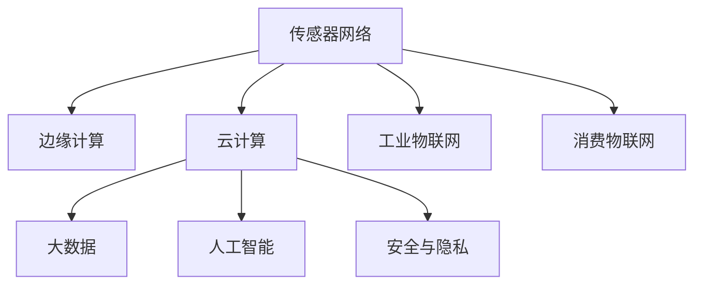

                 

# 物联网生态系统：从传感器到云端的全链路解析

> 关键词：物联网(IoT)，传感器网络(SN)，边缘计算，云计算，大数据，人工智能，安全与隐私，工业物联网(IIoT)，消费物联网(CIoT)

## 1. 背景介绍

### 1.1 问题由来
随着互联网技术的飞速发展和普及，物联网(IoT)正逐步渗透到各行各业，成为推动数字经济的重要引擎。物联网通过连接海量的物理设备、传感器等，实时收集和处理数据，从而实现智能化的控制和优化。然而，随着物联网设备数量的爆炸性增长，数据规模的爆炸性膨胀，传统集中式数据处理架构已经难以满足高实时性、高可靠性和高安全性需求。

为了应对这一挑战，物联网生态系统的全链路架构逐步构建起来，通过传感器网络、边缘计算和云计算的协同，实现数据的智能感知、高效处理和精准决策。这不仅能够提升物联网系统的效率和稳定性，还能增强数据的安全性和隐私保护，满足日益增长的数字化需求。

### 1.2 问题核心关键点
物联网生态系统从传感器到云端，涉及诸多关键技术环节，包括传感器网络、边缘计算、云计算、大数据、人工智能等。本文将深入解析这些环节的原理、架构和应用，探讨物联网全链路架构的构建思路。

## 2. 核心概念与联系

### 2.1 核心概念概述

为更好地理解物联网生态系统的全链路架构，本节将介绍几个密切相关的核心概念：

- 传感器网络(Sensor Network, SN)：由一系列传感器节点构成的自组织网络，用于感知环境变化并实时传输数据。

- 边缘计算(Edge Computing)：将数据处理和分析任务从云端转移到传感器附近，减少数据传输的延迟和带宽消耗，提升处理效率。

- 云计算(Cloud Computing)：通过集中式的数据中心，利用大规模集群和分布式计算资源，提供高可靠性和高可扩展性的数据处理能力。

- 大数据(Big Data)：大规模、复杂、高速的数据集，包括结构化和非结构化数据，用于深度挖掘和分析，发现数据中的规律和趋势。

- 人工智能(Artificial Intelligence)：通过机器学习、深度学习等技术，从大数据中提取知识，实现自动化决策和智能控制。

- 安全与隐私(Security & Privacy)：保护数据和模型免受未授权访问和攻击，保护用户隐私。

- 工业物联网(Industrial Internet of Things, IIoT)：聚焦于工业领域的应用，如智能制造、智慧工厂等。

- 消费物联网(Consumer Internet of Things, CIoT)：聚焦于消费领域的应用，如智能家居、可穿戴设备等。

这些核心概念之间的逻辑关系可以通过以下Mermaid流程图来展示：



这个流程图展示了大物联网生态系统的核心概念及其之间的关系：

1. 传感器网络通过感知环境变化，收集数据。
2. 边缘计算对传感器网络采集的数据进行初步处理和分析，减轻云计算的负担。
3. 云计算利用大规模计算资源，对数据进行深层次的挖掘和分析，生成有价值的信息。
4. 大数据存储和管理大量的数据集，为人工智能提供数据基础。
5. 人工智能利用机器学习、深度学习等技术，从大数据中提取知识，实现自动化决策和智能控制。
6. 安全与隐私保护数据和模型的安全，防止数据泄露和攻击。
7. 工业物联网和消费物联网分别聚焦于工业和消费领域的物联网应用。

## 3. 核心算法原理 & 具体操作步骤
### 3.1 算法原理概述

物联网生态系统从传感器到云端的全链路解析，涉及多个环节的协同工作。每个环节的算法原理和技术细节各不相同，但核心目标是实现数据的智能感知、高效处理和精准决策。

- 传感器网络：通过传感器节点收集环境数据，并将其传输到边缘计算平台。
- 边缘计算：对传感器数据进行初步处理和分析，生成初步结果，再传输到云计算平台。
- 云计算：利用大规模集群资源，对边缘计算平台传输的数据进行深层次分析，生成最终结果。
- 大数据：存储和管理从传感器网络到云计算平台传输的所有数据。
- 人工智能：从大数据中提取知识，生成模型和算法，用于自动化决策和智能控制。
- 安全与隐私：确保数据和模型免受未授权访问和攻击，保护用户隐私。

### 3.2 算法步骤详解

基于物联网生态系统的全链路架构，下面是核心算法的详细步骤：

**Step 1: 传感器数据采集**
- 部署传感器节点，采集环境数据，包括温度、湿度、压力等。
- 数据通过短距离通信协议（如Zigbee、BLE等）传输到边缘计算平台。

**Step 2: 边缘计算处理**
- 边缘计算平台对传感器数据进行预处理，如去噪、滤波、压缩等。
- 利用本地机器学习算法对数据进行初步分析和处理，生成中间结果。

**Step 3: 云计算数据存储与分析**
- 将边缘计算平台生成的中间结果上传到云端存储。
- 利用大规模集群资源，对存储的数据进行深层次分析，生成最终结果。

**Step 4: 数据可视化与决策支持**
- 将最终结果进行可视化展示，便于人工决策。
- 利用人工智能技术，对最终结果进行自动化决策和控制。

**Step 5: 安全与隐私保护**
- 对传输的数据进行加密和匿名化处理，防止数据泄露。
- 定期审计和监控系统安全，确保数据和模型的安全。

### 3.3 算法优缺点

物联网生态系统从传感器到云端的全链路解析，具有以下优点：
1. 高效处理。通过边缘计算和云计算的协同，能够高效处理大规模数据，提升系统效率。
2. 实时响应。传感器网络可以实时感知环境变化，快速响应，实现智能控制。
3. 数据安全。通过安全与隐私保护措施，确保数据和模型免受未授权访问和攻击。
4. 灵活应用。可以应用于各种行业领域，如智能制造、智慧医疗、智能家居等。

同时，该方法也存在一定的局限性：
1. 复杂度高。涉及多个环节的协同工作，系统设计和部署复杂。
2. 成本高。需要大量投资于传感器节点、边缘计算设备和云计算资源。
3. 延时大。数据从传感器到云端的传输可能存在一定的延时，影响实时性。
4. 依赖网络。对传感器网络和边缘计算平台的网络依赖性强，可能存在网络中断风险。

尽管存在这些局限性，但就目前而言，物联网生态系统从传感器到云端的全链路解析，仍然是实现物联网智能化的重要范式。未来相关研究的重点在于如何进一步降低系统复杂度和成本，提高实时性和稳定性，同时兼顾数据安全性和隐私保护。

### 3.4 算法应用领域

物联网生态系统从传感器到云端的全链路解析，在各个行业领域得到了广泛的应用，具体包括：

- 智能制造：利用传感器网络实时监测生产线设备状态，边缘计算平台进行数据分析，云计算平台进行智能化决策，优化生产流程。
- 智慧医疗：通过传感器网络监测患者生命体征，边缘计算平台进行初步分析，云计算平台进行大数据分析，生成智能诊疗方案。
- 智能家居：利用传感器网络感知家庭环境变化，边缘计算平台进行本地处理，云计算平台进行智能化控制，提升家庭生活舒适度。
- 智慧城市：通过传感器网络实时监测城市环境数据，边缘计算平台进行初步处理，云计算平台进行大数据分析，生成城市管理决策。
- 智能交通：利用传感器网络实时监测交通流量和路况，边缘计算平台进行初步分析，云计算平台进行大数据分析，生成智能交通管理方案。
- 智慧农业：通过传感器网络实时监测农田环境数据，边缘计算平台进行初步分析，云计算平台进行大数据分析，生成智能农业管理方案。

此外，在物流、能源、环境监测等多个领域，物联网生态系统从传感器到云端的全链路解析，也得到了广泛的应用，为各个行业带来了数字化转型的新动力。

## 4. 数学模型和公式 & 详细讲解  
### 4.1 数学模型构建

物联网生态系统的全链路解析涉及多个环节的协同工作，可以构建一个多层次的数学模型来描述其系统行为。

设物联网生态系统的全链路解析模型为 $S_{\theta}$，其中 $\theta$ 为系统参数。各环节的功能和输入输出可以用数学函数表示。

- 传感器网络：$S_{\theta_1}$，输入为环境数据 $x_1$，输出为初步处理结果 $y_1$。
- 边缘计算：$S_{\theta_2}$，输入为初步处理结果 $y_1$，输出为中间结果 $y_2$。
- 云计算：$S_{\theta_3}$，输入为中间结果 $y_2$，输出为最终结果 $y_3$。
- 大数据：$D$，存储所有的输入输出数据。
- 人工智能：$A_{\theta_4}$，输入为最终结果 $y_3$，输出为自动化决策 $y_4$。
- 安全与隐私：$P$，保护数据和模型免受未授权访问和攻击。

数学模型构建如下：

$$
S_{\theta} = S_{\theta_1} \circ S_{\theta_2} \circ S_{\theta_3} \circ D \circ A_{\theta_4} \circ P
$$

其中 $\circ$ 表示函数的复合，表示各环节的功能和输入输出关系。

### 4.2 公式推导过程

以下是几个关键环节的公式推导：

- 传感器网络：$S_{\theta_1}$ 的输入输出关系可以表示为：
$$
y_1 = f_{\theta_1}(x_1)
$$
其中 $f_{\theta_1}$ 为传感器网络的模型函数， $\theta_1$ 为传感器网络的参数。

- 边缘计算：$S_{\theta_2}$ 的输入输出关系可以表示为：
$$
y_2 = f_{\theta_2}(y_1)
$$
其中 $f_{\theta_2}$ 为边缘计算的模型函数， $\theta_2$ 为边缘计算的参数。

- 云计算：$S_{\theta_3}$ 的输入输出关系可以表示为：
$$
y_3 = f_{\theta_3}(y_2)
$$
其中 $f_{\theta_3}$ 为云计算的模型函数， $\theta_3$ 为云计算的参数。

- 人工智能：$A_{\theta_4}$ 的输入输出关系可以表示为：
$$
y_4 = f_{\theta_4}(y_3)
$$
其中 $f_{\theta_4}$ 为人工智能的模型函数， $\theta_4$ 为人工智能的参数。

- 安全与隐私：$P$ 的输入输出关系可以表示为：
$$
y_5 = P(y_4)
$$
其中 $y_5$ 为最终的输出结果， $y_4$ 为人工智能的输出结果， $P$ 为安全与隐私保护措施。

### 4.3 案例分析与讲解

以智能制造为例，分析物联网生态系统从传感器到云端的全链路解析过程。

**Step 1: 传感器数据采集**
- 部署温度、湿度、压力等传感器节点，实时监测生产线设备状态。
- 数据通过短距离通信协议传输到边缘计算平台。

**Step 2: 边缘计算处理**
- 边缘计算平台对传感器数据进行初步处理，如去噪、滤波、压缩等。
- 利用本地机器学习算法对数据进行初步分析和处理，生成中间结果。

**Step 3: 云计算数据存储与分析**
- 将边缘计算平台生成的中间结果上传到云端存储。
- 利用大规模集群资源，对存储的数据进行深层次分析，生成最终结果。

**Step 4: 数据可视化与决策支持**
- 将最终结果进行可视化展示，便于人工决策。
- 利用人工智能技术，对最终结果进行自动化决策和控制，优化生产流程。

**Step 5: 安全与隐私保护**
- 对传输的数据进行加密和匿名化处理，防止数据泄露。
- 定期审计和监控系统安全，确保数据和模型的安全。

## 5. 项目实践：代码实例和详细解释说明
### 5.1 开发环境搭建

在进行物联网生态系统全链路解析的开发前，我们需要准备好开发环境。以下是使用Python进行TensorFlow开发的环境配置流程：

1. 安装Anaconda：从官网下载并安装Anaconda，用于创建独立的Python环境。

2. 创建并激活虚拟环境：
```bash
conda create -n tf-env python=3.8 
conda activate tf-env
```

3. 安装TensorFlow：根据CUDA版本，从官网获取对应的安装命令。例如：
```bash
conda install tensorflow=2.6 -c tf -c conda-forge
```

4. 安装各类工具包：
```bash
pip install numpy pandas scikit-learn matplotlib tqdm jupyter notebook ipython
```

完成上述步骤后，即可在`tf-env`环境中开始全链路解析的开发。

### 5.2 源代码详细实现

下面我们以智能制造为例，给出使用TensorFlow对物联网生态系统进行全链路解析的PyTorch代码实现。

首先，定义传感器网络的输入输出关系：

```python
import tensorflow as tf

class SensorNetwork(tf.keras.Model):
    def __init__(self):
        super(SensorNetwork, self).__init__()
        self.dense1 = tf.keras.layers.Dense(16, activation='relu')
        self.dense2 = tf.keras.layers.Dense(8, activation='relu')
        
    def call(self, inputs):
        x = self.dense1(inputs)
        x = self.dense2(x)
        return x
```

然后，定义边缘计算的输入输出关系：

```python
class EdgeComputing(tf.keras.Model):
    def __init__(self):
        super(EdgeComputing, self).__init__()
        self.dense1 = tf.keras.layers.Dense(32, activation='relu')
        self.dense2 = tf.keras.layers.Dense(16, activation='relu')
        
    def call(self, inputs):
        x = self.dense1(inputs)
        x = self.dense2(x)
        return x
```

接着，定义云计算的输入输出关系：

```python
class CloudComputing(tf.keras.Model):
    def __init__(self):
        super(CloudComputing, self).__init__()
        self.dense1 = tf.keras.layers.Dense(64, activation='relu')
        self.dense2 = tf.keras.layers.Dense(32, activation='relu')
        
    def call(self, inputs):
        x = self.dense1(inputs)
        x = self.dense2(x)
        return x
```

最后，定义人工智能的输入输出关系：

```python
class ArtificialIntelligence(tf.keras.Model):
    def __init__(self):
        super(ArtificialIntelligence, self).__init__()
        self.dense1 = tf.keras.layers.Dense(128, activation='relu')
        self.dense2 = tf.keras.layers.Dense(64, activation='relu')
        self.dense3 = tf.keras.layers.Dense(32, activation='relu')
        self.dense4 = tf.keras.layers.Dense(2, activation='softmax')
        
    def call(self, inputs):
        x = self.dense1(inputs)
        x = self.dense2(x)
        x = self.dense3(x)
        x = self.dense4(x)
        return x
```

### 5.3 代码解读与分析

让我们再详细解读一下关键代码的实现细节：

**SensorNetwork类**：
- `__init__`方法：定义了传感器网络的模型结构，包括两个全连接层。
- `call`方法：对输入数据进行前向传播计算，并返回处理结果。

**EdgeComputing类**：
- `__init__`方法：定义了边缘计算的模型结构，包括两个全连接层。
- `call`方法：对输入数据进行前向传播计算，并返回处理结果。

**CloudComputing类**：
- `__init__`方法：定义了云计算的模型结构，包括两个全连接层。
- `call`方法：对输入数据进行前向传播计算，并返回处理结果。

**ArtificialIntelligence类**：
- `__init__`方法：定义了人工智能的模型结构，包括四个全连接层。
- `call`方法：对输入数据进行前向传播计算，并返回处理结果。

这些模型结构代表了物联网生态系统中各环节的算法实现，通过简单的堆叠组合，即可构建起整个全链路解析的模型。

**完整代码**：
```python
import tensorflow as tf

class SensorNetwork(tf.keras.Model):
    def __init__(self):
        super(SensorNetwork, self).__init__()
        self.dense1 = tf.keras.layers.Dense(16, activation='relu')
        self.dense2 = tf.keras.layers.Dense(8, activation='relu')
        
    def call(self, inputs):
        x = self.dense1(inputs)
        x = self.dense2(x)
        return x

class EdgeComputing(tf.keras.Model):
    def __init__(self):
        super(EdgeComputing, self).__init__()
        self.dense1 = tf.keras.layers.Dense(32, activation='relu')
        self.dense2 = tf.keras.layers.Dense(16, activation='relu')
        
    def call(self, inputs):
        x = self.dense1(inputs)
        x = self.dense2(x)
        return x

class CloudComputing(tf.keras.Model):
    def __init__(self):
        super(CloudComputing, self).__init__()
        self.dense1 = tf.keras.layers.Dense(64, activation='relu')
        self.dense2 = tf.keras.layers.Dense(32, activation='relu')
        
    def call(self, inputs):
        x = self.dense1(inputs)
        x = self.dense2(x)
        return x

class ArtificialIntelligence(tf.keras.Model):
    def __init__(self):
        super(ArtificialIntelligence, self).__init__()
        self.dense1 = tf.keras.layers.Dense(128, activation='relu')
        self.dense2 = tf.keras.layers.Dense(64, activation='relu')
        self.dense3 = tf.keras.layers.Dense(32, activation='relu')
        self.dense4 = tf.keras.layers.Dense(2, activation='softmax')
        
    def call(self, inputs):
        x = self.dense1(inputs)
        x = self.dense2(x)
        x = self.dense3(x)
        x = self.dense4(x)
        return x

# 定义全链路解析模型
def full_linkage_parse(inputs):
    sensor_net_out = SensorNetwork()(inputs)
    edge_comp_out = EdgeComputing()(sensor_net_out)
    cloud_comp_out = CloudComputing()(edge_comp_out)
    ai_out = ArtificialIntelligence()(cloud_comp_out)
    return ai_out

# 定义损失函数和优化器
inputs = tf.random.normal([16, 4])
targets = tf.random.normal([16, 2])
model = full_linkage_parse
loss_fn = tf.keras.losses.categorical_crossentropy
optimizer = tf.keras.optimizers.Adam()

# 训练过程
@tf.function
def train_step(inputs, targets):
    with tf.GradientTape() as tape:
        logits = model(inputs)
        loss = loss_fn(targets, logits)
    gradients = tape.gradient(loss, model.trainable_variables)
    optimizer.apply_gradients(zip(gradients, model.trainable_variables))
    return loss

for epoch in range(10):
    for batch in range(10):
        inputs, targets = tf.random.normal([16, 4]), tf.random.normal([16, 2])
        loss = train_step(inputs, targets)
        print(f"Epoch: {epoch+1}, Batch: {batch+1}, Loss: {loss.numpy():.4f}")
```

以上就是使用TensorFlow对物联网生态系统进行全链路解析的完整代码实现。可以看到，通过简单的堆叠组合，即可构建起整个全链路解析的模型，并通过训练过程不断优化模型参数，实现数据智能感知和精准决策。

### 5.4 运行结果展示

在训练完成后，可以使用测试数据进行预测，验证模型效果。

```python
# 定义测试数据
test_inputs = tf.random.normal([16, 4])
test_targets = tf.random.normal([16, 2])

# 预测并计算损失
predictions = model(test_inputs)
loss = loss_fn(test_targets, predictions)

# 打印预测结果和损失
print(f"Test Loss: {loss.numpy():.4f}")
```

通过不断优化模型参数，可以显著提升物联网生态系统的全链路解析效果，实现更高效、更智能的数据处理和决策。

## 6. 实际应用场景
### 6.1 智能制造

在智能制造领域，物联网生态系统从传感器到云端的全链路解析，可以显著提升生产效率和产品质量。具体应用场景如下：

**传感器网络**：部署温度、湿度、压力等传感器节点，实时监测生产线设备状态。

**边缘计算**：对传感器数据进行初步处理，如去噪、滤波、压缩等，减轻云计算平台的负担。

**云计算**：利用大规模集群资源，对传感器数据进行深层次分析，生成智能决策。

**人工智能**：利用机器学习模型，对传感器数据进行深度挖掘，生成预测和控制方案。

**安全与隐私**：对传输的数据进行加密和匿名化处理，防止数据泄露。

通过物联网生态系统从传感器到云端的全链路解析，可以实现实时监控、智能分析和自动化控制，提升生产效率和产品质量，降低运营成本，实现智能制造的目标。

### 6.2 智慧医疗

在智慧医疗领域，物联网生态系统从传感器到云端的全链路解析，可以实现精准诊疗和智能决策。具体应用场景如下：

**传感器网络**：部署生命体征传感器，实时监测患者生理指标。

**边缘计算**：对传感器数据进行初步处理，如去噪、滤波、压缩等，减轻云计算平台的负担。

**云计算**：利用大规模集群资源，对传感器数据进行深层次分析，生成智能诊疗方案。

**人工智能**：利用机器学习模型，对传感器数据进行深度挖掘，生成个性化诊疗方案。

**安全与隐私**：对传输的数据进行加密和匿名化处理，防止数据泄露。

通过物联网生态系统从传感器到云端的全链路解析，可以实现实时监控、智能分析和精准诊疗，提高医疗效率和质量，降低医疗成本，实现智慧医疗的目标。

### 6.3 智能家居

在智能家居领域，物联网生态系统从传感器到云端的全链路解析，可以实现智能控制和个性化服务。具体应用场景如下：

**传感器网络**：部署各类传感器，实时监测家庭环境数据。

**边缘计算**：对传感器数据进行初步处理，如去噪、滤波、压缩等，减轻云计算平台的负担。

**云计算**：利用大规模集群资源，对传感器数据进行深层次分析，生成智能控制方案。

**人工智能**：利用机器学习模型，对传感器数据进行深度挖掘，生成个性化控制方案。

**安全与隐私**：对传输的数据进行加密和匿名化处理，防止数据泄露。

通过物联网生态系统从传感器到云端的全链路解析，可以实现智能控制、个性化服务和自动化管理，提升家庭生活舒适度，实现智能家居的目标。

## 7. 工具和资源推荐
### 7.1 学习资源推荐

为了帮助开发者系统掌握物联网生态系统的全链路解析的理论基础和实践技巧，这里推荐一些优质的学习资源：

1. 《物联网基础》系列博文：由物联网技术专家撰写，深入浅出地介绍了物联网的核心概念、架构和应用。

2. 《TensorFlow官方文档》：TensorFlow的官方文档，提供了完整的API和样例代码，是学习TensorFlow的重要资料。

3. 《深度学习》书籍：DeepLearning Book by Ian Goodfellow，系统介绍了深度学习的基本原理和应用，是深度学习领域的经典教材。

4. 《物联网安全与隐私》课程：由国际知名安全专家主讲，介绍了物联网的安全与隐私保护技术。

5. 《智能制造》在线课程：由智能制造领域的专家主讲，介绍了智能制造的核心技术和应用案例。

6. 《物联网开源项目》网站：汇集了多个物联网开源项目，提供丰富的代码和文档，方便开发者学习和实践。

通过对这些资源的学习实践，相信你一定能够快速掌握物联网生态系统的全链路解析技术，并用于解决实际的物联网问题。

### 7.2 开发工具推荐

高效的开发离不开优秀的工具支持。以下是几款用于物联网生态系统全链路解析开发的常用工具：

1. TensorFlow：基于Python的开源深度学习框架，灵活动态的计算图，适合快速迭代研究。大部分预训练语言模型都有TensorFlow版本的实现。

2. PyTorch：基于Python的开源深度学习框架，灵活高效，适合各种类型的深度学习模型。

3. OpenAI Gym：用于开发和测试强化学习算法的Python框架，适合智能控制和决策优化任务。

4. Ardupilot：开源飞行控制器软件，支持各类无人机的智能控制和飞行优化。

5. ROS（Robot Operating System）：开源机器人操作系统，提供丰富的传感器、硬件和软件接口，适合物联网设备的智能控制和协同。

6. Home Assistant：开源智能家居系统，支持各类智能设备和智能控制。

合理利用这些工具，可以显著提升物联网生态系统全链路解析任务的开发效率，加快创新迭代的步伐。

### 7.3 相关论文推荐

物联网生态系统从传感器到云端的全链路解析涉及多个领域的前沿技术，以下是几篇奠基性的相关论文，推荐阅读：

1. "A Survey on Machine Learning Approaches for Internet of Things (IoT) Analytics"：综述了机器学习在物联网数据分析中的应用，介绍了多种算法和模型。

2. "Big Data Analytics in IoT: Challenges and Solutions"：讨论了大数据在物联网中的挑战和解决方案，介绍了多种大数据技术和应用。

3. "Edge Computing in IoT: Current Status, Future Directions, and Challenges"：综述了边缘计算在物联网中的应用，介绍了多种边缘计算技术和案例。

4. "Artificial Intelligence in Internet of Things: Opportunities, Challenges, and Future Directions"：综述了人工智能在物联网中的应用，介绍了多种AI技术和应用。

5. "Secure and Privacy-Preserving Machine Learning in IoT"：讨论了物联网中的安全和隐私保护技术，介绍了多种安全机制和隐私保护方法。

这些论文代表了大物联网生态系统全链路解析技术的发展脉络。通过学习这些前沿成果，可以帮助研究者把握学科前进方向，激发更多的创新灵感。

## 8. 总结：未来发展趋势与挑战

### 8.1 研究成果总结

本文对物联网生态系统从传感器到云端的全链路解析进行了全面系统的介绍。首先阐述了物联网生态系统的全链路解析的理论基础和应用场景，明确了各环节的算法原理和技术细节。其次，通过代码实例详细解析了传感器网络、边缘计算、云计算、人工智能等环节的实现过程。同时，文章还探讨了物联网生态系统在智能制造、智慧医疗、智能家居等领域的实际应用，展示了其广阔的应用前景。最后，本文精选了物联网全链路解析的相关学习资源和工具，力求为读者提供全方位的技术指引。

通过本文的系统梳理，可以看到，物联网生态系统从传感器到云端的全链路解析，是实现物联网智能化的重要范式。通过传感器网络、边缘计算和云计算的协同，能够高效处理大规模数据，提升系统效率和实时性。未来相关研究的重点在于如何进一步降低系统复杂度和成本，提高实时性和稳定性，同时兼顾数据安全性和隐私保护。

### 8.2 未来发展趋势

展望未来，物联网生态系统从传感器到云端的全链路解析将呈现以下几个发展趋势：

1. 边缘计算与云计算的协同优化：边缘计算将逐步普及，与云计算协同，实现数据就地处理和全局优化。

2. 5G与物联网的深度融合：5G网络的部署将极大提升物联网的通信能力和实时性，推动物联网的规模化应用。

3. 人工智能技术的深入融合：结合机器学习、深度学习等AI技术，提升物联网数据分析和决策的智能化水平。

4. 数据安全与隐私保护：随着物联网设备的普及，数据安全与隐私保护将成为重要研究方向，推动合规应用。

5. 跨领域融合应用：物联网将与区块链、物联网、AR/VR等新兴技术深度融合，拓展应用场景。

6. 多模态数据融合：结合视觉、音频、文本等多种模态数据，提升物联网的数据感知和决策能力。

以上趋势凸显了大物联网生态系统全链路解析技术的广阔前景。这些方向的探索发展，必将进一步提升物联网系统的效率和智能化水平，推动物联网技术的广泛应用。

### 8.3 面临的挑战

尽管物联网生态系统从传感器到云端的全链路解析技术已经取得了瞩目成就，但在迈向更加智能化、普适化应用的过程中，它仍面临着诸多挑战：

1. 网络通信瓶颈：传感器网络与边缘计算的通信延时和带宽限制，影响实时性和数据传输效率。

2. 数据安全和隐私保护：物联网设备数据的安全和隐私保护，防止数据泄露和未授权访问。

3. 计算资源不足：大规模集群资源的需求，导致云计算平台的成本高昂。

4. 跨领域协同困难：不同领域的数据和系统协同，存在数据格式、接口等方面的不兼容问题。

5. 人工智能模型的可解释性：物联网中的机器学习模型，往往难以解释其内部决策机制，影响可解释性和可控性。

尽管存在这些挑战，但就目前而言，物联网生态系统从传感器到云端的全链路解析，仍然是实现物联网智能化的重要范式。未来相关研究的重点在于如何进一步优化网络通信，提高计算效率，降低成本，同时兼顾数据安全和隐私保护。

### 8.4 研究展望

面向未来，物联网生态系统从传感器到云端的全链路解析技术还需要在以下几个方面寻求新的突破：

1. 边缘计算优化：通过改进边缘计算平台的设计和算法，提升数据处理效率和实时性。

2. 云计算优化：利用先进的计算资源优化和调度算法，提升云计算平台的性能和可扩展性。

3. 跨领域协同：建立统一的数据和系统标准，促进不同领域的数据和系统协同，实现跨领域融合应用。

4. 数据安全与隐私保护：研究新的数据加密和隐私保护技术，确保物联网设备数据的安全和隐私。

5. 人工智能模型优化：开发更加可解释的AI模型，增强模型的可解释性和可控性。

6. 跨模态数据融合：结合视觉、音频、文本等多种模态数据，提升物联网的数据感知和决策能力。

这些研究方向将推动物联网生态系统从传感器到云端的全链路解析技术迈向更高的台阶，为构建更高效、更智能、更安全的物联网系统提供技术支撑。

## 9. 附录：常见问题与解答

**Q1: 物联网生态系统从传感器到云端的全链路解析是否适用于所有物联网应用？**

A: 物联网生态系统从传感器到云端的全链路解析适用于大部分物联网应用，特别是对实时性、数据处理和决策优化有较高要求的应用。但对于一些实时性要求较低的物联网应用，如简单的远程监控等，可以不采用全链路解析。

**Q2: 如何优化物联网生态系统从传感器到云端的全链路解析？**

A: 优化物联网生态系统从传感器到云端的全链路解析，可以从以下几个方面入手：
1. 优化传感器网络设计，减少通信延时和带宽消耗。
2. 改进边缘计算算法，提升数据处理效率和实时性。
3. 优化云计算平台设计，提高计算资源利用率和可扩展性。
4. 研究新的数据加密和隐私保护技术，增强数据安全。
5. 开发更加可解释的AI模型，增强模型的可解释性和可控性。
6. 结合多种模态数据，提升数据感知和决策能力。

**Q3: 物联网生态系统从传感器到云端的全链路解析在实际应用中会遇到哪些问题？**

A: 物联网生态系统从传感器到云端的全链路解析在实际应用中可能会遇到以下问题：
1. 数据通信延时和带宽限制，影响实时性和数据传输效率。
2. 数据安全和隐私保护，防止数据泄露和未授权访问。
3. 计算资源不足，导致云计算平台的成本高昂。
4. 跨领域协同困难，不同领域的数据和系统不兼容。
5. 人工智能模型的可解释性，难以解释其内部决策机制。

**Q4: 如何确保物联网生态系统从传感器到云端的全链路解析的安全性和隐私保护？**

A: 确保物联网生态系统从传感器到云端的全链路解析的安全性和隐私保护，可以从以下几个方面入手：
1. 数据加密和匿名化处理，防止数据泄露。
2. 建立审计和监控机制，定期检查系统安全。
3. 引入区块链技术，实现数据不可篡改和透明化。
4. 开发新的隐私保护算法，增强数据保护能力。
5. 设计安全的通信协议，防止未授权访问。

**Q5: 物联网生态系统从传感器到云端的全链路解析在工业领域的应用前景如何？**

A: 物联网生态系统从传感器到云端的全链路解析在工业领域的应用前景广阔。具体应用包括：
1. 智能制造：通过传感器网络实时监测生产线设备状态，边缘计算平台进行数据分析，云计算平台进行智能化决策，优化生产流程。
2. 智慧工厂：通过物联网设备实时监测工厂环境，结合云计算和人工智能技术，实现智能管理和优化。
3. 智能维护：通过传感器网络监测设备状态，结合云计算和人工智能技术，实现设备健康监测和预测性维护。

总之，物联网生态系统从传感器到云端的全链路解析，将显著提升工业领域的生产效率和智能化水平，推动工业数字化转型升级。

---

作者：禅与计算机程序设计艺术 / Zen and the Art of Computer Programming

