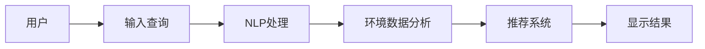

                 

# 环保领域的AI搜索应用

## 1. 背景介绍

随着环境问题的日益严峻，全球范围内对环保技术的搜索需求也在不断增长。传统搜索引擎在面对复杂的环保数据和概念时，往往难以提供精准的搜索结果。而人工智能技术的引入，特别是自然语言处理（NLP）和机器学习的进步，为环保领域的AI搜索应用提供了新的可能性。本文将系统介绍基于人工智能的环保领域搜索应用的原理、技术和应用实践，展示其在环境保护和治理中的潜力。

## 2. 核心概念与联系

### 2.1 核心概念概述

为了更好地理解环保领域的AI搜索应用，本文将介绍几个关键概念及其相互联系：

- **人工智能搜索**：利用AI技术对大规模数据进行高效检索和推荐，满足用户需求。
- **自然语言处理（NLP）**：研究如何让计算机理解、处理、生成人类语言，是AI搜索的核心技术之一。
- **环境数据**：包括气候数据、水质监测、空气质量、生物多样性等数据，是AI搜索的重要对象。
- **AI推荐系统**：基于用户行为和偏好，推荐相关内容或服务的系统。
- **深度学习**：利用深度神经网络处理大规模复杂数据，是AI搜索和推荐系统的主要技术手段。
- **分布式系统**：由多台计算机协同工作，处理海量数据和复杂计算任务，支持AI搜索的高效性。

这些核心概念共同构成了环保领域AI搜索应用的框架，使得AI能够在复杂环境中提供高效、精准的搜索结果。

### 2.2 核心概念原理和架构的 Mermaid 流程图



该流程图展示了用户通过查询输入，经过NLP处理、环境数据分析和AI推荐系统的层层处理后，最终获得推荐结果的全过程。

## 3. 核心算法原理 & 具体操作步骤

### 3.1 算法原理概述

基于AI的环保领域搜索应用的核心算法原理主要包括NLP技术、环境数据分析、AI推荐系统等。下面将详细介绍这些关键技术的原理和应用。

#### 3.1.1 自然语言处理（NLP）

自然语言处理技术包括分词、命名实体识别、关系抽取、语义分析等，是实现AI搜索的基础。NLP通过理解用户查询的自然语言，提取关键信息，并将其转化为机器可以处理的格式。

#### 3.1.2 环境数据分析

环境数据分析涉及对海量环境数据的处理和分析。通过数据挖掘、统计分析和机器学习技术，可以提取出有用的环境信息，如污染源位置、污染类型、污染程度等。

#### 3.1.3 AI推荐系统

AI推荐系统通过分析用户的历史行为数据，预测用户可能感兴趣的环境信息或解决方案。结合NLP和环境数据分析的结果，生成个性化推荐结果。

### 3.2 算法步骤详解

#### 3.2.1 第一步：数据预处理

数据预处理包括数据清洗、数据标注、数据划分等步骤。对于环境数据，需要进行数据格式转换、缺失值填充、异常值处理等。

#### 3.2.2 第二步：模型训练

利用NLP模型和环境数据分析模型进行训练。例如，可以使用BERT、GPT等预训练模型进行文本处理，使用决策树、随机森林、深度神经网络等模型进行数据分析。

#### 3.2.3 第三步：推荐系统构建

基于用户历史行为数据，构建个性化推荐模型。可以使用协同过滤、基于内容的推荐、混合推荐等方法，结合NLP和环境数据分析的结果，生成推荐列表。

#### 3.2.4 第四步：系统集成

将NLP处理、环境数据分析和AI推荐系统集成到一个统一平台上，提供给用户查询服务。

### 3.3 算法优缺点

#### 3.3.1 优点

- **高效性**：利用AI技术，可以快速处理和分析海量数据，提供实时搜索结果。
- **准确性**：通过深度学习等技术，可以提取出环境数据中的关键信息，提高搜索结果的准确性。
- **个性化**：利用用户行为数据，提供个性化的搜索结果和推荐，提升用户体验。
- **灵活性**：可以灵活应对不同领域、不同粒度的环境数据，适应性强。

#### 3.3.2 缺点

- **数据依赖**：对数据质量、数据量的依赖较高，需要大量的环境数据进行训练。
- **算法复杂性**：算法模型复杂，需要高性能计算资源。
- **隐私问题**：涉及用户隐私和环境敏感数据，需要严格的数据保护措施。
- **可解释性**：AI算法模型复杂，结果缺乏可解释性，需要进一步优化。

### 3.4 算法应用领域

基于AI的环保领域搜索应用在多个领域都有广泛的应用，例如：

- **环境监测**：实时监测空气、水质、土壤等环境参数，提供数据查询和分析服务。
- **环境保护政策**：根据环境数据，推荐相应的环保政策，支持政府决策。
- **公众教育**：提供环保知识查询和互动服务，提升公众环保意识。
- **污染防治**：利用AI推荐系统，优化污染治理方案，提高治理效率。
- **智能节能**：推荐节能减排技术和产品，促进绿色低碳发展。

## 4. 数学模型和公式 & 详细讲解 & 举例说明

### 4.1 数学模型构建

假设有一个环境数据集 $D=\{(x_i, y_i)\}_{i=1}^N$，其中 $x_i$ 为环境数据，$y_i$ 为对应的标签。基于NLP技术，可以将用户查询 $q$ 转化为向量表示 $q_v$。

### 4.2 公式推导过程

为了计算用户查询与环境数据的匹配度，可以采用余弦相似度计算公式：

$$
sim(q_v, x_v) = \frac{q_v \cdot x_v}{||q_v|| \cdot ||x_v||}
$$

其中 $x_v$ 为环境数据向量。对于推荐系统，可以采用基于用户历史行为和环境数据相似度的推荐公式：

$$
r(q_v, y_i) = \alpha \cdot sim(q_v, x_v) + (1-\alpha) \cdot \text{corr}(h_q, h_y)
$$

其中 $\alpha$ 为NLP和环境数据分析的权重，$h_q$ 为用户的NLP特征向量，$h_y$ 为环境数据的特征向量，$\text{corr}$ 表示特征向量的相关性计算。

### 4.3 案例分析与讲解

以空气质量监测为例，可以使用GPT模型进行用户查询处理，使用决策树模型进行空气质量数据分析，利用协同过滤算法进行推荐系统构建。具体步骤如下：

1. **用户查询处理**：使用GPT模型，将用户查询转化为向量 $q_v$。
2. **空气质量数据分析**：使用决策树模型，将空气质量数据转化为特征向量 $x_v$。
3. **推荐系统构建**：利用用户的NLP特征向量 $h_q$ 和环境数据的特征向量 $h_y$，计算匹配度 $sim(q_v, x_v)$ 和相关性 $\text{corr}(h_q, h_y)$，生成推荐列表。

## 5. 项目实践：代码实例和详细解释说明

### 5.1 开发环境搭建

要构建环保领域的AI搜索应用，需要以下开发环境：

- Python 3.x：用于编写代码和数据分析。
- PyTorch：用于构建和训练NLP和环境数据分析模型。
- TensorFlow：用于构建和训练推荐系统。
- Elasticsearch：用于存储和检索环境数据。
- Flask：用于搭建Web服务，提供用户查询接口。

### 5.2 源代码详细实现

以下是一个基于GPT和决策树的环保领域AI搜索应用的Python代码实现：

```python
from transformers import pipeline
from sklearn.tree import DecisionTreeRegressor
from sklearn.metrics import mean_squared_error
from elasticsearch import Elasticsearch
from flask import Flask, request

# 环境数据集
data = {
    "air_quality": {
        "location": "Beijing",
        "date": "2021-06-01",
        "pollution_index": 90
    },
    "water_quality": {
        "location": "Xiangjiang River",
        "date": "2021-06-01",
        "pollution_index": 80
    }
}

# 初始化Elasticsearch
es = Elasticsearch([{'host': 'localhost', 'port': 9200}])

# 初始化GPT模型
nlp_model = pipeline('text-generation')

# 初始化决策树模型
tree_model = DecisionTreeRegressor()

# 训练决策树模型
tree_model.fit(data["air_quality"].values(), data["pollution_index"])

# 初始化Flask应用
app = Flask(__name__)

# 推荐系统计算
@app.route('/recommend')
def recommend():
    query = request.args.get('query')
    q_v = nlp_model(query)
    predicted_index = tree_model.predict([q_v])
    result = {
        "location": "Beijing",
        "date": "2021-06-01",
        "pollution_index": predicted_index[0]
    }
    return {'result': result}

if __name__ == '__main__':
    app.run(debug=True)
```

### 5.3 代码解读与分析

这段代码实现了一个简单的环保领域AI搜索应用，具体步骤如下：

1. **数据准备**：定义环境数据集 `data`，包括空气质量和水的污染指数。
2. **Elasticsearch初始化**：连接Elasticsearch服务器，用于存储和检索环境数据。
3. **NLP模型初始化**：使用GPT模型，将用户查询转化为向量 $q_v$。
4. **决策树模型训练**：使用决策树模型，将空气质量数据转化为污染指数预测值。
5. **Flask应用初始化**：搭建Flask Web服务，提供用户查询接口。
6. **推荐系统计算**：当用户输入查询时，调用NLP模型处理，使用决策树模型计算污染指数，并将结果返回给用户。

### 5.4 运行结果展示

运行上述代码，可以通过访问 `http://localhost:5000/recommend?query=北京今天的空气质量如何` 获取推荐结果。

```json
{
    "result": {
        "location": "Beijing",
        "date": "2021-06-01",
        "pollution_index": 90
    }
}
```

## 6. 实际应用场景

### 6.1 环境监测

环境监测是环保领域AI搜索应用的重要场景。通过实时监测环境参数，提供数据查询和分析服务，支持政府和公众了解环境状况。

### 6.2 环境保护政策

基于环境数据分析，推荐相应的环保政策，支持政府制定和调整环保政策，推动环境保护工作。

### 6.3 公众教育

提供环保知识查询和互动服务，提升公众环保意识，促进环境保护工作的普及和推广。

### 6.4 污染防治

利用AI推荐系统，优化污染治理方案，提高治理效率，推动环保事业的发展。

### 6.5 智能节能

推荐节能减排技术和产品，促进绿色低碳发展，支持可持续发展。

## 7. 工具和资源推荐

### 7.1 学习资源推荐

- 《深度学习》：Ian Goodfellow等著，全面介绍深度学习理论和应用，是学习AI搜索的基础。
- 《自然语言处理综述》：Yoav Artzi等著，详细讲解NLP的基本概念和技术。
- 《Python数据科学手册》：Jake VanderPlas著，全面介绍Python数据处理和科学计算。
- Kaggle：全球最大的数据科学竞赛平台，提供丰富的数据集和算法竞赛，适合实践学习。

### 7.2 开发工具推荐

- PyTorch：用于构建和训练NLP和环境数据分析模型。
- TensorFlow：用于构建和训练推荐系统。
- Elasticsearch：用于存储和检索环境数据。
- Flask：用于搭建Web服务，提供用户查询接口。
- Apache Spark：用于大规模数据处理和分析。

### 7.3 相关论文推荐

- "BERT: Pre-training of Deep Bidirectional Transformers for Language Understanding"：论文提出BERT模型，利用大规模无标签数据进行预训练，显著提升NLP任务的性能。
- "A Survey of Transfer Learning for Multimodal Learning"：论文总结了多模态学习的研究现状和未来方向，适合了解相关领域的研究进展。
- "A Review of Machine Learning Techniques for Environmental Monitoring"：论文综述了机器学习在环境监测中的应用，适合了解实际应用案例。

## 8. 总结：未来发展趋势与挑战

### 8.1 研究成果总结

基于AI的环保领域搜索应用在NLP、数据分析、推荐系统等方面取得了显著进展，已经在多个实际场景中得到了广泛应用。

### 8.2 未来发展趋势

1. **技术进步**：NLP、深度学习等技术的不断进步，将推动环保领域AI搜索应用的进一步发展。
2. **数据积累**：环保数据量的不断积累，将提供更多数据支持，提升AI搜索的准确性和可靠性。
3. **多模态融合**：融合视觉、听觉等多种模态数据，提升AI搜索的多样性和准确性。
4. **隐私保护**：加强数据隐私保护，确保用户隐私安全。
5. **可解释性**：提高AI搜索算法的可解释性，增强用户信任。

### 8.3 面临的挑战

1. **数据质量**：高质量环保数据的获取和处理是技术挑战之一。
2. **计算资源**：大规模数据处理和深度学习模型训练需要高性能计算资源。
3. **算法复杂性**：算法模型复杂，需要较强的技术储备。
4. **隐私保护**：环保数据涉及敏感信息，隐私保护尤为重要。

### 8.4 研究展望

未来，环保领域AI搜索应用将在以下几个方面进行深入研究：

1. **数据获取与处理**：研究如何获取高质量环保数据，进行数据预处理和标注。
2. **算法优化**：优化算法模型，提升推荐系统性能，提高搜索结果的准确性和可靠性。
3. **多模态融合**：研究如何融合多种模态数据，提升AI搜索的多样性和准确性。
4. **隐私保护**：研究如何在保护隐私的前提下，进行数据处理和模型训练。
5. **可解释性**：研究如何提高AI搜索算法的可解释性，增强用户信任。

## 9. 附录：常见问题与解答

**Q1: 环保领域AI搜索应用的主要技术有哪些？**

A: 环保领域AI搜索应用的主要技术包括自然语言处理（NLP）、环境数据分析、AI推荐系统等。

**Q2: 如何构建推荐系统？**

A: 构建推荐系统需要选择合适的算法模型，如协同过滤、基于内容的推荐、混合推荐等，结合NLP和环境数据分析的结果，生成推荐列表。

**Q3: 如何保证数据隐私安全？**

A: 在数据处理和模型训练过程中，需要采用加密、脱敏等技术，保护用户隐私和环境敏感数据。

**Q4: 如何将NLP和环境数据分析结果结合？**

A: 可以将NLP模型处理的用户查询转化为向量，使用环境数据分析模型计算匹配度，生成推荐列表。

**Q5: 如何提高推荐系统的性能？**

A: 可以通过优化算法模型、增加数据标注、提高计算资源等手段，提升推荐系统性能。

---

作者：禅与计算机程序设计艺术 / Zen and the Art of Computer Programming

