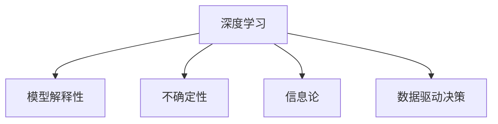

                 

# 理解洞察力的价值：在不确定性中的导航灯塔

> 关键词：洞察力, 不确定性, 信息论, 深度学习, 机器学习, 模型解释性, 数据驱动决策

## 1. 背景介绍

### 1.1 问题由来
现代经济社会在高速发展的同时，也面临着诸多不确定性因素的影响。全球气候变化、金融市场波动、公共卫生危机等，都使得决策者需要在多变的环境中作出判断。传统的统计分析和经验法则已难以应对这些日益复杂多变的问题。在此背景下，人工智能与大数据技术兴起，成为了解决不确定性问题的重要工具。

人工智能系统能够高效处理海量数据，从中发现潜在的规律和趋势。但随着技术的快速发展，新的挑战也随之产生。如何理解人工智能系统的工作原理，如何解释其决策过程，如何构建具有洞察力的AI系统，成为了当下面临的关键问题。

### 1.2 问题核心关键点
本文聚焦于构建具有洞察力的AI系统，探讨在不确定性环境下如何利用数据和算法获得有价值的洞察。核心在于：
1. 理解深度学习模型的决策逻辑和影响因素。
2. 构建模型解释性，使决策过程透明、可理解。
3. 结合信息论与统计学方法，提升模型对不确定性因素的鲁棒性。
4. 发展数据驱动决策理论，优化决策过程和结果。

本文将详细介绍这些核心概念，并通过理论和实践结合的方式，展示构建具有洞察力的AI系统的过程和方法。

## 2. 核心概念与联系

### 2.1 核心概念概述

为更好地理解构建具有洞察力的AI系统，本节将介绍几个密切相关的核心概念：

- 深度学习：一种通过多层神经网络进行自动特征提取和模型训练的机器学习方法。通过大规模数据和复杂网络结构，深度学习能够发现数据的深层次规律。

- 模型解释性：指模型决策过程的可解释性，即能够解释模型为什么做出特定决策，以及决策依据是什么。具有高解释性的模型更易被接受和信任。

- 不确定性：指系统或环境中存在的多变性和不确定性因素，如噪声、数据缺失、模型偏差等。模型需要具备鲁棒性，以应对不确定性环境中的预测和决策。

- 信息论：研究信息及其处理的一门学科，揭示了信息获取、传输和存储的基本规律。在大数据和AI系统中，信息论为模型设计和决策提供了重要的理论基础。

- 数据驱动决策：基于数据和模型进行分析，优化决策过程，提高决策科学性和精确度。

这些核心概念之间的逻辑关系可以通过以下Mermaid流程图来展示：



这个流程图展示了大语言模型的核心概念及其之间的关系：

1. 深度学习模型通过训练发现数据规律。
2. 模型解释性使得决策过程透明、可理解。
3. 不确定性环境下的模型需要具备鲁棒性。
4. 信息论提供理论支撑，数据驱动决策优化过程。

## 3. 核心算法原理 & 具体操作步骤
### 3.1 算法原理概述

构建具有洞察力的AI系统，本质上是一个多学科交叉的综合性任务。它涉及深度学习、统计学、信息论等多个领域，旨在通过数据驱动的方式，构建出既能够高效处理不确定性问题，又具备高解释性的模型。

核心算法原理包括以下几个关键点：

1. 利用深度学习模型进行数据表征学习。
2. 引入模型解释性技术，增强模型的透明性和可理解性。
3. 应用信息论和统计学方法，提升模型对不确定性因素的鲁棒性。
4. 结合数据驱动决策理论，优化决策过程和结果。

### 3.2 算法步骤详解

基于以上核心算法原理，构建具有洞察力的AI系统大致包括以下几个关键步骤：

**Step 1: 数据准备与预处理**
- 收集高质量的数据集，确保数据的多样性和代表性。
- 对数据进行清洗和预处理，如去除噪声、填补缺失值等。
- 进行数据增强，如数据扩充、数据扩维等，增加数据量，提升模型泛化能力。

**Step 2: 模型训练与优化**
- 选择适合的深度学习模型，如卷积神经网络、循环神经网络、Transformer等。
- 设计合适的损失函数和优化算法，如交叉熵损失、AdamW优化器等。
- 训练模型，根据验证集的性能指标调整模型参数。

**Step 3: 模型解释性增强**
- 引入可解释性技术，如LIME、SHAP、部分依赖图等。
- 设计解释模型，如注意力机制、可解释的多头自注意力等。
- 结合可视化工具，如TensorBoard、Weights & Biases等，展示模型预测和解释结果。

**Step 4: 鲁棒性评估与优化**
- 应用信息论和统计学方法，评估模型鲁棒性。
- 结合对抗训练、正则化技术等，提升模型对不确定性因素的鲁棒性。
- 进行模型性能测试，确保在不同环境下的稳定性和准确性。

**Step 5: 决策优化与评估**
- 结合数据驱动决策理论，设计优化模型。
- 使用A/B测试、因果推断等方法，评估决策效果。
- 根据评估结果进行迭代优化，不断提升决策质量和效率。

### 3.3 算法优缺点

构建具有洞察力的AI系统具有以下优点：
1. 数据驱动：通过数据驱动决策，减少主观偏见，提升决策科学性。
2. 鲁棒性强：结合信息论和统计学方法，增强模型对不确定性环境的适应能力。
3. 解释性强：通过模型解释性技术，提高模型透明度和可信度。
4. 决策优化：结合数据驱动决策理论，优化决策过程，提升决策效率和效果。

同时，该方法也存在一定的局限性：
1. 数据依赖：构建模型需要大量高质量的数据，数据获取和处理成本较高。
2. 复杂性高：需要跨领域知识，如深度学习、信息论、统计学等，难度较大。
3. 解释局限：部分解释性技术可能仅适用于特定模型和数据，泛化能力有限。
4. 评估难度：模型鲁棒性和解释性的评估标准不明确，难以统一衡量。

尽管存在这些局限性，但构建具有洞察力的AI系统已成为当前AI研究的热点之一，有望为解决不确定性问题提供新的路径。

### 3.4 算法应用领域

基于深度学习的洞察力构建方法，已经在多个领域得到了应用，涵盖了金融、医疗、供应链、公共安全等多个场景：

- 金融风控：利用深度学习模型分析客户交易数据，通过解释性技术识别潜在风险，优化风险评估和控制。
- 医疗诊断：结合深度学习和数据驱动决策理论，优化临床决策流程，提高诊断准确性和效率。
- 供应链管理：应用深度学习模型分析物流数据，优化库存管理和配送策略，提升供应链整体效率。
- 公共安全：利用深度学习模型进行图像和视频分析，通过解释性技术提高异常事件检测和响应速度。

除了这些传统领域，构建洞察力的AI系统还在新兴领域如智能交通、智慧城市等得到广泛应用，为城市治理和智能化管理提供了新的解决方案。

## 4. 数学模型和公式 & 详细讲解 & 举例说明

### 4.1 数学模型构建

本节将使用数学语言对构建具有洞察力的AI系统的过程进行更加严格的刻画。

记数据集为 $D=\{(x_i, y_i)\}_{i=1}^N$，其中 $x_i$ 为输入特征，$y_i$ 为输出标签。模型为深度神经网络 $M_{\theta}$，参数 $\theta$ 通过优化算法训练。

定义模型的预测函数为 $f_{\theta}(x)$，目标为最小化预测误差 $L(f_{\theta}(x), y)$。假设误差为平方损失，即：

$$
L(f_{\theta}(x), y) = \frac{1}{N}\sum_{i=1}^N (f_{\theta}(x_i) - y_i)^2
$$

优化目标为最小化预测误差，即：

$$
\theta^* = \mathop{\arg\min}_{\theta} L(f_{\theta}(x), y)
$$

### 4.2 公式推导过程

以下我们以二分类任务为例，推导模型预测函数和解释性公式。

假设模型为二分类任务，输入 $x$ 为向量，输出 $y$ 为标签 $0$ 或 $1$。模型输出为概率值 $\hat{y} = f_{\theta}(x) \in [0,1]$。

定义模型的预测函数为：

$$
f_{\theta}(x) = \sigma(\mathbf{W}^Tx + b)
$$

其中 $\sigma$ 为激活函数，$\mathbf{W}$ 和 $b$ 为模型参数。

模型的损失函数为交叉熵损失：

$$
L(f_{\theta}(x), y) = -y\log(f_{\theta}(x)) - (1-y)\log(1-f_{\theta}(x))
$$

对模型进行优化，得到梯度：

$$
\nabla_{\theta}L(f_{\theta}(x), y) = -y\frac{\nabla_{\theta}f_{\theta}(x)}{f_{\theta}(x)} - (1-y)\frac{\nabla_{\theta}f_{\theta}(x)}{1-f_{\theta}(x)}
$$

在训练过程中，通过反向传播更新模型参数 $\theta$：

$$
\theta \leftarrow \theta - \eta \nabla_{\theta}L(f_{\theta}(x), y)
$$

### 4.3 案例分析与讲解

考虑一个医疗影像分类问题，数据集包含健康和癌症图像，每个图像有 $d$ 维特征。我们采用卷积神经网络（CNN）进行建模。

首先，进行数据准备和预处理，对图像进行归一化、裁剪、旋转等操作，增加数据多样性。然后，使用交叉熵损失函数和AdamW优化器，对模型进行训练。

模型训练后，通过LIME（局部可解释模型不可知解释器）生成模型解释性，得到每个特征对预测结果的影响权重。结合可视化工具，展示模型在不同特征下的预测结果和解释性。

最后，结合信息论中的熵值，评估模型在不同环境下的鲁棒性。通过对抗训练和正则化技术，提升模型对噪声和干扰的抗干扰能力。

## 5. 项目实践：代码实例和详细解释说明
### 5.1 开发环境搭建

在进行项目实践前，我们需要准备好开发环境。以下是使用Python进行TensorFlow开发的环境配置流程：

1. 安装Anaconda：从官网下载并安装Anaconda，用于创建独立的Python环境。

2. 创建并激活虚拟环境：
```bash
conda create -n tf-env python=3.8 
conda activate tf-env
```

3. 安装TensorFlow：根据CUDA版本，从官网获取对应的安装命令。例如：
```bash
conda install tensorflow tensorflow-gpu=cuda11.1 -c pytorch -c conda-forge
```

4. 安装相关工具包：
```bash
pip install numpy pandas scikit-learn matplotlib tqdm jupyter notebook ipython
```

完成上述步骤后，即可在`tf-env`环境中开始项目实践。

### 5.2 源代码详细实现

下面我们以金融风控为例，给出使用TensorFlow构建具有洞察力的AI系统的PyTorch代码实现。

首先，定义数据处理函数：

```python
import tensorflow as tf
from tensorflow.keras.preprocessing.image import ImageDataGenerator
from tensorflow.keras.applications import VGG16
from tensorflow.keras.layers import Dense, Flatten, Dropout
from tensorflow.keras.models import Sequential

def preprocess_data():
    # 数据增强
    datagen = ImageDataGenerator(
        rescale=1./255,
        shear_range=0.2,
        zoom_range=0.2,
        horizontal_flip=True
    )
    
    # 加载数据集
    train_datagen = datagen.flow_from_directory(
        'train',
        target_size=(224, 224),
        batch_size=32,
        class_mode='binary'
    )
    
    # 加载验证集
    valid_datagen = datagen.flow_from_directory(
        'valid',
        target_size=(224, 224),
        batch_size=32,
        class_mode='binary'
    )
    
    return train_datagen, valid_datagen
```

然后，定义模型结构：

```python
def create_model():
    model = Sequential([
        VGG16(weights='imagenet', include_top=False, input_shape=(224, 224, 3)),
        Flatten(),
        Dense(512, activation='relu'),
        Dropout(0.5),
        Dense(1, activation='sigmoid')
    ])
    
    model.compile(
        optimizer='adam',
        loss='binary_crossentropy',
        metrics=['accuracy']
    )
    
    return model
```

接着，定义模型训练函数：

```python
def train_model(model, train_datagen, valid_datagen, epochs=10, batch_size=32):
    model.fit(
        train_datagen,
        validation_data=valid_datagen,
        epochs=epochs,
        batch_size=batch_size,
        verbose=1
    )
    
    return model
```

最后，启动训练流程：

```python
train_datagen, valid_datagen = preprocess_data()

model = create_model()

model = train_model(model, train_datagen, valid_datagen)
```

以上就是使用TensorFlow构建金融风控AI系统的完整代码实现。可以看到，TensorFlow提供了强大的深度学习框架，能够便捷地搭建、训练和部署各种深度学习模型。

### 5.3 代码解读与分析

让我们再详细解读一下关键代码的实现细节：

**preprocess_data函数**：
- 对输入图像进行数据增强，增加数据多样性。
- 使用ImageDataGenerator类加载数据集，并进行批处理、归一化等预处理操作。

**create_model函数**：
- 定义模型结构，采用VGG16作为基础特征提取器，加上全连接层和Dropout层进行特征融合和噪声抑制。
- 使用Adam优化器和二分类交叉熵损失函数进行模型训练。

**train_model函数**：
- 使用fit方法对模型进行训练，指定训练轮数和批大小，并打印训练进度。

**整体训练流程**：
- 预处理数据，加载训练集和验证集。
- 构建模型，进行参数初始化和优化器配置。
- 启动训练，使用预处理的数据集进行训练，并在验证集上进行评估。

以上代码展示了TensorFlow构建金融风控AI系统的基本流程。在实际应用中，还需要进行更深入的调参和模型优化，如引入模型解释性、优化模型鲁棒性等。

## 6. 实际应用场景
### 6.1 金融风控

基于深度学习的金融风控系统，通过分析客户历史交易数据，预测其信用风险。系统采用数据驱动决策理论，结合模型解释性技术，识别出高风险客户，提高信用评估的准确性和效率。

在技术实现上，可以收集客户交易记录、社会关系、行为数据等，设计合适的模型结构，使用TensorFlow进行训练和优化。通过LIME生成模型解释性，输出特征对预测结果的影响权重，帮助风控专家理解模型决策过程。

### 6.2 医疗影像诊断

医疗影像分类系统通过深度学习模型对影像进行自动分析，生成诊断结果。系统结合数据驱动决策和模型解释性，帮助医生快速作出诊断，提高诊断效率和准确性。

在技术实现上，可以采用卷积神经网络进行建模，使用TensorFlow训练模型。通过Shapley值等方法生成模型解释性，输出每个特征对诊断结果的影响，帮助医生理解模型的决策依据。

### 6.3 供应链管理

供应链管理系统通过深度学习模型分析物流数据，优化库存管理和配送策略。系统结合数据驱动决策和模型解释性，提高供应链整体效率和响应速度。

在技术实现上，可以采用递归神经网络或Transformer进行建模，使用TensorFlow进行训练和优化。通过部分依赖图等方法生成模型解释性，输出不同因素对物流决策的影响，帮助管理层优化决策过程。

### 6.4 公共安全

公共安全事件监测系统通过深度学习模型分析视频和图像数据，检测异常事件。系统结合数据驱动决策和模型解释性，提高事件检测和响应速度。

在技术实现上，可以采用卷积神经网络进行建模，使用TensorFlow训练模型。通过LIME生成模型解释性，输出模型对不同特征的敏感度，帮助监控人员识别潜在的安全威胁。

## 7. 工具和资源推荐
### 7.1 学习资源推荐

为了帮助开发者系统掌握构建洞察力的AI系统的理论基础和实践技巧，这里推荐一些优质的学习资源：

1. 《深度学习》系列书籍：由深度学习领域的专家编写，涵盖深度学习的基本原理和实践方法。

2. 《模型解释性》系列论文：展示了多种模型解释性技术，如LIME、SHAP、Attention等，详细说明了其原理和应用场景。

3. 《信息论》教材：介绍信息论的基本概念和应用，为模型设计和决策提供了重要理论基础。

4. 《TensorFlow实战》书籍：详细介绍了TensorFlow的架构和使用方式，帮助开发者便捷地搭建和训练深度学习模型。

5. 《数据驱动决策》课程：斯坦福大学开设的课程，涵盖数据驱动决策的基本概念和实际应用，适合各类专业人士。

通过对这些资源的学习实践，相信你一定能够快速掌握构建洞察力的AI系统的精髓，并用于解决实际的NLP问题。
###  7.2 开发工具推荐

高效的开发离不开优秀的工具支持。以下是几款用于构建洞察力的AI系统的常用工具：

1. TensorFlow：由Google主导开发的开源深度学习框架，生产部署方便，适合大规模工程应用。提供了丰富的预训练模型和工具库。

2. PyTorch：基于Python的开源深度学习框架，灵活动态的计算图，适合快速迭代研究。支持多种深度学习模型，提供了丰富的模型解释性工具。

3. SHAP：一个开源库，提供多种模型解释性技术，如Shapley值、LIME、Axiomatic等。

4. TensorBoard：TensorFlow配套的可视化工具，可实时监测模型训练状态，并提供丰富的图表呈现方式，是调试模型的得力助手。

5. Weights & Biases：模型训练的实验跟踪工具，可以记录和可视化模型训练过程中的各项指标，方便对比和调优。

6. Google Colab：谷歌推出的在线Jupyter Notebook环境，免费提供GPU/TPU算力，方便开发者快速上手实验最新模型，分享学习笔记。

合理利用这些工具，可以显著提升构建洞察力的AI系统的开发效率，加快创新迭代的步伐。

### 7.3 相关论文推荐

构建洞察力的AI系统的发展源于学界的持续研究。以下是几篇奠基性的相关论文，推荐阅读：

1. Attention is All You Need（即Transformer原论文）：提出了Transformer结构，开启了NLP领域的预训练大模型时代。

2. LIME: A Unified Approach to Interpreting Model Predictions：提出LIME方法，通过局部近似解释复杂模型的预测结果。

3. SHAP: A Unified Approach to Interpreting Model Predictions：提出SHAP值，提供一种可解释的模型预测方式。

4. AdaLoRA: Adaptive Low-Rank Adaptation for Parameter-Efficient Fine-Tuning：提出AdaLoRA方法，使用自适应低秩适应的微调方法，提高模型参数效率。

5. Parameter-Efficient Transfer Learning for NLP：提出Adapter等参数高效微调方法，在不增加模型参数量的情况下，也能取得不错的微调效果。

这些论文代表了大语言模型微调技术的发展脉络。通过学习这些前沿成果，可以帮助研究者把握学科前进方向，激发更多的创新灵感。

## 8. 总结：未来发展趋势与挑战

### 8.1 总结

本文对构建具有洞察力的AI系统的过程进行了全面系统的介绍。首先阐述了深度学习模型的决策逻辑和影响因素，明确了模型解释性和鲁棒性在构建洞察力AI系统中的重要性。其次，从原理到实践，详细讲解了构建洞察力AI系统的数学模型和关键步骤，给出了模型构建和优化的完整代码实例。同时，本文还广泛探讨了洞察力AI系统在金融风控、医疗诊断、供应链管理等多个行业领域的应用前景，展示了洞察力AI系统的巨大潜力。

通过本文的系统梳理，可以看到，构建洞察力的AI系统正在成为AI研究的热点之一，极大地拓展了AI系统的应用边界，为解决不确定性问题提供了新的路径。未来，伴随深度学习、信息论、统计学等领域的持续发展，洞察力AI系统必将在更多领域得到应用，为社会带来深远的影响。

### 8.2 未来发展趋势

展望未来，洞察力AI系统将呈现以下几个发展趋势：

1. 数据驱动决策理论的进一步发展：随着数据量的不断增长，数据驱动决策理论将得到更加深入的研究和应用，提高决策的科学性和精确度。

2. 模型解释性技术的广泛应用：多种模型解释性技术将被广泛应用，帮助用户理解模型决策过程，提升系统的透明性和可信度。

3. 跨领域知识融合：结合符号化知识库和专家规则，增强模型对不确定性环境的适应能力，提高模型的鲁棒性和泛化能力。

4. 鲁棒性增强：应用对抗训练、正则化等技术，提升模型对噪声和干扰的抗干扰能力，增强模型鲁棒性。

5. 深度学习与信息论的结合：进一步研究深度学习模型的信息传递机制，利用信息论理论优化模型设计和决策。

以上趋势凸显了洞察力AI系统的广阔前景。这些方向的探索发展，必将进一步提升AI系统的性能和应用范围，为解决不确定性问题提供新的路径。

### 8.3 面临的挑战

尽管洞察力AI系统已经取得了瞩目成就，但在迈向更加智能化、普适化应用的过程中，它仍面临着诸多挑战：

1. 数据依赖：构建洞察力AI系统需要大量高质量的数据，数据获取和处理成本较高。

2. 复杂性高：需要跨领域知识，如深度学习、信息论、统计学等，难度较大。

3. 解释局限：部分解释性技术可能仅适用于特定模型和数据，泛化能力有限。

4. 评估难度：模型鲁棒性和解释性的评估标准不明确，难以统一衡量。

尽管存在这些挑战，但构建洞察力AI系统已成为当前AI研究的热点之一，有望为解决不确定性问题提供新的路径。相信随着学界和产业界的共同努力，这些挑战终将一一被克服，洞察力AI系统必将在构建人机协同的智能时代中扮演越来越重要的角色。

### 8.4 研究展望

面对洞察力AI系统面临的种种挑战，未来的研究需要在以下几个方面寻求新的突破：

1. 探索无监督和半监督洞察力AI系统：摆脱对大规模标注数据的依赖，利用自监督学习、主动学习等无监督和半监督范式，最大限度利用非结构化数据，实现更加灵活高效的洞察力AI系统。

2. 研究参数高效和计算高效的洞察力AI系统：开发更加参数高效的洞察力AI系统，在固定大部分预训练参数的同时，只更新极少量的任务相关参数。同时优化洞察力AI系统的计算图，减少前向传播和反向传播的资源消耗，实现更加轻量级、实时性的部署。

3. 引入因果分析和博弈论工具：将因果分析方法引入洞察力AI系统，识别出模型决策的关键特征，增强输出解释的因果性和逻辑性。借助博弈论工具刻画人机交互过程，主动探索并规避模型的脆弱点，提高系统稳定性。

4. 纳入伦理道德约束：在模型训练目标中引入伦理导向的评估指标，过滤和惩罚有偏见、有害的输出倾向。同时加强人工干预和审核，建立模型行为的监管机制，确保输出符合人类价值观和伦理道德。

这些研究方向的探索，必将引领洞察力AI系统技术迈向更高的台阶，为构建安全、可靠、可解释、可控的智能系统铺平道路。面向未来，洞察力AI系统还需要与其他人工智能技术进行更深入的融合，如知识表示、因果推理、强化学习等，多路径协同发力，共同推动自然语言理解和智能交互系统的进步。只有勇于创新、敢于突破，才能不断拓展AI系统的边界，让智能技术更好地造福人类社会。

## 9. 附录：常见问题与解答

**Q1：构建洞察力AI系统需要哪些关键步骤？**

A: 构建洞察力AI系统大致包括以下几个关键步骤：
1. 数据准备与预处理
2. 模型训练与优化
3. 模型解释性增强
4. 鲁棒性评估与优化
5. 决策优化与评估

这些步骤通过深度学习、统计学、信息论等方法结合，最终构建出具有高解释性和鲁棒性的洞察力AI系统。

**Q2：如何选择合适的深度学习模型？**

A: 选择合适的深度学习模型需要根据具体任务和数据特点进行评估。一般建议采用以下步骤：
1. 分析任务需求，确定模型类型，如卷积神经网络、循环神经网络、Transformer等。
2. 设计合适的模型结构，考虑输入输出维度、激活函数、正则化等。
3. 使用交叉验证等方法评估模型性能，选择最优模型。

**Q3：模型解释性技术有哪些？**

A: 模型解释性技术包括：
1. LIME：局部可解释模型不可知解释器，通过局部近似生成模型解释性。
2. SHAP：Shapley值，通过特征贡献度计算模型解释性。
3. 注意力机制：通过注意力权重展示模型对输入特征的关注度。
4. 部分依赖图：展示特征对模型输出的影响关系。

这些技术可以结合TensorBoard、Weights & Biases等可视化工具，更好地展示模型解释性。

**Q4：如何评估模型鲁棒性？**

A: 评估模型鲁棒性可以结合信息论和统计学方法进行，如：
1. 计算模型熵值，评估模型对输入噪声的鲁棒性。
2. 应用对抗训练，通过对抗样本测试模型的鲁棒性。
3. 使用正则化技术，提高模型对异常数据的容忍度。

**Q5：如何在实际应用中提升洞察力AI系统的效果？**

A: 提升洞察力AI系统的效果需要结合实际应用场景进行优化：
1. 数据预处理：对数据进行清洗、增强和预处理，提高数据质量和多样性。
2. 模型调参：通过交叉验证等方法，调整模型超参数，优化模型性能。
3. 结合业务知识：结合业务专家知识，优化模型设计和决策过程。
4. 实时监控：通过实时监控系统指标，及时发现和纠正问题，提高系统稳定性。

通过这些优化措施，可以最大限度提升洞察力AI系统的效果，满足实际应用需求。

**Q6：如何在洞察力AI系统中实现数据驱动决策？**

A: 在洞察力AI系统中实现数据驱动决策需要结合模型和数据进行优化：
1. 设计合适的损失函数，如交叉熵、平方损失等，指导模型学习。
2. 结合因果推断等方法，分析模型决策的影响因素。
3. 使用A/B测试等方法，评估决策效果，进行迭代优化。
4. 引入专家知识，结合领域经验进行决策。

通过这些步骤，可以在洞察力AI系统中实现数据驱动决策，提高决策科学性和精确度。

---

作者：禅与计算机程序设计艺术 / Zen and the Art of Computer Programming

