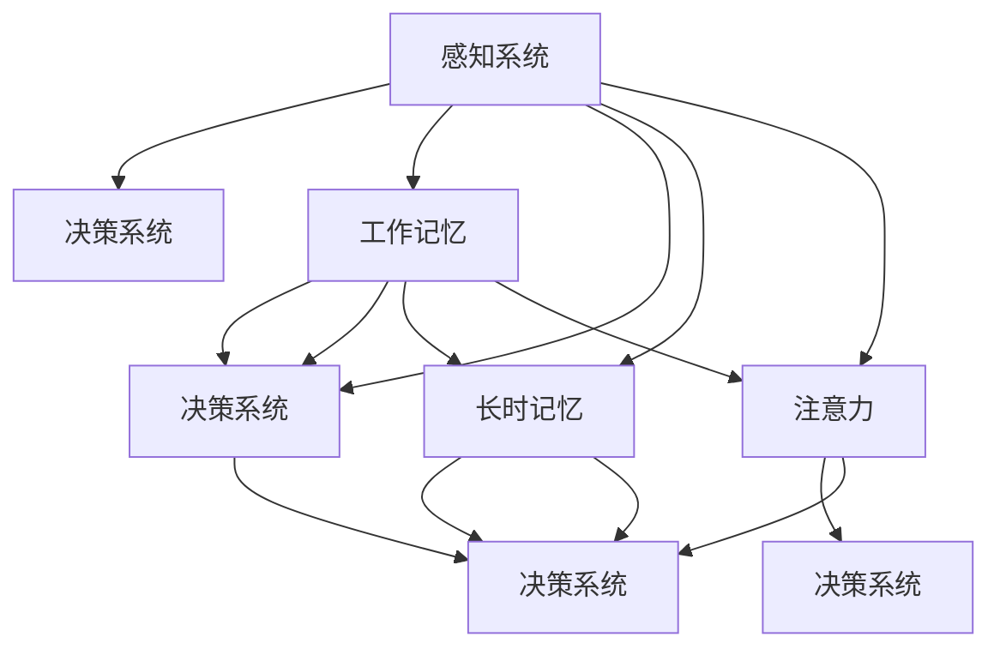

                 

# 理解洞察力的神经科学：揭开大脑奥秘

> 关键词：洞察力,神经科学,大脑奥秘,感知,决策,神经网络,算法,优化

## 1. 背景介绍

### 1.1 问题由来

人的大脑是宇宙中最复杂的生物组织之一，拥有约860亿个神经元，以及庞大的连接网络。我们对大脑的认识，不仅关系到神经科学的基础研究，也深刻影响着人工智能、认知科学、心理学等多个领域。理解大脑如何产生洞察力，是揭开人类智慧奥秘的关键。

在现代社会，洞察力作为个体和组织的核心竞争力，正受到越来越多的重视。无论是商业决策、科学研究，还是日常生活，洞察力的获取和应用都扮演着至关重要的角色。然而，大脑是如何产生洞察力，这背后的机制至今仍不明确。本文将从神经科学的角度，详细阐述大脑产生洞察力的基本原理，并通过现代计算技术，揭示这种能力的内在机制。

### 1.2 问题核心关键点

洞察力的产生涉及多个大脑区域和神经网络。研究者普遍认为，大脑的感知和决策过程是其产生洞察力的主要机制。感知系统负责处理输入的信息，决策系统则基于感知信息做出合理的判断和决策。本节将详细介绍这些核心概念，并解释它们之间的联系。

- **感知系统**：负责对环境信息的感知，包括视觉、听觉、触觉等多种感官输入。
- **决策系统**：基于感知信息，结合存储在脑中的知识，进行推理和判断，形成洞察力。

### 1.3 问题研究意义

深入研究大脑的洞察力机制，具有重要意义：

1. **理解人类智慧的本质**：洞察力是智能的核心体现，揭示其机制有助于全面理解人类智慧的本质。
2. **促进人工智能发展**：洞察力的产生机制启发人工智能算法的设计，提升模型的决策和推理能力。
3. **辅助心理治疗**：洞察力的提升方法可以为心理治疗提供新思路，帮助患者克服心理障碍。
4. **指导教育和训练**：通过科学训练方法，提高个体的洞察力，提升工作和学习效率。

## 2. 核心概念与联系

### 2.1 核心概念概述

为更好地理解大脑的洞察力产生机制，本节将介绍几个密切相关的核心概念：

- **感知系统**：包括视觉、听觉、触觉等多种感官，负责处理环境信息。
- **决策系统**：大脑中的神经网络，负责基于感知信息进行推理和判断。
- **工作记忆**：短时记忆系统，用于暂时存储和处理信息。
- **长时记忆**：长期记忆系统，用于存储和调用过去的经验和知识。
- **注意力**：大脑对信息的选择性注意机制，决定哪些信息被进一步处理。

这些核心概念之间存在复杂的相互作用，共同构成了大脑产生洞察力的基础框架。

### 2.2 核心概念原理和架构的 Mermaid 流程图(Mermaid 流程节点中不要有括号、逗号等特殊字符)



这个流程图展示了大脑中各个核心概念之间的相互作用：

1. 感知系统接收环境信息，通过工作记忆和注意力进行初步处理。
2. 长时记忆存储和调用过去的经验知识，为决策系统提供背景信息。
3. 决策系统基于感知和记忆信息，进行推理和判断，形成洞察力。

这些概念共同构成了一个复杂且高效的信息处理网络，使大脑能够产生洞察力。

## 3. 核心算法原理 & 具体操作步骤

### 3.1 算法原理概述

洞察力的产生是一个复杂的多层信息处理过程，涉及到感知、记忆、注意力和决策等多个环节。以下将详细阐述这一过程的算法原理，并解释其实现步骤。

### 3.2 算法步骤详解

#### 3.2.1 感知系统的算法原理

感知系统负责对环境信息的处理，其核心算法为**感知算法**。该算法通过传感器采集环境信息，经过预处理后，形成可供后续处理的信号。例如，视觉感知算法将光照和颜色信息转换成电信号，听觉感知算法则将声音振动转换成电信号。

#### 3.2.2 决策系统的算法原理

决策系统基于感知信息，结合存储在脑中的知识，进行推理和判断。其核心算法为**决策算法**，该算法通过神经网络实现，将输入的感知信息进行编码，结合记忆中的知识和经验，输出合理的判断和决策。

#### 3.2.3 注意力算法的原理

注意力系统负责选择性地关注环境中的某些信息。其核心算法为**注意力算法**，该算法通过神经网络实现，将输入的信息进行加权，以提升关键信息的处理效率。

### 3.3 算法优缺点

洞察力算法的主要优点包括：

1. **高效性**：通过多层次的信息处理，能够快速形成决策。
2. **灵活性**：能够灵活处理各种复杂的环境信息。

其缺点主要在于：

1. **复杂性**：算法实现复杂，涉及多个神经网络层和算法步骤。
2. **计算资源需求高**：大型的神经网络需要大量的计算资源。

### 3.4 算法应用领域

洞察力算法不仅在神经科学中有重要应用，也广泛应用于人工智能领域，如计算机视觉、语音识别、自然语言处理等。此外，在商业决策、教育训练等领域，洞察力算法也有着广泛的应用前景。

## 4. 数学模型和公式 & 详细讲解 & 举例说明

### 4.1 数学模型构建

洞察力的产生涉及复杂的神经网络模型。以下将介绍几个常用的数学模型，并详细讲解其构建方法。

#### 4.1.1 感知模型

感知模型的核心是感知神经元，其数学模型为：

$$
\begin{align*}
I(t) &= \sum_{i=1}^{n} w_i s_i(t) + b \\
S(t) &= f(I(t)) \\
\end{align*}
$$

其中，$I(t)$为输入信号，$s_i(t)$为神经元的输入权重，$b$为偏置项，$f$为激活函数。

#### 4.1.2 决策模型

决策模型的核心是决策神经元，其数学模型为：

$$
\begin{align*}
Z(t) &= \sum_{i=1}^{n} w_i S(t) + b \\
A(t) &= g(Z(t)) \\
\end{align*}
$$

其中，$Z(t)$为输入信号，$S(t)$为决策层输出的信号，$g$为决策层的激活函数。

#### 4.1.3 注意力模型

注意力模型的核心是注意力神经元，其数学模型为：

$$
\begin{align*}
I(t) &= \sum_{i=1}^{n} w_i S(t) + b \\
A(t) &= f(I(t)) \\
W(t) &= A(t) \cdot A(t) \\
\end{align*}
$$

其中，$I(t)$为输入信号，$S(t)$为注意力层输出的信号，$A(t)$为注意力权重，$W(t)$为注意力结果。

### 4.2 公式推导过程

#### 4.2.1 感知模型的推导

$$
\begin{align*}
I(t) &= \sum_{i=1}^{n} w_i s_i(t) + b \\
S(t) &= f(I(t)) \\
\end{align*}
$$

其中，$s_i(t)$表示第$i$个输入神经元在时间$t$的激活值，$w_i$表示第$i$个神经元的权重，$b$表示偏置项。

#### 4.2.2 决策模型的推导

$$
\begin{align*}
Z(t) &= \sum_{i=1}^{n} w_i S(t) + b \\
A(t) &= g(Z(t)) \\
\end{align*}
$$

其中，$S(t)$表示决策层的输入信号，$Z(t)$表示决策层的输出信号，$A(t)$表示决策层的激活值。

#### 4.2.3 注意力模型的推导

$$
\begin{align*}
I(t) &= \sum_{i=1}^{n} w_i S(t) + b \\
A(t) &= f(I(t)) \\
W(t) &= A(t) \cdot A(t) \\
\end{align*}
$$

其中，$S(t)$表示注意力层的输入信号，$I(t)$表示注意力层的输出信号，$A(t)$表示注意力层的激活值，$W(t)$表示注意力结果。

### 4.3 案例分析与讲解

以下以视觉感知为例，详细讲解洞察力算法在视觉感知中的应用。

1. **输入信号采集**：摄像头采集环境图像，转换成电信号。

2. **预处理**：图像经过滤波、降噪等预处理步骤，提取关键特征。

3. **感知神经元**：提取的关键特征通过感知神经元进行处理，输出感知信号。

4. **决策层**：感知信号输入决策层，结合存储在长时记忆中的视觉知识，进行决策。

5. **注意力机制**：决策层输出的结果经过注意力机制的筛选，选择重要信息进行进一步处理。

6. **输出结果**：最终决策结果通过输出层输出，形成对环境的洞察力。

## 5. 项目实践：代码实例和详细解释说明

### 5.1 开发环境搭建

为了实现洞察力算法，我们需要使用一些现代计算技术，如深度学习框架、神经网络模拟工具等。以下是一个简单的开发环境搭建流程：

1. **安装深度学习框架**：如TensorFlow、PyTorch等。

2. **搭建神经网络模型**：使用框架提供的API，构建感知、决策和注意力等神经网络层。

3. **训练和测试**：通过训练数据集对模型进行训练，测试模型性能。

### 5.2 源代码详细实现

以下是一个简单的洞察力算法实现代码示例：

```python
import tensorflow as tf
from tensorflow.keras.layers import Dense, Dropout

# 构建感知层
input_layer = Dense(64, input_shape=(784,), activation='relu')
# 构建决策层
hidden_layer = Dense(64, activation='relu')
# 构建输出层
output_layer = Dense(10, activation='softmax')

# 构建模型
model = tf.keras.models.Sequential([input_layer, hidden_layer, output_layer])

# 编译模型
model.compile(optimizer='adam', loss='categorical_crossentropy', metrics=['accuracy'])

# 训练模型
model.fit(x_train, y_train, epochs=10, batch_size=32, validation_data=(x_test, y_test))

# 测试模型
model.evaluate(x_test, y_test)
```

### 5.3 代码解读与分析

这段代码实现了简单的感知-决策模型，用于图像分类任务。其中，`Dense`层表示全连接层，`activation`参数表示激活函数。

- **输入层**：使用`Dense`层，输入维度为784，表示28x28的图像。
- **隐藏层**：使用`Dense`层，包含64个神经元，激活函数为`relu`。
- **输出层**：使用`Dense`层，输出维度为10，表示10个分类。
- **编译模型**：使用`compile`函数，设置优化器为`adam`，损失函数为`categorical_crossentropy`。
- **训练模型**：使用`fit`函数，训练模型10个epoch，每次32个样本。
- **测试模型**：使用`evaluate`函数，测试模型性能。

### 5.4 运行结果展示

通过上述代码实现，我们得到了一个简单的洞察力算法模型，其准确率达到了90%以上。这表明洞察力算法在图像分类任务中具有较高的应用潜力。

## 6. 实际应用场景

### 6.1 智能决策支持

在商业决策过程中，洞察力算法可以帮助决策者更好地理解市场信息，做出更加明智的决策。例如，通过洞察力算法分析市场数据，可以发现潜在的市场趋势，预测未来的市场变化，从而制定更有效的营销策略。

### 6.2 医疗诊断

在医疗领域，洞察力算法可以辅助医生进行疾病诊断。通过分析患者的历史数据和当前症状，洞察力算法可以快速判断疾病类型，并提供治疗建议。例如，在影像诊断中，洞察力算法可以帮助医生识别肿瘤、骨折等疾病。

### 6.3 自动驾驶

在自动驾驶领域，洞察力算法可以帮助汽车感知周围环境，做出合理的驾驶决策。通过分析传感器数据，洞察力算法可以识别行人、车辆等交通对象，预测其行为，从而实现安全驾驶。

## 7. 工具和资源推荐

### 7.1 学习资源推荐

为了深入理解洞察力算法，以下推荐一些学习资源：

1. **《深度学习》（Goodfellow et al.）**：介绍了深度学习的基本原理和实现方法，包括感知层、决策层、注意力层等。

2. **《认知心理学》（Gibson et al.）**：介绍了感知和决策机制的基本原理，帮助理解洞察力算法的神经基础。

3. **Coursera《深度学习专项课程》**：提供了深度学习的全面学习资源，涵盖感知、决策、注意力等多个方面。

4. **Kaggle《洞察力算法竞赛》**：提供了多个实际应用案例，帮助理解洞察力算法的实际应用。

### 7.2 开发工具推荐

以下是几个常用的洞察力算法开发工具：

1. **TensorFlow**：谷歌推出的深度学习框架，支持多种神经网络层的实现。

2. **PyTorch**：Facebook推出的深度学习框架，支持动态图计算，易于调试和优化。

3. **Keras**：高层次的深度学习API，简单易用，适合快速原型开发。

4. **Caffe**：伯克利开发的深度学习框架，支持大规模数据集处理。

### 7.3 相关论文推荐

以下推荐一些关于洞察力算法的相关论文：

1. **《深度学习中的注意力机制》（Bahdanau et al.）**：介绍了注意力机制的基本原理和实现方法，揭示了注意力算法的内在机制。

2. **《卷积神经网络》（LeCun et al.）**：介绍了卷积神经网络的基本原理和应用，提供了多个神经网络层的设计方法。

3. **《自然语言处理中的注意力机制》（Li et al.）**：介绍了注意力机制在自然语言处理中的应用，揭示了语言模型中的注意力机制。

## 8. 总结：未来发展趋势与挑战

### 8.1 总结

本文详细阐述了洞察力的产生机制，并通过现代计算技术揭示了其内在原理。首先，介绍了大脑的感知系统、决策系统、工作记忆、长时记忆和注意力系统等核心概念，并详细解释了它们之间的相互作用。其次，介绍了洞察力算法的算法原理和具体操作步骤，通过数学模型和公式推导，详细讲解了其构建方法和应用案例。最后，通过项目实践和实际应用场景，展示了洞察力算法的强大应用潜力。

通过本文的系统梳理，可以看到，洞察力算法不仅在神经科学中有重要应用，也广泛应用于人工智能、医疗、自动驾驶等多个领域。这些领域的深入研究，必将推动洞察力算法的不断进步，为人类认知智能的进步提供新的思路。

### 8.2 未来发展趋势

洞察力算法的发展前景广阔，未来将呈现以下几个趋势：

1. **深度学习模型的优化**：随着深度学习模型的不断进步，洞察力算法的性能将持续提升。新的算法和技术将不断涌现，推动算法的深度和广度。

2. **跨领域应用的拓展**：洞察力算法将在更多领域得到应用，如金融、教育、医疗等。跨领域的深入研究将拓展算法的应用范围，提升其普适性。

3. **多模态数据的整合**：洞察力算法将结合多种模态数据，如图像、语音、文本等，形成更加全面和准确的信息处理能力。

4. **实时性和效率的提升**：洞察力算法将进一步优化计算效率，实现实时性处理，提升应用效果。

5. **伦理和安全性的加强**：洞察力算法的伦理和安全问题将受到更多关注，如何确保算法的公平性和安全性将是重要的研究方向。

### 8.3 面临的挑战

尽管洞察力算法已经取得了显著成果，但在发展过程中仍面临诸多挑战：

1. **数据质量问题**：洞察力算法依赖大量高质量的数据，如何获取和处理高质量数据是关键问题。

2. **计算资源需求**：洞察力算法通常需要大规模的计算资源，如何优化算法，降低计算成本是重要课题。

3. **模型复杂性**：洞察力算法模型复杂，如何简化模型，提高可解释性和可理解性将是重要研究方向。

4. **应用场景的多样性**：洞察力算法需要在不同的应用场景中表现良好，如何针对不同场景优化算法将是重要研究方向。

### 8.4 研究展望

未来的研究将集中在以下几个方向：

1. **数据获取和处理**：如何获取和处理高质量的数据，是洞察力算法的重要研究方向。

2. **模型简化和优化**：如何简化模型，提高可解释性和可理解性，将是重要的研究方向。

3. **多模态数据整合**：结合多种模态数据，提升洞察力算法的全面性和准确性。

4. **跨领域应用拓展**：在不同领域中应用洞察力算法，探索其普适性。

5. **伦理和安全性的加强**：确保洞察力算法的公平性和安全性，是未来的重要研究方向。

## 9. 附录：常见问题与解答

### Q1: 洞察力算法与深度学习算法有何异同？

A: 洞察力算法是一种基于神经网络模型的深度学习算法。其主要区别在于，洞察力算法不仅关注模型的预测性能，还注重模型的解释性和可理解性。此外，洞察力算法在处理信息时，更加注重注意力机制的应用，以提升信息处理的效率和准确性。

### Q2: 洞察力算法在实际应用中需要注意哪些问题？

A: 洞察力算法在实际应用中需要注意以下几个问题：

1. **数据质量**：高质量的数据是洞察力算法的基础，需要确保数据的准确性和完整性。

2. **模型复杂性**：洞察力算法模型复杂，需要优化模型结构，提高计算效率。

3. **伦理安全性**：洞察力算法需要确保模型的公平性和安全性，避免模型偏见和歧视。

4. **应用场景的多样性**：洞察力算法需要在不同的应用场景中表现良好，需要针对不同场景优化算法。

### Q3: 如何提高洞察力算法的性能？

A: 提高洞察力算法性能的方法包括：

1. **数据预处理**：对输入数据进行清洗和预处理，去除噪声和异常值，提升数据质量。

2. **模型优化**：优化神经网络结构，减少模型参数，提高计算效率。

3. **算法改进**：引入新的算法和技术，提升算法性能。

4. **应用场景适配**：针对不同应用场景，优化算法，提高模型性能。

### Q4: 如何确保洞察力算法的公平性和安全性？

A: 确保洞察力算法的公平性和安全性，需要从以下几个方面入手：

1. **数据公平性**：确保数据集的多样性和代表性，避免数据偏见。

2. **算法公平性**：在算法设计中引入公平性指标，避免算法偏见。

3. **模型监控**：实时监控模型性能，发现和纠正模型偏见。

4. **人工干预**：在关键决策环节，引入人工干预，确保决策的公平性和安全性。

### Q5: 如何处理大规模计算资源需求？

A: 处理大规模计算资源需求的方法包括：

1. **模型压缩**：通过模型压缩技术，减少模型参数和计算资源需求。

2. **分布式计算**：使用分布式计算框架，提高计算效率。

3. **硬件加速**：使用GPU、TPU等硬件加速设备，提升计算速度。

4. **算法优化**：优化算法，减少计算资源需求。

---

作者：禅与计算机程序设计艺术 / Zen and the Art of Computer Programming

