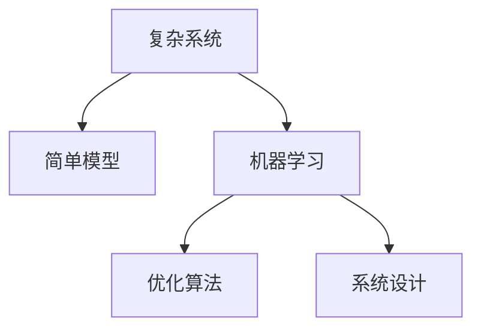

                 

# 理解洞察力的艺术：在复杂中寻找简单

> 关键词：洞察力,复杂系统,简单模型,机器学习,优化算法,系统设计

## 1. 背景介绍

### 1.1 问题由来
在当今信息爆炸的时代，面对日益复杂的系统，我们常常感到无所适从。无论是金融市场的波动、智能交通的调度和优化，还是医疗诊断的判断和治疗方案的制定，各种领域中涌现的问题和挑战愈发显得错综复杂。如何在混乱中找到秩序，在复杂中寻找简单，成为了科技工作者必须解决的难题。

### 1.2 问题核心关键点
洞察力，作为一种重要的认知能力，不仅在人类社会中被高度推崇，在机器学习和人工智能领域中同样有着举足轻重的地位。它的核心在于通过精炼的模型、高效的算法和科学的方法，从繁复的数据和现象中提炼出有价值的洞见。简而言之，洞察力是将复杂转化为简单，将模糊变为清晰的艺术。

## 2. 核心概念与联系

### 2.1 核心概念概述

为了深入理解洞察力的艺术，我们将讨论以下几个关键概念：

- **复杂系统**：指由众多相互作用的元素组成的系统，系统内部的动态变化和交互复杂，难以用传统的线性分析方法描述和解释。
- **简单模型**：在复杂系统中，通过高度抽象和简化的方式构建的模型，能够有效捕捉系统的关键特性和行为。
- **机器学习**：一种人工智能的分支，通过数据驱动的方式构建模型，从而进行预测、分类、聚类等任务，能够从大量数据中自动学习规律。
- **优化算法**：机器学习中用于最小化损失函数或最大化目标函数的方法，通过迭代调整模型参数以提高性能。
- **系统设计**：综合考虑复杂系统内部组件之间的相互作用、数据流和控制流，构建出高效、稳定、可扩展的解决方案。

这些概念之间的逻辑关系可以通过以下Mermaid流程图来展示：



这个流程图展示了从复杂系统到简单模型的转换过程，以及机器学习、优化算法在系统设计中的应用。通过这些方法，我们可以在复杂系统中寻找并提炼出有价值的洞察力。

## 3. 核心算法原理 & 具体操作步骤

### 3.1 算法原理概述

在复杂系统中寻找简单，通常涉及以下几个步骤：

1. **模型简化**：将复杂的系统抽象成简单的数学模型，移除不重要的细节，只保留关键特性。
2. **数据驱动**：利用机器学习算法对大量数据进行分析，找到其中的规律和模式。
3. **优化调整**：使用优化算法，调整模型参数以最小化误差，提升模型的预测准确性。
4. **系统设计**：结合优化后的模型，设计出高效、稳定的系统，以应对现实中的各种变化。

### 3.2 算法步骤详解

以下是基于机器学习和优化算法，在复杂系统中寻找简单模型的一般步骤：

**Step 1: 数据收集与预处理**
- 收集系统相关的数据，包括时间序列、图像、文本等。
- 对数据进行清洗和预处理，如去除噪声、归一化等。

**Step 2: 特征工程**
- 设计特征提取器，从原始数据中提取有意义的特征。
- 使用降维技术，如PCA、LDA等，减少特征空间的维度。

**Step 3: 模型选择与训练**
- 根据数据的特点选择合适的机器学习模型，如线性回归、决策树、神经网络等。
- 使用优化算法，如梯度下降、Adam、随机梯度下降等，对模型进行训练，最小化损失函数。

**Step 4: 模型验证与评估**
- 在验证集上评估模型的性能，如使用均方误差、准确率等指标。
- 进行交叉验证，确保模型的泛化能力。

**Step 5: 系统设计**
- 设计系统架构，将优化后的模型集成到实际应用中。
- 实现数据流和控制流的优化，确保系统的稳定性和可扩展性。

### 3.3 算法优缺点

基于机器学习和优化算法的复杂系统分析方法，具有以下优点：
1. 数据驱动：能够充分利用大量的数据，从中发现隐藏的规律和模式。
2. 自动化：利用优化算法，自动化地调整模型参数，提高分析效率。
3. 泛化能力：通过机器学习模型，能够在未见过的数据上做出准确的预测。

同时，该方法也存在一定的局限性：
1. 对数据质量要求高：数据中的噪声和异常值可能影响模型的性能。
2. 模型可解释性差：机器学习模型通常是"黑箱"系统，难以解释其决策过程。
3. 需要大量计算资源：复杂的优化算法和模型训练通常需要高性能的计算设备。

尽管如此，机器学习和优化算法在寻找洞察力的艺术中仍然扮演着重要角色，特别是在大数据和复杂系统分析中表现突出。

### 3.4 算法应用领域

基于机器学习和优化算法的复杂系统分析方法，在多个领域都有广泛应用：

- **金融领域**：用于风险评估、投资组合优化、股票预测等。
- **医疗领域**：用于疾病诊断、治疗方案优化、基因分析等。
- **交通领域**：用于交通流量预测、路径优化、智能交通系统等。
- **制造领域**：用于质量控制、生产优化、供应链管理等。
- **环境科学**：用于气候变化预测、资源分配、污染控制等。

## 4. 数学模型和公式 & 详细讲解 & 举例说明

### 4.1 数学模型构建

为了更好地理解洞察力的艺术，我们以线性回归模型为例，介绍其数学模型的构建过程。

假设我们有一组数据 $(x_i, y_i)$，其中 $x_i$ 是自变量，$y_i$ 是因变量。线性回归模型的目标是通过一条直线 $y = wx + b$ 来拟合数据，其中 $w$ 和 $b$ 是模型的参数，我们需要通过数据找到最佳的 $w$ 和 $b$ 值。

### 4.2 公式推导过程

根据最小二乘法的原理，我们需要最小化残差平方和 $SSE = \sum_{i=1}^n (y_i - wx_i - b)^2$，通过对 $SSE$ 求导并令导数为0，可以找到最佳参数 $w$ 和 $b$。推导过程如下：

$$
\frac{\partial SSE}{\partial w} = \sum_{i=1}^n -2x_i(y_i - wx_i - b) = 0
$$

$$
\frac{\partial SSE}{\partial b} = \sum_{i=1}^n -2(y_i - wx_i - b) = 0
$$

解以上方程组，可以得到：

$$
w = \frac{\sum_{i=1}^n x_iy_i}{\sum_{i=1}^n x_i^2}, b = \bar{y} - w\bar{x}
$$

其中，$\bar{x}$ 和 $\bar{y}$ 分别是 $x$ 和 $y$ 的均值。

### 4.3 案例分析与讲解

假设我们有一组股票价格数据，我们想要预测未来的价格。我们可以使用线性回归模型来拟合数据，得到预测公式。在这个例子中，我们将自变量 $x$ 设置为日期，因变量 $y$ 设置为股票价格，通过模型训练找到最佳的 $w$ 和 $b$ 值。

以下是一个Python代码示例，展示了如何使用Scikit-learn库进行线性回归模型训练：

```python
from sklearn.linear_model import LinearRegression
import numpy as np

# 生成样本数据
np.random.seed(0)
x = np.linspace(0, 10, 100)
y = 2 * x + np.random.normal(0, 0.5, 100)

# 训练模型
model = LinearRegression()
model.fit(x.reshape(-1, 1), y)

# 预测新数据
x_new = np.linspace(10, 20, 100)
y_pred = model.predict(x_new.reshape(-1, 1))

# 输出结果
print('系数 w:', model.coef_)
print('截距 b:', model.intercept_)
print('预测结果:', y_pred)
```

## 5. 项目实践：代码实例和详细解释说明

### 5.1 开发环境搭建

在进行项目实践前，我们需要准备好开发环境。以下是使用Python进行Scikit-learn开发的环境配置流程：

1. 安装Anaconda：从官网下载并安装Anaconda，用于创建独立的Python环境。

2. 创建并激活虚拟环境：
```bash
conda create -n sklearn-env python=3.8 
conda activate sklearn-env
```

3. 安装Scikit-learn：
```bash
pip install scikit-learn
```

4. 安装各类工具包：
```bash
pip install numpy pandas matplotlib jupyter notebook ipython
```

完成上述步骤后，即可在`sklearn-env`环境中开始项目实践。

### 5.2 源代码详细实现

下面我们以房价预测项目为例，给出使用Scikit-learn库进行线性回归模型训练的Python代码实现。

首先，定义数据处理函数：

```python
import numpy as np
from sklearn.model_selection import train_test_split
from sklearn.linear_model import LinearRegression
from sklearn.metrics import mean_squared_error

def load_data(file_path):
    data = np.loadtxt(file_path, delimiter=',', skiprows=1)
    X = data[:, :-1]
    y = data[:, -1]
    return X, y

def train_model(X_train, y_train, X_test, y_test):
    model = LinearRegression()
    model.fit(X_train, y_train)
    y_pred = model.predict(X_test)
    mse = mean_squared_error(y_test, y_pred)
    print('训练集均方误差:', mse)
    return model

def evaluate_model(model, X_test, y_test):
    y_pred = model.predict(X_test)
    mse = mean_squared_error(y_test, y_pred)
    print('测试集均方误差:', mse)
```

然后，加载数据并训练模型：

```python
# 加载数据
X, y = load_data('housing.csv')

# 分割数据集
X_train, X_test, y_train, y_test = train_test_split(X, y, test_size=0.2, random_state=0)

# 训练模型
model = train_model(X_train, y_train, X_test, y_test)
```

最后，评估模型：

```python
# 评估模型
evaluate_model(model, X_test, y_test)
```

以上就是使用Scikit-learn库进行线性回归模型训练的完整代码实现。可以看到，Scikit-learn库提供了便捷的接口和丰富的功能，大大简化了机器学习模型的开发过程。

### 5.3 代码解读与分析

让我们再详细解读一下关键代码的实现细节：

**load_data函数**：
- 定义了数据的加载和处理逻辑，使用numpy库读取CSV文件，并将数据分为特征和标签。

**train_model函数**：
- 定义了模型的训练过程，使用LinearRegression类初始化模型，通过fit方法拟合数据，输出训练集上的均方误差。

**evaluate_model函数**：
- 定义了模型的评估过程，使用predict方法对测试集进行预测，并计算测试集上的均方误差。

**训练流程**：
- 加载数据，并使用train_test_split方法将数据划分为训练集和测试集。
- 在训练集上训练模型，并输出训练集上的均方误差。
- 在测试集上评估模型，并输出测试集上的均方误差。

可以看到，Scikit-learn库使得机器学习模型的开发和评估变得非常简单。开发者可以将更多精力放在模型改进和特征工程上，而不必过多关注底层实现细节。

## 6. 实际应用场景

### 6.1 金融风险管理

在金融领域，基于机器学习和优化算法的洞察力分析方法，可以用于风险评估、信用评分、欺诈检测等。通过收集大量的金融数据，分析其中的规律和模式，可以预测未来的金融风险，从而制定更加稳健的金融策略。

例如，可以利用线性回归模型来预测股票的波动性，通过分析历史数据，找到影响波动性的关键因素，如公司业绩、市场情绪等。这可以帮助投资者更好地理解市场动态，制定合理的投资策略。

### 6.2 医疗诊断

在医疗领域，基于机器学习和优化算法的洞察力分析方法，可以用于疾病诊断、治疗方案优化、基因分析等。通过分析患者的病历数据、基因数据等，可以预测疾病的发生概率和治疗效果，从而提高诊断的准确性和治疗的个性化。

例如，可以使用决策树模型来预测患者的住院时间，通过分析历史病历数据，找到影响住院时间的关键因素，如病情严重程度、治疗方案等。这可以帮助医生制定更加合理的治疗方案，提升患者的治愈率和生活质量。

### 6.3 智能交通

在交通领域，基于机器学习和优化算法的洞察力分析方法，可以用于交通流量预测、路径优化、智能交通系统等。通过分析交通数据，可以预测未来的交通流量，优化交通路径，提升交通系统的效率和安全性。

例如，可以使用支持向量机(SVM)模型来预测交通流量，通过分析历史交通数据，找到影响交通流量的关键因素，如天气、节假日等。这可以帮助交通管理部门制定更加合理的交通调度策略，缓解交通拥堵，减少交通事故。

### 6.4 未来应用展望

随着机器学习和优化算法的不断发展，基于洞察力的艺术将在更多领域得到应用，为各行各业带来变革性影响。

在智慧城市治理中，基于洞察力的艺术可以用于城市事件监测、舆情分析、应急指挥等环节，提高城市管理的自动化和智能化水平，构建更安全、高效的未来城市。

在智能制造领域，基于洞察力的艺术可以用于质量控制、生产优化、供应链管理等环节，提升生产效率，降低生产成本。

在农业领域，基于洞察力的艺术可以用于农作物生长预测、病虫害监测、灌溉管理等环节，提升农业生产效率，保障粮食安全。

此外，在教育、零售、能源等多个领域，基于洞察力的艺术也将不断涌现，为各行各业带来新的机遇和挑战。

## 7. 工具和资源推荐

### 7.1 学习资源推荐

为了帮助开发者系统掌握基于洞察力的艺术，这里推荐一些优质的学习资源：

1. 《机器学习》系列书籍：由机器学习领域专家撰写，全面介绍了机器学习的基本概念、算法和应用。
2. 《深度学习》系列书籍：深入介绍了深度学习的原理和实践，包括卷积神经网络、循环神经网络、生成对抗网络等。
3. Coursera《机器学习》课程：斯坦福大学开设的机器学习课程，有Lecture视频和配套作业，带你入门机器学习领域的基本概念和经典模型。
4. Kaggle竞赛平台：全球最大的数据科学竞赛平台，可以参与各类数据挖掘、机器学习竞赛，提升实战能力。
5. PyTorch官方文档：PyTorch框架的官方文档，提供了丰富的示例和API文档，是学习PyTorch的好资源。

通过对这些资源的学习实践，相信你一定能够快速掌握基于洞察力的艺术，并用于解决实际的复杂系统问题。

### 7.2 开发工具推荐

高效的开发离不开优秀的工具支持。以下是几款用于基于洞察力分析的开发工具：

1. Jupyter Notebook：开源的交互式计算环境，支持Python、R等多种编程语言，非常适合数据探索和模型验证。
2. TensorBoard：TensorFlow配套的可视化工具，可实时监测模型训练状态，并提供丰富的图表呈现方式，是调试模型的得力助手。
3. Weights & Biases：模型训练的实验跟踪工具，可以记录和可视化模型训练过程中的各项指标，方便对比和调优。
4. Scikit-learn：Python机器学习库，提供丰富的机器学习算法和工具，适合快速迭代研究。
5. Keras：高层次的神经网络API，提供便捷的API接口，适合快速搭建和调试神经网络模型。

合理利用这些工具，可以显著提升基于洞察力分析的开发效率，加快创新迭代的步伐。

### 7.3 相关论文推荐

基于洞察力的艺术的研究源于学界的持续研究。以下是几篇奠基性的相关论文，推荐阅读：

1. "Linear Regression and Its Variants"（线性回归及其变种）：详细介绍了线性回归模型的原理和应用。
2. "Decision Trees and Random Forests"（决策树和随机森林）：介绍了决策树和随机森林等常用的分类算法。
3. "Support Vector Machines"（支持向量机）：介绍了支持向量机算法及其在模式识别和回归问题中的应用。
4. "Neural Networks and Deep Learning"（神经网络和深度学习）：由深度学习领域专家撰写，全面介绍了深度学习的原理和应用。
5. "Boosting: Foundations and Algorithms"（提升算法）：介绍了提升算法及其在分类和回归问题中的应用。

这些论文代表了大数据和复杂系统分析的研究脉络。通过学习这些前沿成果，可以帮助研究者把握学科前进方向，激发更多的创新灵感。

## 8. 总结：未来发展趋势与挑战

### 8.1 总结

本文对基于机器学习和优化算法的洞察力艺术进行了全面系统的介绍。首先阐述了洞察力在复杂系统分析中的重要性，明确了通过精炼的模型、高效的算法和科学的方法，从繁复的数据和现象中提炼出有价值的洞见的核心思想。其次，从原理到实践，详细讲解了机器学习和优化算法在复杂系统中寻找简单的详细步骤，给出了机器学习模型训练的完整代码实例。同时，本文还广泛探讨了基于洞察力的艺术在金融、医疗、交通等多个领域的应用前景，展示了洞察力分析方法的巨大潜力。此外，本文精选了洞察力分析技术的各类学习资源，力求为读者提供全方位的技术指引。

通过本文的系统梳理，可以看到，基于洞察力的艺术是机器学习和优化算法在复杂系统分析中的重要应用，能够将复杂转化为简单，将模糊变为清晰，极大地提升系统的分析和决策能力。未来，随着机器学习和优化算法的不断进步，洞察力分析方法将进一步拓展应用边界，为人类社会的复杂系统管理提供更加智能、高效的解决方案。

### 8.2 未来发展趋势

展望未来，基于洞察力的艺术将呈现以下几个发展趋势：

1. 自动化程度提升：随着机器学习和优化算法的不断发展，越来越多的复杂系统将实现自动化分析，无需人工干预。
2. 跨领域融合：基于洞察力的艺术将与其他技术（如知识图谱、逻辑规则等）进行更深入的融合，形成更加全面、准确的系统分析能力。
3. 多模态分析：未来的洞察力分析将不仅限于单一数据源，而是融合视觉、语音、文本等多模态数据，提升系统的感知和理解能力。
4. 实时分析：基于洞察力的艺术将更多应用于实时数据分析，提升系统的反应速度和决策效率。
5. 数据隐私保护：随着大数据分析的普及，数据隐私和安全问题日益凸显，基于洞察力的艺术将更加注重数据的保护和匿名化处理。

这些趋势凸显了基于洞察力的艺术的广阔前景。这些方向的探索发展，必将进一步提升洞察力分析技术的性能和应用范围，为人类社会的复杂系统管理提供更加智能、高效的解决方案。

### 8.3 面临的挑战

尽管基于洞察力的艺术已经取得了瞩目成就，但在迈向更加智能化、普适化应用的过程中，它仍面临着诸多挑战：

1. 数据质量问题：数据中的噪声、异常值和不完整性可能影响模型的性能，需要进行数据清洗和预处理。
2. 模型可解释性：机器学习模型通常是"黑箱"系统，难以解释其决策过程，需要进一步提升模型的可解释性。
3. 计算资源需求：复杂的优化算法和模型训练通常需要高性能的计算设备，如何降低计算成本是重要课题。
4. 模型泛化能力：模型在训练集上表现良好，但在未见过的数据上可能泛化能力不足，需要进行模型评估和验证。
5. 多领域适应性：洞察力分析方法在不同领域的应用可能需要重新调整和优化，需要更多针对特定领域的算法和模型。

尽管如此，基于洞察力的艺术仍然在不断发展和完善中，未来将有更多创新方法和技术涌现，推动其向更高的层次发展。

### 8.4 研究展望

面向未来，基于洞察力的艺术的研究方向和创新点主要集中在以下几个方面：

1. 自动化数据分析：进一步提升自动化的程度，降低对人工干预的依赖，实现系统的完全自主分析。
2. 多领域融合：将洞察力分析方法与其他技术进行融合，提升系统的综合分析和决策能力。
3. 实时数据处理：提升系统的实时分析能力，实现对实时数据的高效处理和决策。
4. 模型可解释性：提升模型的可解释性，使系统的决策过程更加透明和可信。
5. 数据隐私保护：加强数据隐私保护，提升系统的安全性和可信度。

这些研究方向将推动基于洞察力的艺术向更加智能、普适化的方向发展，为复杂系统分析提供更加高效、可靠的解决方案。总之，在不断挑战和探索中，基于洞察力的艺术将继续引领复杂系统分析的潮流，为人类社会的智能管理提供更加强大的技术支撑。

## 9. 附录：常见问题与解答

**Q1：复杂系统分析和简化模型之间是什么关系？**

A: 复杂系统分析和简化模型之间是一种辩证关系。复杂系统分析旨在从纷繁复杂的系统中提炼出有价值的洞见，简化模型则是实现这一目标的手段。通过构建简单模型，我们可以捕捉复杂系统中的关键特性和行为，从而更好地理解系统的本质和规律。

**Q2：如何选择合适的优化算法？**

A: 选择合适的优化算法需要考虑以下几个因素：
1. 模型类型：不同类型的模型可能需要不同的优化算法，如线性模型适合梯度下降，非线性模型适合随机梯度下降。
2. 数据规模：数据规模较大时，随机梯度下降等基于小批量的优化算法可能更快收敛。
3. 模型复杂度：模型复杂度高时，需要选择更加高效的优化算法，如Adam、Adagrad等。

**Q3：如何评估模型性能？**

A: 评估模型性能的方法有多种，具体选择哪种指标取决于应用场景：
1. 均方误差（MSE）：适用于回归问题，衡量预测值与真实值之间的差距。
2. 准确率（Accuracy）：适用于分类问题，衡量模型正确分类的比例。
3. 精确率（Precision）和召回率（Recall）：适用于分类问题，衡量模型在不同类别上的表现。
4. ROC曲线和AUC值：适用于分类问题，衡量模型的分类能力。

**Q4：如何提高模型的泛化能力？**

A: 提高模型泛化能力的方法包括：
1. 增加数据量：使用更多的数据进行训练，增加模型的泛化能力。
2. 数据增强：通过数据增强技术，扩充训练集，提升模型的泛化能力。
3. 正则化：使用L2正则、Dropout等正则化技术，防止模型过拟合。
4. 模型集成：使用多个模型进行集成，提升模型的泛化能力。

这些方法可以通过不同的组合，提升模型的泛化能力，使其在实际应用中表现更加稳定和可靠。

---

作者：禅与计算机程序设计艺术 / Zen and the Art of Computer Programming

