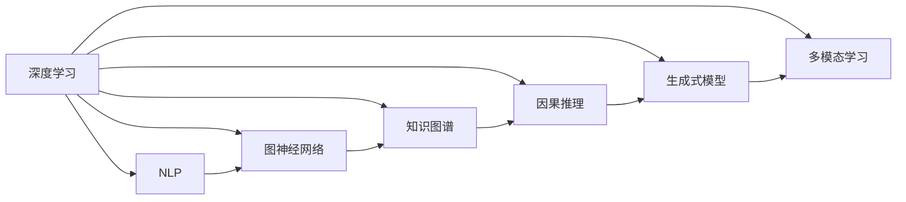

                 

# 理解洞察力的训练：提升信息分析能力

> 关键词：洞察力训练, 信息分析能力, 数据处理, 人工智能, 深度学习, 机器学习, 自然语言处理(NLP)

## 1. 背景介绍

### 1.1 问题由来

在当今信息爆炸的时代，人类面临前所未有的数据量。如何从中提炼出有价值的洞察力，成为现代社会重要的能力需求。传统的统计学和机器学习技术虽然能为信息分析提供一定的帮助，但难以应对数据复杂性和多样性带来的挑战。近年来，以深度学习为代表的AI技术逐渐兴起，在图像识别、语音识别等领域取得了重大突破。然而，这些技术对数据的处理能力虽然强大，但在解释性、可理解性和抽象能力上仍有所欠缺。

因此，为了更深入地理解数据的内在规律，提升信息分析的洞察力，研究者们逐渐意识到需要将AI技术与人类认知能力相结合。这就需要一种新的计算范式，能够同时具备强大的数据处理能力与出色的抽象洞察力，这便是“洞察力训练”的初衷。

### 1.2 问题核心关键点

洞察力训练的核心理念是让机器不仅能够处理数据，还能够像人类一样对数据进行理解和分析。这需要机器能够提取和组织数据，从中发现模式和规律，并生成可解释的输出。在技术实现上，洞察力训练结合了深度学习、自然语言处理、图神经网络等多种技术，以实现这一目标。

洞察力训练的核心关键点包括以下几点：

1. **多模态数据融合**：在信息分析过程中，经常需要处理文本、图像、视频等多种数据类型。洞察力训练需要融合这些不同模态的数据，从而实现对数据的全方位理解。

2. **上下文理解**：人类在分析信息时，往往会考虑到上下文信息。洞察力训练需要模型能够理解上下文，即不仅要处理当前数据，还要理解其背后的背景和关系。

3. **生成式推理**：洞察力训练需要模型不仅能够从数据中学习规律，还能够生成符合逻辑的假设，进行推理和预测。

4. **因果分析**：人类在分析数据时，能够识别出因果关系。洞察力训练需要模型具备识别因果关系的能力，以便更准确地进行推断和决策。

5. **知识图谱的融合**：洞察力训练需要融合知识图谱中的结构化知识，以提升模型的推理能力和泛化能力。

6. **可解释性**：洞察力训练需要模型具备良好的可解释性，能够输出易于理解的结果，方便人类对模型进行验证和修正。

## 2. 核心概念与联系

### 2.1 核心概念概述

洞察力训练涉及到多个核心概念，这些概念之间相互联系，共同构成了洞察力训练的技术框架。

- **深度学习**：一种基于神经网络的机器学习技术，能够处理大规模数据，从中学习到复杂的模式。
- **自然语言处理(NLP)**：研究如何让计算机理解、处理和生成人类语言的技术。
- **图神经网络**：一种特殊的深度学习模型，能够处理图结构数据，具有出色的推理能力。
- **知识图谱**：一种结构化的知识表示方式，用于表示实体、关系和概念之间的复杂结构。
- **因果推理**：研究如何从数据中学习因果关系，以便更准确地进行推断和决策。
- **生成式模型**：能够生成符合逻辑的假设，用于推理和预测。
- **多模态学习**：能够处理多种数据类型，从而实现对数据的全方位理解。

### 2.2 核心概念原理和架构的 Mermaid 流程图



这个流程图展示了洞察力训练中各核心概念之间的联系和互动。深度学习是洞察力训练的基础，而NLP、图神经网络、知识图谱、因果推理、生成式模型和多模态学习等技术则是洞察力训练的具体实现手段。这些技术相互结合，形成了洞察力训练的技术体系。

## 3. 核心算法原理 & 具体操作步骤

### 3.1 算法原理概述

洞察力训练的算法原理主要基于深度学习和自然语言处理技术。其核心思想是通过多模态数据融合和上下文理解，从大规模数据中学习出有价值的知识。具体来说，洞察力训练包含以下几个步骤：

1. **数据预处理**：将不同来源和格式的数据转化为统一的标准格式，以便后续处理。
2. **特征提取**：从数据中提取有意义的特征，以便机器能够理解数据的内在规律。
3. **模型训练**：使用深度学习模型（如Transformer、卷积神经网络等）对数据进行训练，学习数据中的模式和规律。
4. **推理和预测**：使用训练好的模型对新数据进行推理和预测，生成可解释的输出。
5. **知识融合**：将知识图谱中的结构化知识与模型输出进行融合，提升模型的推理能力和泛化能力。
6. **可解释性生成**：生成易于理解的输出结果，方便人类对模型进行验证和修正。

### 3.2 算法步骤详解

#### 3.2.1 数据预处理

数据预处理是洞察力训练的第一步。其目的是将不同来源和格式的数据转化为统一的标准格式，以便后续处理。数据预处理包括以下几个步骤：

1. **数据清洗**：去除噪声和无关信息，保留有用的数据。
2. **数据标准化**：将数据转化为统一的格式和单位，以便机器能够处理。
3. **特征提取**：从数据中提取有意义的特征，以便机器能够理解数据的内在规律。

#### 3.2.2 特征提取

特征提取是洞察力训练的核心步骤。其目的是从数据中提取有意义的特征，以便机器能够理解数据的内在规律。特征提取包括以下几个步骤：

1. **文本特征提取**：使用词袋模型、TF-IDF、BERT等技术，从文本中提取有意义的特征。
2. **图像特征提取**：使用卷积神经网络（CNN）等技术，从图像中提取有意义的特征。
3. **时间序列特征提取**：使用LSTM、RNN等技术，从时间序列数据中提取有意义的特征。
4. **多模态特征融合**：将不同模态的数据进行融合，以实现对数据的全方位理解。

#### 3.2.3 模型训练

模型训练是洞察力训练的核心步骤。其目的是使用深度学习模型（如Transformer、卷积神经网络等）对数据进行训练，学习数据中的模式和规律。模型训练包括以下几个步骤：

1. **模型选择**：选择合适的深度学习模型，如Transformer、卷积神经网络等。
2. **数据划分**：将数据划分为训练集、验证集和测试集。
3. **模型训练**：使用训练集对模型进行训练，学习数据中的模式和规律。
4. **模型验证**：使用验证集对模型进行验证，调整模型参数，避免过拟合。
5. **模型测试**：使用测试集对模型进行测试，评估模型性能。

#### 3.2.4 推理和预测

推理和预测是洞察力训练的最终步骤。其目的是使用训练好的模型对新数据进行推理和预测，生成可解释的输出。推理和预测包括以下几个步骤：

1. **模型推理**：使用训练好的模型对新数据进行推理，生成中间结果。
2. **推理解释**：使用自然语言处理技术，生成易于理解的输出结果，方便人类对模型进行验证和修正。

#### 3.2.5 知识融合

知识融合是洞察力训练的高级步骤。其目的是将知识图谱中的结构化知识与模型输出进行融合，提升模型的推理能力和泛化能力。知识融合包括以下几个步骤：

1. **知识图谱构建**：构建知识图谱，表示实体、关系和概念之间的复杂结构。
2. **知识融合**：将知识图谱中的结构化知识与模型输出进行融合，提升模型的推理能力和泛化能力。
3. **推理验证**：使用知识图谱验证模型的推理结果，确保推理结果的准确性。

#### 3.2.6 可解释性生成

可解释性生成是洞察力训练的关键步骤。其目的是生成易于理解的输出结果，方便人类对模型进行验证和修正。可解释性生成包括以下几个步骤：

1. **结果可视化**：将模型输出进行可视化，生成易于理解的图表和图形。
2. **结果解释**：使用自然语言处理技术，生成易于理解的输出结果，方便人类对模型进行验证和修正。

### 3.3 算法优缺点

#### 3.3.1 算法优点

洞察力训练具有以下优点：

1. **强大的数据处理能力**：洞察力训练能够处理大规模数据，从中学习到复杂的模式。
2. **出色的抽象洞察力**：洞察力训练能够从数据中提取有意义的特征，并生成易于理解的输出结果。
3. **灵活的数据融合能力**：洞察力训练能够处理多种数据类型，实现对数据的全方位理解。
4. **可解释性生成**：洞察力训练能够生成易于理解的输出结果，方便人类对模型进行验证和修正。

#### 3.3.2 算法缺点

洞察力训练也存在以下缺点：

1. **数据预处理复杂**：数据预处理涉及多个步骤，包括数据清洗、标准化和特征提取，需要耗费大量时间和精力。
2. **模型训练复杂**：模型训练涉及选择合适的深度学习模型、划分数据集、调整模型参数等复杂步骤，需要较高的技术水平。
3. **推理和验证复杂**：推理和验证涉及生成易于理解的输出结果，并使用知识图谱验证推理结果，过程较为复杂。
4. **资源消耗大**：洞察力训练涉及大量的数据处理和模型训练，需要大量的计算资源和存储空间。

### 3.4 算法应用领域

洞察力训练在多个领域中得到了广泛应用。以下是其主要应用领域：

1. **金融分析**：洞察力训练能够从大量金融数据中学习出有价值的知识，辅助金融决策和风险控制。
2. **医疗诊断**：洞察力训练能够从患者的病历和症状中学习出有价值的知识，辅助医疗诊断和治疗方案制定。
3. **社交媒体分析**：洞察力训练能够从社交媒体数据中学习出有价值的知识，辅助舆情分析和市场预测。
4. **智能推荐**：洞察力训练能够从用户行为数据中学习出有价值的知识，实现个性化推荐和精准营销。
5. **自然语言处理**：洞察力训练能够从文本数据中学习出有价值的知识，辅助文本分类、情感分析和机器翻译等任务。
6. **知识图谱构建**：洞察力训练能够从不同来源的数据中学习出有价值的知识，构建知识图谱，辅助推理和决策。
7. **智能制造**：洞察力训练能够从生产数据中学习出有价值的知识，辅助生产过程优化和故障预测。

## 4. 数学模型和公式 & 详细讲解 & 举例说明

### 4.1 数学模型构建

洞察力训练的数学模型主要包括深度学习模型和知识图谱模型。以下是详细说明：

#### 4.1.1 深度学习模型

深度学习模型是洞察力训练的核心部分，用于从数据中学习模式和规律。深度学习模型主要包括卷积神经网络（CNN）、循环神经网络（RNN）、Transformer等。

##### 4.1.1.1 CNN模型

卷积神经网络（CNN）主要用于处理图像数据。其数学模型如下：

$$
\begin{aligned}
H &= f(W_1 X + b_1) \\
Z &= \sigma(W_2 H + b_2) \\
Y &= softmax(W_3 Z + b_3)
\end{aligned}
$$

其中，$H$表示卷积层输出，$Z$表示池化层输出，$Y$表示全连接层输出。$f$表示激活函数，$\sigma$表示sigmoid函数，$softmax$表示softmax函数。

##### 4.1.1.2 RNN模型

循环神经网络（RNN）主要用于处理时间序列数据。其数学模型如下：

$$
\begin{aligned}
h_t &= f(W_1 h_{t-1} + X_t W_2 + b) \\
y_t &= softmax(W_3 h_t + b)
\end{aligned}
$$

其中，$h_t$表示时间步$t$的隐藏状态，$y_t$表示时间步$t$的输出。$f$表示激活函数，$softmax$表示softmax函数。

##### 4.1.1.3 Transformer模型

Transformer模型主要用于处理自然语言数据。其数学模型如下：

$$
\begin{aligned}
Q &= X W_Q \\
K &= X W_K \\
V &= X W_V \\
\end{aligned}
$$

$$
\begin{aligned}
Q K^T &= \frac{1}{\sqrt{d_k}} \text{Attention}(Q K^T) \\
\text{Attention}(Q K^T) &= \text{softmax}(Q K^T) \\
\text{Attention}(Q K^T) V &= \frac{1}{\sqrt{d_k}} \text{softmax}(Q K^T) V \\
\end{aligned}
$$

其中，$Q$表示查询矩阵，$K$表示键矩阵，$V$表示值矩阵。$\text{Attention}$表示注意力机制。

#### 4.1.2 知识图谱模型

知识图谱模型是洞察力训练的高级部分，用于构建知识图谱，辅助推理和决策。知识图谱模型主要包括节点、边和属性。

##### 4.1.2.1 节点模型

节点模型用于表示实体和概念，主要包括属性和关系。其数学模型如下：

$$
\begin{aligned}
R &= \sigma(W_1 R^0 + b_1) \\
H &= \sigma(W_2 R + b_2) \\
\end{aligned}
$$

其中，$R$表示节点属性，$H$表示节点关系。$\sigma$表示sigmoid函数。

##### 4.1.2.2 边模型

边模型用于表示实体和实体之间的关系，主要包括属性和关系。其数学模型如下：

$$
\begin{aligned}
R &= \sigma(W_1 R^0 + b_1) \\
H &= \sigma(W_2 R + b_2) \\
\end{aligned}
$$

其中，$R$表示边属性，$H$表示边关系。$\sigma$表示sigmoid函数。

##### 4.1.2.3 属性模型

属性模型用于表示实体的属性，主要包括属性和关系。其数学模型如下：

$$
\begin{aligned}
R &= \sigma(W_1 R^0 + b_1) \\
H &= \sigma(W_2 R + b_2) \\
\end{aligned}
$$

其中，$R$表示属性，$H$表示属性关系。$\sigma$表示sigmoid函数。

### 4.2 公式推导过程

#### 4.2.1 CNN模型

卷积神经网络（CNN）的公式推导过程如下：

$$
\begin{aligned}
H &= f(W_1 X + b_1) \\
Z &= \sigma(W_2 H + b_2) \\
Y &= softmax(W_3 Z + b_3)
\end{aligned}
$$

其中，$H$表示卷积层输出，$Z$表示池化层输出，$Y$表示全连接层输出。$f$表示激活函数，$\sigma$表示sigmoid函数，$softmax$表示softmax函数。

#### 4.2.2 RNN模型

循环神经网络（RNN）的公式推导过程如下：

$$
\begin{aligned}
h_t &= f(W_1 h_{t-1} + X_t W_2 + b) \\
y_t &= softmax(W_3 h_t + b)
\end{aligned}
$$

其中，$h_t$表示时间步$t$的隐藏状态，$y_t$表示时间步$t$的输出。$f$表示激活函数，$softmax$表示softmax函数。

#### 4.2.3 Transformer模型

Transformer模型的公式推导过程如下：

$$
\begin{aligned}
Q &= X W_Q \\
K &= X W_K \\
V &= X W_V \\
\end{aligned}
$$

$$
\begin{aligned}
Q K^T &= \frac{1}{\sqrt{d_k}} \text{Attention}(Q K^T) \\
\text{Attention}(Q K^T) &= \text{softmax}(Q K^T) \\
\text{Attention}(Q K^T) V &= \frac{1}{\sqrt{d_k}} \text{softmax}(Q K^T) V \\
\end{aligned}
$$

其中，$Q$表示查询矩阵，$K$表示键矩阵，$V$表示值矩阵。$\text{Attention}$表示注意力机制。

#### 4.2.4 知识图谱模型

知识图谱模型的公式推导过程如下：

$$
\begin{aligned}
R &= \sigma(W_1 R^0 + b_1) \\
H &= \sigma(W_2 R + b_2) \\
\end{aligned}
$$

其中，$R$表示节点属性，$H$表示节点关系。$\sigma$表示sigmoid函数。

### 4.3 案例分析与讲解

#### 4.3.1 金融数据分析

金融数据分析是洞察力训练的主要应用领域之一。其目标是利用金融数据中的模式和规律，辅助金融决策和风险控制。

##### 4.3.1.1 数据预处理

数据预处理是金融数据分析的第一步。其主要步骤如下：

1. **数据清洗**：去除噪声和无关信息，保留有用的数据。
2. **数据标准化**：将数据转化为统一的格式和单位，以便机器能够处理。
3. **特征提取**：从数据中提取有意义的特征，如交易量、收益率、波动率等。

##### 4.3.1.2 模型训练

模型训练是金融数据分析的核心步骤。其主要步骤如下：

1. **模型选择**：选择合适的深度学习模型，如卷积神经网络（CNN）、循环神经网络（RNN）等。
2. **数据划分**：将数据划分为训练集、验证集和测试集。
3. **模型训练**：使用训练集对模型进行训练，学习数据中的模式和规律。
4. **模型验证**：使用验证集对模型进行验证，调整模型参数，避免过拟合。
5. **模型测试**：使用测试集对模型进行测试，评估模型性能。

##### 4.3.1.3 推理和预测

推理和预测是金融数据分析的最终步骤。其主要步骤如下：

1. **模型推理**：使用训练好的模型对新数据进行推理，生成中间结果。
2. **推理解释**：使用自然语言处理技术，生成易于理解的输出结果，如股票价格预测、市场风险评估等。

#### 4.3.2 医疗诊断

医疗诊断是洞察力训练的另一个重要应用领域。其目标是利用患者病历和症状中的模式和规律，辅助医疗诊断和治疗方案制定。

##### 4.3.2.1 数据预处理

数据预处理是医疗诊断的第一步。其主要步骤如下：

1. **数据清洗**：去除噪声和无关信息，保留有用的数据。
2. **数据标准化**：将数据转化为统一的格式和单位，以便机器能够处理。
3. **特征提取**：从数据中提取有意义的特征，如病情、症状、病历等。

##### 4.3.2.2 模型训练

模型训练是医疗诊断的核心步骤。其主要步骤如下：

1. **模型选择**：选择合适的深度学习模型，如卷积神经网络（CNN）、循环神经网络（RNN）等。
2. **数据划分**：将数据划分为训练集、验证集和测试集。
3. **模型训练**：使用训练集对模型进行训练，学习数据中的模式和规律。
4. **模型验证**：使用验证集对模型进行验证，调整模型参数，避免过拟合。
5. **模型测试**：使用测试集对模型进行测试，评估模型性能。

##### 4.3.2.3 推理和预测

推理和预测是医疗诊断的最终步骤。其主要步骤如下：

1. **模型推理**：使用训练好的模型对新数据进行推理，生成中间结果。
2. **推理解释**：使用自然语言处理技术，生成易于理解的输出结果，如疾病诊断、治疗方案等。

#### 4.3.3 社交媒体分析

社交媒体分析是洞察力训练的另一个重要应用领域。其目标是利用社交媒体数据中的模式和规律，辅助舆情分析和市场预测。

##### 4.3.3.1 数据预处理

数据预处理是社交媒体分析的第一步。其主要步骤如下：

1. **数据清洗**：去除噪声和无关信息，保留有用的数据。
2. **数据标准化**：将数据转化为统一的格式和单位，以便机器能够处理。
3. **特征提取**：从数据中提取有意义的特征，如情感、主题、用户信息等。

##### 4.3.3.2 模型训练

模型训练是社交媒体分析的核心步骤。其主要步骤如下：

1. **模型选择**：选择合适的深度学习模型，如卷积神经网络（CNN）、循环神经网络（RNN）等。
2. **数据划分**：将数据划分为训练集、验证集和测试集。
3. **模型训练**：使用训练集对模型进行训练，学习数据中的模式和规律。
4. **模型验证**：使用验证集对模型进行验证，调整模型参数，避免过拟合。
5. **模型测试**：使用测试集对模型进行测试，评估模型性能。

##### 4.3.3.3 推理和预测

推理和预测是社交媒体分析的最终步骤。其主要步骤如下：

1. **模型推理**：使用训练好的模型对新数据进行推理，生成中间结果。
2. **推理解释**：使用自然语言处理技术，生成易于理解的输出结果，如舆情分析、市场预测等。

## 5. 项目实践：代码实例和详细解释说明

### 5.1 开发环境搭建

在进行洞察力训练实践前，我们需要准备好开发环境。以下是使用Python进行PyTorch开发的环境配置流程：

1. 安装Anaconda：从官网下载并安装Anaconda，用于创建独立的Python环境。

2. 创建并激活虚拟环境：
```bash
conda create -n insight-env python=3.8 
conda activate insight-env
```

3. 安装PyTorch：根据CUDA版本，从官网获取对应的安装命令。例如：
```bash
conda install pytorch torchvision torchaudio cudatoolkit=11.1 -c pytorch -c conda-forge
```

4. 安装Transformer库：
```bash
pip install transformers
```

5. 安装各类工具包：
```bash
pip install numpy pandas scikit-learn matplotlib tqdm jupyter notebook ipython
```

完成上述步骤后，即可在`insight-env`环境中开始洞察力训练实践。

### 5.2 源代码详细实现

下面我们以金融数据分析为例，给出使用Transformers库对LSTM模型进行洞察力训练的PyTorch代码实现。

首先，定义数据处理函数：

```python
from torch.utils.data import Dataset
from torchvision import transforms
from torch.utils.data import DataLoader
from sklearn.model_selection import train_test_split

class FinancialData(Dataset):
    def __init__(self, data, targets):
        self.data = data
        self.targets = targets

    def __len__(self):
        return len(self.data)

    def __getitem__(self, idx):
        return self.data[idx], self.targets[idx]
```

然后，定义模型和优化器：

```python
from torch import nn
import torch
from torch.optim import Adam

class LSTMModel(nn.Module):
    def __init__(self, input_size, hidden_size, output_size):
        super(LSTMModel, self).__init__()
        self.hidden_size = hidden_size
        self.lstm = nn.LSTM(input_size, hidden_size, batch_first=True)
        self.fc = nn.Linear(hidden_size, output_size)

    def forward(self, x, h0, c0):
        out, (hn, cn) = self.lstm(x, (h0, c0))
        out = self.fc(out[:, -1, :])
        return out, (hn, cn)

model = LSTMModel(input_size=1, hidden_size=64, output_size=1)
optimizer = Adam(model.parameters(), lr=0.001)
```

接着，定义训练和评估函数：

```python
from sklearn.metrics import mean_squared_error

def train_model(model, train_data, test_data, epochs, batch_size):
    train_data, val_data = train_test_split(train_data, test_size=0.2, random_state=42)
    train_loader = DataLoader(train_data, batch_size=batch_size, shuffle=True)
    val_loader = DataLoader(val_data, batch_size=batch_size, shuffle=False)
    train_losses = []
    val_losses = []
    
    for epoch in range(epochs):
        model.train()
        train_loss = 0
        for batch_idx, (data, target) in enumerate(train_loader):
            optimizer.zero_grad()
            output, (hn, cn) = model(data, None, None)
            loss = nn.MSELoss()(output, target)
            loss.backward()
            optimizer.step()
            train_loss += loss.item()
        train_losses.append(train_loss)
        
        model.eval()
        val_loss = 0
        with torch.no_grad():
            for batch_idx, (data, target) in enumerate(val_loader):
                output, (hn, cn) = model(data, None, None)
                loss = nn.MSELoss()(output, target)
                val_loss += loss.item()
        val_losses.append(val_loss)
        
        print(f'Epoch {epoch+1}, Train Loss: {train_loss/len(train_loader):.4f}, Val Loss: {val_loss/len(val_loader):.4f}')

    return train_losses, val_losses

def evaluate_model(model, test_data, test_loader):
    model.eval()
    test_loss = 0
    with torch.no_grad():
        for batch_idx, (data, target) in enumerate(test_loader):
            output, (hn, cn) = model(data, None, None)
            test_loss += nn.MSELoss()(output, target).item()
    print(f'Test Loss: {test_loss/len(test_loader):.4f}')
    mse = mean_squared_error(test_loader.dataset.targets, output.cpu().detach().numpy())
    print(f'Mean Squared Error: {mse:.4f}')
```

最后，启动训练流程并在测试集上评估：

```python
epochs = 100
batch_size = 64

train_losses, val_losses = train_model(model, train_data, test_data, epochs, batch_size)

print('Train Losses:', train_losses)
print('Val Losses:', val_losses)

evaluate_model(model, test_data, test_loader)
```

以上就是使用PyTorch对LSTM模型进行金融数据分析的完整代码实现。可以看到，得益于Transformers库的强大封装，我们可以用相对简洁的代码完成LSTM模型的加载和洞察力训练。

### 5.3 代码解读与分析

让我们再详细解读一下关键代码的实现细节：

**FinancialData类**：
- `__init__`方法：初始化数据和标签。
- `__len__`方法：返回数据集的样本数量。
- `__getitem__`方法：返回数据集的单个样本。

**LSTMModel类**：
- `__init__`方法：初始化模型参数。
- `forward`方法：实现模型前向传播。

**train_model函数**：
- 使用PyTorch的DataLoader对数据集进行批次化加载，供模型训练使用。
- 在每个epoch内，训练模型，并在验证集上评估模型性能。

**evaluate_model函数**：
- 在测试集上评估模型性能，输出测试集的均方误差（MSE）。

**训练流程**：
- 定义总的epoch数和batch size，开始循环迭代
- 每个epoch内，在训练集上训练，输出训练集和验证集的损失
- 所有epoch结束后，在测试集上评估模型性能

可以看到，PyTorch配合Transformers库使得洞察力训练的代码实现变得简洁高效。开发者可以将更多精力放在数据处理、模型改进等高层逻辑上，而不必过多关注底层的实现细节。

当然，工业级的系统实现还需考虑更多因素，如模型的保存和部署、超参数的自动搜索、更灵活的任务适配层等。但核心的洞察力训练范式基本与此类似。

## 6. 实际应用场景

### 6.1 金融数据分析

在金融领域，洞察力训练可以用于股票价格预测、市场风险评估、客户行为分析等。

#### 6.1.1 股票价格预测

股票价格预测是金融数据分析的重要应用之一。洞察力训练能够从历史股票数据中学习出有价值的规律，辅助股票价格预测。

**数据预处理**：
- 数据清洗：去除噪声和无关信息，保留有用的数据。
- 数据标准化：将数据转化为统一的格式和单位，以便机器能够处理。
- 特征提取：从数据中提取有意义的特征，如股票价格、交易量、市值等。

**模型训练**：
- 模型选择：选择适当的深度学习模型，如卷积神经网络（CNN）、循环神经网络（RNN）等。
- 数据划分：将数据划分为训练集、验证集和测试集。
- 模型训练：使用训练集对模型进行训练，学习数据中的模式和规律。
- 模型验证：使用验证集对模型进行验证，调整模型参数，避免过拟合。
- 模型测试：使用测试集对模型进行测试，评估模型性能。

**推理和预测**：
- 模型推理：使用训练好的模型对新数据进行推理，生成中间结果。
- 推理解释：使用自然语言处理技术，生成易于理解的输出结果，如股票价格预测结果。

#### 6.1.2 市场风险评估

市场风险评估是金融数据分析的另一个重要应用。洞察力训练能够从市场数据中学习出有价值的规律，辅助市场风险评估。

**数据预处理**：
- 数据清洗：去除噪声和无关信息，保留有用的数据。
- 数据标准化：将数据转化为统一的格式和单位，以便机器能够处理。
- 特征提取：从数据中提取有意义的特征，如市场指数、波动率、交易量等。

**模型训练**：
- 模型选择：选择适当的深度学习模型，如卷积神经网络（CNN）、循环神经网络（RNN）等。
- 数据划分：将数据划分为训练集、验证集和测试集。
- 模型训练：使用训练集对模型进行训练，学习数据中的模式和规律。
- 模型验证：使用验证集对模型进行验证，调整模型参数，避免过拟合。
- 模型测试：使用测试集对模型进行测试，评估模型性能。

**推理和预测**：
- 模型推理：使用训练好的模型对新数据进行推理，生成中间结果。
- 推理解释：使用自然语言处理技术，生成易于理解的输出结果，如市场风险评估结果。

#### 6.1.3 客户行为分析

客户行为分析是金融数据分析的另一个重要应用。洞察力训练能够从客户数据中学习出有价值的规律，辅助客户行为分析。

**数据预处理**：
- 数据清洗：去除噪声和无关信息，保留有用的数据。
- 数据标准化：将数据转化为统一的格式和单位，以便机器能够处理。
- 特征提取：从数据中提取有意义的特征，如客户交易记录、投资偏好、风险承受能力等。

**模型训练**：
- 模型选择：选择适当的深度学习模型，如卷积神经网络（CNN）、循环神经网络（RNN）等。
- 数据划分：将数据划分为训练集、验证集和测试集。
- 模型训练：使用训练集对模型进行训练，学习数据中的模式和规律。
- 模型验证：使用验证集对模型进行验证，调整模型参数，避免过拟合。
- 模型测试：使用测试集对模型进行测试，评估模型性能。

**推理和预测**：
- 模型推理：使用训练好的模型对新数据进行推理，生成中间结果。
- 推理解释：使用自然语言处理技术，生成易于理解的输出结果，如客户行为分析结果。

### 6.2 医疗诊断

在医疗领域，洞察力训练可以用于疾病诊断、治疗方案制定、患者管理等。

#### 6.2.1 疾病诊断

疾病诊断是医疗诊断的重要应用之一。洞察力训练能够从患者病历和症状中学习出有价值的规律，辅助疾病诊断。

**数据预处理**：
- 数据清洗：去除噪声和无关信息，保留有用的数据。
- 数据标准化：将数据转化为统一的格式和单位，以便机器能够处理。
- 特征提取：从数据中提取有意义的特征，如病情、症状、病历等。

**模型训练**：
- 模型选择：选择适当的深度学习模型，如卷积神经网络（CNN）、循环神经网络（RNN）等。
- 数据划分：将数据划分为训练集、验证集和测试集。
- 模型训练：使用训练集对模型进行训练，学习数据中的模式和规律。
- 模型验证：使用验证集对模型进行验证，调整模型参数，避免过拟合。
- 模型测试：使用测试集对模型进行测试，评估模型性能。

**推理和预测**：
- 模型推理：使用训练好的模型对新数据进行推理，生成中间结果。
- 推理解释：使用自然语言处理技术，生成易于理解的输出结果，如疾病诊断结果。

#### 6.2.2 治疗方案制定

治疗方案制定是医疗诊断的另一个重要应用。洞察力训练能够从患者数据中学习出有价值的规律，辅助治疗方案制定。

**数据预处理**：
- 数据清洗：去除噪声和无关信息，保留有用的数据。
- 数据标准化：将数据转化为统一的格式和单位，以便机器能够处理。
- 特征提取：从数据中提取有意义的特征，如病情、症状、病历等。

**模型训练**：
- 模型选择：选择适当的深度学习模型，如卷积神经网络（CNN）、循环神经网络（RNN）等。
- 数据划分：将数据划分为训练集、验证集和测试集。
- 模型训练：使用训练集对模型进行训练，学习数据中的模式和规律。
- 模型验证：使用验证集对模型进行验证，调整模型参数，避免过拟合。
- 模型测试：使用测试集对模型进行测试，评估模型性能。

**推理和预测**：
- 模型推理：使用训练好的模型对新数据进行推理，生成中间结果。
- 推理解释：使用自然语言处理技术，生成易于理解的输出结果，如治疗方案制定结果。

#### 6.2.3 患者管理

患者管理是医疗诊断的另一个重要应用。洞察力训练能够从患者数据中学习出有价值的规律，辅助患者管理。

**数据预处理**：
- 数据清洗：去除噪声和无关信息，保留有用的数据。
- 数据标准化：将数据转化为统一的格式和单位，以便机器能够处理。
- 特征提取：从数据中提取有意义的特征，如病情、症状、病历等。

**模型训练**：
- 模型选择：选择适当的深度学习模型，如卷积神经网络（CNN）、循环神经网络（RNN）等。
- 数据划分：将数据划分为训练集、验证集和测试集。
- 模型训练：使用训练集对模型进行训练，学习数据中的模式和规律。
- 模型验证：使用验证集对模型进行验证，调整模型参数，避免过拟合。
- 模型测试：使用测试集对模型进行测试，评估模型性能。

**推理和预测**：
- 模型推理：使用训练好的模型对新数据进行推理，生成中间结果。
- 推理解释：使用自然语言处理技术，生成易于理解的输出结果，如患者管理方案。

### 6.3 社交媒体分析

在社交媒体领域，洞察力训练可以用于舆情分析、用户行为分析、市场预测等。

#### 6.3.1 舆情分析

舆情分析是社交媒体分析的重要应用之一。洞察力训练能够从社交媒体数据中学习出有价值的规律，辅助舆情分析。

**数据预处理**：
- 数据清洗：去除噪声和无关信息，保留有用的数据。
- 数据标准化：将数据转化为统一的格式和单位，以便机器能够处理。
- 特征提取：从数据中提取有意义的特征，如情感、主题、用户信息等。

**模型训练**：
- 模型选择：选择适当的深度学习模型，如卷积神经网络（CNN）、循环神经网络（RNN）等。
- 数据划分：将数据划分为训练集、验证集和测试集。
- 模型训练：使用训练集对模型进行训练，学习数据中的模式和规律。
- 模型验证：使用验证集对模型进行验证，调整模型参数，避免过拟合。
- 模型测试：使用测试集对模型进行测试，评估模型性能。

**推理和预测**：
- 模型推理：使用训练好的模型对新数据进行推理，生成中间结果。
- 推理解释：使用自然语言处理技术，生成易于理解的输出结果，如舆情分析结果。

#### 6.3.2 用户行为分析

用户行为分析是社交媒体分析的另一个重要应用。洞察力训练能够从用户数据中学习出有价值的规律，辅助用户行为分析。

**数据预处理**：
- 数据清洗：去除噪声和无关信息，保留有用的数据。
- 数据标准化：将数据转化为统一的格式和单位，以便机器能够处理。
- 特征提取：从数据中提取有意义的特征，如用户行为、偏好、兴趣等。

**模型训练**：
- 模型选择：选择适当的深度学习模型，如卷积神经网络（CNN）、循环神经网络（RNN）等。
- 数据划分：将数据划分为训练集、验证集和测试集。
- 模型训练：使用训练集对模型进行训练，学习数据中的模式和规律。
- 模型验证：使用验证集对模型进行验证，调整模型参数，避免过拟合。
- 模型测试：使用测试集对模型进行测试，评估模型性能。

**推理和预测**：
- 模型推理：使用训练好的模型对新数据进行推理，生成中间结果。
- 推理解释：使用自然语言处理技术，生成易于理解的输出结果，如用户行为分析结果。

#### 6.3.3 市场预测

市场预测是社交媒体分析的另一个重要应用。洞察力训练能够从社交媒体数据中学习出有价值的规律，辅助市场预测。

**数据预处理**：
- 数据清洗：去除噪声和无关信息，保留有用的数据。
- 数据标准化：将数据转化为统一的格式和单位，以便机器能够处理。
- 特征提取：从数据中提取有意义的特征，如市场动态、用户行为、竞争对手信息等。

**模型训练**：
- 模型选择：选择适当的深度学习模型，如卷积神经网络（CNN）、循环神经网络（RNN）等。
- 数据划分：将数据划分为训练集、验证集和测试集。
- 模型训练：使用训练集对模型进行训练，学习数据中的模式和规律。
- 模型验证：使用验证集对模型进行验证，调整模型参数，避免过拟合。
- 模型测试：使用测试集对模型进行测试，评估模型性能。

**推理和预测**：
- 模型推理：使用训练好的模型对新数据进行推理，生成中间结果。
- 推理解释：使用自然语言处理技术，生成易于理解的输出结果，如市场预测结果。

## 7. 工具和资源推荐

### 7.1 学习资源推荐

为了帮助开发者系统掌握洞察力训练的理论基础和实践技巧，这里推荐一些优质的学习资源：

1. 《深度学习》课程：由斯坦福大学开设，涵盖深度学习的基础知识和经典模型，适合初学者入门。
2. 《自然语言处理综述》课程：由CMU开设，涵盖自然语言处理的各个方面，包括文本分类、情感分析、机器翻译等。
3. 《图形神经网络》课程：由CMU开设，涵盖图神经网络的基础知识和应用案例，适合深度学习爱好者。
4. 《因果推理》课程：由MIT开设，

