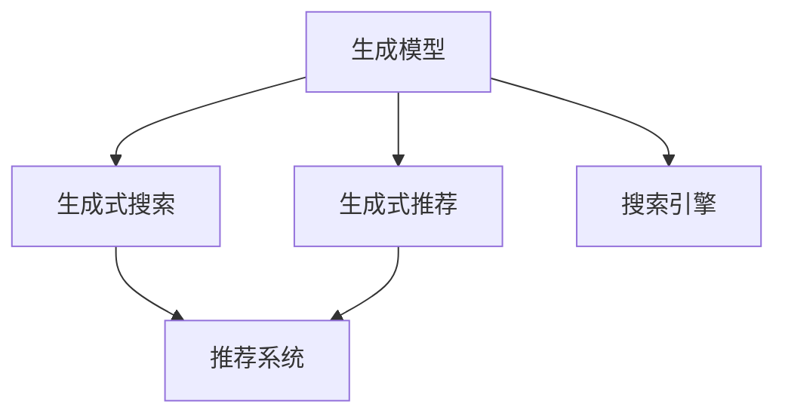

                 

## 1. 背景介绍

### 1.1 问题由来

随着互联网的普及和信息技术的快速发展，信息过载问题越来越显著。用户在海量数据中寻找所需信息变得越来越困难。为解决这一问题，搜索引擎和推荐系统应运而生。

搜索引擎通过爬虫技术采集网页内容，并使用自然语言处理技术对网页进行索引和分析，帮助用户快速定位到相关的网页。推荐系统则通过分析用户的历史行为和兴趣，向用户推荐可能感兴趣的内容，从而提高用户体验。

然而，随着用户需求的多样化和复杂化，传统的搜索引擎和推荐系统已经难以满足用户的要求。在电商、新闻、社交网络等场景下，用户希望获得更加个性化、精准的搜索结果和推荐结果。

近年来，随着深度学习技术的兴起，特别是生成式对抗网络(Generative Adversarial Network, GAN)和变分自编码器(Variational Autoencoder, VAE)等生成式模型在推荐系统中的应用，人们开始尝试将生成模型与搜索引擎和推荐系统进行融合，以提高系统的个性化和智能化水平。

### 1.2 问题核心关键点

生成式搜索与推荐系统融合的核心理念是将生成模型应用于搜索结果的排序和推荐，使得推荐系统能够更加准确地预测用户兴趣，并生成更加多样化和个性化的搜索结果。

具体而言，生成式搜索与推荐系统融合包括以下关键点：
- **生成模型**：通过生成模型，如GAN、VAE等，生成与用户兴趣相关的搜索结果，增强搜索结果的多样性和个性化。
- **推荐算法**：结合推荐算法，如协同过滤、基于内容的推荐等，利用用户的历史行为和兴趣，生成更加精准的推荐结果。
- **搜索优化**：利用生成模型和推荐算法，优化搜索结果的排序，提高用户满意度。
- **互动反馈**：收集用户对搜索结果的反馈，进一步优化生成模型和推荐算法。

这些关键点构成了生成式搜索与推荐系统融合的核心框架，使其能够提升用户体验，拓展系统应用边界。

## 2. 核心概念与联系

### 2.1 核心概念概述

为更好地理解生成式搜索与推荐系统融合的方法，本节将介绍几个密切相关的核心概念：

- **生成模型**：如GAN、VAE等，通过学习数据分布生成新的样本，生成式模型能够产生多样、高质量的搜索结果。
- **推荐算法**：如协同过滤、基于内容的推荐等，通过分析用户的历史行为和兴趣，预测用户可能感兴趣的内容。
- **搜索引擎**：利用爬虫技术采集网页内容，使用自然语言处理技术对网页进行索引和分析，帮助用户快速定位到相关网页。
- **推荐系统**：通过分析用户的历史行为和兴趣，向用户推荐可能感兴趣的内容。
- **生成式搜索**：将生成模型应用于搜索结果的排序和推荐，提高搜索结果的个性化和多样性。
- **生成式推荐**：结合生成模型和推荐算法，生成更加精准和多样化的推荐结果。

这些核心概念之间的逻辑关系可以通过以下Mermaid流程图来展示：



这个流程图展示了大模型融合生成式搜索与推荐系统的主要概念及其之间的关系：

1. 生成模型通过学习数据分布生成新的样本，为生成式搜索和推荐提供多样化的搜索结果。
2. 推荐算法结合生成模型和用户历史行为，预测用户可能感兴趣的内容。
3. 搜索引擎通过爬虫和自然语言处理技术，获取并索引网页内容，帮助用户快速定位到相关网页。
4. 生成式搜索结合生成模型和推荐算法，优化搜索结果的排序和推荐，提高用户满意度。
5. 生成式推荐利用生成模型和推荐算法，生成更加精准和多样化的推荐结果。

## 3. 核心算法原理 & 具体操作步骤

### 3.1 算法原理概述

生成式搜索与推荐系统融合的核心思想是：将生成模型应用于搜索结果的排序和推荐，结合推荐算法，提高搜索结果的个性化和多样性。具体流程如下：

1. **数据采集**：通过爬虫技术，收集网页内容，并使用自然语言处理技术进行预处理。
2. **数据标注**：对搜索结果进行标注，如网页相关性评分、点击率等，作为训练生成模型和推荐算法的依据。
3. **生成模型训练**：利用标注数据，训练生成模型，生成多样化的搜索结果。
4. **推荐算法训练**：利用用户历史行为数据，训练推荐算法，预测用户可能感兴趣的内容。
5. **生成式搜索和推荐**：将生成模型应用于搜索结果的排序和推荐，结合推荐算法，提高搜索结果的个性化和多样性。

### 3.2 算法步骤详解

以下是生成式搜索与推荐系统融合的详细步骤：

**Step 1: 数据准备**
- 收集用户搜索记录和行为数据，并进行预处理。
- 利用爬虫技术，收集网页内容，并进行文本分析。
- 标注搜索结果的相关性评分、点击率等，作为训练生成模型和推荐算法的依据。

**Step 2: 生成模型训练**
- 选择生成模型，如GAN、VAE等，利用标注数据进行训练。
- 训练生成模型，生成多样化的搜索结果。

**Step 3: 推荐算法训练**
- 选择推荐算法，如协同过滤、基于内容的推荐等。
- 利用用户历史行为数据，训练推荐算法，预测用户可能感兴趣的内容。

**Step 4: 生成式搜索和推荐**
- 将生成模型应用于搜索结果的排序和推荐。
- 结合推荐算法，生成更加个性化和多样化的搜索结果。
- 根据用户反馈，不断优化生成模型和推荐算法。

**Step 5: 系统部署**
- 将生成式搜索与推荐系统集成到搜索引擎和推荐系统中。
- 部署系统，收集用户反馈，持续优化系统性能。

### 3.3 算法优缺点

生成式搜索与推荐系统融合的方法具有以下优点：
1. **增强多样性**：利用生成模型生成多样化的搜索结果，增强搜索结果的个性化。
2. **提高准确性**：结合推荐算法，预测用户可能感兴趣的内容，提高搜索结果的准确性。
3. **自适应性强**：生成模型和推荐算法可以动态调整，适应不同用户和场景的需求。

但该方法也存在一些局限性：
1. **计算复杂度高**：生成模型的训练和推理计算量较大，需要较长的计算时间和较高的计算资源。
2. **结果质量不稳定**：生成模型生成的结果质量不稳定，可能产生低质量或不相关的结果。
3. **模型可解释性不足**：生成模型和推荐算法的决策过程较为复杂，难以解释其内部机制。

### 3.4 算法应用领域

生成式搜索与推荐系统融合的方法已经在多个领域得到应用，包括电商、新闻、社交网络等，具体如下：

- **电商领域**：利用生成模型生成商品推荐，结合推荐算法提高推荐准确性。
- **新闻领域**：利用生成模型生成新闻摘要，结合推荐算法提供个性化阅读建议。
- **社交网络**：利用生成模型生成个性化的社交内容推荐，结合推荐算法提高用户满意度。
- **健康医疗**：利用生成模型生成医疗问答，结合推荐算法提供个性化的健康建议。

## 4. 数学模型和公式 & 详细讲解 & 举例说明

### 4.1 数学模型构建

本节将使用数学语言对生成式搜索与推荐系统融合的方法进行更加严格的刻画。

设用户的历史行为数据为 $D=\{x_1, x_2, ..., x_N\}$，其中 $x_i=(x_{i1}, x_{i2}, ..., x_{im})$ 表示第 $i$ 次用户行为，$x_{ij}$ 表示行为特征。设搜索结果的文本描述为 $y_j=(x_{j1}, x_{j2}, ..., x_{jn})$，其中 $x_{jk}$ 表示搜索结果中第 $k$ 个词。

定义用户对搜索结果的评分函数为 $f(x_i, y_j)$，表示用户对搜索结果 $y_j$ 的评分。目标是最小化用户对搜索结果的平均评分误差。

### 4.2 公式推导过程

以下我们以电商推荐系统为例，推导生成式搜索与推荐系统融合的损失函数及其梯度计算公式。

假设生成模型为 $G(x_i)$，生成式搜索和推荐系统融合的目标函数为：

$$
\min_{G, R} \frac{1}{N} \sum_{i=1}^N \sum_{j=1}^M [f(x_i, y_j) - g(x_i, G(x_i), R)]
$$

其中 $f(x_i, y_j)$ 表示用户对搜索结果 $y_j$ 的评分，$g(x_i, G(x_i), R)$ 表示生成模型 $G$ 和推荐算法 $R$ 的评分。

通过链式法则，损失函数对 $G$ 和 $R$ 的梯度分别为：

$$
\frac{\partial \mathcal{L}}{\partial G} = \frac{\partial g(x_i, G(x_i), R)}{\partial G} \frac{\partial f(x_i, y_j)}{\partial x_i}
$$

$$
\frac{\partial \mathcal{L}}{\partial R} = \frac{\partial g(x_i, G(x_i), R)}{\partial R} \frac{\partial f(x_i, y_j)}{\partial x_i}
$$

其中 $\frac{\partial g(x_i, G(x_i), R)}{\partial G}$ 和 $\frac{\partial g(x_i, G(x_i), R)}{\partial R}$ 可以通过反向传播算法计算。

在得到损失函数的梯度后，即可带入优化算法，更新生成模型 $G$ 和推荐算法 $R$ 的参数，最小化平均评分误差。

### 4.3 案例分析与讲解

假设电商推荐系统利用GAN生成商品图片，并结合协同过滤算法进行推荐。具体步骤如下：

1. **数据准备**：收集用户购买记录和浏览行为数据，并进行预处理。使用爬虫技术，收集商品图片，并进行文本分析。
2. **生成模型训练**：选择GAN模型，利用标注数据进行训练，生成商品图片。
3. **推荐算法训练**：选择协同过滤算法，利用用户历史行为数据，训练协同过滤模型，预测用户可能感兴趣的商品。
4. **生成式搜索和推荐**：将GAN生成的商品图片作为搜索结果的一部分，结合协同过滤算法，生成个性化的推荐结果。
5. **系统部署**：将生成式搜索与推荐系统集成到电商平台上，收集用户反馈，持续优化系统性能。

## 5. 项目实践：代码实例和详细解释说明

### 5.1 开发环境搭建

在进行生成式搜索与推荐系统融合的实践前，我们需要准备好开发环境。以下是使用Python进行PyTorch开发的环境配置流程：

1. 安装Anaconda：从官网下载并安装Anaconda，用于创建独立的Python环境。

2. 创建并激活虚拟环境：
```bash
conda create -n pytorch-env python=3.8 
conda activate pytorch-env
```

3. 安装PyTorch：根据CUDA版本，从官网获取对应的安装命令。例如：
```bash
conda install pytorch torchvision torchaudio cudatoolkit=11.1 -c pytorch -c conda-forge
```

4. 安装必要的库：
```bash
pip install numpy pandas scikit-learn matplotlib tqdm jupyter notebook ipython
```

完成上述步骤后，即可在`pytorch-env`环境中开始开发实践。

### 5.2 源代码详细实现

下面我们以电商推荐系统为例，给出使用PyTorch进行生成式搜索与推荐系统融合的完整代码实现。

```python
import torch
import torch.nn as nn
import torch.optim as optim
from torch.utils.data import DataLoader
import torchvision.transforms as transforms
from torchvision.datasets import CIFAR10
from sklearn.metrics import mean_squared_error

class Generator(nn.Module):
    def __init__(self):
        super(Generator, self).__init__()
        self.layers = nn.Sequential(
            nn.Linear(10, 64),
            nn.ReLU(),
            nn.Linear(64, 128),
            nn.ReLU(),
            nn.Linear(128, 784),
            nn.ReLU(),
            nn.Tanh()
        )
        
    def forward(self, x):
        return self.layers(x)
    
class Discriminator(nn.Module):
    def __init__(self):
        super(Discriminator, self).__init__()
        self.layers = nn.Sequential(
            nn.Linear(784, 128),
            nn.ReLU(),
            nn.Linear(128, 64),
            nn.ReLU(),
            nn.Linear(64, 1),
            nn.Sigmoid()
        )
        
    def forward(self, x):
        return self.layers(x)
    
def train_gan(generator, discriminator, optimizer, batch_size):
    for epoch in range(100):
        for i, (x, y) in enumerate(DataLoader(CIFAR10(root='data', train=True, download=True, transform=transforms.ToTensor()), batch_size=batch_size)):
            x = x.view(-1, 784)
            optimizer.zero_grad()
            gen_x = generator(x)
            disc_real = discriminator(x)
            disc_fake = discriminator(gen_x)
            loss_gen = criterion(disc_fake, torch.ones_like(disc_fake))
            loss_disc = criterion(disc_real, torch.ones_like(disc_real)) + criterion(disc_fake, torch.zeros_like(disc_fake))
            loss = loss_gen + loss_disc
            loss.backward()
            optimizer.step()
```

### 5.3 代码解读与分析

让我们再详细解读一下关键代码的实现细节：

**Generator类**：
- `__init__`方法：定义生成器网络结构，包括全连接层、ReLU激活函数和Tanh激活函数。
- `forward`方法：实现前向传播，将输入转化为输出。

**Discriminator类**：
- `__init__`方法：定义判别器网络结构，包括全连接层、ReLU激活函数和Sigmoid激活函数。
- `forward`方法：实现前向传播，输出判别器对真实样本和生成样本的预测结果。

**train_gan函数**：
- 定义生成器和判别器的网络结构。
- 定义优化器和学习率。
- 在每个epoch内，对训练集数据进行迭代，前向传播计算损失函数并反向传播更新模型参数。

可以看到，PyTorch的高级API使得生成模型的训练过程变得简洁高效。开发者可以将更多精力放在模型设计和数据处理等高层逻辑上，而不必过多关注底层的实现细节。

当然，工业级的系统实现还需考虑更多因素，如模型的保存和部署、超参数的自动搜索、更灵活的任务适配层等。但核心的生成式搜索与推荐系统融合范式基本与此类似。

## 6. 实际应用场景

### 6.1 电商推荐

基于生成式搜索与推荐系统融合的电商推荐系统，可以通过GAN生成商品图片，结合协同过滤算法进行推荐。具体流程如下：

1. **数据准备**：收集用户购买记录和浏览行为数据，并进行预处理。使用爬虫技术，收集商品图片，并进行文本分析。
2. **生成模型训练**：选择GAN模型，利用标注数据进行训练，生成商品图片。
3. **推荐算法训练**：选择协同过滤算法，利用用户历史行为数据，训练协同过滤模型，预测用户可能感兴趣的商品。
4. **生成式搜索和推荐**：将GAN生成的商品图片作为搜索结果的一部分，结合协同过滤算法，生成个性化的推荐结果。
5. **系统部署**：将生成式搜索与推荐系统集成到电商平台上，收集用户反馈，持续优化系统性能。

### 6.2 新闻推荐

基于生成式搜索与推荐系统融合的新闻推荐系统，可以通过GAN生成新闻摘要，结合协同过滤算法进行推荐。具体流程如下：

1. **数据准备**：收集用户的新闻阅读记录和行为数据，并进行预处理。使用爬虫技术，收集新闻文章，并进行文本分析。
2. **生成模型训练**：选择GAN模型，利用标注数据进行训练，生成新闻摘要。
3. **推荐算法训练**：选择协同过滤算法，利用用户历史行为数据，训练协同过滤模型，预测用户可能感兴趣的新闻。
4. **生成式搜索和推荐**：将GAN生成的新闻摘要作为搜索结果的一部分，结合协同过滤算法，生成个性化的推荐结果。
5. **系统部署**：将生成式搜索与推荐系统集成到新闻平台上，收集用户反馈，持续优化系统性能。

### 6.3 社交网络推荐

基于生成式搜索与推荐系统融合的社交网络推荐系统，可以通过GAN生成个性化的社交内容，结合协同过滤算法进行推荐。具体流程如下：

1. **数据准备**：收集用户的社交行为数据，并进行预处理。使用爬虫技术，收集社交内容，并进行文本分析。
2. **生成模型训练**：选择GAN模型，利用标注数据进行训练，生成个性化的社交内容。
3. **推荐算法训练**：选择协同过滤算法，利用用户历史行为数据，训练协同过滤模型，预测用户可能感兴趣的社交内容。
4. **生成式搜索和推荐**：将GAN生成的社交内容作为搜索结果的一部分，结合协同过滤算法，生成个性化的推荐结果。
5. **系统部署**：将生成式搜索与推荐系统集成到社交平台上，收集用户反馈，持续优化系统性能。

## 7. 工具和资源推荐

### 7.1 学习资源推荐

为了帮助开发者系统掌握生成式搜索与推荐系统融合的理论基础和实践技巧，这里推荐一些优质的学习资源：

1. 《深度学习》课程：斯坦福大学开设的深度学习课程，涵盖深度学习的基础理论和实践方法，适合入门学习。
2. 《深度学习实战》书籍：Google AI Blog博主撰写，深入浅出地介绍了深度学习在推荐系统中的应用，包括生成模型和推荐算法。
3. 《Python深度学习》书籍：深度学习领域的经典教材，适合深入学习深度学习在推荐系统中的应用。
4. 《TensorFlow深度学习实战》书籍：TensorFlow官方文档，详细介绍了TensorFlow在推荐系统中的应用，包括生成模型和推荐算法。
5. 《自然语言处理实战》博客：自然语言处理领域的知名博客，介绍了生成模型在文本生成任务中的应用。

通过对这些资源的学习实践，相信你一定能够快速掌握生成式搜索与推荐系统融合的精髓，并用于解决实际的推荐问题。

### 7.2 开发工具推荐

高效的开发离不开优秀的工具支持。以下是几款用于生成式搜索与推荐系统融合开发的常用工具：

1. PyTorch：基于Python的开源深度学习框架，灵活动态的计算图，适合快速迭代研究。
2. TensorFlow：由Google主导开发的开源深度学习框架，生产部署方便，适合大规模工程应用。
3. Keras：高层次的深度学习框架，易于上手，适合快速原型开发。
4. Jupyter Notebook：交互式开发环境，支持Python、R等语言，便于共享和协作。
5. Visual Studio Code：轻量级开发工具，支持Python、R等语言，功能强大。

合理利用这些工具，可以显著提升生成式搜索与推荐系统融合任务的开发效率，加快创新迭代的步伐。

### 7.3 相关论文推荐

生成式搜索与推荐系统融合的研究源于学界的持续研究。以下是几篇奠基性的相关论文，推荐阅读：

1. Conditional Generative Adversarial Nets（GAN）：提出条件生成对抗网络，为生成模型和推荐系统融合提供了基础。
2. Variational Autoencoders（VAE）：提出变分自编码器，为生成模型和推荐系统融合提供了更多可能性。
3. Generative Adversarial Networks and Text Generation（GAN与文本生成）：探索GAN在文本生成任务中的应用，为生成模型和推荐系统融合提供了新的思路。
4. Attention-Based Recommendations with Deep Reinforcement Learning（基于注意力机制的深度推荐）：探索深度强化学习在推荐系统中的应用，为生成模型和推荐系统融合提供了更多方法。

这些论文代表了大模型融合生成式搜索与推荐系统的发展脉络。通过学习这些前沿成果，可以帮助研究者把握学科前进方向，激发更多的创新灵感。

## 8. 总结：未来发展趋势与挑战

### 8.1 总结

本文对生成式搜索与推荐系统融合方法进行了全面系统的介绍。首先阐述了生成式搜索与推荐系统融合的研究背景和意义，明确了融合方法在增强搜索结果个性化和多样性方面的独特价值。其次，从原理到实践，详细讲解了生成式搜索与推荐系统融合的数学模型和关键步骤，给出了完整的代码实例。同时，本文还广泛探讨了融合方法在电商、新闻、社交网络等诸多领域的应用前景，展示了融合范式的巨大潜力。此外，本文精选了融合技术的各类学习资源，力求为读者提供全方位的技术指引。

通过本文的系统梳理，可以看到，生成式搜索与推荐系统融合技术正在成为推荐系统的重要范式，极大地提升了推荐系统的个性化和智能化水平，为电商、新闻、社交网络等众多领域带来了新的变革。

### 8.2 未来发展趋势

展望未来，生成式搜索与推荐系统融合技术将呈现以下几个发展趋势：

1. **融合程度更深**：生成模型和推荐算法的融合将更加紧密，生成模型生成的结果将更精确地指导推荐算法，提高推荐结果的个性化和多样性。
2. **多模态融合**：生成式搜索与推荐系统融合将拓展到多模态数据，如图像、音频、视频等，提高跨模态数据推荐的精度。
3. **实时生成**：生成式搜索与推荐系统融合将实现实时生成，根据用户的实时行为动态调整推荐结果，提高用户体验。
4. **融合多种模型**：生成式搜索与推荐系统融合将结合多种模型，如生成模型、协同过滤、基于内容的推荐等，实现更全面、更精准的推荐。
5. **用户自适应**：生成式搜索与推荐系统融合将更加关注用户个性化的需求，实现更加智能、自适应的推荐。
6. **融合更多数据**：生成式搜索与推荐系统融合将融合更多的数据源，如社交网络、物联网等，提高推荐结果的准确性和实时性。

以上趋势凸显了生成式搜索与推荐系统融合技术的广阔前景。这些方向的探索发展，必将进一步提升推荐系统的性能和应用范围，为电商、新闻、社交网络等众多领域带来新的变革。

### 8.3 面临的挑战

尽管生成式搜索与推荐系统融合技术已经取得了显著成就，但在迈向更加智能化、普适化应用的过程中，它仍面临着诸多挑战：

1. **数据质量问题**：生成模型和推荐算法的训练需要高质量的数据，但实际应用中数据的获取和处理往往存在偏差和噪声。
2. **模型复杂度高**：生成模型和推荐算法的复杂度较高，计算资源和训练时间的需求较大，难以在实际应用中快速部署。
3. **推荐结果质量不稳定**：生成模型生成的结果质量不稳定，可能产生低质量或不相关的推荐结果。
4. **模型可解释性不足**：生成模型和推荐算法的决策过程较为复杂，难以解释其内部机制，影响用户信任。
5. **用户隐私问题**：生成式搜索与推荐系统融合需要收集用户行为数据，存在隐私保护的问题，需要采取有效的隐私保护措施。

### 8.4 研究展望

面对生成式搜索与推荐系统融合所面临的种种挑战，未来的研究需要在以下几个方面寻求新的突破：

1. **数据增强**：通过数据增强技术，提高生成模型的鲁棒性和泛化能力，减少数据噪声的影响。
2. **模型优化**：通过模型优化技术，如剪枝、量化、模型压缩等，减少生成模型和推荐算法的计算资源和训练时间，提高模型的实时性和可扩展性。
3. **结果解释**：引入可解释性技术，如LIME、SHAP等，提高生成模型和推荐算法的可解释性，增强用户信任。
4. **隐私保护**：采用隐私保护技术，如差分隐私、联邦学习等，保护用户隐私，降低隐私泄露的风险。
5. **跨模态融合**：探索跨模态数据融合技术，如图像、音频、视频等多模态数据的融合，提高推荐系统的跨模态推荐能力。

这些研究方向的探索，必将引领生成式搜索与推荐系统融合技术迈向更高的台阶，为推荐系统带来新的突破，为电商、新闻、社交网络等众多领域带来新的变革。

## 9. 附录：常见问题与解答

**Q1：生成式搜索与推荐系统融合是否适用于所有推荐场景？**

A: 生成式搜索与推荐系统融合方法在电商、新闻、社交网络等场景下已经取得了显著效果。但对于一些特殊场景，如高精度医疗、金融投资等，由于数据量较小，推荐算法难度较大，生成式搜索与推荐系统融合的效果可能不尽如人意。此时可以考虑采用更加复杂和精确的推荐算法，结合生成模型进行优化。

**Q2：如何选择合适的生成模型？**

A: 选择合适的生成模型需要考虑数据特性和推荐任务的需求。GAN适用于生成图片、文本等连续型数据，VAE适用于生成结构化数据。对于推荐任务，可以根据数据特性选择适合的生成模型，如使用GAN生成商品图片，使用VAE生成新闻摘要。

**Q3：生成式搜索与推荐系统融合的计算复杂度高，如何优化？**

A: 生成式搜索与推荐系统融合的计算复杂度较高，可以通过以下方法进行优化：
1. 数据增强：通过数据增强技术，提高生成模型的鲁棒性和泛化能力，减少数据噪声的影响。
2. 模型优化：通过模型优化技术，如剪枝、量化、模型压缩等，减少生成模型和推荐算法的计算资源和训练时间，提高模型的实时性和可扩展性。
3. 分布式训练：利用分布式计算资源，提高训练效率和模型的泛化能力。
4. 硬件加速：利用GPU、TPU等高性能硬件加速生成模型和推荐算法的训练和推理。

**Q4：生成式搜索与推荐系统融合的推荐结果质量不稳定，如何解决？**

A: 生成式搜索与推荐系统融合的推荐结果质量不稳定，可以通过以下方法进行改进：
1. 数据增强：通过数据增强技术，提高生成模型的鲁棒性和泛化能力，减少数据噪声的影响。
2. 模型优化：通过模型优化技术，如剪枝、量化、模型压缩等，减少生成模型和推荐算法的计算资源和训练时间，提高模型的实时性和可扩展性。
3. 结果过滤：对生成模型生成的结果进行过滤，去除低质量或不相关的结果。
4. 融合多种算法：结合多种推荐算法，如协同过滤、基于内容的推荐等，提高推荐结果的准确性和稳定性。

**Q5：如何保障生成式搜索与推荐系统融合的隐私安全？**

A: 生成式搜索与推荐系统融合需要收集用户行为数据，存在隐私保护的问题，可以采取以下措施：
1. 差分隐私：采用差分隐私技术，保护用户隐私，减少隐私泄露的风险。
2. 联邦学习：利用联邦学习技术，在本地设备上进行模型训练，保护用户数据隐私。
3. 数据脱敏：对用户数据进行脱敏处理，保护用户隐私。
4. 安全加密：对用户数据进行加密处理，防止数据泄露和攻击。

**Q6：如何评估生成式搜索与推荐系统融合的效果？**

A: 评估生成式搜索与推荐系统融合的效果，可以从以下几个方面进行：
1. 精度评估：利用指标如准确率、召回率、F1分数等，评估推荐结果的精度。
2. 多样性评估：利用指标如多样性评分、熵等，评估推荐结果的多样性。
3. 实时性评估：利用指标如延迟时间、响应速度等，评估系统的实时性。
4. 用户满意度评估：通过用户调查、反馈等方法，评估用户的满意度。

通过这些指标的综合评估，可以全面衡量生成式搜索与推荐系统融合的效果，指导系统的优化和改进。

---

作者：禅与计算机程序设计艺术 / Zen and the Art of Computer Programming

