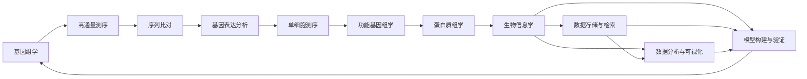

                 

# 生物信息学：基因组数据分析技术

> 关键词：基因组学,生物信息学,高通量测序,序列比对,基因表达分析,单细胞测序,功能基因组学,蛋白质组学

## 1. 背景介绍

### 1.1 问题由来

随着基因组学研究的不断深入，大规模基因组数据集的获取和分析已成为现代生物信息学研究的热点。从人类基因组计划（HGP）到国际癌症基因组计划（ICGCS），再到单细胞组学（scRNA-seq）等前沿技术，基因组学数据量呈现指数级增长。这些数据集包含丰富而复杂的生物学信息，为疾病诊疗、药物研发、物种演化等众多领域提供了宝贵的资源。然而，如何高效、准确地分析这些基因组数据，提取有价值的信息，成为生物信息学家和数据科学家面临的主要挑战。

### 1.2 问题核心关键点

面对基因组数据分析的挑战，现代生物信息学研究主要聚焦以下几个核心关键点：

- **高通量测序（Next-Generation Sequencing, NGS）**：大规模、高精度的DNA测序技术，使得基因组数据量呈爆炸性增长，为基因组学研究提供了强大的技术支持。
- **序列比对（Sequence Alignment）**：将测序得到的短读段（Reads）与参考基因组进行比对，重建完整基因组序列。
- **基因表达分析（Gene Expression Analysis）**：通过基因表达谱分析，研究基因在不同条件下的表达变化，探索基因调控机制和疾病发生的机理。
- **单细胞测序（Single-cell Sequencing, scRNA-seq）**：在单个细胞级别分析基因表达，揭示细胞异质性及发育动态，推动细胞谱系和发育机制的研究。
- **功能基因组学（Functional Genomics）**：通过基因编辑、基因敲除等实验手段，研究基因在生物体中的功能，指导药物开发和新治疗策略的制定。
- **蛋白质组学（Proteomics）**：研究细胞或生物体中蛋白质的种类、数量和活性变化，为基因组学研究提供新的维度。

这些问题构成了生物信息学研究的基石，涵盖了从基础研究到应用转化的全过程。本节将从核心概念的介绍开始，逐步深入分析相关算法原理、操作步骤以及其优缺点和应用领域。

## 2. 核心概念与联系

### 2.1 核心概念概述

为更好地理解基因组数据分析的技术框架，本节将介绍几个核心概念：

- **基因组学（Genomics）**：研究基因组DNA的结构、功能及其在遗传、进化、健康和疾病中的应用。
- **生物信息学（Bioinformatics）**：利用计算方法和技术，分析、处理和解释生物数据，如DNA序列、蛋白质结构等。
- **高通量测序（NGS）**：利用芯片技术或测序平台，在同一实验条件下对大量DNA序列进行平行测序，提高数据获取效率。
- **序列比对（Sequence Alignment）**：通过算法将测序数据与已知序列进行比对，找出匹配的部分，用于基因组重建、基因识别和基因表达分析等。
- **基因表达分析（Gene Expression Analysis）**：利用微阵列、RNA-seq等技术，对基因在不同条件下的表达情况进行定量分析，研究基因功能。
- **单细胞测序（scRNA-seq）**：在单个细胞层面分析基因表达，揭示细胞异质性和发育动态，推动细胞谱系和发育机制的研究。
- **功能基因组学（Functional Genomics）**：通过基因编辑、基因敲除等手段，研究基因的功能及其在生物体中的作用。
- **蛋白质组学（Proteomics）**：研究细胞或生物体中蛋白质的种类、数量和活性变化，为基因组学研究提供新的维度。

这些概念之间存在密切联系，共同构成了基因组学和生物信息学的研究框架。通过它们之间的相互作用和整合，研究者可以更深入地理解生物学过程，推动生物技术和医学的发展。

### 2.2 核心概念原理和架构的 Mermaid 流程图



以上流程图展示了基因组数据分析的技术路径和各个环节之间的关系。从高通量测序获取原始数据，到序列比对、基因表达分析、单细胞测序等，最终通过生物信息学技术和方法，进行数据的存储、检索、分析和可视化，为生物学研究提供全面的支持。

## 3. 核心算法原理 & 具体操作步骤

### 3.1 算法原理概述

基因组数据分析的核心算法主要围绕两个方向展开：序列比对和基因表达分析。

**序列比对**的原理是通过比对算法（如BWA、Bowtie等）将测序数据与参考基因组序列进行匹配，找出最佳的匹配位置。核心思想是使用动态规划算法，通过比较不同长度和位置的子序列，找出最优的匹配方式。

**基因表达分析**主要依赖RNA-seq技术，通过对基因组DNA转录出的RNA序列进行测序和分析，计算出每个基因的表达量。核心算法包括RNA-seq数据预处理、基因表达量化、差异表达分析等。

### 3.2 算法步骤详解

**序列比对算法（BWA）**的主要步骤如下：

1. **预处理**：将参考基因组序列进行构建索引，准备比对工具。
2. **比对**：使用BWA工具对测序数据进行比对，找出匹配位置。
3. **合并排序**：将比对结果按照坐标排序，去重和排序。
4. **统计分析**：根据比对结果进行基因组覆盖分析、基因识别等统计分析。

**RNA-seq数据预处理**的步骤包括：

1. **质量控制**：去除低质量读段，去除低质量碱基，去除接头（Adapter）序列。
2. **序列校正**：对残余的错误碱基进行校正。
3. **拼接**：将序列拼接成长度较长的序列，用于后续的基因识别和表达量计算。
4. **基因注释**：使用注释工具将拼接后的序列与基因组序列进行比对，注释基因信息。

**基因表达量化**的核心步骤是构建每个基因的计数矩阵（Count Matrix），将拼接后的RNA序列与基因组序列进行比对，统计每个基因的表达量。

**差异表达分析**主要是通过计算每个基因的表达变化量，找出在不同条件（如疾病、药物处理等）下表达差异显著的基因。常用的算法包括DESeq2、EdgeR等。

### 3.3 算法优缺点

**序列比对算法（BWA）**的优点在于速度快、内存占用小，能够在较短时间内处理大规模数据集。缺点是可能存在较高的误配率，特别是在长序列比对时，误配率会显著增加。

**RNA-seq数据预处理**的优势在于能够过滤掉低质量读段，提高数据质量。缺点在于拼接过程可能会引入误差，导致基因识别不准确。

**基因表达量化**的优点在于能够精确地计算基因表达量，但需要大量的计算资源，特别是在基因组较大时，计算量会成倍增加。

**差异表达分析**的核心在于统计学方法的精确性，能够有效识别差异表达基因，但算法复杂度较高，对数据的预处理要求也较高。

### 3.4 算法应用领域

序列比对和基因表达分析算法广泛应用于基因组学研究中的各个环节：

- **基因组重建**：通过高通量测序数据与参考基因组进行比对，重建完整基因组序列，用于遗传研究和物种演化分析。
- **基因识别**：通过序列比对，识别基因组中的未知基因，用于基因功能研究和新基因发现。
- **基因表达分析**：通过RNA-seq技术，分析基因在不同条件下的表达变化，研究基因调控机制和疾病发生的机理。
- **转录组分析**：研究基因表达与细胞功能的关系，推动细胞谱系和发育机制的研究。
- **基因功能验证**：通过基因敲除、基因编辑等实验手段，验证基因的功能，推动功能基因组学研究。

## 4. 数学模型和公式 & 详细讲解 & 举例说明

### 4.1 数学模型构建

本节将使用数学语言对基因组数据分析的关键算法进行严格描述。

假设有一个长度为$L$的参考基因组序列$G$和长度为$S$的测序数据序列$S$，序列比对算法的目标是将$S$与$G$进行匹配，找出最佳的比对位置$P$，使得比对距离$d$最小。

比对距离$d$定义为所有可能比对位置上的匹配长度、插入长度和删除长度的总和。如果序列$S$和$G$在位置$i$上存在匹配，则$d$减少$1$；如果存在插入，则$d$增加$1$；如果存在删除，则$d$减少$1$。

比对算法的目标是最小化$d$，即：

$$
\min_{P} \sum_{i=1}^L (d_i)
$$

其中$d_i$表示在位置$i$上的比对距离。

### 4.2 公式推导过程

使用动态规划算法计算比对距离$d$的推导过程如下：

设$dp(i, j)$表示序列$S$的前$i$个字符与序列$G$的前$j$个字符进行比对后的最小距离。初始化条件为$dp(i, 0) = i$和$dp(0, j) = j$。动态规划的状态转移方程为：

$$
dp(i, j) = \min(dp(i-1, j), dp(i, j-1), dp(i-1, j-1) + cost(S_i, G_j))
$$

其中$cost(S_i, G_j)$表示字符$S_i$和$G_j$的匹配得分，可以是匹配、插入或删除的成本。

最终的$dp(L, S)$即为序列$S$与$G$的最佳比对距离。

### 4.3 案例分析与讲解

以一个简化的示例来说明动态规划算法的应用：

假设参考基因组序列为$G = G_1G_2G_3G_4G_5$，测序数据序列为$S = S_1S_2S_3S_4S_5$，各字符的匹配成本如表所示：

| $S_i$ | $G_j$ | $cost(S_i, G_j)$ |
|-------|-------|----------------|
| $G_1$ | $G_1$ | $0$             |
| $G_2$ | $G_2$ | $0$             |
| $G_3$ | $G_3$ | $0$             |
| $G_4$ | $G_4$ | $0$             |
| $G_5$ | $G_5$ | $0$             |
| $S_1$ | $A_1$ | $1$             |
| $S_2$ | $G_2$ | $0$             |
| $S_3$ | $T_3$ | $1$             |
| $S_4$ | $C_4$ | $2$             |
| $S_5$ | $A_5$ | $1$             |

根据动态规划的状态转移方程，可以逐步计算出序列比对的距离，最终得到序列$S$与$G$的最佳比对位置和距离$d$。

## 5. 项目实践：代码实例和详细解释说明

### 5.1 开发环境搭建

在进行基因组数据分析的实践前，我们需要准备好开发环境。以下是使用Python进行BioPython开发的环境配置流程：

1. 安装Anaconda：从官网下载并安装Anaconda，用于创建独立的Python环境。

2. 创建并激活虚拟环境：
```bash
conda create -n bio-env python=3.8 
conda activate bio-env
```

3. 安装BioPython：
```bash
pip install biopython
```

4. 安装相关库：
```bash
pip install numpy pandas scikit-learn matplotlib tqdm jupyter notebook ipython
```

完成上述步骤后，即可在`bio-env`环境中开始基因组数据分析的实践。

### 5.2 源代码详细实现

下面我们以序列比对算法（BWA）为例，给出使用BioPython实现基因组序列比对的Python代码实现。

```python
from Bio import SeqIO
from Bio.Seq import Seq
from Bio.SeqRecord import SeqRecord
from Bio.Alphabet import generic_dna
from Bio.BWA import bwa_mem_map

# 读取参考基因组序列
with open('reference_sequence.fasta', 'r') as fasta_file:
    records = SeqIO.parse(fasta_file, 'fasta')
    reference_seq = next(records).seq

# 读取测序数据
with open('sequence_reads.fasta', 'r') as fasta_file:
    records = SeqIO.parse(fasta_file, 'fasta')
    sequence_reads = [next(records).seq for record in records]

# 构建比对参数
parameters = {
    'thread': 8,
    'min-length': 20,
    'max-length': 50000,
    'min-quality': 0,
    'mask': False,
    'read-gap': 20,
    'map-quality': 0,
    'contig-list': '',
    'bwt': 'bwt'
}

# 进行序列比对
result = bwa_mem_map(sequence_reads, reference_seq, parameters)

# 输出比对结果
for read, align in result:
    print(f'Read: {read}')
    print(f'Best match: {align}')
```

以上代码实现了BioPython中的BWA工具进行序列比对的流程。通过读取参考基因组序列和测序数据，使用BWA工具进行比对，最终输出每个读段的最佳匹配位置和距离。

### 5.3 代码解读与分析

让我们再详细解读一下关键代码的实现细节：

**BioPython中的BWA工具**：BioPython提供了一个方便的API，用于调用BWA工具进行序列比对。在代码中，我们通过`bwa_mem_map`函数，将测序数据和参考基因组序列作为输入，以及一些比对参数，得到比对结果。

**序列读取与处理**：代码中使用了BioPython中的`SeqIO`模块，读取了参考基因组序列和测序数据。在读取过程中，我们使用了`next(records)`函数，逐个读取记录。对于每个记录，使用`seq`属性获取序列数据。

**比对参数**：在比对过程中，需要设置一些比对参数，如线程数、序列长度范围、匹配质量等。这些参数将作为`bwa_mem_map`函数的输入，影响比对的速度和精度。

**比对结果输出**：最终，比对结果将以`result`变量的形式返回，其中每个读段的比对信息将存储在`result`中。我们通过遍历`result`，输出每个读段的原始序列和最佳匹配位置。

## 6. 实际应用场景

### 6.1 智能医疗

基因组数据分析技术在智能医疗领域具有广阔的应用前景。通过分析患者的基因组数据，可以预测疾病的易感性、制定个性化的治疗方案，提高医疗服务的精准性和效率。

在临床实践中，医生可以通过基因组数据分析，找出与疾病相关的基因变异，制定个性化的治疗方案。例如，通过分析乳腺癌患者的基因组数据，找出BRCA1、BRCA2等基因的突变情况，制定相应的靶向治疗方案。

### 6.2 新药研发

基因组数据分析在新药研发中也发挥着重要作用。通过分析不同药物对基因表达的影响，可以预测药物的作用机制和副作用，加速新药的研发进程。

例如，研究人员可以通过分析转录组数据，找出在不同药物处理下表达差异显著的基因，筛选出潜在的新药靶点。此外，基因组数据分析还可以帮助研究人员理解药物的作用机制，指导新药的优化设计。

### 6.3 生态系统研究

基因组数据分析技术还可以应用于生态系统研究中，揭示生物多样性、种群动态和生态关系等关键问题。

通过分析不同物种的基因组数据，可以揭示它们的进化关系和基因流动的机制。例如，研究人员可以通过分析蜜蜂的基因组数据，找出与蜜蜂疾病相关的基因，制定相应的防治策略，保护蜜蜂种群。

### 6.4 未来应用展望

随着基因组学研究的不断深入，基因组数据分析技术将会在更多领域得到应用，为科学研究和技术创新提供强大的支持。

在未来的研究中，基因组数据分析将进一步扩展到单细胞测序、时间序列分析、多组学整合等领域，推动基因组学研究的深度和广度。同时，随着计算能力的提升和算法优化的进展，基因组数据分析的速度和精度也将不断提高，为生物信息学研究提供更加可靠的技术支撑。

## 7. 工具和资源推荐

### 7.1 学习资源推荐

为了帮助开发者系统掌握基因组数据分析的理论基础和实践技巧，这里推荐一些优质的学习资源：

1. 《生物信息学原理与实践》系列博文：由生物信息学专家撰写，深入浅出地介绍了基因组数据分析的基本概念和核心算法。

2. CSBIOC101《生物信息学基础》课程：由斯坦福大学开设的生物信息学课程，提供Lecture视频和配套作业，适合初学者入门。

3. 《基因组学：理论与实践》书籍：介绍了基因组学研究的基本原理和经典技术，包括高通量测序、序列比对、基因表达分析等。

4. BioPython官方文档：BioPython的官方文档，提供了丰富的API和样例代码，是基因组数据分析开发的必备资源。

5. ENCODE项目：ENCODE（Encyclopedia of DNA Elements）计划，提供大量的基因组和转录组数据，以及相关的分析工具和注释资源。

通过对这些资源的学习实践，相信你一定能够快速掌握基因组数据分析的精髓，并用于解决实际的生物学问题。

### 7.2 开发工具推荐

高效的开发离不开优秀的工具支持。以下是几款用于基因组数据分析开发的常用工具：

1. BioPython：Python中生物信息学库，提供了丰富的数据处理和分析工具，支持序列比对、基因表达分析等。

2. SRA Toolkit：用于处理和分析高通量测序数据的工具，支持多种测序平台和数据格式。

3. FASTQC：用于质量控制和预处理高通量测序数据的工具，能够检测和过滤低质量读段。

4. SAMtools：用于处理和分析比对数据的工具，支持多种比对格式和数据操作。

5. DESeq2：用于差异表达分析的工具，能够进行基因表达变化的统计分析和可视化。

6. GATK：用于基因组变异检测和注释的工具，支持多种基因组和转录组数据。

合理利用这些工具，可以显著提升基因组数据分析的效率，加速科研创新的步伐。

### 7.3 相关论文推荐

基因组数据分析技术的研究源于学界的持续探索。以下是几篇奠基性的相关论文，推荐阅读：

1. "Sequence Alignment by Longest Common Subsequence"：提出了基于动态规划的序列比对算法，奠定了序列比对算法的理论基础。

2. "Next-generation sequencing data analysis: Overcoming the initial challenges"：综述了高通量测序数据的处理和分析方法，介绍了当前基因组学研究中的常用工具和技术。

3. "Mapping short DNA sequencing reads to the human genome"：介绍了基于短读段映射的基因组组装技术，推动了基因组学研究的进展。

4. "RNA sequencing technologies: Applications in biomedical and plant sciences"：综述了RNA-seq技术的应用，介绍了基因表达分析和差异表达分析的基本原理和方法。

5. "Targeted genomic analysis using next-generation sequencing technologies"：综述了基于高通量测序的基因组变异检测和注释方法，推动了基因组学研究的深度和广度。

这些论文代表了基因组数据分析技术的最新进展，通过学习这些前沿成果，可以帮助研究者把握学科前进方向，激发更多的创新灵感。

## 8. 总结：未来发展趋势与挑战

### 8.1 总结

本文对基因组数据分析技术进行了全面系统的介绍。首先阐述了基因组学和生物信息学研究的基本背景和核心概念，明确了序列比对和基因表达分析在基因组学研究中的重要作用。其次，从原理到实践，详细讲解了序列比对和基因表达分析的算法原理和具体操作步骤，给出了基因组数据分析的完整代码实例。同时，本文还广泛探讨了基因组数据分析在智能医疗、新药研发、生态系统研究等多个领域的应用前景，展示了基因组数据分析技术的巨大潜力。此外，本文精选了基因组数据分析技术的各类学习资源，力求为读者提供全方位的技术指引。

通过本文的系统梳理，可以看到，基因组数据分析技术在基因组学和生物信息学研究中发挥着重要的作用，为科学研究和技术创新提供了强大的技术支撑。未来，伴随基因组学研究的不断深入，基因组数据分析技术也将持续演进，推动基因组学研究的深度和广度。

### 8.2 未来发展趋势

展望未来，基因组数据分析技术将呈现以下几个发展趋势：

1. **多组学整合**：随着基因组学、蛋白质组学、转录组学等多组学技术的不断发展，基因组数据分析将向着多组学整合方向演进，形成更为全面的生物学理解。

2. **单细胞测序技术**：单细胞测序技术将揭示细胞异质性和发育动态，推动细胞谱系和发育机制的研究，成为基因组学研究的重要方向。

3. **高通量测序技术**：高通量测序技术将不断突破读取长度、读取深度等技术瓶颈，提供更为丰富的基因组数据，推动基因组学研究的深度和广度。

4. **计算能力提升**：随着计算资源的不断增加，基因组数据分析的计算速度和精度将显著提升，为基因组学研究提供更加可靠的技术支持。

5. **算法优化**：基因组数据分析的算法将不断优化，提升数据的处理和分析效率，推动基因组学研究的创新发展。

6. **开放数据共享**：基因组数据分析技术的开放数据共享将成为行业共识，推动基因组学研究的全球合作，加速科学技术的进步。

以上趋势凸显了基因组数据分析技术的广阔前景。这些方向的探索发展，必将进一步提升基因组学研究的性能和应用范围，为科学研究和技术创新提供新的动力。

### 8.3 面临的挑战

尽管基因组数据分析技术已经取得了瞩目成就，但在迈向更加智能化、普适化应用的过程中，它仍面临着诸多挑战：

1. **数据量过大**：基因组数据的规模和复杂性使得数据分析过程中需要处理大量的数据，对计算资源提出了更高的要求。

2. **算法复杂度高**：基因组数据分析涉及多种算法，如序列比对、基因表达分析等，算法复杂度高，对算法的优化和实现提出了更高的要求。

3. **数据预处理要求高**：基因组数据分析对数据预处理的要求非常高，需要去除低质量读段、拼接序列等步骤，确保数据质量。

4. **结果解释困难**：基因组数据分析的结果通常涉及复杂的生物学机制，结果解释和验证较为困难，需要跨学科的合作。

5. **数据隐私和安全**：基因组数据涉及个人隐私，数据存储和传输的安全性需要得到保障，防止数据泄露和滥用。

6. **伦理和法律问题**：基因组数据分析涉及伦理和法律问题，如基因隐私、基因歧视等，需要制定相应的政策和规范。

正视基因组数据分析面临的这些挑战，积极应对并寻求突破，将是大规模基因组数据分析技术走向成熟的必由之路。相信随着学界和产业界的共同努力，这些挑战终将一一被克服，基因组数据分析必将在构建人机协同的智能时代中扮演越来越重要的角色。

### 8.4 研究展望

面对基因组数据分析所面临的种种挑战，未来的研究需要在以下几个方面寻求新的突破：

1. **多组学整合算法**：开发更加高效的多组学整合算法，实现不同数据类型之间的协同分析，提升数据利用效率。

2. **单细胞测序数据分析**：研究单细胞测序数据的预处理、特征提取和分析方法，推动单细胞测序技术在基因组学研究中的应用。

3. **高通量测序数据分析**：开发更加高效的测序数据分析算法，提升高通量测序数据的处理和分析效率。

4. **基因组变异检测和注释**：研究基因组变异检测和注释的新方法，提高基因组变异识别的准确性和全面性。

5. **算法优化和实现**：优化现有算法的实现，提升算法的计算效率和精度，推动基因组数据分析技术的广泛应用。

6. **数据隐私和安全技术**：研究数据隐私和安全技术，保障基因组数据的安全存储和传输，防止数据滥用。

这些研究方向的探索，必将引领基因组数据分析技术迈向更高的台阶，为构建智能、安全、可控的基因组学研究系统提供新的思路和方向。面向未来，基因组数据分析技术还需要与其他生物技术和人工智能技术进行更深入的融合，多路径协同发力，共同推动基因组学研究的进步。只有勇于创新、敢于突破，才能不断拓展基因组数据分析的边界，让智能技术更好地造福人类社会。

## 9. 附录：常见问题与解答

**Q1：基因组数据分析是否适用于所有生物学问题？**

A: 基因组数据分析适用于多种生物学问题的研究，如疾病诊断、药物研发、生态系统研究等。然而，对于一些特定问题，如蛋白质结构分析、生物化学分析等，基因组数据分析可能无法提供足够的支持。

**Q2：基因组数据分析如何应对大规模数据量？**

A: 基因组数据分析面临的数据量巨大，需要对数据进行分布式处理和并行计算。可以使用Hadoop、Spark等分布式计算框架，将数据划分为多个部分，并行处理，提高计算效率。

**Q3：基因组数据分析如何进行高质量的数据预处理？**

A: 基因组数据分析的质量很大程度上依赖于数据预处理的效果。常用的预处理步骤包括去除低质量读段、拼接序列、质量控制等。可以使用FastQC、SAMtools等工具进行预处理，确保数据质量。

**Q4：基因组数据分析结果如何解释和验证？**

A: 基因组数据分析的结果通常涉及复杂的生物学机制，结果解释和验证需要跨学科的合作。可以与生物学家、临床医生等合作，共同探讨数据的生物学意义和实际应用价值。

**Q5：基因组数据分析如何保障数据隐私和安全？**

A: 基因组数据分析涉及个人隐私，需要制定严格的数据隐私和安全措施。可以采用数据匿名化、加密传输等技术，防止数据泄露和滥用。

通过本文的系统梳理，可以看到，基因组数据分析技术在生物学研究中发挥着重要的作用，为科学研究和技术创新提供了强大的技术支撑。未来，伴随基因组学研究的不断深入，基因组数据分析技术也将持续演进，推动基因组学研究的深度和广度。

