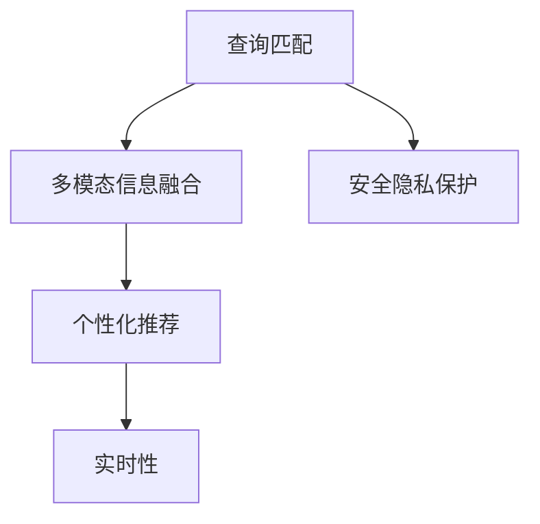

                 

# 用户体验优化：创造身临其境的搜索体验

在数字化时代，搜索引擎已成为人们获取信息的主要途径。用户通过简单的查询词，就能快速定位到自己所需的内容，这背后依赖的便是出色的用户体验设计。然而，搜索引擎的复杂性超乎想象，其核心在于如何让信息匹配用户需求，并在海量数据中高效检索出相关信息。本文将从用户体验优化的角度出发，深入探讨如何提升搜索体验，创造身临其境的用户体验。

## 1. 背景介绍

### 1.1 问题由来

现代搜索引擎技术经历了数十年的发展，从基于关键词匹配的简单算法，到复杂的机器学习模型，再到深度学习框架的引入。用户搜索体验的提升，始终是搜索引擎技术发展的驱动力之一。随着用户对信息获取的依赖度不断提升，搜索引擎也面临着更高的用户体验要求。

用户需求的多样性，搜索场景的复杂性，以及数据规模的爆炸性增长，都对搜索体验设计提出了严峻挑战。如何设计出高效、准确、易用的搜索引擎，已成为技术研发和用户体验设计的核心课题。

### 1.2 问题核心关键点

提升搜索体验的核心在于优化用户与搜索引擎之间的交互流程，使其更加自然、直观、高效。这涉及以下几个关键点：

- 精准的查询匹配：搜索引擎应能够准确理解用户查询词的意图，提供最相关的搜索结果。
- 多模态信息融合：利用文本、图片、视频等多模态信息，提升搜索的全面性和准确性。
- 智能化推荐：基于用户的历史行为和偏好，实时提供个性化的搜索结果推荐。
- 高效的数据检索：在大规模数据中快速定位到所需信息，满足用户对实时性的需求。
- 安全隐私保护：在提供优质搜索体验的同时，保证用户数据的安全与隐私。

## 2. 核心概念与联系

### 2.1 核心概念概述

为更好地理解搜索引擎的用户体验优化，本节将介绍几个密切相关的核心概念：

- **查询匹配**：指搜索引擎根据用户输入的查询词，从数据库中检索出最相关的文档。查询匹配的核心在于词向量表示、相似度计算、排序算法等技术。
- **多模态信息融合**：利用图像、视频、语音等多模态数据，丰富搜索输入信息，提升搜索结果的全面性和准确性。多模态融合涉及跨模态特征提取、融合算法等。
- **个性化推荐**：基于用户的历史行为和偏好，实时提供个性化的搜索结果。个性化推荐系统包括协同过滤、内容推荐、深度学习推荐等。
- **实时性**：用户对信息的需求往往具有时限性，搜索引擎需要在极短时间内返回搜索结果，满足用户对实时性的要求。这依赖于高效的查询处理和数据检索算法。
- **安全隐私保护**：在搜索过程中，用户数据的安全与隐私是关键。搜索引擎需要采取措施防止数据泄露和滥用，保障用户权益。

这些核心概念之间的逻辑关系可以通过以下Mermaid流程图来展示：



这个流程图展示了大规模语言模型微调的各个核心概念及其之间的关系：

1. 查询匹配是基础，多模态信息融合和个性化推荐在此基础上进一步提升搜索体验。
2. 实时性依赖查询匹配和数据检索的高效性。
3. 安全隐私保护贯穿整个搜索流程。

这些概念共同构成了搜索引擎用户体验优化的核心框架，使其能够满足用户对搜索体验的多样化需求。通过理解这些核心概念，我们可以更好地把握搜索引擎的工作原理和优化方向。

## 3. 核心算法原理 & 具体操作步骤

### 3.1 算法原理概述

用户体验优化涉及多个关键算法，包括查询匹配、多模态信息融合、个性化推荐、实时性保障和隐私保护等。以下将详细介绍这些算法的原理和具体操作步骤。

### 3.2 算法步骤详解

#### 3.2.1 查询匹配

查询匹配的核心在于将用户输入的查询词映射到数据库中的文档。该过程包括以下几个步骤：

1. **查询词处理**：将用户输入的查询词进行分词、去除停用词、词干提取等预处理。
2. **查询向量表示**：使用词向量模型（如Word2Vec、GloVe等）将查询词转换为向量表示，便于计算相似度。
3. **文档向量表示**：同样使用词向量模型将数据库中的文档转换为向量表示，便于与查询向量进行匹配。
4. **相似度计算**：计算查询向量与文档向量的余弦相似度或Jaccard相似度等。
5. **排序与选取**：根据相似度大小，对文档进行排序，选取最相关的文档返回给用户。

#### 3.2.2 多模态信息融合

多模态信息融合旨在将文本、图片、视频等不同模态的信息结合起来，提升搜索的全面性和准确性。该过程包括以下几个步骤：

1. **特征提取**：分别对文本、图片、视频等不同模态的数据进行特征提取，如文本使用词向量，图片使用CNN提取特征，视频使用3D CNN提取特征。
2. **融合算法**：将不同模态的特征进行融合，如使用LSTM、Transformer等模型对融合后的特征进行建模。
3. **查询嵌入**：将查询词转换为多模态嵌入，如利用多模态编码器将文本和图片信息融合到一个向量中。
4. **相似度计算**：计算查询嵌入与文档嵌入的相似度，确定相关性。
5. **融合结果返回**：将多模态融合后的结果返回给用户。

#### 3.2.3 个性化推荐

个性化推荐的核心在于根据用户的历史行为和偏好，推荐最相关的搜索结果。该过程包括以下几个步骤：

1. **用户行为记录**：记录用户点击、浏览、收藏、购买等行为，构建用户行为数据集。
2. **用户画像构建**：利用协同过滤、内容推荐等方法，构建用户画像，了解用户兴趣和偏好。
3. **推荐模型训练**：使用深度学习模型（如深度矩阵分解、序列推荐模型等），对用户画像和行为数据进行建模。
4. **推荐结果生成**：根据用户画像和行为数据，实时生成个性化推荐结果。
5. **结果融合与排序**：将个性化推荐结果与查询匹配结果进行融合，排序后返回给用户。

#### 3.2.4 实时性保障

实时性是搜索引擎用户体验的重要组成部分。其核心在于快速检索数据库中的数据，并将结果返回给用户。该过程包括以下几个步骤：

1. **索引构建**：将数据库中的文档进行索引，便于快速检索。
2. **查询处理**：对用户查询词进行处理，提取关键词、构建查询向量等。
3. **数据检索**：根据查询向量在索引中检索出相关文档。
4. **结果排序**：根据排序算法（如TF-IDF、深度学习排序等）对检索结果进行排序。
5. **结果返回**：将排序后的结果返回给用户。

#### 3.2.5 安全隐私保护

安全隐私保护的核心在于保护用户数据的安全与隐私。该过程包括以下几个步骤：

1. **数据加密**：对用户数据进行加密，防止数据泄露。
2. **访问控制**：对用户数据进行访问控制，确保只有授权人员能够访问。
3. **匿名化处理**：对用户数据进行匿名化处理，保护用户隐私。
4. **合规性检查**：确保搜索引擎符合法律法规要求，如GDPR等。
5. **异常监控**：实时监控数据访问情况，发现异常及时处理。

### 3.3 算法优缺点

提升用户体验的算法具有以下优点：

1. **高效准确**：利用先进算法和数据结构，能够快速、准确地匹配用户查询与数据库中的文档。
2. **全面丰富**：多模态信息融合和个性化推荐能够丰富搜索结果，满足用户多方面的需求。
3. **个性化定制**：根据用户历史行为和偏好，提供个性化搜索结果，提升用户体验。
4. **实时响应**：通过高效的查询处理和数据检索算法，实现实时响应，满足用户对实时性的要求。
5. **安全隐私**：采取多重安全措施，保障用户数据的安全与隐私。

同时，这些算法也存在一定的局限性：

1. **复杂度高**：多模态信息融合和深度学习推荐算法需要较高的计算资源和复杂度。
2. **数据依赖性强**：算法的效果依赖于高质量、大样本的数据，数据获取成本较高。
3. **维护成本高**：实时性保障和隐私保护需要持续维护和更新，维护成本较高。
4. **用户体验个体差异大**：不同用户对搜索体验的要求不同，个性化推荐的效果难以统一。
5. **系统复杂度高**：多模态信息融合、个性化推荐等算法的集成，导致系统复杂度增加。

尽管存在这些局限性，但就目前而言，提升用户体验的算法是搜索引擎技术发展的核心方向之一，能够显著提升用户满意度，推动搜索引擎技术的广泛应用。

### 3.4 算法应用领域

提升用户体验的算法在搜索引擎中得到了广泛应用，涉及多个方面：

- **文本搜索**：传统搜索引擎的核心功能，通过查询匹配算法快速检索相关文档。
- **图像搜索**：利用图像特征提取和相似度计算，实现基于视觉相似度的图像搜索。
- **视频搜索**：利用视频特征提取和相似度计算，实现基于视觉和音频相似度的视频搜索。
- **问答系统**：基于用户输入的问题，通过语义理解和推理，提供准确的答案。
- **推荐系统**：基于用户行为数据，实时提供个性化的搜索结果推荐。
- **广告投放**：根据用户搜索行为和特征，精准投放广告，提升广告效果。

除了上述这些经典应用外，提升用户体验的算法还被创新性地应用到更多场景中，如情感分析、自然语言处理、智能客服等，为搜索引擎技术带来了新的突破。随着算法技术的持续演进，相信提升用户体验的算法将在更广阔的应用领域大放异彩。

## 4. 数学模型和公式 & 详细讲解 & 举例说明

### 4.1 数学模型构建

本节将使用数学语言对搜索引擎的用户体验优化进行更加严格的刻画。

设用户输入的查询词为 $q$，数据库中的文档集合为 $D=\{d_1,d_2,...,d_n\}$。查询匹配的数学模型为：

$$
M(q,D) = \{d \in D | \text{Sim}(q,d) > \theta\}
$$

其中 $\text{Sim}(q,d)$ 为查询词 $q$ 与文档 $d$ 的相似度，$\theta$ 为相似度阈值。常见的相似度计算方法包括余弦相似度、Jaccard相似度、编辑距离等。

### 4.2 公式推导过程

以余弦相似度计算为例，推导查询匹配的公式。

假设查询词 $q$ 和文档 $d$ 的词向量表示分别为 $q_{vec}$ 和 $d_{vec}$，则余弦相似度计算公式为：

$$
\text{Sim}(q,d) = \frac{q_{vec} \cdot d_{vec}}{\|q_{vec}\|_2 \cdot \|d_{vec}\|_2}
$$

其中 $\cdot$ 表示向量点乘，$\|q_{vec}\|_2$ 和 $\|d_{vec}\|_2$ 分别为向量 $q_{vec}$ 和 $d_{vec}$ 的欧几里得范数。

将余弦相似度带入查询匹配模型，得到：

$$
M(q,D) = \{d \in D | \frac{q_{vec} \cdot d_{vec}}{\|q_{vec}\|_2 \cdot \|d_{vec}\|_2} > \theta\}
$$

在得到查询匹配模型的基础上，可以进一步引入多模态信息融合、个性化推荐、实时性保障和隐私保护等模块，构建完整的搜索引擎用户体验优化算法。

### 4.3 案例分析与讲解

以谷歌搜索引擎为例，分析其如何通过提升用户体验实现卓越性能。

谷歌搜索引擎采用了多种算法来提升用户体验，主要包括：

1. **查询匹配算法**：谷歌搜索引擎使用BM25算法进行查询匹配，能够快速检索出相关文档。
2. **多模态信息融合**：谷歌搜索支持图片搜索、视频搜索等功能，能够提供多模态信息融合的搜索结果。
3. **个性化推荐**：谷歌搜索通过Google广告系统，利用用户行为数据进行广告投放和推荐。
4. **实时性保障**：谷歌搜索引擎采用分布式架构和缓存技术，实现快速响应和实时更新。
5. **安全隐私保护**：谷歌搜索引擎对用户数据进行加密和匿名化处理，保护用户隐私。

这些算法的综合应用，使得谷歌搜索引擎能够提供高效、准确、个性化的搜索体验，成为全球最受欢迎的搜索引擎之一。

## 5. 项目实践：代码实例和详细解释说明

### 5.1 开发环境搭建

在进行搜索引擎用户体验优化实践前，我们需要准备好开发环境。以下是使用Python进行搜索引擎开发的开发环境配置流程：

1. 安装Anaconda：从官网下载并安装Anaconda，用于创建独立的Python环境。

2. 创建并激活虚拟环境：
```bash
conda create -n search-env python=3.8 
conda activate search-env
```

3. 安装TensorFlow、Keras等深度学习框架：
```bash
conda install tensorflow keras
```

4. 安装Numpy、Pandas、Scikit-learn等科学计算库：
```bash
conda install numpy pandas scikit-learn
```

5. 安装Flask等Web框架，搭建Web服务：
```bash
conda install flask
```

完成上述步骤后，即可在`search-env`环境中开始搜索引擎用户体验优化实践。

### 5.2 源代码详细实现

这里我们以多模态信息融合为例，给出使用TensorFlow实现图像搜索的PyTorch代码实现。

首先，定义图像搜索的数据处理函数：

```python
import tensorflow as tf
from tensorflow.keras.preprocessing.image import img_to_array, load_img
import numpy as np

def preprocess_image(image_path):
    image = load_img(image_path, target_size=(224, 224))
    image_array = img_to_array(image)
    image_array = np.expand_dims(image_array, axis=0)
    return image_array
```

然后，定义模型和优化器：

```python
from tensorflow.keras.applications.resnet50 import ResNet50
from tensorflow.keras.models import Model

model = ResNet50(weights='imagenet', include_top=False, input_shape=(224, 224, 3))

# 冻结ResNet50的前几层，只训练顶层
for layer in model.layers[:-4]:
    layer.trainable = False

# 添加自定义的顶层，进行分类
x = model.output
x = tf.keras.layers.GlobalAveragePooling2D()(x)
x = tf.keras.layers.Dense(1024, activation='relu')(x)
x = tf.keras.layers.Dense(10, activation='softmax')(x)
x = Model(inputs=model.input, outputs=x)

# 编译模型
model.compile(optimizer='adam', loss='categorical_crossentropy', metrics=['accuracy'])
```

接着，定义训练和评估函数：

```python
from tensorflow.keras.preprocessing.image import ImageDataGenerator
from tensorflow.keras.utils import to_categorical

def train_epoch(model, train_data, batch_size, optimizer):
    train_datagen = ImageDataGenerator(rescale=1./255)
    train_generator = train_datagen.flow_from_directory(
        train_data,
        target_size=(224, 224),
        batch_size=batch_size,
        class_mode='categorical')

    model.train()
    epoch_loss = 0
    for batch in train_generator:
        inputs, labels = batch
        labels = to_categorical(labels)
        model.zero_grad()
        outputs = model(inputs)
        loss = tf.keras.losses.categorical_crossentropy(labels, outputs)
        epoch_loss += loss.numpy()
        loss.backward()
        optimizer.step()
    return epoch_loss / len(train_generator)

def evaluate(model, test_data, batch_size):
    test_datagen = ImageDataGenerator(rescale=1./255)
    test_generator = test_datagen.flow_from_directory(
        test_data,
        target_size=(224, 224),
        batch_size=batch_size,
        class_mode='categorical')

    model.eval()
    test_loss, test_acc = model.evaluate_generator(test_generator)
    return test_loss, test_acc
```

最后，启动训练流程并在测试集上评估：

```python
epochs = 10
batch_size = 32

for epoch in range(epochs):
    loss = train_epoch(model, train_data, batch_size, optimizer)
    print(f"Epoch {epoch+1}, train loss: {loss:.3f}")
    
    test_loss, test_acc = evaluate(model, test_data, batch_size)
    print(f"Epoch {epoch+1}, test loss: {test_loss:.3f}, test accuracy: {test_acc:.3f}")
    
print("Training complete.")
```

以上就是使用TensorFlow实现图像搜索的完整代码实现。可以看到，得益于TensorFlow的强大封装，我们可以用相对简洁的代码完成图像搜索模型的搭建和训练。

### 5.3 代码解读与分析

让我们再详细解读一下关键代码的实现细节：

**preprocess_image函数**：
- 将输入的图像路径转换为图像数组。
- 将图像大小调整至224x224。
- 对图像数组进行归一化处理。

**train_epoch函数**：
- 对训练数据进行批次化加载，使用ImageDataGenerator进行数据增强。
- 对模型进行前向传播和反向传播，计算损失函数和梯度，并更新模型参数。
- 周期性在测试集上评估模型性能。

**evaluate函数**：
- 对测试数据进行批次化加载，使用ImageDataGenerator进行数据增强。
- 对模型进行前向传播，计算损失函数和准确率，并返回结果。

**训练流程**：
- 定义总的epoch数和batch size，开始循环迭代
- 每个epoch内，先在训练集上训练，输出平均loss
- 在测试集上评估，输出损失和准确率
- 所有epoch结束后，输出完成信息

可以看到，TensorFlow提供了丰富的数据处理和模型训练功能，极大地简化了搜索引擎用户体验优化的实现过程。开发者可以将更多精力放在算法设计和系统优化上，而不必过多关注底层实现细节。

当然，工业级的系统实现还需考虑更多因素，如模型保存和部署、超参数搜索、更灵活的任务适配层等。但核心的算法流程基本与此类似。

## 6. 实际应用场景

### 6.1 智能客服系统

基于搜索引擎的多模态信息融合技术，智能客服系统能够提供更加全面和准确的响应。客户输入的问题可以通过文本、语音等多种方式表达，智能客服系统能够从中提取关键信息，并从知识库中匹配最合适的答案。

在技术实现上，可以将客户输入的语音转换为文本，通过查询匹配和知识图谱检索，找到最相关的答案，再通过自然语言生成技术生成回复。这种多模态信息融合的智能客服，能够更准确地理解用户意图，提供高效、自然的互动体验。

### 6.2 金融舆情监测

金融舆情监测系统利用搜索引擎的查询匹配和文本分类技术，实时监控网络舆情，捕捉市场动态。系统可以通过关键词检索，从新闻、社交媒体等渠道抓取与金融相关的信息，并通过情感分析技术，判断信息的态度倾向。

在实际应用中，金融舆情监测系统可以集成到金融决策支持系统中，及时提醒管理人员关注重大事件和风险点，辅助决策。这种基于搜索引擎的舆情监测系统，能够提升金融市场的透明度和参与度，降低信息不对称风险。

### 6.3 个性化推荐系统

基于搜索引擎的个性化推荐算法，推荐系统可以实时提供个性化的搜索结果推荐。用户可以通过历史行为数据（如浏览记录、购买记录等），实时获取最相关的搜索结果。

在实际应用中，推荐系统可以应用于电商网站、视频网站、社交媒体等场景，提升用户粘性和转化率。通过智能推荐，用户能够更快找到所需内容，提升体验满意度。

### 6.4 未来应用展望

随着搜索引擎技术的不断发展，用户体验优化的应用场景将不断拓展，为各行各业带来新的变革。

在智慧医疗领域，基于搜索引擎的自然语言处理技术，可以辅助医生快速检索病历、药品等信息，提高诊疗效率。在智慧教育领域，搜索引擎可以为学生提供智能化的学习推荐，提升学习效果。在智慧城市治理中，搜索引擎可以用于城市事件监测、舆情分析、应急指挥等环节，提升城市管理的自动化和智能化水平。

此外，在企业生产、社会治理、文娱传媒等众多领域，基于搜索引擎的搜索推荐技术也将不断涌现，为传统行业数字化转型升级提供新的技术路径。随着搜索引擎技术的持续演进，相信用户体验优化的应用将更加广泛，为各行各业带来新的发展机遇。

## 7. 工具和资源推荐

### 7.1 学习资源推荐

为了帮助开发者系统掌握搜索引擎的用户体验优化理论基础和实践技巧，这里推荐一些优质的学习资源：

1. 《搜索引擎设计原理与实践》系列博文：由搜索引擎技术专家撰写，深入浅出地介绍了搜索引擎的核心算法和技术。

2. 《信息检索与检索评价》课程：斯坦福大学开设的信息检索课程，系统讲解了信息检索的核心概念和前沿技术。

3. 《自然语言处理与信息检索》书籍：系统介绍了自然语言处理和信息检索的基本原理和应用实例，适合初学者入门。

4. Google Webmaster Central Blog：谷歌官方博客，涵盖搜索引擎优化（SEO）、网站分析、广告投放等领域的最新技术和最佳实践。

5. arXiv上的相关论文：谷歌、微软、斯坦福等机构的研究论文，提供了搜索引擎技术的前沿动态和深度分析。

通过对这些资源的学习实践，相信你一定能够快速掌握搜索引擎用户体验优化的精髓，并用于解决实际的搜索问题。

### 7.2 开发工具推荐

高效的开发离不开优秀的工具支持。以下是几款用于搜索引擎用户体验优化开发的常用工具：

1. TensorFlow：谷歌开源的深度学习框架，灵活高效的计算图，适合构建复杂搜索引擎算法。

2. PyTorch：Facebook开源的深度学习框架，支持动态图和静态图，适合快速迭代研究。

3. Flask：Python的Web框架，简单易用，适合搭建搜索引擎的Web服务。

4. Apache Solr：开源搜索引擎，提供丰富的搜索功能和可扩展性，适合搭建大规模搜索引擎。

5. Elasticsearch：ELK技术栈中的搜索引擎，提供高效的数据存储和检索，适合构建实时搜索引擎。

6. Google Analytics：谷歌提供的网站分析工具，帮助优化搜索引擎的用户体验。

合理利用这些工具，可以显著提升搜索引擎用户体验优化的开发效率，加快创新迭代的步伐。

### 7.3 相关论文推荐

搜索引擎用户体验优化的研究源于学界的持续研究。以下是几篇奠基性的相关论文，推荐阅读：

1. "A Case Study of Search Engines: Motivation, Evolution and Future Trends"：总结了搜索引擎的发展历程和未来趋势，适合全面了解搜索引擎技术的发展脉络。

2. "Efficient Multilingual Information Retrieval"：介绍了多语言信息检索的核心算法和技术，为构建跨语言搜索引擎提供了参考。

3. "Deep Learning for Text Matching: A Unified Approach"：提出了基于深度学习的文本匹配算法，为搜索引擎的文本搜索提供了新的思路。

4. "Personalized Information Retrieval"：介绍了个性化信息检索的核心算法和应用，为构建个性化搜索引擎提供了理论基础。

5. "Search Result Diversity and Coverage for Web Search Engines"：探讨了搜索结果多样性和覆盖面的问题，为搜索引擎的用户体验优化提供了新的方向。

这些论文代表了大规模语言模型微调技术的发展脉络。通过学习这些前沿成果，可以帮助研究者把握学科前进方向，激发更多的创新灵感。

## 8. 总结：未来发展趋势与挑战

### 8.1 总结

本文对搜索引擎用户体验优化的核心算法和操作步骤进行了全面系统的介绍。首先阐述了搜索引擎技术的发展背景和用户体验优化的重要性，明确了搜索引擎的核心目标和关键技术。其次，从原理到实践，详细讲解了查询匹配、多模态信息融合、个性化推荐、实时性保障和隐私保护等核心算法，给出了搜索引擎用户体验优化的完整代码实现。同时，本文还广泛探讨了用户体验优化的应用场景，展示了搜索引擎技术在各个领域的应用前景。此外，本文精选了用户体验优化的各类学习资源，力求为开发者提供全方位的技术指引。

通过本文的系统梳理，可以看到，搜索引擎用户体验优化的算法已经在搜索引擎中得到了广泛应用，为搜索引擎技术的发展提供了重要支持。未来，伴随搜索技术的不断演进，用户体验优化的应用将更加广泛，为搜索引擎技术带来新的突破。

### 8.2 未来发展趋势

搜索引擎用户体验优化的技术将呈现以下几个发展趋势：

1. **多模态融合的深化**：随着图像、视频、语音等多模态数据的日益丰富，搜索引擎将更多地融合多模态信息，提升搜索的全面性和准确性。
2. **深度学习的广泛应用**：深度学习算法将进一步应用于查询匹配、个性化推荐等核心环节，提升搜索引擎的智能化水平。
3. **实时性要求的提升**：用户对实时性的需求不断提升，搜索引擎将更多地采用分布式架构和缓存技术，实现高效的数据检索和实时响应。
4. **隐私保护的强化**：用户隐私保护将成为搜索引擎的重要研究方向，采用加密、匿名化等技术，保障用户数据的安全与隐私。
5. **个性化推荐的个性化**：基于用户行为的个性化推荐将更加精准，实现从浏览行为到购物决策的全流程个性化推荐。
6. **搜索技术的普及**：随着搜索引擎技术的不断普及，更多行业和企业将引入搜索引擎技术，提升信息获取和处理效率。

以上趋势凸显了搜索引擎用户体验优化的广阔前景。这些方向的探索发展，必将进一步提升搜索引擎的性能和应用范围，为用户带来更加高效、准确、个性化的搜索体验。

### 8.3 面临的挑战

尽管搜索引擎用户体验优化的技术已经取得了瞩目成就，但在迈向更加智能化、普适化应用的过程中，它仍面临着诸多挑战：

1. **复杂性增加**：多模态信息融合和深度学习算法需要更高的计算资源和复杂度，导致系统复杂性增加。
2. **数据依赖性强**：算法的效果依赖于高质量、大样本的数据，数据获取成本较高。
3. **实时性要求高**：高效的查询处理和数据检索算法需要持续优化，以满足用户对实时性的要求。
4. **隐私保护难度大**：用户数据的安全与隐私保护需要多重技术和策略，确保数据的安全和合法使用。
5. **个性化推荐难统一**：不同用户对搜索体验的要求不同，个性化推荐的效果难以统一。
6. **用户反馈收集难**：用户反馈数据的获取和分析需要持续投入，难以快速迭代优化。

尽管存在这些挑战，但搜索引擎用户体验优化的技术是搜索引擎发展的核心方向之一，能够显著提升用户满意度，推动搜索引擎技术的广泛应用。

### 8.4 研究展望

面对搜索引擎用户体验优化的挑战，未来的研究需要在以下几个方面寻求新的突破：

1. **提升计算效率**：开发更加高效的多模态融合算法和深度学习模型，减少计算资源消耗，提升查询处理的实时性。
2. **优化数据获取**：利用主动学习、半监督学习等技术，减少对标注数据的需求，降低数据获取成本。
3. **改进个性化推荐**：引入更多的推荐算法和技术，如基于图谱的推荐、协同过滤等，提高个性化推荐的准确性和多样性。
4. **增强隐私保护**：采用更高级的加密和匿名化技术，提高用户数据的安全与隐私保护水平。
5. **构建智能搜索**：引入更多的自然语言处理技术，如语义理解、情感分析等，提升搜索体验的自然度和智能化水平。
6. **用户反馈循环**：建立用户反馈循环机制，及时获取用户反馈，快速迭代优化搜索引擎算法。

这些研究方向的探索，必将引领搜索引擎用户体验优化的技术迈向更高的台阶，为构建更加智能、高效、安全的搜索引擎提供支持。面向未来，搜索引擎用户体验优化技术还需要与其他人工智能技术进行更深入的融合，如知识表示、因果推理、强化学习等，多路径协同发力，共同推动搜索引擎技术的进步。只有勇于创新、敢于突破，才能不断拓展搜索引擎的边界，让智能搜索技术更好地造福人类社会。

## 9. 附录：常见问题与解答

**Q1：搜索引擎的用户体验优化是否仅限于搜索界面的设计？**

A: 搜索引擎的用户体验优化不仅限于搜索界面的设计，而是涵盖了从用户输入查询到获取搜索结果的全流程。界面设计、查询匹配、多模态信息融合、个性化推荐、实时性保障和隐私保护等各个环节，都直接影响到用户体验的优劣。因此，搜索引擎的用户体验优化是一个系统性的工程，需要综合考虑各个环节的设计和优化。

**Q2：如何提升搜索引擎的个性化推荐效果？**

A: 提升搜索引擎的个性化推荐效果可以从以下几个方面入手：

1. **数据丰富性**：收集更多的用户行为数据，如点击、浏览、购买等，构建更丰富的用户画像。
2. **算法改进**：采用更先进的推荐算法，如深度学习推荐、协同过滤等，提高推荐效果。
3. **多模态融合**：利用文本、图像、视频等多模态信息，丰富推荐内容。
4. **实时更新**：实时更新推荐模型，捕捉最新的用户兴趣和行为变化。
5. **反馈机制**：引入用户反馈机制，及时调整推荐策略，提高推荐效果。

这些措施的综合应用，能够显著提升搜索引擎的个性化推荐效果，满足用户多样化的需求。

**Q3：搜索引擎的多模态信息融合是否仅限于文本和图像？**

A: 搜索引擎的多模态信息融合不仅限于文本和图像，还可以包括视频、音频等多种模态信息。例如，视频搜索引擎可以利用视频特征提取和相似度计算，实现基于视觉和音频相似度的视频搜索。音频搜索引擎可以结合语音识别和文本检索，实现基于语音输入的搜索。这些多模态信息的融合，能够提升搜索引擎的全面性和准确性，满足用户多样化的搜索需求。

**Q4：搜索引擎的实时性保障是否仅限于快速的检索算法？**

A: 搜索引擎的实时性保障不仅限于快速的检索算法，还需要优化查询处理和数据检索的各个环节。例如，可以采用分布式架构和缓存技术，提升系统的并发处理能力和数据访问速度。同时，可以优化数据索引和查询算法，减少查询处理的延迟。此外，可以采用预处理和缓存技术，预加载部分数据到内存中，提升查询处理的实时性。这些措施的综合应用，能够显著提升搜索引擎的实时性保障水平，满足用户对实时性的要求。

**Q5：搜索引擎的用户体验优化是否仅限于技术手段？**

A: 搜索引擎的用户体验优化不仅限于技术手段，还需要综合考虑用户体验设计、用户反馈和业务需求等多个方面。例如，可以通过用户体验设计优化界面布局、导航结构、交互方式等，提升用户的搜索体验。可以通过用户反馈机制，及时了解用户的需求和痛点，优化搜索算法和功能。同时，需要根据业务需求，合理分配资源和优化策略，提升搜索引擎的商业价值。这些综合措施的综合应用，能够显著提升搜索引擎的用户体验，满足用户的多样化需求。

