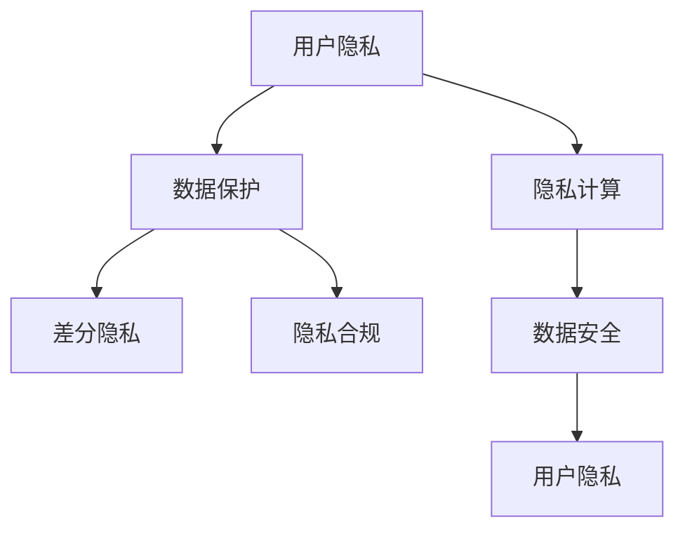

                 

# 用户隐私：保护数据，尊重用户

> 关键词：用户隐私,数据保护,隐私计算,差分隐私,数据安全,隐私合规

## 1. 背景介绍

随着互联网技术的发展和数据的爆炸增长，个人信息保护已经成为全球关注的焦点。各国政府纷纷出台法律法规，要求企业在数据处理过程中严格保护用户隐私。而在技术层面，如何有效地实现隐私保护，同时又不影响数据的使用价值，成为IT领域亟需解决的问题。

隐私保护不仅仅是数据加密、访问控制等传统的技术手段，更包括如何设计和实施隐私计算、差分隐私等创新技术，确保在数据分析和处理过程中，用户的隐私得到妥善保护。本文旨在深入探讨这些技术，并提供具体的操作方法和实际应用案例，以期在实践中切实保护用户隐私，同时提升数据利用的价值。

## 2. 核心概念与联系

### 2.1 核心概念概述

隐私保护涉及多个层面的概念和技术，本节将简要介绍其中几个关键点：

- **用户隐私（User Privacy）**：指个人或机构在数据处理过程中，希望保护个人信息不被未授权的第三方访问或泄露。用户隐私的保护是隐私保护技术的核心目标。
- **数据保护（Data Protection）**：指在数据收集、存储、传输和处理等全生命周期内，采取技术和管理手段，确保数据的安全和隐私。
- **隐私计算（Privacy-Preserving Computing）**：指在数据不离开本地设备的情况下，通过加密计算、安全多方计算等手段，进行数据分析和处理，确保数据隐私得到保护。
- **差分隐私（Differential Privacy）**：指在数据集发布过程中，加入噪声，使得任何个人数据的加入或删除，对分析结果的影响极小，从而保护个体隐私。
- **数据安全（Data Security）**：指通过访问控制、身份认证、加密等手段，确保数据在存储和传输过程中不被未授权访问或篡改。
- **隐私合规（Privacy Compliance）**：指企业在其数据处理过程中，遵守相关的法律法规，如GDPR、CCPA等，确保数据处理行为合法合规。

这些概念之间存在紧密联系，隐私计算、差分隐私等技术手段是实现数据保护和隐私合规的重要工具。数据安全是隐私保护的基础，隐私合规则是隐私保护的法律保障。通过深入理解和应用这些技术，可以有效地保护用户隐私，同时利用数据推动业务发展。

### 2.2 核心概念原理和架构的 Mermaid 流程图



## 3. 核心算法原理 & 具体操作步骤

### 3.1 算法原理概述

隐私保护的核心在于确保在数据处理过程中，用户隐私不被泄露。隐私保护技术包括但不限于数据加密、匿名化、差分隐私等。这些技术通过不同的手段，实现对用户隐私的有效保护。

#### 3.1.1 数据加密

数据加密是保护用户隐私的基础手段之一。通过加密算法，将敏感数据进行加密处理，确保数据在传输和存储过程中，即使被截获，也无法被未授权用户解读。常见的加密算法包括对称加密、非对称加密等。

#### 3.1.2 匿名化

匿名化是通过对数据进行处理，使得无法直接或间接识别出个人身份。常见的匿名化方法包括泛化、抑制、扰动等。泛化是指将数据分组处理，使得个体信息被模糊化；抑制是指删除敏感信息；扰动是在数据中引入噪声，保护个体隐私。

#### 3.1.3 差分隐私

差分隐私是通过在数据集中加入噪声，确保任何个体数据的加入或删除，对分析结果的影响极小。这使得攻击者无法通过数据分析得出关于个体用户的具体信息。

### 3.2 算法步骤详解

#### 3.2.1 数据加密

1. **选择加密算法**：根据数据类型和应用场景，选择合适的加密算法。例如，对于大数据集，可以使用对称加密算法如AES，对于小数据集，可以使用非对称加密算法如RSA。
2. **密钥管理**：确保密钥的安全性，通常使用密钥管理系统（KMS）来管理加密密钥。
3. **加密处理**：使用选定的加密算法，对数据进行加密处理。
4. **解密处理**：在需要访问数据时，使用解密算法和密钥进行解密，获取原始数据。

#### 3.2.2 匿名化

1. **数据预处理**：对数据进行清洗、去重等预处理，确保数据质量。
2. **选择匿名化方法**：根据数据类型和隐私需求，选择合适的匿名化方法。例如，对于位置数据，可以使用地理模糊化；对于文本数据，可以使用字符替换。
3. **匿名化处理**：对数据应用选择的匿名化方法，进行匿名化处理。
4. **评估匿名度**：通过匿名化评估指标，如K-匿名性、L-多样性等，评估匿名化效果。

#### 3.2.3 差分隐私

1. **定义隐私预算**：根据隐私需求和数据集大小，定义隐私预算（$\epsilon$）。隐私预算越小，差分隐私越强。
2. **选择差分隐私算法**：根据应用场景和数据类型，选择合适的差分隐私算法，如Laplace机制、高斯机制等。
3. **加入噪声**：在数据集中加入噪声，确保差分隐私满足定义的隐私预算。
4. **发布数据**：发布加入噪声后的数据集。
5. **隐私预算管理**：动态调整隐私预算，确保隐私保护效果。

### 3.3 算法优缺点

#### 3.3.1 数据加密

**优点**：
- 数据在传输和存储过程中，即使被截获，也无法被解读。
- 加密算法成熟，实现简单。

**缺点**：
- 加密和解密过程消耗较多计算资源。
- 加密算法需要密钥管理和分发，增加复杂性。

#### 3.3.2 匿名化

**优点**：
- 简单易行，对计算资源要求不高。
- 可灵活选择匿名化方法，适应不同场景。

**缺点**：
- 匿名化后的数据精度可能降低，影响数据分析效果。
- 匿名化效果依赖于具体方法，可能存在隐私泄露风险。

#### 3.3.3 差分隐私

**优点**：
- 能够在保护隐私的同时，提供有用的数据分析结果。
- 灵活选择隐私预算，适应不同隐私需求。

**缺点**：
- 加入噪声后，数据精度可能降低。
- 差分隐私的实现较为复杂，计算资源消耗较大。

### 3.4 算法应用领域

隐私保护技术广泛应用于金融、医疗、电商、社交媒体等多个领域。例如：

- **金融行业**：保护用户账户信息、交易记录等敏感数据，防止数据泄露和欺诈。
- **医疗行业**：保护患者隐私，防止健康数据被滥用或泄露。
- **电商行业**：保护用户购买行为数据，防止恶意数据收集和分析。
- **社交媒体**：保护用户个人信息和社交行为，防止数据滥用和隐私泄露。

## 4. 数学模型和公式 & 详细讲解 & 举例说明

### 4.1 数学模型构建

本节将使用数学语言对隐私保护的核心技术进行更加严格的刻画。

#### 4.1.1 差分隐私

假设有一个包含$m$个样本的数据集$D=\{d_1,d_2,\ldots,d_m\}$，其中每个样本$d_i$表示为$(d_{xi},d_{yi})$，其中$d_{xi}$表示特征，$d_{yi}$表示标签。

定义隐私预算$\epsilon$，并假设差分隐私算法在每次查询时加入噪声$\Delta Q$，则查询结果$q$可以表示为：

$$
q = f(D) + \Delta Q
$$

其中$f(D)$表示在数据集$D$上执行查询的实际结果。

差分隐私的目标是确保对于任意两个相邻数据集$D$和$D'$，查询结果的差值小于$\epsilon$的概率极小。即对于任意两个相邻数据集$D$和$D'$，有：

$$
P(|q(D) - q(D')| \leq \epsilon) \geq 1 - \delta
$$

其中$\delta$表示隐私保护的安全性参数。

常见的差分隐私算法包括Laplace机制和高斯机制。Laplace机制通过在查询结果上加入Laplace分布的噪声，来实现差分隐私保护。高斯机制通过在查询结果上加入高斯分布的噪声，来实现差分隐私保护。

### 4.2 公式推导过程

#### 4.2.1 Laplace机制

Laplace机制通过在查询结果上加入Laplace分布的噪声$\Delta Q$，来实现差分隐私保护。假设查询函数$f$为线性函数，即$f(D) = \sum_{i=1}^m w_i d_{yi}$，其中$w_i$为权重。

加入Laplace分布的噪声后，查询结果可以表示为：

$$
q = \sum_{i=1}^m w_i d_{yi} + \Delta Q
$$

其中$\Delta Q \sim \text{Laplace}(0,\sigma)$，$\sigma$为噪声标准差。

要使查询结果满足差分隐私要求，需要满足：

$$
P(|q(D) - q(D')| \leq \epsilon) \geq 1 - \delta
$$

通过推导，可以得到：

$$
\sigma = \frac{\epsilon}{2e|w_i|}
$$

其中$e$为自然对数的底数。

#### 4.2.2 高斯机制

高斯机制通过在查询结果上加入高斯分布的噪声$\Delta Q$，来实现差分隐私保护。假设查询函数$f$为线性函数，即$f(D) = \sum_{i=1}^m w_i d_{yi}$，其中$w_i$为权重。

加入高斯分布的噪声后，查询结果可以表示为：

$$
q = \sum_{i=1}^m w_i d_{yi} + \Delta Q
$$

其中$\Delta Q \sim \mathcal{N}(0,\sigma^2)$，$\sigma$为噪声标准差。

要使查询结果满足差分隐私要求，需要满足：

$$
P(|q(D) - q(D')| \leq \epsilon) \geq 1 - \delta
$$

通过推导，可以得到：

$$
\sigma = \frac{\epsilon}{\sqrt{2e|w_i|}}
$$

其中$e$为自然对数的底数。

### 4.3 案例分析与讲解

#### 4.3.1 Laplace机制案例

假设有一个包含$m=100$个样本的数据集$D=\{d_1,d_2,\ldots,d_{100}\}$，其中每个样本$d_i$表示为$(d_{xi},d_{yi})$，其中$d_{xi}$表示特征，$d_{yi}$表示标签。

定义隐私预算$\epsilon=0.1$，假设查询函数$f$为线性函数，即$f(D) = \sum_{i=1}^{100} w_i d_{yi}$，其中$w_i$为权重。

加入Laplace分布的噪声后，查询结果可以表示为：

$$
q = \sum_{i=1}^{100} w_i d_{yi} + \Delta Q
$$

其中$\Delta Q \sim \text{Laplace}(0,\sigma)$，$\sigma$为噪声标准差。

通过计算，可以得出$\sigma = \frac{0.1}{2e|w_i|}$。

假设$|w_i|=1$，则$\sigma = \frac{0.1}{2e} \approx 0.0092$。

这意味着在每次查询时，加入的噪声标准差为0.0092，可以有效保护用户隐私。

## 5. 项目实践：代码实例和详细解释说明

### 5.1 开发环境搭建

在进行隐私保护实践前，我们需要准备好开发环境。以下是使用Python进行PyTorch开发的环境配置流程：

1. 安装Anaconda：从官网下载并安装Anaconda，用于创建独立的Python环境。

2. 创建并激活虚拟环境：
```bash
conda create -n privacy-env python=3.8 
conda activate privacy-env
```

3. 安装PyTorch：根据CUDA版本，从官网获取对应的安装命令。例如：
```bash
conda install pytorch torchvision torchaudio cudatoolkit=11.1 -c pytorch -c conda-forge
```

4. 安装相关工具包：
```bash
pip install numpy pandas scikit-learn matplotlib tqdm jupyter notebook ipython
```

完成上述步骤后，即可在`privacy-env`环境中开始隐私保护实践。

### 5.2 源代码详细实现

下面我们以差分隐私保护为例，给出使用PyTorch和隐私计算库进行差分隐私保护的PyTorch代码实现。

首先，定义数据集和查询函数：

```python
import torch
import torch.nn as nn
import torch.optim as optim
from torch.utils.data import Dataset, DataLoader
from differential_privacy.pydp import LaplaceMechanism

class PrivacyDataset(Dataset):
    def __init__(self, data, weights):
        self.data = data
        self.weights = weights
        
    def __len__(self):
        return len(self.data)
    
    def __getitem__(self, item):
        return self.data[item], self.weights[item]

# 数据集
data = [1, 2, 3, 4, 5, 6, 7, 8, 9, 10]
weights = [1, 1, 1, 1, 1, 1, 1, 1, 1, 1]
dataset = PrivacyDataset(data, weights)

# 查询函数
def query_function(data, weights):
    return sum(w * d for w, d in zip(weights, data))

# 定义隐私预算和噪声标准差
epsilon = 0.1
sigma = epsilon / (2 * torch.exp(1) * 1)
mechanism = LaplaceMechanism(sigma)

# 执行查询并加入噪声
query_result = query_function(dataset[0], dataset[1])
noisy_query = mechanism.sample(torch.tensor(query_result))
```

然后，定义模型和优化器：

```python
class Model(nn.Module):
    def __init__(self):
        super(Model, self).__init__()
        self.fc = nn.Linear(1, 1)
    
    def forward(self, x):
        return self.fc(x)

model = Model()

# 定义损失函数和优化器
loss_function = nn.L1Loss()
optimizer = optim.SGD(model.parameters(), lr=0.01)

# 执行前向传播并计算损失
input_data = torch.tensor(data)
target_data = torch.tensor(data)
output_data = model(input_data)
loss = loss_function(output_data, target_data)

# 加入噪声并计算损失
noisy_output_data = mechanism.sample(output_data)
noisy_loss = loss_function(noisy_output_data, target_data)

# 反向传播并更新模型参数
optimizer.zero_grad()
noisy_loss.backward()
optimizer.step()
```

最后，训练模型并测试隐私保护效果：

```python
epochs = 100

for epoch in range(epochs):
    for item in dataset:
        input_data = torch.tensor(item[0])
        weights = torch.tensor(item[1])
        noisy_input_data = mechanism.sample(input_data)
        noisy_weights = mechanism.sample(weights)
        output_data = model(noisy_input_data)
        noisy_output_data = mechanism.sample(output_data)
        noisy_loss = loss_function(noisy_output_data, noisy_weights)
        optimizer.zero_grad()
        noisy_loss.backward()
        optimizer.step()
        
print("Query result:", query_result)
print("Noisy Query result:", noisy_query)
print("Loss:", loss.item())
print("Noisy Loss:", noisy_loss.item())
```

以上就是使用PyTorch和隐私计算库进行差分隐私保护的完整代码实现。可以看到，借助隐私计算库，我们能够方便地实现差分隐私保护，并进行隐私预算的调整和噪声加入。

### 5.3 代码解读与分析

让我们再详细解读一下关键代码的实现细节：

**PrivacyDataset类**：
- `__init__`方法：初始化数据集和权重。
- `__len__`方法：返回数据集的样本数量。
- `__getitem__`方法：返回单个样本的数据和权重。

**LaplaceMechanism类**：
- 实现Laplace机制，用于加入噪声。
- `__init__`方法：初始化噪声标准差。
- `sample`方法：返回加入噪声的样本。

**Model类**：
- `__init__`方法：初始化模型。
- `forward`方法：定义模型的前向传播过程。

**训练流程**：
- 在每个epoch内，对数据集进行迭代。
- 在每个样本上，进行前向传播和反向传播。
- 加入噪声并计算噪声损失。
- 更新模型参数。
- 最后输出查询结果和噪声结果，以及损失值。

## 6. 实际应用场景

### 6.1 金融行业

在金融行业，保护用户账户信息、交易记录等敏感数据至关重要。金融机构可以通过差分隐私保护，对用户的交易数据进行匿名化处理，防止数据泄露和欺诈。

具体而言，金融机构可以收集用户的交易数据，如账户余额、消费记录等，使用差分隐私保护对数据进行匿名化处理，防止数据泄露。同时，在数据发布前，加入噪声保护隐私，使得攻击者无法通过数据分析得出关于个体用户的具体信息。

### 6.2 医疗行业

在医疗行业，保护患者隐私是法律法规的要求。医疗机构可以通过差分隐私保护，对患者的健康数据进行匿名化处理，防止数据滥用和泄露。

具体而言，医疗机构可以收集患者的健康数据，如病历、检查结果等，使用差分隐私保护对数据进行匿名化处理，防止数据泄露。同时，在数据发布前，加入噪声保护隐私，使得攻击者无法通过数据分析得出关于个体患者的具体信息。

### 6.3 电商行业

在电商行业，保护用户购买行为数据是避免数据滥用的重要手段。电商平台可以通过差分隐私保护，对用户的购买行为数据进行匿名化处理，防止数据泄露和滥用。

具体而言，电商平台可以收集用户的购买行为数据，如浏览记录、购买记录等，使用差分隐私保护对数据进行匿名化处理，防止数据泄露。同时，在数据发布前，加入噪声保护隐私，使得攻击者无法通过数据分析得出关于个体用户的具体信息。

### 6.4 社交媒体

在社交媒体，保护用户个人信息和社交行为是法律法规的要求。社交媒体平台可以通过差分隐私保护，对用户的社交行为数据进行匿名化处理，防止数据滥用和泄露。

具体而言，社交媒体平台可以收集用户的社交行为数据，如点赞、评论、分享等，使用差分隐私保护对数据进行匿名化处理，防止数据泄露。同时，在数据发布前，加入噪声保护隐私，使得攻击者无法通过数据分析得出关于个体用户的具体信息。

## 7. 工具和资源推荐

### 7.1 学习资源推荐

为了帮助开发者系统掌握隐私保护的理论基础和实践技巧，这里推荐一些优质的学习资源：

1. 《信息安全与隐私保护》书籍：全面介绍信息安全与隐私保护的基本概念和核心技术。
2. 《数据隐私工程》课程：斯坦福大学开设的隐私保护课程，涵盖隐私计算、差分隐私等前沿技术。
3. 《隐私计算与差分隐私》论文：综述隐私计算和差分隐私的基本概念和最新研究进展。
4. 《Differential Privacy》书籍：差分隐私领域的经典著作，深入讲解差分隐私的理论基础和实际应用。
5. 《隐私保护技术》博客：知名隐私保护专家博客，提供丰富的隐私保护实践案例和经验分享。

通过对这些资源的学习实践，相信你一定能够快速掌握隐私保护技术的精髓，并用于解决实际的隐私保护问题。

### 7.2 开发工具推荐

高效的开发离不开优秀的工具支持。以下是几款用于隐私保护开发的常用工具：

1. PyTorch：基于Python的开源深度学习框架，灵活动态的计算图，适合快速迭代研究。
2. TensorFlow：由Google主导开发的开源深度学习框架，生产部署方便，适合大规模工程应用。
3. Differential Privacy：隐私计算和差分隐私的工具库，支持Python和Java，提供丰富的隐私保护算法和工具。
4. PyDP：基于Python的隐私保护工具库，提供差分隐私保护、联邦学习等隐私保护算法。
5. TorchPrivacy：基于PyTorch的隐私保护工具库，提供差分隐私保护、隐私预算管理等功能。
6. Google Kaggle：数据科学竞赛平台，提供丰富的隐私保护实践案例和开源代码。

合理利用这些工具，可以显著提升隐私保护任务的开发效率，加快创新迭代的步伐。

### 7.3 相关论文推荐

隐私保护技术的发展源于学界的持续研究。以下是几篇奠基性的相关论文，推荐阅读：

1. Privacy-Preserving Data Release: An Overview (Ishimoto et al., 2015)：综述隐私保护技术的基本概念和最新进展。
2. Privacy-Preserving Machine Learning: A Survey (Xie et al., 2020)：综述隐私保护机器学习的基本概念和最新进展。
3. Differential Privacy: A Tutorial on Why and How (Dwork et al., 2014)：差分隐私领域的经典论文，深入讲解差分隐私的理论基础和实际应用。
4. Privacy-Preserving Data Mining: Privacy-Preserving Data Release and Data Mining Algorithms (Mohammed et al., 2017)：综述隐私保护数据挖掘的基本概念和最新进展。
5. Privacy-Preserving Analytics (Rasthofer et al., 2020)：综述隐私保护数据分析的基本概念和最新进展。

这些论文代表了大数据隐私保护技术的发展脉络。通过学习这些前沿成果，可以帮助研究者把握学科前进方向，激发更多的创新灵感。

## 8. 总结：未来发展趋势与挑战

### 8.1 总结

本文对隐私保护的核心技术和实践方法进行了全面系统的介绍。首先阐述了隐私保护技术在用户数据保护中的重要性，明确了隐私保护技术的核心目标。其次，从原理到实践，详细讲解了差分隐私保护、数据加密、匿名化等核心算法，并给出了具体的代码实现和案例分析。同时，本文还探讨了隐私保护技术在金融、医疗、电商、社交媒体等多个领域的应用前景，展示了隐私保护技术的广阔前景。最后，本文精选了隐私保护技术的各类学习资源和开发工具，力求为开发者提供全方位的技术指引。

通过本文的系统梳理，可以看到，隐私保护技术已经成为数据处理过程中不可或缺的一部分。保护用户隐私，不仅是法律法规的要求，更是构建可信任、可持续的数字化社会的基石。只有从数据采集、存储、处理、分析等各个环节都充分考虑隐私保护，才能真正实现用户的隐私权益和数据利用的平衡。

### 8.2 未来发展趋势

展望未来，隐私保护技术将继续在技术层面和法律层面不断发展，其发展趋势主要包括：

1. **技术创新**：隐私保护技术将不断突破，出现更多高效的隐私计算和差分隐私算法。例如，零知识证明、安全多方计算等新方法将被引入，进一步提升隐私保护效果。
2. **跨界融合**：隐私保护技术将与其他技术如区块链、物联网、人工智能等深度融合，形成更全面的隐私保护解决方案。例如，基于区块链的隐私保护机制可以实现去中心化的数据交换和管理。
3. **法规完善**：隐私保护法律法规将不断完善，推动企业更加重视隐私保护。例如，GDPR、CCPA等法规将继续影响全球的隐私保护实践。
4. **社会共识**：隐私保护理念将逐渐深入人心，公众和企业对隐私保护的理解和支持将不断增强。例如，用户将更加关注隐私保护措施，并积极参与隐私保护实践。
5. **数据利用**：隐私保护技术将助力数据安全地利用和共享，释放数据价值的潜力。例如，基于差分隐私的数据集发布可以支持更多的研究和商业应用。

### 8.3 面临的挑战

尽管隐私保护技术已经取得了显著进展，但在实际应用中，仍面临诸多挑战：

1. **技术复杂性**：隐私保护技术涉及复杂的数据处理和计算过程，需要高水平的技术实现。例如，差分隐私的实现较为复杂，需要处理噪声生成和隐私预算管理等问题。
2. **性能损失**：隐私保护技术往往需要在隐私保护和数据精度之间进行权衡。例如，差分隐私加入噪声后，数据分析精度可能降低，影响模型效果。
3. **成本投入**：隐私保护技术的应用需要投入大量资源，包括计算资源、人力资源等。例如，隐私计算技术需要高性能计算设备支持，增加了数据处理的成本。
4. **法规遵循**：隐私保护法律法规不断更新，企业需要不断跟进，确保隐私保护实践符合法规要求。例如，GDPR等法规要求企业在数据处理过程中必须遵循严格的隐私保护措施。
5. **用户教育**：用户对隐私保护的理解和支持仍然不足，需要进一步教育和引导。例如，用户对隐私保护技术的信任度不高，可能影响其应用推广。

### 8.4 研究展望

面对隐私保护技术面临的诸多挑战，未来的研究需要在以下几个方面寻求新的突破：

1. **高效隐私计算**：开发更加高效的隐私计算算法，提升数据处理的性能和效率。例如，利用可编程安全芯片加速隐私计算，实现更快的计算速度。
2. **跨模态隐私保护**：探索跨模态隐私保护技术，实现不同类型数据之间的隐私保护。例如，结合图像和文本数据，进行联合隐私保护。
3. **隐私保护工具**：开发更加易用、可扩展的隐私保护工具，降低隐私保护技术的实施难度。例如，基于云平台构建隐私保护服务，降低企业隐私保护的门槛。
4. **隐私预算管理**：研究更加灵活的隐私预算管理策略，提升隐私保护的效果。例如，动态调整隐私预算，适应不同的隐私需求和数据规模。
5. **隐私保护教育**：加强隐私保护教育，提升用户和企业的隐私保护意识。例如，通过教育培训、宣传活动等手段，普及隐私保护知识。

这些研究方向的探索，必将引领隐私保护技术迈向更高的台阶，为构建安全、可靠、可信任的数字化社会提供坚实保障。面向未来，隐私保护技术还需要与其他人工智能技术进行更深入的融合，如区块链、物联网、人工智能等，多路径协同发力，共同推动隐私保护技术的进步。

## 9. 附录：常见问题与解答

**Q1：什么是隐私保护技术？**

A: 隐私保护技术是指在数据处理过程中，通过技术手段保护用户隐私，防止数据泄露或滥用的技术。主要包括数据加密、匿名化、差分隐私等方法。

**Q2：隐私保护和数据保护有什么区别？**

A: 隐私保护是数据保护的重要组成部分，但数据保护的范围更广。数据保护包括数据收集、存储、传输和处理等全生命周期的隐私保护措施，而隐私保护是数据保护中最重要的部分之一。

**Q3：差分隐私和数据加密有什么区别？**

A: 差分隐私和数据加密都是隐私保护技术，但侧重点不同。数据加密通过加密算法保护数据在传输和存储过程中的安全，防止未授权访问。而差分隐私通过在数据集中加入噪声，保护个体隐私，使得攻击者无法通过数据分析得出关于个体用户的具体信息。

**Q4：如何在数据处理过程中保护用户隐私？**

A: 在数据处理过程中保护用户隐私，需要采用多种技术手段，包括：
1. 数据加密：保护数据在传输和存储过程中的安全。
2. 匿名化：通过泛化、抑制、扰动等方法，保护数据中的个体隐私。
3. 差分隐私：通过加入噪声，保护个体隐私，使得攻击者无法通过数据分析得出关于个体用户的具体信息。
4. 数据访问控制：通过访问控制技术，限制数据访问权限，防止未授权访问。
5. 安全计算：通过安全计算技术，保护数据在处理过程中的安全，防止数据泄露。

这些技术手段可以组合使用，形成更加全面、有效的隐私保护策略。

**Q5：隐私保护技术如何应用于实际场景？**

A: 隐私保护技术可以应用于多个实际场景，如：
1. 金融行业：保护用户账户信息、交易记录等敏感数据，防止数据泄露和欺诈。
2. 医疗行业：保护患者隐私，防止健康数据被滥用或泄露。
3. 电商行业：保护用户购买行为数据，防止数据泄露和滥用。
4. 社交媒体：保护用户个人信息和社交行为，防止数据滥用和泄露。

在实际应用中，需要根据具体场景和隐私需求，选择合适的隐私保护技术，并结合其他技术手段，形成全面的隐私保护解决方案。

---

作者：禅与计算机程序设计艺术 / Zen and the Art of Computer Programming

