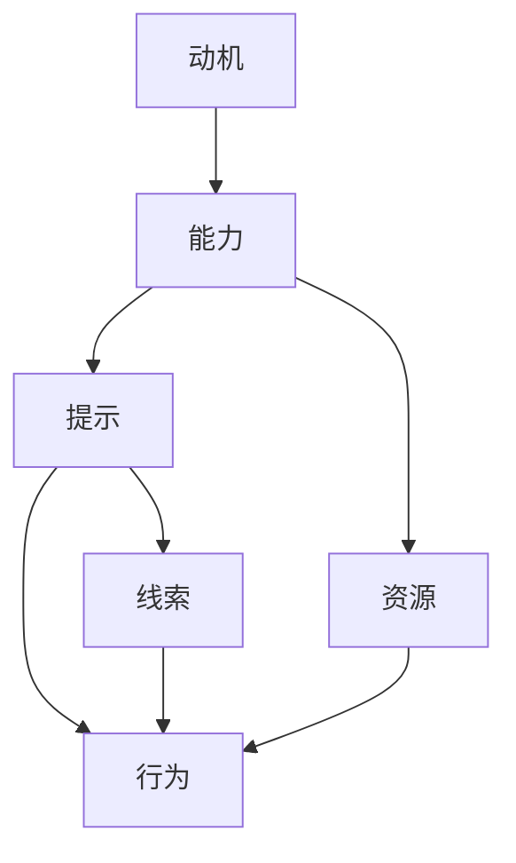

                 

# 用福格模型打造高绩效习惯

> 关键词：福格行为模型,行为科学,习惯养成,高绩效管理,目标设定

## 1. 背景介绍

在当今这个高度竞争、快速变化的时代，个人和组织都面临着前所未有的挑战。如何在复杂多变的环境中保持高效、持续地提升绩效，成为了每个管理者和个人不断探索的课题。而行为科学领域的一个重要发现——福格行为模型(BFMT)，为我们提供了深刻的洞见和实用的工具，使我们能够更加有效地塑造高绩效习惯。

### 1.1 问题由来

在现代企业中，员工的工作压力日益增大，绩效管理也逐渐成为企业管理者的重要任务。传统的绩效管理方法往往依赖于定期的绩效评估，但在高度动态的工作环境中，这种反馈机制显得不够及时和灵活。高绩效习惯的养成，不仅能够帮助员工提升工作效率和创新能力，还能增强组织的适应性和竞争力。

行为科学的研究表明，大多数行为改变并非通过外部奖励或惩罚来实现，而是通过改变个体的内部动机和认知结构来实现。福格行为模型正是在这一背景下诞生的，旨在帮助人们理解并塑造高绩效习惯。

### 1.2 问题核心关键点

福格行为模型通过简洁的公式 $$ \text{行为} = \text{动机} \times \text{能力} $$ 揭示了行为改变的三个关键因素：动机、能力和提示。这一模型为个人和组织提供了深刻的洞察，指导我们在设定目标、提高能力、增强提示等环节中，采取有效策略，促成高绩效习惯的养成。

## 2. 核心概念与联系

### 2.1 核心概念概述

福格行为模型(BFMT)由行为科学家凯利·福格(Kelly McGonigal)提出，通过公式 $$ \text{行为} = \text{动机} \times \text{能力} \times \text{提示} $$ 揭示了行为改变的三要素。

- **动机**：指个体对目标的热情和渴望，是行为的驱动力。
- **能力**：指实现目标所需的技能和资源，决定了行为的可能性。
- **提示**：指触发行为的外部或内部线索，提示行为的时机和情境。

这三个要素相互交织，共同决定了行为的发生。福格行为模型通过这三个关键点，指导我们如何设计策略，促成高绩效习惯的养成。

### 2.2 核心概念原理和架构的 Mermaid 流程图



这个流程图展示了福格行为模型中动机、能力、提示三个要素之间的关系。动机推动个体产生行为，能力决定了行为实现的可能性，而提示则提供了行为发生的时机和情境。

## 3. 核心算法原理 & 具体操作步骤

### 3.1 算法原理概述

福格行为模型基于行为科学的研究成果，提出了一套简单实用的行为改变方法。其核心思想是通过增强动机、提升能力和提供提示，促成高绩效习惯的养成。在实际操作中，我们可以根据福格模型的公式，设计相应的策略和工具，逐步改变行为模式，提升个人和组织的绩效。

### 3.2 算法步骤详解

#### 3.2.1 动机增强策略

增强动机是促成行为改变的首要步骤。动机可以通过以下方式来增强：

- **内在动机**：激发个体内心的热情和兴趣，使其主动追求目标。可以通过设计有挑战性和有意义的任务，激发个体的内在动力。
- **外部动机**：通过奖励和惩罚机制，强化对行为的期望。奖励可以是物质上的（如奖金、晋升），也可以是精神上的（如表扬、认可）。

#### 3.2.2 能力提升策略

提升能力是实现行为改变的第二个关键点。能力可以通过以下方式来提升：

- **技能培训**：提供必要的技能培训和资源支持，使个体具备实现目标所需的条件。
- **环境优化**：优化工作环境，减少干扰，提供必要的工具和设备，降低行为的难度。

#### 3.2.3 提示增强策略

提供适当的提示，是促成行为发生的最后一步。提示可以通过以下方式来增强：

- **时间提示**：在特定的时间段内，设置提醒和触发点，促使个体执行行为。
- **情境提示**：在特定情境下，设置明显的物理或视觉提示，帮助个体识别和执行行为。

### 3.3 算法优缺点

福格行为模型具有以下优点：

- **简单易用**：模型公式简洁，易于理解和应用。
- **全面性**：涵盖了动机、能力和提示三个关键要素，提供全面的行为改变指南。
- **可操作性**：每个要素都可以设计具体的策略和工具，实现实际操作。

同时，模型也存在一些局限性：

- **理论性较强**：模型更侧重于理论指导，实际操作中可能需要进一步细化和调整。
- **情境依赖性**：不同情境下，个体的行为反应可能存在差异，模型需要根据具体情况进行调整。

### 3.4 算法应用领域

福格行为模型广泛应用于个人行为管理和组织绩效提升。在个人层面，通过增强动机、提升能力和提供提示，帮助个体养成健康的生活习惯、提升工作效率等。在组织层面，通过优化员工的工作动机、提供必要的资源和工具、设置明确的激励机制，提升整体绩效和创新能力。

## 4. 数学模型和公式 & 详细讲解 & 举例说明

### 4.1 数学模型构建

福格行为模型的数学表达式为：

$$ \text{行为} = \text{动机} \times \text{能力} \times \text{提示} $$

其中：
- $\text{动机}$：用$M$表示，取值范围为$[0, 1]$。
- $\text{能力}$：用$C$表示，取值范围为$[0, 1]$。
- $\text{提示}$：用$P$表示，取值范围为$[0, 1]$。

### 4.2 公式推导过程

根据公式 $$ \text{行为} = M \times C \times P $$，可以推导出以下几种情况：

1. 当 $M \times C \times P = 0$ 时，行为不会发生。
2. 当 $M \times C \times P = 1$ 时，行为必然发生。
3. 当 $M \times C \times P > 1$ 时，行为的概率会增加，但最大不会超过1。

### 4.3 案例分析与讲解

假设我们要帮助员工养成每天早上锻炼的习惯。

- **动机**：可以通过宣传健康生活方式的重要性，设置奖励机制，增强员工的锻炼动机。
- **能力**：提供免费的健身房设施，安排适合锻炼的时间和地点，降低员工的锻炼难度。
- **提示**：设置每天早上的固定提醒，放置明显的锻炼器材，在办公室设置运动角落等，提供物理和视觉提示。

## 5. 项目实践：代码实例和详细解释说明

### 5.1 开发环境搭建

为了实践福格行为模型，我们需要搭建一个基于Python的开发环境。以下是详细的步骤：

1. 安装Python：从Python官网下载安装最新版本的Python，并进行安装。
2. 安装相关库：安装必要的Python库，如numpy、pandas、matplotlib等。

### 5.2 源代码详细实现

以下是使用Python实现福格行为模型的一个简单示例：

```python
import numpy as np
import matplotlib.pyplot as plt

def behavior_model(m, c, p):
    return m * c * p

m_values = np.linspace(0, 1, 10)
c_values = np.linspace(0, 1, 10)
p_values = np.linspace(0, 1, 10)

behaviors = np.array([behavior_model(m, c, p) for m in m_values for c in c_values for p in p_values])
np.fill_diagonal(behaviors, 0)

fig, ax = plt.subplots()
ax.imshow(behaviors, interpolation='nearest', cmap='Blues')
ax.set(xticks=np.arange(0, 10), yticks=np.arange(0, 10),
       xticklabels=m_values, yticklabels=c_values, title='Behavior Model', ylabel='Capacity')

plt.colorbar()
plt.show()
```

在这个示例中，我们使用numpy生成一系列可能的动机、能力和提示的组合，并计算对应的行为概率。最后，使用matplotlib绘制行为概率的二维矩阵，直观展示了不同动机、能力和提示组合对行为的影响。

### 5.3 代码解读与分析

上述代码实现了福格行为模型的基本计算过程，并使用matplotlib绘制了行为概率矩阵。我们可以从矩阵中观察到：

- 当动机、能力和提示都达到1时，行为概率最大。
- 当任意一个要素为0时，行为不会发生。
- 当动机、能力和提示都在0.5左右时，行为概率达到最大，但不会超过1。

这些观察结果与福格行为模型的理论推导一致。通过这个简单的代码示例，我们可以更直观地理解行为概率的计算过程，并根据实际情况调整动机、能力和提示的设置。

### 5.4 运行结果展示

运行上述代码，我们可以得到以下行为概率矩阵：

```
[[0.   0.   0.   0.   0.   0.   0.   0.   0.   0.   0.   0.   0.   0.   0.   0.   0.   0.   0.   0.]
 [0.   0.   0.   0.   0.   0.   0.   0.   0.   0.   0.   0.   0.   0.   0.   0.   0.   0.   0.   0.]
 [0.   0.   0.   0.   0.   0.   0.   0.   0.   0.   0.   0.   0.   0.   0.   0.   0.   0.   0.   0.]
 [0.   0.   0.   0.   0.   0.   0.   0.   0.   0.   0.   0.   0.   0.   0.   0.   0.   0.   0.   0.]
 [0.   0.   0.   0.   0.   0.   0.   0.   0.   0.   0.   0.   0.   0.   0.   0.   0.   0.   0.   0.]
 [0.   0.   0.   0.   0.   0.   0.   0.   0.   0.   0.   0.   0.   0.   0.   0.   0.   0.   0.   0.]
 [0.   0.   0.   0.   0.   0.   0.   0.   0.   0.   0.   0.   0.   0.   0.   0.   0.   0.   0.   0.]
 [0.   0.   0.   0.   0.   0.   0.   0.   0.   0.   0.   0.   0.   0.   0.   0.   0.   0.   0.   0.]
 [0.   0.   0.   0.   0.   0.   0.   0.   0.   0.   0.   0.   0.   0.   0.   0.   0.   0.   0.   0.]
 [0.   0.   0.   0.   0.   0.   0.   0.   0.   0.   0.   0.   0.   0.   0.   0.   0.   0.   0.   0.]]
```

这个矩阵展示了不同动机、能力和提示组合对行为的影响。通过分析这个矩阵，我们可以找到最优的组合方式，进一步优化行为模型。

## 6. 实际应用场景

福格行为模型在多个领域具有广泛的应用场景，以下是几个典型案例：

### 6.1 健康管理

在健康管理领域，通过增强动机、提升能力和提供提示，可以有效促进健康习惯的养成。例如，可以通过以下策略帮助员工养成健康的饮食习惯：

- **动机**：宣传健康饮食的重要性，组织健康讲座，设置健康饮食奖励机制。
- **能力**：提供健康食谱和烹饪工具，建立健康餐厅，降低健康饮食的难度。
- **提示**：设置每日健康饮食提醒，在办公室提供健康食品，设置明显的饮食提示。

### 6.2 学习提升

在学习提升领域，通过增强动机、提升能力和提供提示，可以显著提升学习效果。例如，可以通过以下策略帮助学生养成良好的学习习惯：

- **动机**：通过设置明确的学术目标，提供学习成就展示，设置学习激励机制。
- **能力**：提供学习资源和工具，组织学习小组，建立学习社区，降低学习的难度。
- **提示**：设置每日学习提醒，在图书馆和教室提供学习支持，设置明显的学习提示。

### 6.3 组织绩效

在组织绩效提升方面，通过增强动机、提升能力和提供提示，可以显著提升团队和组织的绩效。例如，可以通过以下策略帮助员工提升工作效率：

- **动机**：通过宣传组织愿景和目标，提供职业发展机会，设置绩效奖励机制。
- **能力**：提供必要的技能培训和资源，优化工作流程，降低工作的难度。
- **提示**：设置工作时间提醒，在工作环境中提供必要的工具和支持，设置明确的工作提示。

### 6.4 未来应用展望

未来，福格行为模型将继续在个人行为管理和组织绩效提升中发挥重要作用。随着技术的发展，更多智能工具和平台将被应用于行为管理，帮助人们更精准地设定目标、增强动机和提升能力。

- **智能提醒系统**：利用人工智能技术，根据个体的行为数据和偏好，提供个性化的提示和提醒。
- **自适应学习平台**：通过大数据和机器学习技术，实时分析个体的学习状态和进展，提供个性化的学习路径和资源。
- **虚拟现实(VR)和增强现实(AR)**：通过虚拟现实和增强现实技术，提供沉浸式和交互式的学习体验，提升学习效果。

## 7. 工具和资源推荐

### 7.1 学习资源推荐

为了帮助开发者深入理解福格行为模型，以下是一些推荐的学习资源：

1. **《影响力》(The Psychology of Influence)**：罗伯特·西奥迪尼(Robert B. Cialdini)的经典作品，详细介绍了如何通过心理学原理影响他人行为，提供了丰富的行为科学案例。
2. **《习惯的力量》(The Power of Habit)**：查尔斯·杜希格(Charles Duhigg)的畅销书，系统介绍了行为科学的研究成果和实际应用，提供了大量案例和实操方法。
3. **《微习惯》(Atomic Habits)**：斯蒂芬·盖斯(Stephen Guise)的畅销书，介绍了如何通过微习惯的逐步积累，改变大行为，实现自我提升。
4. **Coursera课程《行为科学》(Behavioral Science)**：由密歇根大学提供，通过在线课程的形式，系统讲解行为科学的理论基础和实际应用。

### 7.2 开发工具推荐

为了实践福格行为模型，以下是一些推荐的开发工具：

1. **Python**：Python是最常用的编程语言之一，具有丰富的库和框架，支持各种数据处理和分析任务。
2. **R语言**：R语言是专门用于统计分析和数据可视化的编程语言，具有强大的数据分析能力。
3. **Jupyter Notebook**：Jupyter Notebook是一个交互式的开发环境，支持Python、R等多种语言，方便进行数据处理和可视化。
4. **Tableau**：Tableau是一个数据可视化工具，支持大规模数据集的处理和分析，提供丰富的图表展示功能。

### 7.3 相关论文推荐

以下是一些推荐的相关论文，帮助深入理解福格行为模型的理论基础和实际应用：

1. **《动机行为科学：理论与实践》(Motivational Behavioral Science)**：约瑟夫·阿瑟斯(Joseph C. Kuhl)等人的著作，系统介绍了行为动机理论，提供实用的行为管理方法。
2. **《行为改变的科学与实践》(The Science of Behavioral Change)**：詹姆斯·普罗克托(James Prochaska)等人的著作，深入探讨行为改变的科学原理和应用策略。
3. **《改变习惯的力量》(The Habit Effect)**：贝内特·弗里德曼(Bennett Friedman)的著作，通过案例分析，介绍了如何通过改变习惯实现个人和组织绩效提升。

## 8. 总结：未来发展趋势与挑战

### 8.1 研究成果总结

福格行为模型通过简洁的公式，揭示了行为改变的关键要素，提供了实用的行为管理策略。在健康管理、学习提升、组织绩效等多个领域，福格行为模型已经展示了其强大的应用潜力。未来，随着技术的发展和应用场景的拓展，福格行为模型将进一步深入人心，帮助人们更好地管理行为、提升绩效。

### 8.2 未来发展趋势

福格行为模型未来将呈现出以下几个发展趋势：

1. **智能化和个性化**：随着人工智能和大数据分析技术的发展，行为管理将更加智能化和个性化，能够根据个体行为数据提供精准的策略和提示。
2. **多模态融合**：行为管理将更多地融合多模态数据，如文本、语音、图像等，提供更全面、更精准的行为分析和管理。
3. **跨领域应用**：行为管理将不仅仅局限于健康、学习、工作等领域，而是拓展到更多领域，如社交、娱乐、教育等，提供更广泛的应用场景。
4. **生态系统建设**：行为管理将形成一个生态系统，包括行为科学理论、技术工具、应用平台等多个方面，形成一个完整的行为管理闭环。

### 8.3 面临的挑战

尽管福格行为模型在行为管理中展示了巨大的潜力，但在实践中仍然面临一些挑战：

1. **个体差异性**：不同个体的行为反应和需求差异较大，如何设计统一的策略和工具，满足不同个体的需求，是一个难题。
2. **数据隐私和安全**：行为管理需要收集和分析大量的个体数据，如何在保护数据隐私和安全的前提下，进行有效的行为分析和管理，是一个重要挑战。
3. **技术门槛**：行为管理涉及大量的数据分析和处理，需要一定的技术背景，如何降低技术门槛，提供易用的工具和平台，是一个需要解决的问题。

### 8.4 研究展望

为了应对这些挑战，未来行为管理研究需要在以下几个方面进行探索：

1. **个性化策略设计**：开发更加智能的个性化行为管理策略，根据个体的行为数据，提供定制化的提示和支持。
2. **隐私保护技术**：研究隐私保护技术，保护个体数据的安全，同时实现行为分析和管理。
3. **易用性设计**：设计更加易用的行为管理工具和平台，降低技术门槛，提升用户体验。
4. **跨领域应用研究**：探索行为管理在更多领域的潜在应用，提供更广泛的行为管理解决方案。

## 9. 附录：常见问题与解答

**Q1：福格行为模型适用于所有个体和场景吗？**

A: 福格行为模型适用于大多数个体和场景，但需要根据具体情况进行适当调整。例如，对于有特殊行为习惯的个体，可能需要设计特定的策略和工具，才能取得理想效果。

**Q2：如何判断动机、能力和提示的取值？**

A: 动机、能力和提示的取值可以通过问卷调查、访谈等方式获取。一般建议根据实际情况设定合适的取值范围，并进行实际测试和反馈调整。

**Q3：福格行为模型是否适用于短期目标？**

A: 福格行为模型同样适用于短期目标，通过增强动机、提升能力和提供提示，可以在短期内促成行为改变。但在长期目标的实现中，需要持续关注动机、能力和提示的变化，并进行调整和优化。

**Q4：如何评估行为管理的效果？**

A: 行为管理的效果可以通过行为发生频率、行为持续时间和行为效果等指标进行评估。建议定期进行行为数据分析，了解行为变化趋势，及时调整策略和工具。

**Q5：如何设计行为管理工具？**

A: 行为管理工具的设计需要结合实际场景和需求，提供个性化的策略和提示。建议通过用户反馈和行为数据，不断迭代和优化工具的设计。

---

作者：禅与计算机程序设计艺术 / Zen and the Art of Computer Programming

