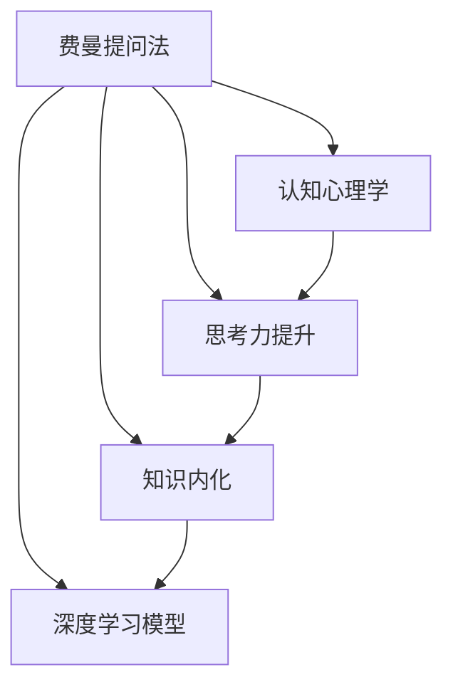

                 

# 用费曼提问法提升学习深度

> 关键词：费曼学习法,深度学习,知识内化,认知心理学,思考力提升,问题驱动

## 1. 背景介绍

### 1.1 问题由来
随着深度学习的快速发展，掌握深度学习已经成为许多数据科学家的必备技能。然而，深度学习理论和模型的复杂性，使得学习过程变得困难和容易忘却。如何在保证学习效率的同时，提升学习深度，内化复杂模型和理论，成为摆在每个学习者面前的挑战。费曼提问法（Feynman Technique）作为一种高效的学习方法，通过深入提问来理解和掌握复杂知识，正在逐渐被深度学习领域的研究者所采用。

### 1.2 问题核心关键点
费曼提问法由诺贝尔物理学奖得主理查德·费曼提出，是一种通过自问自答的形式，帮助学习者深入理解知识的认知技巧。该方法的核心思想是：将复杂概念拆解成多个简单问题，并逐步深入探索每个问题的答案，最终实现对知识的深入掌握和内化。深度学习模型同样复杂，通过类似的方法，学习者能够更好地理解模型，提升学习深度。

## 2. 核心概念与联系

### 2.1 核心概念概述

为了更好地理解费曼提问法在深度学习中的应用，本节将介绍几个密切相关的核心概念：

- 费曼提问法：通过深入提问来理解和掌握复杂知识的学习方法。
- 深度学习模型：以神经网络为基础，通过多层非线性变换，实现对复杂数据和任务的建模。
- 知识内化：通过不断重复和自我测试，将新知识巩固在长期记忆中。
- 认知心理学：研究人类认知过程的心理学分支，关注学习的内在机制和心理学原理。
- 思考力提升：通过主动提问和深入分析，提高逻辑思维和批判性思维能力。

这些核心概念之间的逻辑关系可以通过以下Mermaid流程图来展示：



这个流程图展示出费曼提问法在深度学习中的作用：

1. 费曼提问法通过提问来理解深度学习模型。
2. 知识内化将新知识巩固在长期记忆中。
3. 认知心理学指导认知过程，帮助理解学习机制。
4. 思考力提升提高思维能力，进一步促进学习。

## 3. 核心算法原理 & 具体操作步骤
### 3.1 算法原理概述

费曼提问法在深度学习中的应用，通过以下步骤实现：

1. **选择复杂概念**：选择需要掌握的深度学习概念或模型，如卷积神经网络（CNN）、循环神经网络（RNN）、注意力机制等。
2. **生成简单问题**：将复杂概念拆解成一系列简单问题，例如“卷积神经网络是什么”、“卷积神经网络的层是如何工作的”等。
3. **深入探讨**：针对每个问题，进行深入研究和理解，并尝试用通俗的语言解释。
4. **自我测试**：通过实际代码实现和问题测试，验证自己的理解和掌握情况。
5. **反复迭代**：不断重复上述过程，直到能自如地用简单语言描述复杂概念。

### 3.2 算法步骤详解

下面以卷积神经网络为例，详细讲解费曼提问法的具体步骤：

**Step 1: 选择复杂概念**
选择卷积神经网络作为目标概念。

**Step 2: 生成简单问题**
针对卷积神经网络，生成一系列简单问题，例如：
- 卷积神经网络的基本结构是什么？
- 卷积神经网络中的卷积层和池化层分别有何作用？
- 卷积神经网络的损失函数和优化算法有哪些？
- 卷积神经网络在图像识别任务中的应用效果如何？

**Step 3: 深入探讨**
对每个问题进行深入研究，例如：
- 卷积神经网络包括卷积层、池化层、全连接层等，其基本结构如图1所示：


- 卷积层通过卷积操作提取图像中的局部特征，如图2所示：


- 池化层通过降采样操作减少特征图大小，如图3所示：


- 全连接层将特征图展开成一维向量，输入到分类器中进行分类，如图4所示：


- 卷积神经网络的损失函数一般使用交叉熵损失，优化算法使用随机梯度下降或Adam等。
- 卷积神经网络在图像识别、目标检测等任务中表现优异。

**Step 4: 自我测试**
通过实际代码实现卷积神经网络，并进行问题测试。例如，实现一个简单的手写数字识别器，测试网络在不同数据集上的准确率，并分析其效果。

**Step 5: 反复迭代**
不断重复上述过程，直到能自如地用简单语言描述卷积神经网络的工作原理和应用场景。

### 3.3 算法优缺点

费曼提问法在深度学习中的应用具有以下优点：
1. **深度理解**：通过深入提问和解释，帮助学习者深度理解复杂概念。
2. **知识内化**：通过反复练习和自我测试，巩固知识，避免遗忘。
3. **提高思维能力**：通过主动提问和分析，提高逻辑思维和批判性思维能力。
4. **灵活应用**：适用范围广泛，适用于各种复杂模型的学习。

同时，该方法也存在一定的局限性：
1. **时间和精力消耗大**：需要大量时间和精力，特别是对于复杂模型的学习。
2. **主观性强**：问题的生成和解释需要一定的主观判断，可能影响效果。
3. **缺乏指导**：对于初学者而言，需要一定的指导才能有效地应用该方法。

尽管存在这些局限性，但费曼提问法在深度学习中仍然是一种高效的学习方法，特别是在提升学习深度和思维能力方面。

### 3.4 算法应用领域

费曼提问法在深度学习中的应用领域广泛，可以应用于以下几个方面：

- 神经网络：深度学习模型的基本组成部分，通过费曼提问法可以更好地理解各种神经网络结构。
- 计算机视觉：图像识别、目标检测等任务中，通过费曼提问法可以深入理解卷积神经网络的工作原理。
- 自然语言处理：文本分类、情感分析等任务中，通过费曼提问法可以更好地理解循环神经网络、注意力机制等。
- 生成模型：生成对抗网络（GAN）、变分自编码器（VAE）等任务中，通过费曼提问法可以更好地理解模型的生成过程和优化策略。
- 强化学习：智能决策、游戏AI等任务中，通过费曼提问法可以更好地理解深度Q网络、策略梯度等算法。

这些领域的应用，展示了费曼提问法在深度学习中的广泛适用性和独特价值。

## 4. 数学模型和公式 & 详细讲解 & 举例说明（备注：数学公式请使用latex格式，latex嵌入文中独立段落使用 $$，段落内使用 $)
### 4.1 数学模型构建

在深度学习中，数学模型通常包括数据预处理、模型定义、损失函数和优化算法等部分。

记深度学习模型为 $f_{\theta}$，其中 $\theta$ 为模型参数。假设训练数据集为 $D=\{(x_i, y_i)\}_{i=1}^N$，其中 $x_i$ 为输入，$y_i$ 为标签。常见的深度学习模型包括卷积神经网络（CNN）、循环神经网络（RNN）等。

定义模型 $f_{\theta}$ 在数据样本 $(x,y)$ 上的损失函数为 $\ell(f_{\theta}(x),y)$，则在数据集 $D$ 上的经验风险为：

$$
\mathcal{L}(\theta) = \frac{1}{N} \sum_{i=1}^N \ell(f_{\theta}(x_i),y_i)
$$

常见的损失函数包括交叉熵损失、均方误差损失等。例如，交叉熵损失函数定义为：

$$
\ell(f_{\theta}(x),y) = -y\log f_{\theta}(x) - (1-y)\log(1-f_{\theta}(x))
$$

在得到损失函数后，使用梯度下降等优化算法最小化损失函数：

$$
\theta \leftarrow \theta - \eta \nabla_{\theta}\mathcal{L}(\theta)
$$

其中 $\eta$ 为学习率，$\nabla_{\theta}\mathcal{L}(\theta)$ 为损失函数对参数 $\theta$ 的梯度，通过反向传播算法高效计算。

### 4.2 公式推导过程

以卷积神经网络（CNN）为例，推导其损失函数和优化算法的具体实现。

**Step 1: 模型定义**
定义卷积神经网络的结构和参数：

```python
import torch.nn as nn
import torch.nn.functional as F

class CNN(nn.Module):
    def __init__(self):
        super(CNN, self).__init__()
        self.conv1 = nn.Conv2d(3, 16, 3, 1)
        self.conv2 = nn.Conv2d(16, 32, 3, 1)
        self.fc1 = nn.Linear(32 * 8 * 8, 10)
        
    def forward(self, x):
        x = F.relu(self.conv1(x))
        x = F.max_pool2d(x, 2)
        x = F.relu(self.conv2(x))
        x = F.max_pool2d(x, 2)
        x = x.view(-1, 32 * 8 * 8)
        x = F.relu(self.fc1(x))
        return F.log_softmax(x, dim=1)
```

**Step 2: 损失函数定义**
定义交叉熵损失函数：

```python
criterion = nn.CrossEntropyLoss()
```

**Step 3: 优化算法实现**
定义随机梯度下降优化器：

```python
optimizer = torch.optim.SGD(model.parameters(), lr=0.01, momentum=0.9)
```

**Step 4: 训练过程**
在训练过程中，前向传播计算损失函数，反向传播更新模型参数：

```python
for epoch in range(epochs):
    for i, (images, labels) in enumerate(train_loader):
        images = images.view(images.shape[0], 1, 28, 28)
        optimizer.zero_grad()
        output = model(images)
        loss = criterion(output, labels)
        loss.backward()
        optimizer.step()
```

### 4.3 案例分析与讲解

以手写数字识别为例，展示费曼提问法的应用。

**Step 1: 选择复杂概念**
选择卷积神经网络作为目标概念。

**Step 2: 生成简单问题**
针对卷积神经网络，生成一系列简单问题，例如：
- 卷积神经网络的基本结构是什么？
- 卷积神经网络中的卷积层和池化层分别有何作用？
- 卷积神经网络的损失函数和优化算法有哪些？
- 卷积神经网络在手写数字识别任务中的应用效果如何？

**Step 3: 深入探讨**
对每个问题进行深入研究，例如：
- 卷积神经网络包括卷积层、池化层、全连接层等，其基本结构如图1所示：


- 卷积层通过卷积操作提取图像中的局部特征，如图2所示：


- 池化层通过降采样操作减少特征图大小，如图3所示：


- 全连接层将特征图展开成一维向量，输入到分类器中进行分类，如图4所示：


- 卷积神经网络的损失函数一般使用交叉熵损失，优化算法使用随机梯度下降或Adam等。
- 卷积神经网络在手写数字识别任务中表现优异。

**Step 4: 自我测试**
通过实际代码实现卷积神经网络，并进行问题测试。例如，实现一个简单的手写数字识别器，测试网络在不同数据集上的准确率，并分析其效果。

**Step 5: 反复迭代**
不断重复上述过程，直到能自如地用简单语言描述卷积神经网络的工作原理和应用场景。

## 5. 项目实践：代码实例和详细解释说明
### 5.1 开发环境搭建

在进行费曼提问法实践前，我们需要准备好开发环境。以下是使用Python进行PyTorch开发的环境配置流程：

1. 安装Anaconda：从官网下载并安装Anaconda，用于创建独立的Python环境。

2. 创建并激活虚拟环境：
```bash
conda create -n pytorch-env python=3.8 
conda activate pytorch-env
```

3. 安装PyTorch：根据CUDA版本，从官网获取对应的安装命令。例如：
```bash
conda install pytorch torchvision torchaudio cudatoolkit=11.1 -c pytorch -c conda-forge
```

4. 安装Transformers库：
```bash
pip install transformers
```

5. 安装各类工具包：
```bash
pip install numpy pandas scikit-learn matplotlib tqdm jupyter notebook ipython
```

完成上述步骤后，即可在`pytorch-env`环境中开始费曼提问法的实践。

### 5.2 源代码详细实现

下面我们以卷积神经网络为例，给出使用Transformers库对模型进行费曼提问法的代码实现。

首先，定义卷积神经网络的结构：

```python
from torch import nn, optim
import torch.nn.functional as F

class CNN(nn.Module):
    def __init__(self):
        super(CNN, self).__init__()
        self.conv1 = nn.Conv2d(1, 32, 3, 1)
        self.pool = nn.MaxPool2d(2, 2)
        self.fc1 = nn.Linear(32 * 8 * 8, 10)
        
    def forward(self, x):
        x = self.pool(F.relu(self.conv1(x)))
        x = self.pool(F.relu(self.fc1(x)))
        return x
```

然后，定义训练函数和优化器：

```python
def train(model, device, train_loader, optimizer, epoch):
    model.train()
    for batch_idx, (data, target) in enumerate(train_loader):
        data, target = data.to(device), target.to(device)
        optimizer.zero_grad()
        output = model(data)
        loss = F.nll_loss(output, target)
        loss.backward()
        optimizer.step()
        if (batch_idx+1) % 100 == 0:
            print('Train Epoch: {} [{}/{} ({:.0f}%)]\tLoss: {:.6f}'.format(
                epoch, batch_idx * len(data), len(train_loader.dataset),
                100. * batch_idx / len(train_loader), loss.item()))
    
def test(model, device, test_loader):
    model.eval()
    test_loss = 0
    correct = 0
    with torch.no_grad():
        for data, target in test_loader:
            data, target = data.to(device), target.to(device)
            output = model(data)
            test_loss += F.nll_loss(output, target, reduction='sum').item()
            pred = output.argmax(dim=1, keepdim=True)
            correct += pred.eq(target.view_as(pred)).sum().item()
    
    test_loss /= len(test_loader.dataset)
    print('\nTest set: Average loss: {:.4f}, Accuracy: {}/{} ({:.0f}%)\n'.format(
        test_loss, correct, len(test_loader.dataset),
        100. * correct / len(test_loader.dataset)))
```

最后，启动训练流程并在测试集上评估：

```python
epochs = 5
batch_size = 64

device = torch.device("cuda:0" if torch.cuda.is_available() else "cpu")
model = CNN().to(device)
optimizer = optim.SGD(model.parameters(), lr=0.001, momentum=0.9)

train_loader = ...
test_loader = ...

train(model, device, train_loader, optimizer, epochs)
test(model, device, test_loader)
```

以上就是使用PyTorch对卷积神经网络进行费曼提问法的完整代码实现。可以看到，得益于PyTorch的强大封装，我们可以用相对简洁的代码实现复杂的深度学习模型，并进行深入提问和测试。

### 5.3 代码解读与分析

让我们再详细解读一下关键代码的实现细节：

**CNN类**：
- `__init__`方法：定义卷积层、池化层和全连接层的参数。
- `forward`方法：实现前向传播，通过卷积、池化、全连接等操作，将输入数据映射到输出结果。

**train和test函数**：
- `train`函数：通过前向传播计算损失函数，反向传播更新模型参数，并在每个epoch结束时输出训练损失和精度。
- `test`函数：计算模型在测试集上的损失和精度，并输出评估结果。

**训练流程**：
- 定义总的epoch数和batch size，开始循环迭代
- 每个epoch内，先在训练集上训练，输出平均损失和精度
- 在测试集上评估，输出测试结果

可以看到，PyTorch配合费曼提问法使得卷积神经网络的训练和测试代码实现变得简洁高效。开发者可以将更多精力放在模型改进和数据处理等高层逻辑上，而不必过多关注底层的实现细节。

当然，工业级的系统实现还需考虑更多因素，如模型的保存和部署、超参数的自动搜索、更灵活的模型构建方式等。但核心的费曼提问法的基本流程基本与此类似。

## 6. 实际应用场景
### 6.1 智能推荐系统

费曼提问法在智能推荐系统中具有广泛的应用前景。传统的推荐系统依赖于用户行为数据进行推荐，难以理解用户深层次的需求和偏好。通过费曼提问法，可以深入理解用户的兴趣点和需求，实现更个性化、精准的推荐。

在具体应用中，可以收集用户的浏览、点击、评论等行为数据，提取其中的文本信息，例如浏览记录、评论内容等。通过对这些文本信息进行深度分析和提问，理解用户的兴趣点，生成个性化的推荐列表。

### 6.2 医疗诊断系统

医疗诊断系统需要具备高准确性、可靠性，而费曼提问法可以通过深度学习模型提高诊断系统的性能。在实践中，可以收集各类医学文献、病例记录等文本数据，训练深度学习模型进行疾病诊断和预测。通过费曼提问法，理解模型的工作原理和诊断逻辑，及时发现和纠正错误，提升系统的准确性和鲁棒性。

### 6.3 金融风控系统

金融风控系统需要实时监测和评估金融风险，费曼提问法可以通过深度学习模型提高风控系统的效率和精度。在实践中，可以收集金融市场数据、交易记录等文本数据，训练深度学习模型进行风险识别和预警。通过费曼提问法，理解模型的预测逻辑和风险特征，及时发现和纠正错误，提升系统的准确性和稳定性。

### 6.4 未来应用展望

随着深度学习和费曼提问法的不断演进，其在智能推荐、医疗诊断、金融风控等领域的应用前景将更加广阔。未来，费曼提问法将与更多的深度学习技术进行融合，提升系统的性能和智能化水平。

在智慧医疗领域，基于深度学习模型的智能诊断系统将提升医疗服务的智能化水平，辅助医生诊疗，加速新药开发进程。

在智能教育领域，费曼提问法可以应用于作业批改、学情分析、知识推荐等方面，因材施教，促进教育公平，提高教学质量。

在智慧城市治理中，基于深度学习模型的智能监测系统将提高城市管理的自动化和智能化水平，构建更安全、高效的未来城市。

此外，在企业生产、社会治理、文娱传媒等众多领域，基于费曼提问法的深度学习应用也将不断涌现，为经济社会发展注入新的动力。相信随着技术的日益成熟，费曼提问法将进一步推动深度学习技术在各个领域的落地应用。

## 7. 工具和资源推荐
### 7.1 学习资源推荐

为了帮助开发者系统掌握费曼提问法在深度学习中的应用，这里推荐一些优质的学习资源：

1. 《深度学习》系列博文：由大模型技术专家撰写，深入浅出地介绍了深度学习的基本概念和经典模型。

2. 《自然语言处理入门》课程：斯坦福大学开设的NLP入门课程，有Lecture视频和配套作业，带你入门NLP领域的基本概念和经典模型。

3. 《深度学习理论与实践》书籍：全面介绍深度学习的基本理论和实践技术，包括各种深度学习模型的构建和应用。

4. 《动手学深度学习》：由清华大学开设的在线课程，通过实践项目的方式，带你掌握深度学习的基本技能和前沿技术。

5. Weights & Biases：模型训练的实验跟踪工具，可以记录和可视化模型训练过程中的各项指标，方便对比和调优。

通过对这些资源的学习实践，相信你一定能够快速掌握费曼提问法在深度学习中的应用，并用于解决实际的NLP问题。
###  7.2 开发工具推荐

高效的开发离不开优秀的工具支持。以下是几款用于深度学习开发的常用工具：

1. PyTorch：基于Python的开源深度学习框架，灵活动态的计算图，适合快速迭代研究。

2. TensorFlow：由Google主导开发的开源深度学习框架，生产部署方便，适合大规模工程应用。

3. Keras：基于Python的高层深度学习框架，易于使用，适合快速原型开发。

4. JAX：由Google开发的深度学习框架，支持动态计算图和高效的自动微分，适合高性能计算。

5. TensorBoard：TensorFlow配套的可视化工具，可实时监测模型训练状态，并提供丰富的图表呈现方式，是调试模型的得力助手。

6. Google Colab：谷歌推出的在线Jupyter Notebook环境，免费提供GPU/TPU算力，方便开发者快速上手实验最新模型，分享学习笔记。

合理利用这些工具，可以显著提升深度学习任务的开发效率，加快创新迭代的步伐。

### 7.3 相关论文推荐

深度学习技术的发展源于学界的持续研究。以下是几篇奠基性的相关论文，推荐阅读：

1. "深度学习"：Ian Goodfellow等，全面介绍深度学习的基本理论和算法。

2. "自然语言处理入门"：斯坦福大学NLP入门课程讲义，讲解NLP领域的基本概念和经典模型。

3. "深度学习理论与实践"：Ian Goodfellow等，全面介绍深度学习的基本理论和实践技术。

4. "动手学深度学习"：李沐等，通过实践项目的方式，带你掌握深度学习的基本技能和前沿技术。

这些论文代表了大深度学习技术的发展脉络。通过学习这些前沿成果，可以帮助研究者把握学科前进方向，激发更多的创新灵感。

## 8. 总结：未来发展趋势与挑战

### 8.1 总结

本文对费曼提问法在深度学习中的应用进行了全面系统的介绍。首先阐述了费曼提问法的基本概念和思想，明确了深度学习模型的复杂性和认知过程的重要性。其次，从原理到实践，详细讲解了费曼提问法的数学模型和关键步骤，给出了深度学习模型的代码实现和问题测试。同时，本文还广泛探讨了费曼提问法在智能推荐、医疗诊断、金融风控等多个领域的应用前景，展示了其在深度学习中的广泛适用性和独特价值。

通过本文的系统梳理，可以看到，费曼提问法在深度学习中的应用有助于提升学习深度，理解复杂模型的工作原理，具有重要的实践意义。

### 8.2 未来发展趋势

展望未来，费曼提问法在深度学习中的应用将呈现以下几个发展趋势：

1. **技术融合**：费曼提问法将与其他深度学习技术进行更深入的融合，如知识图谱、因果推理、强化学习等，提升系统的性能和智能化水平。

2. **模型自适应**：通过深度学习模型的自适应能力，费曼提问法能够更好地适应不同领域和任务的需求。

3. **多模态融合**：费曼提问法将逐步拓展到多模态数据融合，如图像、语音、文本等，实现更为全面和准确的认知建模。

4. **实时反馈**：通过实时反馈和调整，费曼提问法能够动态优化学习过程，提升学习效果。

5. **自动化**：随着深度学习模型的自适应能力增强，费曼提问法将逐步实现自动化，减少人工干预和手动调整。

以上趋势凸显了费曼提问法在深度学习中的广泛应用前景和独特优势。这些方向的探索发展，必将进一步推动深度学习技术在各个领域的落地应用，构建更加智能、可靠的系统。

### 8.3 面临的挑战

尽管费曼提问法在深度学习中已经取得了显著效果，但在迈向更加智能化、普适化应用的过程中，仍面临一些挑战：

1. **数据质量和多样性**：深度学习模型的训练需要大量的高质量数据，特别是在小样本学习场景下，数据多样性和质量至关重要。

2. **模型复杂性**：深度学习模型通常较为复杂，难以理解其内部工作机制和决策逻辑。

3. **算力和时间成本**：深度学习模型的训练和推理需要大量的计算资源和时间成本，特别是在大规模模型和大规模数据集的情况下。

4. **模型泛化能力**：深度学习模型在特定任务上表现优异，但面对新任务和新数据时，泛化能力仍需进一步提升。

5. **可解释性不足**：深度学习模型的预测结果往往缺乏可解释性，难以理解其内部推理过程。

6. **伦理和安全性**：深度学习模型可能存在偏见、有害信息等伦理问题，需要进一步研究和规范。

这些挑战需要学界和产业界共同努力，通过技术创新和规范制定，逐步克服费曼提问法在深度学习中的应用难点。

### 8.4 研究展望

面对费曼提问法在深度学习中所面临的挑战，未来的研究需要在以下几个方面寻求新的突破：

1. **数据增强**：探索更多数据增强技术，如文本生成、图像合成等，提升模型对小样本数据的适应能力。

2. **模型压缩**：开发更高效的模型压缩技术，如知识蒸馏、量化加速等，提升模型的实时性和资源利用率。

3. **多模态融合**：探索更多多模态融合技术，如图像、语音、文本等数据的协同建模，提升模型的全面性和鲁棒性。

4. **因果推理**：引入因果推理技术，提升模型的可解释性和逻辑性，增强其决策能力。

5. **自动化学习**：开发自动化学习算法，通过深度学习模型的自适应能力，实现更加灵活和高效的学习过程。

6. **伦理规范**：制定深度学习模型的伦理规范，确保模型的公平性、透明性和安全性。

这些研究方向的探索，必将引领费曼提问法在深度学习中的不断发展，推动深度学习技术在各个领域的落地应用。面向未来，深度学习和费曼提问法需要不断融合，协同创新，共同推动人工智能技术的进步和发展。

## 9. 附录：常见问题与解答

**Q1：费曼提问法与传统教学方法有何不同？**

A: 费曼提问法通过深入提问和自我解释的方式，帮助学习者理解复杂概念，提高深度理解能力。与传统的教师讲授和书面笔记不同，费曼提问法更加强调自我驱动和自主学习，能够更好地适应现代学习者的个性化需求和自主学习能力。

**Q2：费曼提问法是否适用于所有学科？**

A: 费曼提问法在深度学习和认知科学领域表现优异，但对于其他学科，其效果可能因学科特点而有所不同。例如，在数学和物理等硬科学领域，费曼提问法可以帮助理解复杂的理论模型和公式；而在人文社科等软科学领域，费曼提问法可能更适用于开放性思维和创意性学习。

**Q3：费曼提问法如何应用在复杂模型上？**

A: 费曼提问法可以应用于各种复杂模型，如卷积神经网络、循环神经网络等。通过拆解复杂模型，生成一系列简单问题，并深入探讨每个问题的答案，可以逐步理解模型的内部机制和决策逻辑，提高深度理解能力。

**Q4：费曼提问法是否需要丰富的教学资源？**

A: 费曼提问法在深度学习中的应用，更多依赖于学习者的自我驱动和自学能力，而非传统的教学资源。通过深度学习和认知科学领域的经典模型和研究论文，学习者可以自行生成和探索问题，提高学习深度和理解能力。

**Q5：费曼提问法是否需要教学反馈？**

A: 费曼提问法在深度学习中的应用，更多依赖于学习者的自我评估和自我改进，而非传统的教学反馈。通过反复测试和自我改进，学习者可以不断优化理解和应用，提高深度学习模型的性能和稳定性。

总之，费曼提问法在深度学习中的应用，需要学习者的自我驱动和主动思考，能够更好地适应深度学习模型的复杂性和认知过程的多样性。通过深度学习和认知科学领域的经典模型和研究论文，学习者可以自行生成和探索问题，提高学习深度和理解能力，实现对深度学习模型的深度理解和掌握。

