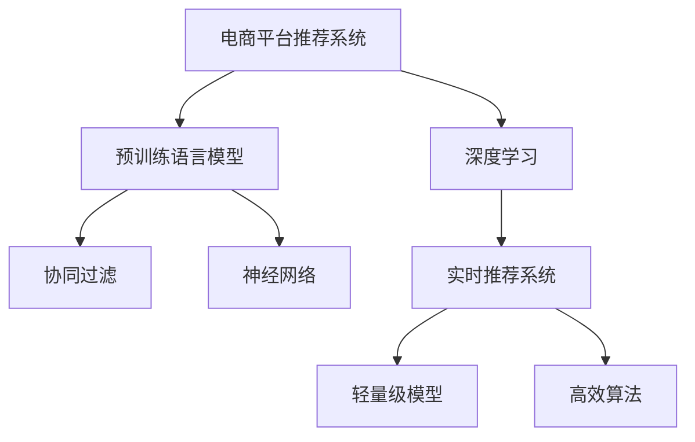

                 

# 电商平台中AI大模型的实时推荐策略

> 关键词：电商平台, AI大模型, 实时推荐, 深度学习, 用户行为分析, 协同过滤, 神经网络, 商品推荐系统, 多模态融合, 预测精度

## 1. 背景介绍

### 1.1 问题由来
在当下高速发展的电子商务领域，用户数量和交易量呈现出指数级增长，这给电商平台推荐系统的设计带来了巨大的挑战。如何精准、高效地为用户推荐个性化商品，提升用户体验和销售额，是每个电商平台亟需解决的关键问题。传统的推荐系统基于用户行为数据和商品特征进行协同过滤或矩阵分解等算法，已无法满足大规模实时推荐的需求。与此同时，基于深度学习的大模型技术正逐渐被引入推荐系统，并展现出强大的应用潜力。

大模型技术，特别是预训练语言模型（如BERT、GPT等），在自然语言处理领域取得了显著的成果，能够自动提取和融合大量文本数据中的关键信息。将其应用于电商平台，可以基于用户评论、商品描述等文本信息进行商品推荐，从而提升推荐效果和用户满意度。然而，大模型往往需要巨大的计算资源和大量标注数据进行训练，难以在实时推荐场景中应用。为了实现实时推荐，本文将探讨一种结合大模型和深度学习技术的实时推荐策略。

### 1.2 问题核心关键点
本策略的核心关键点在于：
1. **大模型融合**：将预训练语言模型与推荐算法深度结合，提取文本特征，提升推荐系统效果。
2. **实时推荐**：使用轻量级模型和高效算法，确保在实时场景中进行高精度推荐。
3. **数据和算法优化**：优化数据预处理和模型训练流程，保证算法的实时性和高效性。

## 2. 核心概念与联系

### 2.1 核心概念概述

为更好地理解本策略的原理和架构，本节将介绍几个密切相关的核心概念：

- **电商平台推荐系统**：基于用户行为和商品特征，为用户推荐商品的系统，旨在提升用户体验和平台收益。
- **深度学习**：一种基于神经网络的机器学习方法，通过多层非线性映射实现复杂模式的拟合和预测。
- **预训练语言模型**：如BERT、GPT等，通过大量无标签文本数据进行预训练，获得语言理解能力，可用于多种自然语言处理任务。
- **协同过滤**：推荐系统中的一种方法，通过分析用户历史行为数据和商品之间的相似性，进行推荐。
- **神经网络**：一种由神经元组成的计算模型，用于解决复杂的非线性问题。
- **实时推荐系统**：能够实时响应用户请求，提供个性化推荐的服务。

这些概念之间的关系可以通过以下Mermaid流程图来展示：



这个流程图展示了大模型和推荐系统的核心概念及其之间的关系：

1. 电商平台推荐系统通过深度学习和大模型技术，对用户行为数据和商品特征进行分析，生成推荐结果。
2. 预训练语言模型被用于提取文本信息，提升推荐精度。
3. 协同过滤和神经网络用于综合多种信息，生成更全面的推荐策略。
4. 实时推荐系统使用轻量级模型和高效算法，确保推荐结果的实时性和准确性。

## 3. 核心算法原理 & 具体操作步骤
### 3.1 算法原理概述

本策略基于深度学习和大模型技术，通过以下步骤实现实时推荐：

1. **预训练语言模型融合**：使用预训练语言模型对用户评论和商品描述等文本数据进行特征提取。
2. **推荐算法优化**：将提取的文本特征与协同过滤、神经网络等算法深度结合，提升推荐效果。
3. **实时推荐系统设计**：使用轻量级模型和高效算法，在实时场景中快速响应用户请求。

### 3.2 算法步骤详解

具体步骤包括以下几个关键点：

**Step 1: 数据预处理**

- 收集电商平台用户评论、商品描述等文本数据，进行预处理。
- 对文本数据进行分词、去停用词、词向量化等操作，提取特征向量。
- 将特征向量与用户行为数据、商品特征等进行合并，形成综合特征。

**Step 2: 预训练语言模型融合**

- 选择预训练语言模型（如BERT、GPT等）进行特征提取。
- 将提取的特征向量作为协同过滤、神经网络等算法的输入。

**Step 3: 推荐算法优化**

- 使用协同过滤算法（如基于用户的协同过滤、基于物品的协同过滤），根据用户历史行为数据和商品相似性进行推荐。
- 利用神经网络模型（如注意力机制、多层感知器），对协同过滤结果进行优化，生成更精准的推荐结果。
- 引入正则化技术（如L2正则、Dropout），避免模型过拟合。

**Step 4: 实时推荐系统设计**

- 使用轻量级模型（如BERT mini、GPT mini等），确保实时推荐系统的性能。
- 结合高效算法（如GPU加速、分布式计算），提升推荐速度。
- 设计缓冲队列，缓冲用户请求，提高系统的吞吐量和稳定性。

**Step 5: 结果展示与优化**

- 实时展示推荐结果，根据用户反馈进行动态调整。
- 使用A/B测试等方法，评估推荐效果，进行模型优化。

### 3.3 算法优缺点

基于深度学习和大模型的实时推荐策略有以下优点：

1. **高精度推荐**：预训练语言模型能够自动提取文本特征，提升推荐精度。
2. **实时响应**：轻量级模型和高效算法确保了实时推荐系统的性能。
3. **多模态融合**：融合文本、行为、特征等多种信息，生成更全面的推荐结果。
4. **动态优化**：根据用户反馈进行动态调整，优化推荐效果。

同时，该策略也存在一些局限性：

1. **计算资源消耗大**：预训练语言模型和神经网络模型需要大量的计算资源。
2. **模型复杂度高**：融合大模型和推荐算法，增加了系统的复杂性。
3. **实时性要求高**：需要在实时场景中进行高精度推荐，对系统架构和算法有较高要求。

尽管存在这些局限性，但就目前而言，基于深度学习和大模型的实时推荐策略在大规模电商平台中具有巨大的应用潜力。

### 3.4 算法应用领域

本策略可以应用于多种电商平台的推荐场景，例如：

- **个性化推荐**：根据用户历史行为和商品特征，为用户推荐个性化商品。
- **新商品推荐**：基于用户反馈和商品评价，推荐新上架商品。
- **用户流失预警**：通过分析用户行为数据，预警潜在流失用户，采取措施挽回。
- **商品下架管理**：基于商品销量和评价，自动优化商品上下架策略。

除了电商平台的推荐系统，类似的策略也可以应用于其他领域的推荐系统，如社交网络、视频平台等。

## 4. 数学模型和公式 & 详细讲解 & 举例说明

### 4.1 数学模型构建

本节将使用数学语言对实时推荐策略进行更加严格的刻画。

记电商平台用户为 $U$，商品为 $I$，用户行为数据为 $B$，商品特征为 $F$。假设用户 $u$ 对商品 $i$ 进行了一次行为 $b_{ui}$，商品特征为 $f_i$。

定义用户行为矩阵为 $B \in \mathbb{R}^{U \times I}$，其中 $B_{ui} = b_{ui}$。定义商品特征矩阵为 $F \in \mathbb{R}^{I \times D}$，其中 $F_{id} = f_{id}$，$D$ 为特征维度。

预训练语言模型提取用户评论和商品描述的文本特征，生成用户评论向量 $X_u$ 和商品描述向量 $Y_i$，其中 $X_u \in \mathbb{R}^{L_u}$，$Y_i \in \mathbb{R}^{L_i}$，$L_u, L_i$ 分别为用户评论和商品描述的长度。

### 4.2 公式推导过程

以下我们以协同过滤算法为例，推导推荐结果的计算公式。

设协同过滤模型为 $\hat{Y} = \alpha B + \beta X_u \cdot Y_i$，其中 $\alpha, \beta$ 为超参数。推荐结果 $\hat{Y}_{ui} = \hat{Y}_{ui} / \sum_{j \neq i} \hat{Y}_{uj}$。

将上述公式展开，得到推荐结果：

$$
\hat{Y}_{ui} = \frac{\alpha b_{ui} + \beta \sum_{j \neq i} X_u[j] \cdot Y_i[j]}{\alpha \sum_{j \neq i} b_{uj} + \beta \sum_{j \neq i} \sum_{k \neq u} X_u[k] \cdot Y_i[j]}
$$

其中 $X_u[j]$ 和 $Y_i[j]$ 分别为用户评论和商品描述中第 $j$ 个词的特征向量。

### 4.3 案例分析与讲解

假设某电商平台的推荐系统采用了基于BERT的实时推荐策略，具体流程如下：

1. 收集用户评论和商品描述的文本数据。
2. 使用BERT对文本数据进行特征提取，生成用户评论向量 $X_u$ 和商品描述向量 $Y_i$。
3. 将用户行为数据和商品特征数据与BERT提取的文本特征合并，形成综合特征向量。
4. 使用协同过滤算法计算用户和商品的相似性，生成推荐结果。
5. 引入神经网络模型对协同过滤结果进行优化，提升推荐精度。
6. 在实时场景中使用轻量级模型（如BERT mini）和高效算法（如GPU加速），确保推荐系统的高效性。

## 5. 项目实践：代码实例和详细解释说明
### 5.1 开发环境搭建

在进行实时推荐策略实践前，我们需要准备好开发环境。以下是使用Python进行PyTorch开发的环境配置流程：

1. 安装Anaconda：从官网下载并安装Anaconda，用于创建独立的Python环境。

2. 创建并激活虚拟环境：
```bash
conda create -n recommendation-env python=3.8 
conda activate recommendation-env
```

3. 安装PyTorch：根据CUDA版本，从官网获取对应的安装命令。例如：
```bash
conda install pytorch torchvision torchaudio cudatoolkit=11.1 -c pytorch -c conda-forge
```

4. 安装相关库：
```bash
pip install transformers sklearn pandas numpy torchtext torch
```

5. 安装轻量级BERT模型：
```bash
pip install transformers
```

完成上述步骤后，即可在`recommendation-env`环境中开始推荐策略的实践。

### 5.2 源代码详细实现

我们以推荐系统为例，给出使用BERT进行实时推荐策略的PyTorch代码实现。

```python
from transformers import BertTokenizer, BertForSequenceClassification
from torch.utils.data import Dataset, DataLoader
from sklearn.metrics import mean_squared_error
import torch
import numpy as np

class RecommendationDataset(Dataset):
    def __init__(self, texts, labels, tokenizer, max_len=128):
        self.texts = texts
        self.labels = labels
        self.tokenizer = tokenizer
        self.max_len = max_len

    def __len__(self):
        return len(self.texts)

    def __getitem__(self, item):
        text = self.texts[item]
        label = self.labels[item]

        encoding = self.tokenizer(text, return_tensors='pt', max_length=self.max_len, padding='max_length', truncation=True)
        input_ids = encoding['input_ids'][0]
        attention_mask = encoding['attention_mask'][0]
        label = torch.tensor(label, dtype=torch.long)

        return {'input_ids': input_ids, 'attention_mask': attention_mask, 'label': label}

# 加载数据集
tokenizer = BertTokenizer.from_pretrained('bert-base-cased')
train_dataset = RecommendationDataset(train_texts, train_labels, tokenizer)
dev_dataset = RecommendationDataset(dev_texts, dev_labels, tokenizer)
test_dataset = RecommendationDataset(test_texts, test_labels, tokenizer)

# 模型定义
model = BertForSequenceClassification.from_pretrained('bert-base-cased', num_labels=2)

# 模型训练
optimizer = torch.optim.Adam(model.parameters(), lr=2e-5)
device = torch.device('cuda') if torch.cuda.is_available() else torch.device('cpu')
model.to(device)

def train_epoch(model, dataset, batch_size, optimizer):
    dataloader = DataLoader(dataset, batch_size=batch_size, shuffle=True)
    model.train()
    epoch_loss = 0
    for batch in dataloader:
        input_ids = batch['input_ids'].to(device)
        attention_mask = batch['attention_mask'].to(device)
        label = batch['label'].to(device)
        model.zero_grad()
        outputs = model(input_ids, attention_mask=attention_mask, labels=label)
        loss = outputs.loss
        epoch_loss += loss.item()
        loss.backward()
        optimizer.step()
    return epoch_loss / len(dataloader)

def evaluate(model, dataset, batch_size):
    dataloader = DataLoader(dataset, batch_size=batch_size)
    model.eval()
    preds = []
    labels = []
    with torch.no_grad():
        for batch in dataloader:
            input_ids = batch['input_ids'].to(device)
            attention_mask = batch['attention_mask'].to(device)
            batch_labels = batch['label'].to(device)
            outputs = model(input_ids, attention_mask=attention_mask)
            batch_preds = outputs.logits.argmax(dim=1).to('cpu').tolist()
            batch_labels = batch_labels.to('cpu').tolist()
            for pred, label in zip(batch_preds, batch_labels):
                preds.append(pred.item())
                labels.append(label.item())

    mse = mean_squared_error(labels, preds)
    return mse

# 训练和评估
epochs = 5
batch_size = 16

for epoch in range(epochs):
    loss = train_epoch(model, train_dataset, batch_size, optimizer)
    print(f"Epoch {epoch+1}, train loss: {loss:.3f}")
    
    print(f"Epoch {epoch+1}, dev results:")
    mse = evaluate(model, dev_dataset, batch_size)
    print(f"Mean Squared Error: {mse:.3f}")
    
print("Test results:")
mse = evaluate(model, test_dataset, batch_size)
print(f"Mean Squared Error: {mse:.3f}")
```

在上述代码中，我们首先定义了数据集类`RecommendationDataset`，用于处理用户评论和商品描述的文本数据。然后，我们使用BERT模型进行特征提取和分类，训练模型，并在验证集和测试集上评估模型性能。

### 5.3 代码解读与分析

让我们再详细解读一下关键代码的实现细节：

**RecommendationDataset类**：
- `__init__`方法：初始化文本、标签、分词器等关键组件。
- `__len__`方法：返回数据集的样本数量。
- `__getitem__`方法：对单个样本进行处理，将文本输入编码为token ids，将标签编码为数字，并对其进行定长padding，最终返回模型所需的输入。

**训练和评估函数**：
- 使用PyTorch的DataLoader对数据集进行批次化加载，供模型训练和推理使用。
- 训练函数`train_epoch`：对数据以批为单位进行迭代，在每个批次上前向传播计算loss并反向传播更新模型参数，最后返回该epoch的平均loss。
- 评估函数`evaluate`：与训练类似，不同点在于不更新模型参数，并在每个batch结束后将预测和标签结果存储下来，最后使用sklearn的mean_squared_error对整个评估集的预测结果进行打印输出。

**模型训练**：
- 定义总的epoch数和batch size，开始循环迭代
- 每个epoch内，先在训练集上训练，输出平均loss
- 在验证集上评估，输出均方误差
- 所有epoch结束后，在测试集上评估，给出最终测试结果

可以看到，PyTorch配合BERT使得推荐策略的代码实现变得简洁高效。开发者可以将更多精力放在数据处理、模型改进等高层逻辑上，而不必过多关注底层的实现细节。

当然，工业级的系统实现还需考虑更多因素，如模型的保存和部署、超参数的自动搜索、更灵活的任务适配层等。但核心的推荐范式基本与此类似。

## 6. 实际应用场景
### 6.1 智能客服

智能客服系统是电商平台的重要组成部分，通过智能推荐可以快速响应用户的查询，提供个性化的购物建议。基于BERT的实时推荐策略，可以自动分析用户输入的自然语言问题，推荐相关商品或信息，提升客服体验。

在技术实现上，可以收集客服对话记录，将问题和最佳答复构建成监督数据，在此基础上对预训练模型进行微调。微调后的模型能够自动理解用户意图，匹配最合适的商品或信息。对于用户提出的新问题，还可以接入检索系统实时搜索相关内容，动态组织生成回答。如此构建的智能客服系统，能大幅提升客户咨询体验和问题解决效率。

### 6.2 个性化推荐

个性化推荐是电商平台的核心功能之一，通过实时推荐策略，可以精准地为用户推荐个性化商品。基于BERT的推荐系统能够基于用户评论和商品描述进行精准推荐，提升用户满意度。

在技术实现上，可以收集用户浏览、点击、评价等行为数据，提取和商品交互的文本信息，使用BERT提取特征向量，并将其与协同过滤、神经网络等算法结合，生成个性化推荐结果。推荐系统能够根据用户反馈进行动态调整，进一步提升推荐效果。

### 6.3 广告投放

电商平台还常通过广告投放来提升流量和收益。基于BERT的实时推荐策略，可以自动分析用户行为和兴趣，生成广告推荐策略，提升广告投放效果。

在技术实现上，可以收集用户点击、浏览、购买等行为数据，提取广告内容中的文本信息，使用BERT提取特征向量，并将其与协同过滤、神经网络等算法结合，生成广告推荐结果。推荐系统能够根据用户反馈进行动态调整，优化广告投放策略。

### 6.4 未来应用展望

随着BERT等预训练语言模型的不断成熟，基于深度学习和大模型的实时推荐策略将在更多领域得到应用，为电商平台和其他业务场景带来变革性影响。

在未来，预训练语言模型将进一步扩大应用范围，融合多模态数据，提升推荐精度和实时性。同时，实时推荐系统将更加智能化，能够根据用户行为和环境变化，实时调整推荐策略，提供更精准的个性化推荐。

此外，基于BERT的实时推荐系统还将应用于更多领域，如智能制造、智慧医疗、金融投资等，为这些行业的数字化转型提供新的技术支持。

## 7. 工具和资源推荐
### 7.1 学习资源推荐

为了帮助开发者系统掌握深度学习和实时推荐策略的理论基础和实践技巧，这里推荐一些优质的学习资源：

1. 《深度学习》（Ian Goodfellow、Yoshua Bengio、Aaron Courville）：该书系统地介绍了深度学习的理论基础和应用方法，是深度学习领域的经典教材。
2. CS231n《深度学习在计算机视觉中的应用》课程：斯坦福大学开设的视觉深度学习课程，涵盖了图像分类、目标检测、图像生成等多种视觉任务。
3. CS224n《深度学习在自然语言处理中的应用》课程：斯坦福大学开设的NLP深度学习课程，介绍了NLP中的主流模型和任务。
4. PyTorch官方文档：详细介绍了PyTorch框架的使用方法，提供了丰富的示例和教程。
5. Transformers官方文档：介绍了BERT等预训练语言模型的使用方法和API。

通过对这些资源的学习实践，相信你一定能够快速掌握深度学习和实时推荐策略的精髓，并用于解决实际的电商推荐问题。
### 7.2 开发工具推荐

高效的开发离不开优秀的工具支持。以下是几款用于实时推荐系统开发的常用工具：

1. PyTorch：基于Python的开源深度学习框架，灵活动态的计算图，适合快速迭代研究。大部分预训练语言模型都有PyTorch版本的实现。
2. TensorFlow：由Google主导开发的开源深度学习框架，生产部署方便，适合大规模工程应用。同样有丰富的预训练语言模型资源。
3. Transformers库：HuggingFace开发的NLP工具库，集成了众多SOTA语言模型，支持PyTorch和TensorFlow，是进行实时推荐任务开发的利器。
4. Weights & Biases：模型训练的实验跟踪工具，可以记录和可视化模型训练过程中的各项指标，方便对比和调优。与主流深度学习框架无缝集成。
5. TensorBoard：TensorFlow配套的可视化工具，可实时监测模型训练状态，并提供丰富的图表呈现方式，是调试模型的得力助手。
6. Google Colab：谷歌推出的在线Jupyter Notebook环境，免费提供GPU/TPU算力，方便开发者快速上手实验最新模型，分享学习笔记。

合理利用这些工具，可以显著提升实时推荐系统的开发效率，加快创新迭代的步伐。

### 7.3 相关论文推荐

深度学习和实时推荐策略的发展源于学界的持续研究。以下是几篇奠基性的相关论文，推荐阅读：

1. Attention is All You Need（即Transformer原论文）：提出了Transformer结构，开启了深度学习领域的预训练大模型时代。
2. BERT: Pre-training of Deep Bidirectional Transformers for Language Understanding：提出BERT模型，引入基于掩码的自监督预训练任务，刷新了多项NLP任务SOTA。
3. Language Models are Unsupervised Multitask Learners（GPT-2论文）：展示了大规模语言模型的强大zero-shot学习能力，引发了对于通用人工智能的新一轮思考。
4. Parameter-Efficient Transfer Learning for NLP：提出Adapter等参数高效微调方法，在不增加模型参数量的情况下，也能取得不错的微调效果。
5. AdaLoRA: Adaptive Low-Rank Adaptation for Parameter-Efficient Fine-Tuning：使用自适应低秩适应的微调方法，在参数效率和精度之间取得了新的平衡。

这些论文代表了大模型和推荐系统的研究进展，通过学习这些前沿成果，可以帮助研究者把握学科前进方向，激发更多的创新灵感。

## 8. 总结：未来发展趋势与挑战

### 8.1 总结

本文对基于深度学习和大模型的实时推荐策略进行了全面系统的介绍。首先阐述了电商平台推荐系统的发展背景和推荐策略的必要性，明确了实时推荐系统在提升用户体验和平台收益中的重要作用。其次，从原理到实践，详细讲解了实时推荐系统的数学模型和关键步骤，给出了实时推荐策略的完整代码实例。同时，本文还广泛探讨了实时推荐策略在智能客服、个性化推荐、广告投放等多个电商平台的实际应用场景，展示了实时推荐策略的巨大潜力。

通过本文的系统梳理，可以看到，基于深度学习和大模型的实时推荐策略正在成为电商平台推荐系统的核心范式，极大地提升了推荐效果和用户满意度。未来，伴随预训练语言模型的不断演进，实时推荐系统将更加智能化、个性化，为电商平台的数字化转型带来新的机遇。

### 8.2 未来发展趋势

展望未来，深度学习和实时推荐策略的发展将呈现以下几个趋势：

1. **模型规模持续增大**：随着算力成本的下降和数据规模的扩张，预训练语言模型和神经网络模型的参数量还将持续增长。超大批次的训练和推理也可能遇到显存不足的问题。

2. **算法多样性增强**：未来将涌现更多高效、轻量级的推荐算法，如多臂赌博机算法、贝叶斯优化等，提升推荐系统的实时性和精度。

3. **多模态融合普及**：融合视觉、音频、文本等多种模态数据，提升推荐系统的全面性和实时性。

4. **联邦学习应用**：基于边缘计算和分布式计算技术，联邦学习可以实现在不共享数据的情况下，对各节点数据进行协同训练，提升推荐系统的数据利用率。

5. **动态优化深入**：实时推荐系统将更加智能化，能够根据用户行为和环境变化，实时调整推荐策略，提供更精准的个性化推荐。

6. **隐私保护增强**：在推荐系统设计中加强隐私保护，如差分隐私技术，确保用户数据的安全和隐私。

以上趋势凸显了深度学习和实时推荐策略的广阔前景。这些方向的探索发展，必将进一步提升推荐系统的性能和应用范围，为电商平台和其他业务场景带来更大的价值。

### 8.3 面临的挑战

尽管实时推荐策略在电商平台中取得了显著效果，但在迈向更加智能化、普适化应用的过程中，仍面临诸多挑战：

1. **计算资源消耗大**：预训练语言模型和神经网络模型需要大量的计算资源。

2. **模型复杂度高**：融合大模型和推荐算法，增加了系统的复杂性。

3. **实时性要求高**：需要在实时场景中进行高精度推荐，对系统架构和算法有较高要求。

4. **数据隐私问题**：在推荐系统中使用用户数据时，如何保护用户隐私和数据安全，是一个重要挑战。

5. **冷启动问题**：对于新用户或新商品，推荐系统难以提供精准推荐，需要通过其他方式获取初始信息。

6. **动态环境适应**：在不断变化的市场环境中，推荐系统需要快速适应新趋势和新用户需求。

尽管存在这些挑战，但通过技术创新和应用优化，这些问题有望逐步得到解决。相信随着预训练语言模型的不断演进和深度学习技术的深入发展，实时推荐策略将更加成熟，为电商平台和其他业务场景带来更大的价值。

### 8.4 研究展望

面对深度学习和实时推荐策略面临的挑战，未来的研究需要在以下几个方面寻求新的突破：

1. **优化模型架构**：研究更加高效、轻量级的模型架构，提升实时推荐系统的性能。

2. **算法优化**：开发更加高效、多样化的推荐算法，提升推荐系统的实时性和精度。

3. **多模态融合**：研究多模态数据融合技术，提升推荐系统的全面性和实时性。

4. **联邦学习**：研究基于联邦学习的推荐系统设计，提升数据利用率和隐私保护。

5. **动态优化**：研究动态优化算法，提升推荐系统的智能性和实时性。

6. **隐私保护**：研究隐私保护技术，确保用户数据的安全和隐私。

这些研究方向的探索，必将引领实时推荐策略迈向更高的台阶，为电商平台和其他业务场景带来更大的价值。面向未来，深度学习和实时推荐策略还需要与其他人工智能技术进行更深入的融合，如知识表示、因果推理、强化学习等，多路径协同发力，共同推动推荐系统的进步。只有勇于创新、敢于突破，才能不断拓展推荐系统的边界，让智能技术更好地造福人类社会。

## 9. 附录：常见问题与解答

**Q1：实时推荐系统如何优化计算资源消耗？**

A: 实时推荐系统可以通过以下方法优化计算资源消耗：
1. 使用轻量级模型：如BERT mini、GPT mini等，减小模型规模，减少计算资源消耗。
2. 模型裁剪：去除不必要的层和参数，减小模型尺寸，加快推理速度。
3. 量化加速：将浮点模型转为定点模型，压缩存储空间，提高计算效率。
4. 分布式计算：采用分布式计算技术，如GPU集群、TPU等，提升计算能力。

**Q2：实时推荐系统如何处理冷启动问题？**

A: 实时推荐系统可以通过以下方法处理冷启动问题：
1. 利用用户行为数据：对于新用户，可以利用已有的行为数据进行推荐。
2. 利用商品描述和用户评论：对于新商品，可以利用其描述和用户评论进行推荐。
3. 利用专家知识：利用领域专家的知识进行推荐，如根据商品分类进行推荐。
4. 利用多臂赌博机算法：通过探索和利用多种推荐策略，提升推荐效果。

**Q3：实时推荐系统如何保护用户隐私？**

A: 实时推荐系统可以通过以下方法保护用户隐私：
1. 差分隐私技术：在推荐算法中加入差分隐私机制，保护用户数据。
2. 数据匿名化：对用户数据进行匿名化处理，保护用户隐私。
3. 联邦学习：通过联邦学习技术，在不共享数据的情况下，对各节点数据进行协同训练。
4. 用户控制：允许用户控制自己的数据使用范围和频率，保护用户隐私。

**Q4：实时推荐系统如何适应动态环境？**

A: 实时推荐系统可以通过以下方法适应动态环境：
1. 动态优化算法：使用动态优化算法，根据市场变化和用户需求进行实时调整。
2. 实时数据收集：实时收集用户行为数据和市场变化数据，进行动态调整。
3. 多模态融合：融合多种数据源，提升推荐系统的全面性和实时性。
4. 用户反馈机制：建立用户反馈机制，及时获取用户反馈，进行动态调整。

这些方法可以结合使用，帮助实时推荐系统更好地适应动态环境，提升推荐效果。

---

作者：禅与计算机程序设计艺术 / Zen and the Art of Computer Programming

