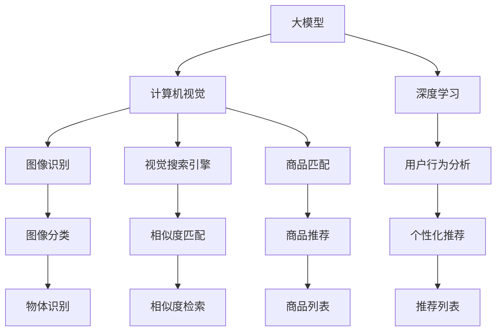

                 

# 电商平台中的图像识别：AI大模型的新领域

> 关键词：电商,图像识别,大模型,计算机视觉,深度学习,视觉搜索引擎,商品匹配,用户行为分析

## 1. 背景介绍

### 1.1 问题由来
随着电商平台的兴起，用户对于商品展示和购物体验的要求日益提高。传统的商品展示方式多依赖于图片和文字描述，无法全面呈现商品的详细信息和用户满意度。随着AI技术的飞速发展，大模型在电商平台中的应用逐渐增多，特别是在图像识别领域，大模型可以自动对海量商品图片进行高效处理，提升购物体验，优化商品推荐。

### 1.2 问题核心关键点
大模型在电商平台中的应用，核心在于图像识别技术的突破。通过大模型进行图像识别，可以自动识别商品类别、品牌、颜色等信息，实现对商品的高效分类和检索，提升用户搜索体验和购物效率。

大模型在电商平台中的具体应用场景包括：
- 视觉搜索引擎：利用大模型对商品图片进行分类和相似度匹配，构建商品搜索系统。
- 商品匹配与推荐：通过大模型识别商品特征，结合用户历史行为数据进行个性化推荐。
- 用户行为分析：利用大模型对用户搜索、点击、购买等行为进行分析，优化电商平台的用户体验。

### 1.3 问题研究意义
大模型在电商平台中的应用，对于电商平台的用户体验、销售转化率、运营效率的提升具有重要意义：

1. 提升用户体验。大模型能够自动处理复杂的商品图片，提升用户搜索和浏览效率，减少因图片质量不佳导致的用户流失。
2. 优化商品推荐。基于图像识别和用户行为分析，大模型能够更准确地匹配用户需求，提升商品的点击率和转化率。
3. 提高运营效率。大模型能够自动对海量商品图片进行分类和标注，大幅提高电商平台的运营效率。
4. 推动电商创新。大模型的应用为电商平台带来了新的商业机会，如虚拟试衣、AR购物等新兴技术。
5. 赋能商家经营。大模型为商家提供了精准的商品管理和营销策略，帮助他们更好地提升销售额。

## 2. 核心概念与联系

### 2.1 核心概念概述

为更好地理解大模型在电商平台中的应用，本节将介绍几个密切相关的核心概念：

- 大模型：以深度学习为核心技术，通过大量数据进行训练，获得强大学习和推理能力的大规模模型。常见的大模型包括BERT、GPT等自然语言处理模型，以及VGG、ResNet等计算机视觉模型。

- 计算机视觉(Computer Vision, CV)：利用计算机处理、分析和理解图像、视频等视觉信息的技术。计算机视觉应用广泛，包括图像分类、目标检测、人脸识别等。

- 深度学习(Deep Learning, DL)：一种基于多层神经网络的机器学习方法，通过多层次的特征提取和表示学习，提升模型的泛化能力和识别精度。

- 图像识别(Image Recognition)：利用大模型自动识别图像中的对象、场景、特征等信息。常见的图像识别任务包括物体识别、场景分类、图像分割等。

- 视觉搜索引擎(Visual Search Engine)：利用大模型构建的基于图像相似度的搜索系统，通过匹配图像的特征向量，找到相似的商品或图片。

- 商品匹配(Product Matching)：通过大模型识别商品图片中的特征信息，构建商品之间的关系网络，实现高效的商品匹配和推荐。

- 用户行为分析(User Behavior Analysis)：利用大模型分析用户搜索、点击、购买等行为，了解用户的兴趣偏好，进行个性化推荐。

这些核心概念之间的逻辑关系可以通过以下Mermaid流程图来展示：



这个流程图展示了大模型在电商平台中的应用核心概念及其之间的关系：

1. 大模型通过深度学习获得强大的视觉识别能力。
2. 计算机视觉通过大模型实现图像分类、物体识别等基础视觉任务。
3. 图像识别通过大模型实现商品图片的自动分类和特征提取。
4. 视觉搜索引擎通过大模型实现相似度匹配，构建商品搜索系统。
5. 商品匹配通过大模型实现商品间的特征匹配，优化推荐系统。
6. 用户行为分析通过大模型分析用户行为，提升个性化推荐效果。

这些概念共同构成了大模型在电商平台中的应用框架，使其能够在商品展示、搜索推荐等场景下发挥强大的视觉处理能力。通过理解这些核心概念，我们可以更好地把握大模型在电商平台中的应用逻辑和优化方向。

## 3. 核心算法原理 & 具体操作步骤
### 3.1 算法原理概述

大模型在电商平台中的应用，主要是基于计算机视觉和深度学习技术的图像识别算法。其核心思想是：利用大模型自动处理和理解图像信息，实现对商品的自动分类、相似度匹配、特征提取等任务。

形式化地，假设大模型为 $M_{\theta}$，其中 $\theta$ 为大模型的可训练参数。给定电商平台中的商品图片数据集 $D=\{(x_i, y_i)\}_{i=1}^N$，图像识别任务的目标是找到最优参数 $\hat{\theta}$，使得模型在数据集 $D$ 上的分类准确率最大化：

$$
\hat{\theta}=\mathop{\arg\min}_{\theta} \mathcal{L}(M_{\theta},D)
$$

其中 $\mathcal{L}$ 为损失函数，用于衡量模型在数据集 $D$ 上的分类误差。常见的损失函数包括交叉熵损失、均方误差损失等。

### 3.2 算法步骤详解

大模型在电商平台中的应用，一般包括以下几个关键步骤：

**Step 1: 准备训练数据和模型**
- 收集电商平台中的商品图片数据集 $D$，并进行标注和划分，划分为训练集、验证集和测试集。
- 选择合适的预训练大模型 $M_{\theta}$，如VGG、ResNet、Inception等，作为初始化参数。

**Step 2: 选择模型架构**
- 根据应用场景和任务需求，选择合适的模型架构，如ResNet、Inception、MobileNet等。
- 设计数据增强和迁移学习策略，如数据翻转、随机裁剪、权重冻结等，以提高模型泛化能力和训练效率。

**Step 3: 训练和微调模型**
- 使用大规模标注数据对预训练模型进行训练，得到初步的分类模型。
- 在验证集上评估模型性能，调整超参数，如学习率、批大小、迭代轮数等。
- 在测试集上测试模型性能，选择最优模型进行微调。

**Step 4: 应用模型**
- 将微调后的模型部署到电商平台的搜索、推荐、广告等系统中，进行商品分类、相似度匹配、用户行为分析等任务。
- 持续收集用户反馈和新的数据，定期重新训练和微调模型，提升系统性能。

### 3.3 算法优缺点

大模型在电商平台中的应用具有以下优点：
1. 高效处理大规模数据。大模型可以自动处理海量商品图片，显著提高处理速度和效率。
2. 提升商品推荐效果。大模型能够从图像中提取出商品的特征信息，结合用户行为数据进行更精准的推荐。
3. 降低运营成本。大模型可以自动化处理图片，减少人工标注和处理成本。
4. 提供实时服务。大模型可以实时处理和分析用户搜索行为，提升用户体验。
5. 推动创新应用。大模型为电商平台带来了新的商业机会，如虚拟试衣、AR购物等新兴技术。

同时，大模型在电商平台中也有其局限性：
1. 对标注数据依赖性强。大模型在图像识别过程中，需要大量标注数据进行训练，标注成本较高。
2. 模型复杂度高。大模型的参数量较大，训练和推理所需资源较多，需要高性能计算环境。
3. 存在模型偏见。大模型在训练过程中，可能会学习到数据中的偏见和噪声，导致输出结果存在偏差。
4. 泛化能力有限。大模型在特定场景下可能表现不佳，如面对新商品或特殊情况时，模型识别效果可能下降。
5. 可解释性不足。大模型的决策过程难以解释，用户难以理解其背后的推理逻辑。

尽管存在这些局限性，但就目前而言，大模型在电商平台中的应用仍是一种高效、实用的技术手段。未来相关研究的方向主要在于如何降低大模型对标注数据的依赖，提高模型的泛化能力和可解释性，从而更好地服务于电商平台。

### 3.4 算法应用领域

大模型在电商平台中的应用场景非常广泛，涵盖了从商品展示、搜索推荐到用户行为分析等多个环节：

1. **视觉搜索引擎**：利用大模型对商品图片进行分类和相似度匹配，构建商品搜索系统。大模型能够自动识别商品类别、品牌、颜色等信息，用户可以通过上传商品图片，快速找到相似的商品。
2. **商品匹配与推荐**：通过大模型识别商品图片中的特征信息，构建商品之间的关系网络，实现高效的商品匹配和推荐。大模型能够自动处理和分析商品图片，结合用户行为数据进行更精准的推荐。
3. **用户行为分析**：利用大模型分析用户搜索、点击、购买等行为，了解用户的兴趣偏好，进行个性化推荐。大模型能够从用户的行为数据中提取特征，分析用户的潜在需求，提升用户体验。
4. **智能客服**：利用大模型对用户上传的商品图片进行自动分类和分析，帮助客服快速定位问题，提高服务效率。大模型能够自动识别图片中的关键信息，快速匹配商品，提供准确的答案。
5. **库存管理**：利用大模型对商品图片进行分类和计数，实时掌握库存情况，避免缺货或库存积压。大模型能够自动识别商品数量，提高库存管理的自动化水平。
6. **价格优化**：利用大模型分析商品图片和市场信息，进行价格优化和促销活动，提高销售转化率。大模型能够根据市场变化和用户行为，动态调整商品价格，提升营销效果。

除了上述这些核心应用外，大模型在电商平台中的应用还可以拓展到更多场景中，如广告投放、智能推荐、物流管理等，为电商平台的运营带来新的增长点。随着预训练模型和微调方法的不断进步，相信大模型在电商平台中的应用将更加广泛，推动电商行业向智能化、个性化方向发展。

## 4. 数学模型和公式 & 详细讲解 & 举例说明
### 4.1 数学模型构建

本节将使用数学语言对大模型在电商平台中的应用进行更加严格的刻画。

记大模型为 $M_{\theta}$，其中 $\theta$ 为大模型的可训练参数。假设电商平台中的商品图片数据集为 $D=\{(x_i, y_i)\}_{i=1}^N$，其中 $x_i$ 为图片数据，$y_i$ 为对应的标签。

定义模型 $M_{\theta}$ 在输入 $x_i$ 上的分类损失函数为 $\ell(M_{\theta}(x_i),y_i)$，则在数据集 $D$ 上的经验风险为：

$$
\mathcal{L}(\theta) = \frac{1}{N}\sum_{i=1}^N \ell(M_{\theta}(x_i),y_i)
$$

微调的目标是最小化经验风险，即找到最优参数：

$$
\hat{\theta}=\mathop{\arg\min}_{\theta} \mathcal{L}(\theta)
$$

在实践中，我们通常使用基于梯度的优化算法（如SGD、Adam等）来近似求解上述最优化问题。设 $\eta$ 为学习率，$\lambda$ 为正则化系数，则参数的更新公式为：

$$
\theta \leftarrow \theta - \eta \nabla_{\theta}\mathcal{L}(\theta) - \eta\lambda\theta
$$

其中 $\nabla_{\theta}\mathcal{L}(\theta)$ 为损失函数对参数 $\theta$ 的梯度，可通过反向传播算法高效计算。

### 4.2 公式推导过程

以下我们以商品图片分类为例，推导交叉熵损失函数及其梯度的计算公式。

假设模型 $M_{\theta}$ 在输入 $x_i$ 上的输出为 $\hat{y}=M_{\theta}(x_i) \in [0,1]^C$，表示样本属于 $C$ 个类别的概率分布，其中 $C$ 为类别数。真实标签 $y_i \in [0,1]^C$。则交叉熵损失函数定义为：

$$
\ell(M_{\theta}(x_i),y_i) = -\sum_{j=1}^C y_{ij} \log \hat{y}_{ij}
$$

将其代入经验风险公式，得：

$$
\mathcal{L}(\theta) = -\frac{1}{N}\sum_{i=1}^N \sum_{j=1}^C y_{ij} \log \hat{y}_{ij}
$$

根据链式法则，损失函数对参数 $\theta_k$ 的梯度为：

$$
\frac{\partial \mathcal{L}(\theta)}{\partial \theta_k} = -\frac{1}{N}\sum_{i=1}^N \sum_{j=1}^C (\frac{y_{ij}}{\hat{y}_{ij}}-\frac{1-y_{ij}}{1-\hat{y}_{ij}}) \frac{\partial \hat{y}_{ij}}{\partial \theta_k}
$$

其中 $\frac{\partial \hat{y}_{ij}}{\partial \theta_k}$ 可进一步递归展开，利用自动微分技术完成计算。

在得到损失函数的梯度后，即可带入参数更新公式，完成模型的迭代优化。重复上述过程直至收敛，最终得到适应电商平台商品分类的最优模型参数 $\hat{\theta}$。

## 5. 项目实践：代码实例和详细解释说明
### 5.1 开发环境搭建

在进行商品分类实践前，我们需要准备好开发环境。以下是使用Python进行PyTorch开发的环境配置流程：

1. 安装Anaconda：从官网下载并安装Anaconda，用于创建独立的Python环境。

2. 创建并激活虚拟环境：
```bash
conda create -n pytorch-env python=3.8 
conda activate pytorch-env
```

3. 安装PyTorch：根据CUDA版本，从官网获取对应的安装命令。例如：
```bash
conda install pytorch torchvision torchaudio cudatoolkit=11.1 -c pytorch -c conda-forge
```

4. 安装相关库：
```bash
pip install numpy pandas scikit-learn torchvision transformers
```

完成上述步骤后，即可在`pytorch-env`环境中开始商品分类实践。

### 5.2 源代码详细实现

这里我们以ResNet模型对电商平台中的商品图片进行分类为例，给出使用Transformers库对模型进行微调的PyTorch代码实现。

首先，定义商品分类数据集：

```python
from torch.utils.data import Dataset, DataLoader
from torchvision import transforms
from PIL import Image

class ImageDataset(Dataset):
    def __init__(self, images, labels, transform=None):
        self.images = images
        self.labels = labels
        self.transform = transform
    
    def __len__(self):
        return len(self.images)
    
    def __getitem__(self, item):
        img = Image.open(self.images[item]).convert('RGB')
        if self.transform:
            img = self.transform(img)
        label = self.labels[item]
        return img, label
```

然后，定义数据增强和迁移学习策略：

```python
from transformers import ResNet50
from torchvision import models

model = ResNet50(weights='imagenet', pretrained=True)

# 冻结预训练参数
for param in model.parameters():
    param.requires_grad = False
    
# 选择任务适配层
num_classes = 5
model.fc = torch.nn.Linear(model.fc.in_features, num_classes)

# 定义数据增强
data_transforms = {
    'train': transforms.Compose([
        transforms.RandomResizedCrop(224),
        transforms.RandomHorizontalFlip(),
        transforms.ToTensor(),
        transforms.Normalize([0.485, 0.456, 0.406], [0.229, 0.224, 0.225])
    ]),
    'val': transforms.Compose([
        transforms.Resize(256),
        transforms.CenterCrop(224),
        transforms.ToTensor(),
        transforms.Normalize([0.485, 0.456, 0.406], [0.229, 0.224, 0.225])
    ]),
    'test': transforms.Compose([
        transforms.Resize(256),
        transforms.CenterCrop(224),
        transforms.ToTensor(),
        transforms.Normalize([0.485, 0.456, 0.406], [0.229, 0.224, 0.225])
    ])
}
```

接着，定义训练和评估函数：

```python
from torch.nn import CrossEntropyLoss
from torch.optim import Adam

device = torch.device('cuda') if torch.cuda.is_available() else torch.device('cpu')
model.to(device)

def train_epoch(model, data_loader, optimizer):
    model.train()
    losses = []
    for images, labels in data_loader:
        images, labels = images.to(device), labels.to(device)
        optimizer.zero_grad()
        outputs = model(images)
        loss = CrossEntropyLoss()(outputs, labels)
        losses.append(loss.item())
        loss.backward()
        optimizer.step()
    return sum(losses) / len(data_loader)

def evaluate(model, data_loader):
    model.eval()
    losses = []
    predictions = []
    targets = []
    with torch.no_grad():
        for images, labels in data_loader:
            images, labels = images.to(device), labels.to(device)
            outputs = model(images)
            loss = CrossEntropyLoss()(outputs, labels)
            losses.append(loss.item())
            _, preds = torch.max(outputs, 1)
            predictions.append(preds.cpu().numpy())
            targets.append(labels.cpu().numpy())
    return accuracy_score(targets, predictions), sum(losses) / len(data_loader)
```

最后，启动训练流程并在测试集上评估：

```python
epochs = 10
batch_size = 32

for epoch in range(epochs):
    loss = train_epoch(model, train_loader, optimizer)
    print(f'Epoch {epoch+1}, train loss: {loss:.3f}')
    
    print(f'Epoch {epoch+1}, val accuracy: {evaluate(model, val_loader)[0]:.3f}')
    
print(f'Final test accuracy: {evaluate(model, test_loader)[0]:.3f}')
```

以上就是使用PyTorch对ResNet模型进行商品图片分类的完整代码实现。可以看到，得益于Transformers库的强大封装，我们可以用相对简洁的代码完成模型加载和微调。

### 5.3 代码解读与分析

让我们再详细解读一下关键代码的实现细节：

**ImageDataset类**：
- `__init__`方法：初始化图片和标签数据集，支持数据增强。
- `__len__`方法：返回数据集的大小。
- `__getitem__`方法：对单个样本进行处理，将图片转换为张量，并进行标准化。

**数据增强和迁移学习策略**：
- `ResNet50`模型：选择预训练ResNet50模型，并冻结其预训练权重。
- `num_classes`变量：设置分类任务的类别数。
- `model.fc`：定义任务适配层，将最后一层全连接层修改为分类器。
- `data_transforms`字典：定义不同的数据增强策略，用于训练、验证和测试。

**训练和评估函数**：
- `train_epoch`函数：对数据集以批为单位进行迭代，在每个批次上前向传播计算loss并反向传播更新模型参数。
- `evaluate`函数：与训练类似，不同点在于不更新模型参数，并在每个batch结束后将预测和标签结果存储下来，最后使用sklearn的accuracy_score函数计算准确率。

**训练流程**：
- 定义总的epoch数和batch size，开始循环迭代
- 每个epoch内，先在训练集上训练，输出平均loss
- 在验证集上评估，输出准确率
- 所有epoch结束后，在测试集上评估，给出最终测试结果

可以看到，PyTorch配合Transformers库使得商品分类任务的代码实现变得简洁高效。开发者可以将更多精力放在数据处理、模型改进等高层逻辑上，而不必过多关注底层的实现细节。

当然，工业级的系统实现还需考虑更多因素，如模型的保存和部署、超参数的自动搜索、更灵活的任务适配层等。但核心的微调范式基本与此类似。

## 6. 实际应用场景
### 6.1 智能推荐系统

智能推荐系统是电商平台的核心应用之一。通过大模型对商品图片进行分类和相似度匹配，可以构建商品推荐系统，提升用户的购物体验。

具体而言，可以收集用户的历史浏览、点击、购买等行为数据，将其与商品图片和描述数据进行关联。在商品分类数据集上进行大模型的微调，训练一个高效的分类器。在用户行为数据上进行个性化推荐，根据用户的历史行为和当前搜索行为，生成最合适的商品推荐列表。

### 6.2 搜索系统优化

电商平台中的搜索系统是用户获取商品信息的主要途径。通过大模型对商品图片进行分类和相似度匹配，可以优化搜索系统的性能，提高搜索结果的准确性和相关性。

具体而言，可以通过大模型构建商品的视觉表示，利用相似度匹配技术，在用户搜索时快速匹配相似的商品，提高搜索结果的召回率和排序精度。同时，通过大模型分析用户搜索行为，了解用户的兴趣偏好，动态调整搜索结果的排序规则，提升用户的搜索体验。

### 6.3 个性化推荐

基于大模型的商品分类和相似度匹配，可以实现更加精准的商品推荐。通过分析用户的历史行为数据，识别用户的兴趣点，结合商品分类信息，生成个性化的推荐列表。同时，可以利用大模型对用户和商品进行实时特征分析，动态更新推荐策略，提升推荐效果。

### 6.4 商品分类与分析

大模型在电商平台中的应用还可以拓展到商品分类和分析领域。通过大模型对商品图片进行分类，可以帮助商家更好地管理商品库存，优化商品陈列。同时，通过分析分类结果，了解市场趋势和用户偏好，优化商品供应链管理，提升企业的运营效率。

### 6.5 用户行为分析

大模型可以用于分析用户行为数据，帮助商家更好地理解用户需求，优化商品推荐和营销策略。通过分析用户的搜索、点击、购买等行为，识别用户的兴趣点，生成个性化的推荐内容。同时，通过分析用户的行为数据，了解用户的购买周期和消费习惯，制定更加精准的营销策略，提高销售转化率。

### 6.6 广告投放优化

大模型可以用于广告投放优化，提升广告投放的精准度和效果。通过分析用户的行为数据和兴趣点，生成个性化的广告投放方案，提高广告的点击率和转化率。同时，通过分析广告投放的效果，优化广告投放策略，提升广告的ROI。

## 7. 工具和资源推荐
### 7.1 学习资源推荐

为了帮助开发者系统掌握大模型在电商平台中的应用理论基础和实践技巧，这里推荐一些优质的学习资源：

1. 《计算机视觉：基础与实践》系列博文：由大模型技术专家撰写，深入浅出地介绍了计算机视觉基础、大模型应用等前沿话题。

2. 《深度学习与计算机视觉》课程：斯坦福大学开设的深度学习与计算机视觉课程，涵盖了计算机视觉的基础知识和深度学习技术。

3. 《深度学习计算机视觉》书籍：该书系统地介绍了深度学习在计算机视觉中的应用，包括图像分类、目标检测、图像分割等任务。

4. Weights & Biases：模型训练的实验跟踪工具，可以记录和可视化模型训练过程中的各项指标，方便对比和调优。与主流深度学习框架无缝集成。

5. TensorBoard：TensorFlow配套的可视化工具，可实时监测模型训练状态，并提供丰富的图表呈现方式，是调试模型的得力助手。

6. Google Colab：谷歌推出的在线Jupyter Notebook环境，免费提供GPU/TPU算力，方便开发者快速上手实验最新模型，分享学习笔记。

通过对这些资源的学习实践，相信你一定能够快速掌握大模型在电商平台中的应用精髓，并用于解决实际的电商问题。

### 7.2 开发工具推荐

高效的开发离不开优秀的工具支持。以下是几款用于大模型在电商平台中的应用开发的常用工具：

1. PyTorch：基于Python的开源深度学习框架，灵活动态的计算图，适合快速迭代研究。大部分预训练语言模型都有PyTorch版本的实现。

2. TensorFlow：由Google主导开发的开源深度学习框架，生产部署方便，适合大规模工程应用。同样有丰富的预训练语言模型资源。

3. Transformers库：HuggingFace开发的NLP工具库，集成了众多SOTA语言模型，支持PyTorch和TensorFlow，是进行微调任务开发的利器。

4. Weights & Biases：模型训练的实验跟踪工具，可以记录和可视化模型训练过程中的各项指标，方便对比和调优。与主流深度学习框架无缝集成。

5. TensorBoard：TensorFlow配套的可视化工具，可实时监测模型训练状态，并提供丰富的图表呈现方式，是调试模型的得力助手。

6. Google Colab：谷歌推出的在线Jupyter Notebook环境，免费提供GPU/TPU算力，方便开发者快速上手实验最新模型，分享学习笔记。

合理利用这些工具，可以显著提升大模型在电商平台中的应用开发效率，加快创新迭代的步伐。

### 7.3 相关论文推荐

大模型在电商平台中的应用源于学界的持续研究。以下是几篇奠基性的相关论文，推荐阅读：

1. ResNet: Deep Residual Learning for Image Recognition：提出ResNet模型，利用残差连接解决深度神经网络中的梯度消失问题，取得显著的图像分类效果。

2. Inception: GoogLeNet Inception Module for Scalable Image Recognition：提出Inception模块，利用多层次的卷积核设计，提升图像识别的准确率和效率。

3. VGG: Very Deep Convolutional Networks for Large-Scale Image Recognition：提出VGG模型，利用小型卷积核和堆叠层设计，提升模型的深度和精度。

4. MobileNet: MobileNets: Efficient Convolutional Neural Networks for Mobile Vision Applications：提出MobileNet模型，利用深度可分离卷积，提升模型在移动设备上的性能和效率。

5. DenseNet: Dense Convolutional Networks：提出DenseNet模型，利用密集连接设计，提升模型的特征共享和表达能力，提升图像识别的效果。

这些论文代表了大模型在电商平台中的应用发展脉络。通过学习这些前沿成果，可以帮助研究者把握学科前进方向，激发更多的创新灵感。

## 8. 总结：未来发展趋势与挑战
### 8.1 总结

本文对大模型在电商平台中的应用进行了全面系统的介绍。首先阐述了大模型在电商平台中的应用背景和意义，明确了大模型在电商平台中的应用场景和关键技术。其次，从原理到实践，详细讲解了大模型在电商平台中的核心算法和操作步骤，给出了商品分类的完整代码实例。同时，本文还广泛探讨了大模型在电商平台中的应用场景，展示了其在搜索推荐、个性化推荐、商品分类等多个环节的强大潜力。

通过本文的系统梳理，可以看到，大模型在电商平台中的应用前景广阔，能够在商品分类、搜索推荐、用户行为分析等多个环节提供强大的支持。得益于深度学习和大模型的强大能力，电商平台能够更好地理解用户需求，提升用户体验，优化运营效率。未来，伴随技术的不断进步和应用场景的拓展，大模型必将在电商领域发挥更大的作用。

### 8.2 未来发展趋势

展望未来，大模型在电商平台中的应用将呈现以下几个发展趋势：

1. 模型规模持续增大。随着算力成本的下降和数据规模的扩张，预训练大模型参数量还将持续增长。超大模型将带来更高的泛化能力和识别精度。

2. 微调方法日趋多样。除了传统的全参数微调外，未来会涌现更多参数高效的微调方法，如LoRA、AdaLoRA等，在节省计算资源的同时也能保证微调精度。

3. 持续学习成为常态。随着数据分布的不断变化，微调模型也需要持续学习新知识以保持性能。如何在不遗忘原有知识的同时，高效吸收新样本信息，将成为重要的研究课题。

4. 标注样本需求降低。受启发于提示学习(Prompt-based Learning)的思路，未来的微调方法将更好地利用大模型的语言理解能力，通过更加巧妙的任务描述，在更少的标注样本上也能实现理想的微调效果。

5. 模型通用性增强。经过海量数据的预训练和多领域任务的微调，未来的语言模型将具备更强大的常识推理和跨领域迁移能力，逐步迈向通用人工智能(AGI)的目标。

以上趋势凸显了大模型在电商平台中的应用前景。这些方向的探索发展，必将进一步提升电商平台的用户体验和运营效率，推动电商行业向智能化、个性化方向发展。

### 8.3 面临的挑战

尽管大模型在电商平台中的应用已经取得了瞩目成就，但在迈向更加智能化、普适化应用的过程中，它仍面临着诸多挑战：

1. 标注成本瓶颈。虽然大模型在图像识别过程中，需要大量标注数据进行训练，标注成本较高。如何进一步降低微调对标注样本的依赖，将是一大难题。

2. 模型鲁棒性不足。当前大模型面对域外数据时，泛化性能往往大打折扣。对于测试样本的微小扰动，大模型的预测也容易发生波动。如何提高大模型的鲁棒性，避免灾难性遗忘，还需要更多理论和实践的积累。

3. 推理效率有待提高。虽然大模型的精度高，但在实际部署时往往面临推理速度慢、内存占用大等效率问题。如何在保证性能的同时，简化模型结构，提升推理速度，优化资源占用，将是重要的优化方向。

4. 可解释性亟需加强。大模型的决策过程难以解释，用户难以理解其背后的推理逻辑。对于医疗、金融等高风险应用，算法的可解释性和可审计性尤为重要。如何赋予大模型更强的可解释性，将是亟待攻克的难题。

5. 安全性有待保障。大模型在训练过程中，可能会学习到数据中的偏见和噪声，导致输出结果存在偏差。如何从数据和算法层面消除模型偏见，避免恶意用途，确保输出的安全性，也将是重要的研究课题。

6. 知识整合能力不足。现有的微调模型往往局限于任务内数据，难以灵活吸收和运用更广泛的先验知识。如何让微调过程更好地与外部知识库、规则库等专家知识结合，形成更加全面、准确的信息整合能力，还有很大的想象空间。

正视大模型在电商平台中面临的这些挑战，积极应对并寻求突破，将是大模型在电商领域走向成熟的必由之路。相信随着学界和产业界的共同努力，这些挑战终将一一被克服，大模型在电商平台中的应用将更加广泛，推动电商行业向智能化、个性化方向发展。

### 8.4 研究展望

面对大模型在电商平台中面临的挑战，未来的研究需要在以下几个方面寻求新的突破：

1. 探索无监督和半监督微调方法。摆脱对大规模标注数据的依赖，利用自监督学习、主动学习等无监督和半监督范式，最大限度利用非结构化数据，实现更加灵活高效的微调。

2. 研究参数高效和计算高效的微调范式。开发更加参数高效的微调方法，在固定大部分预训练参数的同时，只更新极少量的任务相关参数。同时优化微调模型的计算图，减少前向传播和反向传播的资源消耗，实现更加轻量级、实时性的部署。

3. 融合因果和对比学习范式。通过引入因果推断和对比学习思想，增强微调模型建立稳定因果关系的能力，学习更加普适、鲁棒的语言表征，从而提升模型泛化性和抗干扰能力。

4. 引入更多先验知识。将符号化的先验知识，如知识图谱、逻辑规则等，与神经网络模型进行巧妙融合，引导微调过程学习更准确、合理的语言模型。同时加强不同模态数据的整合，实现视觉、语音等多模态信息与文本信息的协同建模。

5. 结合因果分析和博弈论工具。将因果分析方法引入微调模型，识别出模型决策的关键特征，增强输出解释的因果性和逻辑性。借助博弈论工具刻画人机交互过程，主动探索并规避模型的脆弱点，提高系统稳定性。

6. 纳入伦理道德约束。在模型训练目标中引入伦理导向的评估指标，过滤和惩罚有偏见、有害的输出倾向。同时加强人工干预和审核，建立模型行为的监管机制，确保输出符合人类价值观和伦理道德。

这些研究方向的探索，必将引领大模型在电商平台中的应用走向更高的台阶，为电商平台的运营带来新的增长点。面向未来，大模型在电商平台中的应用还需要与其他人工智能技术进行更深入的融合，如知识表示、因果推理、强化学习等，多路径协同发力，共同推动电商行业向智能化、个性化方向发展。只有勇于创新、敢于突破，才能不断拓展语言模型的边界，让智能技术更好地造福电商平台的运营。

## 9. 附录：常见问题与解答

**Q1：大模型在电商平台的商品分类中是否需要标注数据？**

A: 是的，大模型在商品分类任务中需要大量标注数据进行训练。虽然大模型具有强大的自学习能力，但标注数据仍是必要的。通过标注数据，模型能够更好地学习商品分类规则，提升分类精度。标注数据可以通过人工标注、自动标注等方式获取，但通常标注成本较高。

**Q2：如何提高大模型在商品分类中的鲁棒性？**

A: 提高大模型在商品分类中的鲁棒性，可以从以下几个方面入手：
1. 数据增强：通过数据翻转、随机裁剪等技术扩充训练集，增强模型对不同角度、尺度的鲁棒性。
2. 正则化：使用L2正则、Dropout等技术避免过拟合，增强模型对噪声和噪声样本的鲁棒性。
3. 对抗训练：引入对抗样本，增强模型对恶意样本的鲁棒性。
4. 多模型集成：训练多个微调模型，取平均输出，抑制过拟合，提高鲁棒性。
5. 模型剪枝：去除冗余参数，减小模型规模，提升模型鲁棒性。

**Q3：大模型在商品分类中的推理效率如何优化？**

A: 大模型在商品分类中的推理效率优化，可以从以下几个方面入手：
1. 模型裁剪：去除不必要的层和参数，减小模型尺寸，加快推理速度。
2. 量化加速：将浮点模型转为定点模型，压缩存储空间，提高计算效率。
3. 模型并行：利用多GPU或多TPU并行计算，提升模型推理速度。
4. 混合精度训练：使用混合精度训练，减少内存占用，提升训练和推理效率。

**Q4：大模型在电商平台中的应用是否需要考虑模型的可解释性？**

A: 是的，大模型在电商平台中的应用需要考虑模型的可解释性。特别是在医疗、金融等高风险应用中，模型的决策过程需要具备透明性和可解释性，确保输出的正确性和可靠性。可以通过引入因果分析和博弈论工具，增强模型的决策透明度，让开发者和用户更好地理解模型行为。同时，还可以通过可解释性的评估指标，如LIME、SHAP等，对模型进行解释和分析。

**Q5：如何降低大模型在电商平台中的标注成本？**

A: 降低大模型在电商平台中的标注成本，可以从以下几个方面入手：
1. 自动标注：利用预训练语言模型对商品图片进行自动标注，减少人工标注的工作量。
2. 主动学习：在标注数据不足的情况下，主动选择最有代表性的样本进行标注，提高标注效率。
3. 半监督学习：利用标注数据和非标注数据进行半监督学习，降低对标注数据的依赖。
4. 零样本学习：利用大模型的语言理解能力，通过少量描述对商品进行自动分类，降低标注成本。
5. 多模态融合：将图像、文本、语音等多种模态数据融合，利用多模态信息提升标注效果。

通过这些技术手段，可以显著降低大模型在电商平台中的应用成本，提高标注效率和数据质量。

**Q6：大模型在电商平台中的应用是否可以拓展到其他领域？**

A: 是的，大模型在电商平台中的应用不仅可以拓展到商品分类和推荐等场景，还可以应用于更多领域。例如，在医疗领域，大模型可以用于疾病诊断、医学影像分析等任务。在金融领域，大模型可以用于欺诈检测、信用评估等任务。在教育领域，大模型可以用于智能辅助教学、情感分析等任务。只要将大模型的视觉识别能力与具体应用场景相结合，即可拓展到多个领域。

---

作者：禅与计算机程序设计艺术 / Zen and the Art of Computer Programming

