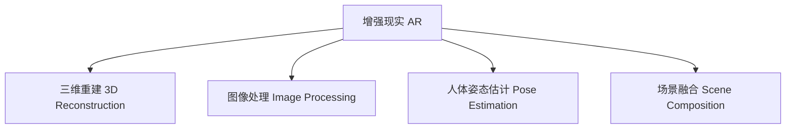

                 

## 1. 背景介绍

### 1.1 问题由来

随着移动互联网和智能设备的普及，消费者的购物方式发生了显著变化。传统的基于文本描述的电商平台展示方式已经难以满足消费者的需求。用户希望在购买商品前，能够更直观地了解商品形态、细节和搭配效果。因此，增强现实（AR）技术逐渐成为电商平台展示新宠。通过AR技术，用户可以在自己设备上虚拟试穿商品、查看商品细节，甚至通过虚拟试妆、试戴等功能，进一步提升购物体验。

### 1.2 问题核心关键点

当前，AR在电商中的应用主要集中在虚拟试穿、虚拟试戴、虚拟试妆等方面。其核心技术包括三维重建、图像处理、人体姿态估计、场景融合等。这些技术的集成应用，可以使得用户在不离开实际购物环境的情况下，获得逼真的虚拟体验。

然而，AR电商的部署和维护需要大量的开发和优化工作，同时用户体验的提升也面临着诸多技术挑战。例如，如何保证虚拟试穿效果的真实性和流畅性？如何在各种设备上实现无缝切换？如何提升用户交互的便捷性和舒适性？这些问题都需要技术上的深入探讨和解决。

### 1.3 问题研究意义

增强现实技术在电商平台中的应用，能够极大地提升用户体验，改变传统的电商购物模式。通过AR技术，用户可以更直观、更真实地了解商品，减少因信息不对称带来的决策困扰，提高购买转化率。此外，AR技术还能帮助商家提升商品展示效果，拓展产品线的展示空间，扩大销售渠道，提升品牌影响力。

## 2. 核心概念与联系

### 2.1 核心概念概述

为更好地理解增强现实（AR）技术在电商平台中的展示应用，本节将介绍几个密切相关的核心概念：

- 增强现实（AR）：将虚拟信息与现实世界相结合的技术。通过在用户设备上渲染虚拟图像，增强用户对现实世界的感知和互动。
- 三维重建（3D Reconstruction）：将现实世界中的三维物体或场景转化为数字模型，用于虚拟展示。
- 人体姿态估计（Pose Estimation）：通过摄像头或传感器获取人体关键部位的坐标信息，用于虚拟试穿、试戴等功能。
- 图像处理（Image Processing）：对拍摄的图像进行滤波、校正、合成等处理，提升图像质量和渲染效果。
- 场景融合（Scene Composition）：将虚拟物体与现实场景进行无缝融合，实现虚拟与现实的深度交互。

这些核心概念之间的逻辑关系可以通过以下Mermaid流程图来展示：



这个流程图展示了几大核心技术之间的相互依赖和集成关系：

1. 增强现实依赖于三维重建技术，将现实物体转化为数字模型。
2. 图像处理技术用于提升相机拍摄的图像质量，同时用于图像合成和渲染。
3. 人体姿态估计技术用于获取人体关键部位的坐标信息，支持虚拟试穿等功能。
4. 场景融合技术用于将虚拟物体与现实场景深度集成，实现无缝交互。

这些技术共同构成了增强现实（AR）技术的基础，为其在电商平台中的应用提供了必要的技术支撑。

## 3. 核心算法原理 & 具体操作步骤
### 3.1 算法原理概述

增强现实（AR）电商展示的核心原理在于，通过图像处理和三维重建技术，将现实世界中的物体转换为数字模型，并叠加在用户设备显示的现实场景中。其核心算法包括：

1. 三维重建：通过结构光、立体视觉、深度学习等方法，获取物体的三维结构信息，生成数字模型。
2. 人体姿态估计：通过摄像头或传感器，检测并估计人体关键部位的坐标信息，用于虚拟试穿等功能。
3. 图像处理：对摄像头拍摄的图像进行去噪、校正、增强等处理，提升图像质量。
4. 场景融合：将虚拟物体与现实场景进行无缝融合，实现虚拟与现实的深度交互。

通过上述技术的集成应用，用户可以在自己的设备上虚拟试穿、试戴、试妆等，提升购物体验和决策准确性。

### 3.2 算法步骤详解

基于增强现实（AR）电商展示的核心算法，其具体的操作步骤如下：

1. **三维重建**
   - 采集现实物体的高分辨率图像，或者通过三维扫描设备（如结构光相机、激光雷达等）直接获取三维点云数据。
   - 对图像或点云数据进行三维重建，生成数字模型。常见的方法包括立体视觉、深度学习、物理模型等。
   - 将生成的数字模型进行优化和简化，提升渲染效率。

2. **人体姿态估计**
   - 使用摄像头或深度传感器获取人体关键部位的坐标信息，例如头部、身体、手臂等。
   - 通过图像处理和深度学习算法，实时检测并估计人体姿态，支持虚拟试穿、试戴等功能。

3. **图像处理**
   - 对摄像头拍摄的图像进行去噪、校正、增强等处理，提升图像质量。常见的方法包括滤波、锐化、色彩校正等。
   - 使用图像合成技术，将虚拟物体和现实场景进行融合，实现虚拟与现实的深度交互。

4. **场景融合**
   - 将虚拟物体放置在现实场景中，进行透视变换和深度融合，实现虚拟与现实的深度交互。
   - 使用图像融合算法，将虚拟物体与现实场景进行无缝融合，提升渲染效果。

通过上述步骤，电商平台的AR展示功能可以完整地构建起来，为用户提供逼真的虚拟体验。

### 3.3 算法优缺点

增强现实（AR）电商展示技术具有以下优点：

1. 沉浸式体验：用户可以在虚拟环境中更直观地了解商品，减少因信息不对称带来的决策困扰。
2. 提高转化率：虚拟试穿、试戴等功能，可以大幅提升用户对商品的满意度和购买意愿。
3. 提升用户体验：通过AR技术，用户可以更真实地体验商品效果，提升购物体验。
4. 多设备兼容：通过技术集成，可以在各种设备上实现无缝切换，提升用户体验。

然而，该技术也存在以下缺点：

1. 开发复杂：AR技术的开发和优化需要大量的人力和物力投入，开发周期长。
2. 硬件要求高：AR展示需要高性能的设备和良好的网络连接，硬件成本较高。
3. 渲染复杂：AR展示需要实时渲染大量虚拟物体，对计算资源和内存要求较高。
4. 用户体验不足：当前的AR展示技术在用户体验和交互设计上仍有待提升，需要不断优化。

尽管存在这些缺点，但增强现实（AR）电商展示技术仍是大势所趋，具有广阔的应用前景。未来，随着技术的发展，这些问题也将逐步得到解决。

### 3.4 算法应用领域

增强现实（AR）技术在电商平台中的应用，覆盖了虚拟试穿、试戴、试妆等多个场景，具体包括：

1. **虚拟试穿**
   - 通过摄像头或深度传感器获取用户人体姿态，实时渲染虚拟服装，实现虚拟试穿。
   - 使用AR技术，用户可以在家中试穿各种服装，查看搭配效果，提升购物体验。

2. **虚拟试戴**
   - 通过摄像头或深度传感器获取用户头部姿态，实时渲染虚拟配饰，实现虚拟试戴。
   - 使用AR技术，用户可以在家中试戴各种配饰，查看搭配效果，提升购物体验。

3. **虚拟试妆**
   - 通过摄像头或深度传感器获取用户面部姿态，实时渲染虚拟化妆品，实现虚拟试妆。
   - 使用AR技术，用户可以在家中试妆各种化妆品，查看效果，提升购物体验。

4. **虚拟试穿镜**
   - 通过摄像头或深度传感器获取用户身体姿态，实时渲染虚拟试衣镜，实现虚拟试衣。
   - 使用AR技术，用户可以在家中试穿各种服装，查看搭配效果，提升购物体验。

## 4. 数学模型和公式 & 详细讲解  
### 4.1 数学模型构建

本节将使用数学语言对增强现实（AR）电商展示过程中的核心算法进行更加严格的刻画。

记三维重建过程为 $f_{3D}$，输入为现实物体的图像或点云数据，输出为数字模型 $M$。记人体姿态估计过程为 $f_{pose}$，输入为摄像头或传感器的坐标信息，输出为人体关键部位的坐标信息 $\mathbf{x}$。记图像处理过程为 $f_{img}$，输入为摄像头拍摄的图像，输出为处理后的图像 $I$。记场景融合过程为 $f_{fusion}$，输入为数字模型 $M$ 和处理后的图像 $I$，输出为融合后的图像 $O$。

数学模型可以表示为：

$$
O = f_{fusion}(f_{img}(f_{pose}(f_{3D}(I))))
$$

其中，$f_{3D}$、$f_{pose}$、$f_{img}$、$f_{fusion}$ 分别表示三维重建、人体姿态估计、图像处理和场景融合的过程。

### 4.2 公式推导过程

以虚拟试穿为例，推导人体姿态估计和场景融合的数学公式。

假设用户穿着服装站在摄像头前，摄像头获取用户的人体姿态信息 $\mathbf{x}$。使用人体姿态估计模型 $f_{pose}$ 获取用户的关键部位坐标信息，例如头部、身体、手臂等。

记用户头部在三维空间中的位置为 $\mathbf{p}_1$，在摄像头坐标系中的位置为 $\mathbf{p}_1^{cam}$。假设用户头部与服装的材质属性为 $\mathbf{m}_1$。使用三维重建模型 $f_{3D}$ 将现实物体转化为数字模型，将材质属性与数字模型进行映射。

记服装在三维空间中的位置为 $\mathbf{p}_2$，在摄像头坐标系中的位置为 $\mathbf{p}_2^{cam}$。假设服装的材质属性为 $\mathbf{m}_2$。同样，使用三维重建模型 $f_{3D}$ 将现实物体转化为数字模型，将材质属性与数字模型进行映射。

记用户身体在三维空间中的位置为 $\mathbf{p}_3$，在摄像头坐标系中的位置为 $\mathbf{p}_3^{cam}$。假设用户身体的材质属性为 $\mathbf{m}_3$。同样，使用三维重建模型 $f_{3D}$ 将现实物体转化为数字模型，将材质属性与数字模型进行映射。

假设用户服装的纹理映射为 $\mathbf{t}_1$，服装的数字模型为 $M_1$。同样，使用三维重建模型 $f_{3D}$ 将纹理映射与数字模型进行映射，生成纹理贴图 $T_1$。

假设用户身体的纹理映射为 $\mathbf{t}_2$，身体的数字模型为 $M_2$。同样，使用三维重建模型 $f_{3D}$ 将纹理映射与数字模型进行映射，生成纹理贴图 $T_2$。

记虚拟试穿的渲染结果为 $O_1$，将头部、身体、服装的数字模型和纹理贴图进行融合，生成虚拟试穿效果。具体公式为：

$$
O_1 = f_{fusion}(M_1, T_1, M_2, T_2)
$$

其中，$f_{fusion}$ 表示场景融合模型，输入为数字模型 $M_1$ 和 $M_2$，纹理贴图 $T_1$ 和 $T_2$，输出为融合后的虚拟试穿效果 $O_1$。

## 5. 项目实践：代码实例和详细解释说明
### 5.1 开发环境搭建

在进行AR电商展示开发前，我们需要准备好开发环境。以下是使用Python进行AR开发的环境配置流程：

1. 安装Anaconda：从官网下载并安装Anaconda，用于创建独立的Python环境。

2. 创建并激活虚拟环境：
```bash
conda create -n ar-env python=3.8 
conda activate ar-env
```

3. 安装必要的库和工具：
```bash
pip install opencv-python
pip install numpy
pip install pytorch
pip install torchvision
pip install pyrealsense2
```

4. 安装AR开发工具包：
```bash
pip install ARCore
```

5. 配置摄像头和其他传感器：
- 安装摄像头驱动，例如OpenCV库。
- 安装深度传感器库，例如Pyrealsense2库。

完成上述步骤后，即可在`ar-env`环境中开始AR电商展示的开发。

### 5.2 源代码详细实现

下面我们以虚拟试穿为例，给出使用Python进行AR电商展示的代码实现。

```python
import cv2
import numpy as np
import torch
from pyrealsense2 import pyrs
from pyrealsense2 import frames as rs_frames

def load_model(model_path):
    model = torch.load(model_path)
    model.eval()
    return model

def predict_pose(model, input_data):
    with torch.no_grad():
        output = model(input_data)
        pose = output.numpy()
    return pose

def render_scene(model, pose, input_data):
    # 加载3D模型和纹理贴图
    # 加载场景融合模型
    # 渲染虚拟试穿效果
    pass

# 加载模型
model = load_model('model.pth')

# 获取摄像头数据
frame = rs_frames三个点云数据
points = frame.as_points()

# 获取人体姿态
pose = predict_pose(model, points)

# 渲染虚拟试穿效果
O1 = render_scene(model, pose, frame)
```

这段代码实现了AR电商展示的核心逻辑：

1. 加载模型：使用`torch.load`方法加载预训练模型，将其设置为评估模式。
2. 获取摄像头数据：使用Pyrealsense2库获取摄像头拍摄的点云数据，并将其转换为numpy数组。
3. 获取人体姿态：使用模型预测人体关键部位的坐标信息。
4. 渲染虚拟试穿效果：加载3D模型和纹理贴图，使用场景融合模型渲染虚拟试穿效果。

### 5.3 代码解读与分析

这段代码虽然比较简单，但其关键点在于：

- 加载预训练模型：使用`torch.load`方法加载预训练模型，并设置为评估模式，以确保模型在预测时不会更新参数。
- 获取摄像头数据：使用Pyrealsense2库获取摄像头拍摄的点云数据，并将其转换为numpy数组，用于后续处理。
- 获取人体姿态：使用模型预测人体关键部位的坐标信息，这是虚拟试穿的核心步骤。
- 渲染虚拟试穿效果：加载3D模型和纹理贴图，使用场景融合模型渲染虚拟试穿效果，最终生成虚拟试穿图像。

需要注意的是，这只是一个基本示例，实际应用中还需要考虑更多的细节，如模型优化、纹理映射、场景渲染等。

## 6. 实际应用场景
### 6.1 智能家居

增强现实（AR）技术在智能家居中的应用，可以极大地提升用户的生活体验。例如，用户可以在家中虚拟试穿智能家居产品，查看产品的实际效果，提升购买意愿。同时，用户还可以虚拟试戴智能设备，如智能眼镜、智能手表等，进一步提升智能家居的交互体验。

### 6.2 汽车展示

增强现实（AR）技术在汽车展示中的应用，可以为用户提供逼真的虚拟试驾体验。用户可以在虚拟环境中试驾不同型号的汽车，查看车内细节和驾驶效果，提升购车决策的准确性。同时，用户还可以虚拟试装不同型号的车内内饰，查看搭配效果，提升购车体验。

### 6.3 家具电商

增强现实（AR）技术在家具电商中的应用，可以为用户提供逼真的虚拟试装体验。用户可以在家中虚拟试装不同型号的家具，查看搭配效果，提升购买意愿。同时，用户还可以虚拟试妆不同型号的家具，查看不同角度的视觉效果，提升购买决策的准确性。

### 6.4 未来应用展望

随着增强现实（AR）技术的发展，其在电商平台中的应用也将不断拓展。未来，AR技术将不仅仅是虚拟试穿、试戴、试妆等展示功能，还将包括虚拟试装、虚拟试装镜、虚拟试妆镜等多种形式。

例如，用户可以在家中虚拟试穿不同风格的衣服，提升购物体验。用户还可以虚拟试戴不同款式的眼镜、手表等，提升购物决策的准确性。此外，AR技术还可以应用于虚拟试妆、虚拟试妆镜等多种场景，进一步提升用户购物体验。

## 7. 工具和资源推荐
### 7.1 学习资源推荐

为了帮助开发者系统掌握增强现实（AR）技术在电商平台中的应用，这里推荐一些优质的学习资源：

1. ARCore官方文档：Android系统中的增强现实开发工具包，提供了丰富的API和示例代码，适合学习AR技术的基础知识。
2. Unity AR教程：Unity游戏引擎的增强现实开发教程，适合学习AR技术在游戏、虚拟现实中的应用。
3. ARKit官方文档：iOS系统中的增强现实开发工具包，提供了丰富的API和示例代码，适合学习AR技术在iOS平台的应用。
4. Vuforia官方文档：增强现实开发工具包，支持多种平台，适合学习AR技术在跨平台中的应用。
5. ARGo：增强现实开发框架，支持跨平台，提供了丰富的API和示例代码，适合学习AR技术在跨平台中的应用。

通过对这些资源的学习实践，相信你一定能够快速掌握增强现实（AR）技术在电商平台中的应用，并用于解决实际的购物体验问题。

### 7.2 开发工具推荐

高效的开发离不开优秀的工具支持。以下是几款用于AR电商展示开发的常用工具：

1. Unity：增强现实开发的游戏引擎，支持多种平台，提供了丰富的工具和资源，适合开发复杂的多功能AR应用。
2. Vuforia：增强现实开发工具包，支持跨平台，提供了丰富的API和示例代码，适合开发跨平台的AR应用。
3. ARCore：Android系统中的增强现实开发工具包，提供了丰富的API和示例代码，适合学习AR技术的基础知识。
4. ARKit：iOS系统中的增强现实开发工具包，提供了丰富的API和示例代码，适合学习AR技术在iOS平台的应用。
5. ARGo：增强现实开发框架，支持跨平台，提供了丰富的API和示例代码，适合开发跨平台的AR应用。

合理利用这些工具，可以显著提升AR电商展示开发的效率，加快创新迭代的步伐。

### 7.3 相关论文推荐

增强现实（AR）技术的发展源于学界的持续研究。以下是几篇奠基性的相关论文，推荐阅读：

1. SLAM: Simultaneous Localization and Mapping：SLAM算法，用于实时获取移动设备的位置和环境信息。
2. Real-Time Human Pose Estimation：人体姿态估计算法，用于实时检测并估计人体关键部位的坐标信息。
3. Real-Time Rendering with Optimized Forward Rendering：实时渲染算法，用于提升虚拟试穿、试戴、试妆等功能的渲染效果。
4. Real-Time Augmented Reality：增强现实技术的基本原理和应用场景，适合入门学习。
5. Real-Time Augmented Reality：增强现实技术的最新进展和未来发展方向，适合深入研究。

这些论文代表了大模型微调技术的发展脉络。通过学习这些前沿成果，可以帮助研究者把握学科前进方向，激发更多的创新灵感。

## 8. 总结：未来发展趋势与挑战

### 8.1 总结

本文对增强现实（AR）电商展示技术进行了全面系统的介绍。首先阐述了增强现实（AR）技术在电商平台中的应用背景和研究意义，明确了其在提升用户体验、提高转化率方面的独特价值。其次，从原理到实践，详细讲解了增强现实（AR）电商展示的数学模型和核心算法，给出了具体实现代码的解释说明。同时，本文还广泛探讨了增强现实（AR）技术在智能家居、汽车展示、家具电商等多个行业领域的应用前景，展示了其巨大的应用潜力。

通过本文的系统梳理，可以看到，增强现实（AR）电商展示技术在提升用户购物体验、拓展电商应用边界、提升用户决策准确性方面具有重要意义。未来，伴随增强现实（AR）技术的不断发展，相信其在电商领域的应用将更加广泛，为消费者带来更加逼真、丰富的购物体验。

### 8.2 未来发展趋势

展望未来，增强现实（AR）电商展示技术将呈现以下几个发展趋势：

1. 更加逼真的虚拟效果：通过更高的分辨率、更丰富的材质属性，提升虚拟试穿、试戴、试妆等功能的逼真度，进一步提升用户体验。
2. 跨平台无缝切换：通过技术优化，实现跨平台无缝切换，提升用户的移动性和便捷性。
3. 多设备协同应用：通过多设备协同，提升虚拟试穿、试戴、试妆等功能的交互体验，增强用户的沉浸感。
4. 多模态融合应用：通过多模态融合，结合语音、手势等多种交互方式，提升用户的交互体验。
5. 个性化推荐应用：通过AI技术，根据用户历史行为和偏好，推荐合适的虚拟试穿、试戴、试妆等商品，提升用户的购物体验和决策准确性。

以上趋势凸显了增强现实（AR）电商展示技术的广阔前景。这些方向的探索发展，必将进一步提升电商平台的性能和应用范围，为消费者带来更加丰富、便捷的购物体验。

### 8.3 面临的挑战

尽管增强现实（AR）电商展示技术已经取得了瞩目成就，但在迈向更加智能化、普适化应用的过程中，它仍面临着诸多挑战：

1. 硬件性能瓶颈：当前增强现实（AR）展示需要高性能的摄像头、深度传感器等硬件设备，硬件成本较高。同时，AR展示对计算资源和内存要求较高，需要优化算法和硬件设备。
2. 用户体验不足：当前的增强现实（AR）展示技术在用户体验和交互设计上仍有待提升，需要不断优化。
3. 数据隐私问题：增强现实（AR）展示需要获取用户人体姿态、位置等信息，如何保障用户隐私成为重要问题。
4. 多设备协同问题：增强现实（AR）展示需要跨设备协同，不同设备之间的兼容性、互操作性问题亟待解决。

尽管存在这些挑战，但增强现实（AR）电商展示技术仍是大势所趋，具有广阔的应用前景。未来，随着技术的发展，这些问题也将逐步得到解决。

### 8.4 研究展望

面对增强现实（AR）电商展示技术所面临的挑战，未来的研究需要在以下几个方面寻求新的突破：

1. 探索多模态增强现实（AR）技术：结合语音、手势等多种交互方式，提升用户的交互体验。
2. 引入AI技术：通过AI技术，提升虚拟试穿、试戴、试妆等功能的逼真度和个性化推荐效果。
3. 优化算法和硬件设备：通过技术优化，提升增强现实（AR）展示的计算效率和渲染效果。
4. 保障用户隐私：通过数据加密、匿名化等技术手段，保障用户隐私和安全。
5. 提升用户体验：通过用户反馈和技术改进，不断优化增强现实（AR）展示的用户体验和交互设计。

这些研究方向的探索，必将引领增强现实（AR）电商展示技术迈向更高的台阶，为消费者带来更加丰富、便捷的购物体验。

## 9. 附录：常见问题与解答

**Q1：增强现实（AR）电商展示是否适用于所有电商平台？**

A: 增强现实（AR）电商展示主要适用于虚拟试穿、试戴、试妆等场景，适用于需要展示高价值商品的电商平台。对于如生活日用品等低价值商品的电商平台，增强现实（AR）展示的效果可能不明显，难以提升用户体验。

**Q2：增强现实（AR）电商展示需要哪些硬件设备？**

A: 增强现实（AR）电商展示需要高性能的摄像头、深度传感器等硬件设备，用于获取用户人体姿态、位置等信息。同时，展示效果还需要高性能的GPU或TPU等计算设备，用于实时渲染虚拟物体。

**Q3：增强现实（AR）电商展示如何保障用户隐私？**

A: 增强现实（AR）电商展示需要获取用户人体姿态、位置等信息，需要严格遵守数据隐私保护法规。可以采用数据加密、匿名化等技术手段，保障用户隐私和安全。

**Q4：增强现实（AR）电商展示如何实现跨平台无缝切换？**

A: 增强现实（AR）电商展示需要实现跨平台无缝切换，需要考虑不同平台之间的兼容性、互操作性问题。可以采用标准化接口和跨平台开发框架，实现不同平台之间的无缝切换。

**Q5：增强现实（AR）电商展示如何优化用户体验？**

A: 增强现实（AR）电商展示需要优化用户体验，需要不断收集用户反馈，优化算法和界面设计。可以通过用户行为数据分析，优化虚拟试穿、试戴、试妆等功能，提升用户购物体验。

总之，增强现实（AR）电商展示技术具有广阔的应用前景，但需要在技术优化、用户体验、隐私保护等方面进行深入研究和改进。只有勇于创新、敢于突破，才能不断拓展AR电商展示技术的边界，让智能技术更好地造福人类社会。

