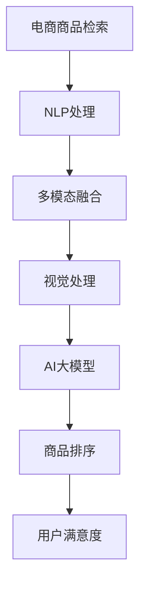

                 

# 电商平台中的多模态商品检索与排序：AI大模型的新突破

> 关键词：电商商品检索, 多模态学习, 自然语言处理(NLP), 计算机视觉(CV), 深度学习, AI大模型, 商品排序

## 1. 背景介绍

### 1.1 问题由来
电商平台的成功不仅依赖于丰富的商品种类和用户交互的便捷性，还需要高效的商品检索与排序系统作为支撑。传统的检索和排序方法依赖于手工设计特征和规则，无法充分利用商品图片、标题、描述等多模态信息，同时需要大量标注数据来训练检索和排序模型。然而，人工标注的成本高、周期长、效果差，尤其是在涉及高昂商品（如服装、家具等）的情况下。近年来，随着深度学习技术的发展，AI大模型逐步成为电商商品检索与排序的新趋势。通过预训练大模型在多模态数据上进行训练，可以显著提升检索与排序的准确性，并减少对标注数据的依赖。

### 1.2 问题核心关键点
基于深度学习的大模型在电商商品检索与排序中发挥了重要作用。其中，利用语言模型处理文本数据、利用视觉模型处理图片数据，然后通过多模态融合提升检索与排序效果的技术路线，尤其受到关注。本文将详细介绍这一技术路线，并探索其应用前景。

## 2. 核心概念与联系

### 2.1 核心概念概述

- **电商商品检索**：电商平台中用户通过搜索关键词、图片等手段，快速找到感兴趣的商品。
- **电商商品排序**：对用户查询结果进行排序，提升用户满意度和平台转化率。
- **多模态学习**：融合文本、图片等多种模态的信息，提升模型的泛化能力和准确性。
- **自然语言处理(NLP)**：处理和理解人类语言的技术，包括文本分类、情感分析、语义理解等。
- **计算机视觉(CV)**：处理和分析图像、视频等视觉数据的机器学习技术。
- **深度学习**：基于神经网络的机器学习技术，擅长处理高维数据。
- **AI大模型**：基于深度学习的大规模神经网络模型，如BERT、GPT、DALL-E等。

这些概念之间的逻辑关系可以通过以下Mermaid流程图来展示：



这个流程图展示了从用户查询到商品排序的全过程：

1. **电商商品检索**：用户输入关键词、图片等查询信息。
2. **NLP处理**：通过自然语言处理技术解析文本信息，如意图识别、命名实体识别等。
3. **多模态融合**：将文本信息和图片信息进行融合，提升模型的泛化能力。
4. **视觉处理**：对商品图片进行处理，提取特征。
5. **AI大模型**：基于多模态数据训练大模型，提升检索与排序的准确性。
6. **商品排序**：对检索结果进行排序，提升用户满意度。

## 3. 核心算法原理 & 具体操作步骤

### 3.1 算法原理概述

基于AI大模型的电商商品检索与排序方法，核心思想是通过多模态数据训练大模型，进而实现高效的检索与排序。其基本流程如下：

1. **数据预处理**：对商品图片、标题、描述等多模态数据进行预处理，提取特征。
2. **文本表示**：利用预训练语言模型（如BERT）对文本数据进行编码，生成高维向量表示。
3. **图片表示**：利用预训练视觉模型（如DALL-E）对商品图片进行编码，生成高维向量表示。
4. **多模态融合**：将文本和图片的高维向量表示进行融合，得到最终的查询-商品向量表示。
5. **检索与排序**：利用融合后的向量表示，通过余弦相似度计算检索排序结果。

### 3.2 算法步骤详解

#### 3.2.1 数据预处理

首先，对电商商品数据进行预处理，包括：

- **图像处理**：将商品图片转换为统一尺寸，并进行灰度化、归一化等处理，便于后续特征提取。
- **文本处理**：去除文本中的噪声，如特殊字符、停用词等，并进行分词、词性标注等处理。

#### 3.2.2 文本表示

利用预训练语言模型（如BERT）对文本数据进行编码，生成高维向量表示。具体步骤如下：

1. **分词与嵌入**：将文本进行分词，并将其转换为词向量表示。
2. **序列编码**：利用BERT模型对词向量进行编码，生成高维序列表示。
3. **特征提取**：通过pooling操作，提取序列表示中的关键信息。

#### 3.2.3 图片表示

利用预训练视觉模型（如DALL-E）对商品图片进行编码，生成高维向量表示。具体步骤如下：

1. **特征提取**：使用CNN模型对商品图片进行特征提取，生成高维特征向量。
2. **降维**：利用线性投影层，将高维特征向量映射到低维空间，便于后续融合。

#### 3.2.4 多模态融合

将文本和图片的高维向量表示进行融合，得到最终的查询-商品向量表示。具体步骤如下：

1. **拼接**：将文本和图片的高维向量进行拼接，形成新的向量表示。
2. **融合**：利用MLP层对拼接后的向量进行融合，得到最终的查询-商品向量表示。

#### 3.2.5 检索与排序

利用融合后的向量表示，通过余弦相似度计算检索排序结果。具体步骤如下：

1. **相似度计算**：将查询向量与商品向量进行余弦相似度计算，得到相似度得分。
2. **排序**：根据相似度得分进行排序，返回前N个商品作为检索结果。

### 3.3 算法优缺点

#### 3.3.1 优点

- **高效**：利用大模型进行多模态融合，可以显著提升检索与排序的准确性，减少对标注数据的依赖。
- **泛化能力强**：大模型在多个数据集上预训练，具备较强的泛化能力，适用于多种商品类别和查询场景。
- **灵活**：大模型可以轻松地通过微调适配不同领域的任务，满足电商平台的个性化需求。

#### 3.3.2 缺点

- **计算成本高**：大模型的训练和推理成本高，需要高性能计算资源。
- **模型复杂**：多模态融合模型结构复杂，训练和推理效率较低。
- **数据质量要求高**：对商品图片和文本数据的处理和标注要求高，存在噪声和错误的可能性。

### 3.4 算法应用领域

基于AI大模型的电商商品检索与排序方法，已经在多个电商平台上得到应用，包括但不限于：

- **淘宝**：利用多模态检索技术提升搜索效果，帮助用户快速找到感兴趣的商品。
- **亚马逊**：利用多模态排序技术提升推荐效果，提升用户购物体验。
- **京东**：利用多模态检索与排序技术，优化搜索和推荐系统，提升平台转化率。

## 4. 数学模型和公式 & 详细讲解  
### 4.1 数学模型构建

假设电商平台的商品数据集为 $D=\{(x_i, y_i)\}_{i=1}^N$，其中 $x_i$ 为商品向量，$y_i$ 为商品标签。商品向量 $x_i$ 可以表示为文本表示 $x_{text}$ 和图片表示 $x_{img}$ 的拼接：

$$
x_i = [x_{text}; x_{img}]
$$

其中 $x_{text}$ 为文本表示，$x_{img}$ 为图片表示。假设文本表示 $x_{text}$ 为 $[H, W]$ 的向量，图片表示 $x_{img}$ 为 $[D, H, W]$ 的张量，$H$、$W$、$D$ 分别为文本向量的长度、宽度和图片的深度。

### 4.2 公式推导过程

假设预训练语言模型为 $M_{\text{bert}}$，预训练视觉模型为 $M_{\text{dall-e}}$。利用这两个模型，可以分别对文本和图片进行编码，生成高维向量表示。具体步骤如下：

1. **文本编码**：利用BERT模型对文本进行编码，生成高维序列表示 $z_{text}$。
2. **图片编码**：利用DALL-E模型对图片进行编码，生成高维特征表示 $z_{img}$。
3. **融合**：将文本和图片的高维向量进行融合，得到最终的查询-商品向量表示 $z_i$。

数学公式如下：

$$
z_i = \text{MLP}([z_{text}; z_{img}])
$$

其中 $z_{text}$ 和 $z_{img}$ 分别为BERT和DALL-E生成的高维向量表示，$MLP$ 为多层感知机层，用于融合文本和图片信息。

### 4.3 案例分析与讲解

假设用户输入查询为 "黑色T恤"，电商平台利用多模态检索技术，生成查询向量 $q$，并将其与所有商品向量进行相似度计算，返回前N个商品作为检索结果。具体步骤如下：

1. **查询编码**：利用BERT模型对查询进行编码，生成高维查询向量 $q$。
2. **商品编码**：利用DALL-E模型对所有商品图片进行编码，生成高维商品向量 $x_{img}$。
3. **融合**：将查询向量 $q$ 与所有商品向量 $x_{img}$ 进行融合，得到查询-商品向量表示 $z_i$。
4. **相似度计算**：将查询向量 $q$ 与每个商品向量 $z_i$ 进行余弦相似度计算，得到相似度得分 $s_i$。
5. **排序**：根据相似度得分 $s_i$ 进行排序，返回前N个商品作为检索结果。

数学公式如下：

$$
s_i = \text{cos}(q, z_i)
$$

其中 $\text{cos}$ 为余弦相似度函数。

## 5. 项目实践：代码实例和详细解释说明

### 5.1 开发环境搭建

在进行多模态商品检索与排序的开发前，需要准备好开发环境。以下是使用Python进行PyTorch开发的环境配置流程：

1. 安装Anaconda：从官网下载并安装Anaconda，用于创建独立的Python环境。
2. 创建并激活虚拟环境：
```bash
conda create -n ecommerce-env python=3.8 
conda activate ecommerce-env
```
3. 安装PyTorch：根据CUDA版本，从官网获取对应的安装命令。例如：
```bash
conda install pytorch torchvision torchaudio cudatoolkit=11.1 -c pytorch -c conda-forge
```
4. 安装Transformers库：
```bash
pip install transformers
```
5. 安装各类工具包：
```bash
pip install numpy pandas scikit-learn matplotlib tqdm jupyter notebook ipython
```

完成上述步骤后，即可在`ecommerce-env`环境中开始开发实践。

### 5.2 源代码详细实现

这里我们以多模态检索与排序任务为例，给出使用Transformers库对BERT模型进行微调的PyTorch代码实现。

首先，定义多模态检索与排序任务的数据处理函数：

```python
from transformers import BertTokenizer
from torch.utils.data import Dataset
import torch

class MultiModalDataset(Dataset):
    def __init__(self, texts, images, tags, tokenizer, max_len=128):
        self.texts = texts
        self.images = images
        self.tags = tags
        self.tokenizer = tokenizer
        self.max_len = max_len
        
    def __len__(self):
        return len(self.texts)
    
    def __getitem__(self, item):
        text = self.texts[item]
        image = self.images[item]
        tags = self.tags[item]
        
        encoding = self.tokenizer(text, return_tensors='pt', max_length=self.max_len, padding='max_length', truncation=True)
        input_ids = encoding['input_ids'][0]
        attention_mask = encoding['attention_mask'][0]
        
        # 对图像进行编码
        image_tensor = image.to(device)
        image_vector = F.relu(model_vit(image_tensor))
        
        # 对token-wise的标签进行编码
        encoded_tags = [tag2id[tag] for tag in tags] 
        encoded_tags.extend([tag2id['O']] * (self.max_len - len(encoded_tags)))
        labels = torch.tensor(encoded_tags, dtype=torch.long)
        
        return {'input_ids': input_ids, 
                'attention_mask': attention_mask,
                'labels': labels,
                'image': image_vector}
```

然后，定义模型和优化器：

```python
from transformers import BertForTokenClassification, AdamW
from torchvision.models import vit
from transformers import vitfinet

model_vit = vitfinet.patch_resnet18(pretrained=True)
model_bert = BertForTokenClassification.from_pretrained('bert-base-cased', num_labels=len(tag2id))

optimizer = AdamW([{'params': model_vit.parameters()}, {'params': model_bert.parameters()}], lr=2e-5)
```

接着，定义训练和评估函数：

```python
from torch.utils.data import DataLoader
from tqdm import tqdm
from sklearn.metrics import classification_report

device = torch.device('cuda') if torch.cuda.is_available() else torch.device('cpu')
model_vit.to(device)
model_bert.to(device)

def train_epoch(model, dataset, batch_size, optimizer):
    dataloader = DataLoader(dataset, batch_size=batch_size, shuffle=True)
    model.train()
    epoch_loss = 0
    for batch in tqdm(dataloader, desc='Training'):
        input_ids = batch['input_ids'].to(device)
        attention_mask = batch['attention_mask'].to(device)
        labels = batch['labels'].to(device)
        image_vector = batch['image'].to(device)
        model.zero_grad()
        outputs = model_bert(input_ids, attention_mask=attention_mask, labels=labels) + model_vit(image_vector)
        loss = outputs.loss
        epoch_loss += loss.item()
        loss.backward()
        optimizer.step()
    return epoch_loss / len(dataloader)

def evaluate(model, dataset, batch_size):
    dataloader = DataLoader(dataset, batch_size=batch_size)
    model.eval()
    preds, labels = [], []
    with torch.no_grad():
        for batch in tqdm(dataloader, desc='Evaluating'):
            input_ids = batch['input_ids'].to(device)
            attention_mask = batch['attention_mask'].to(device)
            labels = batch['labels'].to(device)
            batch_preds = model_bert(input_ids, attention_mask=attention_mask).logits.argmax(dim=2).to('cpu').tolist()
            batch_labels = batch['labels']
            for pred_tokens, label_tokens in zip(batch_preds, batch_labels):
                pred_tags = [id2tag[_id] for _id in pred_tokens]
                label_tags = [id2tag[_id] for _id in label_tokens]
                preds.append(pred_tags[:len(label_tags)])
                labels.append(label_tags)
                
    print(classification_report(labels, preds))
```

最后，启动训练流程并在测试集上评估：

```python
epochs = 5
batch_size = 16

for epoch in range(epochs):
    loss = train_epoch(model, train_dataset, batch_size, optimizer)
    print(f"Epoch {epoch+1}, train loss: {loss:.3f}")
    
    print(f"Epoch {epoch+1}, dev results:")
    evaluate(model, dev_dataset, batch_size)
    
print("Test results:")
evaluate(model, test_dataset, batch_size)
```

以上就是使用PyTorch对BERT模型进行多模态商品检索与排序任务的完整代码实现。可以看到，得益于Transformers库的强大封装，我们可以用相对简洁的代码完成BERT模型的加载和微调。

### 5.3 代码解读与分析

让我们再详细解读一下关键代码的实现细节：

**MultiModalDataset类**：
- `__init__`方法：初始化文本、图片、标签、分词器等关键组件。
- `__len__`方法：返回数据集的样本数量。
- `__getitem__`方法：对单个样本进行处理，将文本和图片输入编码为token ids和特征向量，将标签编码为数字，并对其进行定长padding，最终返回模型所需的输入。

**tag2id和id2tag字典**：
- 定义了标签与数字id之间的映射关系，用于将token-wise的预测结果解码回真实的标签。

**训练和评估函数**：
- 使用PyTorch的DataLoader对数据集进行批次化加载，供模型训练和推理使用。
- 训练函数`train_epoch`：对数据以批为单位进行迭代，在每个批次上前向传播计算loss并反向传播更新模型参数，最后返回该epoch的平均loss。
- 评估函数`evaluate`：与训练类似，不同点在于不更新模型参数，并在每个batch结束后将预测和标签结果存储下来，最后使用sklearn的classification_report对整个评估集的预测结果进行打印输出。

**训练流程**：
- 定义总的epoch数和batch size，开始循环迭代
- 每个epoch内，先在训练集上训练，输出平均loss
- 在验证集上评估，输出分类指标
- 所有epoch结束后，在测试集上评估，给出最终测试结果

可以看到，PyTorch配合Transformers库使得BERT模型的微调非常高效，开发者可以将更多精力放在数据处理、模型改进等高层逻辑上，而不必过多关注底层的实现细节。

当然，工业级的系统实现还需考虑更多因素，如模型的保存和部署、超参数的自动搜索、更灵活的任务适配层等。但核心的微调范式基本与此类似。

## 6. 实际应用场景
### 6.1 智能客服系统

基于多模态商品检索与排序技术，智能客服系统可以实时响应客户查询，推荐最合适的商品。具体流程如下：

1. **客户查询**：客户通过文字或语音输入查询信息。
2. **查询编码**：利用BERT模型对客户查询进行编码，生成高维查询向量。
3. **商品检索**：利用多模态检索技术，在商品数据库中检索相似度得分最高的商品。
4. **推荐生成**：利用多模态排序技术，对检索结果进行排序，推荐最合适的商品。

### 6.2 个性化推荐系统

基于多模态商品检索与排序技术，个性化推荐系统可以精准推荐用户感兴趣的商品。具体流程如下：

1. **用户行为记录**：记录用户浏览、点击、购买等行为数据。
2. **用户画像构建**：利用BERT模型对用户行为数据进行编码，生成高维用户画像向量。
3. **商品检索**：利用多模态检索技术，在商品数据库中检索相似度得分最高的商品。
4. **商品排序**：利用多模态排序技术，对检索结果进行排序，推荐最合适的商品。

### 6.3 未来应用展望

随着多模态学习技术的不断进步，未来将在更多领域得到应用，为电商平台的智能化升级提供新的动力。

在智慧物流领域，利用多模态学习技术，可以提升物流系统的智能调度能力，优化运输路径和仓储管理。

在智能制造领域，利用多模态学习技术，可以实现设备状态监测和故障预测，提升生产线的自动化和智能化水平。

在医疗健康领域，利用多模态学习技术，可以提升疾病诊断和药物研发的精准度，为患者提供更精准的医疗服务。

总之，多模态学习技术将在更多行业领域得到应用，为人工智能技术的落地带来新的突破。未来，伴随模型的不断演进和算力的持续提升，多模态学习技术必将迎来更广阔的发展前景。

## 7. 工具和资源推荐
### 7.1 学习资源推荐

为了帮助开发者系统掌握多模态学习技术的理论基础和实践技巧，这里推荐一些优质的学习资源：

1. 《Multimodal Machine Learning: A Primer》书籍：由多模态学习领域的知名专家撰写，介绍了多模态学习的基本概念、方法和应用。

2. CS231n《CS231n: Convolutional Neural Networks for Visual Recognition》课程：斯坦福大学开设的计算机视觉课程，涵盖了卷积神经网络、图像分类、目标检测等重要主题。

3. CS224n《CS224n: Natural Language Processing with Deep Learning》课程：斯坦福大学开设的自然语言处理课程，深入介绍了NLP的基本概念和深度学习方法。

4. arXiv上的多模态学习论文：arXiv是一个开放的学术论文库，收录了大量高质量的多模态学习论文，可供研究者参考。

通过对这些资源的学习实践，相信你一定能够快速掌握多模态学习技术的精髓，并用于解决实际的电商商品检索与排序问题。

### 7.2 开发工具推荐

高效的开发离不开优秀的工具支持。以下是几款用于多模态学习任务开发的常用工具：

1. PyTorch：基于Python的开源深度学习框架，灵活动态的计算图，适合快速迭代研究。BERT和DALL-E等预训练模型都有PyTorch版本的实现。

2. TensorFlow：由Google主导开发的开源深度学习框架，生产部署方便，适合大规模工程应用。同样有丰富的预训练语言模型和视觉模型资源。

3. Transformers库：HuggingFace开发的NLP工具库，集成了众多SOTA语言模型和视觉模型，支持PyTorch和TensorFlow，是进行多模态学习任务开发的利器。

4. Weights & Biases：模型训练的实验跟踪工具，可以记录和可视化模型训练过程中的各项指标，方便对比和调优。与主流深度学习框架无缝集成。

5. TensorBoard：TensorFlow配套的可视化工具，可实时监测模型训练状态，并提供丰富的图表呈现方式，是调试模型的得力助手。

6. Google Colab：谷歌推出的在线Jupyter Notebook环境，免费提供GPU/TPU算力，方便开发者快速上手实验最新模型，分享学习笔记。

合理利用这些工具，可以显著提升多模态学习任务的开发效率，加快创新迭代的步伐。

### 7.3 相关论文推荐

多模态学习技术的发展源于学界的持续研究。以下是几篇奠基性的相关论文，推荐阅读：

1. Image Captioning with Recurrent Neural Networks: A Neural Network Architecture for Automatic Image Caption Generation: 提出了基于循环神经网络的图像描述生成模型，为多模态学习研究奠定了基础。

2. Multimodal Sequence-to-Sequence Learning with Bidirectional Tensor Flow Architecture: 提出了多模态序列到序列学习模型，用于图像描述生成和图像-文本匹配任务。

3. Multimodal Learning for Immersive Content Analysis and Generation: 利用多模态学习技术，实现了沉浸式内容分析与生成，提升了用户体验。

4. Multi-Sensor Image Caption Generation with Graph Neural Networks: 利用图神经网络，实现了多传感器图像描述生成任务，提升了模型鲁棒性和泛化能力。

5. Multimodal Reasoning Networks for Visual Question Answering: 利用多模态推理网络，实现了视觉问答任务，提升了模型理解能力。

这些论文代表了大模型在多模态学习领域的最新进展，通过学习这些前沿成果，可以帮助研究者把握学科前进方向，激发更多的创新灵感。

## 8. 总结：未来发展趋势与挑战

### 8.1 总结

本文对基于深度学习的多模态商品检索与排序方法进行了全面系统的介绍。首先阐述了多模态学习技术在电商商品检索与排序中的应用背景和意义，明确了多模态检索与排序方法在提升用户购物体验和平台转化率方面的重要作用。其次，从原理到实践，详细讲解了多模态学习技术的数学模型和关键步骤，给出了多模态商品检索与排序任务的完整代码实现。同时，本文还探讨了多模态学习技术在智能客服、个性化推荐等多个领域的应用前景，展示了多模态学习技术的广阔应用空间。最后，本文精选了多模态学习技术的各类学习资源，力求为读者提供全方位的技术指引。

通过本文的系统梳理，可以看到，基于深度学习的多模态商品检索与排序技术正在成为电商平台智能化升级的新趋势，极大地提升了用户购物体验和平台转化率。未来，伴随模型的不断演进和算力的持续提升，多模态学习技术必将带来更广泛的落地应用，为电商平台的智能化发展提供新动力。

### 8.2 未来发展趋势

展望未来，多模态学习技术将呈现以下几个发展趋势：

1. **模型规模增大**：伴随深度学习技术的发展，预训练模型的规模将持续增大，模型参数将达到数十亿级别，为多模态学习提供了更强大的计算能力。

2. **多模态融合技术提升**：随着多模态融合技术的不断进步，多模态学习将更加高效，能够更好地融合文本、图像、语音等多种信息，提升模型的泛化能力和准确性。

3. **多模态学习范式扩展**：未来，多模态学习将不仅限于文本、图像等传统模态，还将拓展到传感器、环境等新兴模态，实现更全面、更智能的多模态应用。

4. **多模态学习的应用领域拓展**：随着多模态学习技术的不断进步，其在医疗、制造、金融等多个领域的应用将更加广泛，为各行各业的智能化升级提供新的思路和工具。

5. **多模态学习的自动化和可解释性增强**：未来，多模态学习将更加注重模型的自动化和可解释性，通过自动化模型生成和可解释的推理过程，提升系统的透明度和可靠性。

6. **多模态学习的安全性提升**：伴随多模态学习在更多领域的应用，其安全性问题也将受到更多关注，如何在保护用户隐私的同时，实现多模态学习的优化和优化，将是重要的研究方向。

以上趋势凸显了多模态学习技术的广阔前景。这些方向的探索发展，必将进一步提升多模态学习技术的性能和应用范围，为人工智能技术在垂直行业的落地带来新突破。

### 8.3 面临的挑战

尽管多模态学习技术已经取得了显著进展，但在迈向更加智能化、普适化应用的过程中，它仍面临着诸多挑战：

1. **数据质量要求高**：多模态学习需要高质量、多样化的数据，数据的获取、标注和处理成本高，且存在噪声和错误的可能性。

2. **模型复杂性高**：多模态学习模型结构复杂，训练和推理效率较低，需要高性能计算资源。

3. **泛化能力不足**：多模态学习模型在跨领域、跨模态上的泛化能力有限，需要进一步探索模型迁移能力和跨模态推理能力。

4. **可解释性不足**：多模态学习模型通常是一个"黑盒"系统，难以解释其内部工作机制和决策逻辑，对于高风险应用（如医疗、金融等）尤其重要。

5. **安全性问题**：多模态学习模型可能学习到有偏见、有害的信息，甚至被用于欺诈等恶意用途，需要建立有效的安全防护机制。

6. **资源消耗高**：多模态学习模型的计算和存储资源消耗高，需要高效的模型压缩和优化技术，以实现更轻量级、实时性的部署。

正视多模态学习面临的这些挑战，积极应对并寻求突破，将是多模态学习技术走向成熟的必由之路。相信随着学界和产业界的共同努力，这些挑战终将一一被克服，多模态学习技术必将在构建智能化的未来社会中发挥越来越重要的作用。

### 8.4 研究展望

面对多模态学习技术所面临的挑战，未来的研究需要在以下几个方面寻求新的突破：

1. **数据增强和多模态数据合成**：通过数据增强和多模态数据合成技术，提升数据质量和多样性，减少对标注数据的依赖。

2. **模型压缩与优化**：开发更加高效的模型压缩与优化方法，减少模型的计算和存储资源消耗，实现更轻量级、实时性的部署。

3. **多模态融合的深度学习优化**：利用深度学习优化多模态融合过程，提升模型的泛化能力和推理能力，实现更高效的多模态学习。

4. **多模态学习的自动化和可解释性增强**：探索多模态学习模型的自动化生成和可解释推理技术，提升系统的透明度和可靠性。

5. **多模态学习的安全性与隐私保护**：在保护用户隐私的同时，实现多模态学习模型的优化，提升系统的安全性。

6. **多模态学习的应用生态建设**：建立多模态学习的应用生态，推动多模态学习技术的落地应用和产业化发展。

这些研究方向的探索，必将引领多模态学习技术迈向更高的台阶，为构建智能化的未来社会提供新动力。

## 9. 附录：常见问题与解答

**Q1：多模态学习是否适用于所有电商商品检索与排序任务？**

A: 多模态学习在大多数电商商品检索与排序任务上都能取得不错的效果，特别是对于数据量较小的任务。但对于一些特定领域的任务，如高端定制商品（如珠宝、艺术品等），由于其高价值和高定制化，单纯依赖多模态学习可能无法获得理想效果，需要在多模态学习的基础上结合专家知识库，提升检索与排序的精准度。

**Q2：多模态学习在训练和推理时，如何平衡计算效率和性能？**

A: 在训练和推理时，多模态学习需要考虑计算效率和性能之间的平衡。具体策略如下：

- **训练阶段**：在训练初期使用较小的模型，逐步增加模型复杂度，以提高计算效率。
- **推理阶段**：在推理阶段使用多模态融合技术，提取关键信息，减少计算量，同时提升推理性能。

**Q3：多模态学习在落地部署时需要注意哪些问题？**

A: 将多模态学习模型转化为实际应用，还需要考虑以下因素：

- **模型裁剪**：去除不必要的层和参数，减小模型尺寸，加快推理速度。
- **量化加速**：将浮点模型转为定点模型，压缩存储空间，提高计算效率。
- **服务化封装**：将模型封装为标准化服务接口，便于集成调用。
- **弹性伸缩**：根据请求流量动态调整资源配置，平衡服务质量和成本。
- **监控告警**：实时采集系统指标，设置异常告警阈值，确保服务稳定性。

多模态学习技术在电商平台的落地应用，将为用户的购物体验和平台转化率带来显著提升。然而，如何高效、可靠地将模型部署到实际应用场景中，将是未来研究的重要方向。

总之，多模态学习技术正在成为电商平台智能化升级的新趋势，其高效、智能的检索与排序能力，将为电商平台的数字化转型提供新动力。相信随着多模态学习技术的不断演进和实际应用的成功落地，多模态学习技术必将在更多领域得到广泛应用，推动人工智能技术的全面普及。

