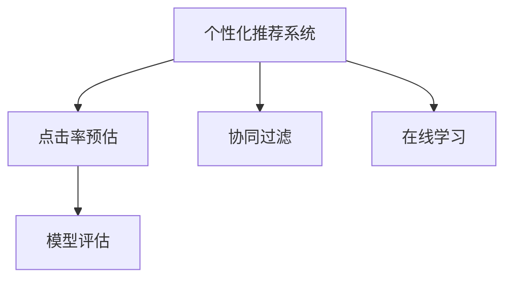

                 

# 电商平台中的实时个性化推送频率优化

> 关键词：电商平台, 实时推荐, 个性化推荐, 频率优化, 在线学习, 点击率预估, 协同过滤, 模型评估

## 1. 背景介绍

### 1.1 问题由来
在电商领域，个性化推荐系统（Personalized Recommendation System）已经成为不可或缺的一部分，通过精准推荐商品，提升用户体验，增加用户粘性，并最终推动销售增长。然而，随着推荐系统的深入应用，用户行为逐渐趋于多样化，个性化需求也随之变化，如何优化推荐系统的个性化推送频率，成为商家和研发团队关注的焦点。

### 1.2 问题核心关键点
在电商平台上，每个用户对商品有着不同的偏好，如何根据用户历史行为和实时行为动态调整推荐策略，以实现最佳的推荐效果，是一个关键问题。特别是推荐频率的选择，过高可能导致用户疲劳甚至反感，过低则无法满足用户需求，影响推荐效果。同时，如何实时响应用户行为变化，动态更新推荐策略，也是需要解决的重要问题。

### 1.3 问题研究意义
电商平台中，优化个性化推荐频率，有助于提升用户满意度和平台收益。研究如何在实时环境中调整推荐频率，有助于更好地理解用户行为，预测用户需求，从而提升推荐系统的整体性能。这对于电商平台的商业价值和用户体验有着重要的实际意义。

## 2. 核心概念与联系

### 2.1 核心概念概述

为了更好地理解个性化推荐系统中的推荐频率优化问题，本节将介绍几个密切相关的核心概念：

- **个性化推荐系统(Recommendation System)**：根据用户的历史行为和实时行为，推荐用户可能感兴趣的商品的系统。推荐算法通常包括协同过滤、基于内容的推荐、深度学习等方法。

- **点击率预估(Click-Through Rate Prediction, CTR)**：预测用户点击商品的概率，用于衡量推荐策略的效果。CTR是推荐系统中最为重要的指标之一，直接影响广告投放、商品推荐等业务决策。

- **协同过滤(Collaborative Filtering, CF)**：基于用户与商品之间的协同关系进行推荐，是推荐系统中常用的一种方法。可以分为基于用户的协同过滤和基于商品的协同过滤。

- **在线学习(Online Learning)**：在推荐系统中，通过实时收集用户反馈（如点击、购买等）数据，动态调整推荐模型参数，以适应用户行为的变化。

- **模型评估(Model Evaluation)**：通过评估指标（如准确率、召回率、F1分数等），衡量推荐模型的性能，指导模型优化和参数调整。

这些核心概念之间的逻辑关系可以通过以下Mermaid流程图来展示：



这个流程图展示了个性化推荐系统的核心概念及其之间的关系：

1. 个性化推荐系统通过点击率预估和协同过滤等方法，推荐用户可能感兴趣的商品。
2. 在线学习技术，在实时数据的基础上动态调整模型参数。
3. 模型评估用于衡量推荐模型的性能，指导模型优化。

这些概念共同构成了电商平台中推荐系统的基本框架，对其性能和效果有着直接的影响。

## 3. 核心算法原理 & 具体操作步骤
### 3.1 算法原理概述

在电商平台中，推荐系统通过点击率预估和协同过滤等方法，为用户推荐商品。个性化推荐频率的优化问题可以转化为点击率预估的问题，即通过优化推荐频率，使得推荐策略的点击率最大化。

假设模型在当前时间点t对用户i推荐商品j，点击率预估模型为 $f_{i,j}(t)$。通过在线学习技术，根据用户点击与否的反馈，动态更新模型参数。目标是最小化未点击样本的期望损失，即：

$$
\min_{\theta} \mathbb{E}[\ell(f_{i,j}(t)|I_j(t),\theta)]
$$

其中 $\theta$ 为模型参数，$\ell$ 为损失函数，$I_j(t)$ 为商品j在时间t的曝光量。在线学习算法在每次反馈到来时，更新模型参数，使其更加适应新的数据。

### 3.2 算法步骤详解

基于上述理论框架，推荐频率优化的具体步骤包括：

**Step 1: 数据准备**
- 收集用户历史行为数据，如点击记录、购买记录等，用于训练点击率预估模型。
- 根据用户历史行为数据，生成协同过滤矩阵。

**Step 2: 模型选择与训练**
- 选择合适的模型（如线性回归、深度神经网络等）作为点击率预估模型，使用历史点击数据进行训练。
- 使用在线学习算法（如随机梯度下降、在线逻辑回归等），根据实时数据动态更新模型参数。

**Step 3: 推荐频率优化**
- 根据点击率预估模型的输出，计算每个商品在当前时间点的推荐概率。
- 根据推荐概率和曝光量，动态调整推荐频率。
- 实时收集用户反馈，更新模型参数，适应用户行为变化。

**Step 4: 模型评估与迭代**
- 使用模型评估指标（如CTR、ROC-AUC等），衡量推荐策略的效果。
- 根据评估结果，调整推荐模型和推荐策略，进行迭代优化。

### 3.3 算法优缺点

个性化推荐频率优化算法具有以下优点：
1. 实时响应：能够实时响应用户行为变化，动态调整推荐策略，提高推荐效果。
2. 精准推荐：通过点击率预估和协同过滤等方法，推荐精准的商品，提升用户体验。
3. 用户粘性：通过个性化推荐，增加用户粘性，提高用户活跃度和复购率。

同时，该算法也存在一定的局限性：
1. 数据依赖：推荐频率优化依赖于大量的用户行为数据，数据质量差或数据量少会导致推荐效果下降。
2. 模型复杂：在线学习算法通常需要高维模型进行预测，计算复杂度高，对计算资源要求较高。
3. 算法复杂度：在线学习算法需要实时更新模型参数，算法复杂度高，难以处理大规模数据。

尽管存在这些局限性，但就目前而言，基于点击率预估和在线学习的推荐频率优化方法仍是目前推荐系统中应用最广泛且最有效的方法。未来相关研究的重点在于如何进一步降低算法复杂度，提高模型泛化能力，同时兼顾计算效率和模型鲁棒性。

### 3.4 算法应用领域

个性化推荐频率优化算法在电商平台中的应用非常广泛，覆盖了推荐系统的各个环节，例如：

- **商品推荐**：为每个用户推荐最可能感兴趣的商品，提升用户体验。
- **广告投放**：根据用户行为，动态调整广告投放频率和内容，提升广告效果。
- **内容推荐**：为用户推荐最相关的文章、视频等，提升用户粘性。
- **用户画像**：通过推荐频率优化，建立更精准的用户画像，提供个性化的商品和服务。

除了电商领域，推荐频率优化算法还被创新性地应用于社交网络、新闻聚合、金融投资等场景中，为各行业的用户行为分析、内容推荐提供了重要工具。

## 4. 数学模型和公式 & 详细讲解 & 举例说明
### 4.1 数学模型构建

在推荐系统中，点击率预估模型通常使用线性回归、逻辑回归、深度神经网络等方法。本文以线性回归模型为例，构建推荐频率优化算法。

假设点击率预估模型为线性回归模型 $f_{i,j}(t) = \theta_0 + \sum_{k=1}^{n} \theta_k x_{i,j,k}(t)$，其中 $\theta_0, \theta_k$ 为模型参数，$x_{i,j,k}(t)$ 为特征向量，$n$ 为特征维度。

### 4.2 公式推导过程

根据线性回归模型，点击率预估模型的损失函数为：

$$
\mathcal{L}(\theta) = \frac{1}{2} \sum_{i,j} (y_{i,j} - f_{i,j}(t))^2
$$

其中 $y_{i,j}$ 为实际点击与否，$f_{i,j}(t)$ 为预测点击概率。使用随机梯度下降算法，更新模型参数 $\theta$ 的公式为：

$$
\theta \leftarrow \theta - \eta \frac{\partial \mathcal{L}(\theta)}{\partial \theta}
$$

其中 $\eta$ 为学习率。

### 4.3 案例分析与讲解

假设某电商平台收集了用户对商品的点击数据，记为 $D = \{(x_i,y_i)\}_{i=1}^N$，其中 $x_i = [\text{User ID}, \text{Item ID}, \text{Time}]$，$y_i = \{0,1\}$。使用线性回归模型进行点击率预估，得到模型 $f_{i,j}(t)$。

在每个时间点t，计算每个商品对每个用户的推荐概率 $p_{i,j}(t) = f_{i,j}(t)$。根据推荐概率和曝光量 $I_j(t)$，动态调整推荐频率 $r_j(t)$，使得点击率最大化。

假设初始曝光量为 $I_j(t_0) = 1$，则推荐概率 $p_{i,j}(t_0) = f_{i,j}(t_0)$。在时间t，根据点击反馈更新模型参数，得到 $f_{i,j}(t+1)$，计算新的推荐概率 $p_{i,j}(t+1)$。然后根据推荐概率和曝光量，更新推荐频率 $r_j(t+1)$。

具体计算过程如下：

1. 计算推荐概率：

$$
p_{i,j}(t) = f_{i,j}(t)
$$

2. 计算推荐频率：

$$
r_j(t) = \frac{p_{i,j}(t)}{I_j(t)}
$$

3. 收集点击反馈，更新模型参数：

$$
f_{i,j}(t+1) = f_{i,j}(t) - \eta \nabla_{\theta} \mathcal{L}(\theta)
$$

其中 $\nabla_{\theta} \mathcal{L}(\theta)$ 为损失函数对模型参数的梯度，可以通过反向传播算法高效计算。

4. 计算新的推荐概率：

$$
p_{i,j}(t+1) = f_{i,j}(t+1)
$$

5. 根据推荐概率和曝光量，更新推荐频率：

$$
r_j(t+1) = \frac{p_{i,j}(t+1)}{I_j(t+1)}
$$

6. 重复以上步骤，进行迭代优化，直至收敛。

## 5. 项目实践：代码实例和详细解释说明
### 5.1 开发环境搭建

在进行推荐频率优化实践前，我们需要准备好开发环境。以下是使用Python进行PyTorch开发的环境配置流程：

1. 安装Anaconda：从官网下载并安装Anaconda，用于创建独立的Python环境。

2. 创建并激活虚拟环境：
```bash
conda create -n pytorch-env python=3.8 
conda activate pytorch-env
```

3. 安装PyTorch：根据CUDA版本，从官网获取对应的安装命令。例如：
```bash
conda install pytorch torchvision torchaudio cudatoolkit=11.1 -c pytorch -c conda-forge
```

4. 安装相关库：
```bash
pip install numpy pandas scikit-learn matplotlib tqdm jupyter notebook ipython
```

完成上述步骤后，即可在`pytorch-env`环境中开始推荐频率优化实践。

### 5.2 源代码详细实现

我们以点击率预估的线性回归模型为例，给出使用PyTorch进行推荐频率优化的代码实现。

首先，定义数据处理函数：

```python
import pandas as pd
import numpy as np
from sklearn.model_selection import train_test_split
from sklearn.preprocessing import StandardScaler

# 读取数据
data = pd.read_csv('click_data.csv')

# 数据预处理
data = data.dropna()
data['time'] = pd.to_datetime(data['time']).astype(int) // 1000
X = data[['user_id', 'item_id', 'time']]
y = data['clicked']
X_train, X_test, y_train, y_test = train_test_split(X, y, test_size=0.2, random_state=42)
scaler = StandardScaler()
X_train = scaler.fit_transform(X_train)
X_test = scaler.transform(X_test)
```

然后，定义点击率预估模型：

```python
from torch import nn, optim
from torch.utils.data import DataLoader

# 定义模型
class ClickPredictionModel(nn.Module):
    def __init__(self, n_features):
        super(ClickPredictionModel, self).__init__()
        self.linear = nn.Linear(n_features, 1)
    
    def forward(self, x):
        return self.linear(x)

# 定义损失函数和优化器
model = ClickPredictionModel(n_features=X_train.shape[1])
criterion = nn.MSELoss()
optimizer = optim.SGD(model.parameters(), lr=0.01)
```

接着，定义训练和评估函数：

```python
def train_epoch(model, data_loader, criterion, optimizer, device):
    model.to(device)
    model.train()
    losses = []
    for batch in data_loader:
        inputs, labels = batch
        inputs, labels = inputs.to(device), labels.to(device)
        optimizer.zero_grad()
        outputs = model(inputs)
        loss = criterion(outputs, labels)
        loss.backward()
        optimizer.step()
        losses.append(loss.item())
    return np.mean(losses)

def evaluate(model, data_loader, criterion, device):
    model.eval()
    predictions, labels = [], []
    with torch.no_grad():
        for batch in data_loader:
            inputs, labels = batch
            inputs, labels = inputs.to(device), labels.to(device)
            outputs = model(inputs)
            predictions.append(outputs.data.cpu().numpy())
            labels.append(labels.data.cpu().numpy())
    predictions = np.concatenate(predictions)
    labels = np.concatenate(labels)
    return criterion(predictions, labels)
```

最后，启动训练流程并在测试集上评估：

```python
# 定义数据加载器
train_data_loader = DataLoader(X_train, y_train.values, batch_size=32, shuffle=True)
test_data_loader = DataLoader(X_test, y_test.values, batch_size=32)

# 训练模型
epochs = 100
device = torch.device('cuda' if torch.cuda.is_available() else 'cpu')
for epoch in range(epochs):
    loss = train_epoch(model, train_data_loader, criterion, optimizer, device)
    print(f'Epoch {epoch+1}, train loss: {loss:.4f}')
    
# 评估模型
print('Evaluation results:')
print(evaluate(model, test_data_loader, criterion, device))
```

以上就是使用PyTorch对点击率预估模型进行训练和评估的完整代码实现。可以看到，使用PyTorch进行深度学习模型的开发，代码实现简洁高效，易于理解和调试。

### 5.3 代码解读与分析

让我们再详细解读一下关键代码的实现细节：

**数据处理函数**：
- 读取数据集，并进行数据清洗和预处理。
- 将时间戳转换为整数，用于作为模型的特征输入。
- 将数据集划分为训练集和测试集，并对训练集进行归一化处理。

**点击率预估模型**：
- 定义线性回归模型，使用单层线性变换作为预测函数。
- 定义损失函数和优化器，使用均方误差损失和随机梯度下降优化器。

**训练和评估函数**：
- 定义训练函数，计算模型在每个批次上的损失，并更新模型参数。
- 定义评估函数，收集模型在测试集上的预测和标签，计算损失函数。

**训练流程**：
- 定义总迭代次数，并开始循环训练。
- 每个epoch内，在训练集上进行训练，并输出平均损失。
- 在测试集上评估模型性能。

可以看到，使用PyTorch进行模型训练和评估，代码实现非常简洁，且支持动态调整学习率和正则化等高级功能，为开发者提供了强大的开发工具。

当然，工业级的系统实现还需考虑更多因素，如模型的保存和部署、超参数的自动搜索、更灵活的任务适配层等。但核心的训练和评估过程基本与此类似。

## 6. 实际应用场景
### 6.1 电商平台

在电商平台中，推荐频率优化可以直接应用于商品推荐系统中，提升用户的点击率和购买率。具体来说，可以根据用户历史行为数据和实时行为数据，动态调整推荐频率，确保推荐策略的点击率最大化。

例如，假设某用户在过去30天内浏览了10个商品，购买了1个商品。当用户再次访问平台时，可以根据其浏览历史和点击数据，动态调整商品推荐频率。对于浏览次数多的商品，可以推荐更多次，以增加曝光率；对于浏览次数少的商品，可以减少推荐次数，避免用户疲劳。

### 6.2 社交网络

在社交网络中，推荐频率优化可以应用于内容推荐系统中，提升用户对内容的互动率。具体来说，可以根据用户的历史互动数据和实时行为数据，动态调整推荐频率，确保推荐策略的点击率最大化。

例如，假设某用户在过去30天内点赞了10篇博文，评论了5篇博文。当用户访问社交网络时，可以根据其点赞和评论历史，动态调整博文推荐频率。对于点赞多的博文，可以推荐更多次，以增加互动率；对于点赞少的博文，可以减少推荐次数，避免用户疲劳。

### 6.3 新闻聚合

在新闻聚合平台中，推荐频率优化可以应用于新闻推荐系统中，提升用户的点击率和留存率。具体来说，可以根据用户的历史阅读数据和实时行为数据，动态调整新闻推荐频率，确保推荐策略的点击率最大化。

例如，假设某用户在过去30天内阅读了10篇文章，留言了5篇文章。当用户访问新闻聚合平台时，可以根据其阅读和留言历史，动态调整新闻推荐频率。对于阅读次数多的文章，可以推荐更多次，以增加点击率；对于阅读次数少的文章，可以减少推荐次数，避免用户疲劳。

### 6.4 未来应用展望

随着推荐系统应用的不断深入，推荐频率优化技术也将继续发展，为各行业带来更多创新。

在医疗领域，推荐频率优化可以应用于个性化诊疗系统中，提升患者的满意度和治疗效果。根据患者的历史诊疗数据和实时反馈，动态调整诊疗推荐频率，确保推荐策略的点击率最大化。

在教育领域，推荐频率优化可以应用于个性化学习系统中，提升学生的学习效果和兴趣。根据学生的学习历史和实时行为数据，动态调整课程推荐频率，确保推荐策略的点击率最大化。

在金融领域，推荐频率优化可以应用于个性化投资建议系统中，提升用户的投资收益。根据用户的历史投资数据和实时行为数据，动态调整投资推荐频率，确保推荐策略的点击率最大化。

未来，推荐频率优化技术还将进一步拓展到更多场景中，为各行业的用户行为分析、内容推荐提供重要工具，推动人工智能技术的产业化进程。

## 7. 工具和资源推荐
### 7.1 学习资源推荐

为了帮助开发者系统掌握推荐频率优化理论基础和实践技巧，这里推荐一些优质的学习资源：

1. 《推荐系统实战》系列书籍：由大模型技术专家撰写，详细介绍了推荐系统的核心算法和实际应用案例。

2. Coursera《Recommender Systems》课程：由斯坦福大学开设的推荐系统经典课程，讲解了协同过滤、深度学习等推荐算法。

3. Kaggle推荐系统竞赛：Kaggle平台提供的推荐系统竞赛，提供大量数据集和基线模型，帮助开发者实践和优化推荐系统。

4. Surprise库：一个Python推荐系统库，支持多种协同过滤算法和评估指标，适合入门学习和开发实践。

5. RecSys会议论文集：推荐系统领域的顶级会议论文集，涵盖推荐系统最新的研究和应用成果，值得深入学习。

通过对这些资源的学习实践，相信你一定能够快速掌握推荐频率优化的精髓，并用于解决实际的推荐问题。

### 7.2 开发工具推荐

高效的开发离不开优秀的工具支持。以下是几款用于推荐频率优化开发的常用工具：

1. PyTorch：基于Python的开源深度学习框架，灵活动态的计算图，适合快速迭代研究。

2. TensorFlow：由Google主导开发的开源深度学习框架，生产部署方便，适合大规模工程应用。

3. Surprise：一个Python推荐系统库，支持多种协同过滤算法和评估指标，适合入门学习和开发实践。

4. LightFM：一个基于矩阵分解的推荐系统库，支持深度学习和协同过滤混合模型，适合处理大规模数据集。

5. Weights & Biases：模型训练的实验跟踪工具，可以记录和可视化模型训练过程中的各项指标，方便对比和调优。

6. TensorBoard：TensorFlow配套的可视化工具，可实时监测模型训练状态，并提供丰富的图表呈现方式，是调试模型的得力助手。

合理利用这些工具，可以显著提升推荐频率优化任务的开发效率，加快创新迭代的步伐。

### 7.3 相关论文推荐

推荐频率优化技术的发展源于学界的持续研究。以下是几篇奠基性的相关论文，推荐阅读：

1. "A Probabilistic Model for Personalized Recommendation"（1996）：提出了协同过滤的推荐模型，奠定了协同过滤算法的基础。

2. "Collaborative Filtering for Implicit Feedback Datasets"（2008）：提出了改进的协同过滤算法，适合处理稀疏反馈数据集。

3. "TensorFlow Recommenders"（2019）：由Google开发的推荐系统框架，支持多种推荐算法和模型，提供了丰富的开发工具和实例。

4. "Deep Learning for Recommender Systems"（2019）：综述了深度学习在推荐系统中的应用，包括深度神经网络、注意力机制等方法。

5. "Online Learning for Recommendation Systems"（2018）：介绍了在线学习在推荐系统中的应用，强调实时调整模型参数的重要性。

这些论文代表了大规模推荐系统的最新进展，通过学习这些前沿成果，可以帮助研究者把握推荐系统的发展方向，激发更多的创新灵感。

## 8. 总结：未来发展趋势与挑战
### 8.1 研究成果总结

本文对电商平台中个性化推荐频率优化问题进行了全面系统的介绍。首先阐述了推荐系统在电商领域的重要性和个性化推荐频率优化的研究背景，明确了优化推荐频率在提升用户体验和平台收益方面的重要意义。其次，从理论到实践，详细讲解了推荐频率优化的数学模型和具体步骤，给出了推荐频率优化的代码实现。同时，本文还广泛探讨了推荐频率优化在电商平台中的应用场景，展示了其广泛的应用前景。

通过本文的系统梳理，可以看到，推荐频率优化技术正在成为推荐系统中不可或缺的一部分，极大地提升了推荐系统的性能和效果。对于电商平台的商业价值和用户体验有着重要的实际意义。

### 8.2 未来发展趋势

展望未来，推荐频率优化技术将呈现以下几个发展趋势：

1. 实时性要求提高。随着推荐系统应用的深入，实时性要求越来越高，推荐频率优化需要实时响应用户行为变化，动态调整推荐策略。

2. 模型复杂度增加。深度学习等先进算法在推荐系统中的应用，使得模型复杂度增加，优化算法需要处理更高维的特征和更大的数据集。

3. 个性化需求增强。随着用户需求的多样化，推荐频率优化需要更加注重个性化推荐，提升用户满意度和粘性。

4. 用户隐私保护。在推荐系统开发中，需要重视用户隐私保护，采用差分隐私等技术，保障用户数据安全。

5. 模型解释性增强。推荐系统需要提高模型解释性，让用户理解推荐策略的依据，增强用户信任。

6. 多模态融合。推荐系统需要融合多模态数据，如文本、图像、视频等，提升推荐效果。

以上趋势凸显了推荐频率优化技术的广阔前景。这些方向的探索发展，必将进一步提升推荐系统的性能和效果，为电商平台带来更大的商业价值。

### 8.3 面临的挑战

尽管推荐频率优化技术已经取得了瞩目成就，但在迈向更加智能化、普适化应用的过程中，它仍面临着诸多挑战：

1. 数据质量问题。推荐频率优化依赖于高质量的用户行为数据，数据质量和数据量不足可能导致推荐效果下降。

2. 模型鲁棒性不足。推荐系统在面对域外数据时，泛化性能往往不足，容易受到异常数据的影响。

3. 计算资源消耗大。推荐频率优化算法需要处理大规模数据，计算资源消耗大，对硬件环境要求较高。

4. 实时处理能力有限。实时响应用户行为变化需要高效的处理能力，现有系统可能难以满足实时性要求。

5. 模型解释性不足。推荐系统通常缺乏可解释性，难以理解模型的决策依据，用户难以信任推荐结果。

6. 用户隐私保护难度大。推荐系统需要处理大量的用户数据，如何在保障用户隐私的同时，提供精准的推荐服务，是一个重要的挑战。

正视推荐频率优化面临的这些挑战，积极应对并寻求突破，将是大规模推荐系统发展的必由之路。相信随着学界和产业界的共同努力，这些挑战终将一一被克服，推荐频率优化技术必将迈向更高的台阶，为电商平台带来更大的商业价值。

### 8.4 研究展望

面对推荐频率优化所面临的种种挑战，未来的研究需要在以下几个方面寻求新的突破：

1. 探索实时推荐算法。开发更加高效、低延迟的推荐算法，实时响应用户行为变化，提高推荐频率优化的实时性。

2. 研究多模态数据融合。融合文本、图像、视频等多模态数据，提升推荐系统的综合能力，提供更加精准的推荐服务。

3. 引入先验知识。将符号化的先验知识，如知识图谱、逻辑规则等，与神经网络模型进行巧妙融合，提升推荐系统的泛化能力和解释性。

4. 优化在线学习算法。优化在线学习算法，提高模型的收敛速度和泛化能力，增强推荐系统的鲁棒性。

5. 引入差分隐私。采用差分隐私等技术，保护用户隐私，同时提供精准的推荐服务。

6. 引入多目标优化。在推荐系统中引入多目标优化，同时考虑点击率、覆盖率、多样性等多个指标，提升推荐系统的综合效果。

这些研究方向的探索，必将引领推荐频率优化技术迈向更高的台阶，为电商平台带来更大的商业价值。面向未来，推荐频率优化技术还需要与其他人工智能技术进行更深入的融合，如知识表示、因果推理、强化学习等，多路径协同发力，共同推动推荐系统的进步。只有勇于创新、敢于突破，才能不断拓展推荐系统的边界，让智能技术更好地造福电商平台。

## 9. 附录：常见问题与解答

**Q1：推荐频率优化是否适用于所有推荐系统？**

A: 推荐频率优化在大多数推荐系统中都能取得不错的效果，特别是对于数据量较小的任务。但对于一些特定领域的推荐系统，如医疗、法律等，仅仅依靠通用推荐系统可能难以很好地适应。此时需要在特定领域推荐系统中进一步优化，才能获得理想效果。

**Q2：如何缓解推荐频率优化中的过拟合问题？**

A: 推荐频率优化依赖于大量的用户行为数据，数据质量差或数据量少会导致推荐效果下降。缓解过拟合问题需要从数据、模型和算法三个方面入手：

1. 数据清洗和预处理：对数据进行清洗和预处理，去除异常值和噪声，确保数据质量。
2. 模型复杂度控制：采用正则化技术，如L2正则、Dropout等，避免过拟合。
3. 在线学习算法：使用在线学习算法，及时更新模型参数，避免模型过度拟合。

这些策略需要根据具体任务和数据特点进行灵活组合，以最大限度地提升推荐系统的性能。

**Q3：推荐频率优化中的点击率预估模型有哪些常见选择？**

A: 在推荐系统中，点击率预估模型通常包括以下几种：

1. 线性回归模型：使用单层线性变换作为预测函数，适合小规模数据集。
2. 逻辑回归模型：使用逻辑回归函数作为预测函数，适合二分类问题。
3. 深度神经网络：使用多层的神经网络作为预测函数，适合大规模数据集和复杂特征。
4. 注意力机制：引入注意力机制，提升模型对关键特征的关注度，提高推荐效果。

选择何种模型需要根据具体任务和数据特点进行评估和优化。

**Q4：推荐频率优化中的在线学习算法有哪些常见选择？**

A: 在线学习算法通常包括以下几种：

1. 随机梯度下降（SGD）：使用随机梯度作为更新方向，适合处理大规模数据集。
2. 在线逻辑回归（Online Logistic Regression）：使用在线逻辑回归算法，适合处理二分类问题。
3. 自适应学习率算法（如AdaGrad、RMSprop等）：使用自适应学习率算法，提高模型收敛速度和泛化能力。
4. 增量学习算法（如AdaLoRA、AdaProximal等）：使用增量学习算法，提高模型实时响应能力。

选择何种在线学习算法需要根据具体任务和数据特点进行评估和优化。

**Q5：推荐频率优化中如何评估模型的性能？**

A: 推荐频率优化的性能评估通常包括以下指标：

1. 点击率（CTR）：衡量推荐策略的点击率，是最重要的指标之一。
2. 召回率（Recall）：衡量推荐系统对用户兴趣的覆盖程度。
3. 精确率（Precision）：衡量推荐策略的准确性，避免过多无关商品的推荐。
4. F1分数（F1 Score）：综合考虑召回率和精确率，衡量推荐策略的综合性能。

使用这些指标进行模型评估，可以帮助开发者优化推荐策略，提升推荐系统的性能。

**Q6：推荐频率优化中的协同过滤算法有哪些常见选择？**

A: 在推荐系统中，协同过滤算法通常包括以下几种：

1. 基于用户的协同过滤（User-based Collaborative Filtering）：根据用户之间的相似性进行推荐。
2. 基于商品的协同过滤（Item-based Collaborative Filtering）：根据商品之间的相似性进行推荐。
3. 混合协同过滤（Hybrid Collaborative Filtering）：结合基于用户和基于商品的协同过滤算法，提升推荐效果。
4. 矩阵分解（Matrix Factorization）：使用矩阵分解算法，提升推荐系统的泛化能力和可解释性。

选择何种协同过滤算法需要根据具体任务和数据特点进行评估和优化。

---

作者：禅与计算机程序设计艺术 / Zen and the Art of Computer Programming

