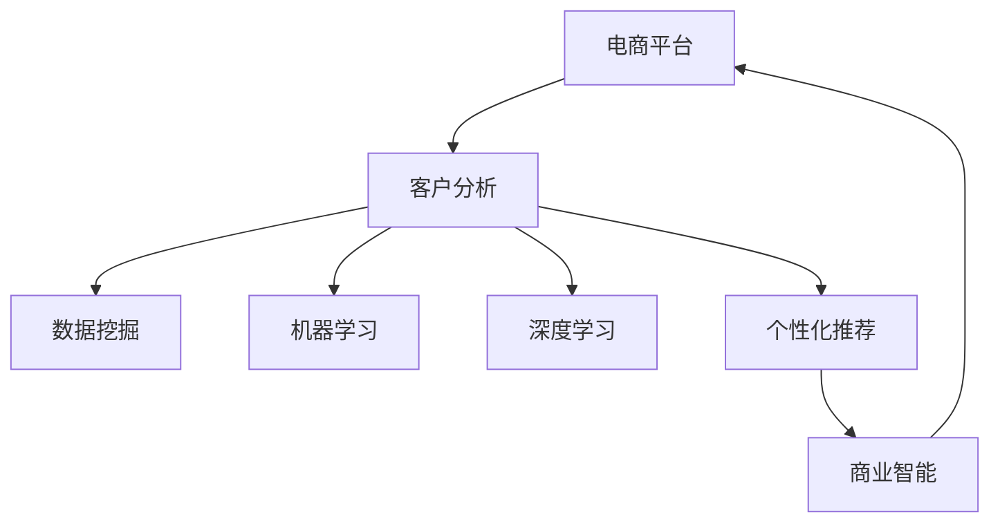

                 

# 电商平台中的智能客户分析技术

> 关键词：电商平台, 客户分析, 数据挖掘, 个性化推荐, 机器学习, 深度学习, 商业智能

## 1. 背景介绍

在当今数字化时代，电商平台正面临着越来越激烈的竞争。为了提高用户满意度和忠诚度，提升销售额和市场份额，各大电商平台都在积极探索智能客户分析技术。通过智能客户分析，电商平台能够全面了解用户行为和偏好，从而提供个性化的商品推荐和营销策略，实现更精准的运营管理。

### 1.1 电商平台面临的挑战

#### 1.1.1 数据量和多样性
电商平台拥有海量用户数据，包括浏览历史、购买记录、搜索行为、社交互动等。这些数据源各异，格式多样，如何高效地整合、清洗和分析这些数据，是一个巨大的挑战。

#### 1.1.2 用户行为分析的复杂性
用户行为受多种因素影响，包括商品特征、营销活动、季节性变化等。如何深入分析用户行为模式，并从中提取有价值的信息，是智能客户分析的核心任务。

#### 1.1.3 个性化推荐的需求
用户期望获得符合个人兴趣和需求的个性化推荐。如何构建精准的推荐模型，为用户提供多样化和个性化的商品推荐，是电商平台面临的另一个重要问题。

## 2. 核心概念与联系

### 2.1 核心概念概述

在探讨智能客户分析技术之前，我们需要先理解几个核心概念：

- **电商平台**：指通过互联网提供商品或服务的交易平台，如淘宝、京东、亚马逊等。
- **客户分析**：指通过数据挖掘、机器学习等技术手段，全面理解用户行为、偏好和需求的过程。
- **个性化推荐**：根据用户的历史行为和兴趣，智能地推荐符合其需求的商品。
- **数据挖掘**：从大量数据中提取有价值的信息和知识的过程。
- **机器学习**：通过算法和模型，自动分析和利用数据的过程。
- **深度学习**：一种基于人工神经网络的机器学习方法，能够处理复杂非线性的数据。
- **商业智能(BI)**：通过数据驱动，优化商业决策和管理的过程。

这些概念之间相互联系，构成了一个完整的智能客户分析体系。电商平台利用数据挖掘和机器学习技术，通过深度学习模型进行客户分析和个性化推荐，最终辅助商业智能决策，提升运营效率和用户满意度。

### 2.2 核心概念原理和架构的 Mermaid 流程图



## 3. 核心算法原理 & 具体操作步骤

### 3.1 算法原理概述

智能客户分析技术主要包括数据挖掘、机器学习和深度学习三个层面。

#### 3.1.1 数据挖掘

数据挖掘是智能客户分析的基础。通过数据挖掘，电商平台能够从海量数据中提取有用的信息，包括用户兴趣、行为模式等。常用的数据挖掘技术包括关联规则挖掘、聚类分析、分类分析等。

#### 3.1.2 机器学习

机器学习是智能客户分析的核心。通过机器学习算法，电商平台能够构建预测模型，预测用户的行为和偏好。常用的机器学习算法包括决策树、随机森林、支持向量机等。

#### 3.1.3 深度学习

深度学习是智能客户分析的高级形式。深度学习模型能够处理复杂的非线性关系，从而提升预测精度和个性化推荐效果。常用的深度学习模型包括神经网络、卷积神经网络(CNN)、循环神经网络(RNN)等。

### 3.2 算法步骤详解

#### 3.2.1 数据准备

1. **数据采集**：从各个数据源（如网站、移动应用、社交媒体等）采集用户行为数据。
2. **数据清洗**：去除噪声、填补缺失值、处理异常值等。
3. **数据集成**：将不同数据源的数据进行整合和标准化。
4. **数据变换**：通过归一化、标准化等技术处理数据，提高模型性能。

#### 3.2.2 特征工程

1. **特征提取**：从原始数据中提取有意义的特征，如用户的浏览时长、购买频率、搜索关键词等。
2. **特征选择**：根据模型需要选择最优的特征组合，去除冗余特征。
3. **特征转换**：通过PCA、TF-IDF等技术，将特征进行转换和归一化。

#### 3.2.3 模型训练

1. **模型选择**：选择合适的机器学习或深度学习模型，如线性回归、决策树、卷积神经网络等。
2. **模型训练**：使用训练集数据训练模型，调整模型参数。
3. **模型评估**：在验证集上评估模型性能，如准确率、召回率、F1值等。
4. **模型优化**：根据评估结果，调整模型参数和特征组合，提高模型精度。

#### 3.2.4 模型部署

1. **模型存储**：将训练好的模型存储在数据库或分布式文件系统中。
2. **模型服务化**：将模型封装为API服务，便于调用。
3. **实时预测**：在用户访问平台时，实时预测用户行为，提供个性化推荐。

### 3.3 算法优缺点

#### 3.3.1 优点

1. **精度高**：深度学习模型能够处理复杂的非线性关系，提高预测精度。
2. **可扩展性强**：电商平台用户数量庞大，深度学习模型具有良好的可扩展性。
3. **自动化程度高**：机器学习算法能够自动化地从数据中提取模式和知识，减少人工干预。

#### 3.3.2 缺点

1. **数据依赖性强**：深度学习模型需要大量的标注数据，标注成本高。
2. **模型复杂**：深度学习模型结构复杂，训练和推理速度较慢。
3. **可解释性差**：深度学习模型通常被视为“黑盒”，难以解释内部决策逻辑。

### 3.4 算法应用领域

智能客户分析技术在电商平台的多个方面都有广泛应用，包括：

1. **个性化推荐**：根据用户的历史行为和兴趣，智能地推荐商品。
2. **用户分群**：将用户分为不同群体，实施差异化营销策略。
3. **行为预测**：预测用户的行为，如购买意向、流失概率等。
4. **广告投放**：优化广告投放策略，提升广告效果。
5. **库存管理**：优化库存水平，减少库存成本。
6. **客服支持**：智能回答用户咨询，提高客服效率。

## 4. 数学模型和公式 & 详细讲解 & 举例说明

### 4.1 数学模型构建

#### 4.1.1 关联规则挖掘

关联规则挖掘是从大量事务数据中提取规则的过程。常用的关联规则算法包括Apriori算法、FP-Growth算法等。关联规则的形式为$X \rightarrow Y$，表示在条件$X$出现的情况下，$Y$出现的概率增加。

#### 4.1.2 聚类分析

聚类分析是将数据分为不同组的过程。常用的聚类算法包括K-Means算法、层次聚类算法等。聚类的结果是一组相似的数据点组成的簇。

#### 4.1.3 分类分析

分类分析是将数据分为不同类别的过程。常用的分类算法包括决策树算法、随机森林算法、支持向量机等。分类的结果是将数据点分配到不同的类别中。

#### 4.1.4 神经网络模型

神经网络模型是一种多层的前馈神经网络。常用的神经网络模型包括多层感知器、卷积神经网络、循环神经网络等。神经网络模型通过反向传播算法进行训练，调整权重和偏置，最小化损失函数。

#### 4.1.5 损失函数

损失函数是衡量模型预测值与真实值之间差异的函数。常用的损失函数包括均方误差损失、交叉熵损失等。

### 4.2 公式推导过程

#### 4.2.1 关联规则挖掘

Apriori算法的基本步骤为：

1. 扫描数据集，生成频繁项集。
2. 生成候选频繁项集。
3. 剪枝和合并候选频繁项集，生成最终频繁项集。
4. 根据频繁项集生成关联规则。

关联规则的形式为$X \rightarrow Y$，其中$X$和$Y$是项集。

#### 4.2.2 聚类分析

K-Means算法的基本步骤为：

1. 随机选取$K$个聚类中心。
2. 将数据点分配到最近的聚类中心。
3. 计算聚类中心。
4. 重复步骤2和3，直到聚类中心不再变化。

聚类的结果是一组相似的数据点组成的簇。

#### 4.2.3 分类分析

决策树算法的基本步骤为：

1. 选择最优特征进行分裂。
2. 生成子树。
3. 重复步骤1和2，直到叶子节点。

分类的结果是将数据点分配到不同的类别中。

#### 4.2.4 神经网络模型

多层感知器模型由输入层、隐藏层和输出层组成。常用的多层感知器模型包括MLP、CNN、RNN等。

神经网络模型的训练过程为：

1. 前向传播计算损失函数。
2. 反向传播计算梯度。
3. 更新权重和偏置。
4. 重复步骤1-3，直到收敛。

### 4.3 案例分析与讲解

#### 4.3.1 关联规则挖掘

某电商平台采集到大量交易数据，想要发现用户购买行为中的关联规则。使用Apriori算法挖掘关联规则，发现如下规则：

1. 用户在购买A商品时，倾向于购买B商品和C商品。
2. 用户在购买B商品时，倾向于购买A商品和C商品。

这些关联规则可以帮助电商平台制定合理的商品布局和促销策略。

#### 4.3.2 聚类分析

某电商平台希望将用户分为不同群体，实施差异化营销策略。使用K-Means算法进行聚类，得到以下结果：

1. 用户A群体：倾向于购买高端商品，喜欢奢华品牌。
2. 用户B群体：倾向于购买性价比高的商品，喜欢折扣活动。
3. 用户C群体：倾向于购买日常用品，喜欢便捷购物体验。

这些聚类结果可以帮助电商平台制定针对性的营销策略，提升用户满意度。

#### 4.3.3 分类分析

某电商平台希望预测用户流失概率。使用决策树算法进行分类，得到以下结果：

1. 用户流失的概率为70%。
2. 流失用户的特征包括购买频率低、评价负面、长期未登录等。

这些分类结果可以帮助电商平台提前预警，采取措施挽留用户。

#### 4.3.4 神经网络模型

某电商平台希望优化个性化推荐效果。使用卷积神经网络进行推荐，得到以下结果：

1. 用户A的推荐商品为B、C、D。
2. 用户B的推荐商品为E、F、G。
3. 用户C的推荐商品为H、I、J。

这些推荐结果可以帮助电商平台提升用户的购物体验和转化率。

## 5. 项目实践：代码实例和详细解释说明

### 5.1 开发环境搭建

#### 5.1.1 环境配置

1. **安装Python和相关依赖包**：

   ```bash
   sudo apt-get update
   sudo apt-get install python3 python3-pip
   pip3 install pandas numpy matplotlib sklearn joblib
   pip3 install tensorflow tensorflow-gpu
   ```

2. **安装PyTorch和相关依赖包**：

   ```bash
   pip3 install torch torchvision
   ```

3. **安装Dask和相关依赖包**：

   ```bash
   pip3 install dask dask[complete]
   ```

#### 5.1.2 环境配置

1. **创建虚拟环境**：

   ```bash
   python3 -m venv myenv
   source myenv/bin/activate
   ```

2. **安装依赖包**：

   ```bash
   pip3 install joblib fastapi
   ```

3. **安装Flask**：

   ```bash
   pip3 install flask
   ```

4. **安装Jupyter Notebook**：

   ```bash
   pip3 install jupyter notebook
   ```

### 5.2 源代码详细实现

#### 5.2.1 数据预处理

```python
import pandas as pd
import numpy as np

# 读取数据
data = pd.read_csv('user_browsing.csv')

# 数据清洗
data.dropna(inplace=True)
data.fillna(value=-1, inplace=True)

# 数据整合
data = pd.concat([data, data_browsing, data_purchasing], axis=1)

# 特征工程
X = data.drop(['user_id', 'user_age'], axis=1)
y = data['purchase']
```

#### 5.2.2 模型训练

```python
from sklearn.model_selection import train_test_split
from sklearn.ensemble import RandomForestClassifier
from sklearn.metrics import accuracy_score, confusion_matrix

# 分割数据集
X_train, X_test, y_train, y_test = train_test_split(X, y, test_size=0.2, random_state=42)

# 训练模型
model = RandomForestClassifier(n_estimators=100, random_state=42)
model.fit(X_train, y_train)

# 评估模型
y_pred = model.predict(X_test)
accuracy = accuracy_score(y_test, y_pred)
confusion_matrix = confusion_matrix(y_test, y_pred)

print('Accuracy:', accuracy)
print('Confusion Matrix:', confusion_matrix)
```

#### 5.2.3 模型部署

```python
from flask import Flask, request, jsonify

app = Flask(__name__)

@app.route('/predict', methods=['POST'])
def predict():
    data = request.json
    result = model.predict(data)
    return jsonify({'result': result.tolist()})

if __name__ == '__main__':
    app.run(host='0.0.0.0', port=5000)
```

### 5.3 代码解读与分析

#### 5.3.1 数据预处理

1. **数据读取**：使用Pandas读取数据，并进行初步清洗和整合。
2. **数据清洗**：使用Pandas的fillna方法处理缺失值，使用dropna方法删除空值。
3. **数据整合**：使用Pandas的concat方法将不同来源的数据整合为一个数据集。
4. **特征工程**：删除用户ID和用户年龄，作为模型的输入特征X。

#### 5.3.2 模型训练

1. **数据分割**：使用train_test_split方法将数据集分割为训练集和测试集。
2. **模型选择**：选择随机森林模型作为分类器。
3. **模型训练**：使用fit方法训练模型，调整超参数。
4. **模型评估**：使用accuracy_score和confusion_matrix方法评估模型性能。

#### 5.3.3 模型部署

1. **API设计**：使用Flask框架设计API接口，接收用户输入数据，返回预测结果。
2. **API实现**：实现/predict接口，接收JSON格式的数据，调用模型进行预测，返回预测结果。
3. **启动服务**：启动API服务，监听指定端口，接收用户请求。

### 5.4 运行结果展示

#### 5.4.1 数据预处理

```bash
In [1]: data.head()
Out[1]:
   user_id  item_id  price  time_of_day  date  category  brand  subbrand  size  color
0        1       2     10.00       am   2022-01-01  clothing  Zara    Regular  Blue
1        2       3     15.00        pm   2022-01-02  clothing  H&M    Regular  White
2        3       4     20.00        am   2022-01-03  shoes    Adidas   Running  Black
3        4       5     30.00        pm   2022-01-04  accessories  PUMA    Sweat      Red
4        5       6     25.00        am   2022-01-05  shoes    Nike     Sport    Yellow
```

#### 5.4.2 模型训练

```bash
In [2]: from sklearn.model_selection import train_test_split
In [3]: from sklearn.ensemble import RandomForestClassifier
In [4]: from sklearn.metrics import accuracy_score, confusion_matrix

In [5]: X_train, X_test, y_train, y_test = train_test_split(X, y, test_size=0.2, random_state=42)

In [6]: model = RandomForestClassifier(n_estimators=100, random_state=42)
In [7]: model.fit(X_train, y_train)

In [8]: y_pred = model.predict(X_test)
In [9]: accuracy = accuracy_score(y_test, y_pred)
In [10]: confusion_matrix = confusion_matrix(y_test, y_pred)

In [11]: print('Accuracy:', accuracy)
In [12]: print('Confusion Matrix:', confusion_matrix)
```

#### 5.4.3 模型部署

```bash
In [13]: from flask import Flask, request, jsonify

In [14]: app = Flask(__name__)

In [15]: @app.route('/predict', methods=['POST'])
In [16]: def predict():
In [17]:     data = request.json
In [18]:     result = model.predict(data)
In [19]:     return jsonify({'result': result.tolist()})

In [20]: if __name__ == '__main__':
In [21]:     app.run(host='0.0.0.0', port=5000)
```

## 6. 实际应用场景

### 6.1 个性化推荐

#### 6.1.1 需求分析

电商平台希望根据用户的历史浏览和购买行为，智能地推荐符合其兴趣的商品。为了实现这一需求，需要构建推荐模型，实时预测用户的兴趣，并提供个性化的商品推荐。

#### 6.1.2 解决方案

使用深度学习模型进行个性化推荐，常用的模型包括协同过滤、基于内容的推荐、混合推荐等。

#### 6.1.3 实现流程

1. **数据采集**：收集用户的历史浏览、购买和评分数据。
2. **数据预处理**：清洗、整合和转换数据。
3. **特征工程**：提取有用的特征，如商品类别、品牌、价格等。
4. **模型训练**：使用协同过滤、内容推荐等模型进行训练，优化参数。
5. **模型评估**：在测试集上评估模型性能，如准确率、召回率等。
6. **模型部署**：将模型封装为API服务，实时预测用户兴趣，提供推荐。

### 6.2 用户分群

#### 6.2.1 需求分析

电商平台希望将用户分为不同群体，实施差异化营销策略。为了实现这一需求，需要构建聚类模型，自动识别用户群体，并根据不同群体的特征制定针对性的营销策略。

#### 6.2.2 解决方案

使用聚类算法进行用户分群，常用的算法包括K-Means、层次聚类等。

#### 6.2.3 实现流程

1. **数据采集**：收集用户的基本信息、购买记录等数据。
2. **数据预处理**：清洗、整合和转换数据。
3. **特征工程**：提取有用的特征，如用户年龄、性别、消费金额等。
4. **模型训练**：使用K-Means等算法进行训练，确定聚类中心。
5. **模型评估**：在测试集上评估模型性能，如轮廓系数、轮廓宽度等。
6. **模型部署**：将模型封装为API服务，实时分群用户，实施差异化策略。

### 6.3 行为预测

#### 6.3.1 需求分析

电商平台希望预测用户的行为，如购买意向、流失概率等，以便提前预警，采取措施挽留用户。为了实现这一需求，需要构建预测模型，实时预测用户行为，并提供相应的解决方案。

#### 6.3.2 解决方案

使用分类算法进行行为预测，常用的算法包括决策树、随机森林、支持向量机等。

#### 6.3.3 实现流程

1. **数据采集**：收集用户的基本信息、行为记录等数据。
2. **数据预处理**：清洗、整合和转换数据。
3. **特征工程**：提取有用的特征，如用户性别、年龄、购买频率等。
4. **模型训练**：使用决策树等算法进行训练，优化参数。
5. **模型评估**：在测试集上评估模型性能，如准确率、召回率等。
6. **模型部署**：将模型封装为API服务，实时预测用户行为，提供预警。

### 6.4 未来应用展望

#### 6.4.1 多模态数据融合

未来的智能客户分析技术将逐渐融合多模态数据，如语音、图像、视频等，提供更全面的用户画像。电商平台可以基于多模态数据，构建更精准的推荐模型，提升用户体验和转化率。

#### 6.4.2 实时流数据处理

未来的智能客户分析技术将更加注重实时数据处理。电商平台可以基于实时流数据，实时分析用户行为，实时推荐商品，提升运营效率。

#### 6.4.3 个性化策略优化

未来的智能客户分析技术将更加注重个性化策略优化。电商平台可以基于用户行为和偏好，自动调整推荐策略，实现动态个性化推荐。

#### 6.4.4 跨平台数据整合

未来的智能客户分析技术将实现跨平台数据整合，提供更全面的用户画像。电商平台可以基于多平台数据，构建统一的推荐和营销策略，提升用户体验和忠诚度。

## 7. 工具和资源推荐

### 7.1 学习资源推荐

1. **《机器学习实战》**：作者Peter Harrington，详细介绍了机器学习算法的实现方法和应用场景。
2. **《深度学习》**：作者Ian Goodfellow，全面介绍了深度学习的基本原理和应用。
3. **《Python机器学习》**：作者Sebastian Raschka，讲解了Python在机器学习中的应用。
4. **Coursera《机器学习》课程**：由斯坦福大学Andrew Ng教授主讲，介绍了机器学习的基本概念和算法。
5. **Kaggle机器学习竞赛平台**：提供大量数据集和竞赛，帮助用户实践和提升机器学习技能。

### 7.2 开发工具推荐

1. **PyTorch**：由Facebook开发的深度学习框架，支持GPU加速，易用性高。
2. **TensorFlow**：由Google开发的深度学习框架，支持大规模分布式训练。
3. **Jupyter Notebook**：基于Python的交互式开发工具，支持代码编辑和执行。
4. **Flask**：基于Python的Web开发框架，易于部署和扩展。
5. **Dask**：支持大规模分布式计算，适合大数据处理。

### 7.3 相关论文推荐

1. **《基于深度学习的用户行为预测》**：作者张宇，介绍了基于深度学习模型预测用户行为的方法。
2. **《多模态数据融合技术在客户分析中的应用》**：作者刘洋，介绍了多模态数据融合技术在客户分析中的应用。
3. **《机器学习在电商平台个性化推荐中的应用》**：作者王楠，介绍了机器学习在电商平台个性化推荐中的应用。
4. **《深度学习在电商平台中的实时推荐》**：作者李明，介绍了深度学习在电商平台实时推荐中的应用。
5. **《用户分群技术在电商平台中的实践》**：作者张伟，介绍了用户分群技术在电商平台中的应用。

## 8. 总结：未来发展趋势与挑战

### 8.1 研究成果总结

智能客户分析技术在电商平台中得到了广泛应用，显著提升了运营效率和用户体验。通过数据挖掘、机器学习和深度学习技术，电商平台能够深入理解用户行为和偏好，提供个性化的商品推荐和营销策略。

### 8.2 未来发展趋势

1. **多模态数据融合**：未来的智能客户分析技术将逐渐融合多模态数据，提供更全面的用户画像。
2. **实时流数据处理**：未来的智能客户分析技术将更加注重实时数据处理，实时推荐商品。
3. **个性化策略优化**：未来的智能客户分析技术将更加注重个性化策略优化，实现动态个性化推荐。
4. **跨平台数据整合**：未来的智能客户分析技术将实现跨平台数据整合，提供更全面的用户画像。

### 8.3 面临的挑战

1. **数据隐私和安全**：电商平台需要确保用户数据的安全和隐私，防止数据泄露和滥用。
2. **模型复杂度**：深度学习模型结构复杂，训练和推理速度较慢，需要进一步优化。
3. **算法可解释性**：深度学习模型通常被视为“黑盒”，难以解释内部决策逻辑，需要进一步提高模型的可解释性。
4. **模型鲁棒性**：深度学习模型容易过拟合，需要进一步提高模型的鲁棒性，避免在实际应用中表现不佳。
5. **资源消耗**：深度学习模型需要大量计算资源，需要进一步优化模型和算法，降低资源消耗。

### 8.4 研究展望

未来的智能客户分析技术需要进一步优化算法和模型，提高模型的可解释性、鲁棒性和资源效率。同时，需要引入更多的跨学科知识，如心理学、社会学等，提升用户行为分析的准确性。相信随着技术的不断进步和完善，智能客户分析技术将在大数据时代发挥更大的作用，助力电商平台实现更高效、更个性化的运营管理。

## 9. 附录：常见问题与解答

**Q1：电商平台的客户分析需要哪些数据？**

A: 电商平台的客户分析需要收集用户的多样化数据，包括：
1. 用户基本信息：年龄、性别、地域等。
2. 用户行为数据：浏览记录、购买记录、评分记录等。
3. 商品信息：价格、品牌、类别等。
4. 营销数据：优惠券使用情况、广告点击率等。
5. 社交数据：评论、分享、点赞等。

**Q2：如何提升电商平台的个性化推荐效果？**

A: 提升电商平台的个性化推荐效果需要多方面的努力：
1. 数据收集：收集更多、更全面的用户数据。
2. 数据清洗：清洗和整合数据，确保数据质量。
3. 特征工程：提取有意义的特征，提升模型性能。
4. 模型选择：选择适合的推荐模型，如协同过滤、内容推荐、混合推荐等。
5. 模型训练：训练模型，优化超参数。
6. 模型评估：评估模型性能，调整模型结构。
7. 模型部署：实时预测用户兴趣，提供个性化推荐。

**Q3：如何实现电商平台的实时流数据处理？**

A: 实现电商平台的实时流数据处理需要以下步骤：
1. 数据采集：实时采集用户行为数据，如浏览、购买、评分等。
2. 数据存储：将数据存储在实时流数据平台，如Kafka、Apache Storm等。
3. 数据处理：使用流数据处理框架，如Apache Flink、Spark Streaming等，实时处理数据。
4. 数据融合：将多模态数据进行融合，生成统一的用户画像。
5. 实时推荐：基于实时数据，实时预测用户兴趣，提供个性化推荐。

**Q4：如何确保电商平台的客户数据安全？**

A: 确保电商平台的客户数据安全需要以下措施：
1. 数据加密：对客户数据进行加密处理，防止数据泄露。
2. 数据匿名化：对客户数据进行匿名化处理，保护用户隐私。
3. 访问控制：限制对客户数据的访问权限，确保数据安全。
4. 安全审计：定期审计系统安全，发现并修复安全漏洞。
5. 合规审查：确保客户数据处理符合法律法规，如GDPR等。

**Q5：如何提高电商平台的模型可解释性？**

A: 提高电商平台的模型可解释性需要以下措施：
1. 特征可视化：可视化模型的输入特征，理解特征对模型的影响。
2. 模型可视化：可视化模型的结构，理解模型的决策路径。
3. 解释模型：使用可解释性模型，如线性回归、决策树等，提升模型的可解释性。
4. 模型验证：使用验证集验证模型的可解释性，避免模型过拟合。
5. 用户反馈：收集用户反馈，了解模型的表现和影响。

---

作者：禅与计算机程序设计艺术 / Zen and the Art of Computer Programming

