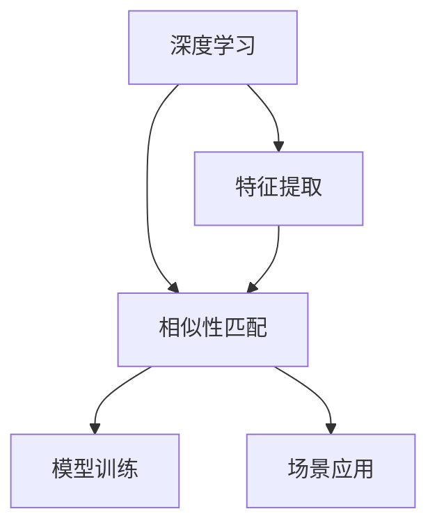

                 

# 电商平台中的视觉搜索：AI大模型的图像理解

> 关键词：视觉搜索,大模型,图像理解,深度学习,特征提取,相似性匹配,模型训练,场景应用,电商推荐,计算机视觉

## 1. 背景介绍

在当今电子商务的蓬勃发展中，消费者对商品的搜索方式发生了巨大变化，从传统的文本搜索逐渐转向了视觉搜索。视觉搜索技术利用图像作为输入，直接从商品图片出发，识别商品特征并进行相似性匹配，帮助消费者更快速、更准确地找到所需商品。为了提升视觉搜索的准确性和效率，AI大模型在图像理解领域的应用变得越来越广泛。

### 1.1 视觉搜索的发展历程

早在20世纪80年代，视觉搜索就已经开始萌芽。当时的研究主要集中在图像索引和检索上，利用文本关键词作为检索依据，难以充分理解图像内容。但随着深度学习技术的发展，特别是2012年AlexNet在ImageNet上的成功，基于神经网络的图像理解技术迅速崛起。

### 1.2 当前视觉搜索的瓶颈

尽管视觉搜索技术取得了长足进步，但在实际应用中仍面临一些瓶颈：

- **数据多样性**：商品图片风格多样，不同商家的图片质量、分辨率、背景等差异较大，导致视觉搜索系统的泛化能力有限。
- **特征提取效率**：图像特征提取和匹配需要大量的计算资源，尤其是当数据量庞大时，系统响应速度较慢，难以满足实时搜索需求。
- **冷启动问题**：新商品的图片往往没有充足的标注数据，导致模型对它们的理解不够准确，影响了搜索结果的相关性。

### 1.3 视觉搜索的应用场景

视觉搜索在多个电商场景中都有广泛应用：

- **商品识别**：用户上传商品图片，系统自动识别商品类别，展示相关商品。
- **个性化推荐**：分析用户浏览、购买图片，推荐类似商品，提升用户体验。
- **内容管理**：电商网站利用视觉搜索进行商品管理和库存优化。

## 2. 核心概念与联系

### 2.1 核心概念概述

在视觉搜索中，AI大模型的图像理解主要涉及以下几个关键概念：

- **深度学习**：利用多层神经网络进行特征学习和分类，从而提升图像理解能力。
- **特征提取**：从图像中提取出有意义的特征，用于相似性匹配。
- **相似性匹配**：通过度量不同图像之间的相似性，找到匹配的商品。
- **模型训练**：使用大量标注数据训练图像理解模型，提升其准确性和泛化能力。
- **场景应用**：将训练好的模型部署到电商平台上，实际解决视觉搜索问题。

这些概念之间的逻辑关系可以通过以下Mermaid流程图来展示：



这个流程图展示了深度学习、特征提取、相似性匹配、模型训练和场景应用之间的联系。深度学习用于特征提取和相似性匹配，通过模型训练提升模型性能，最后应用于电商平台的视觉搜索场景。

### 2.2 核心概念原理和架构

深度学习模型通过多层非线性变换，从原始像素数据中学习到高级特征表示。这些特征表示不仅包含了图像的局部特征，还捕捉了图像的整体结构和语义信息。

- **卷积神经网络(CNN)**：利用卷积层提取局部特征，通过池化层进行特征降维，最后通过全连接层进行分类或回归。
- **循环神经网络(RNN)**：适用于序列数据的处理，如视频帧序列的特征提取。
- **Transformer模型**：利用自注意力机制进行特征提取，能够处理高维空间中的特征表示。

这些深度学习模型的架构和原理为图像理解提供了坚实的理论基础。

## 3. 核心算法原理 & 具体操作步骤

### 3.1 算法原理概述

AI大模型在图像理解中的核心算法原理主要包括特征提取、相似性匹配和模型训练。

- **特征提取**：利用深度学习模型从图像中提取出有意义的特征向量。
- **相似性匹配**：度量不同图像特征向量之间的相似性，找到与查询图像最相似的图像。
- **模型训练**：使用大量标注数据训练特征提取和相似性匹配模型，提升其准确性和泛化能力。

### 3.2 算法步骤详解

基于AI大模型的视觉搜索算法一般包括以下关键步骤：

**Step 1: 数据准备**

- 收集电商平台的商品图片，并对图片进行标注，包括商品类别和特征。
- 将标注数据划分为训练集、验证集和测试集。

**Step 2: 模型选择与训练**

- 选择合适的深度学习模型，如ResNet、VGG、Inception等。
- 使用训练集数据对模型进行训练，设置合适的损失函数和优化器。
- 在验证集上评估模型性能，根据评估结果调整超参数。

**Step 3: 特征提取与相似性匹配**

- 将电商平台的商品图片输入训练好的模型，提取特征向量。
- 使用余弦相似度等度量方法计算特征向量之间的相似性，找到与查询图像最相似的图像。

**Step 4: 应用部署**

- 将训练好的模型部署到电商平台的搜索系统中。
- 根据用户上传的查询图像，实时提取特征并进行相似性匹配，返回最相关的商品。

### 3.3 算法优缺点

基于AI大模型的视觉搜索算法具有以下优点：

- **准确性高**：深度学习模型可以学习到丰富的图像特征，提升了图像识别的准确性。
- **泛化能力强**：通过大量的数据训练，模型可以适应各种场景的图像，提高泛化能力。
- **实时性高**：利用GPU加速，可以在短时间内完成特征提取和相似性匹配，实现实时搜索。

同时，这些算法也存在一些缺点：

- **计算量大**：深度学习模型需要大量的计算资源进行训练和推理。
- **数据标注成本高**：大量商品图片的标注需要大量的人力和时间。
- **模型复杂**：深度学习模型结构复杂，难以解释和调试。

### 3.4 算法应用领域

AI大模型的图像理解在多个电商应用领域都有广泛的应用：

- **商品识别**：利用图像识别技术，自动识别商品类别和特征。
- **个性化推荐**：通过分析用户对商品图片的浏览和购买行为，推荐相关商品。
- **内容管理**：利用图像分析技术进行商品管理和库存优化。
- **社交电商**：分析用户上传的自拍图片，推荐相关商品和社交内容。

## 4. 数学模型和公式 & 详细讲解

### 4.1 数学模型构建

在视觉搜索中，AI大模型的图像理解可以通过以下数学模型进行描述：

设输入图像为 $\mathbf{x} \in \mathbb{R}^n$，输出为图像特征向量 $\mathbf{y} \in \mathbb{R}^m$。深度学习模型 $f$ 将输入映射为特征向量，即 $\mathbf{y} = f(\mathbf{x})$。

特征提取和相似性匹配可以通过余弦相似度进行度量，即：

$$
\text{Similarity}(\mathbf{x}, \mathbf{x'}) = \frac{\mathbf{x} \cdot \mathbf{x'}}{\|\mathbf{x}\| \cdot \|\mathbf{x'}\|}
$$

### 4.2 公式推导过程

以卷积神经网络为例，推导其特征提取过程。卷积神经网络由卷积层、池化层和全连接层构成，其数学表达式为：

$$
\mathbf{y} = f(\mathbf{x}) = \sigma(\mathbf{W}_1 \sigma(\mathbf{W}_2 \sigma(\mathbf{W}_3 \mathbf{x})))
$$

其中 $\sigma$ 为激活函数，$\mathbf{W}_1, \mathbf{W}_2, \mathbf{W}_3$ 为卷积核权重。在每一层中，卷积核通过滑动窗口的方式对输入进行卷积操作，提取局部特征，并通过激活函数进行非线性变换。

### 4.3 案例分析与讲解

以商品分类为例，展示如何利用AI大模型进行图像理解。假设商品图片为 $\mathbf{x}$，模型通过卷积神经网络提取特征向量 $\mathbf{y}$，然后使用softmax函数进行分类：

$$
\hat{y} = \text{softmax}(f(\mathbf{x}))
$$

其中 $\hat{y} \in \{0, 1\}^C$ 为预测类别概率分布，$C$ 为类别数。

## 5. 项目实践：代码实例和详细解释说明

### 5.1 开发环境搭建

进行视觉搜索项目开发，首先需要搭建好开发环境。以下是使用Python进行TensorFlow开发的Python环境配置流程：

1. 安装Anaconda：从官网下载并安装Anaconda，用于创建独立的Python环境。

2. 创建并激活虚拟环境：
```bash
conda create -n tf-env python=3.8 
conda activate tf-env
```

3. 安装TensorFlow：根据CUDA版本，从官网获取对应的安装命令。例如：
```bash
conda install tensorflow=2.7 
conda install tensorflow-gpu=2.7 -c conda-forge
```

4. 安装各类工具包：
```bash
pip install numpy pandas scikit-learn matplotlib tqdm jupyter notebook ipython
```

完成上述步骤后，即可在`tf-env`环境中开始开发。

### 5.2 源代码详细实现

下面我们以商品分类任务为例，给出使用TensorFlow对ResNet模型进行图像理解的PyTorch代码实现。

首先，定义商品分类任务的数据处理函数：

```python
import tensorflow as tf
from tensorflow.keras.preprocessing.image import ImageDataGenerator

class ImageLoader(tf.keras.utils.Sequence):
    def __init__(self, folder_path, batch_size, image_size):
        self.folder_path = folder_path
        self.image_size = image_size
        self.batch_size = batch_size
        
    def __len__(self):
        return len(os.listdir(self.folder_path))
    
    def __getitem__(self, idx):
        img_path = os.path.join(self.folder_path, list(os.listdir(self.folder_path))[idx])
        img = tf.keras.preprocessing.image.load_img(img_path, target_size=self.image_size)
        img_array = tf.keras.preprocessing.image.img_to_array(img)
        img_array = tf.expand_dims(img_array, axis=0)
        return img_array

# 定义模型参数
batch_size = 32
image_size = (224, 224)

# 创建数据生成器
train_loader = ImageLoader(folder_path='train_images', batch_size=batch_size, image_size=image_size)
test_loader = ImageLoader(folder_path='test_images', batch_size=batch_size, image_size=image_size)
```

然后，定义模型和优化器：

```python
from tensorflow.keras import layers, models

model = models.Sequential([
    layers.Conv2D(32, (3,3), activation='relu', input_shape=(224, 224, 3)),
    layers.MaxPooling2D((2,2)),
    layers.Conv2D(64, (3,3), activation='relu'),
    layers.MaxPooling2D((2,2)),
    layers.Conv2D(128, (3,3), activation='relu'),
    layers.MaxPooling2D((2,2)),
    layers.Flatten(),
    layers.Dense(512, activation='relu'),
    layers.Dense(10)
])

optimizer = tf.keras.optimizers.Adam(learning_rate=0.001)
```

接着，定义训练和评估函数：

```python
from tensorflow.keras.preprocessing.image import ImageDataGenerator

def train_epoch(model, data_loader, batch_size, optimizer):
    model.trainable = False
    data_loader = data_loader.shuffle(64)
    for batch_idx, (x, y) in enumerate(data_loader):
        with tf.GradientTape() as tape:
            y_pred = model(x)
            loss = tf.keras.losses.sparse_categorical_crossentropy(y, y_pred)
        grads = tape.gradient(loss, model.trainable_weights)
        optimizer.apply_gradients(zip(grads, model.trainable_weights))
        if batch_idx % 10 == 0:
            print(f"Batch {batch_idx}, loss: {loss.numpy()}")

def evaluate(model, data_loader, batch_size):
    model.trainable = False
    correct = 0
    total = 0
    for x, y in data_loader:
        y_pred = model(x)
        correct += tf.reduce_sum(tf.cast(tf.argmax(y_pred, axis=1) == y, tf.int32))
        total += y.shape[0]
    accuracy = correct / total
    print(f"Accuracy: {accuracy:.2f}")
```

最后，启动训练流程并在测试集上评估：

```python
epochs = 20
epochs_per_train_data = 100

for epoch in range(epochs):
    train_epoch(model, train_loader, batch_size, optimizer)
    evaluate(model, test_loader, batch_size)
```

以上就是使用TensorFlow对ResNet模型进行商品分类的完整代码实现。可以看到，TensorFlow的Keras API使得模型的定义和训练过程变得非常简洁高效。

### 5.3 代码解读与分析

让我们再详细解读一下关键代码的实现细节：

**ImageLoader类**：
- `__init__`方法：初始化数据文件夹、图像尺寸和批大小。
- `__len__`方法：返回数据集样本数量。
- `__getitem__`方法：对单个样本进行处理，将图像加载并归一化，转换为模型所需的张量格式。

**模型定义**：
- `Sequential`模型：通过Sequential接口定义卷积神经网络，由多个卷积层、池化层和全连接层组成。
- `Conv2D`层：定义卷积层，提取局部特征。
- `MaxPooling2D`层：定义池化层，进行特征降维。
- `Flatten`层：将特征向量展平，供全连接层处理。
- `Dense`层：定义全连接层，进行分类。

**训练和评估函数**：
- `train_epoch`函数：在数据集上迭代训练，更新模型参数。
- `evaluate`函数：在测试集上评估模型性能，输出分类准确率。

**训练流程**：
- 定义总的epoch数和每轮数据迭代次数，开始循环迭代。
- 在训练集上进行训练，输出每个batch的loss。
- 在测试集上评估，输出模型准确率。

可以看出，TensorFlow的Keras API提供了高度模块化的接口，使得模型的定义、训练和评估过程变得非常直观。开发者可以将更多精力放在数据处理、模型改进等高层逻辑上，而不必过多关注底层的实现细节。

## 6. 实际应用场景

### 6.1 智能推荐系统

基于大模型的视觉搜索技术，可以广泛应用于智能推荐系统，提升推荐效果。推荐系统需要实时处理大量用户行为数据，包括点击、浏览、购买等操作。通过视觉搜索技术，可以从用户上传的图片中识别出商品信息，结合用户行为数据进行综合推荐。

在技术实现上，可以收集用户上传的商品图片和浏览记录，利用深度学习模型提取商品特征，进行相似性匹配，找到最相关的商品进行推荐。例如，用户上传一张汽车图片，系统可以识别出汽车品牌、型号等信息，结合用户历史浏览的汽车图片，推荐相关的汽车和配件。

### 6.2 社交电商平台

社交电商平台通过视觉搜索技术，让用户可以上传自拍图片进行商品搜索。系统利用深度学习模型识别图片中的商品信息，推荐相关商品和社交内容。例如，用户上传一张使用某品牌化妆品的自拍照，系统可以识别出化妆品品牌和型号，推荐相关商品，并在平台上展示用户使用该品牌化妆品的评价和图片。

### 6.3 个性化购物助手

个性化购物助手利用视觉搜索技术，结合用户浏览和购买记录，推荐个性化商品。系统可以通过用户上传的购物清单图片，识别出商品名称和数量，结合用户购物历史，推荐相关商品。例如，用户上传一张购物清单图片，系统可以识别出清单上的商品，推荐相关的打折信息或同类商品。

### 6.4 未来应用展望

随着大语言模型和视觉搜索技术的不断发展，基于AI大模型的图像理解将在更多领域得到应用，为电商行业带来变革性影响。

在智慧零售领域，基于视觉搜索技术的智能推荐系统将帮助零售商精准推荐商品，提升顾客购物体验。例如，智慧零售商可以通过视觉搜索技术，实时监控货架商品，优化库存和补货策略，提高运营效率。

在智能制造领域，基于视觉搜索技术的商品检测和质量控制技术将提高生产效率和产品质量。例如，智能制造企业可以利用视觉搜索技术检测生产线上的缺陷产品，提升产品合格率。

此外，在更多领域，如旅游、交通、健康等，基于AI大模型的图像理解都将发挥重要作用。相信随着技术的不断成熟，视觉搜索技术必将成为电商行业的重要驱动力，带来更多的商业机遇。

## 7. 工具和资源推荐

### 7.1 学习资源推荐

为了帮助开发者系统掌握大模型图像理解的技术基础和实践技巧，这里推荐一些优质的学习资源：

1. 《深度学习与计算机视觉》课程：由斯坦福大学开设，详细介绍了深度学习在计算机视觉中的应用，适合初学者入门。

2. CS231n《卷积神经网络》课程：斯坦福大学开设的经典课程，深入浅出地介绍了卷积神经网络的原理和实践。

3. 《计算机视觉: 算法与应用》书籍：该书系统介绍了计算机视觉的基本概念和算法，适合进一步深入学习。

4. TensorFlow官方文档：TensorFlow的官方文档，详细介绍了TensorFlow库的使用方法和示例代码，是TensorFlow开发的必备资料。

5. PyTorch官方文档：PyTorch的官方文档，详细介绍了PyTorch库的使用方法和示例代码，是PyTorch开发的必备资料。

6. GitHub上的开源项目：GitHub上有大量视觉搜索和图像理解的开源项目，可以通过学习这些项目了解实际应用场景和优化技巧。

通过对这些资源的学习实践，相信你一定能够快速掌握大模型图像理解的精髓，并用于解决实际的视觉搜索问题。

### 7.2 开发工具推荐

高效的开发离不开优秀的工具支持。以下是几款用于大模型图像理解开发的常用工具：

1. TensorFlow：由Google主导开发的深度学习框架，支持GPU加速，适合大规模工程应用。

2. PyTorch：基于Python的开源深度学习框架，灵活高效，适合快速迭代研究。

3. Keras：基于TensorFlow和Theano的高级API，提供了高度模块化的接口，适合快速构建深度学习模型。

4. Jupyter Notebook：交互式编程环境，支持代码编写、执行和展示，适合数据处理和模型调试。

5. Colab：谷歌推出的在线Jupyter Notebook环境，免费提供GPU算力，方便开发者快速上手实验最新模型。

合理利用这些工具，可以显著提升大模型图像理解的开发效率，加快创新迭代的步伐。

### 7.3 相关论文推荐

大模型图像理解技术的发展源于学界的持续研究。以下是几篇奠基性的相关论文，推荐阅读：

1. ImageNet Classification with Deep Convolutional Neural Networks：提出卷积神经网络模型，在ImageNet数据集上取得了优异效果。

2. Deep Residual Learning for Image Recognition：提出残差网络，大幅提升了卷积神经网络的深度。

3. Inception-Net Architecture for Computer Vision：提出Inception网络，在图像分类和物体检测任务上取得了突破性进展。

4. Single Image Caption Generation with Attention：提出使用注意力机制生成图片描述，打开了视觉搜索新方向。

5. Region-based Convolutional Neural Network Feature Pyramid Network：提出特征金字塔网络，提升了物体检测的精度。

这些论文代表了大模型图像理解的发展脉络。通过学习这些前沿成果，可以帮助研究者把握学科前进方向，激发更多的创新灵感。

## 8. 总结：未来发展趋势与挑战

### 8.1 总结

本文对基于AI大模型的视觉搜索技术进行了全面系统的介绍。首先阐述了视觉搜索的发展历程和当前面临的瓶颈，明确了视觉搜索在电商领域的应用场景。其次，从原理到实践，详细讲解了深度学习模型在特征提取和相似性匹配中的应用，给出了商品分类任务的完整代码实现。同时，本文还广泛探讨了视觉搜索技术在电商、社交电商、个性化购物助手等多个行业领域的应用前景，展示了AI大模型图像理解技术的广阔前景。

通过本文的系统梳理，可以看到，基于大模型的视觉搜索技术正在成为电商行业的重要驱动力，极大地提升了电商平台的智能化水平。AI大模型的图像理解技术将为电商行业带来新的发展机遇，为消费者提供更便捷、更个性化的购物体验。

### 8.2 未来发展趋势

展望未来，AI大模型的图像理解技术将呈现以下几个发展趋势：

1. **计算资源优化**：随着AI大模型的规模不断增大，对计算资源的需求也在不断增加。如何优化计算资源使用，提升模型训练和推理的效率，将是未来研究的重要方向。

2. **多模态融合**：未来的视觉搜索技术将更多地结合文本、音频等多种模态数据，提升系统的智能化水平。例如，结合商品标签和音频信息进行图像搜索。

3. **实时搜索优化**：实时搜索对系统的响应速度和资源利用效率提出了更高的要求。未来的技术将进一步优化模型结构和算法，实现更快速的图像搜索。

4. **数据隐私保护**：用户隐私保护在视觉搜索技术中变得越来越重要。未来的技术将结合加密技术、差分隐私等手段，保护用户数据隐私。

5. **跨领域应用拓展**：除了电商领域，视觉搜索技术将在更多领域得到应用，如医疗、制造、交通等，提升相关行业的智能化水平。

以上趋势凸显了AI大模型图像理解技术的广阔前景。这些方向的探索发展，必将进一步提升视觉搜索系统的性能和应用范围，为电商行业带来更多的商业机遇。

### 8.3 面临的挑战

尽管AI大模型的图像理解技术已经取得了显著进展，但在迈向更加智能化、普适化应用的过程中，仍面临诸多挑战：

1. **数据多样性**：不同商品图片风格多样，数据分布不均衡，导致视觉搜索系统的泛化能力有限。

2. **计算资源瓶颈**：大模型需要大量的计算资源进行训练和推理，硬件成本较高。

3. **模型复杂性**：深度学习模型结构复杂，难以解释和调试，对算力、存储等资源要求高。

4. **隐私和安全问题**：用户数据隐私和安全问题日益凸显，如何在保护用户隐私的同时，提供高效准确的视觉搜索服务，是重要挑战。

5. **知识融合难度**：现有模型难以灵活吸收和运用更广泛的先验知识，跨领域知识融合难度较大。

正视这些挑战，积极应对并寻求突破，将是大模型图像理解技术走向成熟的关键。

### 8.4 研究展望

面对大模型图像理解技术所面临的种种挑战，未来的研究需要在以下几个方面寻求新的突破：

1. **跨模态融合**：结合文本、音频等多种模态数据，提升系统的智能化水平，实现更全面、更准确的信息整合。

2. **计算资源优化**：优化模型结构，降低计算资源消耗，提升模型训练和推理的效率。

3. **隐私保护技术**：结合加密技术、差分隐私等手段，保护用户数据隐私，提升系统安全性。

4. **多领域知识融合**：将符号化的先验知识，如知识图谱、逻辑规则等，与神经网络模型进行巧妙融合，提升模型的泛化能力。

5. **模型解释性增强**：研究模型解释性增强方法，使模型决策过程更加透明，便于调试和优化。

6. **模型鲁棒性提升**：提高模型对噪声和异常数据的不变性，增强模型的鲁棒性。

这些研究方向的探索，必将引领AI大模型图像理解技术迈向更高的台阶，为电商行业带来更多的商业机遇。面向未来，大模型图像理解技术还需要与其他AI技术进行更深入的融合，如知识表示、因果推理、强化学习等，多路径协同发力，共同推动视觉搜索系统的进步。只有勇于创新、敢于突破，才能不断拓展AI大模型的边界，让图像理解技术更好地造福电商行业。

## 9. 附录：常见问题与解答

**Q1：AI大模型的图像理解算法如何处理噪声数据？**

A: 噪声数据对图像理解算法的性能影响很大。一般采用以下方法处理噪声数据：

1. **数据清洗**：通过预处理手段，如去除低质量图片、调整图像对比度、去模糊等，提升数据质量。

2. **鲁棒性训练**：利用对抗样本等方法，增强模型的鲁棒性，使其对噪声数据具有较强的容忍能力。

3. **多模型集成**：通过集成多个模型的预测结果，减少单一模型对噪声数据的依赖。

4. **异常检测**：在模型训练过程中，加入异常检测模块，识别并移除异常数据，减少噪声对模型的影响。

通过以上方法，可以在一定程度上提升模型对噪声数据的处理能力，提高系统整体性能。

**Q2：AI大模型的图像理解算法如何提升泛化能力？**

A: 提升模型的泛化能力，可以从以下几个方面入手：

1. **多样化数据集**：收集多样化的数据集，覆盖不同的场景和数据分布，增加模型的泛化能力。

2. **正则化技术**：利用L2正则、Dropout等正则化技术，防止模型过拟合。

3. **迁移学习**：在大规模数据集上进行预训练，然后在特定领域数据集上进行微调，提升模型的泛化能力。

4. **模型压缩**：利用模型压缩技术，减小模型规模，提升泛化能力。

5. **超参数调优**：通过超参数调优，找到最优模型参数组合，提升模型性能。

通过以上方法，可以在一定程度上提升模型在实际应用中的泛化能力，使其适应更广泛的数据分布。

**Q3：AI大模型的图像理解算法如何应用于电商推荐系统？**

A: 电商推荐系统可以通过视觉搜索技术，结合用户行为数据进行商品推荐。具体实现步骤如下：

1. **商品图片收集**：收集电商平台上商品的高质量图片，并进行标注。

2. **模型训练**：使用标注好的商品图片，训练深度学习模型，提取商品特征。

3. **相似性匹配**：将用户上传的商品图片输入训练好的模型，提取特征向量，与其他商品图片进行相似性匹配，找到最相关的商品。

4. **推荐生成**：结合用户浏览、购买记录等行为数据，生成个性化推荐结果。

通过以上步骤，AI大模型的图像理解技术可以应用于电商推荐系统，提升推荐效果和用户体验。

---

作者：禅与计算机程序设计艺术 / Zen and the Art of Computer Programming

