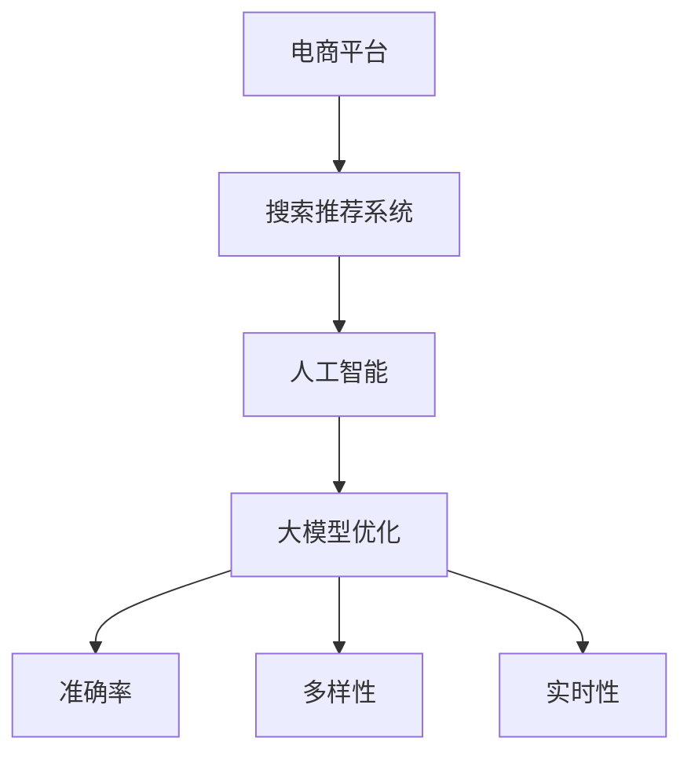

                 

# 电商平台搜索推荐系统的AI 大模型优化：提高准确率、多样性与实时性

> 关键词：电商平台,搜索推荐系统,人工智能,大模型优化,准确率,多样性,实时性

## 1. 背景介绍

### 1.1 问题由来
随着电子商务的蓬勃发展，电商平台面临的用户访问量与交易转化压力越来越大。搜索推荐系统作为电商平台的“大脑”，负责理解用户需求并快速、准确地为用户推荐商品，其效果直接影响用户的购物体验和平台业绩。传统基于规则或浅层学习模型的搜索推荐系统在处理复杂多样化的电商数据时，面临以下挑战：

- **准确率不足**：传统推荐模型无法处理大规模用户行为数据，对商品特征的挖掘不够深入，导致推荐结果不够精准。
- **多样性不高**：推荐结果容易陷入“内容茧房”，导致用户体验单一，缺乏新鲜感和多样性。
- **实时性较差**：推荐结果需要快速生成，但现有模型难以在实时环境中高效运行，影响用户体验。

因此，如何提升电商搜索推荐系统的准确率、多样性和实时性，已成为电商平台数字化转型升级的重要课题。

## 2. 核心概念与联系

### 2.1 核心概念概述

为了更好地解决电商搜索推荐系统面临的挑战，本节将介绍几个关键概念：

- **电商平台**：指通过互联网提供商品和服务的平台，如淘宝、京东、亚马逊等。
- **搜索推荐系统**：负责理解用户查询意图，从商品库中筛选推荐给用户的系统。主要包括搜索和推荐两个模块。
- **人工智能(AI)**：通过机器学习、深度学习等技术，实现智能自动化决策的系统。
- **大模型优化**：指在预训练大模型基础上，通过微调、知识增强、结构优化等方法，提升推荐系统性能的过程。
- **准确率**：推荐系统推荐的商品与用户真实购买意愿匹配度的高低。
- **多样性**：推荐结果包含不同类别、品牌、价格的商品，避免用户陷入信息茧房。
- **实时性**：推荐系统在用户查询后快速响应，即时提供推荐结果。

这些概念之间的逻辑关系可以通过以下Mermaid流程图来展示：



这个流程图展示了大模型优化在电商搜索推荐系统中的应用流程：

1. 电商平台的搜索推荐系统集成了人工智能技术。
2. 基于预训练大模型的优化，提升系统的准确率、多样性和实时性。
3. 最终通过准确率、多样性、实时性等指标评估优化效果。

## 3. 核心算法原理 & 具体操作步骤
### 3.1 算法原理概述

大模型优化在电商搜索推荐系统中的应用，本质上是通过预训练大模型的语义理解能力和知识迁移能力，来提升推荐系统的性能。其核心思想是：将预训练大模型视为一个强大的“特征提取器”，通过微调、知识增强、结构优化等方法，使得模型在电商数据的处理上更加高效、准确。

形式化地，假设预训练大模型为 $M_{\theta}$，其中 $\theta$ 为预训练得到的模型参数。假设电商平台推荐系统的数据集为 $D=\{(x_i, y_i)\}_{i=1}^N$，$x_i$ 表示用户查询和商品描述，$y_i$ 表示用户真实的购买行为（如购买、浏览等）。大模型优化的优化目标是最小化经验风险，即找到最优参数 $\hat{\theta}$，使得：

$$
\hat{\theta}=\mathop{\arg\min}_{\theta} \mathcal{L}(M_{\theta},D)
$$

其中 $\mathcal{L}$ 为推荐系统的损失函数，用于衡量推荐结果与用户真实购买行为之间的差异。常见的损失函数包括交叉熵损失、均方误差损失等。

### 3.2 算法步骤详解

基于大模型优化的电商搜索推荐系统一般包括以下几个关键步骤：

**Step 1: 准备预训练模型和数据集**
- 选择合适的预训练大模型 $M_{\theta}$ 作为初始化参数，如BERT、GPT-2、DALL-E等。
- 准备电商平台推荐系统的数据集 $D$，划分为训练集、验证集和测试集。一般要求数据与预训练数据的分布不要差异过大。

**Step 2: 设计任务适配层**
- 根据电商推荐任务的特点，设计合适的任务适配层。如选择分类层、生成层、排序层等。
- 定义损失函数，如交叉熵损失、均方误差损失、排序损失等。

**Step 3: 设置优化超参数**
- 选择合适的优化算法及其参数，如AdamW、SGD等，设置学习率、批大小、迭代轮数等。
- 设置正则化技术及强度，包括权重衰减、Dropout、Early Stopping等。
- 确定冻结预训练参数的策略，如仅微调顶层，或全部参数都参与微调。

**Step 4: 执行梯度训练**
- 将训练集数据分批次输入模型，前向传播计算损失函数。
- 反向传播计算参数梯度，根据设定的优化算法和学习率更新模型参数。
- 周期性在验证集上评估模型性能，根据性能指标决定是否触发 Early Stopping。
- 重复上述步骤直到满足预设的迭代轮数或 Early Stopping 条件。

**Step 5: 测试和部署**
- 在测试集上评估优化后模型 $M_{\hat{\theta}}$ 的性能，对比优化前后的效果。
- 使用优化后的模型对新样本进行推理预测，集成到实际的应用系统中。
- 持续收集新的数据，定期重新优化模型，以适应数据分布的变化。

以上是基于大模型优化的电商搜索推荐系统的一般流程。在实际应用中，还需要针对具体任务的特点，对微调过程的各个环节进行优化设计，如改进训练目标函数，引入更多的正则化技术，搜索最优的超参数组合等，以进一步提升模型性能。

### 3.3 算法优缺点

基于大模型优化的电商搜索推荐系统方法具有以下优点：
1. **准确率提升显著**：利用大模型的语义理解能力，可以从海量电商数据中提取更有意义的特征，显著提升推荐准确率。
2. **多样性改善**：通过优化推荐算法，可以使推荐结果涵盖更多不同类别、品牌、价格的商品，提升用户体验。
3. **实时性增强**：大模型的推理速度较快，通过优化算法和模型结构，可以实现在线实时推荐。

同时，该方法也存在一定的局限性：
1. **对标注数据依赖高**：电商推荐系统需要大量的标注数据进行训练，标注成本较高。
2. **计算资源需求大**：大模型的参数量较大，训练和推理需要大量的计算资源。
3. **过拟合风险高**：电商数据存在噪声，大模型容易过拟合训练集。
4. **模型复杂度大**：大模型结构复杂，难以解释和调试。

尽管存在这些局限性，但就目前而言，基于大模型优化的推荐系统方法仍然是最主流的选择。未来相关研究的重点在于如何进一步降低模型对标注数据的依赖，提高模型的泛化能力和实时性能，同时兼顾可解释性和计算资源。

### 3.4 算法应用领域

基于大模型优化的电商搜索推荐系统，已经在商品推荐、广告投放、个性化营销等多个电商应用场景中得到了广泛的应用，显著提升了电商平台的运营效率和用户体验。

- **商品推荐**：电商平台的搜索推荐系统是提高商品转化率的重要环节。通过优化推荐算法，可以实现个性化的商品推荐，提升用户体验和转化率。
- **广告投放**：电商平台通过精准的广告投放，可以吸引更多流量和用户。优化推荐系统可以提升广告投放的精准度，减少无效曝光。
- **个性化营销**：基于用户行为数据和商品属性数据，通过优化推荐系统，可以制定更加精准的个性化营销策略，提高用户粘性和复购率。

除了这些常见应用外，大模型优化的推荐系统还适用于个性化分析、异常检测、价格优化等场景，为电商平台的数字化转型提供了更多可能。随着大模型技术的持续演进，相信推荐系统将在更多电商场景中发挥更大的作用。

## 4. 数学模型和公式 & 详细讲解  
### 4.1 数学模型构建

本节将使用数学语言对基于大模型优化的电商搜索推荐系统过程进行更加严格的刻画。

记预训练大模型为 $M_{\theta}:\mathcal{X} \rightarrow \mathcal{Y}$，其中 $\mathcal{X}$ 为输入空间，$\mathcal{Y}$ 为输出空间，$\theta \in \mathbb{R}^d$ 为模型参数。假设电商平台推荐系统的训练集为 $D=\{(x_i,y_i)\}_{i=1}^N$，$x_i$ 表示用户查询和商品描述，$y_i$ 表示用户真实的购买行为（如购买、浏览等）。

定义模型 $M_{\theta}$ 在输入 $x$ 上的输出为 $\hat{y}=M_{\theta}(x)$，其中 $\hat{y}$ 表示模型预测的用户购买行为。推荐系统的损失函数 $\mathcal{L}(\theta)$ 定义为：

$$
\mathcal{L}(\theta) = \frac{1}{N} \sum_{i=1}^N \ell(M_{\theta}(x_i),y_i)
$$

其中 $\ell$ 为损失函数，通常采用交叉熵损失或排序损失等。

### 4.2 公式推导过程

以下我们以电商推荐系统中的分类任务为例，推导交叉熵损失函数及其梯度的计算公式。

假设模型 $M_{\theta}$ 在输入 $x$ 上的输出为 $\hat{y}=M_{\theta}(x) \in [0,1]$，表示用户购买行为的概率。真实标签 $y \in \{0,1\}$。则二分类交叉熵损失函数定义为：

$$
\ell(M_{\theta}(x),y) = -[y\log \hat{y} + (1-y)\log (1-\hat{y})]
$$

将其代入经验风险公式，得：

$$
\mathcal{L}(\theta) = -\frac{1}{N}\sum_{i=1}^N [y_i\log M_{\theta}(x_i)+(1-y_i)\log(1-M_{\theta}(x_i))]
$$

根据链式法则，损失函数对参数 $\theta_k$ 的梯度为：

$$
\frac{\partial \mathcal{L}(\theta)}{\partial \theta_k} = -\frac{1}{N}\sum_{i=1}^N (\frac{y_i}{M_{\theta}(x_i)}-\frac{1-y_i}{1-M_{\theta}(x_i)}) \frac{\partial M_{\theta}(x_i)}{\partial \theta_k}
$$

其中 $\frac{\partial M_{\theta}(x_i)}{\partial \theta_k}$ 可进一步递归展开，利用自动微分技术完成计算。

在得到损失函数的梯度后，即可带入参数更新公式，完成模型的迭代优化。重复上述过程直至收敛，最终得到适应电商推荐任务的最优模型参数 $\theta^*$。

## 5. 项目实践：代码实例和详细解释说明
### 5.1 开发环境搭建

在进行大模型优化实践前，我们需要准备好开发环境。以下是使用Python进行PyTorch开发的环境配置流程：

1. 安装Anaconda：从官网下载并安装Anaconda，用于创建独立的Python环境。

2. 创建并激活虚拟环境：
```bash
conda create -n pytorch-env python=3.8 
conda activate pytorch-env
```

3. 安装PyTorch：根据CUDA版本，从官网获取对应的安装命令。例如：
```bash
conda install pytorch torchvision torchaudio cudatoolkit=11.1 -c pytorch -c conda-forge
```

4. 安装Transformers库：
```bash
pip install transformers
```

5. 安装各类工具包：
```bash
pip install numpy pandas scikit-learn matplotlib tqdm jupyter notebook ipython
```

完成上述步骤后，即可在`pytorch-env`环境中开始大模型优化的实践。

### 5.2 源代码详细实现

这里我们以电商平台商品推荐系统为例，给出使用Transformers库对BERT模型进行优化的PyTorch代码实现。

首先，定义推荐任务的数据处理函数：

```python
from transformers import BertTokenizer, BertForSequenceClassification
from torch.utils.data import Dataset
import torch

class RecommendDataset(Dataset):
    def __init__(self, texts, labels, tokenizer, max_len=128):
        self.texts = texts
        self.labels = labels
        self.tokenizer = tokenizer
        self.max_len = max_len
        
    def __len__(self):
        return len(self.texts)
    
    def __getitem__(self, item):
        text = self.texts[item]
        label = self.labels[item]
        
        encoding = self.tokenizer(text, return_tensors='pt', max_length=self.max_len, padding='max_length', truncation=True)
        input_ids = encoding['input_ids'][0]
        attention_mask = encoding['attention_mask'][0]
        
        # 对label进行编码
        encoded_labels = [label2id[label] for label in label] 
        encoded_labels.extend([label2id['O']] * (self.max_len - len(encoded_labels)))
        labels = torch.tensor(encoded_labels, dtype=torch.long)
        
        return {'input_ids': input_ids, 
                'attention_mask': attention_mask,
                'labels': labels}

# 标签与id的映射
label2id = {'O': 0, 'buy': 1, 'look': 2}
id2label = {v: k for k, v in label2id.items()}

# 创建dataset
tokenizer = BertTokenizer.from_pretrained('bert-base-cased')

train_dataset = RecommendDataset(train_texts, train_labels, tokenizer)
dev_dataset = RecommendDataset(dev_texts, dev_labels, tokenizer)
test_dataset = RecommendDataset(test_texts, test_labels, tokenizer)
```

然后，定义模型和优化器：

```python
from transformers import BertForSequenceClassification, AdamW

model = BertForSequenceClassification.from_pretrained('bert-base-cased', num_labels=len(label2id))

optimizer = AdamW(model.parameters(), lr=2e-5)
```

接着，定义训练和评估函数：

```python
from torch.utils.data import DataLoader
from tqdm import tqdm
from sklearn.metrics import classification_report

device = torch.device('cuda') if torch.cuda.is_available() else torch.device('cpu')
model.to(device)

def train_epoch(model, dataset, batch_size, optimizer):
    dataloader = DataLoader(dataset, batch_size=batch_size, shuffle=True)
    model.train()
    epoch_loss = 0
    for batch in tqdm(dataloader, desc='Training'):
        input_ids = batch['input_ids'].to(device)
        attention_mask = batch['attention_mask'].to(device)
        labels = batch['labels'].to(device)
        model.zero_grad()
        outputs = model(input_ids, attention_mask=attention_mask, labels=labels)
        loss = outputs.loss
        epoch_loss += loss.item()
        loss.backward()
        optimizer.step()
    return epoch_loss / len(dataloader)

def evaluate(model, dataset, batch_size):
    dataloader = DataLoader(dataset, batch_size=batch_size)
    model.eval()
    preds, labels = [], []
    with torch.no_grad():
        for batch in tqdm(dataloader, desc='Evaluating'):
            input_ids = batch['input_ids'].to(device)
            attention_mask = batch['attention_mask'].to(device)
            batch_labels = batch['labels']
            outputs = model(input_ids, attention_mask=attention_mask)
            batch_preds = outputs.logits.argmax(dim=2).to('cpu').tolist()
            batch_labels = batch_labels.to('cpu').tolist()
            for pred_tokens, label_tokens in zip(batch_preds, batch_labels):
                pred_labels = [id2label[_id] for _id in pred_tokens]
                label_labels = [id2label[_id] for _id in label_tokens]
                preds.append(pred_labels[:len(label_labels)])
                labels.append(label_labels)
                
    print(classification_report(labels, preds))
```

最后，启动训练流程并在测试集上评估：

```python
epochs = 5
batch_size = 16

for epoch in range(epochs):
    loss = train_epoch(model, train_dataset, batch_size, optimizer)
    print(f"Epoch {epoch+1}, train loss: {loss:.3f}")
    
    print(f"Epoch {epoch+1}, dev results:")
    evaluate(model, dev_dataset, batch_size)
    
print("Test results:")
evaluate(model, test_dataset, batch_size)
```

以上就是使用PyTorch对BERT进行电商平台商品推荐系统优化的完整代码实现。可以看到，得益于Transformers库的强大封装，我们可以用相对简洁的代码完成BERT模型的加载和优化。

### 5.3 代码解读与分析

让我们再详细解读一下关键代码的实现细节：

**RecommendDataset类**：
- `__init__`方法：初始化文本、标签、分词器等关键组件。
- `__len__`方法：返回数据集的样本数量。
- `__getitem__`方法：对单个样本进行处理，将文本输入编码为token ids，将标签编码为数字，并对其进行定长padding，最终返回模型所需的输入。

**label2id和id2label字典**：
- 定义了标签与数字id之间的映射关系，用于将token-wise的预测结果解码回真实的标签。

**训练和评估函数**：
- 使用PyTorch的DataLoader对数据集进行批次化加载，供模型训练和推理使用。
- 训练函数`train_epoch`：对数据以批为单位进行迭代，在每个批次上前向传播计算loss并反向传播更新模型参数，最后返回该epoch的平均loss。
- 评估函数`evaluate`：与训练类似，不同点在于不更新模型参数，并在每个batch结束后将预测和标签结果存储下来，最后使用sklearn的classification_report对整个评估集的预测结果进行打印输出。

**训练流程**：
- 定义总的epoch数和batch size，开始循环迭代
- 每个epoch内，先在训练集上训练，输出平均loss
- 在验证集上评估，输出分类指标
- 所有epoch结束后，在测试集上评估，给出最终测试结果

可以看到，PyTorch配合Transformers库使得BERT优化的代码实现变得简洁高效。开发者可以将更多精力放在数据处理、模型改进等高层逻辑上，而不必过多关注底层的实现细节。

当然，工业级的系统实现还需考虑更多因素，如模型的保存和部署、超参数的自动搜索、更灵活的任务适配层等。但核心的优化范式基本与此类似。

## 6. 实际应用场景
### 6.1 智能客服系统

基于大模型优化的电商搜索推荐系统，可以广泛应用于智能客服系统的构建。传统客服往往需要配备大量人力，高峰期响应缓慢，且一致性和专业性难以保证。而使用优化后的推荐系统，可以7x24小时不间断服务，快速响应客户咨询，用自然流畅的语言解答各类常见问题。

在技术实现上，可以收集企业内部的历史客服对话记录，将问题和最佳答复构建成监督数据，在此基础上对优化后的推荐系统进行训练。训练后的系统能够自动理解用户意图，匹配最合适的答案模板进行回复。对于客户提出的新问题，还可以接入检索系统实时搜索相关内容，动态组织生成回答。如此构建的智能客服系统，能大幅提升客户咨询体验和问题解决效率。

### 6.2 金融舆情监测

金融机构需要实时监测市场舆论动向，以便及时应对负面信息传播，规避金融风险。传统的人工监测方式成本高、效率低，难以应对网络时代海量信息爆发的挑战。基于大模型优化的推荐系统，可以在实时抓取的网络文本数据上进行情感分析和舆情监测。

具体而言，可以收集金融领域相关的新闻、报道、评论等文本数据，并对其进行主题标注和情感标注。在此基础上对优化后的推荐系统进行训练，使其能够自动判断文本属于何种主题，情感倾向是正面、中性还是负面。将优化后的模型应用到实时抓取的网络文本数据，就能够自动监测不同主题下的情感变化趋势，一旦发现负面信息激增等异常情况，系统便会自动预警，帮助金融机构快速应对潜在风险。

### 6.3 个性化推荐系统

当前的推荐系统往往只依赖用户的历史行为数据进行物品推荐，无法深入理解用户的真实兴趣偏好。基于大模型优化的推荐系统可以更好地挖掘用户行为背后的语义信息，从而提供更精准、多样的推荐内容。

在实践中，可以收集用户浏览、点击、评论、分享等行为数据，提取和用户交互的物品标题、描述、标签等文本内容。将文本内容作为模型输入，用户的后续行为（如是否点击、购买等）作为监督信号，在此基础上优化推荐系统。优化后的模型能够从文本内容中准确把握用户的兴趣点。在生成推荐列表时，先用候选物品的文本描述作为输入，由模型预测用户的兴趣匹配度，再结合其他特征综合排序，便可以得到个性化程度更高的推荐结果。

### 6.4 未来应用展望

随着大模型优化技术的不断发展，基于优化范式将在更多领域得到应用，为传统行业带来变革性影响。

在智慧医疗领域，基于优化推荐系统可以为医生推荐精准的诊断方案和药物治疗，辅助医生诊疗，加速新药开发进程。

在智能教育领域，优化推荐系统可以个性化推荐学习资源和课程，因材施教，促进教育公平，提高教学质量。

在智慧城市治理中，优化推荐系统可以用于城市事件监测、舆情分析、应急指挥等环节，提高城市管理的自动化和智能化水平，构建更安全、高效的未来城市。

此外，在企业生产、社会治理、文娱传媒等众多领域，基于大模型优化的推荐系统也将不断涌现，为NLP技术带来了全新的突破。随着预训练语言模型和优化方法的持续演进，相信推荐系统将在更广阔的应用领域大放异彩，深刻影响人类的生产生活方式。

## 7. 工具和资源推荐
### 7.1 学习资源推荐

为了帮助开发者系统掌握大模型优化理论基础和实践技巧，这里推荐一些优质的学习资源：

1. 《Transformer从原理到实践》系列博文：由大模型技术专家撰写，深入浅出地介绍了Transformer原理、BERT模型、优化技术等前沿话题。

2. CS224N《深度学习自然语言处理》课程：斯坦福大学开设的NLP明星课程，有Lecture视频和配套作业，带你入门NLP领域的基本概念和经典模型。

3. 《Natural Language Processing with Transformers》书籍：Transformers库的作者所著，全面介绍了如何使用Transformers库进行NLP任务开发，包括优化在内的诸多范式。

4. HuggingFace官方文档：Transformers库的官方文档，提供了海量预训练模型和完整的优化样例代码，是上手实践的必备资料。

5. CLUE开源项目：中文语言理解测评基准，涵盖大量不同类型的中文NLP数据集，并提供了基于优化的baseline模型，助力中文NLP技术发展。

通过对这些资源的学习实践，相信你一定能够快速掌握大模型优化的精髓，并用于解决实际的NLP问题。
### 7.2 开发工具推荐

高效的开发离不开优秀的工具支持。以下是几款用于大模型优化开发的常用工具：

1. PyTorch：基于Python的开源深度学习框架，灵活动态的计算图，适合快速迭代研究。大部分预训练语言模型都有PyTorch版本的实现。

2. TensorFlow：由Google主导开发的开源深度学习框架，生产部署方便，适合大规模工程应用。同样有丰富的预训练语言模型资源。

3. Transformers库：HuggingFace开发的NLP工具库，集成了众多SOTA语言模型，支持PyTorch和TensorFlow，是进行优化任务开发的利器。

4. Weights & Biases：模型训练的实验跟踪工具，可以记录和可视化模型训练过程中的各项指标，方便对比和调优。与主流深度学习框架无缝集成。

5. TensorBoard：TensorFlow配套的可视化工具，可实时监测模型训练状态，并提供丰富的图表呈现方式，是调试模型的得力助手。

6. Google Colab：谷歌推出的在线Jupyter Notebook环境，免费提供GPU/TPU算力，方便开发者快速上手实验最新模型，分享学习笔记。

合理利用这些工具，可以显著提升大模型优化的开发效率，加快创新迭代的步伐。

### 7.3 相关论文推荐

大模型优化技术的发展源于学界的持续研究。以下是几篇奠基性的相关论文，推荐阅读：

1. Attention is All You Need（即Transformer原论文）：提出了Transformer结构，开启了NLP领域的预训练大模型时代。

2. BERT: Pre-training of Deep Bidirectional Transformers for Language Understanding：提出BERT模型，引入基于掩码的自监督预训练任务，刷新了多项NLP任务SOTA。

3. Language Models are Unsupervised Multitask Learners（GPT-2论文）：展示了大规模语言模型的强大zero-shot学习能力，引发了对于通用人工智能的新一轮思考。

4. Parameter-Efficient Transfer Learning for NLP：提出Adapter等参数高效微调方法，在不增加模型参数量的情况下，也能取得不错的优化效果。

5. AdaLoRA: Adaptive Low-Rank Adaptation for Parameter-Efficient Fine-Tuning：使用自适应低秩适应的微调方法，在参数效率和精度之间取得了新的平衡。

这些论文代表了大模型优化技术的发展脉络。通过学习这些前沿成果，可以帮助研究者把握学科前进方向，激发更多的创新灵感。

## 8. 总结：未来发展趋势与挑战

### 8.1 总结

本文对基于大模型优化的电商平台搜索推荐系统方法进行了全面系统的介绍。首先阐述了大模型优化在电商平台搜索推荐系统中的应用背景，明确了优化在提升推荐系统性能方面的独特价值。其次，从原理到实践，详细讲解了优化算法的数学原理和关键步骤，给出了优化任务开发的完整代码实例。同时，本文还广泛探讨了优化方法在智能客服、金融舆情、个性化推荐等多个电商应用场景的应用前景，展示了优化范式的巨大潜力。此外，本文精选了优化技术的各类学习资源，力求为读者提供全方位的技术指引。

通过本文的系统梳理，可以看到，基于大模型优化的搜索推荐系统方法在电商平台中已取得显著效果，提升了平台的运营效率和用户体验。未来，伴随大模型技术的持续演进，推荐系统将在更多电商场景中发挥更大的作用。

### 8.2 未来发展趋势

展望未来，大模型优化技术将呈现以下几个发展趋势：

1. **参数高效优化**：未来将开发更多参数高效的优化方法，如LoRA、Rethinking the Inception Architecture for Computer Vision等，在保持模型性能的同时，大幅减少模型参数量，降低计算资源消耗。

2. **模型结构优化**：采用更加轻量化的模型结构，如MobileBERT、MobileViT等，提升模型的推理速度和实时性，满足在线推荐的需求。

3. **多模态优化**：结合视觉、语音、文本等多模态信息，实现更加全面、准确的信息整合能力，提升推荐系统的多样性和精准度。

4. **实时优化技术**：采用流式优化算法，如在线梯度下降等，实现实时动态优化，保证推荐系统快速响应，满足实时性要求。

5. **联邦学习**：利用联邦学习技术，在多客户端分布式训练，保护用户隐私的同时，提升模型的泛化能力和优化效果。

6. **强化学习**：结合强化学习技术，优化推荐策略，提升推荐系统的长期效果和用户满意度。

以上趋势凸显了大模型优化技术的广阔前景。这些方向的探索发展，必将进一步提升推荐系统的性能和应用范围，为电商平台数字化转型升级提供新的技术路径。

### 8.3 面临的挑战

尽管大模型优化技术已经取得了瞩目成就，但在迈向更加智能化、普适化应用的过程中，它仍面临着诸多挑战：

1. **计算资源需求高**：大模型的参数量较大，训练和推理需要大量的计算资源。如何优化计算资源，提升模型训练和推理效率，将是重要研究方向。

2. **模型复杂度大**：大模型结构复杂，难以解释和调试。如何提高模型的可解释性，增强用户信任，将是未来的研究重点。

3. **过拟合风险高**：电商数据存在噪声，大模型容易过拟合训练集。如何降低过拟合风险，提高模型的泛化能力，将是重要研究方向。

4. **隐私保护问题**：电商数据涉及用户隐私，如何在保证隐私保护的前提下，进行大模型训练和优化，将是重要的技术挑战。

5. **业务适应性差**：大模型优化方法往往通用性较强，但无法完全适应不同电商平台的业务需求。如何开发更多场景化的优化方法，提升业务适配能力，将是重要研究方向。

6. **模型偏见问题**：大模型在训练过程中可能会学习到有偏见的信息，导致推荐结果不公平。如何消除模型偏见，保障推荐公平性，将是重要研究方向。

这些挑战凸显了大模型优化技术在实际应用中面临的复杂性和多样性，需要结合多学科知识，进行全面系统的研究。

### 8.4 研究展望

面对大模型优化面临的挑战，未来的研究需要在以下几个方面寻求新的突破：

1. **联合训练技术**：结合强化学习、联邦学习、多任务学习等联合训练技术，提升模型泛化能力和业务适应性。

2. **高效优化算法**：开发更加高效的优化算法，如AdaLoRA、Rethinking the Inception Architecture for Computer Vision等，提升优化速度和模型性能。

3. **模型压缩技术**：采用模型压缩技术，如知识蒸馏、剪枝等，减少模型参数量，提升模型推理速度。

4. **多模态融合技术**：结合视觉、语音、文本等多模态信息，提升模型的全面性和精准度。

5. **隐私保护技术**：采用差分隐私、联邦学习等技术，在保证隐私保护的前提下，进行大模型训练和优化。

6. **可解释性增强**：开发可解释性增强技术，如LIME、SHAP等，提高模型的透明性和可解释性。

这些研究方向将推动大模型优化技术向更高效、普适、公平、可解释的方向迈进，为电商平台等领域的智能化转型提供坚实的技术基础。总之，大模型优化技术需不断探索和突破，才能真正发挥其巨大的潜力，赋能各行业的数字化升级。

## 9. 附录：常见问题与解答

**Q1：大模型优化是否适用于所有电商平台推荐场景？**

A: 大模型优化在大多数电商平台推荐场景中都能取得不错的效果，特别是对于数据量较大的电商平台。但对于一些特定领域的电商，如垂直电商、跨境电商等，可能存在数据规模不足或领域特性明显的问题，需要针对性地进行优化。

**Q2：大模型优化在电商平台推荐中如何处理长尾商品？**

A: 长尾商品在电商平台中占据较大比例，传统的基于高频商品训练的推荐系统可能无法充分覆盖。大模型优化可以通过更复杂的模型结构和优化方法，更好地捕捉长尾商品的语义特征，提升推荐系统的精准度。

**Q3：大模型优化是否需要大量的标注数据？**

A: 优化推荐系统通常需要一定量的标注数据进行训练，标注数据的质量和数量对优化效果有重要影响。但相比从头训练，优化方法对标注数据的依赖较低，可以更高效地利用现有数据资源。

**Q4：大模型优化如何兼顾多样性和准确性？**

A: 优化推荐系统需要设计合适的优化目标函数，兼顾多样性和准确性。通常可以通过添加多样性约束、优化召回率等方法，提升推荐结果的多样性。同时优化算法也需要加入正则化等技术，避免过拟合，提升模型的泛化能力。

**Q5：大模型优化在电商平台推荐中如何实时更新？**

A: 电商平台推荐系统需要实时更新商品信息和用户行为，以保持推荐结果的时效性。优化推荐系统可以通过引入流式优化算法，如在线梯度下降等，实现实时动态优化。同时优化算法也需要兼顾计算效率，避免过高的资源消耗。

通过以上系统的介绍和分析，相信你对大模型优化在电商平台推荐系统中的应用有了更全面的理解。大模型优化技术的发展，为电商平台的智能化转型提供了新的可能，未来将在更多电商场景中发挥重要的作用。希望本文能为你提供有价值的参考，助力电商平台搜索推荐系统的优化和创新。

---

作者：禅与计算机程序设计艺术 / Zen and the Art of Computer Programming

