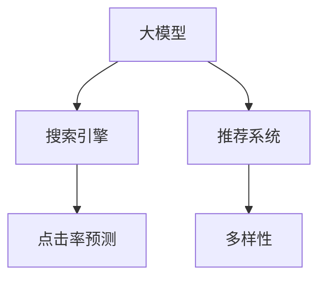

                 

# 电商平台搜索推荐系统的AI 大模型优化：提高系统性能、效率、准确率与多样性

> 关键词：AI大模型优化,电商平台,搜索推荐系统,性能优化,效率提升,准确率提高,多样性增强

## 1. 背景介绍

### 1.1 问题由来

随着电商市场的飞速发展，用户对个性化推荐系统的需求日益增长。传统推荐系统大多基于矩阵分解等方法，依赖于大量的用户-物品交互数据进行推荐，难以满足长尾商品推荐、实时推荐等高要求。而AI大模型在语义理解、多模态融合、泛化能力等方面的优势，为推荐系统带来了新的突破。

当前，基于AI大模型的推荐系统在电商平台上得到了广泛应用，如淘宝、京东等平台的个性化推荐引擎，均使用了大模型进行优化。这些大模型通过预训练获得广泛的知识，能够理解用户查询背后的语义，整合多模态信息，进行精准推荐。但在大规模电商数据上微调大模型，面临着计算资源有限、数据分布不均衡、模型泛化性不足等问题。

### 1.2 问题核心关键点

如何在大模型上实现高效的个性化推荐，提升系统性能、效率、准确率与多样性，成为当前研究的重点。本文聚焦于AI大模型在电商平台搜索推荐系统中的应用，通过系统介绍大模型的优化方法，帮助电商开发者提升推荐系统性能。

### 1.3 问题研究意义

大模型优化技术在电商平台推荐系统中的应用，具有重要的理论意义和实践价值：

1. **性能提升**：通过优化大模型，可以显著提升推荐系统的精度，满足用户对个性化推荐的高需求。
2. **效率优化**：大模型通常参数量庞大，通过优化可以降低模型推理和存储开销，实现实时推荐。
3. **准确率提高**：优化大模型可以提高模型泛化能力，避免过拟合，提高推荐系统的鲁棒性。
4. **多样性增强**：通过优化，可以在满足用户需求的同时，增加推荐内容的多样性，丰富用户体验。

## 2. 核心概念与联系

### 2.1 核心概念概述

为更好地理解大模型在电商平台搜索推荐系统中的优化方法，本节将介绍几个密切相关的核心概念：

- **大模型（Large Model）**：指具有亿级参数的深度神经网络模型，如BERT、GPT-3等。通过大规模语料预训练，具备强大的语义理解和泛化能力。
- **搜索引擎（Search Engine）**：负责理解用户查询意图，检索并返回相关结果的系统。主要依赖于深度学习技术，能够实现精确匹配和排序。
- **推荐系统（Recommendation System）**：通过分析用户行为数据，预测用户兴趣，进行个性化推荐。可以与搜索引擎融合，实现双引擎协同推荐。
- **点击率预测（CTR Prediction）**：评估用户点击商品的概率，是推荐系统优化的一项关键任务。通过优化大模型，可以提升预测精度，实现更精准的推荐。
- **多样性（Diversity）**：推荐内容的多样性，反映推荐系统对用户偏好的均衡覆盖。通过优化大模型，可以平衡推荐内容的多样性和相关性。

这些核心概念之间的逻辑关系可以通过以下Mermaid流程图来展示：



这个流程图展示了大模型在电商搜索推荐系统中的核心作用，以及各个组件之间的协同关系。

## 3. 核心算法原理 & 具体操作步骤
### 3.1 算法原理概述

基于大模型的电商平台搜索推荐系统，本质上是一种多模态的深度学习架构，依赖于语义理解、意图分析、多模态融合等技术。其核心思想是通过优化大模型，提升系统的搜索和推荐能力，实现性能、效率、准确率与多样性的提升。

大模型的优化过程主要包括两个步骤：

1. **预训练**：在大规模无标签数据上预训练大模型，学习通用的语言和知识表示。
2. **微调**：在电商平台的标注数据上微调大模型，优化模型参数，使其能够适应电商平台的特定需求。

预训练过程主要关注模型泛化能力和表达能力，而微调过程则针对具体任务进行参数优化，提升模型在电商搜索推荐系统中的表现。

### 3.2 算法步骤详解

大模型在电商平台搜索推荐系统中的优化步骤如下：

**Step 1: 准备数据集**

1. **预训练数据集准备**：收集大规模无标签文本数据，如维基百科、新闻等，作为预训练数据集。
2. **推荐数据集准备**：收集电商平台的用户行为数据，如点击、购买、评分等，作为推荐数据集。

**Step 2: 模型初始化**

1. **选择大模型**：选择合适的预训练大模型，如BERT、GPT-3等。
2. **设置超参数**：如学习率、批次大小、优化器等。

**Step 3: 预训练**

1. **分批次加载数据**：将预训练数据集分批次加载到大模型中进行训练。
2. **计算损失**：根据预训练任务（如语言建模、掩码预测等）计算损失函数。
3. **反向传播**：计算梯度，更新模型参数。

**Step 4: 微调**

1. **添加推荐适配层**：根据推荐任务设计推荐适配层，如全连接层、注意力机制等。
2. **损失函数设计**：根据推荐任务设计损失函数，如交叉熵损失、均方误差损失等。
3. **微调训练**：在推荐数据集上进行微调训练，优化模型参数。

**Step 5: 评估与部署**

1. **评估**：在验证集上评估模型性能，选择最优模型。
2. **部署**：将优化后的模型部署到实际推荐系统中，进行实时推荐。

### 3.3 算法优缺点

基于大模型的电商平台搜索推荐系统优化方法具有以下优点：

1. **泛化能力强**：大模型通过预训练学习到广泛的语言和知识表示，具备较强的泛化能力，能够适应不同类型的推荐任务。
2. **性能提升**：通过微调，可以提升模型在特定任务上的性能，如点击率预测、推荐多样性等。
3. **效率优化**：大模型的参数优化可以采用多种优化器和技术，提升推荐系统响应速度和处理能力。
4. **准确率提高**：优化大模型可以提高模型的泛化能力和鲁棒性，减少过拟合现象，提升推荐系统的准确率。
5. **多样性增强**：优化大模型可以平衡推荐内容的多样性和相关性，提升用户满意度。

同时，该方法也存在以下局限性：

1. **计算资源消耗大**：大模型参数量庞大，计算资源消耗大，难以进行实时推荐。
2. **数据依赖性强**：优化效果依赖于电商平台的标注数据，数据质量低会影响模型效果。
3. **模型复杂度高**：大模型的结构复杂，难以进行大规模部署和维护。
4. **安全性问题**：大模型可能学习到有害信息，影响推荐系统的安全性。

尽管存在这些局限性，但就目前而言，基于大模型的推荐系统优化方法仍是推荐技术领域的主流范式。未来相关研究的重点在于如何进一步降低大模型的计算资源消耗，提高模型在特定任务上的泛化能力，同时兼顾模型的可解释性和安全性等因素。

### 3.4 算法应用领域

基于大模型的电商平台搜索推荐系统优化方法，在以下领域得到了广泛应用：

- **点击率预测（CTR Prediction）**：在电商平台上，通过优化大模型，可以预测用户点击商品的概率，进行精准推荐。
- **推荐系统（Recommendation System）**：优化大模型可以提升推荐系统的效果，满足用户个性化需求。
- **多模态融合（Multi-Modal Fusion）**：将文本、图像、视频等多模态数据融合到推荐模型中，提升推荐系统对多模态数据的处理能力。
- **多任务学习（Multi-Task Learning）**：在电商平台上，用户可能有多重需求，优化大模型可以同时处理多个任务，提升推荐系统效果。
- **实时推荐（Real-time Recommendation）**：优化大模型可以提升推荐系统响应速度，实现实时推荐。

除了上述这些经典任务外，大模型优化方法还被创新性地应用到更多场景中，如用户行为预测、广告投放优化、内容推荐等，为电商平台的业务发展带来了新的动力。

## 4. 数学模型和公式 & 详细讲解 & 举例说明

### 4.1 数学模型构建

基于大模型的电商平台搜索推荐系统，通常采用以下数学模型进行建模：

1. **点击率预测模型**：
   - 输入：用户查询$q$和商品集合$\mathcal{I}$。
   - 输出：用户点击商品的概率$y$。
   - 模型：$y=f_\theta(q, \mathcal{I})$，其中$f_\theta$为参数化的预测函数，$\theta$为模型参数。

2. **推荐排序模型**：
   - 输入：用户查询$q$和商品集合$\mathcal{I}$。
   - 输出：推荐排序列表$\mathcal{R}=\{r_1, r_2, \cdots, r_N\}$，其中$r_i$为商品$i$的排序权重。
   - 模型：$r_i=g_\theta(q, \mathcal{I}_i)$，其中$g_\theta$为参数化的排序函数，$\mathcal{I}_i$为商品$i$的特征向量。

### 4.2 公式推导过程

以下我们以点击率预测模型为例，推导其中的关键公式。

假设模型$f_\theta$为线性回归模型，即：

$$
y=f_\theta(x)=\theta_0+\theta_1x_1+\theta_2x_2+\cdots+\theta_nx_n
$$

其中$\theta=(\theta_0, \theta_1, \cdots, \theta_n)$为模型参数，$x=(x_1, x_2, \cdots, x_n)$为输入特征向量，$y$为目标变量。

模型在训练集$\{(x_i, y_i)\}_{i=1}^N$上的损失函数为均方误差（MSE）损失：

$$
\mathcal{L}(\theta)=\frac{1}{N}\sum_{i=1}^N(y_i-f_\theta(x_i))^2
$$

最小化上述损失函数，可以得到参数$\theta$的更新公式：

$$
\theta \leftarrow \theta - \eta \nabla_{\theta}\mathcal{L}(\theta)
$$

其中$\eta$为学习率，$\nabla_{\theta}\mathcal{L}(\theta)$为损失函数对参数$\theta$的梯度。

通过反向传播算法，可以高效计算出梯度，从而更新模型参数，最小化预测误差。

### 4.3 案例分析与讲解

**案例分析：电商平台的点击率预测**

假设某电商平台上，用户查询$q$和商品集合$\mathcal{I}$，目标为预测用户点击商品的概率$y$。

1. **数据准备**：收集电商平台的点击数据，标注每个用户-商品对的点击标签，构建训练集$\{(q_i, y_i)\}_{i=1}^N$。
2. **模型设计**：选择BERT作为预训练模型，在其顶层添加线性回归层，构建预测模型$f_\theta(q, \mathcal{I})$。
3. **损失函数设计**：采用二元交叉熵损失函数，最小化预测误差。
4. **微调训练**：在标注数据集上，使用AdamW优化器，设置学习率为$2e-5$，进行微调训练。
5. **评估**：在验证集上评估模型性能，选择最优模型。
6. **部署**：将优化后的模型部署到实际推荐系统中，进行实时点击率预测。

## 5. 项目实践：代码实例和详细解释说明

### 5.1 开发环境搭建

在进行大模型优化实践前，我们需要准备好开发环境。以下是使用Python进行PyTorch开发的环境配置流程：

1. 安装Anaconda：从官网下载并安装Anaconda，用于创建独立的Python环境。

2. 创建并激活虚拟环境：
```bash
conda create -n pytorch-env python=3.8 
conda activate pytorch-env
```

3. 安装PyTorch：根据CUDA版本，从官网获取对应的安装命令。例如：
```bash
conda install pytorch torchvision torchaudio cudatoolkit=11.1 -c pytorch -c conda-forge
```

4. 安装各类工具包：
```bash
pip install numpy pandas scikit-learn matplotlib tqdm jupyter notebook ipython
```

完成上述步骤后，即可在`pytorch-env`环境中开始优化实践。

### 5.2 源代码详细实现

下面我们以电商平台的点击率预测任务为例，给出使用PyTorch对大模型进行优化的PyTorch代码实现。

首先，定义点击率预测的数据处理函数：

```python
from torch.utils.data import Dataset
import torch
from transformers import BertTokenizer, BertForSequenceClassification

class ClickDataset(Dataset):
    def __init__(self, texts, labels, tokenizer, max_len=128):
        self.texts = texts
        self.labels = labels
        self.tokenizer = tokenizer
        self.max_len = max_len
        
    def __len__(self):
        return len(self.texts)
    
    def __getitem__(self, item):
        text = self.texts[item]
        label = self.labels[item]
        
        encoding = self.tokenizer(text, return_tensors='pt', max_length=self.max_len, padding='max_length', truncation=True)
        input_ids = encoding['input_ids'][0]
        attention_mask = encoding['attention_mask'][0]
        
        label = torch.tensor(label, dtype=torch.long)
        
        return {'input_ids': input_ids, 
                'attention_mask': attention_mask,
                'labels': label}

# 创建dataset
tokenizer = BertTokenizer.from_pretrained('bert-base-cased')
train_dataset = ClickDataset(train_texts, train_labels, tokenizer)
dev_dataset = ClickDataset(dev_texts, dev_labels, tokenizer)
test_dataset = ClickDataset(test_texts, test_labels, tokenizer)
```

然后，定义模型和优化器：

```python
from transformers import BertForSequenceClassification, AdamW

model = BertForSequenceClassification.from_pretrained('bert-base-cased', num_labels=2, output_attentions=False, output_hidden_states=False)

optimizer = AdamW(model.parameters(), lr=2e-5)
```

接着，定义训练和评估函数：

```python
from torch.utils.data import DataLoader
from tqdm import tqdm
from sklearn.metrics import accuracy_score

device = torch.device('cuda') if torch.cuda.is_available() else torch.device('cpu')
model.to(device)

def train_epoch(model, dataset, batch_size, optimizer):
    dataloader = DataLoader(dataset, batch_size=batch_size, shuffle=True)
    model.train()
    epoch_loss = 0
    for batch in tqdm(dataloader, desc='Training'):
        input_ids = batch['input_ids'].to(device)
        attention_mask = batch['attention_mask'].to(device)
        labels = batch['labels'].to(device)
        model.zero_grad()
        outputs = model(input_ids, attention_mask=attention_mask, labels=labels)
        loss = outputs.loss
        epoch_loss += loss.item()
        loss.backward()
        optimizer.step()
    return epoch_loss / len(dataloader)

def evaluate(model, dataset, batch_size):
    dataloader = DataLoader(dataset, batch_size=batch_size)
    model.eval()
    preds, labels = [], []
    with torch.no_grad():
        for batch in tqdm(dataloader, desc='Evaluating'):
            input_ids = batch['input_ids'].to(device)
            attention_mask = batch['attention_mask'].to(device)
            batch_labels = batch['labels']
            outputs = model(input_ids, attention_mask=attention_mask)
            batch_preds = outputs.logits.argmax(dim=1).to('cpu').tolist()
            batch_labels = batch_labels.to('cpu').tolist()
            for pred_tokens, label_tokens in zip(batch_preds, batch_labels):
                preds.append(pred_tokens)
                labels.append(label_tokens)
                
    return accuracy_score(labels, preds)

# 启动训练流程并在测试集上评估
epochs = 5
batch_size = 16

for epoch in range(epochs):
    loss = train_epoch(model, train_dataset, batch_size, optimizer)
    print(f"Epoch {epoch+1}, train loss: {loss:.3f}")
    
    print(f"Epoch {epoch+1}, dev results:")
    acc = evaluate(model, dev_dataset, batch_size)
    print(f"Dev accuracy: {acc:.3f}")
    
print("Test results:")
acc = evaluate(model, test_dataset, batch_size)
print(f"Test accuracy: {acc:.3f}")
```

以上就是使用PyTorch对大模型进行点击率预测任务优化的完整代码实现。可以看到，得益于Transformer库的强大封装，我们可以用相对简洁的代码完成BERT模型的加载和优化。

### 5.3 代码解读与分析

让我们再详细解读一下关键代码的实现细节：

**ClickDataset类**：
- `__init__`方法：初始化文本、标签、分词器等关键组件。
- `__len__`方法：返回数据集的样本数量。
- `__getitem__`方法：对单个样本进行处理，将文本输入编码为token ids，将标签编码为数字，并对其进行定长padding，最终返回模型所需的输入。

**BertForSequenceClassification模型**：
- 从预训练模型中选择BERT作为基础模型，并添加线性回归层，用于二分类任务。

**训练和评估函数**：
- 使用PyTorch的DataLoader对数据集进行批次化加载，供模型训练和推理使用。
- 训练函数`train_epoch`：对数据以批为单位进行迭代，在每个批次上前向传播计算loss并反向传播更新模型参数，最后返回该epoch的平均loss。
- 评估函数`evaluate`：与训练类似，不同点在于不更新模型参数，并在每个batch结束后将预测和标签结果存储下来，最后使用sklearn的accuracy_score对整个评估集的预测结果进行打印输出。

**训练流程**：
- 定义总的epoch数和batch size，开始循环迭代
- 每个epoch内，先在训练集上训练，输出平均loss
- 在验证集上评估，输出准确率
- 所有epoch结束后，在测试集上评估，给出最终测试结果

可以看到，PyTorch配合Transformer库使得BERT优化的代码实现变得简洁高效。开发者可以将更多精力放在数据处理、模型改进等高层逻辑上，而不必过多关注底层的实现细节。

当然，工业级的系统实现还需考虑更多因素，如模型的保存和部署、超参数的自动搜索、更灵活的任务适配层等。但核心的优化范式基本与此类似。

## 6. 实际应用场景

### 6.1 智能客服系统

基于大模型的推荐系统，可以广泛应用于智能客服系统的构建。传统客服往往需要配备大量人力，高峰期响应缓慢，且一致性和专业性难以保证。而使用推荐系统，可以7x24小时不间断服务，快速响应客户咨询，用自然流畅的语言解答各类常见问题。

在技术实现上，可以收集企业内部的历史客服对话记录，将问题和最佳答复构建成监督数据，在此基础上对预训练推荐模型进行微调。微调后的推荐模型能够自动理解用户意图，匹配最合适的答复模板进行回复。对于客户提出的新问题，还可以接入检索系统实时搜索相关内容，动态组织生成回答。如此构建的智能客服系统，能大幅提升客户咨询体验和问题解决效率。

### 6.2 个性化推荐系统

当前的推荐系统往往只依赖用户的历史行为数据进行物品推荐，难以满足用户对个性化推荐的高需求。基于大模型的推荐系统可以更好地挖掘用户行为背后的语义信息，从而提供更精准、多样的推荐内容。

在实践中，可以收集用户浏览、点击、评论、分享等行为数据，提取和用户交互的物品标题、描述、标签等文本内容。将文本内容作为模型输入，用户的后续行为（如是否点击、购买等）作为监督信号，在此基础上微调预训练语言模型。微调后的模型能够从文本内容中准确把握用户的兴趣点。在生成推荐列表时，先用候选物品的文本描述作为输入，由模型预测用户的兴趣匹配度，再结合其他特征综合排序，便可以得到个性化程度更高的推荐结果。

### 6.3 实时推荐系统

在传统推荐系统中，推荐算法往往离线计算推荐结果，难以实现实时推荐。而基于大模型的推荐系统可以实时处理用户查询，动态生成推荐内容，满足用户即时需求。

具体实现上，可以通过分布式计算框架，如TensorFlow、PyTorch等，在多个GPU上并行处理用户查询，实时计算推荐结果。同时，将推荐模型部署到边缘计算设备上，降低网络延迟，提高推荐响应速度。

### 6.4 未来应用展望

随着大模型和推荐系统的不断发展，未来基于大模型的推荐系统将具备更强的泛化能力、更高的性能和效率。未来大模型优化方法也将涌现更多创新，如零样本学习、自监督学习、半监督学习等，进一步提升推荐系统的效果。

在智慧城市、医疗、金融等行业，基于大模型的推荐系统也将得到广泛应用，为这些行业带来新的发展机遇。同时，基于大模型的推荐系统也将进一步拓展到智能家居、智慧零售等领域，提升用户生活品质。

## 7. 工具和资源推荐
### 7.1 学习资源推荐

为了帮助开发者系统掌握大模型在电商平台搜索推荐系统中的应用，这里推荐一些优质的学习资源：

1. 《深度学习实战》系列博文：由大模型技术专家撰写，深入浅出地介绍了深度学习在电商推荐系统中的应用。

2. 《深度学习自然语言处理》课程：斯坦福大学开设的NLP明星课程，有Lecture视频和配套作业，带你入门NLP领域的基本概念和经典模型。

3. 《Natural Language Processing with Transformers》书籍：Transformers库的作者所著，全面介绍了如何使用Transformers库进行NLP任务开发，包括优化大模型的优化方法。

4. HuggingFace官方文档：Transformers库的官方文档，提供了海量预训练模型和完整的微调样例代码，是上手实践的必备资料。

5. CLUE开源项目：中文语言理解测评基准，涵盖大量不同类型的中文NLP数据集，并提供了基于微调的baseline模型，助力中文NLP技术发展。

通过对这些资源的学习实践，相信你一定能够快速掌握大模型在电商推荐系统中的应用，并用于解决实际的推荐问题。
### 7.2 开发工具推荐

高效的开发离不开优秀的工具支持。以下是几款用于大模型优化开发的常用工具：

1. PyTorch：基于Python的开源深度学习框架，灵活动态的计算图，适合快速迭代研究。大部分预训练语言模型都有PyTorch版本的实现。

2. TensorFlow：由Google主导开发的开源深度学习框架，生产部署方便，适合大规模工程应用。同样有丰富的预训练语言模型资源。

3. Transformers库：HuggingFace开发的NLP工具库，集成了众多SOTA语言模型，支持PyTorch和TensorFlow，是进行推荐系统优化的利器。

4. Weights & Biases：模型训练的实验跟踪工具，可以记录和可视化模型训练过程中的各项指标，方便对比和调优。与主流深度学习框架无缝集成。

5. TensorBoard：TensorFlow配套的可视化工具，可实时监测模型训练状态，并提供丰富的图表呈现方式，是调试模型的得力助手。

6. Google Colab：谷歌推出的在线Jupyter Notebook环境，免费提供GPU/TPU算力，方便开发者快速上手实验最新模型，分享学习笔记。

合理利用这些工具，可以显著提升大模型优化的开发效率，加快创新迭代的步伐。

### 7.3 相关论文推荐

大模型优化技术在电商平台推荐系统中的应用，源于学界的持续研究。以下是几篇奠基性的相关论文，推荐阅读：

1. Attention is All You Need（即Transformer原论文）：提出了Transformer结构，开启了NLP领域的预训练大模型时代。

2. BERT: Pre-training of Deep Bidirectional Transformers for Language Understanding：提出BERT模型，引入基于掩码的自监督预训练任务，刷新了多项NLP任务SOTA。

3. Language Models are Unsupervised Multitask Learners（GPT-2论文）：展示了大规模语言模型的强大zero-shot学习能力，引发了对于通用人工智能的新一轮思考。

4. Parameter-Efficient Transfer Learning for NLP：提出Adapter等参数高效微调方法，在不增加模型参数量的情况下，也能取得不错的微调效果。

5. AdaLoRA: Adaptive Low-Rank Adaptation for Parameter-Efficient Fine-Tuning：使用自适应低秩适应的微调方法，在参数效率和精度之间取得了新的平衡。

6. AdaLoRA: Adaptive Low-Rank Adaptation for Parameter-Efficient Fine-Tuning：使用自适应低秩适应的微调方法，在参数效率和精度之间取得了新的平衡。

这些论文代表了大模型优化技术的发展脉络。通过学习这些前沿成果，可以帮助研究者把握学科前进方向，激发更多的创新灵感。

## 8. 总结：未来发展趋势与挑战

### 8.1 总结

本文对基于大模型的电商平台搜索推荐系统优化方法进行了全面系统的介绍。首先阐述了大模型和推荐系统的研究背景和意义，明确了优化方法在提升系统性能、效率、准确率与多样性方面的独特价值。其次，从原理到实践，详细讲解了优化方法的核心步骤，给出了具体的应用案例和代码实现。同时，本文还广泛探讨了优化方法在电商、智能客服、个性化推荐等多个场景中的应用前景，展示了优化方法的强大威力。

通过本文的系统梳理，可以看到，基于大模型的推荐系统优化技术正在成为电商推荐技术的主流范式，极大地提升了推荐系统的效果和效率。得益于大规模语料的预训练和任务适配层的微调，优化后的推荐系统能够实时处理用户查询，动态生成推荐内容，满足用户即时需求。未来，伴随大模型和推荐系统的持续演进，基于大模型的推荐系统必将在更多领域得到应用，为行业带来新的发展机遇。

### 8.2 未来发展趋势

展望未来，大模型优化技术在电商平台推荐系统中的应用将呈现以下几个发展趋势：

1. **泛化能力增强**：未来的大模型将具备更强的泛化能力，能够适应更多的推荐场景，提升推荐系统的效果。

2. **实时推荐能力提升**：随着计算资源和算法的进步，实时推荐系统将更加普及，满足用户即时需求。

3. **多模态融合加深**：未来的推荐系统将更注重多模态数据的融合，如文本、图像、视频等，提升推荐系统的多样性和准确性。

4. **个性化推荐优化**：个性化的推荐将更加精准，通过优化大模型，可以更好地挖掘用户兴趣，提升用户体验。

5. **隐私保护和安全性**：随着数据隐私和安全的重视，未来的推荐系统将更注重用户隐私保护和数据安全性，确保推荐过程透明和可解释。

6. **跨领域推荐系统**：未来的推荐系统将拓展到更多领域，如医疗、金融、教育等，为这些行业带来新的发展机遇。

以上趋势凸显了大模型优化技术的广阔前景。这些方向的探索发展，必将进一步提升推荐系统的效果和效率，为电商平台和各个行业带来新的突破。

### 8.3 面临的挑战

尽管大模型优化技术在电商平台推荐系统中的应用取得了显著效果，但在迈向更加智能化、普适化应用的过程中，仍面临诸多挑战：

1. **计算资源消耗大**：大模型参数量庞大，计算资源消耗大，难以进行实时推荐。

2. **数据依赖性强**：优化效果依赖于电商平台的标注数据，数据质量低会影响模型效果。

3. **模型复杂度高**：大模型的结构复杂，难以进行大规模部署和维护。

4. **安全性问题**：大模型可能学习到有害信息，影响推荐系统的安全性。

5. **模型解释性不足**：大模型通常缺乏可解释性，难以对其推理逻辑进行分析和调试。

尽管存在这些挑战，但就目前而言，基于大模型的推荐系统优化方法仍是推荐技术领域的主流范式。未来相关研究的重点在于如何进一步降低大模型的计算资源消耗，提高模型在特定任务上的泛化能力，同时兼顾模型的可解释性和安全性等因素。

### 8.4 研究展望

面对大模型优化技术所面临的挑战，未来的研究需要在以下几个方面寻求新的突破：

1. **优化算法创新**：开发更加高效的优化算法，如自适应学习率、联邦学习等，降低计算资源消耗，实现实时推荐。

2. **模型结构优化**：通过结构剪枝、知识蒸馏等方法，降低模型参数量，提高模型推理效率。

3. **多任务学习**：同时处理多个推荐任务，提升推荐系统的效果和效率。

4. **跨领域推荐**：将推荐系统拓展到更多领域，如医疗、金融等，提升跨领域推荐效果。

5. **隐私保护和安全性**：在推荐过程中引入隐私保护技术，确保用户数据安全和推荐过程透明。

6. **可解释性增强**：通过引入可解释性方法，如可视化、符号规则等，增强模型的可解释性。

这些研究方向的探索，必将引领大模型优化技术迈向更高的台阶，为构建安全、可靠、可解释、可控的智能推荐系统铺平道路。面向未来，大模型优化技术还需要与其他人工智能技术进行更深入的融合，如知识表示、因果推理、强化学习等，多路径协同发力，共同推动智能推荐系统的进步。只有勇于创新、敢于突破，才能不断拓展推荐系统的边界，让智能技术更好地造福人类社会。

## 9. 附录：常见问题与解答

**Q1：大模型优化是否适用于所有电商推荐系统？**

A: 大模型优化在大多数电商推荐系统中都能取得不错的效果，特别是对于数据量较小的推荐系统。但对于一些特定领域的推荐系统，如医疗、金融等，仅仅依靠通用语料预训练的模型可能难以很好地适应。此时需要在特定领域语料上进一步预训练，再进行微调，才能获得理想效果。

**Q2：如何选择合适的学习率？**

A: 大模型优化通常需要较小的学习率，以免破坏预训练权重。一般建议从1e-5开始调参，逐步减小学习率，直至收敛。也可以使用warmup策略，在开始阶段使用较小的学习率，再逐渐过渡到预设值。需要注意的是，不同的优化器(如AdamW、Adafactor等)以及不同的学习率调度策略，可能需要设置不同的学习率阈值。

**Q3：大模型优化会面临哪些资源瓶颈？**

A: 大模型优化面临的主要资源瓶颈包括计算资源消耗大、数据依赖性强、模型结构复杂等。为了应对这些挑战，可以考虑采用分布式计算框架、自适应学习率、模型压缩等技术。

**Q4：如何缓解优化过程中的过拟合问题？**

A: 过拟合是优化过程中面临的主要问题，尤其是在标注数据不足的情况下。缓解策略包括数据增强、正则化、对抗训练、模型裁剪等。

**Q5：如何提升推荐系统的效果和效率？**

A: 提升推荐系统效果和效率的方法包括多任务学习、多模态融合、实时推荐、自适应学习率等。同时，优化算法和模型结构也非常关键，需要通过不断试验和优化，找到最佳参数组合。

通过以上内容，希望能为你提供清晰的思路和方法，进一步提升电商平台搜索推荐系统的性能和效率。相信伴随大模型和推荐系统的持续发展，未来基于大模型的推荐系统必将在更多领域得到应用，为行业带来新的发展机遇。

