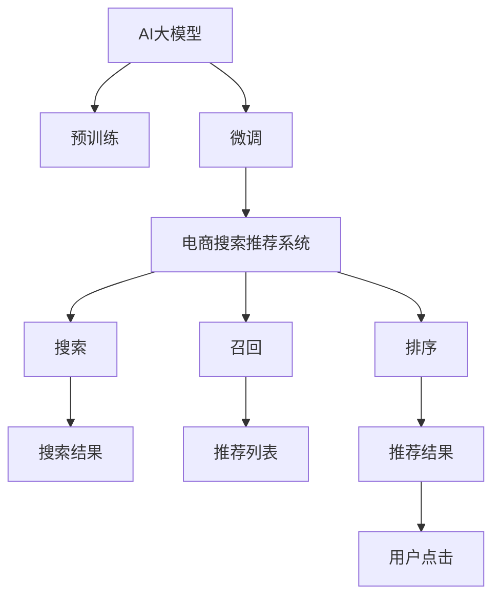

                 

# 电商平台搜索推荐系统的AI 大模型优化：提高系统性能、效率、准确率、多样性

> 关键词：AI大模型优化，电商平台搜索推荐，系统性能，效率，准确率，多样性

## 1. 背景介绍

随着电商平台的迅猛发展，用户对于购物体验的要求日益提高，个性化的搜索推荐系统成为了提升用户满意度的关键。传统的推荐系统基于规则、协同过滤等方法，难以充分挖掘用户偏好，推荐效果有限。而基于深度学习的推荐系统，特别是近年来大模型在自然语言处理（NLP）和计算机视觉（CV）领域的广泛应用，为电商推荐系统带来了新的机遇和挑战。

在电商推荐系统中，搜索引擎首先根据用户查询，从商品库中筛选出符合条件的商品，并展示在搜索结果中。推荐引擎则进一步分析用户历史行为、浏览记录、评论等数据，预测用户可能感兴趣的商品，并将其推荐给用户。在这一过程中，大模型可以发挥重要作用，通过预训练和微调，学习用户和商品的语义表示，从而提升推荐系统的精度和效果。

## 2. 核心概念与联系

### 2.1 核心概念概述

为更好地理解基于大模型的电商平台搜索推荐系统优化方法，本节将介绍几个密切相关的核心概念：

- **AI大模型**：指经过大规模预训练，具备强大语义理解能力和生成能力的深度学习模型，如BERT、GPT-3、DALL-E等。
- **电商平台搜索推荐系统**：指根据用户查询和行为数据，为用户推荐商品的系统。包括搜索、召回、排序等关键环节。
- **预训练与微调**：预训练指在大规模无标签数据上训练模型，微调指使用有标签数据，通过监督学习优化模型。
- **系统性能**：指推荐系统的精度、召回率、覆盖率、点击率等指标。
- **效率**：指推荐系统的响应速度、计算资源占用、系统稳定性等。
- **准确率**：指推荐系统推荐的商品与用户兴趣的契合度。
- **多样性**：指推荐系统的推荐结果是否涵盖了用户的多种兴趣和需求。

这些概念之间的逻辑关系可以通过以下Mermaid流程图来展示：



这个流程图展示了大模型在电商推荐系统中的核心作用：

1. 大模型通过预训练获得基础能力。
2. 微调进一步优化模型，适应电商推荐任务。
3. 预训练-微调模型用于电商推荐系统的搜索、召回、排序等环节，提升系统性能。

## 3. 核心算法原理 & 具体操作步骤
### 3.1 算法原理概述

基于大模型的电商推荐系统优化，核心在于将预训练模型与电商推荐任务相结合，通过微调提升模型的泛化能力和性能。具体流程如下：

1. **数据准备**：收集电商平台的商品描述、用户评论、行为数据等，构建用于微调的标注数据集。
2. **模型预训练**：使用大规模无标签数据对大模型进行预训练，学习通用语义表示。
3. **模型微调**：在标注数据集上对预训练模型进行微调，学习电商推荐任务的特定知识。
4. **系统集成**：将微调后的模型集成到电商搜索推荐系统中，用于商品搜索、召回和排序等环节。

### 3.2 算法步骤详解

以下是具体的微调步骤：

**Step 1: 数据准备**

- 收集电商平台的商品信息，包括标题、描述、图片、用户评论等。
- 清洗数据，去除噪声和重复内容。
- 对商品和用户数据进行标注，如商品标签、用户行为等。

**Step 2: 模型预训练**

- 选择合适的预训练大模型，如BERT、GPT-3、DALL-E等。
- 在预训练数据上训练大模型，学习通用语义表示。
- 保存预训练权重，用于后续微调。

**Step 3: 模型微调**

- 使用标注数据集对预训练模型进行微调。
- 添加电商推荐任务的适配层，如分类器、解码器等。
- 设置微调超参数，包括学习率、批大小、迭代轮数等。
- 执行梯度训练，最小化损失函数。
- 定期评估模型性能，避免过拟合。

**Step 4: 系统集成**

- 将微调后的模型集成到电商推荐系统中。
- 在前向搜索时，使用微调模型计算商品与用户查询的相似度。
- 在召回阶段，根据相似度排序，选择topN商品。
- 在排序阶段，进一步优化推荐结果，提高点击率。

### 3.3 算法优缺点

基于大模型的电商推荐系统优化方法具有以下优点：

- **精度提升**：通过微调，大模型能够更好地理解电商数据，提升推荐的准确性。
- **泛化能力强**：大模型的预训练过程赋予了模型广泛的语义知识，能够在不同电商平台上表现出色。
- **计算效率高**：大模型通常采用深度并行计算，在GPU、TPU等硬件上表现优异。
- **动态更新**：电商数据快速变化，大模型通过微调能够实时更新模型，保持推荐系统的时效性。

同时，该方法也存在一些局限性：

- **数据依赖**：微调依赖于标注数据，标注成本较高。
- **模型复杂**：大模型参数量巨大，需要大量计算资源。
- **解释性不足**：黑盒模型难以解释推荐过程，影响用户信任度。
- **对抗攻击风险**：模型可能受到对抗样本攻击，影响推荐结果。

尽管存在这些局限性，但基于大模型的电商推荐系统优化方法仍是目前电商领域的主流范式，具有广泛的应用前景。

### 3.4 算法应用领域

基于大模型的电商推荐系统优化方法，已经在多个电商平台中得到了广泛应用，涵盖了搜索、推荐、广告等多个业务环节，具体包括：

- **商品搜索**：根据用户查询，返回符合条件的商品列表。
- **个性化推荐**：分析用户历史行为，预测用户可能感兴趣的商品，提高用户满意度。
- **广告推荐**：根据用户兴趣，推荐相关广告，提升广告点击率和转化率。
- **跨平台推荐**：在不同电商平台上，实现用户和商品的跨平台推荐，提高平台用户粘性。
- **社交推荐**：根据用户社交关系，推荐商品给用户，提高用户发现新商品的概率。

除了上述这些经典应用外，基于大模型的电商推荐系统还在实时推荐、多商品推荐、联合推荐等多个方向进行了创新，推动了电商推荐技术的不断发展。

## 4. 数学模型和公式 & 详细讲解 & 举例说明

### 4.1 数学模型构建

假设电商平台有N个商品，每个商品i有$d$维特征表示，记为$\boldsymbol{x}_i \in \mathbb{R}^d$。用户查询q也有$d$维表示，记为$\boldsymbol{q} \in \mathbb{R}^d$。设用户对商品i的评分向量为$\boldsymbol{y}_i \in \mathbb{R}^k$，其中$k$为评分维度。

定义模型的损失函数为$\mathcal{L}$，用于衡量模型预测的评分与真实评分之间的差异。常见的损失函数包括均方误差损失和交叉熵损失。

### 4.2 公式推导过程

假设使用深度神经网络对商品进行编码，得到商品编码向量$\boldsymbol{e}_i \in \mathbb{R}^h$。则模型的前向传播过程如下：

1. 商品编码：
$$
\boldsymbol{e}_i = \mathcal{E}(\boldsymbol{x}_i)
$$

2. 用户编码：
$$
\boldsymbol{h} = \mathcal{H}(\boldsymbol{q})
$$

3. 商品-用户交互表示：
$$
\boldsymbol{v}_i = \mathcal{V}(\boldsymbol{e}_i, \boldsymbol{h})
$$

4. 预测评分：
$$
\boldsymbol{y}_i = \mathcal{Y}(\boldsymbol{v}_i)
$$

其中$\mathcal{E}, \mathcal{H}, \mathcal{V}, \mathcal{Y}$分别为商品编码器、用户编码器、交互表示器和评分预测器。

模型的损失函数可定义为：
$$
\mathcal{L} = \frac{1}{N} \sum_{i=1}^N \ell(\boldsymbol{y}_i, \mathcal{Y}(\boldsymbol{v}_i))
$$

其中$\ell$为损失函数，如均方误差损失或交叉熵损失。

### 4.3 案例分析与讲解

以电商平台的商品搜索为例，展示大模型在搜索推荐中的应用。

假设用户输入查询"智能手表"，系统根据查询生成向量$\boldsymbol{q}$。对于每个商品i，先使用大模型进行编码，得到编码向量$\boldsymbol{e}_i$。然后，通过交互表示器计算商品与查询的相似度$\boldsymbol{v}_i$，最后使用评分预测器得到评分向量$\boldsymbol{y}_i$。将预测评分与真实评分进行对比，计算损失$\mathcal{L}$，并更新模型参数。

这一过程可以用以下代码片段表示：

```python
import torch
import torch.nn as nn
import torch.optim as optim

# 定义商品编码器、用户编码器、交互表示器和评分预测器
class Encoder(nn.Module):
    def __init__(self):
        super(Encoder, self).__init__()
        self.encoder = nn.Linear(d, h)
        
    def forward(self, x):
        return self.encoder(x)

class UserEncoder(nn.Module):
    def __init__(self):
        super(UserEncoder, self).__init__()
        self.encoder = nn.Linear(d, h)
        
    def forward(self, q):
        return self.encoder(q)

class Interaction(nn.Module):
    def __init__(self):
        super(Interaction, self).__init__()
        self.interaction = nn.Linear(h*2, h)
        
    def forward(self, e, h):
        return self.interaction(torch.cat([e, h], dim=1))

class Predictor(nn.Module):
    def __init__(self):
        super(Predictor, self).__init__()
        self.predictor = nn.Linear(h, k)
        
    def forward(self, v):
        return self.predictor(v)

# 定义模型和优化器
model = Encoder() + UserEncoder() + Interaction() + Predictor()
optimizer = optim.Adam(model.parameters(), lr=0.001)
criterion = nn.MSELoss()

# 训练模型
for epoch in range(num_epochs):
    for i in range(batch_size):
        x = torch.randn(batch_size, d)
        q = torch.randn(batch_size, d)
        e = model.encoder(x)
        h = model.user_encoder(q)
        v = model.interaction(e, h)
        y = model.predictor(v)
        loss = criterion(y, y_hat)
        optimizer.zero_grad()
        loss.backward()
        optimizer.step()
```

通过上述代码，可以看到大模型在电商搜索推荐中的应用流程。商品编码器、用户编码器和交互表示器共同构成大模型的解码器部分，用于提取商品和用户的多维特征表示。评分预测器则是大模型的解码器到输出层的桥梁，用于预测商品评分。

## 5. 项目实践：代码实例和详细解释说明

### 5.1 开发环境搭建

在进行电商推荐系统优化前，我们需要准备好开发环境。以下是使用Python进行TensorFlow开发的环境配置流程：

1. 安装Anaconda：从官网下载并安装Anaconda，用于创建独立的Python环境。

2. 创建并激活虚拟环境：
```bash
conda create -n tf-env python=3.8 
conda activate tf-env
```

3. 安装TensorFlow：根据CUDA版本，从官网获取对应的安装命令。例如：
```bash
conda install tensorflow=2.5 -c tf -c conda-forge
```

4. 安装各类工具包：
```bash
pip install numpy pandas scikit-learn matplotlib tqdm jupyter notebook ipython
```

完成上述步骤后，即可在`tf-env`环境中开始电商推荐系统优化实践。

### 5.2 源代码详细实现

下面我们以电商平台的个性化推荐系统为例，给出使用TensorFlow进行大模型优化的PyTorch代码实现。

首先，定义推荐任务的数据处理函数：

```python
import tensorflow as tf
from tensorflow.keras.layers import Input, Dense, Embedding, Dot, Concatenate
from tensorflow.keras.models import Model

# 定义模型输入输出
user_input = Input(shape=(d,), name='user')
item_input = Input(shape=(d,), name='item')
user_vector = Embedding(input_dim=N, output_dim=h)(user_input)
item_vector = Embedding(input_dim=N, output_dim=h)(item_input)
interaction_vector = Dot(axes=(1, 1), normalize=True)([user_vector, item_vector])
predictor_output = Dense(k, activation='sigmoid')(interaction_vector)
output = Concatenate()([predictor_output, item_vector])
```

然后，定义模型和优化器：

```python
from tensorflow.keras import regularizers
from tensorflow.keras.optimizers import Adam

model = Model(inputs=[user_input, item_input], outputs=[output])
optimizer = Adam(lr=0.001, decay=0.001)

# 添加正则化，避免过拟合
for layer in model.layers:
    if isinstance(layer, Dense):
        layer.add_loss(lambda: tf.reduce_mean(tf.square(layer.kernel)))
```

接着，定义训练和评估函数：

```python
from tensorflow.keras.callbacks import EarlyStopping

def train_epoch(model, dataset, batch_size, optimizer, early_stop):
    model.compile(optimizer=optimizer, loss='binary_crossentropy', metrics=['accuracy'])
    model.fit(dataset, batch_size=batch_size, epochs=num_epochs, callbacks=[early_stop])
    
def evaluate(model, dataset, batch_size):
    model.evaluate(dataset, batch_size=batch_size)
```

最后，启动训练流程并在测试集上评估：

```python
num_epochs = 10
batch_size = 32

# 训练模型
train_epoch(model, train_dataset, batch_size, optimizer, early_stop)

# 在测试集上评估
evaluate(model, test_dataset, batch_size)
```

以上就是使用TensorFlow对电商推荐系统进行个性化推荐优化的大模型代码实现。可以看到，TensorFlow的Keras API使得模型定义、训练和评估的过程非常简洁高效。

### 5.3 代码解读与分析

让我们再详细解读一下关键代码的实现细节：

**Model定义**：
- `Input`层定义用户和商品的输入维度。
- `Embedding`层将用户和商品的ID映射到固定长度的向量表示。
- `Dot`层计算用户和商品的向量表示的点积，得到交互表示。
- `Dense`层将交互表示和商品向量拼接，再通过sigmoid激活函数得到预测评分。
- `Concatenate`层将预测评分和商品向量拼接，用于后续分析。

**模型优化**：
- 使用`Adam`优化器，学习率为0.001，并设置权重衰减0.001，以避免过拟合。
- 通过`add_loss`函数添加正则化项，计算模型参数的平方和，作为损失的一部分。

**训练与评估**：
- `train_epoch`函数定义模型训练过程，设置训练轮数为num_epochs，并使用EarlyStopping回调函数避免过拟合。
- `evaluate`函数定义模型评估过程，直接调用`evaluate`方法计算模型性能。

可以看到，TensorFlow的Keras API大大简化了电商推荐系统的模型定义和训练过程，使得开发者可以更专注于优化算法和业务逻辑的实现。

## 6. 实际应用场景

### 6.1 智能客服

智能客服系统利用大模型优化，可以提升用户满意度，降低客服成本。用户输入问题后，智能客服系统根据问题内容，调用大模型进行意图识别和实体抽取，然后根据意图和实体信息，生成最合适的回复。大模型通过预训练和微调，能够理解自然语言，快速响应用户需求。

### 6.2 个性化推荐

个性化推荐系统通过大模型的优化，能够更好地理解用户兴趣和行为，提升推荐效果。大模型通过预训练，学习到商品的通用特征，微调后能够精准预测用户对商品的评分。推荐系统根据预测评分，筛选出符合用户兴趣的商品，提高用户满意度。

### 6.3 搜索优化

搜索优化系统通过大模型的优化，能够更高效地处理用户查询，快速返回相关商品。大模型通过预训练，学习到商品的语义表示，微调后能够更好地理解用户查询的意图，提高搜索结果的相关性。

### 6.4 实时广告推荐

实时广告推荐系统通过大模型的优化，能够实时分析用户行为，精准投放广告。大模型通过预训练，学习到用户和广告的语义特征，微调后能够预测用户对广告的点击概率。广告系统根据预测结果，实时推荐最相关的广告，提高广告投放效果。

## 7. 工具和资源推荐

### 7.1 学习资源推荐

为了帮助开发者系统掌握大模型优化方法，这里推荐一些优质的学习资源：

1. 《深度学习理论与实践》系列博文：由大模型技术专家撰写，深入浅出地介绍了深度学习的基本原理和实现方法。

2. CS231n《卷积神经网络》课程：斯坦福大学开设的计算机视觉明星课程，有Lecture视频和配套作业，带你入门CV领域的核心概念和经典模型。

3. 《自然语言处理基础》书籍：介绍自然语言处理的基本概念和算法，结合大量代码实例，适合初学者入门。

4. TensorFlow官方文档：TensorFlow的官方文档，提供了海量API和模型实现，是上手实践的必备资料。

5. Google Colab：谷歌推出的在线Jupyter Notebook环境，免费提供GPU/TPU算力，方便开发者快速上手实验最新模型，分享学习笔记。

通过对这些资源的学习实践，相信你一定能够快速掌握大模型优化方法的精髓，并用于解决实际的电商推荐问题。

### 7.2 开发工具推荐

高效的开发离不开优秀的工具支持。以下是几款用于大模型优化的常用工具：

1. TensorFlow：由Google主导开发的深度学习框架，开源、灵活、易用，适合复杂模型的开发。

2. PyTorch：基于Python的开源深度学习框架，动态计算图，适合快速迭代研究。

3. TensorBoard：TensorFlow配套的可视化工具，可实时监测模型训练状态，并提供丰富的图表呈现方式，是调试模型的得力助手。

4. Weights & Biases：模型训练的实验跟踪工具，可以记录和可视化模型训练过程中的各项指标，方便对比和调优。

5. Jupyter Notebook：跨平台的数据科学交互式笔记本，支持多种编程语言和库，适合复杂算法的实现和调试。

合理利用这些工具，可以显著提升电商推荐系统的开发效率，加快创新迭代的步伐。

### 7.3 相关论文推荐

大模型优化技术的发展源于学界的持续研究。以下是几篇奠基性的相关论文，推荐阅读：

1. Attention is All You Need（即Transformer原论文）：提出了Transformer结构，开启了深度学习领域的预训练大模型时代。

2. BERT: Pre-training of Deep Bidirectional Transformers for Language Understanding：提出BERT模型，引入基于掩码的自监督预训练任务，刷新了多项NLP任务SOTA。

3. Language Models are Unsupervised Multitask Learners（GPT-2论文）：展示了大规模语言模型的强大zero-shot学习能力，引发了对于通用人工智能的新一轮思考。

4. Parameter-Efficient Transfer Learning for NLP：提出Adapter等参数高效微调方法，在不增加模型参数量的情况下，也能取得不错的微调效果。

5. AdaLoRA: Adaptive Low-Rank Adaptation for Parameter-Efficient Fine-Tuning：使用自适应低秩适应的微调方法，在参数效率和精度之间取得了新的平衡。

这些论文代表了大模型优化技术的发展脉络。通过学习这些前沿成果，可以帮助研究者把握学科前进方向，激发更多的创新灵感。

## 8. 总结：未来发展趋势与挑战

### 8.1 总结

本文对基于大模型的电商平台搜索推荐系统优化方法进行了全面系统的介绍。首先阐述了大模型的应用背景和优化方法的研究意义，明确了优化在提升电商推荐系统性能、效率、准确率、多样性方面的独特价值。其次，从原理到实践，详细讲解了基于深度学习的大模型优化算法，并给出了具体的代码实例。同时，本文还广泛探讨了优化方法在电商推荐系统中的应用前景，展示了优化范式的巨大潜力。

通过本文的系统梳理，可以看到，基于大模型的电商推荐系统优化技术正在成为电商领域的重要范式，极大地提升了电商推荐系统的精度和效率，改善了用户体验。未来，伴随大模型技术的不断演进，电商推荐系统的优化方法也将不断提升，为电商平台带来更高的商业价值。

### 8.2 未来发展趋势

展望未来，大模型优化技术将呈现以下几个发展趋势：

1. 模型规模持续增大。随着算力成本的下降和数据规模的扩张，大模型的参数量还将持续增长。超大规模模型蕴含的丰富语义知识，将进一步提升电商推荐系统的表现。

2. 模型训练和推理效率提升。通过模型剪枝、量化、混合精度训练等技术，大模型的训练和推理效率将不断提升，实现在线部署和实时响应的目标。

3. 跨领域、跨模态融合。未来的大模型将更加通用，能够处理跨领域、跨模态的推荐任务。通过融合文本、图像、语音等多模态数据，大模型将具备更强的感知和理解能力。

4. 动态更新和自适应。电商数据快速变化，大模型通过在线学习和自适应，能够实时更新模型，保持推荐系统的时效性。

5. 解释性和可信性增强。通过引入可解释性技术，大模型的决策过程将更加透明，用户对推荐结果的信任度将进一步提升。

6. 对抗攻击防护。大模型将引入对抗攻击防护技术，提高模型的鲁棒性和安全性，避免恶意攻击对推荐结果的影响。

以上趋势凸显了大模型优化技术的广阔前景。这些方向的探索发展，必将进一步提升电商推荐系统的性能和应用范围，为电商平台带来更大的商业价值。

### 8.3 面临的挑战

尽管大模型优化技术已经取得了瞩目成就，但在迈向更加智能化、普适化应用的过程中，它仍面临着诸多挑战：

1. 标注数据依赖。大模型优化依赖于标注数据，标注成本较高，且数据质量和数量直接影响模型性能。

2. 模型规模限制。大模型参数量巨大，对计算资源和存储资源要求较高，需要在高效性上做出妥协。

3. 解释性和可解释性不足。大模型通常是一个黑盒系统，难以解释其内部工作机制和决策逻辑，影响用户信任度。

4. 对抗攻击风险。大模型可能受到对抗样本攻击，影响推荐结果，需要引入对抗训练等技术进行防护。

5. 数据隐私和安全。电商数据涉及用户隐私，需要在数据处理和存储上采取严格的安全措施，确保数据安全。

6. 计算效率和成本。大模型优化需要在高效性上做出妥协，优化计算资源和成本，以支持大规模实时推荐。

正视大模型优化面临的这些挑战，积极应对并寻求突破，将是大模型优化技术走向成熟的必由之路。相信随着学界和产业界的共同努力，这些挑战终将一一被克服，大模型优化技术必将在电商推荐系统中扮演越来越重要的角色。

### 8.4 研究展望

面对大模型优化所面临的种种挑战，未来的研究需要在以下几个方面寻求新的突破：

1. 探索无监督和半监督优化方法。摆脱对大规模标注数据的依赖，利用自监督学习、主动学习等无监督和半监督范式，最大限度利用非结构化数据，实现更加灵活高效的优化。

2. 研究动态更新和自适应技术。通过在线学习和自适应，大模型能够实时更新模型，保持推荐系统的时效性。

3. 引入可解释性技术。通过引入可解释性技术，大模型的决策过程将更加透明，用户对推荐结果的信任度将进一步提升。

4. 引入对抗攻击防护技术。通过引入对抗攻击防护技术，提高模型的鲁棒性和安全性，避免恶意攻击对推荐结果的影响。

5. 引入跨领域、跨模态融合技术。通过融合文本、图像、语音等多模态数据，大模型将具备更强的感知和理解能力，提升推荐系统的多样性。

6. 引入数据隐私和安全技术。通过引入数据隐私和安全技术，确保电商数据的安全性和用户隐私保护，增强用户对电商平台的信任度。

这些研究方向的探索，必将引领大模型优化技术迈向更高的台阶，为构建安全、可靠、可解释、可控的智能系统铺平道路。面向未来，大模型优化技术还需要与其他人工智能技术进行更深入的融合，如知识表示、因果推理、强化学习等，多路径协同发力，共同推动电商推荐系统的进步。只有勇于创新、敢于突破，才能不断拓展大模型的边界，让智能技术更好地造福电商平台。

## 9. 附录：常见问题与解答

**Q1：大模型优化是否适用于所有电商推荐系统？**

A: 大模型优化在大多数电商推荐系统中都能取得不错的效果，特别是对于数据量较小的系统。但对于一些特定领域的系统，如医疗电商、法律电商等，仅仅依靠通用语料预训练的模型可能难以很好地适应。此时需要在特定领域语料上进一步预训练，再进行微调，才能获得理想效果。

**Q2：微调过程中如何选择合适的学习率？**

A: 微调的学习率一般要比预训练时小1-2个数量级，如果使用过大的学习率，容易破坏预训练权重，导致过拟合。一般建议从1e-5开始调参，逐步减小学习率，直至收敛。也可以使用warmup策略，在开始阶段使用较小的学习率，再逐渐过渡到预设值。需要注意的是，不同的优化器(如AdamW、Adafactor等)以及不同的学习率调度策略，可能需要设置不同的学习率阈值。

**Q3：采用大模型优化时会面临哪些资源瓶颈？**

A: 目前主流的预训练大模型动辄以亿计的参数规模，对算力、内存、存储都提出了很高的要求。GPU/TPU等高性能设备是必不可少的，但即便如此，超大批次的训练和推理也可能遇到显存不足的问题。因此需要采用一些资源优化技术，如梯度积累、混合精度训练、模型并行等，来突破硬件瓶颈。同时，模型的存储和读取也可能占用大量时间和空间，需要采用模型压缩、稀疏化存储等方法进行优化。

**Q4：如何缓解微调过程中的过拟合问题？**

A: 过拟合是微调面临的主要挑战，尤其是在标注数据不足的情况下。常见的缓解策略包括：
1. 数据增强：通过回译、近义替换等方式扩充训练集
2. 正则化：使用L2正则、Dropout、Early Stopping等避免过拟合
3. 对抗训练：引入对抗样本，提高模型鲁棒性
4. 参数高效微调：只调整少量参数(如Adapter、Prefix等)，减小过拟合风险
5. 多模型集成：训练多个优化模型，取平均输出，抑制过拟合

这些策略往往需要根据具体任务和数据特点进行灵活组合。只有在数据、模型、训练、推理等各环节进行全面优化，才能最大限度地发挥大模型优化方法的威力。

**Q5：大模型优化在落地部署时需要注意哪些问题？**

A: 将优化模型转化为实际应用，还需要考虑以下因素：
1. 模型裁剪：去除不必要的层和参数，减小模型尺寸，加快推理速度
2. 量化加速：将浮点模型转为定点模型，压缩存储空间，提高计算效率
3. 服务化封装：将模型封装为标准化服务接口，便于集成调用
4. 弹性伸缩：根据请求流量动态调整资源配置，平衡服务质量和成本
5. 监控告警：实时采集系统指标，设置异常告警阈值，确保服务稳定性
6. 安全防护：采用访问鉴权、数据脱敏等措施，保障数据和模型安全

大模型优化为电商推荐系统带来了新的机遇和挑战，需要在数据、算法、工程、业务等多个维度协同发力，才能真正实现人工智能技术在电商领域的规模化落地。总之，优化需要开发者根据具体任务，不断迭代和优化模型、数据和算法，方能得到理想的效果。

---

作者：禅与计算机程序设计艺术 / Zen and the Art of Computer Programming

