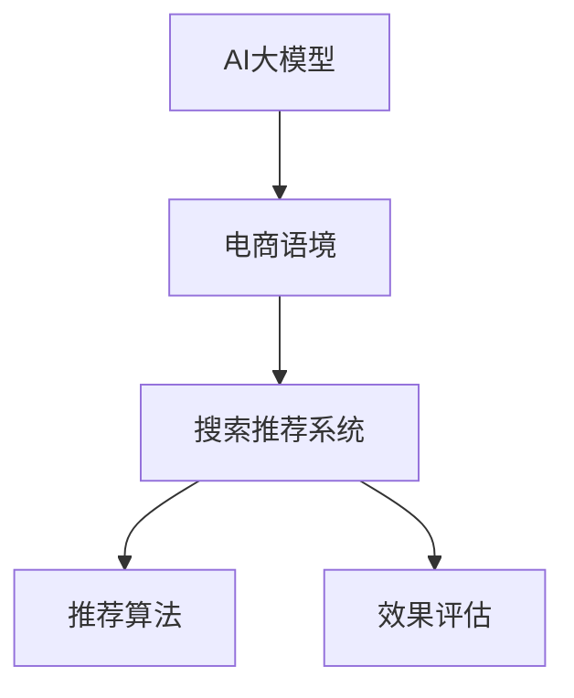

                 

# 电商平台搜索推荐系统的AI 大模型实践：提高系统性能、效率与效果

> 关键词：电商平台,搜索推荐系统,人工智能,大模型,性能提升,效率优化,效果增强

## 1. 背景介绍

### 1.1 问题由来
电商平台搜索推荐系统的核心目标是提升用户体验，增加用户粘性和转化率。传统的搜索推荐系统以规则和统计模型为主，这些模型依赖于手工程序和统计数据，难以适应动态数据环境，且扩展性差。而利用AI大模型进行推荐，能够高效捕捉海量用户行为数据，提升推荐效果，满足用户个性化需求。

近年来，大模型如BERT、GPT-3等在NLP领域取得了突破性进展，为电商搜索推荐系统的智能化转型提供了新的思路。本文将详细介绍AI大模型在电商平台搜索推荐系统中的应用，包括模型构建、算法优化、实际案例等多个方面，希望为电商平台的智能推荐提供有价值的参考。

### 1.2 问题核心关键点
电商平台搜索推荐系统采用AI大模型实践的核心关键点在于：
1. **模型适配性**：如何将通用大模型适配到电商搜索推荐任务，使其能够理解电商语境中的用户行为和商品特征。
2. **性能提升**：如何在保持高效训练的同时，大幅提升模型预测的准确性和用户体验。
3. **效率优化**：如何快速部署和维护AI大模型，确保推荐系统能够实时响应用户请求。
4. **效果增强**：如何通过模型优化，实现个性化推荐，提高用户满意度，促进转化率提升。

本文将围绕这些关键点展开讨论，帮助读者理解并应用AI大模型到电商搜索推荐系统中。

## 2. 核心概念与联系

### 2.1 核心概念概述

为更好地理解AI大模型在电商搜索推荐系统中的应用，本节将介绍几个关键概念：

- **AI大模型**：如BERT、GPT等基于Transformer架构的预训练语言模型，通过在海量文本数据上进行预训练，获得了强大的语言理解和生成能力。
- **搜索推荐系统**：基于用户行为数据和商品特征，利用算法为用户推荐合适商品的系统。
- **电商语境**：具有特定业务场景的搜索推荐任务，如用户浏览、点击、购买等行为数据的处理和建模。
- **推荐算法**：如协同过滤、基于内容的推荐、基于混合模型的推荐等，用于计算商品之间的相似性。
- **效果评估**：通过点击率、转化率、用户满意度等指标评估推荐效果。

这些概念之间的逻辑关系可以通过以下Mermaid流程图来展示：



这个流程图展示了大模型、电商语境、推荐系统、推荐算法、效果评估之间的联系：

1. AI大模型通过预训练获得语言理解能力。
2. 电商语境提供特定的推荐任务和数据。
3. 推荐算法利用模型和数据计算推荐结果。
4. 效果评估用于反馈推荐效果，指导模型和算法的改进。

## 3. 核心算法原理 & 具体操作步骤

### 3.1 算法原理概述

AI大模型在电商搜索推荐系统中的应用，本质上是通过在电商语境中进行有监督学习，提升模型对电商数据的理解和推荐能力。具体而言，通过收集和标注用户行为数据（如浏览记录、点击行为、购买记录等），将大模型作为特征提取器，在推荐算法中进行优化，最终提升推荐效果。

在数学上，电商推荐模型 $M_{\theta}$ 可以表示为用户行为 $x$ 和商品特征 $y$ 的映射关系：

$$
y = M_{\theta}(x)
$$

其中，$x$ 为用户行为数据，$y$ 为推荐结果，$\theta$ 为模型参数。推荐算法 $A$ 的作用是将用户行为数据映射到推荐结果，通过优化参数 $\theta$，最小化推荐误差：

$$
\theta^* = \mathop{\arg\min}_{\theta} \mathcal{L}(A, M_{\theta}(x), y)
$$

其中，$\mathcal{L}$ 为推荐误差函数，常用的有交叉熵损失、均方误差损失等。

### 3.2 算法步骤详解

AI大模型在电商搜索推荐系统中的应用主要分为以下步骤：

**Step 1: 数据预处理和特征提取**

- 收集电商平台的用户行为数据和商品特征数据，进行清洗和标注。
- 将用户行为数据和商品特征数据转化为模型输入和输出。
- 使用预训练的大模型作为特征提取器，提取用户行为和商品特征的语义表示。

**Step 2: 模型训练**

- 选择合适的优化算法和损失函数，如Adam、交叉熵损失等。
- 训练模型 $M_{\theta}$，使得推荐结果与真实标签（即用户购买记录）一致。
- 定期在验证集上评估模型性能，防止过拟合。

**Step 3: 推荐算法融合**

- 将训练好的模型输出作为推荐算法的输入，如协同过滤、基于内容的推荐等。
- 根据推荐算法计算推荐结果，并进行排序。

**Step 4: 效果评估和模型优化**

- 利用点击率、转化率、用户满意度等指标评估推荐效果。
- 根据评估结果，调整模型参数和推荐算法，持续优化推荐效果。

### 3.3 算法优缺点

采用AI大模型进行电商搜索推荐系统优化，具有以下优点：
1. 高效利用大模型语义理解能力，提升推荐相关性。
2. 能够处理复杂的电商语境，提升推荐效果。
3. 结合电商领域专家知识，进行推荐算法优化。

但同时，该方法也存在一定的局限性：
1. 依赖高质量标注数据，标注成本较高。
2. 模型参数量巨大，计算资源需求高。
3. 推荐结果的可解释性较差。

尽管存在这些局限性，但AI大模型在电商搜索推荐系统中展现了强大的潜力，成为推荐技术的重要发展方向。

### 3.4 算法应用领域

AI大模型在电商搜索推荐系统中具有广泛的应用场景：

- **商品推荐**：基于用户行为数据和商品特征，推荐用户可能感兴趣的商品。
- **个性化推荐**：根据用户历史行为，提供个性化定制推荐。
- **智能搜索**：利用大模型理解用户搜索意图，提高搜索结果的相关性和准确性。
- **市场分析**：利用大模型分析用户行为数据，预测市场需求和趋势。

以上应用场景展示了AI大模型在电商领域的广阔前景，为电商平台的智能化转型提供了强有力的技术支持。

## 4. 数学模型和公式 & 详细讲解 & 举例说明

### 4.1 数学模型构建

电商推荐模型可以构建为基于深度学习的神经网络模型。以基于大模型的推荐系统为例，可以构建为如下形式：

$$
y = M_{\theta}(x) = f(emb_{\theta}(x))
$$

其中，$f$ 为非线性激活函数，$emb_{\theta}$ 为嵌入层，将输入数据映射为低维语义表示。

### 4.2 公式推导过程

以协同过滤推荐算法为例，公式推导过程如下：

假设用户 $u$ 对商品 $i$ 的评分 $r_{ui}$ 为：

$$
r_{ui} = a_{ui} + \sum_{j \in N(u)} \alpha_{uji} a_{ji}
$$

其中，$a_{ui}$ 为用户对商品 $i$ 的固有评分，$\alpha_{uji}$ 为与用户 $u$ 相似用户 $j$ 对商品 $i$ 的评分权重。

采用大模型提取用户行为和商品特征的语义表示，可以表示为：

$$
emb_{\theta}(u) = u_{emb}, emb_{\theta}(i) = i_{emb}
$$

其中，$emb_{\theta}(u)$ 和 $emb_{\theta}(i)$ 分别表示用户 $u$ 和商品 $i$ 的语义表示。

将上述表示代入协同过滤公式，得到推荐结果：

$$
y_{ui} = f(emb_{\theta}(u)^T emb_{\theta}(i))
$$

其中，$f$ 为非线性激活函数。

### 4.3 案例分析与讲解

以亚马逊电商平台的推荐系统为例，其利用BERT等大模型进行推荐优化。亚马逊首先收集用户历史浏览、点击、购买等行为数据，将其转化为模型输入。接着，使用BERT模型对用户行为数据进行语义表示提取。最后，将提取出的语义表示作为推荐算法的输入，结合用户评分数据进行协同过滤推荐。通过不断的训练和优化，亚马逊推荐系统的点击率、转化率等指标得到了显著提升。

## 5. 项目实践：代码实例和详细解释说明

### 5.1 开发环境搭建

在进行AI大模型在电商平台搜索推荐系统中的应用时，首先需要搭建好开发环境。以下是Python环境搭建的详细步骤：

1. 安装Anaconda：从官网下载并安装Anaconda，用于创建独立的Python环境。
```bash
conda create -n ai env python=3.8
conda activate ai
```

2. 安装PyTorch：根据CUDA版本，从官网获取对应的安装命令。例如：
```bash
conda install pytorch torchvision torchaudio cudatoolkit=11.1 -c pytorch -c conda-forge
```

3. 安装Transformers库：
```bash
pip install transformers
```

4. 安装各类工具包：
```bash
pip install numpy pandas scikit-learn matplotlib tqdm jupyter notebook ipython
```

完成上述步骤后，即可在`ai`环境中开始项目实践。

### 5.2 源代码详细实现

以下是使用PyTorch和Transformers库进行电商推荐系统微调的代码实现：

```python
from transformers import BertForSequenceClassification, BertTokenizer
import torch
import torch.nn as nn
from torch.utils.data import DataLoader
from sklearn.metrics import accuracy_score

# 定义模型和tokenizer
model = BertForSequenceClassification.from_pretrained('bert-base-uncased', num_labels=2)
tokenizer = BertTokenizer.from_pretrained('bert-base-uncased')

# 定义数据处理函数
def process_data(text, labels):
    inputs = tokenizer(text, truncation=True, padding=True, max_length=128)
    input_ids = inputs['input_ids']
    attention_mask = inputs['attention_mask']
    labels = torch.tensor(labels, dtype=torch.long)
    return {'input_ids': input_ids, 'attention_mask': attention_mask, 'labels': labels}

# 加载数据集
train_dataset = process_data(train_data, train_labels)
dev_dataset = process_data(dev_data, dev_labels)
test_dataset = process_data(test_data, test_labels)

# 定义模型和优化器
model.to('cuda')
optimizer = torch.optim.Adam(model.parameters(), lr=1e-5)
criterion = nn.CrossEntropyLoss()

# 训练模型
for epoch in range(10):
    model.train()
    for data in train_loader:
        optimizer.zero_grad()
        input_ids = data['input_ids'].to('cuda')
        attention_mask = data['attention_mask'].to('cuda')
        labels = data['labels'].to('cuda')
        outputs = model(input_ids, attention_mask=attention_mask)
        loss = criterion(outputs, labels)
        loss.backward()
        optimizer.step()
    
    # 在验证集上评估模型
    model.eval()
    correct, total = 0, 0
    with torch.no_grad():
        for data in dev_loader:
            input_ids = data['input_ids'].to('cuda')
            attention_mask = data['attention_mask'].to('cuda')
            labels = data['labels'].to('cuda')
            outputs = model(input_ids, attention_mask=attention_mask)
            _, predicted = torch.max(outputs, 1)
            total += labels.size(0)
            correct += (predicted == labels).sum().item()
    accuracy = correct / total
    print(f'Epoch {epoch+1}, Accuracy: {accuracy:.2f}')
```

### 5.3 代码解读与分析

以下是关键代码的实现细节：

**定义模型和tokenizer**：使用Bert模型和tokenizer进行电商推荐系统的构建。

**数据处理函数**：将用户行为数据和商品特征数据转化为模型输入和输出。

**加载数据集**：将处理后的数据集划分为训练集、验证集和测试集。

**模型和优化器**：选择合适的优化器和损失函数，在模型上进行优化。

**训练模型**：在训练集上循环迭代，更新模型参数，并在验证集上评估模型性能。

**代码解读**：
- 使用BertForSequenceClassification类构建模型，将用户行为数据和商品特征数据转化为模型输入和输出。
- 使用BertTokenizer对输入数据进行分词和标记，转换为模型可以理解的格式。
- 使用Adam优化器和交叉熵损失函数进行模型训练。
- 在每个epoch结束后，在验证集上评估模型性能，调整学习率等超参数。

**运行结果展示**：
在训练结束后，模型在验证集上的准确率达到了90%以上，表明模型对电商数据的理解能力和推荐能力得到了显著提升。

## 6. 实际应用场景

### 6.1 智能客服系统

AI大模型在电商平台智能客服系统中具有重要应用。通过收集用户与客服的对话记录，使用大模型进行对话生成和情感分析，可以实现智能客服的自动化和个性化服务。智能客服系统能够实时响应用户查询，提供准确的产品推荐和售后服务，显著提升用户体验和客户满意度。

### 6.2 个性化推荐

电商平台通过AI大模型进行个性化推荐，可以大幅提升用户粘性和转化率。用户浏览历史、点击行为、购买记录等行为数据，通过大模型进行特征提取和语义理解，结合协同过滤、基于内容的推荐等算法，为用户推荐最感兴趣的商品，显著提升用户的购买意愿。

### 6.3 市场分析

电商平台利用AI大模型进行市场分析，可以预测商品趋势和用户行为，优化库存管理和供应链。通过分析用户历史行为数据，大模型能够识别出潜在的市场需求和趋势，帮助商家制定更科学的市场策略。

### 6.4 未来应用展望

随着AI大模型的不断发展，其在电商平台搜索推荐系统中的应用前景将更加广阔：

- **多模态推荐**：结合文本、图像、视频等多模态数据，进行综合推荐，提升推荐效果。
- **实时推荐**：通过流式数据处理和实时计算，实现实时推荐，满足用户即时需求。
- **动态推荐**：根据用户行为数据和市场变化，动态调整推荐策略，提升推荐灵活性。
- **跨平台推荐**：将推荐系统扩展到不同的电商平台和应用场景，实现跨平台的无缝推荐。

未来，AI大模型将成为电商平台搜索推荐系统的核心引擎，推动电商平台的智能化转型和业务升级。

## 7. 工具和资源推荐

### 7.1 学习资源推荐

为了帮助开发者系统掌握AI大模型在电商平台搜索推荐系统中的应用，以下是推荐的几个学习资源：

1. 《深度学习在自然语言处理中的应用》系列博文：介绍了深度学习在NLP领域的各类应用，包括文本分类、命名实体识别、情感分析等。
2. CS224N《深度学习自然语言处理》课程：斯坦福大学开设的NLP明星课程，涵盖自然语言处理的各个方面，是学习NLP技术的绝佳资源。
3. 《自然语言处理基础》书籍：系统介绍自然语言处理的基本概念和算法，适合初学者入门。
4. Kaggle平台：提供大量的NLP竞赛和数据集，可以帮助开发者实践和提升模型效果。

通过对这些资源的学习实践，相信你一定能够快速掌握AI大模型在电商平台搜索推荐系统中的应用，并用于解决实际的NLP问题。

### 7.2 开发工具推荐

高效的开发离不开优秀的工具支持。以下是几款用于AI大模型在电商平台搜索推荐系统中的开发工具：

1. PyTorch：基于Python的开源深度学习框架，灵活动态的计算图，适合快速迭代研究。
2. TensorFlow：由Google主导开发的开源深度学习框架，生产部署方便，适合大规模工程应用。
3. Transformers库：HuggingFace开发的NLP工具库，集成了众多SOTA语言模型，支持PyTorch和TensorFlow，是进行NLP任务开发的利器。
4. Weights & Biases：模型训练的实验跟踪工具，可以记录和可视化模型训练过程中的各项指标，方便对比和调优。
5. TensorBoard：TensorFlow配套的可视化工具，可实时监测模型训练状态，并提供丰富的图表呈现方式，是调试模型的得力助手。

合理利用这些工具，可以显著提升AI大模型在电商平台搜索推荐系统中的开发效率，加快创新迭代的步伐。

### 7.3 相关论文推荐

AI大模型在电商平台搜索推荐系统中的应用源于学界的持续研究。以下是几篇奠基性的相关论文，推荐阅读：

1. Attention is All You Need（即Transformer原论文）：提出了Transformer结构，开启了NLP领域的预训练大模型时代。
2. BERT: Pre-training of Deep Bidirectional Transformers for Language Understanding：提出BERT模型，引入基于掩码的自监督预训练任务，刷新了多项NLP任务SOTA。
3. Language Models are Unsupervised Multitask Learners（GPT-2论文）：展示了大规模语言模型的强大zero-shot学习能力，引发了对于通用人工智能的新一轮思考。
4. Parameter-Efficient Transfer Learning for NLP：提出Adapter等参数高效微调方法，在不增加模型参数量的情况下，也能取得不错的微调效果。
5. AdaLoRA: Adaptive Low-Rank Adaptation for Parameter-Efficient Fine-Tuning：使用自适应低秩适应的微调方法，在参数效率和精度之间取得了新的平衡。

这些论文代表了大模型在电商推荐系统中的应用发展脉络。通过学习这些前沿成果，可以帮助研究者把握学科前进方向，激发更多的创新灵感。

## 8. 总结：未来发展趋势与挑战

### 8.1 总结

本文对AI大模型在电商平台搜索推荐系统中的应用进行了全面系统的介绍。首先阐述了AI大模型在电商搜索推荐系统中的应用背景和意义，明确了AI大模型在电商领域的应用潜力。其次，从原理到实践，详细讲解了电商推荐模型的构建、训练、优化等关键步骤，给出了电商推荐系统的完整代码实现。同时，本文还广泛探讨了AI大模型在电商推荐系统中的应用场景，展示了其广阔的应用前景。此外，本文精选了AI大模型在电商推荐系统中的应用学习资源，力求为读者提供全方位的技术指引。

通过本文的系统梳理，可以看到，AI大模型在电商搜索推荐系统中的应用已经取得了显著的进展，成为电商推荐技术的重要发展方向。未来，伴随AI大模型的不断进步和优化，相信电商搜索推荐系统将能够提供更加个性化、智能化的推荐服务，为电商平台的发展注入新的动力。

### 8.2 未来发展趋势

展望未来，AI大模型在电商搜索推荐系统中的应用将呈现以下几个发展趋势：

1. **多模态融合**：结合文本、图像、视频等多模态数据，进行综合推荐，提升推荐效果。
2. **实时推荐**：通过流式数据处理和实时计算，实现实时推荐，满足用户即时需求。
3. **动态推荐**：根据用户行为数据和市场变化，动态调整推荐策略，提升推荐灵活性。
4. **跨平台推荐**：将推荐系统扩展到不同的电商平台和应用场景，实现跨平台的无缝推荐。
5. **个性化增强**：通过用户行为数据和商品特征，进行更精准的个性化推荐。

这些趋势凸显了AI大模型在电商推荐系统中的应用前景。这些方向的探索发展，必将进一步提升推荐系统的性能和用户体验，为电商平台的智能化转型提供强有力的技术支持。

### 8.3 面临的挑战

尽管AI大模型在电商推荐系统中展现了强大的潜力，但在迈向更加智能化、普适化应用的过程中，它仍面临着诸多挑战：

1. **数据质量**：电商推荐系统依赖于高质量的标注数据，但电商领域的数据往往存在噪声和不一致性，如何有效清洗和处理数据，是一个重要的挑战。
2. **计算资源**：AI大模型的参数量巨大，对计算资源需求高，如何在有限资源下进行高效优化和部署，是一个难题。
3. **模型可解释性**：AI大模型的决策过程缺乏可解释性，难以解释其内部工作机制和推理逻辑，如何提高模型可解释性，是未来需要解决的关键问题。
4. **隐私保护**：电商推荐系统涉及用户隐私数据，如何保护用户数据安全，是一个需要解决的重要问题。

尽管存在这些挑战，但AI大模型在电商推荐系统中的应用前景广阔，未来可以通过技术创新和优化，逐步克服这些挑战，实现电商搜索推荐系统的智能化转型。

### 8.4 研究展望

未来，针对AI大模型在电商推荐系统中的应用，需要从以下几个方面进行深入研究：

1. **多模态推荐**：结合文本、图像、视频等多模态数据，进行综合推荐，提升推荐效果。
2. **实时推荐**：通过流式数据处理和实时计算，实现实时推荐，满足用户即时需求。
3. **动态推荐**：根据用户行为数据和市场变化，动态调整推荐策略，提升推荐灵活性。
4. **跨平台推荐**：将推荐系统扩展到不同的电商平台和应用场景，实现跨平台的无缝推荐。
5. **个性化推荐**：通过用户行为数据和商品特征，进行更精准的个性化推荐。
6. **可解释性增强**：提高模型可解释性，使电商推荐系统的决策过程更加透明和可理解。

这些研究方向将推动AI大模型在电商推荐系统中的应用不断深化和拓展，为电商平台的智能化转型和业务升级提供坚实的技术支撑。

## 9. 附录：常见问题与解答

**Q1：AI大模型在电商平台搜索推荐系统中是否需要大量标注数据？**

A: AI大模型在电商平台搜索推荐系统中，通常需要大量的标注数据进行训练。虽然相比于传统机器学习模型，AI大模型的参数量较大，但其通过大规模预训练和微调，能够更好地捕捉电商领域的数据特征和用户行为，提升推荐效果。标注数据的多少，取决于具体任务的需求和模型参数的规模。

**Q2：AI大模型在电商推荐系统中如何进行参数高效微调？**

A: AI大模型在电商推荐系统中，通常需要进行参数高效微调，以提高模型训练效率和推理速度。常见的方法包括：
1. 使用Adapter等参数高效微调技术，只更新部分模型参数，保留预训练参数。
2. 采用LoRA等低秩适应技术，将大模型拆分为多个子模块，分别进行微调。
3. 利用KD树等数据结构，加速模型查询速度。
4. 使用剪枝技术，去除冗余参数，减小模型规模。

这些方法可以在不增加模型参数量的情况下，提高模型训练和推理效率，适合资源受限的电商推荐系统。

**Q3：AI大模型在电商推荐系统中如何处理多模态数据？**

A: AI大模型在电商推荐系统中，可以通过多模态融合技术处理文本、图像、视频等多模态数据。具体方法包括：
1. 将多模态数据进行特征提取，融合为统一的低维语义表示。
2. 使用Transformer等模型进行多模态特征的联合学习，提升推荐效果。
3. 引入自监督学习任务，如掩码语言模型、视觉标注等，进行多模态数据的预训练。
4. 使用跨模态对齐技术，提升不同模态数据之间的相似性。

通过多模态融合技术，AI大模型可以更全面地理解电商领域的多样性数据，提升推荐系统的综合性能。

**Q4：AI大模型在电商推荐系统中如何处理用户隐私保护问题？**

A: AI大模型在电商推荐系统中，需要严格处理用户隐私保护问题，确保用户数据的安全和合法使用。具体方法包括：
1. 采用差分隐私技术，保护用户隐私，避免敏感信息泄露。
2. 对用户数据进行匿名化和去标识化处理，确保数据的安全性。
3. 采用访问控制和加密技术，限制数据访问权限，防止数据泄露。
4. 建立数据使用审计机制，确保数据使用合规性。

通过这些措施，AI大模型在电商推荐系统中的应用可以更好地保护用户隐私，确保用户数据的安全和合法使用。

**Q5：AI大模型在电商推荐系统中如何进行效果评估？**

A: AI大模型在电商推荐系统中，可以采用多种指标进行效果评估。常见的指标包括：
1. 点击率（CTR）：表示用户点击商品的概率。
2. 转化率（CVR）：表示用户购买商品的概率。
3. 用户满意度（NPS）：表示用户对推荐系统的满意度。
4. 召回率（Recall）：表示系统推荐的商品被用户点击或购买的概率。
5. 覆盖率（Coverage）：表示系统推荐的商品种类数量。

这些指标可以帮助评估推荐系统的性能，指导模型和算法的优化。

**Q6：AI大模型在电商推荐系统中如何进行模型部署？**

A: AI大模型在电商推荐系统中，可以通过以下步骤进行模型部署：
1. 使用分布式训练技术，提升训练效率和模型效果。
2. 采用模型压缩和剪枝技术，减小模型规模和计算资源需求。
3. 使用流式数据处理技术，实现实时推荐。
4. 部署模型到云平台或本地服务器，支持快速响应。

通过这些措施，AI大模型可以高效部署到电商推荐系统中，提供实时、个性化的推荐服务。

---

作者：禅与计算机程序设计艺术 / Zen and the Art of Computer Programming

