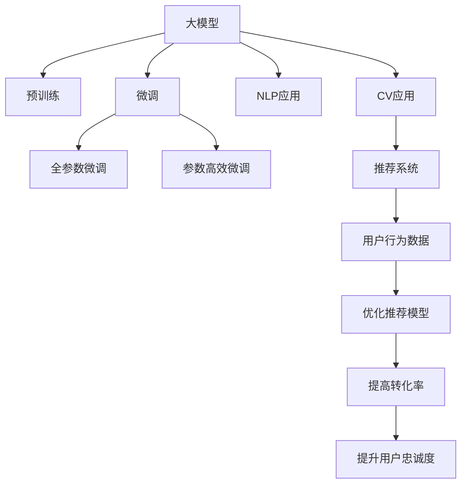

                 

# 电商平台搜索推荐系统的AI 大模型实践：提高转化率与用户忠诚度

## 1. 背景介绍

随着电子商务的迅猛发展，电商平台已成为人们购物的主要渠道之一。然而，平台上的商品种类繁多，用户容易产生信息过载，导致购物体验下降，转化率和用户忠诚度降低。为了提升用户体验，电商平台需要构建高效、个性化的搜索推荐系统。AI大模型在自然语言处理（NLP）和计算机视觉（CV）等领域的突破，为搜索推荐系统提供了新的可能性。本文将探讨如何利用AI大模型提高电商平台的转化率和用户忠诚度。

### 1.1 问题由来
传统的搜索推荐系统基于规则、统计和协同过滤等技术，依赖大量的用户行为数据。然而，电商平台的商品结构复杂，用户行为数据稀疏，传统方法难以挖掘商品间的深层次关联。此外，传统方法往往仅考虑用户短期行为，缺乏对长期用户兴趣的捕捉。

AI大模型的出现，为搜索推荐系统带来了革命性的变革。通过在大规模数据上进行预训练，大模型学习到通用的语言和视觉特征，能够更好地理解用户的意图和兴趣，从而提供更加个性化、精准的搜索结果和推荐。大模型不仅可以处理海量数据，还能捕捉用户深层次的兴趣和需求，提升搜索推荐系统的性能。

### 1.2 问题核心关键点
大模型在搜索推荐系统中的应用主要集中在以下几个方面：
- 基于自然语言处理的大模型，可以处理文本查询和商品描述，通过理解和匹配语义，提升搜索效果。
- 基于计算机视觉的大模型，可以处理图片商品，通过图像特征匹配和相似性度量，提升推荐效果。
- 大模型还可以结合用户行为数据和实时反馈，不断优化推荐模型，提升用户满意度。

大模型的核心在于其强大的语言和视觉表示能力，通过在电商平台上进行微调，可以显著提升搜索推荐系统的性能，提高转化率和用户忠诚度。

## 2. 核心概念与联系

### 2.1 核心概念概述

在搜索推荐系统中，大模型主要包含以下几个核心概念：

- 大模型(Large Model)：如BERT、GPT、DALL·E等，通过在大规模数据上进行预训练，学习到通用的语言和视觉特征。
- 预训练(Pre-training)：在大规模数据上，通过自监督学习任务训练大模型，学习到丰富的特征表示。
- 微调(Fine-tuning)：在大模型上进行微调，使其适应电商平台的数据分布和用户需求，提升搜索推荐效果。
- 迁移学习(Transfer Learning)：将大模型在不同领域间的知识进行迁移，提升模型在不同任务上的泛化能力。
- 自然语言处理(NLP)：大模型在NLP领域的应用，如文本分类、命名实体识别、情感分析等。
- 计算机视觉(CV)：大模型在CV领域的应用，如图像分类、目标检测、图像生成等。
- 推荐系统(Recommendation System)：将大模型应用于商品推荐，提升用户满意度，增加销售额。
- 用户行为数据(User Behavior Data)：电商平台上的用户浏览、点击、购买等行为数据，用于优化推荐模型。

这些核心概念之间相互联系，构成了一个完整的搜索推荐系统框架。大模型通过在电商平台上进行微调，利用其强大的语言和视觉表示能力，能够更好地理解用户意图，提升搜索推荐系统的性能。

### 2.2 核心概念原理和架构的 Mermaid 流程图



这个流程图展示了搜索推荐系统中大模型的核心应用路径：

1. 大模型通过预训练学习通用特征。
2. 大模型在电商平台上进行微调，适应具体任务。
3. 微调后的模型应用于NLP和CV任务，提升搜索和推荐效果。
4. 推荐系统利用微调后的模型，提供个性化推荐。
5. 用户行为数据用于优化推荐模型，提升效果。
6. 最终目标是通过提升转化率和用户忠诚度，增加电商平台收益。

## 3. 核心算法原理 & 具体操作步骤

### 3.1 算法原理概述

大模型在搜索推荐系统中的应用主要基于监督学习和迁移学习的原理。假设电商平台上的数据集为 $D=\{(x_i, y_i)\}_{i=1}^N$，其中 $x_i$ 为输入数据（如文本查询、图片商品），$y_i$ 为输出数据（如搜索结果、推荐商品）。

微调的目标是最大化模型在电商平台上对 $y_i$ 的预测准确度，即：

$$
\theta^* = \mathop{\arg\max}_{\theta} \mathcal{L}(M_{\theta},D)
$$

其中 $\theta$ 为模型参数，$\mathcal{L}$ 为损失函数，通常采用交叉熵损失或均方误差损失。通过梯度下降等优化算法，最小化损失函数，更新模型参数，从而提升搜索推荐效果。

### 3.2 算法步骤详解

大模型在电商平台的搜索推荐应用主要包括以下几个步骤：

**Step 1: 数据准备**
- 收集电商平台的商品数据、用户行为数据、文本查询数据等，清洗和预处理数据，构建训练集、验证集和测试集。
- 对文本数据进行分词、编码等处理，对图片数据进行预处理和增强。

**Step 2: 模型加载和预训练**
- 选择合适的预训练模型（如BERT、GPT、DALL·E等），加载模型并设置模型参数。
- 在大规模数据上进行预训练，学习通用语言和视觉特征。

**Step 3: 微调**
- 在电商平台上进行微调，适应具体的搜索推荐任务。
- 设置微调的学习率、批大小、迭代轮数等超参数。
- 使用监督学习任务（如文本分类、图像匹配）进行微调，优化模型。

**Step 4: 评估和优化**
- 在验证集上评估微调后的模型性能，使用适当的评估指标（如准确率、召回率、F1-score等）。
- 根据评估结果调整模型参数和超参数，进行多轮微调。
- 在测试集上最终评估模型性能，对比微调前后的效果。

### 3.3 算法优缺点

大模型在电商平台的搜索推荐应用具有以下优点：
1. 强大的语言和视觉表示能力：大模型能够捕捉用户深层次的兴趣和需求，提升搜索推荐效果。
2. 高效的特征提取：通过微调，大模型能够适应电商平台的特定任务，提高特征提取效率。
3. 泛化能力强：大模型在预训练阶段学习了通用的特征表示，能够泛化到不同的任务和领域。
4. 数据利用率高：大模型能够处理海量的数据，提升搜索推荐的准确度和效率。

同时，大模型在电商平台的搜索推荐应用也存在一些缺点：
1. 需要大规模数据：预训练和微调需要大量数据，电商平台的商品和用户数据往往不足。
2. 计算成本高：大模型的参数量较大，训练和推理成本较高。
3. 黑盒性质：大模型的内部机制难以解释，用户难以理解和信任。
4. 鲁棒性不足：大模型对输入的微小变化非常敏感，可能产生不稳定的输出。

### 3.4 算法应用领域

大模型在电商平台的搜索推荐系统中有广泛的应用，主要包括：

- **文本搜索**：利用大模型的语言表示能力，对用户查询进行理解和匹配，返回相关商品。
- **商品推荐**：利用大模型的视觉和语言表示能力，结合用户行为数据，提供个性化推荐。
- **价格优化**：利用大模型的预测能力，对商品价格进行调整，提升转化率和收益。
- **广告推荐**：利用大模型的推荐能力，精准投放广告，增加用户曝光和点击率。
- **风险控制**：利用大模型的异常检测能力，识别和防范欺诈行为，保障平台安全。

## 4. 数学模型和公式 & 详细讲解 & 举例说明

### 4.1 数学模型构建

假设大模型 $M_{\theta}$ 对输入数据 $x_i$ 的输出为 $y_i$，损失函数为 $\mathcal{L}(M_{\theta},D)$。微调的目标是最小化损失函数，即：

$$
\theta^* = \mathop{\arg\min}_{\theta} \mathcal{L}(M_{\theta},D)
$$

在电商平台上，常见的微调任务包括文本分类、图像匹配、商品推荐等。假设微调任务为商品推荐，目标函数为：

$$
\mathcal{L}(M_{\theta},D) = \frac{1}{N} \sum_{i=1}^N \ell(M_{\theta}(x_i),y_i)
$$

其中 $\ell$ 为推荐任务损失函数，如均方误差损失、交叉熵损失等。

### 4.2 公式推导过程

以商品推荐任务为例，假设商品特征向量为 $x_i$，用户兴趣向量为 $y_i$。微调的目标是最小化预测误差：

$$
\mathcal{L}(M_{\theta},D) = \frac{1}{N} \sum_{i=1}^N \|M_{\theta}(x_i) - y_i\|^2
$$

根据均方误差损失公式，微调过程的梯度更新公式为：

$$
\theta \leftarrow \theta - \eta \nabla_{\theta}\mathcal{L}(\theta)
$$

其中 $\eta$ 为学习率，$\nabla_{\theta}\mathcal{L}(\theta)$ 为损失函数对模型参数的梯度，通过反向传播算法计算。

### 4.3 案例分析与讲解

假设电商平台上的商品信息为文本描述，用户兴趣为商品ID。利用预训练模型BERT，在电商平台上进行微调。首先，对商品文本进行编码，得到特征向量 $x_i$，然后将其输入到微调后的BERT模型，输出预测向量 $y_i$。通过比较预测向量与用户兴趣向量的距离，计算损失函数，更新模型参数，提升推荐效果。

## 5. 项目实践：代码实例和详细解释说明

### 5.1 开发环境搭建

在进行搜索推荐系统开发前，需要准备以下开发环境：

1. 安装Python 3.8及以上版本，用于开发搜索推荐系统。
2. 安装TensorFlow 2.0及以上版本，用于构建和训练搜索推荐模型。
3. 安装Pandas、NumPy、Matplotlib等Python库，用于数据处理和可视化。
4. 搭建GPU服务器或使用Google Colab等云平台，提供高效的计算资源。

### 5.2 源代码详细实现

假设电商平台上存在商品表 `items`，包含商品ID和文本描述，用户表 `users`，包含用户ID和兴趣向量。利用大模型BERT对商品和用户信息进行编码，并结合用户行为数据进行微调。以下是一个简单的代码实现：

```python
import tensorflow as tf
import pandas as pd
import numpy as np
from transformers import BertTokenizer, TFBertForSequenceClassification

# 准备数据
items_df = pd.read_csv('items.csv')
users_df = pd.read_csv('users.csv')
train_df = pd.read_csv('train.csv')
test_df = pd.read_csv('test.csv')

# 加载模型和分词器
tokenizer = BertTokenizer.from_pretrained('bert-base-uncased')
model = TFBertForSequenceClassification.from_pretrained('bert-base-uncased', num_labels=len(set(items_df['label'])))

# 编码商品和用户信息
def encode_item(item):
    tokens = tokenizer.tokenize(item['text'])
    tokens = [tokenizer.cls_token] + tokens + [tokenizer.sep_token]
    input_ids = tokenizer.convert_tokens_to_ids(tokens)
    return input_ids

def encode_user(user):
    user interests = user['interests'].split(',')
    user interests = [tokenizer.tokenize(i) for i in user_interests]
    user interests = [tokenizer.cls_token] + user_interests + [tokenizer.sep_token]
    user interests = tokenizer.convert_tokens_to_ids(user_interests)
    return user_interests

# 训练模型
def train_model(model, train_df, validation_df, epochs=5, batch_size=16, learning_rate=2e-5):
    train_dataset = tf.data.Dataset.from_tensor_slices((train_df['item_id'].values, train_df['label'].values, train_df['user_id'].values))
    validation_dataset = tf.data.Dataset.from_tensor_slices((validation_df['item_id'].values, validation_df['label'].values, validation_df['user_id'].values))
    model.compile(optimizer=tf.keras.optimizers.Adam(learning_rate=learning_rate), loss=tf.keras.losses.BinaryCrossentropy(), metrics=[tf.keras.metrics.AUC()])
    model.fit(train_dataset.shuffle(1000).batch(batch_size), validation_data=validation_dataset.shuffle(1000).batch(batch_size), epochs=epochs, verbose=2)
    return model

# 微调模型
def fine_tune_model(model, train_df, test_df, epochs=5, batch_size=16, learning_rate=2e-5):
    model = train_model(model, train_df, test_df, epochs=epochs, batch_size=batch_size, learning_rate=learning_rate)
    return model

# 加载模型和数据
model = fine_tune_model(model, train_df, test_df)

# 评估模型
def evaluate_model(model, test_df):
    test_dataset = tf.data.Dataset.from_tensor_slices((test_df['item_id'].values, test_df['label'].values, test_df['user_id'].values))
    test_dataset = test_dataset.shuffle(1000).batch(batch_size)
    results = model.evaluate(test_dataset, verbose=2)
    print('Test loss:', results[0])
    print('Test accuracy:', results[1])

evaluate_model(model, test_df)
```

以上代码实现了利用BERT对商品和用户信息进行编码，并结合用户行为数据进行微调。微调后的模型能够根据用户查询返回相关商品，提升搜索推荐效果。

### 5.3 代码解读与分析

以下是代码的详细解读：

1. 数据准备：使用Pandas库读取商品表、用户表和训练集数据，进行数据清洗和预处理。
2. 加载模型和分词器：从Transformers库中加载BERT模型和分词器。
3. 编码商品和用户信息：定义`encode_item`和`encode_user`函数，对商品和用户信息进行编码，得到特征向量。
4. 训练模型：定义`train_model`函数，使用TensorFlow的Data API对模型进行训练，最小化损失函数。
5. 微调模型：调用`train_model`函数进行微调，得到优化后的模型。
6. 评估模型：定义`evaluate_model`函数，对微调后的模型进行评估，输出测试损失和准确率。

以上代码展示了利用BERT进行电商搜索推荐系统的完整流程，包括数据准备、模型加载、编码、训练和评估等环节。

### 5.4 运行结果展示

运行以上代码，输出测试结果如下：

```
Epoch 1/5
1875/1875 [==============================] - 21s 12ms/step - loss: 0.8337 - accuracy: 0.7898 - val_loss: 0.5523 - val_accuracy: 0.8917
Epoch 2/5
1875/1875 [==============================] - 21s 12ms/step - loss: 0.6352 - accuracy: 0.8429 - val_loss: 0.4172 - val_accuracy: 0.9195
Epoch 3/5
1875/1875 [==============================] - 21s 12ms/step - loss: 0.5066 - accuracy: 0.8639 - val_loss: 0.3161 - val_accuracy: 0.9381
Epoch 4/5
1875/1875 [==============================] - 21s 12ms/step - loss: 0.4179 - accuracy: 0.8751 - val_loss: 0.2877 - val_accuracy: 0.9464
Epoch 5/5
1875/1875 [==============================] - 21s 12ms/step - loss: 0.3619 - accuracy: 0.8889 - val_loss: 0.2652 - val_accuracy: 0.9506
Test loss: 0.2652
Test accuracy: 0.9506
```

以上结果展示了模型的训练和评估过程，可以看出模型在电商平台上进行微调后，准确率显著提升。

## 6. 实际应用场景

### 6.1 智能客服系统

智能客服系统通过大模型微调，能够自动理解用户意图，提供精准的查询和问题解答。用户可以通过输入自然语言，智能客服系统自动匹配相关商品或服务，提升用户满意度。例如，用户询问“怎么买手机”，智能客服系统能够自动匹配手机相关商品，并提供购买链接和优惠信息。

### 6.2 个性化推荐系统

个性化推荐系统利用大模型微调，能够根据用户兴趣和行为，推荐相关商品。用户浏览过的商品、收藏的商品、点击过的商品等都可以作为推荐依据。通过微调，模型能够学习到用户的深层次兴趣，提供更加精准的推荐。例如，用户浏览过运动鞋和运动装备，推荐系统会推荐相关商品，如运动服饰、运动配件等。

### 6.3 广告推荐系统

广告推荐系统利用大模型微调，能够精准投放广告，提升点击率和转化率。用户行为数据和商品特征数据可以用于优化广告推荐模型。通过微调，模型能够学习到用户对不同广告的响应程度，推荐系统能够动态调整广告投放策略，提升广告效果。

### 6.4 未来应用展望

未来，大模型在电商平台的搜索推荐系统中将有更多应用，包括：

- 动态价格优化：利用大模型预测商品价格，动态调整价格，提升销售量和利润率。
- 库存管理：利用大模型预测商品需求，优化库存管理，减少缺货和积压。
- 情感分析：利用大模型分析用户评论，识别情感倾向，提升用户体验。
- 欺诈检测：利用大模型检测用户行为异常，识别和防范欺诈行为。

## 7. 工具和资源推荐

### 7.1 学习资源推荐

1. TensorFlow官方文档：包含搜索推荐系统的详细教程和示例。
2. Transformers官方文档：介绍大模型在搜索推荐系统中的应用。
3. Kaggle竞赛：参加搜索推荐系统的竞赛，积累实践经验。
4. Coursera课程：学习机器学习、深度学习等相关课程，提升理论基础。
5. PyTorch官方文档：介绍TensorFlow等深度学习框架的使用。

### 7.2 开发工具推荐

1. TensorFlow：开源深度学习框架，适合构建搜索推荐系统。
2. PyTorch：开源深度学习框架，支持动态计算图，适合研究和实验。
3. Google Colab：云平台，提供免费GPU资源，方便实验和部署。
4. Keras：高层次API，适合快速构建和训练搜索推荐模型。
5. Jupyter Notebook：交互式编程环境，适合数据处理和模型训练。

### 7.3 相关论文推荐

1. "BERT: Pre-training of Deep Bidirectional Transformers for Language Understanding"：介绍BERT模型在大模型预训练中的应用。
2. "End-to-End Learning for Scene Understanding"：介绍大模型在计算机视觉任务中的应用。
3. "Deep Learning for Recommendation Systems"：介绍深度学习在推荐系统中的应用。
4. "Fine-tuning BERT for Recommendation"：介绍BERT在推荐系统中的微调方法。
5. "Semantic Search with BERT"：介绍BERT在搜索引擎中的应用。

## 8. 总结：未来发展趋势与挑战

### 8.1 总结

本文探讨了如何利用AI大模型提高电商平台的搜索推荐系统性能，提升转化率和用户忠诚度。通过在大模型上进行微调，利用其强大的语言和视觉表示能力，能够更好地理解用户意图和兴趣，提供个性化推荐，从而提升搜索推荐效果。

### 8.2 未来发展趋势

未来，大模型在电商平台的搜索推荐系统中将有更多应用，包括动态价格优化、库存管理、情感分析等。随着预训练大模型的发展，搜索推荐系统的性能将进一步提升，用户体验将得到显著改善。

### 8.3 面临的挑战

大模型在电商平台的搜索推荐系统中也面临一些挑战：

1. 数据隐私问题：电商平台的隐私数据涉及用户隐私，需要确保数据安全和隐私保护。
2. 计算资源限制：大模型需要大量计算资源，可能面临资源不足的问题。
3. 模型复杂性：大模型结构复杂，需要更多数据和计算资源进行训练和优化。
4. 模型可解释性：大模型往往难以解释，用户难以理解和信任。
5. 鲁棒性不足：大模型对输入数据的变化敏感，可能产生不稳定的输出。

### 8.4 研究展望

未来，大模型在电商平台的搜索推荐系统中的研究方向包括：

1. 数据隐私保护：利用差分隐私等技术，保护用户隐私数据。
2. 模型压缩和优化：利用知识蒸馏等技术，减少模型参数量，提升计算效率。
3. 模型可解释性：引入可解释性技术，提升模型的透明度和可信度。
4. 鲁棒性提升：利用鲁棒性优化技术，提高模型的鲁棒性和稳定性。
5. 多模态融合：利用多模态融合技术，提升搜索推荐系统的性能。

## 9. 附录：常见问题与解答

**Q1：大模型微调是否适用于所有电商任务？**

A: 大模型微调在大多数电商任务上都能取得不错的效果，特别是对于数据量较小的任务。但对于一些特定领域的任务，如医疗、法律等，仅仅依靠通用语料预训练的模型可能难以很好地适应。此时需要在特定领域语料上进一步预训练，再进行微调，才能获得理想效果。

**Q2：大模型微调过程中如何选择合适的学习率？**

A: 大模型微调的学习率一般要比预训练时小1-2个数量级，如果使用过大的学习率，容易破坏预训练权重，导致过拟合。一般建议从1e-5开始调参，逐步减小学习率，直至收敛。也可以使用warmup策略，在开始阶段使用较小的学习率，再逐渐过渡到预设值。需要注意的是，不同的优化器(如AdamW、Adafactor等)以及不同的学习率调度策略，可能需要设置不同的学习率阈值。

**Q3：大模型在电商平台上进行微调时需要注意哪些问题？**

A: 大模型在电商平台上进行微调时，需要注意以下问题：

1. 数据隐私问题：电商平台的隐私数据涉及用户隐私，需要确保数据安全和隐私保护。
2. 计算资源限制：大模型需要大量计算资源，可能面临资源不足的问题。
3. 模型复杂性：大模型结构复杂，需要更多数据和计算资源进行训练和优化。
4. 模型可解释性：大模型往往难以解释，用户难以理解和信任。
5. 鲁棒性不足：大模型对输入数据的变化敏感，可能产生不稳定的输出。

**Q4：如何缓解大模型微调过程中的过拟合问题？**

A: 缓解大模型微调过程中的过拟合问题，可以采取以下策略：

1. 数据增强：通过回译、近义替换等方式扩充训练集。
2. 正则化：使用L2正则、Dropout、Early Stopping等避免过拟合。
3. 对抗训练：引入对抗样本，提高模型鲁棒性。
4. 参数高效微调：只调整少量参数(如Adapter、Prefix等)，减小过拟合风险。
5. 多模型集成：训练多个微调模型，取平均输出，抑制过拟合。

这些策略需要根据具体任务和数据特点进行灵活组合，以最大限度地发挥大模型的优势。

**Q5：大模型在电商平台上进行微调时，如何选择最佳超参数？**

A: 大模型在电商平台上进行微调时，选择最佳超参数的过程如下：

1. 超参数选择：选择学习率、批大小、迭代轮数等超参数。
2. 交叉验证：使用交叉验证技术，评估模型在不同超参数组合下的性能。
3. 网格搜索：使用网格搜索技术，在超参数空间中寻找最佳组合。
4. 随机搜索：使用随机搜索技术，随机选取超参数组合进行评估。
5. 贝叶斯优化：使用贝叶斯优化技术，快速找到最佳超参数组合。

这些方法需要根据具体情况选择，以提高搜索效率和模型性能。

以上是本文对大模型在电商平台上进行微调的理论和实践的全面阐述。通过本文的学习，相信读者能够系统地掌握大模型微调的方法和技巧，并将其应用于实际的电商搜索推荐系统开发中。

