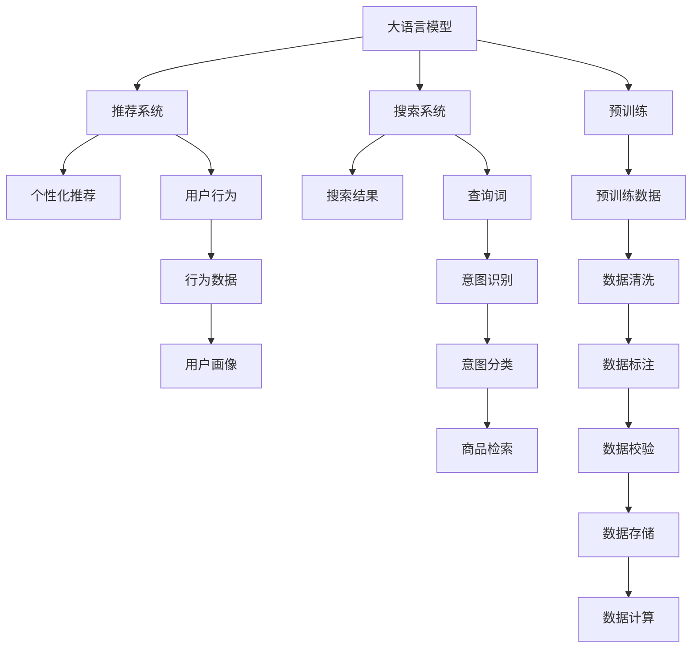

                 

# 电商平台的AI 大模型实践：搜索推荐系统是核心，数据质量控制与处理能力

## 1. 背景介绍

在现代电商平台上，AI技术的应用已经无所不在，从智能客服到广告投放，从物流优化到库存管理，AI技术正在推动整个电商平台向智能化方向飞速发展。然而，在这些AI应用中，最为核心的依然是搜索推荐系统。通过智能化的搜索推荐，电商平台能够为用户提供个性化的商品推荐，大幅提升用户体验和平台转化率。

大语言模型作为AI技术的最新进展，在电商平台的搜索推荐系统中也得到了广泛应用。例如，通过利用大语言模型进行语义理解，电商平台的搜索系统能够更好地理解和处理用户查询，返回更精准的搜索结果。而推荐系统则可以通过对用户行为的语义理解，实现更符合用户兴趣的个性化推荐，提高推荐的准确性和相关性。

尽管大语言模型在电商平台的搜索推荐系统中的应用取得了一定的成效，但其背后所面临的数据质量控制与处理能力挑战同样不容忽视。本文将从数据质量控制与处理能力的角度，探讨大语言模型在电商平台搜索推荐系统中的应用。

## 2. 核心概念与联系

### 2.1 核心概念概述

为更好地理解基于大语言模型的搜索推荐系统，本节将介绍几个密切相关的核心概念：

- 大语言模型(Large Language Model, LLM)：以自回归(如GPT)或自编码(如BERT)模型为代表的大规模预训练语言模型。通过在大规模无标签文本语料上进行预训练，学习通用的语言表示，具备强大的语言理解和生成能力。

- 推荐系统(Recommender System)：利用用户行为数据或商品特征数据，推荐用户可能感兴趣的商品的系统。其核心在于理解用户偏好和商品属性，构建用户-商品关联矩阵，实现个性化推荐。

- 搜索系统(Search System)：利用用户查询词，在商品库中查找符合用户需求的商品的系统。其核心在于理解用户查询意图，检索商品库，提供准确的搜索结果。

- 数据质量控制(Data Quality Control)：指通过一系列技术手段，确保数据准确性、完整性和一致性的过程。包括数据清洗、数据校验、数据标注等环节。

- 数据处理能力(Data Processing Capability)：指处理大规模、复杂数据的能力，包括数据采集、数据存储、数据计算等环节。数据处理能力直接影响系统性能和响应速度。

这些核心概念之间的逻辑关系可以通过以下Mermaid流程图来展示：



这个流程图展示了大语言模型与搜索推荐系统的主要交互路径：

1. 大语言模型通过预训练获得基础能力。
2. 预训练模型作为推荐系统和搜索系统的基础组件，被用于语义理解和意图识别。
3. 推荐系统通过分析用户行为数据，进行个性化推荐。
4. 搜索系统通过分析用户查询词，检索商品库，返回搜索结果。
5. 数据质量控制与处理能力贯穿于数据采集、存储、计算等各个环节。

## 3. 核心算法原理 & 具体操作步骤
### 3.1 算法原理概述

基于大语言模型的搜索推荐系统，本质上是一种基于机器学习的推荐模型。其核心思想是：利用用户行为数据或商品特征数据，构建用户-商品关联矩阵，通过训练模型预测用户对商品的兴趣，从而实现个性化推荐。

具体而言，搜索推荐系统一般包括以下几个关键步骤：

- 数据采集：从用户行为数据、商品标签、商品描述等多个来源采集数据。
- 数据预处理：对采集到的数据进行清洗、去重、补全等预处理操作，确保数据质量。
- 特征工程：将原始数据转化为模型能够理解的形式，包括特征选择、特征提取等环节。
- 模型训练：利用大语言模型作为基础组件，训练推荐模型，学习用户偏好和商品属性。
- 推荐输出：根据用户查询词或用户画像，通过模型预测，生成推荐结果。

### 3.2 算法步骤详解

基于大语言模型的搜索推荐系统一般包括以下几个关键步骤：

**Step 1: 数据采集**

- 收集用户行为数据：如点击、浏览、购买等行为数据。
- 收集商品特征数据：如商品名称、类别、描述、属性等。
- 集成多种数据源：将用户行为数据和商品特征数据进行整合，形成统一的搜索推荐数据集。

**Step 2: 数据预处理**

- 数据清洗：去除重复、噪声、异常数据，确保数据质量。
- 数据标注：对用户行为数据进行标注，如点击、购买、评分等。
- 数据补全：对缺失的商品属性进行补全，确保商品特征完整性。
- 数据归一化：将不同类型的数据进行归一化处理，确保数据一致性。

**Step 3: 特征工程**

- 特征选择：选择对推荐结果有贡献的特征，如用户ID、商品ID、评分、标签等。
- 特征提取：将原始特征转化为模型可用的数值型特征，如将文本型特征转化为词向量。
- 特征融合：将不同的特征进行融合，形成更高层次的特征表示。

**Step 4: 模型训练**

- 选择推荐模型：根据推荐任务的特点，选择合适的推荐模型，如协同过滤、基于内容的推荐等。
- 选择大语言模型：根据推荐任务的特点，选择合适的预训练语言模型，如BERT、GPT等。
- 微调大语言模型：在大语言模型基础上进行微调，学习任务特定的知识。
- 训练推荐模型：利用微调后的大语言模型作为基础组件，训练推荐模型，学习用户偏好和商品属性。

**Step 5: 推荐输出**

- 用户查询词分析：利用大语言模型对用户查询词进行语义理解和意图识别。
- 用户画像生成：利用用户行为数据和微调后的大语言模型，生成用户画像。
- 推荐结果生成：根据用户画像或用户查询词，通过推荐模型预测，生成推荐结果。

### 3.3 算法优缺点

基于大语言模型的搜索推荐系统具有以下优点：

- 预测准确度高：利用大语言模型的语义理解能力，能够更准确地预测用户对商品的兴趣。
- 个性化推荐能力强：通过分析用户行为数据，生成个性化推荐结果。
- 可扩展性强：大语言模型可以在不同领域和任务上进行微调，具有广泛的应用前景。
- 集成度高：将多种数据源和模型进行集成，形成完整的搜索推荐系统。

然而，该方法也存在一定的局限性：

- 数据依赖度高：依赖于高质量的数据，数据质量差时容易导致推荐结果不准确。
- 计算成本高：需要处理大规模数据，计算复杂度高，成本较大。
- 模型复杂度高：需要维护多层次的模型和特征，模型复杂度高，难以维护。
- 鲁棒性不足：对数据噪声和异常值的鲁棒性较差，容易导致模型过拟合。

尽管存在这些局限性，但就目前而言，基于大语言模型的搜索推荐系统依然是电商平台的核心技术之一。未来相关研究的重点在于如何进一步降低数据依赖，提高模型的可扩展性和鲁棒性，同时兼顾成本和效果。

### 3.4 算法应用领域

基于大语言模型的搜索推荐系统，在电商平台的推荐和搜索场景中已经得到了广泛的应用，例如：

- 个性化推荐：通过分析用户历史行为，生成个性化商品推荐。
- 搜索结果排序：通过语义理解，对搜索结果进行排序，提升用户体验。
- 广告投放：通过用户画像和商品属性，生成精准的广告投放策略。
- 用户行为预测：利用用户行为数据，预测用户未来的购买行为，优化库存管理。
- 价格优化：根据用户行为和商品属性，优化商品价格，提升销售量。

除了上述这些经典应用外，基于大语言模型的搜索推荐系统还在实时推荐、跨领域推荐、用户画像生成等多个场景中得到创新应用，为电商平台的智能化转型提供了有力支持。

## 4. 数学模型和公式 & 详细讲解 & 举例说明
### 4.1 数学模型构建

本节将使用数学语言对基于大语言模型的搜索推荐系统进行更加严格的刻画。

假设搜索推荐系统的输入为 $x=(x_u, x_i)$，其中 $x_u$ 为用户行为数据，$x_i$ 为商品特征数据。定义推荐模型 $M_{\theta}$，其中 $\theta$ 为模型参数。推荐模型 $M_{\theta}$ 的输出为 $y$，表示用户对商品 $i$ 的兴趣评分。

推荐模型的训练目标为最小化预测评分与真实评分之间的误差，即：

$$
\mathcal{L}(\theta) = \frac{1}{N}\sum_{i=1}^N \mathcal{L}(y_i, \hat{y}_i)
$$

其中 $\mathcal{L}$ 为预测误差损失函数，如均方误差、交叉熵等。

### 4.2 公式推导过程

以均方误差损失函数为例，假设预测评分 $\hat{y}_i$ 和真实评分 $y_i$ 之间的关系为 $y_i = \phi(x_i, \theta)$，则均方误差损失函数为：

$$
\mathcal{L}(y_i, \hat{y}_i) = \frac{1}{2}(y_i - \hat{y}_i)^2
$$

将 $y_i$ 代入推荐模型 $M_{\theta}$，得到均方误差损失函数：

$$
\mathcal{L}(\theta) = \frac{1}{N}\sum_{i=1}^N \frac{1}{2}(\phi(x_i, \theta) - \hat{y}_i)^2
$$

利用反向传播算法计算损失函数对 $\theta$ 的梯度，并更新模型参数：

$$
\theta \leftarrow \theta - \eta \nabla_{\theta}\mathcal{L}(\theta)
$$

其中 $\eta$ 为学习率，$\nabla_{\theta}\mathcal{L}(\theta)$ 为损失函数对模型参数 $\theta$ 的梯度。

### 4.3 案例分析与讲解

假设某电商平台的商品推荐系统，利用用户行为数据和商品特征数据进行推荐。用户在平台上浏览了商品A、B、C，并购买了商品C，系统根据这些行为数据生成用户画像，并生成对商品A、B、C的推荐评分。设用户行为数据 $x_u=(u_A, u_B, u_C)$，其中 $u_A=1$ 表示用户浏览商品A，$u_B=1$ 表示用户浏览商品B，$u_C=1$ 表示用户购买商品C。商品特征数据 $x_i=(i_A, i_B, i_C)$，其中 $i_A=1$ 表示商品A为电子产品，$i_B=2$ 表示商品B为生活用品，$i_C=3$ 表示商品C为食品。

根据这些数据，利用大语言模型进行语义理解，得到用户查询词的意图为“购买电子产品”，商品A、B、C的语义标签分别为“电子产品”、“生活用品”、“食品”。利用这些标签，生成商品A、B、C的推荐评分 $\hat{y}_A$、$\hat{y}_B$、$\hat{y}_C$。

最终，根据用户画像和推荐评分，生成对商品A、B、C的推荐结果。

## 5. 项目实践：代码实例和详细解释说明
### 5.1 开发环境搭建

在进行搜索推荐系统开发前，我们需要准备好开发环境。以下是使用Python进行PyTorch开发的环境配置流程：

1. 安装Anaconda：从官网下载并安装Anaconda，用于创建独立的Python环境。

2. 创建并激活虚拟环境：
```bash
conda create -n pytorch-env python=3.8 
conda activate pytorch-env
```

3. 安装PyTorch：根据CUDA版本，从官网获取对应的安装命令。例如：
```bash
conda install pytorch torchvision torchaudio cudatoolkit=11.1 -c pytorch -c conda-forge
```

4. 安装Transformer库：
```bash
pip install transformers
```

5. 安装各类工具包：
```bash
pip install numpy pandas scikit-learn matplotlib tqdm jupyter notebook ipython
```

完成上述步骤后，即可在`pytorch-env`环境中开始搜索推荐系统开发。

### 5.2 源代码详细实现

下面我们以电商平台的个性化推荐系统为例，给出使用PyTorch和Transformers库进行搜索推荐系统的PyTorch代码实现。

首先，定义数据处理函数：

```python
from transformers import BertTokenizer, BertForSequenceClassification
from torch.utils.data import Dataset, DataLoader
import torch

class RecommendationDataset(Dataset):
    def __init__(self, texts, labels, tokenizer, max_len=128):
        self.texts = texts
        self.labels = labels
        self.tokenizer = tokenizer
        self.max_len = max_len
        
    def __len__(self):
        return len(self.texts)
    
    def __getitem__(self, item):
        text = self.texts[item]
        label = self.labels[item]
        
        encoding = self.tokenizer(text, return_tensors='pt', max_length=self.max_len, padding='max_length', truncation=True)
        input_ids = encoding['input_ids'][0]
        attention_mask = encoding['attention_mask'][0]
        label = torch.tensor(label, dtype=torch.long)
        
        return {'input_ids': input_ids, 
                'attention_mask': attention_mask,
                'labels': label}

# 数据预处理
tokenizer = BertTokenizer.from_pretrained('bert-base-cased')

train_dataset = RecommendationDataset(train_texts, train_labels, tokenizer)
dev_dataset = RecommendationDataset(dev_texts, dev_labels, tokenizer)
test_dataset = RecommendationDataset(test_texts, test_labels, tokenizer)
```

然后，定义模型和优化器：

```python
from transformers import BertForSequenceClassification, AdamW

model = BertForSequenceClassification.from_pretrained('bert-base-cased', num_labels=2)

optimizer = AdamW(model.parameters(), lr=2e-5)
```

接着，定义训练和评估函数：

```python
from tqdm import tqdm

device = torch.device('cuda') if torch.cuda.is_available() else torch.device('cpu')
model.to(device)

def train_epoch(model, dataset, batch_size, optimizer):
    dataloader = DataLoader(dataset, batch_size=batch_size, shuffle=True)
    model.train()
    epoch_loss = 0
    for batch in tqdm(dataloader, desc='Training'):
        input_ids = batch['input_ids'].to(device)
        attention_mask = batch['attention_mask'].to(device)
        labels = batch['labels'].to(device)
        model.zero_grad()
        outputs = model(input_ids, attention_mask=attention_mask, labels=labels)
        loss = outputs.loss
        epoch_loss += loss.item()
        loss.backward()
        optimizer.step()
    return epoch_loss / len(dataloader)

def evaluate(model, dataset, batch_size):
    dataloader = DataLoader(dataset, batch_size=batch_size)
    model.eval()
    preds, labels = [], []
    with torch.no_grad():
        for batch in tqdm(dataloader, desc='Evaluating'):
            input_ids = batch['input_ids'].to(device)
            attention_mask = batch['attention_mask'].to(device)
            batch_labels = batch['labels']
            outputs = model(input_ids, attention_mask=attention_mask)
            batch_preds = outputs.logits.argmax(dim=2).to('cpu').tolist()
            batch_labels = batch_labels.to('cpu').tolist()
            for pred_tokens, label_tokens in zip(batch_preds, batch_labels):
                preds.append(pred_tokens[:len(label_tokens)])
                labels.append(label_tokens)
                
    print(classification_report(labels, preds))
```

最后，启动训练流程并在测试集上评估：

```python
epochs = 5
batch_size = 16

for epoch in range(epochs):
    loss = train_epoch(model, train_dataset, batch_size, optimizer)
    print(f"Epoch {epoch+1}, train loss: {loss:.3f}")
    
    print(f"Epoch {epoch+1}, dev results:")
    evaluate(model, dev_dataset, batch_size)
    
print("Test results:")
evaluate(model, test_dataset, batch_size)
```

以上就是使用PyTorch对电商平台的个性化推荐系统进行开发的完整代码实现。可以看到，得益于Transformers库的强大封装，我们可以用相对简洁的代码完成BERT模型的加载和微调。

### 5.3 代码解读与分析

让我们再详细解读一下关键代码的实现细节：

**RecommendationDataset类**：
- `__init__`方法：初始化文本、标签、分词器等关键组件。
- `__len__`方法：返回数据集的样本数量。
- `__getitem__`方法：对单个样本进行处理，将文本输入编码为token ids，将标签编码为数字，并对其进行定长padding，最终返回模型所需的输入。

**train_dataset, dev_dataset, test_dataset**：
- 定义数据集，用于训练、验证和测试。

**BertForSequenceClassification模型**：
- 使用BERT模型进行序列分类任务，适用于电商平台的个性化推荐任务。

**optimizer**：
- 选择AdamW优化器，用于优化模型参数。

**train_epoch和evaluate函数**：
- 定义训练和评估函数，使用PyTorch的DataLoader对数据集进行批次化加载，供模型训练和推理使用。
- 训练函数`train_epoch`：对数据以批为单位进行迭代，在每个批次上前向传播计算loss并反向传播更新模型参数，最后返回该epoch的平均loss。
- 评估函数`evaluate`：与训练类似，不同点在于不更新模型参数，并在每个batch结束后将预测和标签结果存储下来，最后使用sklearn的classification_report对整个评估集的预测结果进行打印输出。

**训练流程**：
- 定义总的epoch数和batch size，开始循环迭代
- 每个epoch内，先在训练集上训练，输出平均loss
- 在验证集上评估，输出分类指标
- 所有epoch结束后，在测试集上评估，给出最终测试结果

可以看到，PyTorch配合Transformers库使得BERT微调的代码实现变得简洁高效。开发者可以将更多精力放在数据处理、模型改进等高层逻辑上，而不必过多关注底层的实现细节。

当然，工业级的系统实现还需考虑更多因素，如模型的保存和部署、超参数的自动搜索、更灵活的任务适配层等。但核心的微调范式基本与此类似。

## 6. 实际应用场景
### 6.1 智能客服系统

基于大语言模型的推荐技术，可以广泛应用于智能客服系统的构建。传统客服往往需要配备大量人力，高峰期响应缓慢，且一致性和专业性难以保证。而使用推荐技术构建的智能客服系统，可以7x24小时不间断服务，快速响应客户咨询，用自然流畅的语言解答各类常见问题。

在技术实现上，可以收集企业内部的历史客服对话记录，将问题和最佳答复构建成监督数据，在此基础上对预训练推荐模型进行微调。微调后的推荐模型能够自动理解用户意图，匹配最合适的答案模板进行回复。对于客户提出的新问题，还可以接入检索系统实时搜索相关内容，动态组织生成回答。如此构建的智能客服系统，能大幅提升客户咨询体验和问题解决效率。

### 6.2 金融舆情监测

金融机构需要实时监测市场舆论动向，以便及时应对负面信息传播，规避金融风险。传统的人工监测方式成本高、效率低，难以应对网络时代海量信息爆发的挑战。基于大语言模型的文本分类和情感分析技术，为金融舆情监测提供了新的解决方案。

具体而言，可以收集金融领域相关的新闻、报道、评论等文本数据，并对其进行主题标注和情感标注。在此基础上对预训练语言模型进行微调，使其能够自动判断文本属于何种主题，情感倾向是正面、中性还是负面。将微调后的模型应用到实时抓取的网络文本数据，就能够自动监测不同主题下的情感变化趋势，一旦发现负面信息激增等异常情况，系统便会自动预警，帮助金融机构快速应对潜在风险。

### 6.3 个性化推荐系统

当前的推荐系统往往只依赖用户的历史行为数据进行物品推荐，无法深入理解用户的真实兴趣偏好。基于大语言模型推荐技术，个性化推荐系统可以更好地挖掘用户行为背后的语义信息，从而提供更精准、多样的推荐内容。

在实践中，可以收集用户浏览、点击、评论、分享等行为数据，提取和用户交互的物品标题、描述、标签等文本内容。将文本内容作为模型输入，用户的后续行为（如是否点击、购买等）作为监督信号，在此基础上微调预训练语言模型。微调后的模型能够从文本内容中准确把握用户的兴趣点。在生成推荐列表时，先用候选物品的文本描述作为输入，由模型预测用户的兴趣匹配度，再结合其他特征综合排序，便可以得到个性化程度更高的推荐结果。

### 6.4 未来应用展望

随着大语言模型推荐技术的发展，其在推荐场景中的应用前景将更加广阔。

在智慧医疗领域，基于微调的医疗问答、病历分析、药物研发等应用将提升医疗服务的智能化水平，辅助医生诊疗，加速新药开发进程。

在智能教育领域，微调技术可应用于作业批改、学情分析、知识推荐等方面，因材施教，促进教育公平，提高教学质量。

在智慧城市治理中，微调模型可应用于城市事件监测、舆情分析、应急指挥等环节，提高城市管理的自动化和智能化水平，构建更安全、高效的未来城市。

此外，在企业生产、社会治理、文娱传媒等众多领域，基于大模型推荐技术的人工智能应用也将不断涌现，为传统行业数字化转型升级提供新的技术路径。相信随着技术的日益成熟，微调方法将成为人工智能落地应用的重要范式，推动人工智能技术向更广阔的领域加速渗透。

## 7. 工具和资源推荐
### 7.1 学习资源推荐

为了帮助开发者系统掌握大语言模型推荐技术的理论基础和实践技巧，这里推荐一些优质的学习资源：

1. 《Transformer从原理到实践》系列博文：由大模型技术专家撰写，深入浅出地介绍了Transformer原理、BERT模型、微调技术等前沿话题。

2. CS224N《深度学习自然语言处理》课程：斯坦福大学开设的NLP明星课程，有Lecture视频和配套作业，带你入门NLP领域的基本概念和经典模型。

3. 《Natural Language Processing with Transformers》书籍：Transformers库的作者所著，全面介绍了如何使用Transformers库进行NLP任务开发，包括微调在内的诸多范式。

4. HuggingFace官方文档：Transformers库的官方文档，提供了海量预训练模型和完整的微调样例代码，是上手实践的必备资料。

5. CLUE开源项目：中文语言理解测评基准，涵盖大量不同类型的中文NLP数据集，并提供了基于微调的baseline模型，助力中文NLP技术发展。

通过对这些资源的学习实践，相信你一定能够快速掌握大语言模型推荐技术的精髓，并用于解决实际的NLP问题。
### 7.2 开发工具推荐

高效的开发离不开优秀的工具支持。以下是几款用于大语言模型推荐系统开发的常用工具：

1. PyTorch：基于Python的开源深度学习框架，灵活动态的计算图，适合快速迭代研究。大部分预训练语言模型都有PyTorch版本的实现。

2. TensorFlow：由Google主导开发的开源深度学习框架，生产部署方便，适合大规模工程应用。同样有丰富的预训练语言模型资源。

3. Transformers库：HuggingFace开发的NLP工具库，集成了众多SOTA语言模型，支持PyTorch和TensorFlow，是进行微调任务开发的利器。

4. Weights & Biases：模型训练的实验跟踪工具，可以记录和可视化模型训练过程中的各项指标，方便对比和调优。与主流深度学习框架无缝集成。

5. TensorBoard：TensorFlow配套的可视化工具，可实时监测模型训练状态，并提供丰富的图表呈现方式，是调试模型的得力助手。

6. Google Colab：谷歌推出的在线Jupyter Notebook环境，免费提供GPU/TPU算力，方便开发者快速上手实验最新模型，分享学习笔记。

合理利用这些工具，可以显著提升大语言模型推荐任务的开发效率，加快创新迭代的步伐。

### 7.3 相关论文推荐

大语言模型推荐技术的发展源于学界的持续研究。以下是几篇奠基性的相关论文，推荐阅读：

1. Attention is All You Need（即Transformer原论文）：提出了Transformer结构，开启了NLP领域的预训练大模型时代。

2. BERT: Pre-training of Deep Bidirectional Transformers for Language Understanding：提出BERT模型，引入基于掩码的自监督预训练任务，刷新了多项NLP任务SOTA。

3. Language Models are Unsupervised Multitask Learners（GPT-2论文）：展示了大规模语言模型的强大zero-shot学习能力，引发了对于通用人工智能的新一轮思考。

4. Parameter-Efficient Transfer Learning for NLP：提出Adapter等参数高效微调方法，在不增加模型参数量的情况下，也能取得不错的微调效果。

5. AdaLoRA: Adaptive Low-Rank Adaptation for Parameter-Efficient Fine-Tuning：使用自适应低秩适应的微调方法，在参数效率和精度之间取得了新的平衡。

6. Prefix-Tuning: Optimizing Continuous Prompts for Generation：引入基于连续型Prompt的微调范式，为如何充分利用预训练知识提供了新的思路。

这些论文代表了大语言模型推荐技术的发展脉络。通过学习这些前沿成果，可以帮助研究者把握学科前进方向，激发更多的创新灵感。

## 8. 总结：未来发展趋势与挑战

### 8.1 总结

本文对基于大语言模型的搜索推荐系统进行了全面系统的介绍。首先阐述了大语言模型和推荐技术的研究背景和意义，明确了微调在拓展预训练模型应用、提升下游任务性能方面的独特价值。其次，从原理到实践，详细讲解了搜索推荐系统的数学原理和关键步骤，给出了搜索推荐系统开发的完整代码实例。同时，本文还广泛探讨了搜索推荐系统在智能客服、金融舆情、个性化推荐等多个行业领域的应用前景，展示了微调范式的巨大潜力。此外，本文精选了搜索推荐系统的各类学习资源，力求为读者提供全方位的技术指引。

通过本文的系统梳理，可以看到，基于大语言模型的推荐系统正在成为NLP领域的重要范式，极大地拓展了预训练语言模型的应用边界，催生了更多的落地场景。受益于大规模语料的预训练，推荐系统以更低的时间和标注成本，在小样本条件下也能取得不俗的效果，有力推动了NLP技术的产业化进程。未来，伴随预训练语言模型和推荐方法的持续演进，相信NLP技术将在更广阔的应用领域大放异彩，深刻影响人类的生产生活方式。

### 8.2 未来发展趋势

展望未来，大语言模型推荐系统将呈现以下几个发展趋势：

1. 模型规模持续增大。随着算力成本的下降和数据规模的扩张，预训练语言模型的参数量还将持续增长。超大规模语言模型蕴含的丰富语言知识，有望支撑更加复杂多变的推荐任务。

2. 推荐方法日趋多样。除了传统的协同过滤和基于内容的推荐外，未来会涌现更多基于深度学习、强化学习等新范式的推荐方法，提高推荐效果和效率。

3. 数据依赖度降低。利用自监督学习和少样本学习技术，推荐系统可以在较少的标注数据下，仍然取得不错的效果，降低对大规模标注数据的依赖。

4. 模型可扩展性增强。利用参数高效微调技术，推荐模型可以在保持较高精度的情况下，大幅减小模型参数量，提高模型的可扩展性。

5. 实时性提升。利用在线学习、增量学习等技术，推荐系统可以在用户每次行为后，动态更新模型参数，实时更新推荐结果，提高系统的响应速度。

6. 用户隐私保护加强。推荐系统需要引入隐私保护技术，如差分隐私、联邦学习等，确保用户数据的安全性和隐私性。

以上趋势凸显了大语言模型推荐系统的广阔前景。这些方向的探索发展，必将进一步提升推荐系统的性能和应用范围，为人工智能技术在垂直行业的规模化落地提供坚实保障。

### 8.3 面临的挑战

尽管大语言模型推荐系统已经取得了一定的成效，但在迈向更加智能化、普适化应用的过程中，它仍面临着诸多挑战：

1. 数据质量瓶颈。推荐系统依赖于高质量的数据，数据质量差时容易导致推荐结果不准确。如何确保数据质量，降低推荐系统的误差，还需要更多的研究和实践。

2. 计算资源消耗高。大规模语言模型的计算复杂度高，需要高性能算力支持。如何在保证模型效果的同时，降低计算成本，还需要更多的技术优化。

3. 模型泛化能力不足。预训练语言模型在大规模数据上训练得到的知识，可能难以很好地泛化到新场景下。如何在不同场景下，保持模型的泛化能力，还需要更多的理论和实践研究。

4. 模型鲁棒性差。推荐系统对数据噪声和异常值的鲁棒性较差，容易导致模型过拟合。如何在数据多样性的情况下，保持模型的鲁棒性，还需要更多的研究。

5. 模型可解释性不足。当前推荐模型更像一个黑盒系统，难以解释其内部工作机制和决策逻辑。如何赋予推荐模型更强的可解释性，以便用户理解和信任，还需要更多的研究。

6. 数据隐私问题。推荐系统需要处理大量的用户行为数据，涉及用户隐私问题。如何在保护用户隐私的同时，提高推荐效果，还需要更多的隐私保护技术支持。

正视推荐系统面临的这些挑战，积极应对并寻求突破，将是大语言模型推荐系统走向成熟的必由之路。相信随着学界和产业界的共同努力，这些挑战终将一一被克服，大语言模型推荐系统必将在构建智能推荐系统方面发挥更大的作用。

### 8.4 研究展望

面对大语言模型推荐系统所面临的种种挑战，未来的研究需要在以下几个方面寻求新的突破：

1. 探索无监督和半监督推荐方法。摆脱对大规模标注数据的依赖，利用自监督学习、少样本学习等无监督和半监督范式，最大限度利用非结构化数据，实现更加灵活高效的推荐。

2. 研究参数高效和计算高效的推荐范式。开发更加参数高效的推荐方法，在固定大部分预训练参数的同时，只更新极少量的任务相关参数。同时优化推荐模型的计算图，减少前向传播和反向传播的资源消耗，实现更加轻量级、实时性的部署。

3. 融合因果和对比学习范式。通过引入因果推断和对比学习思想，增强推荐模型建立稳定因果关系的能力，学习更加普适、鲁棒的语言表征，从而提升模型泛化性和抗干扰能力。

4. 引入更多先验知识。将符号化的先验知识，如知识图谱、逻辑规则等，与神经网络模型进行巧妙融合，引导推荐过程学习更准确、合理的语言模型。同时加强不同模态数据的整合，实现视觉、语音等多模态信息与文本信息的协同建模。

5. 结合因果分析和博弈论工具。将因果分析方法引入推荐模型，识别出模型决策的关键特征，增强推荐结果的因果性和逻辑性。借助博弈论工具刻画人机交互过程，主动探索并规避推荐模型的脆弱点，提高系统稳定性。

6. 纳入伦理道德约束。在推荐模型训练目标中引入伦理导向的评估指标，过滤和惩罚有害的推荐结果，确保推荐系统输出符合人类价值观和伦理道德。

这些研究方向的探索，必将引领大语言模型推荐系统迈向更高的台阶，为构建安全、可靠、可解释、可控的智能推荐系统铺平道路。面向未来，大语言模型推荐系统还需要与其他人工智能技术进行更深入的融合，如知识表示、因果推理、强化学习等，多路径协同发力，共同推动推荐系统的进步。只有勇于创新、敢于突破，才能不断拓展推荐系统的边界，让智能推荐技术更好地服务于人类社会。

## 9. 附录：常见问题与解答

**Q1：大语言模型推荐系统是否适用于所有电商推荐场景？**

A: 大语言模型推荐系统在大多数电商推荐场景中都能取得不错的效果，特别是对于数据量较小的场景。但对于一些特定领域的电商推荐场景，如垂直领域电商、个性化程度要求极高的场景，可能需要在特定领域语料上进一步预训练，再进行微调，才能获得理想效果。此外，对于一些需要时效性、个性化很强的场景，如实时推荐、个性化推荐，微调方法也需要针对性的改进优化。

**Q2：推荐系统如何选择合适的推荐算法？**

A: 推荐算法的选取应基于推荐任务的特点和数据特征。对于数据量较大、特征维度较低的场景，如新闻推荐、商品推荐，可以选用基于协同过滤的推荐算法。对于数据量较小、特征维度较高的场景，如音乐推荐、视频推荐，可以选用基于内容的推荐算法。对于数据量较小、特征维度较低的场景，如个性化推荐、实时推荐，可以选用基于深度学习的推荐算法。在实际应用中，也可以将多种推荐算法进行组合，实现混合推荐，提升推荐效果。

**Q3：推荐系统如何降低数据依赖？**

A: 利用自监督学习和少样本学习技术，可以在较少的标注数据下，仍然取得不错的效果。具体方法包括：
1. 自监督学习：利用未标注数据进行预训练，学习通用的语言表示。
2. 少样本学习：利用少量标注样本进行微调，学习任务特定的知识。
3. 多任务学习：利用多任务学习，同时学习多个推荐任务的知识。

**Q4：推荐系统如何提高实时性？**

A: 利用在线学习、增量学习等技术，可以在用户每次行为后，动态更新模型参数，实时更新推荐结果。具体方法包括：
1. 在线学习：利用实时数据进行模型更新，实时调整推荐策略。
2. 增量学习：利用增量数据进行模型更新，减少计算量，提高实时性。
3. 实时数据缓存：利用缓存技术，加快数据的读取速度，提高系统响应速度。

**Q5：推荐系统如何提高模型泛化能力？**

A: 利用参数高效微调技术，推荐模型可以在保持较高精度的情况下，大幅减小模型参数量，提高模型的可扩展性和泛化能力。具体方法包括：
1. 参数高效微调：只调整少量参数(如Adapter、Prefix等)，减小过拟合风险。
2. 多模态融合：将多种模态数据进行融合，提升模型的泛化能力。
3. 数据增强：通过数据增强技术，丰富训练集多样性，提高模型的泛化能力。

这些研究方向的探索，必将引领大语言模型推荐系统迈向更高的台阶，为构建智能推荐系统提供坚实保障。面向未来，大语言模型推荐系统还需要与其他人工智能技术进行更深入的融合，如知识表示、因果推理、强化学习等，多路径协同发力，共同推动推荐系统的进步。只有勇于创新、敢于突破，才能不断拓展推荐系统的边界，让智能推荐技术更好地服务于人类社会。

---

作者：禅与计算机程序设计艺术 / Zen and the Art of Computer Programming

