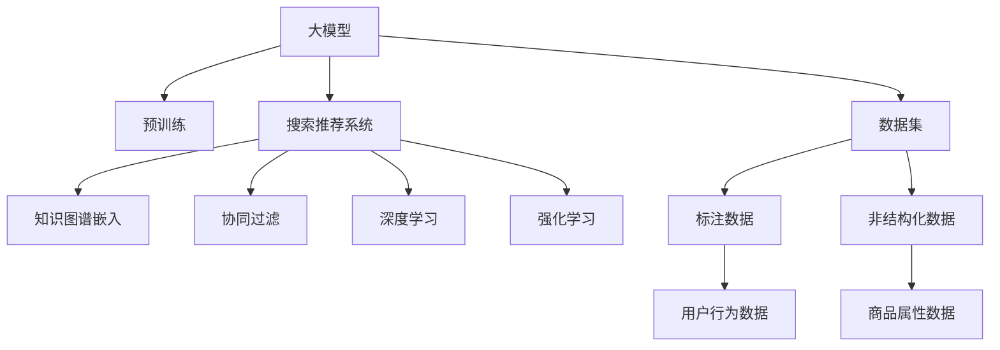

                 

# 电商平台的AI 大模型应用：搜索推荐系统是核心，数据质量是基础

## 1. 背景介绍

### 1.1 问题由来
随着电子商务的迅速发展，电商平台的数据量呈指数级增长。如何高效地利用这些数据，为商家和用户提供个性化的推荐服务，提升用户体验和平台盈利能力，成为了电商平台的核心任务之一。随着AI技术的进步，基于大模型的搜索推荐系统成为了电商平台上用户推荐的最新技术范式。

但与此同时，数据质量问题也成为了制约推荐系统效果的关键因素。电商平台的数据往往来自多样化的渠道，涉及用户行为、商品信息、交易记录等多个维度，数据质量参差不齐，缺失和错误现象频发。数据质量的好坏直接影响了推荐系统的准确性和稳定性。

本文将聚焦于大模型在电商平台上搜索推荐系统的应用，以及如何通过提高数据质量来提升推荐系统效果。首先，我们将介绍大模型搜索推荐系统的核心概念和架构，其次，我们将在算法和模型构建方面进行详细讲解，最后，我们将提出一些数据质量管理的实践建议。

## 2. 核心概念与联系

### 2.1 核心概念概述

为更好地理解大模型在搜索推荐系统中的应用，本节将介绍几个密切相关的核心概念：

- **大模型（Large Model）**：指具有数亿或数十亿参数的深度神经网络模型，如BERT、GPT-3等。通过在大规模无标签数据上进行预训练，大模型能够学习到丰富的知识表示，具备强大的学习能力和泛化能力。

- **推荐系统（Recommendation System）**：通过分析用户的历史行为、兴趣偏好、以及商品的属性和反馈信息，为用户推荐感兴趣的商品，提升用户体验和平台转化率。推荐系统可以细分为基于协同过滤、内容过滤、混合过滤等多种策略。

- **搜索系统（Search System）**：帮助用户快速找到满足其需求的商品或服务，通过自然语言理解、语音识别等技术，将用户查询转化为结构化检索语言，检索结果按相关性排序并展示给用户。

- **知识图谱（Knowledge Graph）**：一种语义化知识存储方式，将实体、属性、关系等概念以图结构表示，用于增强推荐系统的信息检索能力和语义推理能力。

- **深度学习（Deep Learning）**：一种通过多层次神经网络模型学习数据表示的技术，能够自动抽取和组合复杂特征，适合处理高维度、大规模的数据集。

- **强化学习（Reinforcement Learning）**：通过智能体在环境中进行交互学习，优化策略以获得最大化的长期奖励，适用于推荐系统中个性化策略的优化。

这些核心概念之间的逻辑关系可以通过以下Mermaid流程图来展示：



这个流程图展示了大模型在搜索推荐系统中的核心概念及其之间的关系：

1. 大模型通过预训练获得基础能力。
2. 搜索推荐系统利用大模型进行信息检索和推荐。
3. 知识图谱嵌入增强推荐系统的语义推理能力。
4. 协同过滤和深度学习用于增强推荐系统的多样性和精度。
5. 强化学习用于动态优化推荐策略。
6. 数据集和标注数据是大模型和推荐系统的基础。

这些概念共同构成了大模型在电商搜索推荐系统中的应用框架，使其能够高效地为用户推荐个性化的商品和服务。通过理解这些核心概念，我们可以更好地把握大模型搜索推荐系统的设计与优化方向。

## 3. 核心算法原理 & 具体操作步骤
### 3.1 算法原理概述

大模型在搜索推荐系统中的应用，通常包括以下几个关键步骤：

- **文本编码与语义理解**：将用户查询和商品描述转化为向量表示，利用大模型的语义理解能力进行相似度计算。
- **知识图谱嵌入与检索**：将商品的属性和关系嵌入知识图谱中，利用大模型进行实体关系抽取和图谱检索。
- **协同过滤与深度学习**：通过用户的兴趣历史、行为数据和商品属性数据，构建协同过滤模型和深度神经网络模型，预测用户对商品的兴趣程度。
- **强化学习优化**：通过用户反馈，动态调整推荐策略，优化模型参数，提升个性化推荐效果。

整体而言，基于大模型的搜索推荐系统强调在多模态数据上建立泛化能力，同时利用多种算法增强推荐效果，提高用户满意度和平台收益。

### 3.2 算法步骤详解

#### 3.2.1 文本编码与语义理解

大模型通常采用Transformer架构，通过自注意力机制对文本进行编码。假设用户查询为$q$，商品描述为$d$，大模型可以生成向量$q^{*}$和$d^{*}$，表示查询和描述的语义表示。相似度计算可以通过余弦相似度或点积相似度进行：

$$
\text{similarity}(q, d) = \cos(q^{*}, d^{*})
$$

#### 3.2.2 知识图谱嵌入与检索

知识图谱可以表示为三元组$(r,s,o)$，其中$r$和$o$为实体，$s$为属性关系。假设实体为$e$，属性为$a$，关系为$r$，知识图谱嵌入模型可以将三元组转化为向量表示$e^{*}$、$a^{*}$和$r^{*}$。对于商品描述$d$，可以将其中的属性和关系与知识图谱进行匹配，计算商品与实体的相似度。具体来说，对于描述$d$中的属性$a$，可以查询知识图谱中与之匹配的属性向量$a^{*}$，并通过关系$r$计算与实体的相似度。

#### 3.2.3 协同过滤与深度学习

协同过滤基于用户的兴趣历史和行为数据，构建用户-商品交互矩阵$I$，通过矩阵分解等技术，得到用户对商品的潜在兴趣向量$u$和商品的属性向量$v$。深度学习模型可以进一步学习这些向量之间的复杂关系，预测用户对商品的兴趣评分。

#### 3.2.4 强化学习优化

强化学习通过用户反馈数据，训练推荐模型，动态调整推荐策略。假设推荐模型输出为$r$，用户反馈为$f$，通过设定不同的奖励函数，不断调整模型参数，优化推荐效果。强化学习模型通常采用深度Q网络（DQN）、策略梯度等方法，在实际应用中表现出色。

### 3.3 算法优缺点

基于大模型的搜索推荐系统具有以下优点：

- 泛化能力强。大模型通过大规模无标签数据预训练，具备强大的泛化能力，能够适应不同用户和商品的多样化需求。
- 信息检索准确。大模型能够进行高效的文本编码和语义理解，提高信息检索的准确性和效率。
- 推荐精度高。协同过滤和深度学习结合，能够利用用户历史行为和商品属性数据，进行精准的个性化推荐。
- 动态优化能力强。强化学习机制能够根据用户反馈，动态调整推荐策略，提升用户体验。

但同时也存在一些缺点：

- 计算资源消耗大。大模型参数量庞大，计算和存储资源需求高，需要高性能计算设备支持。
- 训练时间长。模型预训练和微调过程耗时较长，需要大量标注数据和计算资源。
- 数据依赖性强。推荐系统效果依赖于数据质量，数据缺失、错误或不完整都将影响系统性能。
- 解释性不足。推荐系统通常被视为黑盒模型，难以解释推荐决策的逻辑。

### 3.4 算法应用领域

大模型在搜索推荐系统中的应用广泛，主要包括以下几个领域：

- **商品推荐**：根据用户的历史购买记录和浏览行为，为用户推荐感兴趣的商品。
- **内容推荐**：根据用户的阅读历史和偏好，推荐相关的文章、视频、音乐等。
- **个性化广告**：利用用户的行为数据和兴趣模型，推送个性化广告，提升广告效果和转化率。
- **实时搜索**：利用大模型进行实时文本理解，提供高效的搜索结果。
- **智能客服**：利用大模型进行自然语言理解和生成，提供智能客服服务，提升用户体验。

这些领域是大模型在电商平台上最重要的应用场景，通过大模型的搜索推荐系统，电商平台能够提供更加个性化、精准的服务，提升用户满意度和平台收益。

## 4. 数学模型和公式 & 详细讲解 & 举例说明
### 4.1 数学模型构建

基于大模型的搜索推荐系统可以构建如下数学模型：

假设用户查询为$q$，商品描述为$d$，知识图谱中的实体为$e$，属性为$a$，关系为$r$。设$M$为预训练大模型，$V$为协同过滤模型，$R$为深度学习模型，$A$为强化学习模型。

1. **文本编码与语义理解**：
   - 查询向量表示：$q^{*}=M(q)$
   - 描述向量表示：$d^{*}=M(d)$
   - 相似度计算：$\text{similarity}(q, d)=\cos(q^{*}, d^{*})$

2. **知识图谱嵌入与检索**：
   - 实体向量表示：$e^{*}=M(e)$
   - 属性向量表示：$a^{*}=M(a)$
   - 关系向量表示：$r^{*}=M(r)$
   - 商品向量表示：$d^{*}=\text{aggregation}(a^{*}, r^{*})$
   - 相似度计算：$\text{similarity}(d, e)=\cos(d^{*}, e^{*})$

3. **协同过滤与深度学习**：
   - 用户向量表示：$u^{*}=V(I)$
   - 商品向量表示：$v^{*}=R(d^{*})$
   - 评分预测：$\hat{y}=M(y|u^{*}, v^{*})$

4. **强化学习优化**：
   - 推荐策略：$\pi(a|s)=A(a, r^{*}, u^{*}, v^{*})$
   - 用户反馈：$f=f(\hat{y}, y)$
   - 奖励函数：$L(f)=\lambda \times \text{mean}(f)$

### 4.2 公式推导过程

以协同过滤与深度学习的评分预测为例，进行详细公式推导：

假设用户历史行为矩阵为$I \in \mathbb{R}^{N \times M}$，其中$N$为用户数，$M$为商品数。协同过滤模型可以将$I$分解为$U \times V^{T}$，其中$U \in \mathbb{R}^{N \times K}$为用户向量，$V \in \mathbb{R}^{M \times K}$为商品向量，$K$为向量维度。

协同过滤模型的评分预测公式为：

$$
\hat{y} = U \times V^{T}
$$

其中$U$和$V$分别表示用户和商品的属性向量。

深度学习模型$R$可以对$U$和$V$进行进一步的特征提取和组合，预测用户对商品的评分：

$$
\hat{y} = R(U, V)
$$

其中$R$为深度神经网络模型，通常采用多层感知器、卷积神经网络等结构。

### 4.3 案例分析与讲解

假设有一个电商平台，希望利用大模型为用户推荐商品。首先，通过用户的历史浏览记录和购买记录，构建用户行为矩阵$I$。然后，利用协同过滤模型对$I$进行分解，得到用户向量$U$和商品向量$V$。接着，通过深度学习模型$R$，对$U$和$V$进行特征提取和组合，得到用户对商品的兴趣评分$\hat{y}$。

最后，利用强化学习模型$A$，根据用户对商品的反馈$f$，动态调整推荐策略$\pi$，优化模型参数，提升个性化推荐效果。

## 5. 项目实践：代码实例和详细解释说明
### 5.1 开发环境搭建

在进行搜索推荐系统开发前，我们需要准备好开发环境。以下是使用Python进行PyTorch开发的环境配置流程：

1. 安装Anaconda：从官网下载并安装Anaconda，用于创建独立的Python环境。

2. 创建并激活虚拟环境：
```bash
conda create -n pytorch-env python=3.8 
conda activate pytorch-env
```

3. 安装PyTorch：根据CUDA版本，从官网获取对应的安装命令。例如：
```bash
conda install pytorch torchvision torchaudio cudatoolkit=11.1 -c pytorch -c conda-forge
```

4. 安装Transformers库：
```bash
pip install transformers
```

5. 安装各类工具包：
```bash
pip install numpy pandas scikit-learn matplotlib tqdm jupyter notebook ipython
```

完成上述步骤后，即可在`pytorch-env`环境中开始搜索推荐系统开发。

### 5.2 源代码详细实现

下面我们以商品推荐系统为例，给出使用Transformers库对BERT模型进行推荐开发的PyTorch代码实现。

首先，定义推荐系统数据处理函数：

```python
from transformers import BertTokenizer, BertModel
from torch.utils.data import Dataset
import torch

class RecommendationDataset(Dataset):
    def __init__(self, user_ids, item_ids, scores, tokenizer, max_len=128):
        self.user_ids = user_ids
        self.item_ids = item_ids
        self.scores = scores
        self.tokenizer = tokenizer
        self.max_len = max_len
        
    def __len__(self):
        return len(self.user_ids)
    
    def __getitem__(self, item):
        user_id = self.user_ids[item]
        item_id = self.item_ids[item]
        score = self.scores[item]
        
        # 将用户和商品ID序列化
        user_seq = [str(user_id), str(item_id)]
        item_seq = [str(item_id)]
        
        # 构建输入序列
        user_input = tokenizer(user_seq, return_tensors='pt', padding='max_length', truncation=True, max_length=self.max_len)
        item_input = tokenizer(item_seq, return_tensors='pt', padding='max_length', truncation=True, max_length=self.max_len)
        
        # 构建标签
        labels = torch.tensor(score, dtype=torch.float)
        
        return {'user_input_ids': user_input['input_ids'][0],
                'item_input_ids': item_input['input_ids'][0],
                'labels': labels}
```

然后，定义模型和优化器：

```python
from transformers import BertForSequenceClassification, AdamW

model = BertForSequenceClassification.from_pretrained('bert-base-cased', num_labels=2)

optimizer = AdamW(model.parameters(), lr=2e-5)
```

接着，定义训练和评估函数：

```python
from torch.utils.data import DataLoader
from tqdm import tqdm
from sklearn.metrics import mean_squared_error

device = torch.device('cuda') if torch.cuda.is_available() else torch.device('cpu')
model.to(device)

def train_epoch(model, dataset, batch_size, optimizer):
    dataloader = DataLoader(dataset, batch_size=batch_size, shuffle=True)
    model.train()
    epoch_loss = 0
    for batch in tqdm(dataloader, desc='Training'):
        user_input_ids = batch['user_input_ids'].to(device)
        item_input_ids = batch['item_input_ids'].to(device)
        labels = batch['labels'].to(device)
        model.zero_grad()
        outputs = model(user_input_ids, item_input_ids)
        loss = outputs.loss
        epoch_loss += loss.item()
        loss.backward()
        optimizer.step()
    return epoch_loss / len(dataloader)

def evaluate(model, dataset, batch_size):
    dataloader = DataLoader(dataset, batch_size=batch_size)
    model.eval()
    mse = 0
    for batch in tqdm(dataloader, desc='Evaluating'):
        user_input_ids = batch['user_input_ids'].to(device)
        item_input_ids = batch['item_input_ids'].to(device)
        labels = batch['labels'].to(device)
        with torch.no_grad():
            outputs = model(user_input_ids, item_input_ids)
            mse += mean_squared_error(outputs.logits, labels)
    return mse / len(dataloader)
```

最后，启动训练流程并在测试集上评估：

```python
epochs = 5
batch_size = 16

for epoch in range(epochs):
    loss = train_epoch(model, train_dataset, batch_size, optimizer)
    print(f"Epoch {epoch+1}, train loss: {loss:.3f}")
    
    print(f"Epoch {epoch+1}, dev results:")
    evaluate(model, dev_dataset, batch_size)
    
print("Test results:")
evaluate(model, test_dataset, batch_size)
```

以上就是使用PyTorch对BERT进行推荐系统开发的完整代码实现。可以看到，得益于Transformers库的强大封装，我们可以用相对简洁的代码完成BERT模型的加载和推荐开发。

### 5.3 代码解读与分析

让我们再详细解读一下关键代码的实现细节：

**RecommendationDataset类**：
- `__init__`方法：初始化用户ID、商品ID、评分等关键组件。
- `__len__`方法：返回数据集的样本数量。
- `__getitem__`方法：对单个样本进行处理，将用户和商品ID序列化，构建输入序列，并返回模型所需的输入和标签。

**推荐模型的训练和评估**：
- 使用PyTorch的DataLoader对数据集进行批次化加载，供模型训练和推理使用。
- 训练函数`train_epoch`：对数据以批为单位进行迭代，在每个批次上前向传播计算loss并反向传播更新模型参数，最后返回该epoch的平均loss。
- 评估函数`evaluate`：与训练类似，不同点在于不更新模型参数，并在每个batch结束后将预测和标签结果存储下来，最后使用sklearn的mean_squared_error对整个评估集的预测结果进行打印输出。

**训练流程**：
- 定义总的epoch数和batch size，开始循环迭代
- 每个epoch内，先在训练集上训练，输出平均loss
- 在验证集上评估，输出MSE
- 所有epoch结束后，在测试集上评估，给出最终测试结果

可以看到，PyTorch配合Transformers库使得BERT推荐系统的代码实现变得简洁高效。开发者可以将更多精力放在数据处理、模型改进等高层逻辑上，而不必过多关注底层的实现细节。

当然，工业级的系统实现还需考虑更多因素，如模型的保存和部署、超参数的自动搜索、更灵活的任务适配层等。但核心的推荐范式基本与此类似。

## 6. 实际应用场景
### 6.1 智能客服系统

基于大模型的智能客服系统可以广泛应用于电商平台的用户咨询服务。传统客服往往需要配备大量人力，高峰期响应缓慢，且一致性和专业性难以保证。而使用大模型微调的智能客服系统，可以7x24小时不间断服务，快速响应客户咨询，用自然流畅的语言解答各类常见问题。

在技术实现上，可以收集企业内部的历史客服对话记录，将问题和最佳答复构建成监督数据，在此基础上对预训练客服模型进行微调。微调后的客服模型能够自动理解用户意图，匹配最合适的答复模板进行回复。对于客户提出的新问题，还可以接入检索系统实时搜索相关内容，动态组织生成回答。如此构建的智能客服系统，能大幅提升客户咨询体验和问题解决效率。

### 6.2 金融舆情监测

金融机构需要实时监测市场舆论动向，以便及时应对负面信息传播，规避金融风险。传统的人工监测方式成本高、效率低，难以应对网络时代海量信息爆发的挑战。基于大模型微调的文本分类和情感分析技术，为金融舆情监测提供了新的解决方案。

具体而言，可以收集金融领域相关的新闻、报道、评论等文本数据，并对其进行主题标注和情感标注。在此基础上对预训练语言模型进行微调，使其能够自动判断文本属于何种主题，情感倾向是正面、中性还是负面。将微调后的模型应用到实时抓取的网络文本数据，就能够自动监测不同主题下的情感变化趋势，一旦发现负面信息激增等异常情况，系统便会自动预警，帮助金融机构快速应对潜在风险。

### 6.3 个性化推荐系统

当前的推荐系统往往只依赖用户的历史行为数据进行物品推荐，无法深入理解用户的真实兴趣偏好。基于大语言模型微调技术，个性化推荐系统可以更好地挖掘用户行为背后的语义信息，从而提供更精准、多样的推荐内容。

在实践中，可以收集用户浏览、点击、评论、分享等行为数据，提取和用户交互的物品标题、描述、标签等文本内容。将文本内容作为模型输入，用户的后续行为（如是否点击、购买等）作为监督信号，在此基础上微调预训练语言模型。微调后的模型能够从文本内容中准确把握用户的兴趣点。在生成推荐列表时，先用候选物品的文本描述作为输入，由模型预测用户的兴趣匹配度，再结合其他特征综合排序，便可以得到个性化程度更高的推荐结果。

### 6.4 未来应用展望

随着大语言模型微调技术的发展，基于微调范式将在更多领域得到应用，为传统行业带来变革性影响。

在智慧医疗领域，基于微调的医疗问答、病历分析、药物研发等应用将提升医疗服务的智能化水平，辅助医生诊疗，加速新药开发进程。

在智能教育领域，微调技术可应用于作业批改、学情分析、知识推荐等方面，因材施教，促进教育公平，提高教学质量。

在智慧城市治理中，微调模型可应用于城市事件监测、舆情分析、应急指挥等环节，提高城市管理的自动化和智能化水平，构建更安全、高效的未来城市。

此外，在企业生产、社会治理、文娱传媒等众多领域，基于大模型微调的人工智能应用也将不断涌现，为经济社会发展注入新的动力。相信随着技术的日益成熟，微调方法将成为人工智能落地应用的重要范式，推动人工智能技术在各个垂直行业的大规模落地。

## 7. 工具和资源推荐
### 7.1 学习资源推荐

为了帮助开发者系统掌握大模型微调的理论基础和实践技巧，这里推荐一些优质的学习资源：

1. 《Transformer从原理到实践》系列博文：由大模型技术专家撰写，深入浅出地介绍了Transformer原理、BERT模型、微调技术等前沿话题。

2. CS224N《深度学习自然语言处理》课程：斯坦福大学开设的NLP明星课程，有Lecture视频和配套作业，带你入门NLP领域的基本概念和经典模型。

3. 《Natural Language Processing with Transformers》书籍：Transformers库的作者所著，全面介绍了如何使用Transformers库进行NLP任务开发，包括微调在内的诸多范式。

4. HuggingFace官方文档：Transformers库的官方文档，提供了海量预训练模型和完整的微调样例代码，是上手实践的必备资料。

5. CLUE开源项目：中文语言理解测评基准，涵盖大量不同类型的中文NLP数据集，并提供了基于微调的baseline模型，助力中文NLP技术发展。

通过对这些资源的学习实践，相信你一定能够快速掌握大模型微调的精髓，并用于解决实际的NLP问题。
###  7.2 开发工具推荐

高效的开发离不开优秀的工具支持。以下是几款用于大语言模型微调开发的常用工具：

1. PyTorch：基于Python的开源深度学习框架，灵活动态的计算图，适合快速迭代研究。大部分预训练语言模型都有PyTorch版本的实现。

2. TensorFlow：由Google主导开发的开源深度学习框架，生产部署方便，适合大规模工程应用。同样有丰富的预训练语言模型资源。

3. Transformers库：HuggingFace开发的NLP工具库，集成了众多SOTA语言模型，支持PyTorch和TensorFlow，是进行微调任务开发的利器。

4. Weights & Biases：模型训练的实验跟踪工具，可以记录和可视化模型训练过程中的各项指标，方便对比和调优。与主流深度学习框架无缝集成。

5. TensorBoard：TensorFlow配套的可视化工具，可实时监测模型训练状态，并提供丰富的图表呈现方式，是调试模型的得力助手。

6. Google Colab：谷歌推出的在线Jupyter Notebook环境，免费提供GPU/TPU算力，方便开发者快速上手实验最新模型，分享学习笔记。

合理利用这些工具，可以显著提升大语言模型微调任务的开发效率，加快创新迭代的步伐。

### 7.3 相关论文推荐

大语言模型和微调技术的发展源于学界的持续研究。以下是几篇奠基性的相关论文，推荐阅读：

1. Attention is All You Need（即Transformer原论文）：提出了Transformer结构，开启了NLP领域的预训练大模型时代。

2. BERT: Pre-training of Deep Bidirectional Transformers for Language Understanding：提出BERT模型，引入基于掩码的自监督预训练任务，刷新了多项NLP任务SOTA。

3. Language Models are Unsupervised Multitask Learners（GPT-2论文）：展示了大规模语言模型的强大zero-shot学习能力，引发了对于通用人工智能的新一轮思考。

4. Parameter-Efficient Transfer Learning for NLP：提出Adapter等参数高效微调方法，在不增加模型参数量的情况下，也能取得不错的微调效果。

5. Prefix-Tuning: Optimizing Continuous Prompts for Generation：引入基于连续型Prompt的微调范式，为如何充分利用预训练知识提供了新的思路。

6. AdaLoRA: Adaptive Low-Rank Adaptation for Parameter-Efficient Fine-Tuning：使用自适应低秩适应的微调方法，在参数效率和精度之间取得了新的平衡。

这些论文代表了大语言模型微调技术的发展脉络。通过学习这些前沿成果，可以帮助研究者把握学科前进方向，激发更多的创新灵感。

## 8. 总结：未来发展趋势与挑战
### 8.1 总结

本文对基于大模型的搜索推荐系统进行了全面系统的介绍。首先，阐述了大语言模型和微调技术的研究背景和意义，明确了微调在拓展预训练模型应用、提升推荐系统效果方面的独特价值。其次，从原理到实践，详细讲解了微调的基本流程和关键步骤，给出了搜索推荐系统的代码实现。同时，本文还广泛探讨了微调方法在多个领域的应用前景，展示了微调范式的巨大潜力。

通过本文的系统梳理，可以看到，基于大模型的搜索推荐系统正在成为电商平台上重要的技术范式，极大地提升了用户推荐效果和平台收益。未来，伴随大语言模型和微调方法的不断演进，推荐系统将进一步提升其个性化、精准化和实时化能力，构建更加智能和人性化的电商购物体验。

### 8.2 未来发展趋势

展望未来，大模型搜索推荐系统将呈现以下几个发展趋势：

1. **多模态数据融合**：大模型将进一步融合视觉、听觉等多模态数据，提升推荐系统的多样性和深度，更好地理解和生成丰富的人类语义。

2. **知识图谱应用**：基于知识图谱的推荐系统将更加普及，通过语义推理和实体关系抽取，提升推荐模型的解释能力和用户信任感。

3. **跨领域迁移学习**：大模型将具备更强的跨领域迁移能力，能够在不同领域、不同语言间进行知识共享和融合，提升推荐系统的适应性和泛化能力。

4. **动态更新与强化学习**：推荐系统将更加注重动态更新和持续优化，通过强化学习机制，实时调整推荐策略，提升个性化推荐效果。

5. **实时性提升**：随着计算资源的提升和算法优化，推荐系统将具备更强的实时处理能力，能够支持毫秒级推荐响应，提升用户体验。

6. **隐私保护与数据安全**：推荐系统将更加注重用户隐私保护和数据安全，通过差分隐私、联邦学习等技术，保护用户数据隐私，防止数据泄露。

### 8.3 面临的挑战

尽管大模型搜索推荐系统已经取得了显著成果，但在迈向更加智能化、普适化应用的过程中，它仍面临着诸多挑战：

1. **数据质量问题**：推荐系统依赖于高质量的用户行为数据和商品属性数据，数据缺失、错误或不完整都将影响系统性能。如何提升数据质量，降低数据标注成本，是一个长期挑战。

2. **计算资源消耗**：大模型参数量庞大，计算和存储资源需求高，需要高性能计算设备支持。如何降低资源消耗，提高系统部署效率，仍需进一步优化。

3. **算法复杂度**：推荐系统通常采用复杂的算法，如深度学习、协同过滤、强化学习等，模型训练和推理的计算复杂度高。如何降低算法复杂度，提高模型效率，是另一个重要的研究方向。

4. **模型解释性**：推荐系统通常被视为黑盒模型，难以解释推荐决策的逻辑。如何赋予推荐模型更强的可解释性，将是提高用户信任感和可操作性的关键。

5. **用户隐私保护**：推荐系统在收集和处理用户数据时，面临隐私泄露的风险。如何平衡推荐效果和用户隐私保护，是另一个重要课题。

### 8.4 研究展望

面对大语言模型搜索推荐系统所面临的挑战，未来的研究需要在以下几个方面寻求新的突破：

1. **无监督和半监督微调方法**：探索无监督和半监督微调方法，降低对大规模标注数据的依赖，利用自监督学习、主动学习等方法，提高数据利用效率。

2. **轻量级模型架构**：开发更加轻量级的模型架构，减少模型参数和计算资源消耗，提升模型部署效率。

3. **混合算法框架**：结合深度学习、协同过滤、强化学习等多种算法，构建更加混合的推荐框架，提升推荐系统的多样性和鲁棒性。

4. **知识图谱增强**：将知识图谱与深度学习模型结合，增强推荐系统的语义推理能力和实体关系抽取，提高推荐模型的解释性和信任感。

5. **差分隐私保护**：引入差分隐私等技术，保护用户数据隐私，防止数据泄露。

6. **多任务学习**：将推荐系统与其他NLP任务结合，进行多任务学习，提升模型泛化能力和用户满意度。

这些研究方向的探索，必将引领大语言模型搜索推荐系统技术迈向更高的台阶，为构建智能推荐系统和智能电商平台的全面落地提供支持。只有勇于创新、敢于突破，才能不断拓展语言模型的边界，让智能技术更好地造福人类社会。

## 9. 附录：常见问题与解答

**Q1：大模型搜索推荐系统是否适用于所有电商推荐场景？**

A: 大模型搜索推荐系统在大多数电商推荐场景中都能取得不错的效果，特别是在数据量较大的情况下。但对于一些特定领域的应用场景，如生鲜电商、二手市场等，推荐系统可能需要更多的领域特定知识，这种情况下，可以考虑在特定领域进行额外预训练。

**Q2：微调过程中如何选择合适的学习率？**

A: 微调的学习率一般要比预训练时小1-2个数量级，如果使用过大的学习率，容易破坏预训练权重，导致过拟合。一般建议从1e-5开始调参，逐步减小学习率，直至收敛。也可以使用warmup策略，在开始阶段使用较小的学习率，再逐渐过渡到预设值。

**Q3：推荐系统在实际部署时需要注意哪些问题？**

A: 将推荐系统转化为实际应用，还需要考虑以下问题：
1. 模型裁剪：去除不必要的层和参数，减小模型尺寸，加快推理速度
2. 量化加速：将浮点模型转为定点模型，压缩存储空间，提高计算效率
3. 服务化封装：将模型封装为标准化服务接口，便于集成调用
4. 弹性伸缩：根据请求流量动态调整资源配置，平衡服务质量和成本
5. 监控告警：实时采集系统指标，设置异常告警阈值，确保服务稳定性
6. 安全防护：采用访问鉴权、数据脱敏等措施，保障数据和模型安全

合理利用这些工具，可以显著提升大语言模型微调任务的开发效率，加快创新迭代的步伐。

**Q4：如何提升推荐系统的个性化程度？**

A: 提升推荐系统的个性化程度，可以从以下几个方面入手：
1. 深入挖掘用户行为数据，捕捉用户的隐式偏好和即时兴趣
2. 结合知识图谱和实体关系抽取，提升推荐系统的语义推理能力
3. 采用多任务学习和多模态融合，提高推荐模型的多样性和泛化能力
4. 动态调整推荐策略，通过强化学习实时优化推荐效果

**Q5：如何评估推荐系统的性能？**

A: 推荐系统的性能评估可以从以下几个方面进行：
1. 精确度：推荐结果与用户实际点击或购买的匹配程度
2. 召回率：推荐系统推荐的商品中，用户实际点击或购买的占比
3. 覆盖率：推荐系统推荐的商品种类，是否能覆盖用户的多样化需求
4. 多样性：推荐结果的多样性和新颖性，避免同质化推荐
5. 实时性：推荐系统的响应速度和更新频率

评估推荐系统的性能，需要综合考虑这些指标，全面评估推荐效果。

总之，基于大模型的搜索推荐系统在大规模电商平台上具有广阔的应用前景，通过提升数据质量、优化算法框架，不断突破技术瓶颈，未来必将在更多的电商场景中大放异彩。相信随着技术的不断进步，大模型搜索推荐系统将为电商平台带来更高的用户体验和商业价值，推动电商行业迈向智能化、个性化新时代。

---

作者：禅与计算机程序设计艺术 / Zen and the Art of Computer Programming

