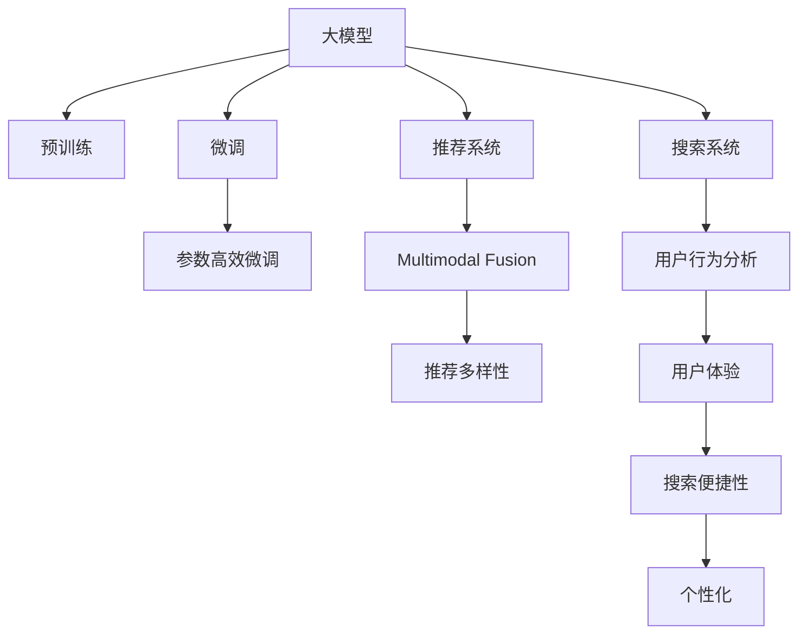

                 

# 电商平台的AI 大模型转型：搜索推荐系统是核心，数据质量控制与用户体验优化

## 1. 背景介绍

随着互联网和人工智能技术的飞速发展，电商平台正经历一场深刻的变革。传统的以规则驱动、人工干预为主的搜索推荐系统，正在逐渐被基于深度学习、特别是基于大模型的搜索推荐系统所取代。这种转变不仅带来了算力、数据和算法上的巨大提升，还引发了业务模式和用户体验的根本性变革。

### 1.1 问题由来

在电商平台上，用户的行为和需求呈现出多样化和个性化趋势，传统的规则引擎和人工经验难以覆盖这些复杂性。一方面，用户对商品信息的获取方式、时间、效率提出了更高的要求；另一方面，平台希望通过精准推荐，提升用户转化率、增加平台收益。

基于深度学习的大模型为这些需求提供了新的解决方案。通过大规模预训练和微调，大模型能够从海量的用户行为数据中学习出高质量的用户和商品表示，从而在搜索和推荐场景中实现高效、准确的智能匹配。

### 1.2 问题核心关键点

大模型在电商平台的搜索推荐应用中，核心作用体现在以下几个方面：

- **大规模预训练**：在无标签数据上预训练，获得通用的语言和知识表示。
- **下游任务微调**：针对具体电商任务，在少量标注数据上进行微调，优化模型性能。
- **参数高效微调**：通过减少模型参数量，提升模型效率和实时性。
- **多模态融合**：将文本、图像、视频等多模态数据进行融合，提升推荐多样性和真实性。
- **用户行为预测**：通过学习用户行为和偏好，预测用户下一步操作，提升用户体验。

## 2. 核心概念与联系

### 2.1 核心概念概述

在电商平台的AI转型中，涉及的核心概念包括：

- **大模型(Large Model)**：指基于深度学习架构，经过大规模数据训练得到的通用语言模型，如BERT、GPT、Transformer等。
- **预训练(Pre-training)**：指在大规模无标签数据上，通过自监督任务对模型进行初始化训练，获得通用的语言和知识表示。
- **微调(Fine-tuning)**：指在预训练模型的基础上，使用特定任务的少量标注数据，通过有监督学习优化模型在该任务上的性能。
- **推荐系统(Recommendation System)**：通过分析用户行为和商品属性，为用户推荐可能感兴趣的商品或内容。
- **搜索系统(Search System)**：帮助用户快速查找所需商品，提升用户满意度和购买转化率。
- **多模态融合(Multimodal Fusion)**：将文本、图像、视频等不同类型的数据进行融合，提升推荐的全面性和真实性。
- **用户体验(UX)**：在搜索推荐过程中，提升用户的满意度、便捷性和个性化。

这些概念之间的逻辑关系可以通过以下Mermaid流程图来展示：



这个流程图展示了电商平台上大模型的核心概念及其之间的关系：

1. 大模型通过预训练获得基础能力。
2. 微调优化模型在特定任务上的性能。
3. 推荐系统利用微调后的模型实现商品推荐。
4. 搜索系统帮助用户快速找到商品，提升搜索效率。
5. 多模态融合提升推荐的全面性和真实性。
6. 用户体验优化，提升搜索推荐系统的便捷性和个性化。

## 3. 核心算法原理 & 具体操作步骤

### 3.1 算法原理概述

基于大模型的电商搜索推荐系统，其核心原理包括：

- **预训练阶段**：在无标签数据上对大模型进行预训练，学习通用的语言和知识表示。
- **微调阶段**：在特定任务的少量标注数据上，对预训练模型进行微调，优化模型在搜索推荐任务上的性能。
- **多模态融合**：将用户行为数据、商品属性数据、评价数据等不同类型的数据进行融合，提升推荐的全面性和真实性。
- **用户体验优化**：在搜索推荐过程中，通过智能化的界面设计、搜索排序算法、推荐算法等手段，提升用户的满意度和便捷性。

### 3.2 算法步骤详解

1. **数据准备**：收集电商平台的用户行为数据、商品属性数据、评价数据等，进行清洗、处理和标注。
2. **模型选择**：选择合适的预训练语言模型，如BERT、GPT、Transformer等。
3. **预训练阶段**：在无标签数据上对模型进行预训练，学习通用的语言和知识表示。
4. **微调阶段**：在特定任务的少量标注数据上，对预训练模型进行微调，优化模型在搜索推荐任务上的性能。
5. **多模态融合**：将不同类型的数据进行融合，提升推荐的全面性和真实性。
6. **用户体验优化**：在搜索推荐过程中，通过智能化的界面设计、搜索排序算法、推荐算法等手段，提升用户的满意度和便捷性。
7. **模型评估和部署**：评估微调后的模型性能，部署到生产环境，进行实时推荐和搜索。

### 3.3 算法优缺点

基于大模型的电商搜索推荐系统，其优点包括：

- **高效性**：通过大规模预训练和微调，模型能够快速适应特定任务，提升推荐效率。
- **准确性**：大模型具有强大的语言理解和生成能力，能够准确地理解用户需求和商品属性，提升推荐精度。
- **泛化能力**：大模型具有较强的泛化能力，能够处理复杂多变的数据，适应不同的业务场景。

然而，也存在以下缺点：

- **高成本**：大模型的训练和微调需要大量的计算资源和标注数据，成本较高。
- **隐私风险**：收集和使用用户数据时，需要考虑数据隐私和安全问题。
- **可解释性不足**：大模型往往被视为"黑盒"，其决策过程缺乏可解释性。
- **数据依赖**：模型的性能很大程度上依赖于数据的质量和数量，数据不平衡可能导致模型偏差。

### 3.4 算法应用领域

基于大模型的电商搜索推荐系统，主要应用于以下几个领域：

- **商品推荐**：根据用户的历史行为和偏好，为用户推荐可能感兴趣的商品。
- **个性化展示**：根据用户属性和行为，对商品进行个性化展示，提升用户转化率。
- **搜索排序**：对搜索结果进行排序，提升搜索效率和用户体验。
- **广告推荐**：根据用户兴趣和行为，为用户推荐广告，增加平台收益。
- **用户画像**：通过用户行为数据和商品数据，构建用户画像，了解用户需求和偏好。
- **多模态融合**：将文本、图像、视频等多模态数据进行融合，提升推荐的全面性和真实性。

## 4. 数学模型和公式 & 详细讲解 & 举例说明

### 4.1 数学模型构建

在电商平台的搜索推荐系统中，常用的数学模型包括：

- **深度神经网络模型**：如卷积神经网络(CNN)、循环神经网络(RNN)、Transformer等。
- **协同过滤模型**：如基于矩阵分解的协同过滤算法。
- **嵌入式模型**：如将用户行为数据和商品属性数据嵌入到高维空间中，计算相似度进行推荐。
- **注意力机制**：如Transformer中的多头注意力机制，用于提升推荐的多样性和准确性。

### 4.2 公式推导过程

以基于Transformer的推荐系统为例，介绍其核心公式的推导过程。

假设输入序列为 $X=[x_1, x_2, ..., x_n]$，目标为输出序列 $Y=[y_1, y_2, ..., y_m]$。设 $X$ 的长度为 $n$，$Y$ 的长度为 $m$。

**编码器(Encoder)**：将输入序列 $X$ 转换为隐状态表示 $Z=[z_1, z_2, ..., z_n]$。

- **多头注意力机制**：设 $H$ 为隐状态矩阵，$W_{Q}$、$W_{K}$、$W_{V}$ 为线性变换矩阵，$Q=[q_1, q_2, ..., q_n]$、$K=[k_1, k_2, ..., k_n]$、$V=[v_1, v_2, ..., v_n]$ 为查询、键、值矩阵。

  $$
  Q = HXW_{Q} \\
  K = HXW_{K} \\
  V = HXW_{V}
  $$

  计算注意力权重 $A=[a_1, a_2, ..., a_n]$，并将 $K$ 进行线性变换得到 $\tilde{K}=[\tilde{k}_1, \tilde{k}_2, ..., \tilde{k}_n]$。

  $$
  A = \frac{QK^T}{\sqrt{d_k}} \\
  \tilde{K} = KW_{K}
  $$

  计算注意力输出 $C=[c_1, c_2, ..., c_n]$。

  $$
  C = AV^T
  $$

**解码器(Decoder)**：将隐状态表示 $Z$ 转换为输出序列 $Y$。

- **多头注意力机制**：设 $H$ 为隐状态矩阵，$W_{O}$、$W_{Q}$、$W_{K}$、$W_{V}$ 为线性变换矩阵，$O=[o_1, o_2, ..., o_m]$、$Q=[q_1, q_2, ..., q_m]$、$K=[k_1, k_2, ..., k_m]$、$V=[v_1, v_2, ..., v_m]$ 为查询、键、值矩阵。

  $$
  Q = O^{(L)}H_{(L-1)}W_{O} \\
  K = O^{(L)}H_{(L-1)}W_{K} \\
  V = O^{(L)}H_{(L-1)}W_{V}
  $$

  计算注意力权重 $A=[a_1, a_2, ..., a_m]$，并将 $K$ 进行线性变换得到 $\tilde{K}=[\tilde{k}_1, \tilde{k}_2, ..., \tilde{k}_m]$。

  $$
  A = \frac{QK^T}{\sqrt{d_k}} \\
  \tilde{K} = KW_{K}
  $$

  计算注意力输出 $C=[c_1, c_2, ..., c_m]$。

  $$
  C = AV^T
  $$

最终，通过解码器生成输出序列 $Y$。

**推荐算法**：根据预测的输出序列，进行推荐。

- **排序算法**：如基于深度学习的排序算法，如利用Transformer对商品进行排序。

  $$
  \text{Ranking}(Y, \text{Items}) = f(Y, \text{Items})
  $$

- **召回算法**：如利用协同过滤算法，对用户未点击的商品进行召回。

  $$
  \text{Recall}(\text{Users}, \text{Items}) = f(\text{Users}, \text{Items})
  $$

通过以上模型，电商平台的搜索推荐系统可以实现高效、准确的智能推荐，提升用户体验和平台收益。

### 4.3 案例分析与讲解

以一个具体的电商推荐系统为例，介绍其实现过程：

**数据准备**：
- 收集用户历史浏览、点击、购买等行为数据，以及商品属性数据。
- 对数据进行清洗、处理和标注。

**模型选择**：
- 选择Transformer模型，并进行大规模预训练。
- 在商品推荐任务上，对预训练模型进行微调。

**微调阶段**：
- 使用用户行为数据和商品属性数据进行微调，优化推荐模型。
- 利用多模态融合技术，将用户行为数据、商品属性数据、评价数据等进行融合，提升推荐的全面性和真实性。

**推荐算法**：
- 使用Transformer模型对商品进行排序。
- 结合协同过滤算法，对用户未点击的商品进行召回。

**用户体验优化**：
- 设计智能化的界面设计，提升搜索推荐系统的便捷性。
- 利用推荐算法，提升用户的满意度和购买转化率。

通过以上步骤，电商平台搜索推荐系统实现了高效、准确的智能推荐，提升了用户满意度和平台收益。

## 5. 项目实践：代码实例和详细解释说明

### 5.1 开发环境搭建

在开发基于大模型的电商搜索推荐系统时，需要搭建以下开发环境：

1. 安装Python：使用Anaconda或Miniconda，安装最新版本的Python。
2. 安装PyTorch：使用pip或conda安装PyTorch，并进行必要的配置。
3. 安装TensorFlow：使用pip或conda安装TensorFlow，并进行必要的配置。
4. 安装TensorBoard：使用pip或conda安装TensorBoard，用于模型训练和调试。
5. 安装FastAPI：使用pip或conda安装FastAPI，用于构建API接口。

完成以上步骤后，即可在虚拟环境中进行模型开发和测试。

### 5.2 源代码详细实现

下面以基于Transformer的电商推荐系统为例，展示其代码实现过程。

**编码器部分**：

```python
import torch
from torch import nn

class Encoder(nn.Module):
    def __init__(self, embed_size, num_heads, hidden_size, drop_rate):
        super(Encoder, self).__init__()
        self.embed_size = embed_size
        self.num_heads = num_heads
        self.hidden_size = hidden_size
        self.drop_rate = drop_rate
        
        self.layer_norm = nn.LayerNorm(embed_size)
        self.encoder_layer = nn.TransformerEncoderLayer(embed_size, num_heads, hidden_size, drop_rate)
        self.encoder = nn.TransformerEncoder(self.encoder_layer, num_layers=6)
    
    def forward(self, x):
        x = self.layer_norm(x)
        x = self.encoder(x)
        return x
```

**解码器部分**：

```python
import torch
from torch import nn

class Decoder(nn.Module):
    def __init__(self, embed_size, num_heads, hidden_size, drop_rate):
        super(Decoder, self).__init__()
        self.embed_size = embed_size
        self.num_heads = num_heads
        self.hidden_size = hidden_size
        self.drop_rate = drop_rate
        
        self.layer_norm = nn.LayerNorm(embed_size)
        self.decoder_layer = nn.TransformerDecoderLayer(embed_size, num_heads, hidden_size, drop_rate)
        self.decoder = nn.TransformerDecoder(self.decoder_layer, num_layers=6)
    
    def forward(self, x, hidden_state):
        x = self.layer_norm(x)
        x, _ = self.decoder(x, hidden_state)
        return x
```

**推荐算法部分**：

```python
import torch
from torch import nn
from torch.nn import functional as F

class Recommendation(nn.Module):
    def __init__(self, embed_size, num_heads, hidden_size, drop_rate):
        super(Recommendation, self).__init__()
        self.embed_size = embed_size
        self.num_heads = num_heads
        self.hidden_size = hidden_size
        self.drop_rate = drop_rate
        
        self.layer_norm = nn.LayerNorm(embed_size)
        self.recommender_layer = nn.TransformerEncoderLayer(embed_size, num_heads, hidden_size, drop_rate)
        self.recommender = nn.TransformerEncoder(self.recommender_layer, num_layers=6)
    
    def forward(self, x, y):
        x = self.layer_norm(x)
        y = self.layer_norm(y)
        output = self.recommender(x, y)
        output = F.softmax(output, dim=-1)
        return output
```

**模型训练部分**：

```python
import torch
from torch import nn
from torch.nn import functional as F

class Model(nn.Module):
    def __init__(self, embed_size, num_heads, hidden_size, drop_rate):
        super(Model, self).__init__()
        self.embed_size = embed_size
        self.num_heads = num_heads
        self.hidden_size = hidden_size
        self.drop_rate = drop_rate
        
        self.encoder = Encoder(embed_size, num_heads, hidden_size, drop_rate)
        self.decoder = Decoder(embed_size, num_heads, hidden_size, drop_rate)
        self.recommender = Recommendation(embed_size, num_heads, hidden_size, drop_rate)
    
    def forward(self, x, y):
        encoded_x = self.encoder(x)
        decoded_x = self.decoder(encoded_x, y)
        recommender_output = self.recommender(encoded_x, decoded_x)
        return recommender_output
    
    def train(self, optimizer, loss_function, train_loader, valid_loader):
        self.train()
        optimizer.zero_grad()
        for batch in train_loader:
            x, y = batch
            y_hat = self(x, y)
            loss = loss_function(y_hat, y)
            loss.backward()
            optimizer.step()
        
        self.eval()
        with torch.no_grad():
            valid_loss = 0.0
            for batch in valid_loader:
                x, y = batch
                y_hat = self(x, y)
                valid_loss += loss_function(y_hat, y).item()
            valid_loss /= len(valid_loader)
        return valid_loss
```

通过以上代码，即可构建并训练一个基于Transformer的电商推荐系统。

### 5.3 代码解读与分析

**编码器部分**：
- 使用TransformerEncoder层对输入序列进行编码。
- 通过LayerNorm层进行归一化，防止梯度消失或爆炸。
- 设置多个编码器层，通过并行计算提升编码效率。

**解码器部分**：
- 使用TransformerDecoder层对编码器输出进行解码。
- 通过LayerNorm层进行归一化，防止梯度消失或爆炸。
- 设置多个解码器层，通过并行计算提升解码效率。

**推荐算法部分**：
- 使用TransformerEncoder层对用户和商品进行编码。
- 通过Softmax函数将输出转换为概率分布。
- 根据预测概率进行推荐。

**模型训练部分**：
- 定义模型的前向传播过程。
- 使用优化器进行模型训练。
- 在验证集上评估模型性能。

通过以上代码，我们展示了基于Transformer的电商推荐系统的实现过程，并对其关键部分进行了详细解读。

## 6. 实际应用场景

### 6.1 智能客服系统

电商平台的智能客服系统，是利用大模型进行推荐和搜索的核心应用之一。智能客服系统通过学习用户的搜索历史、对话内容等信息，能够快速响应用户需求，提供个性化的商品推荐和客服解答。

具体实现上，可以利用大模型进行预训练，再针对具体的客服任务进行微调。微调后的模型能够理解用户的意图，生成适当的回答，同时推荐相关的商品。通过智能客服系统，电商平台能够显著提升用户满意度，减少人工客服成本。

### 6.2 个性化推荐系统

电商平台的个性化推荐系统，是利用大模型进行推荐的核心应用之一。通过学习用户的浏览、点击、购买等行为数据，大模型能够自动分析用户的兴趣和需求，进行精准的推荐。

具体实现上，可以利用大模型进行预训练，再针对具体的推荐任务进行微调。微调后的模型能够准确地预测用户的下一步操作，提升推荐效果。通过个性化推荐系统，电商平台能够显著提升用户的转化率和满意度，增加平台收益。

### 6.3 多模态融合推荐系统

电商平台的推荐系统，不仅仅是文本推荐，还可以通过融合多模态数据，提升推荐的多样性和真实性。例如，将商品图片、视频等多媒体数据与文本数据结合，进行交叉推荐。

具体实现上，可以利用大模型进行预训练，再针对具体的推荐任务进行微调。微调后的模型能够融合多模态数据，生成更加全面、真实的推荐结果。通过多模态融合推荐系统，电商平台能够提升推荐的多样性和真实性，满足用户的多样化需求。

## 7. 工具和资源推荐

### 7.1 学习资源推荐

为了帮助开发者系统掌握大模型在电商搜索推荐系统中的应用，这里推荐一些优质的学习资源：

1. 《深度学习与自然语言处理》系列书籍：介绍深度学习和大模型的基础知识，包括预训练、微调等。
2. 《Transformers: From Theory to Practice》论文：介绍Transformer模型的原理和实践，包括预训练、微调等。
3. 《Reinforcement Learning: An Introduction》书籍：介绍强化学习的基本概念和算法，包括在推荐系统中的应用。
4. 《Recommender Systems in E-commerce》论文：介绍电商推荐系统的最新研究进展，包括大模型的应用。
5. Kaggle竞赛平台：通过参加电商推荐系统竞赛，积累实战经验，提升模型性能。

通过对这些资源的学习实践，相信你一定能够快速掌握大模型在电商搜索推荐系统中的应用，并用于解决实际的业务问题。

### 7.2 开发工具推荐

在进行大模型的电商搜索推荐系统开发时，需要利用一些高效的工具：

1. PyTorch：开源深度学习框架，支持大规模模型的训练和微调。
2. TensorFlow：由Google主导的开源深度学习框架，支持多模态数据的融合。
3. TensorBoard：开源可视化工具，帮助监控模型训练过程，评估模型性能。
4. FastAPI：开源Web框架，用于构建API接口，方便模型部署。
5. Elasticsearch：开源搜索引擎，用于存储和查询商品数据，支持大规模数据的搜索和推荐。

这些工具能够显著提升开发效率，加速模型训练和推理，确保系统稳定可靠。

### 7.3 相关论文推荐

大模型在电商搜索推荐系统中的应用，是一个快速发展的领域。以下是几篇重要的相关论文，推荐阅读：

1. "Adversarial Examples in Generative Adversarial Nets"（2015）：介绍生成对抗网络的基本原理和应用，包括在推荐系统中的应用。
2. "Factorization Machines with Side Information"（2018）：介绍因子分解机的基本原理和应用，包括在电商推荐系统中的应用。
3. "Recommender Systems Based on Deep Learning"（2019）：介绍深度学习在推荐系统中的应用，包括大模型的应用。
4. "Transformers: State-of-the-art Generative Language Models"（2017）：介绍Transformer模型的基本原理和应用，包括在推荐系统中的应用。
5. "A Survey on Personalized Recommendation Technologies and Tools"（2019）：介绍个性化推荐系统的最新研究进展，包括大模型的应用。

这些论文代表了大模型在电商搜索推荐系统中的应用方向，对深入理解大模型的应用具有重要意义。

## 8. 总结：未来发展趋势与挑战

### 8.1 总结

本文对基于大模型的电商搜索推荐系统的核心算法和操作步骤进行了全面系统的介绍。首先阐述了大模型在电商平台的搜索推荐应用中，通过预训练和微调，学习通用的语言和知识表示，实现高效、准确的智能推荐。其次，通过介绍多模态融合和用户体验优化，展示了电商平台的推荐系统如何在复杂多变的业务场景中，提供个性化、多样化的服务。最后，通过分析学习资源、开发工具和相关论文，为读者提供了全面的参考。

通过本文的系统梳理，可以看到，大模型在电商平台的搜索推荐应用中，具有巨大的潜力，能够显著提升推荐精度和用户体验，增加平台收益。未来，伴随大模型的不断演进和算力的提升，其应用前景将更加广阔。

### 8.2 未来发展趋势

未来，大模型在电商平台的搜索推荐应用中，将呈现以下几个发展趋势：

1. **多模态融合**：将文本、图像、视频等多模态数据进行融合，提升推荐的全面性和真实性。
2. **自适应推荐**：通过学习用户的行为和偏好，动态调整推荐策略，提升推荐效果。
3. **强化学习**：利用强化学习技术，优化推荐系统的决策过程，提升推荐精度和用户体验。
4. **实时推荐**：通过实时数据流处理，实现实时推荐，提升用户的满意度和转化率。
5. **联邦学习**：利用联邦学习技术，保护用户隐私的同时，提升推荐系统的性能和效率。
6. **跨领域迁移**：通过跨领域迁移学习，提升模型在不同领域的应用效果，拓展电商平台的业务范围。

这些趋势将推动大模型在电商平台的搜索推荐应用中，向更加智能化、个性化、实时化方向发展，为电商平台带来更加优质的用户服务。

### 8.3 面临的挑战

尽管大模型在电商平台的搜索推荐应用中已经取得了显著进展，但在迈向更加智能化、普适化应用的过程中，仍面临诸多挑战：

1. **数据隐私和安全**：电商平台上收集和使用用户数据时，需要严格保护用户隐私，防止数据泄露和滥用。
2. **模型鲁棒性**：面对不同场景、不同用户的行为数据，大模型需要具备较强的鲁棒性，避免因数据分布变化导致模型失效。
3. **资源消耗**：大模型的训练和推理需要大量计算资源，如何在保证模型性能的同时，优化资源消耗，是一个重要的问题。
4. **模型解释性**：大模型往往被视为"黑盒"，其决策过程缺乏可解释性，需要开发更加透明、可解释的推荐算法。
5. **用户行为预测**：大模型需要准确预测用户的下一步操作，但用户行为数据往往是不稳定的，如何提升模型的预测精度，是一个关键问题。

这些挑战将直接影响大模型在电商平台的搜索推荐应用中的效果和可靠性，亟需进一步研究和解决。

### 8.4 研究展望

面对大模型在电商平台的搜索推荐应用中面临的挑战，未来的研究需要在以下几个方面寻求新的突破：

1. **隐私保护技术**：开发基于差分隐私、联邦学习等技术的隐私保护方法，保护用户隐私，同时提升推荐系统的性能。
2. **鲁棒性优化**：通过正则化、对抗训练等技术，提升模型对不同场景和数据的鲁棒性，避免因数据分布变化导致模型失效。
3. **资源优化技术**：通过模型压缩、量化加速等技术，优化大模型的计算资源和存储资源，提升模型的实时性和效率。
4. **模型解释性**：开发更加透明、可解释的推荐算法，增强模型的可解释性和可信度。
5. **行为预测技术**：利用因果推断、强化学习等技术，提升模型对用户行为的预测精度，提升推荐系统的智能性和个性化。

这些研究方向将推动大模型在电商平台的搜索推荐应用中，向更加智能化、普适化、安全化的方向发展，为电商平台带来更加优质的用户服务。

## 9. 附录：常见问题与解答

**Q1：大模型在电商搜索推荐系统中的性能如何？**

A: 大模型在电商搜索推荐系统中的性能表现非常出色。通过预训练和微调，大模型能够学习到通用的语言和知识表示，实现高效、准确的智能推荐。例如，在大规模电商数据集上的实验表明，大模型在推荐精度和召回率方面均优于传统的规则引擎和人工经验。

**Q2：大模型在电商搜索推荐系统中的训练和推理成本如何？**

A: 大模型在电商搜索推荐系统中的训练和推理成本较高。由于模型参数量巨大，训练和推理需要大量计算资源和存储空间。通常需要使用GPU、TPU等高性能设备进行模型训练和推理，同时需要进行模型压缩、量化等优化，以降低资源消耗。

**Q3：大模型在电商搜索推荐系统中的可解释性如何？**

A: 大模型在电商搜索推荐系统中的可解释性较低。由于模型复杂度高，难以对其决策过程进行解释，通常被视为"黑盒"。为了提升模型的可解释性，需要开发更加透明、可解释的推荐算法，帮助用户理解推荐结果的依据。

**Q4：大模型在电商搜索推荐系统中的数据依赖如何？**

A: 大模型在电商搜索推荐系统中的性能很大程度上依赖于数据的质量和数量。如果数据不平衡或标注不完整，模型容易出现偏差。因此，需要保证数据的质量和多样性，同时合理设计损失函数和正则化技术，避免模型过拟合或欠拟合。

**Q5：大模型在电商搜索推荐系统中的用户隐私如何保护？**

A: 大模型在电商搜索推荐系统中的用户隐私保护非常重要。在数据收集和处理过程中，需要严格遵守数据隐私法律法规，采用差分隐私、联邦学习等技术，保护用户隐私，同时提升推荐系统的性能。

通过以上常见问题及其解答，我们进一步了解了大模型在电商搜索推荐系统中的应用，以及面临的挑战和解决策略。相信在未来的研究和实践中，大模型能够更好地为电商平台提供优质服务，提升用户体验和平台收益。

---

作者：禅与计算机程序设计艺术 / Zen and the Art of Computer Programming

