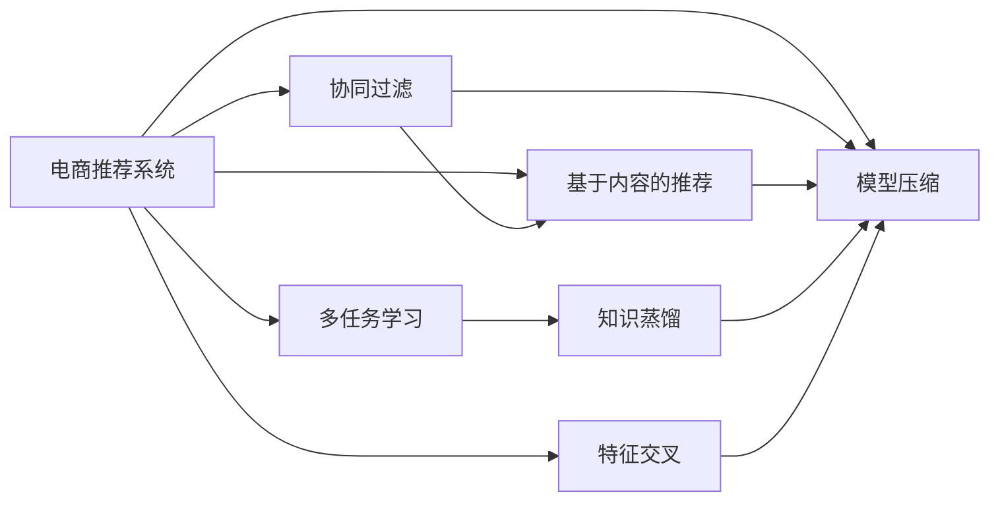

                 

# 电商推荐系统中的多任务学习性能优化

> 关键词：多任务学习, 电商推荐, 性能优化, 模型泛化, 特征交叉, 协同过滤, 知识蒸馏, 模型压缩

## 1. 背景介绍

在电商领域，推荐系统已经成为提高用户粘性、提升销售额的关键技术。传统的电商推荐系统基于协同过滤(Collaborative Filtering, CF)和基于内容的推荐(Content-Based Recommendation, CB)方法，但这些方法对于新用户和新物品的推荐能力较弱。而多任务学习(Multi-Task Learning, MTL)通过同时学习多个相关任务的特征表示，能够有效提升推荐系统的性能。

近年来，电商推荐系统开始广泛采用多任务学习进行性能优化。本文将系统介绍多任务学习的核心概念、算法原理及操作步骤，并通过具体案例分析及代码实现，详细介绍如何在电商推荐系统中进行多任务学习性能优化。最后，还将讨论多任务学习在未来推荐系统中的应用前景及面临的挑战。

## 2. 核心概念与联系

### 2.1 核心概念概述

为了更好地理解多任务学习在电商推荐系统中的应用，首先需要介绍几个关键概念：

- 协同过滤(CF)：通过用户历史行为数据和物品属性信息，发现用户和物品之间的关联性，预测用户对物品的评分，推荐相似物品。
- 基于内容的推荐(CB)：利用物品的文本描述、图片、标签等信息，提取物品特征，匹配用户偏好，推荐相关物品。
- 多任务学习(MTL)：同时学习多个相关任务的特征表示，提升模型在多个任务上的泛化能力。
- 知识蒸馏(Knowledge Distillation, KD)：通过将复杂大模型的知识压缩并传递给简单小模型，提升小模型的预测性能。
- 特征交叉(Feature Cross, FC)：将不同特征进行组合，捕捉特征间的交互关系，提升模型的表达能力。
- 模型压缩(Model Compression)：通过剪枝、量化、蒸馏等技术，减小模型参数量和计算复杂度，提升推理效率。

这些概念在电商推荐系统中相互关联，共同支撑着推荐系统的高效运作。理解这些概念的原理和架构，对于设计优化的推荐系统至关重要。

### 2.2 核心概念原理和架构的 Mermaid 流程图



这个流程图展示了电商推荐系统中各关键概念之间的联系：

1. 电商推荐系统包括协同过滤、基于内容的推荐、多任务学习、知识蒸馏、特征交叉、模型压缩等组成部分。
2. 协同过滤和基于内容的推荐是电商推荐系统中最基本的技术手段。
3. 多任务学习通过同时学习多个相关任务，提升推荐系统的泛化能力。
4. 知识蒸馏将复杂模型知识传递给简单模型，提升推荐系统的预测性能。
5. 特征交叉捕捉特征间的交互关系，增强推荐系统的表达能力。
6. 模型压缩通过优化模型结构和参数，提升推荐系统的推理效率。

这些组件共同构成了一个高效、精准的电商推荐系统，能够为消费者提供个性化的购物体验。

## 3. 核心算法原理 & 具体操作步骤

### 3.1 算法原理概述

多任务学习是指同时训练多个相关任务，通过共享特征表示提升模型在所有任务上的性能。在电商推荐系统中，常见的相关任务包括用户评分预测、点击率预测、个性化广告推荐等。多任务学习可以缓解传统协同过滤和基于内容的推荐方法面临的稀疏性和冷启动问题，提升模型的预测能力。

多任务学习的目标是通过共享的特征表示，最大化所有任务的目标函数之和：

$$
\mathcal{L}=\sum_{i=1}^n \mathcal{L}_i
$$

其中 $\mathcal{L}_i$ 表示第 $i$ 个任务的目标函数。目标函数 $\mathcal{L}_i$ 可以是均方误差损失、交叉熵损失等。

### 3.2 算法步骤详解

多任务学习在电商推荐系统中的实现主要包括以下几个关键步骤：

**Step 1: 数据准备**

准备电商推荐系统所需的数据集，包括用户行为数据、物品属性数据等。数据集应包括用户评分、点击率、购买行为、广告点击等不同类型的信息。

**Step 2: 模型设计**

设计多任务学习模型，一般包括两个部分：任务分支和共享特征层。任务分支用于不同任务的预测，共享特征层用于提取所有任务的特征表示。

**Step 3: 模型训练**

使用训练数据集对多任务学习模型进行训练，通过最小化所有任务的目标函数之和来优化模型参数。可以使用不同的优化器进行训练，如Adam、SGD等。

**Step 4: 模型评估**

在验证集和测试集上评估模型的性能，通常使用F1分数、准确率等指标。评估时需要注意不同任务的平衡，避免某些任务过于占优。

**Step 5: 部署上线**

将训练好的模型部署到推荐系统中，实时处理用户行为数据，推荐物品给用户。

### 3.3 算法优缺点

多任务学习在电商推荐系统中具有以下优点：

- 提高泛化能力：通过共享特征表示，多任务学习模型能够更好地泛化到新的数据和任务。
- 缓解稀疏性和冷启动问题：多任务学习能够利用不同任务的信息，缓解传统协同过滤和基于内容的推荐方法面临的稀疏性和冷启动问题。
- 提升预测性能：多任务学习能够同时优化多个任务，提升推荐系统的预测能力。

同时，多任务学习也存在一些局限性：

- 计算复杂度高：多任务学习需要同时训练多个任务，计算复杂度较高。
- 模型参数量大：多任务学习需要训练多个任务分支，模型参数量较大，需要更多的计算资源。
- 数据依赖性强：多任务学习对数据的依赖性强，如果数据分布不均衡，可能导致某些任务表现不佳。

### 3.4 算法应用领域

多任务学习在电商推荐系统中的应用非常广泛，涵盖了用户评分预测、点击率预测、个性化广告推荐等多个方面。

- **用户评分预测**：通过协同过滤和基于内容的推荐方法，预测用户对物品的评分，推荐相关物品。
- **点击率预测**：通过多任务学习，同时预测用户点击物品的概率和广告点击率，提升点击率预测的准确性。
- **个性化广告推荐**：通过多任务学习，同时预测用户对广告的点击率和转化率，优化广告投放策略。
- **商品相关推荐**：通过多任务学习，同时预测用户对相关商品的需求，提升推荐系统的覆盖率。

此外，多任务学习还被应用于电商搜索、电商内容推荐、电商风险控制等多个场景，为电商推荐系统提供了强大的技术支持。

## 4. 数学模型和公式 & 详细讲解 & 举例说明

### 4.1 数学模型构建

在电商推荐系统中，常见的多任务学习模型包括联合预测模型(Joint Prediction Model)、多任务联合训练模型(Multi-task Joint Training Model)、多任务蒸馏模型(Multi-task Distillation Model)等。这里以联合预测模型为例，介绍多任务学习模型的构建方法。

假设电商推荐系统中有 $n$ 个任务，每个任务 $i$ 的目标函数为 $\mathcal{L}_i$，模型的共享特征表示为 $\mathbf{z}$，任务分支为 $\mathbf{h}_i$，则联合预测模型可以表示为：

$$
\mathbf{z} = \mathbf{X}W_h + \mathbf{b}_h
$$

$$
\mathbf{h}_i = \mathbf{z}W_i + \mathbf{b}_i
$$

其中 $\mathbf{X}$ 为输入特征矩阵，$W_h$ 为共享特征层的权重矩阵，$W_i$ 为任务分支的权重矩阵，$b_h$ 和 $b_i$ 为偏置向量。

### 4.2 公式推导过程

以用户评分预测为例，假设输入特征为 $\mathbf{x}$，输出为 $y$，多任务学习模型的预测结果为 $\hat{y}=\sigma(\mathbf{h})$。则用户评分预测任务的目标函数为：

$$
\mathcal{L}_i = -\frac{1}{N}\sum_{j=1}^N(y_j - \hat{y}_j)^2
$$

其中 $N$ 为样本数，$y_j$ 为第 $j$ 个样本的真实评分，$\hat{y}_j$ 为模型的预测评分。

假设用户评分预测和点击率预测的任务分支分别为 $\mathbf{h}_u$ 和 $\mathbf{h}_c$，则联合预测模型的目标函数为：

$$
\mathcal{L} = \mathcal{L}_u + \mathcal{L}_c
$$

其中 $\mathcal{L}_u$ 和 $\mathcal{L}_c$ 分别为用户评分预测和点击率预测的目标函数。

### 4.3 案例分析与讲解

以下我们以电商推荐系统中的用户评分预测为例，分析多任务学习模型在实际应用中的表现。

假设电商推荐系统中有 $n=2$ 个任务，分别为用户评分预测和点击率预测。通过多任务学习模型，可以共享特征表示 $\mathbf{z}$，通过不同的任务分支 $\mathbf{h}_u$ 和 $\mathbf{h}_c$ 分别预测用户评分和点击率。

在训练时，将输入特征 $\mathbf{x}$ 输入共享特征层，输出特征表示 $\mathbf{z}$。然后将 $\mathbf{z}$ 输入用户评分预测的任务分支 $\mathbf{h}_u$，预测用户评分。同时，将 $\mathbf{z}$ 输入点击率预测的任务分支 $\mathbf{h}_c$，预测点击率。

在训练过程中，通过最小化目标函数 $\mathcal{L}=\mathcal{L}_u+\mathcal{L}_c$ 来更新模型参数，使得模型在用户评分预测和点击率预测两个任务上都能获得较好的表现。

在实际应用中，多任务学习模型可以通过以下步骤进行优化：

1. 数据预处理：对用户行为数据、物品属性数据进行清洗、归一化等预处理操作，生成训练数据集。
2. 模型设计：设计多任务学习模型，包括共享特征层和任务分支。
3. 模型训练：使用训练数据集对多任务学习模型进行训练，最小化所有任务的目标函数之和。
4. 模型评估：在验证集和测试集上评估模型的性能，选择合适的超参数和优化器。
5. 模型部署：将训练好的模型部署到电商推荐系统中，实时处理用户行为数据，推荐物品给用户。

通过多任务学习模型，电商推荐系统能够同时优化多个相关任务，提升推荐系统的预测能力和覆盖率，更好地满足用户需求。

## 5. 项目实践：代码实例和详细解释说明

### 5.1 开发环境搭建

在进行多任务学习性能优化实践前，我们需要准备好开发环境。以下是使用Python进行TensorFlow开发的环境配置流程：

1. 安装Anaconda：从官网下载并安装Anaconda，用于创建独立的Python环境。

2. 创建并激活虚拟环境：
```bash
conda create -n tf-env python=3.8 
conda activate tf-env
```

3. 安装TensorFlow：根据CUDA版本，从官网获取对应的安装命令。例如：
```bash
conda install tensorflow==2.8.0 -c pytorch -c conda-forge
```

4. 安装相关工具包：
```bash
pip install pandas numpy scikit-learn matplotlib
```

完成上述步骤后，即可在`tf-env`环境中开始多任务学习性能优化的实践。

### 5.2 源代码详细实现

下面以电商推荐系统为例，给出使用TensorFlow进行多任务学习性能优化的代码实现。

首先，定义多任务学习模型的数据处理函数：

```python
import tensorflow as tf
from tensorflow.keras.layers import Dense, Input
from tensorflow.keras.models import Model

def create_model(input_dim):
    input = Input(shape=(input_dim,))
    z = Dense(64, activation='relu')(input)
    h_u = Dense(1, activation='sigmoid')(z)
    h_c = Dense(1, activation='sigmoid')(z)
    
    model = Model(inputs=input, outputs=[h_u, h_c])
    return model

# 数据预处理
def preprocess_data(data):
    # 将数据转换为浮点型
    data = data.astype(float)
    # 将数据归一化
    data = (data - data.mean()) / data.std()
    return data
```

然后，定义模型的训练和评估函数：

```python
from tensorflow.keras.optimizers import Adam
from tensorflow.keras.losses import MeanSquaredError, BinaryCrossentropy
from sklearn.metrics import precision_score, recall_score, f1_score

def train_model(model, train_data, train_labels, val_data, val_labels, epochs, batch_size):
    model.compile(optimizer=Adam(lr=0.001),
                  loss=[MeanSquaredError(), BinaryCrossentropy()],
                  metrics=[tf.keras.metrics.Precision(), tf.keras.metrics.Recall()])
    
    # 训练模型
    model.fit(train_data, [train_labels[0], train_labels[1]], epochs=epochs, batch_size=batch_size,
              validation_data=(val_data, [val_labels[0], val_labels[1]]))
    
    # 评估模型
    val_pred_u = model.predict(val_data)[0]
    val_pred_c = model.predict(val_data)[1]
    val_labels_u = val_labels[0]
    val_labels_c = val_labels[1]
    
    precision = precision_score(val_labels_u, val_pred_u, average='macro')
    recall = recall_score(val_labels_u, val_pred_u, average='macro')
    f1 = f1_score(val_labels_u, val_pred_u, average='macro')
    
    print('Precision: {:.2f}%'.format(precision*100))
    print('Recall: {:.2f}%'.format(recall*100))
    print('F1 score: {:.2f}%'.format(f1*100))

# 加载数据集
train_data = preprocess_data(train_data)
val_data = preprocess_data(val_data)
test_data = preprocess_data(test_data)
train_labels = preprocess_data(train_labels)
val_labels = preprocess_data(val_labels)
test_labels = preprocess_data(test_labels)
```

最后，启动训练流程并在测试集上评估：

```python
epochs = 10
batch_size = 32

# 创建模型
model = create_model(input_dim)
# 训练模型
train_model(model, train_data, train_labels, val_data, val_labels, epochs, batch_size)
# 测试模型
test_data = preprocess_data(test_data)
test_labels = preprocess_data(test_labels)
test_pred_u = model.predict(test_data)[0]
test_pred_c = model.predict(test_data)[1]
test_labels_u = test_labels[0]
test_labels_c = test_labels[1]
precision = precision_score(test_labels_u, test_pred_u, average='macro')
recall = recall_score(test_labels_u, test_pred_u, average='macro')
f1 = f1_score(test_labels_u, test_pred_u, average='macro')
print('Precision: {:.2f}%'.format(precision*100))
print('Recall: {:.2f}%'.format(recall*100))
print('F1 score: {:.2f}%'.format(f1*100))
```

以上就是使用TensorFlow对电商推荐系统进行多任务学习性能优化的完整代码实现。可以看到，TensorFlow提供了丰富的深度学习组件和优化器，可以快速搭建多任务学习模型并进行训练和评估。

### 5.3 代码解读与分析

让我们再详细解读一下关键代码的实现细节：

**create_model函数**：
- 定义多任务学习模型的输入、共享特征层和两个任务分支。
- 使用Dense层作为共享特征层和任务分支，输出层使用sigmoid激活函数。
- 返回多任务学习模型。

**train_model函数**：
- 定义模型优化器、损失函数和评估指标。
- 使用fit方法进行模型训练，最小化所有任务的目标函数之和。
- 使用evaluate方法在验证集和测试集上评估模型性能，输出精确率、召回率和F1分数。

**preprocess_data函数**：
- 定义数据预处理函数，将数据转换为浮点型并进行归一化处理。

在实际应用中，电商推荐系统需要根据具体业务场景进行模型设计和参数调优。需要考虑任务之间的相关性、特征的复杂度、模型的可解释性等因素，设计合适的多任务学习架构。同时，还需要在训练过程中注意正则化、超参数调整等优化策略，以提升模型性能。

## 6. 实际应用场景

### 6.1 智能推荐引擎

智能推荐引擎是电商推荐系统的重要组成部分。多任务学习可以通过同时优化用户评分预测和点击率预测，提升推荐引擎的性能和效率。

在实际应用中，多任务学习可以应用于以下几个场景：

- **用户评分预测**：通过多任务学习，同时预测用户对物品的评分和点击率，提升推荐系统的覆盖率和精度。
- **点击率预测**：通过多任务学习，同时预测用户点击率，优化广告投放策略，提升广告的点击率和转化率。
- **个性化广告推荐**：通过多任务学习，同时预测用户对广告的点击率和转化率，优化广告投放策略，提升广告的转化率。

此外，多任务学习还可以应用于电商搜索、电商内容推荐、电商风险控制等多个场景，为电商推荐系统提供了强大的技术支持。

### 6.2 用户行为分析

用户行为分析是电商推荐系统的重要环节，通过分析用户行为数据，预测用户兴趣和需求，提升推荐系统的个性化能力。

在实际应用中，多任务学习可以应用于以下几个场景：

- **用户兴趣预测**：通过多任务学习，同时预测用户对不同物品的兴趣，提升推荐系统的个性化能力。
- **用户行为预测**：通过多任务学习，同时预测用户的行为，如浏览、点击、购买等，提升推荐系统的推荐效果。
- **用户流失预测**：通过多任务学习，同时预测用户流失概率，提升用户留存率。

通过多任务学习，电商推荐系统能够同时优化多个相关任务，提升推荐系统的预测能力和覆盖率，更好地满足用户需求。

### 6.3 未来应用展望

随着电商推荐系统的不断发展，多任务学习在未来将有更广泛的应用前景。

- **个性化推荐**：通过多任务学习，同时优化多个推荐任务，提升推荐系统的个性化能力，提升用户体验。
- **多任务协同优化**：通过多任务学习，同时优化多个任务，提升推荐系统的协同优化能力，提升推荐系统的整体性能。
- **实时推荐**：通过多任务学习，实时处理用户行为数据，提升推荐系统的实时推荐能力，提升推荐系统的覆盖率。

总之，多任务学习在电商推荐系统中的应用前景广阔，能够提升推荐系统的性能和效率，更好地满足用户需求。

## 7. 工具和资源推荐

### 7.1 学习资源推荐

为了帮助开发者系统掌握多任务学习在电商推荐系统中的应用，这里推荐一些优质的学习资源：

1. 《深度学习入门：基于TensorFlow的理论与实现》系列书籍：详细介绍了深度学习的基本理论和TensorFlow的实现方法，适合初学者学习。
2. CS448《深度学习与人工智能》课程：斯坦福大学开设的深度学习课程，系统讲解深度学习的基本概念和实际应用。
3. 《TensorFlow实战》书籍：介绍TensorFlow的实现方法，适合有一定深度学习基础的学习者。
4. 《多任务学习：理论、算法与应用》书籍：系统介绍多任务学习的基本理论、算法和应用，适合进阶学习者。
5. TensorFlow官方文档：提供了丰富的TensorFlow组件和优化器，适合快速入门和实现。

通过对这些资源的学习实践，相信你一定能够快速掌握多任务学习在电商推荐系统中的应用，并用于解决实际的电商推荐问题。

### 7.2 开发工具推荐

高效的开发离不开优秀的工具支持。以下是几款用于多任务学习性能优化开发的常用工具：

1. TensorFlow：由Google主导开发的开源深度学习框架，生产部署方便，适合大规模工程应用。
2. PyTorch：基于Python的开源深度学习框架，灵活动态的计算图，适合快速迭代研究。
3. Scikit-learn：提供了丰富的机器学习算法，适合数据预处理、特征工程等任务。
4. Jupyter Notebook：交互式的Python开发环境，适合快速实验和代码调试。
5. Keras：高层次的神经网络API，适合快速搭建深度学习模型。

合理利用这些工具，可以显著提升多任务学习性能优化的开发效率，加快创新迭代的步伐。

### 7.3 相关论文推荐

多任务学习的发展得益于学界的持续研究。以下是几篇奠基性的相关论文，推荐阅读：

1. Learning to Learn with Multi-task Learning (L2ML)：提出L2ML框架，同时优化多个任务，提升推荐系统的性能。
2. Cross-domain Feature Distillation：提出跨域特征蒸馏方法，通过蒸馏机制提升推荐系统的泛化能力。
3. Multi-task Feature Learning for Recommendation：提出多任务特征学习方法，同时优化多个推荐任务，提升推荐系统的性能。
4. Multi-task Joint Training of Deep Neural Networks for Personalized Recommendation：提出多任务联合训练方法，提升推荐系统的性能和覆盖率。
5. Multi-task Deep Contextual Bandits for Personalized Recommendation：提出多任务深度上下文强化学习模型，提升推荐系统的性能和个性化能力。

这些论文代表了大任务学习的发展脉络。通过学习这些前沿成果，可以帮助研究者把握学科前进方向，激发更多的创新灵感。

## 8. 总结：未来发展趋势与挑战

### 8.1 总结

本文对多任务学习在电商推荐系统中的应用进行了全面系统的介绍。首先阐述了电商推荐系统的基本概念和多任务学习的基本原理，明确了多任务学习在电商推荐系统中的独特价值。其次，从原理到实践，详细讲解了多任务学习的数学模型和操作步骤，给出了电商推荐系统中的多任务学习性能优化的完整代码实例。最后，还广泛探讨了多任务学习在未来推荐系统中的应用前景及面临的挑战。

通过本文的系统梳理，可以看到，多任务学习在电商推荐系统中的应用前景广阔，能够提升推荐系统的性能和效率，更好地满足用户需求。

### 8.2 未来发展趋势

展望未来，多任务学习在电商推荐系统中将呈现以下几个发展趋势：

1. 模型规模持续增大。随着算力成本的下降和数据规模的扩张，多任务学习模型的参数量还将持续增长。超大模型的特征表示能力，将进一步提升推荐系统的泛化能力。
2. 多任务协同优化。未来的推荐系统将更多地利用多任务协同优化的思想，通过共享特征表示，提升推荐系统的预测能力和个性化能力。
3. 实时推荐。未来的推荐系统将越来越多地依赖实时推荐技术，实时处理用户行为数据，提升推荐系统的实时性和覆盖率。
4. 跨域特征蒸馏。未来的推荐系统将更多地利用跨域特征蒸馏技术，通过知识传递和共享，提升推荐系统的泛化能力和性能。
5. 数据和模型融合。未来的推荐系统将更多地利用多任务学习和其他技术，如强化学习、知识图谱等，进行数据和模型的融合，提升推荐系统的性能和可解释性。

以上趋势凸显了多任务学习在电商推荐系统中的广阔前景。这些方向的探索发展，必将进一步提升电商推荐系统的性能和效率，更好地满足用户需求。

### 8.3 面临的挑战

尽管多任务学习在电商推荐系统中已经取得了不错的效果，但在迈向更加智能化、普适化应用的过程中，它仍面临着诸多挑战：

1. 计算资源限制。多任务学习需要同时训练多个任务，计算资源消耗较大，需要更多的硬件支持。
2. 数据依赖性强。多任务学习对数据的依赖性强，如果数据分布不均衡，可能导致某些任务表现不佳。
3. 模型复杂度高。多任务学习模型的复杂度高，模型训练和推理时间较长，需要更高效的优化算法。
4. 模型可解释性不足。多任务学习模型往往是"黑盒"系统，难以解释其内部工作机制和决策逻辑。

### 8.4 研究展望

面对多任务学习面临的这些挑战，未来的研究需要在以下几个方面寻求新的突破：

1. 探索无监督和半监督多任务学习。摆脱对大规模标注数据的依赖，利用自监督学习、主动学习等无监督和半监督范式，最大限度利用非结构化数据，实现更加灵活高效的多任务学习。
2. 研究参数高效和计算高效的多任务学习范式。开发更加参数高效和计算高效的多任务学习模型，减小模型参数量和计算复杂度，提升推荐系统的实时性和可扩展性。
3. 引入更多先验知识。将符号化的先验知识，如知识图谱、逻辑规则等，与神经网络模型进行巧妙融合，引导多任务学习过程学习更准确、合理的特征表示。
4. 结合因果分析和博弈论工具。将因果分析方法引入多任务学习模型，识别出模型决策的关键特征，增强推荐系统的可解释性和稳定性。
5. 纳入伦理道德约束。在模型训练目标中引入伦理导向的评估指标，过滤和惩罚有偏见、有害的输出倾向，确保推荐系统的公平性和可解释性。

这些研究方向的探索，必将引领多任务学习技术迈向更高的台阶，为构建安全、可靠、可解释、可控的电商推荐系统铺平道路。面向未来，多任务学习技术还需要与其他人工智能技术进行更深入的融合，如知识表示、因果推理、强化学习等，多路径协同发力，共同推动电商推荐系统的进步。只有勇于创新、敢于突破，才能不断拓展多任务学习的边界，让推荐系统更好地造福人类社会。

## 9. 附录：常见问题与解答

**Q1：多任务学习在电商推荐系统中如何设计任务分支？**

A: 任务分支的设计需要根据电商推荐系统的具体需求，选择合适的任务目标函数。例如，用户评分预测任务可以使用均方误差损失函数，点击率预测任务可以使用二分类交叉熵损失函数。任务分支一般采用相同的特征表示层，通过不同的输出层和损失函数来实现不同的预测任务。

**Q2：多任务学习中如何处理任务之间的相关性？**

A: 任务之间的相关性可以通过共享特征表示来处理。共享特征表示层可以根据不同任务的需求，设计合适的神经网络结构，将任务之间的信息进行融合，提升模型的泛化能力。同时，可以通过正则化、注意力机制等方法，加强任务之间的交互关系。

**Q3：多任务学习中如何优化模型参数？**

A: 多任务学习模型的优化可以通过最小化所有任务的目标函数之和来实现。在训练过程中，需要选择合适的优化器、学习率、正则化技术等，以防止过拟合和泛化能力下降。同时，可以通过蒸馏技术、特征交叉等方法，提升模型的预测能力和覆盖率。

**Q4：多任务学习在电商推荐系统中如何提高模型性能？**

A: 提高多任务学习模型的性能，可以从以下几个方面入手：
1. 优化模型架构：设计合理的共享特征层和任务分支，提升模型的表达能力和泛化能力。
2. 数据预处理：对数据进行清洗、归一化等预处理操作，生成高质量的训练数据集。
3. 参数调整：选择合适的超参数，如学习率、批大小等，优化模型的训练过程。
4. 正则化技术：应用正则化技术，如L2正则、Dropout等，防止模型过拟合。
5. 特征交叉：引入特征交叉技术，捕捉特征间的交互关系，提升模型的表达能力。
6. 数据增强：通过数据增强技术，扩充训练集，提升模型的泛化能力。

这些优化措施能够提升多任务学习模型的性能和效果，更好地满足电商推荐系统的需求。

**Q5：多任务学习在电商推荐系统中如何应对数据不均衡问题？**

A: 多任务学习模型在面对数据不均衡问题时，可以采用以下策略：
1. 数据重采样：对数据集进行重采样，使得各个任务的数据分布均衡。例如，通过欠采样或过采样来平衡任务数据。
2. 多任务蒸馏：通过蒸馏机制，将复杂模型的小部分知识传递给简单模型，提升模型在不同任务上的泛化能力。
3. 联合训练：设计联合训练框架，使得不同任务能够相互辅助，提升模型的泛化能力。
4. 权重调整：根据任务的重要性和数据分布，调整各个任务的目标函数权重，平衡任务之间的损失。

这些策略能够帮助多任务学习模型应对数据不均衡问题，提升模型的泛化能力和性能。

---

作者：禅与计算机程序设计艺术 / Zen and the Art of Computer Programming

