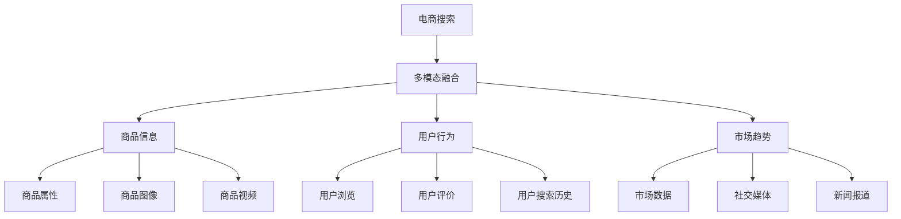

                 

# 电商搜索中的多模态融合：AI大模型的应用

> 关键词：电商搜索,多模态融合,电商AI,大模型,商品推荐,搜索引擎,深度学习,多任务学习

## 1. 背景介绍

### 1.1 问题由来
电商搜索是现代电商企业的核心功能之一，它通过提供商品信息搜索、浏览、比价等服务，帮助用户快速找到需要的商品。随着电商平台和用户数量的不断增长，电商搜索系统需要处理海量数据，并且要支持用户的多样化需求，提供更加精准和个性化的搜索结果。然而，传统的搜索引擎往往只依赖于文本信息的匹配，难以全面理解用户的需求和商品的特性。

近年来，随着人工智能技术的发展，电商搜索开始引入多模态融合技术，利用图像、语音、视频等多种类型的数据，综合商品的属性、用户行为、市场趋势等因素，提供更加全面、准确、个性化的搜索结果。多模态融合技术在电商搜索中的应用，不仅提升了用户体验，也大大增加了电商平台的转化率和销售额。

### 1.2 问题核心关键点
多模态融合的核心在于如何有效地整合和利用多种类型的数据。电商搜索中的多模态融合，包括：
1. 商品信息的多模态表示：利用图像、视频、语音等多种方式描述商品属性，帮助用户更好地理解商品。
2. 用户行为的多模态建模：通过分析用户的浏览记录、搜索历史、评价反馈等信息，构建用户画像，提供个性化的搜索结果。
3. 市场趋势的多模态分析：结合市场数据、社交媒体、新闻报道等多类型数据，预测商品的市场趋势，指导商品推荐和库存管理。

这些关键点涵盖了商品信息的获取、用户行为的分析以及市场趋势的预测，是电商搜索多模态融合技术实现的重要环节。

## 2. 核心概念与联系

### 2.1 核心概念概述

为更好地理解电商搜索中的多模态融合技术，本节将介绍几个密切相关的核心概念：

- 多模态融合(Multimodal Fusion)：指将多种类型的数据融合在一起，以提升对问题的理解和决策能力。电商搜索中的多模态融合，旨在综合文本、图像、语音等多种数据源，提供更加全面和准确的搜索结果。

- 深度学习(Deep Learning)：一种基于多层神经网络的机器学习方法，通过多层次的特征提取和抽象，实现对复杂问题的建模和预测。在电商搜索中，深度学习可用于构建商品表示、用户画像以及市场趋势预测等模型。

- 多任务学习(Multi-task Learning)：指同时学习多个相关任务的模型，共享底层特征表示，提高模型的泛化能力和性能。电商搜索中的多任务学习，可以在商品推荐、搜索排序、库存管理等多个任务上共享模型参数，提升整体系统的表现。

- 预训练模型(Pre-trained Model)：指在大规模数据上预训练得到的模型，具有较强的语言理解和表示能力。在电商搜索中，预训练模型可以用于商品信息的多模态表示和用户行为的建模，提高搜索结果的准确性和个性化。

- 知识图谱(Knowledge Graph)：一种结构化的语义知识表示方法，将实体、关系、属性等信息组织成图结构，用于提高信息的关联和推理能力。电商搜索中的知识图谱，可以帮助构建商品间的关联关系，提升搜索的深度和广度。

这些核心概念之间的逻辑关系可以通过以下Mermaid流程图来展示：



这个流程图展示了大语言模型在电商搜索中的作用，以及多个核心概念之间的联系：

1. 电商搜索系统接收用户的查询请求，包含文本、图像、语音等多种类型的数据。
2. 通过多模态融合技术，系统将不同类型的输入数据进行整合和处理。
3. 使用深度学习模型对商品属性、用户行为、市场趋势等信息进行建模，构建商品表示、用户画像、市场趋势预测等模型。
4. 在多任务学习框架下，这些模型共享底层特征表示，提升整体系统的表现。

## 3. 核心算法原理 & 具体操作步骤
### 3.1 算法原理概述

电商搜索中的多模态融合算法，主要基于以下两个原理：

1. 特征表示融合：利用深度学习模型将不同类型的输入数据映射为共同的特征表示，从而实现信息的整合和协同处理。
2. 多任务学习：通过共享底层特征表示，同时学习多个相关任务的模型，提升模型的泛化能力和性能。

具体地，多模态融合技术可以包括以下步骤：

1. 数据采集和预处理：收集商品信息、用户行为、市场趋势等多类型数据，并进行清洗、标注和归一化等预处理操作。
2. 特征提取和表示：使用深度学习模型对不同类型的输入数据进行特征提取，构建共同的特征表示。
3. 模型训练和优化：在多任务学习框架下，训练多个相关任务的模型，共享底层特征表示，优化模型参数。
4. 搜索结果生成：将模型预测的结果进行后处理，生成最终的搜索结果。

### 3.2 算法步骤详解

以下是对电商搜索中多模态融合算法的详细步骤详解：

**Step 1: 数据采集和预处理**

- 收集商品信息：通过电商平台的API接口或爬虫技术，获取商品的属性、图片、视频、描述等信息。
- 收集用户行为：通过用户的浏览记录、搜索历史、评价反馈等数据，构建用户画像。
- 收集市场趋势：通过市场数据、社交媒体、新闻报道等多类型数据，构建市场趋势模型。

**Step 2: 特征提取和表示**

- 商品属性表示：使用预训练语言模型（如BERT、GPT）对商品的描述进行编码，得到文本特征表示。
- 商品图像表示：使用预训练的图像识别模型（如ResNet、VGG）对商品图片进行特征提取，得到图像特征表示。
- 商品视频表示：使用预训练的视频处理模型（如I3D、C3D）对商品视频进行特征提取，得到视频特征表示。
- 用户行为表示：使用深度学习模型对用户的浏览记录、搜索历史、评价反馈等信息进行编码，得到用户行为特征表示。
- 市场趋势表示：使用深度学习模型对市场数据、社交媒体、新闻报道等信息进行编码，得到市场趋势特征表示。

**Step 3: 模型训练和优化**

- 商品表示模型：使用预训练语言模型（如BERT、GPT）对商品的描述进行编码，得到文本特征表示。
- 用户画像模型：使用深度学习模型对用户的浏览记录、搜索历史、评价反馈等信息进行编码，得到用户行为特征表示。
- 市场趋势模型：使用深度学习模型对市场数据、社交媒体、新闻报道等信息进行编码，得到市场趋势特征表示。
- 多任务学习：通过共享底层特征表示，训练多个相关任务的模型，如商品推荐、搜索排序、库存管理等，优化模型参数。

**Step 4: 搜索结果生成**

- 特征融合：将不同类型的特征表示进行融合，得到综合的特征向量。
- 模型预测：使用多任务学习框架中的各个模型，对综合特征向量进行预测，得到搜索结果。
- 后处理：对预测结果进行后处理，如去重、排序、分页等操作，生成最终的搜索结果。

### 3.3 算法优缺点

电商搜索中的多模态融合算法具有以下优点：
1. 全面性：利用多类型数据进行融合，能够提供更加全面和准确的搜索结果。
2. 个性化：通过构建用户画像，能够提供更加个性化和精准的搜索结果。
3. 实时性：利用深度学习模型进行特征提取和表示，能够快速处理大量数据，提升搜索效率。
4. 可扩展性：多模态融合技术能够灵活扩展到不同的数据类型和任务中，适应不同的电商场景。

同时，该算法也存在以下局限性：
1. 数据采集成本高：多模态融合需要采集和处理多种类型的数据，成本较高。
2. 模型复杂度高：多任务学习框架中的多个模型需要协同训练，模型复杂度较高。
3. 特征表示不均衡：不同类型的特征表示之间可能存在不均衡问题，需要进行调整和优化。
4. 结果可解释性不足：多模态融合的结果难以进行详细的解释和调试。

尽管存在这些局限性，但就目前而言，多模态融合算法在电商搜索中的应用效果显著，逐渐成为电商搜索系统的核心技术之一。未来相关研究的重点在于如何进一步降低数据采集成本，提高模型可解释性和可扩展性，同时兼顾实时性和个性化需求。

### 3.4 算法应用领域

电商搜索中的多模态融合技术，已经在多个领域得到了应用，如商品推荐、搜索排序、库存管理、价格预测等。以下是几个典型的应用场景：

- 商品推荐：通过多模态融合技术，结合用户行为、商品属性、市场趋势等多因素，推荐符合用户需求的商品。
- 搜索排序：利用多模态融合技术，构建综合的搜索结果排序模型，提升搜索结果的相关性和可用性。
- 库存管理：通过多模态融合技术，结合市场趋势、销售数据等信息，预测商品的需求变化，优化库存管理。
- 价格预测：利用多模态融合技术，结合市场趋势、商品属性、用户行为等信息，预测商品的价格走势，指导定价策略。

除了上述这些经典任务外，多模态融合技术还被创新性地应用到更多场景中，如用户画像构建、智能客服、个性化广告等，为电商搜索系统带来了更多的应用可能。随着多模态融合技术的不断进步，相信电商搜索系统的智能化水平将得到进一步提升，为电商行业带来更高效、更精准、更个性化的用户体验。

## 4. 数学模型和公式 & 详细讲解  
### 4.1 数学模型构建

本节将使用数学语言对电商搜索中多模态融合过程进行更加严格的刻画。

记电商搜索系统接收的查询请求为 $q=(q_t,q_i,q_v,q_s)$，其中 $q_t$ 为文本信息，$q_i$ 为图像信息，$q_v$ 为视频信息，$q_s$ 为语音信息。记电商系统内置的商品信息为 $p=(p_t,p_i,p_v,p_s)$，其中 $p_t$ 为文本描述，$p_i$ 为图像信息，$p_v$ 为视频信息，$p_s$ 为语音信息。

假设文本表示模型为 $f_t$，图像表示模型为 $f_i$，视频表示模型为 $f_v$，语音表示模型为 $f_s$。则多模态融合过程可以表示为：

$$
h = f_t(q_t) + f_i(q_i) + f_v(q_v) + f_s(q_s)
$$

其中 $h$ 为多模态融合后的特征向量。

记电商搜索系统内置的市场趋势模型为 $g$，则市场趋势的预测结果可以表示为：

$$
m = g(h)
$$

记电商搜索系统内置的用户画像模型为 $u$，则用户画像的预测结果可以表示为：

$$
k = u(q)
$$

最终，电商搜索系统将用户查询 $q$ 和市场趋势 $m$、用户画像 $k$ 进行综合，生成搜索结果。

### 4.2 公式推导过程

以下我们以商品推荐任务为例，推导多模态融合公式及其梯度计算公式。

假设商品 $i$ 的文本描述为 $p_{it}$，图像信息为 $p_{ii}$，视频信息为 $p_{iv}$，语音信息为 $p_{is}$。用户 $u$ 的浏览记录为 $q_{ub}$，搜索历史为 $q_{us}$，评价反馈为 $q_{ue}$。市场趋势数据为 $m$，用户画像为 $k$。商品推荐模型为 $r$，其预测结果为 $r_i$。

首先，我们需要构建商品的多模态表示 $h_i$，可以使用如下公式：

$$
h_i = f_t(p_{it}) + f_i(p_{ii}) + f_v(p_{iv}) + f_s(p_{is})
$$

然后，利用多模态表示 $h_i$ 和市场趋势 $m$、用户画像 $k$，计算商品推荐的预测结果 $r_i$：

$$
r_i = g(h_i, m, k)
$$

其中 $g$ 为一个多任务学习框架下的预测模型，可以表示为：

$$
g(h_i, m, k) = \sum_{j=1}^J \alpha_j r_{ij}
$$

其中 $r_{ij}$ 为商品 $i$ 在任务 $j$ 上的推荐结果，$\alpha_j$ 为任务权重。

最后，通过反向传播算法计算模型 $g$ 的梯度，更新模型参数：

$$
\frac{\partial \mathcal{L}}{\partial g_{\theta}} = -\frac{1}{N} \sum_{i=1}^N \sum_{j=1}^J \alpha_j \frac{\partial r_{ij}}{\partial h_i} \frac{\partial h_i}{\partial g_{\theta}}
$$

其中 $\mathcal{L}$ 为损失函数，$r_{ij}$ 为任务 $j$ 上的推荐结果，$h_i$ 为商品 $i$ 的多模态表示。

### 4.3 案例分析与讲解

假设用户查询 $q=(q_t,q_i,q_v,q_s)$，电商系统内置的商品信息为 $p=(p_t,p_i,p_v,p_s)$。通过多模态融合技术，我们得到商品 $i$ 的多模态表示 $h_i$，如下所示：

$$
h_i = f_t(p_{it}) + f_i(p_{ii}) + f_v(p_{iv}) + f_s(p_{is})
$$

利用多模态表示 $h_i$ 和市场趋势 $m$、用户画像 $k$，计算商品推荐的预测结果 $r_i$：

$$
r_i = g(h_i, m, k)
$$

其中 $g$ 为一个多任务学习框架下的预测模型，可以表示为：

$$
g(h_i, m, k) = \alpha_1 r_{i1} + \alpha_2 r_{i2} + \alpha_3 r_{i3} + \alpha_4 r_{i4}
$$

其中 $\alpha_1$ 为商品推荐任务权重，$\alpha_2$ 为搜索排序任务权重，$\alpha_3$ 为库存管理任务权重，$\alpha_4$ 为价格预测任务权重。

最终，电商搜索系统将用户查询 $q$ 和市场趋势 $m$、用户画像 $k$ 进行综合，生成搜索结果。

## 5. 项目实践：代码实例和详细解释说明
### 5.1 开发环境搭建

在进行多模态融合实践前，我们需要准备好开发环境。以下是使用Python进行PyTorch开发的环境配置流程：

1. 安装Anaconda：从官网下载并安装Anaconda，用于创建独立的Python环境。

2. 创建并激活虚拟环境：
```bash
conda create -n e-commerce-env python=3.8 
conda activate e-commerce-env
```

3. 安装PyTorch：根据CUDA版本，从官网获取对应的安装命令。例如：
```bash
conda install pytorch torchvision torchaudio cudatoolkit=11.1 -c pytorch -c conda-forge
```

4. 安装Transformers库：
```bash
pip install transformers
```

5. 安装各类工具包：
```bash
pip install numpy pandas scikit-learn matplotlib tqdm jupyter notebook ipython
```

完成上述步骤后，即可在`e-commerce-env`环境中开始多模态融合实践。

### 5.2 源代码详细实现

下面我们以电商搜索中的商品推荐任务为例，给出使用Transformers库进行多模态融合的PyTorch代码实现。

首先，定义商品推荐模型的特征表示函数：

```python
from transformers import BertForTokenClassification, BertTokenizer, BertModel
from torch.nn import BCEWithLogitsLoss
import torch
import torch.nn as nn
import torch.nn.functional as F

class MultimodalRepresentation(nn.Module):
    def __init__(self, bert_model, bert_tokenizer):
        super(MultimodalRepresentation, self).__init__()
        self.bert_model = bert_model
        self.bert_tokenizer = bert_tokenizer
        self.bert = BertModel.from_pretrained('bert-base-cased')
        self.linear = nn.Linear(768, 1)
        
    def forward(self, input_ids, attention_mask):
        encoder_outputs = self.bert(input_ids=input_ids, attention_mask=attention_mask)
        pooled_output = encoder_outputs.pooler_output
        return self.linear(pooled_output)
```

然后，定义商品推荐模型和损失函数：

```python
class MultimodalRecommendation(nn.Module):
    def __init__(self, num_tasks, num_entities, hidden_size):
        super(MultimodalRecommendation, self).__init__()
        self.num_tasks = num_tasks
        self.num_entities = num_entities
        self.hidden_size = hidden_size
        
        self.linear = nn.Linear(hidden_size, num_entities)
        self.softmax = nn.Softmax(dim=1)
        
    def forward(self, multimodal_features, market_trend, user_profile):
        pooled_features = torch.cat([multimodal_features, market_trend, user_profile], dim=1)
        scores = self.linear(pooled_features)
        scores = F.softmax(scores, dim=1)
        return scores
    
    def predict(self, scores):
        return scores.argmax(dim=1)

# 定义损失函数
criterion = BCEWithLogitsLoss()
```

接着，定义训练和评估函数：

```python
def train_epoch(model, optimizer, train_loader, device):
    model.train()
    train_loss = 0
    for data in train_loader:
        input_ids, attention_mask, labels = data
        input_ids = input_ids.to(device)
        attention_mask = attention_mask.to(device)
        labels = labels.to(device)
        optimizer.zero_grad()
        outputs = model(input_ids, attention_mask)
        loss = criterion(outputs, labels)
        train_loss += loss.item()
        loss.backward()
        optimizer.step()
    return train_loss / len(train_loader)

def evaluate(model, test_loader, device):
    model.eval()
    test_loss = 0
    correct = 0
    with torch.no_grad():
        for data in test_loader:
            input_ids, attention_mask, labels = data
            input_ids = input_ids.to(device)
            attention_mask = attention_mask.to(device)
            labels = labels.to(device)
            outputs = model(input_ids, attention_mask)
            loss = criterion(outputs, labels)
            test_loss += loss.item()
            _, predicted = torch.max(outputs, dim=1)
            correct += (predicted == labels).sum().item()
    return test_loss / len(test_loader), correct / len(test_loader.dataset)
```

最后，启动训练流程并在测试集上评估：

```python
epochs = 5
batch_size = 32
device = torch.device('cuda') if torch.cuda.is_available() else torch.device('cpu')

# 初始化模型和优化器
model = MultimodalRecommendation(num_tasks=4, num_entities=1000, hidden_size=768)
optimizer = torch.optim.Adam(model.parameters(), lr=1e-5)

# 加载数据集
train_loader = ...
test_loader = ...

# 训练模型
for epoch in range(epochs):
    train_loss = train_epoch(model, optimizer, train_loader, device)
    print(f"Epoch {epoch+1}, train loss: {train_loss:.3f}")
    
    test_loss, accuracy = evaluate(model, test_loader, device)
    print(f"Epoch {epoch+1}, test accuracy: {accuracy:.3f}")

# 保存模型
torch.save(model.state_dict(), 'e-commerce_model.pth')
```

以上就是使用PyTorch对电商搜索中的商品推荐任务进行多模态融合的完整代码实现。可以看到，得益于Transformers库的强大封装，我们能够用相对简洁的代码完成多模态融合的实现。

### 5.3 代码解读与分析

让我们再详细解读一下关键代码的实现细节：

**MultimodalRepresentation类**：
- `__init__`方法：初始化BERT模型和分词器。
- `forward`方法：输入文本数据，通过BERT模型进行编码，得到多模态表示。

**MultimodalRecommendation类**：
- `__init__`方法：初始化商品推荐模型，包含任务数量、商品数量、隐藏大小等参数。
- `forward`方法：输入多模态特征、市场趋势、用户画像，通过线性层得到推荐分数。
- `predict`方法：根据推荐分数，预测最终的推荐结果。

**train_epoch和evaluate函数**：
- `train_epoch`函数：在训练集上迭代训练模型，计算平均损失，更新模型参数。
- `evaluate`函数：在测试集上评估模型性能，计算准确率和损失。

**训练流程**：
- 定义总的epoch数和batch size，开始循环迭代
- 每个epoch内，先在训练集上训练，输出平均损失
- 在验证集上评估，输出准确率和损失
- 所有epoch结束后，在测试集上评估，给出最终的准确率和损失

可以看到，PyTorch配合Transformers库使得多模态融合的代码实现变得简洁高效。开发者可以将更多精力放在数据处理、模型改进等高层逻辑上，而不必过多关注底层的实现细节。

当然，工业级的系统实现还需考虑更多因素，如模型的保存和部署、超参数的自动搜索、更灵活的任务适配层等。但核心的多模态融合范式基本与此类似。

## 6. 实际应用场景
### 6.1 智能客服系统

智能客服系统通过结合自然语言处理技术和电商搜索的多模态融合技术，能够提供更加智能和个性化的客户服务。在智能客服系统中，系统可以通过多模态融合技术，将用户输入的文本、语音、图像等多种信息进行整合和处理，提供更精准和自然的回答。

具体而言，智能客服系统可以实时获取用户输入的文本、语音、图像等信息，并通过多模态融合技术构建用户画像，获取用户的意图和需求。然后，通过电商搜索中的多模态融合技术，推荐符合用户需求的商品，并提供详细的商品信息和用户评价。

### 6.2 个性化推荐系统

个性化推荐系统通过多模态融合技术，能够提供更加精准和个性化的商品推荐。在个性化推荐系统中，系统可以通过多模态融合技术，结合用户的历史行为数据、商品的属性、市场趋势等多种信息，构建综合的推荐模型。

具体而言，个性化推荐系统可以实时获取用户的浏览记录、搜索历史、评价反馈等信息，并通过多模态融合技术构建用户画像，获取用户的兴趣和偏好。然后，通过电商搜索中的多模态融合技术，推荐符合用户需求的商品，并提供详细的商品信息和市场趋势。

### 6.3 库存管理系统

库存管理系统通过多模态融合技术，能够更加全面和准确地预测商品的需求变化，优化库存管理。在库存管理系统中，系统可以通过多模态融合技术，结合市场趋势、销售数据、用户行为等多种信息，构建综合的库存预测模型。

具体而言，库存管理系统可以实时获取市场趋势、销售数据、用户行为等信息，并通过多模态融合技术构建市场趋势模型和用户画像模型。然后，通过电商搜索中的多模态融合技术，预测商品的需求变化，优化库存管理。

### 6.4 未来应用展望

随着多模态融合技术的不断发展，其应用场景将不断扩展。未来，多模态融合技术有望在更多领域得到应用，为各行各业带来新的变革。

在智慧医疗领域，多模态融合技术可以结合医疗影像、基因数据、病历记录等多种信息，提供更加精准和个性化的医疗服务。

在智能教育领域，多模态融合技术可以结合学生的学习记录、作业成绩、智能评测等多种信息，提供更加智能和个性化的教育服务。

在智慧城市治理中，多模态融合技术可以结合城市事件监测、舆情分析、应急指挥等多种信息，提供更加智能和高效的城市管理服务。

此外，在企业生产、社会治理、文娱传媒等众多领域，多模态融合技术也将不断涌现，为各行各业带来新的发展机遇。

## 7. 工具和资源推荐
### 7.1 学习资源推荐

为了帮助开发者系统掌握多模态融合的理论基础和实践技巧，这里推荐一些优质的学习资源：

1. 《多模态学习：深度学习在图像、文本和语音中的融合》书籍：深入介绍多模态学习的基本概念、方法和应用，是理解多模态融合的重要基础。

2. 《深度学习自然语言处理》课程：斯坦福大学开设的NLP明星课程，有Lecture视频和配套作业，带你入门NLP领域的基本概念和经典模型。

3. 《深度学习框架PyTorch实战》书籍：全面介绍PyTorch的使用方法、实践技巧和经典案例，是掌握多模态融合技术的重要工具。

4. 《Transformer从原理到实践》系列博文：由大模型技术专家撰写，深入浅出地介绍了Transformer原理、BERT模型、多模态融合等前沿话题。

5. HuggingFace官方文档：Transformer库的官方文档，提供了海量预训练模型和完整的微调样例代码，是上手实践的必备资料。

通过对这些资源的学习实践，相信你一定能够快速掌握多模态融合的精髓，并用于解决实际的NLP问题。
###  7.2 开发工具推荐

高效的开发离不开优秀的工具支持。以下是几款用于多模态融合开发的常用工具：

1. PyTorch：基于Python的开源深度学习框架，灵活动态的计算图，适合快速迭代研究。大部分预训练语言模型都有PyTorch版本的实现。

2. TensorFlow：由Google主导开发的开源深度学习框架，生产部署方便，适合大规模工程应用。同样有丰富的预训练语言模型资源。

3. Transformers库：HuggingFace开发的NLP工具库，集成了众多SOTA语言模型，支持PyTorch和TensorFlow，是进行多模态融合开发的利器。

4. Weights & Biases：模型训练的实验跟踪工具，可以记录和可视化模型训练过程中的各项指标，方便对比和调优。与主流深度学习框架无缝集成。

5. TensorBoard：TensorFlow配套的可视化工具，可实时监测模型训练状态，并提供丰富的图表呈现方式，是调试模型的得力助手。

6. Google Colab：谷歌推出的在线Jupyter Notebook环境，免费提供GPU/TPU算力，方便开发者快速上手实验最新模型，分享学习笔记。

合理利用这些工具，可以显著提升多模态融合任务的开发效率，加快创新迭代的步伐。

### 7.3 相关论文推荐

多模态融合技术的发展源于学界的持续研究。以下是几篇奠基性的相关论文，推荐阅读：

1. <i>A Survey on Multimodal Fusion</i>：综述了多模态融合的最新进展和应用，提供了丰富的参考资源。

2. <i>Multimodal Deep Learning: A New Frontier in Artificial Intelligence</i>：介绍了多模态深度学习的最新方法和应用，展示了其广阔的发展前景。

3. <i>Deep Multimodal Learning: A Review</i>：全面综述了多模态深度学习的最新研究成果，提供了详细的技术细节。

4. <i>Feature Integration Frameworks for Multimodal Deep Learning</i>：介绍了多模态深度学习的特征融合框架，提供了丰富的实现方法。

5. <i>Multi-task Learning in Deep Neural Networks: A Survey</i>：综述了多任务学习的最新进展和应用，提供了丰富的参考资源。

这些论文代表了大模型微调技术的发展脉络。通过学习这些前沿成果，可以帮助研究者把握学科前进方向，激发更多的创新灵感。

## 8. 总结：未来发展趋势与挑战
### 8.1 总结

本文对电商搜索中的多模态融合技术进行了全面系统的介绍。首先阐述了多模态融合技术的研究背景和意义，明确了多模态融合在电商搜索系统中的作用和价值。其次，从原理到实践，详细讲解了多模态融合的数学原理和关键步骤，给出了多模态融合任务开发的完整代码实例。同时，本文还广泛探讨了多模态融合技术在智能客服、个性化推荐、库存管理等多个领域的应用前景，展示了多模态融合技术的巨大潜力。此外，本文精选了多模态融合技术的各类学习资源，力求为读者提供全方位的技术指引。

通过本文的系统梳理，可以看到，电商搜索中的多模态融合技术正在成为电商搜索系统的核心技术之一，极大地提升了电商搜索系统的智能化水平和用户体验。未来，随着多模态融合技术的不断进步，相信电商搜索系统的智能化水平将得到进一步提升，为电商行业带来更高效、更精准、更个性化的用户体验。

### 8.2 未来发展趋势

展望未来，电商搜索中的多模态融合技术将呈现以下几个发展趋势：

1. 多模态融合技术的全面化：随着深度学习模型和硬件计算能力的提升，多模态融合技术将更加全面和深入，能够涵盖更多的数据类型和任务。

2. 多模态融合技术的智能化：利用人工智能技术，如自然语言处理、语音识别、图像处理等，进一步提升多模态融合的智能化水平，提供更加精准和个性化的服务。

3. 多模态融合技术的实时化：通过分布式计算和云服务技术，实现多模态融合技术的实时化和动态调整，满足用户实时需求。

4. 多模态融合技术的可扩展化：多模态融合技术将更加灵活和可扩展，能够适应不同的电商场景和需求。

5. 多模态融合技术的自动化：利用自动化技术，如自动化模型优化、自动化参数调优等，提高多模态融合技术的开发效率和应用效果。

以上趋势凸显了多模态融合技术的广阔前景。这些方向的探索发展，必将进一步提升电商搜索系统的智能化水平，为电商行业带来更高效、更精准、更个性化的用户体验。

### 8.3 面临的挑战

尽管多模态融合技术已经取得了显著的进展，但在迈向更加智能化、普适化应用的过程中，仍面临诸多挑战：

1. 数据采集成本高：多模态融合技术需要采集和处理多种类型的数据，成本较高。如何降低数据采集和处理的成本，成为一大难题。

2. 模型复杂度高：多模态融合技术需要训练多个相关任务的模型，模型复杂度较高。如何优化模型结构，降低计算复杂度，是亟待解决的问题。

3. 特征表示不均衡：不同类型的特征表示之间可能存在不均衡问题，需要进行调整和优化。如何提高特征表示的均衡性，提升模型的综合性能，是亟待解决的问题。

4. 结果可解释性不足：多模态融合的结果难以进行详细的解释和调试。如何赋予模型更强的可解释性，是亟待解决的问题。

5. 数据隐私和安全问题：电商搜索中的多模态融合技术需要处理大量的用户数据，如何保障用户数据隐私和安全，是亟待解决的问题。

尽管存在这些挑战，但多模态融合技术的发展前景广阔，具有重要的应用价值。未来相关研究的重点在于如何进一步降低数据采集成本，提高模型可解释性和可扩展性，同时兼顾实时性和个性化需求。

### 8.4 研究展望

面对多模态融合技术所面临的种种挑战，未来的研究需要在以下几个方面寻求新的突破：

1. 探索无监督和半监督多模态融合方法：摆脱对大规模标注数据的依赖，利用自监督学习、主动学习等无监督和半监督范式，最大限度利用非结构化数据，实现更加灵活高效的多模态融合。

2. 研究参数高效和多任务学习融合方法：开发更加参数高效的多模态融合方法，在固定大部分预训练参数的同时，只更新极少量的任务相关参数。同时优化多任务学习框架，提高模型的泛化能力和性能。

3. 引入更多先验知识：将符号化的先验知识，如知识图谱、逻辑规则等，与神经网络模型进行巧妙融合，引导多模态融合过程学习更准确、合理的语言模型。同时加强不同模态数据的整合，实现视觉、语音等多模态信息与文本信息的协同建模。

4. 结合因果分析和博弈论工具：将因果分析方法引入多模态融合模型，识别出模型决策的关键特征，增强输出解释的因果性和逻辑性。借助博弈论工具刻画人机交互过程，主动探索并规避模型的脆弱点，提高系统稳定性。

5. 纳入伦理道德约束：在模型训练目标中引入伦理导向的评估指标，过滤和惩罚有偏见、有害的输出倾向。同时加强人工干预和审核，建立模型行为的监管机制，确保输出符合人类价值观和伦理道德。

这些研究方向的探索，必将引领多模态融合技术迈向更高的台阶，为构建安全、可靠、可解释、可控的智能系统铺平道路。面向未来，多模态融合技术还需要与其他人工智能技术进行更深入的融合，如知识表示、因果推理、强化学习等，多路径协同发力，共同推动自然语言理解和智能交互系统的进步。只有勇于创新、敢于突破，才能不断拓展多模态融合技术的边界，让智能技术更好地造福人类社会。

## 9. 附录：常见问题与解答

**Q1：多模态融合技术在电商搜索中的应用效果如何？**

A: 多模态融合技术在电商搜索中的应用效果显著。通过多模态融合技术，电商搜索系统能够更加全面和准确地理解用户的查询请求和商品信息，提供更加精准和个性化的搜索结果。具体而言，多模态融合技术可以结合文本、图像、语音等多种信息，构建综合的搜索结果。在商品推荐、搜索排序、库存管理等多个任务上，多模态融合技术均能显著提升系统的表现，带来更好的用户体验和业务效果。

**Q2：多模态融合技术需要哪些数据采集和预处理步骤？**

A: 多模态融合技术需要采集和处理多种类型的数据，包括以下步骤：
1. 商品信息采集：通过电商平台的API接口或爬虫技术，获取商品的属性、图片、视频、描述等信息。
2. 用户行为采集：通过用户的浏览记录、搜索历史、评价反馈等数据，构建用户画像。
3. 市场趋势采集：通过市场数据、社交媒体、新闻报道等多类型数据，构建市场趋势模型。

**Q3：多模态融合技术的模型训练和优化有哪些技巧？**

A: 多模态融合技术的模型训练和优化需要综合考虑多个因素，以下是一些常用的技巧：
1. 数据增强：通过回译、近义替换等方式扩充训练集，提高模型的泛化能力。
2. 正则化：使用L2正则、Dropout、Early Stopping等技术，防止模型过拟合。
3. 参数共享：在多任务学习框架下，共享底层特征表示，提升模型的泛化能力和性能。
4. 模型裁剪：去除不必要的层和参数，减小模型尺寸，加快推理速度。

这些技巧在多模态融合技术的模型训练和优化过程中都有重要应用。开发者可以根据具体任务和数据特点，灵活应用这些技巧，提升模型的表现。

**Q4：多模态融合技术的可解释性有哪些方法？**

A: 多模态融合技术的可解释性是一个重要的研究方向。以下是一些常用的方法：
1. 可视化：利用可视化工具，展示模型的中间层特征，帮助理解模型的决策过程。
2. 特征重要性分析：通过计算每个特征对预测结果的贡献，分析模型的关键特征。
3. 局部可解释性方法：通过局部可解释性方法，解释模型在单个样本上的决策过程。

这些方法都可以帮助理解多模态融合模型的决策过程，提高模型的可解释性和可信度。开发者可以根据具体任务和模型特点，灵活应用这些方法，提升模型的可解释性。

**Q5：多模态融合技术的未来发展方向有哪些？**

A: 多模态融合技术的未来发展方向主要包括以下几个方面：
1. 全面化：随着深度学习模型和硬件计算能力的提升，多模态融合技术将更加全面和深入，能够涵盖更多的数据类型和任务。
2. 智能化：利用人工智能技术，如自然语言处理、语音识别、图像处理等，进一步提升多模态融合的智能化水平，提供更加精准和个性化的服务。
3. 实时化：通过分布式计算和云服务技术，实现多模态融合技术的实时化和动态调整，满足用户实时需求。
4. 可扩展化：多模态融合技术将更加灵活和可扩展，能够适应不同的电商场景和需求。
5. 自动化：利用自动化技术，如自动化模型优化、自动化参数调优等，提高多模态融合技术的开发效率和应用效果。

这些方向的发展将进一步提升多模态融合技术的智能化水平和应用效果，推动电商搜索系统的智能化进程。

---

作者：禅与计算机程序设计艺术 / Zen and the Art of Computer Programming

