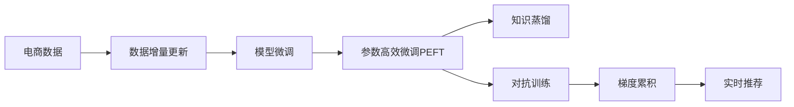

                 

# 电商搜索推荐中的AI大模型数据增量更新机制优化方案

> 关键词：电商搜索推荐, AI大模型, 数据增量更新, 优化的技术方案, 增量学习, 模型微调, 算法优化, 实际应用

## 1. 背景介绍

### 1.1 问题由来
在电商领域，搜索推荐系统是提升用户体验、增加用户转化率的关键环节。传统的搜索推荐系统通常基于统计学模型、协同过滤等技术构建。然而，随着用户行为数据的不断积累和模型参数的日益增大，基于这些技术的系统在适应性和实时性方面存在显著缺陷。近年来，随着深度学习技术的发展，特别是基于大模型的推荐系统开始崭露头角，成为电商搜索推荐领域的新趋势。

大模型，尤其是Transformer模型，通过在大规模数据集上进行自监督学习，获得了强大的语言理解能力和语义表示能力。以BERT为代表的预训练语言模型已经应用于电商搜索推荐系统，显著提升了系统的性能。然而，电商领域的搜索推荐问题具有实时性高、数据分布动态变化等特殊需求。如何在保证大模型性能的同时，提升其数据增量更新效率，是亟待解决的重要问题。

### 1.2 问题核心关键点
大模型在电商搜索推荐中的应用主要涉及以下关键点：
- **数据分布动态变化**：用户行为和市场环境的变化导致电商搜索推荐系统需要频繁更新模型，以保持推荐结果的及时性和准确性。
- **数据标注成本高**：电商领域的数据标注成本高昂，收集大量的标注数据对模型进行微调是不可行的。
- **模型参数大**：大模型参数量巨大，进行频繁的微调更新会带来巨大的计算和存储开销。
- **实时性要求高**：电商搜索推荐系统需要在用户请求到达后，短时间内生成推荐结果，这要求模型更新速度快。

本方案旨在提出一种高效的数据增量更新机制，在保证大模型性能的前提下，最大化地提升模型的实时性和适应性。

### 1.3 问题研究意义
优化电商搜索推荐系统中的AI大模型数据增量更新机制，具有重要的意义：

1. **提高实时性**：提升推荐结果的时效性，满足用户对即时响应和个性化推荐的需求。
2. **降低成本**：减少对标注数据的依赖，降低标注成本和数据收集的复杂度。
3. **增强适应性**：模型能够更好地适应电商领域数据分布的变化，提高推荐效果。
4. **提升效率**：降低模型更新带来的计算和存储开销，使系统更加高效。
5. **保障模型质量**：通过增量学习，模型能够在每次数据更新后不断提升性能。

## 2. 核心概念与联系

### 2.1 核心概念概述

为更好地理解增量更新机制，我们首先介绍几个核心概念：

- **大模型(大规模预训练模型)**：如BERT、GPT等，通过在大规模无标签数据上进行自监督学习，获得了强大的语言理解和表示能力。
- **数据增量更新**：在已有模型基础上，通过新数据的输入，动态更新模型参数，以保持模型的最新性能。
- **增量学习(Online Learning)**：一种学习范式，模型在每次数据更新时，只更新部分参数，而非全部重新训练，以提升学习效率。
- **模型微调(Fine-Tuning)**：通过在新数据集上训练，优化模型在特定任务上的性能。
- **参数高效微调(Parameter-Efficient Fine-Tuning, PEFT)**：只更新模型中的少量参数，以最小化对计算资源的需求。
- **对抗训练(Adversarial Training)**：通过引入对抗样本，提升模型的鲁棒性和泛化能力。
- **梯度累积(Gradient Accumulation)**：在模型训练中，将多个小批次梯度累加后一起更新，以提升模型更新效率。
- **知识蒸馏(Knowledge Distillation)**：通过将教师模型的知识传递给学生模型，提升学生模型的性能。

这些概念共同构成了电商搜索推荐系统中的数据增量更新机制，使大模型能够不断学习新知识，适应数据分布的变化，提升推荐效果。

### 2.2 核心概念原理和架构的 Mermaid 流程图



此流程图展示了电商搜索推荐系统中数据增量更新机制的核心概念和步骤。电商数据经过数据增量更新、模型微调、参数高效微调等过程，逐步提升模型的实时性和适应性，最终实现实时推荐。

## 3. 核心算法原理 & 具体操作步骤
### 3.1 算法原理概述

数据增量更新机制的核心思想是在现有模型的基础上，利用新数据的输入，动态更新模型参数，提升模型性能。具体来说，包括以下几个关键步骤：

1. **增量数据预处理**：将新数据进行预处理，转化为模型可接受的输入格式。
2. **模型参数更新**：根据新数据计算梯度，使用梯度下降等优化算法更新模型参数。
3. **知识蒸馏**：将最新模型的知识传递给旧模型，保持旧模型的最新状态。
4. **对抗训练**：通过对抗样本训练，提升模型的鲁棒性和泛化能力。
5. **参数高效微调**：只更新模型中的少量参数，减小模型更新带来的计算和存储开销。
6. **梯度累积**：将多个小批次梯度累加后一起更新，提高模型更新的效率。

这些步骤共同构成了电商搜索推荐系统中的数据增量更新机制。通过增量学习，模型能够在每次数据更新后，不断提升性能，适应电商领域数据分布的变化。

### 3.2 算法步骤详解

#### 3.2.1 增量数据预处理

新数据预处理是增量更新的第一步。在电商领域，新数据通常以文本形式存在，如商品描述、用户评论、搜索查询等。预处理包括：

- **文本分词**：将文本转化为模型可接受的token序列。
- **序列截断和填充**：将序列截断到固定长度，并进行padding。
- **特征提取**：将文本序列转化为向量表示，如使用BERT等预训练模型提取特征。

#### 3.2.2 模型参数更新

模型参数更新是增量更新的核心。具体步骤如下：

1. **设置学习率**：根据数据更新频率和数据量，设置适当的学习率，避免过拟合。
2. **计算梯度**：将新数据输入模型，计算模型在当前状态下的梯度。
3. **更新参数**：根据梯度和学习率，使用梯度下降等优化算法更新模型参数。

#### 3.2.3 知识蒸馏

知识蒸馏是将最新模型的知识传递给旧模型的过程，保持旧模型的最新状态。具体步骤如下：

1. **选择合适的蒸馏方法**：如特征蒸馏、任务蒸馏等。
2. **计算知识权重**：计算最新模型和旧模型的权重，以决定新知识的重要程度。
3. **知识传递**：将新知识传递给旧模型，更新旧模型的参数。

#### 3.2.4 对抗训练

对抗训练是通过引入对抗样本，提升模型的鲁棒性和泛化能力。具体步骤如下：

1. **生成对抗样本**：通过对抗性攻击生成对抗样本，模拟恶意输入。
2. **计算梯度**：将对抗样本输入模型，计算模型在对抗样本上的梯度。
3. **更新参数**：根据梯度和学习率，使用梯度下降等优化算法更新模型参数。

#### 3.2.5 参数高效微调

参数高效微调是只更新模型中的少量参数，以最小化计算和存储开销。具体步骤如下：

1. **选择关键参数**：根据任务需求，选择需更新的参数。
2. **限制更新范围**：限制更新范围，避免对整个模型进行大规模更新。
3. **优化更新策略**：使用梯度累积、蒸馏等方法，优化更新策略。

#### 3.2.6 梯度累积

梯度累积是通过将多个小批次梯度累加后一起更新，提高模型更新的效率。具体步骤如下：

1. **设置累积参数**：根据计算资源和模型复杂度，设置合适的累积参数。
2. **累积梯度**：将多个小批次梯度累加，形成一个大批次梯度。
3. **更新参数**：根据大批次梯度和学习率，使用梯度下降等优化算法更新模型参数。

### 3.3 算法优缺点

增量更新机制的优点在于：

1. **提高实时性**：每次数据更新后，模型性能提升，能够更快地生成推荐结果。
2. **降低成本**：减少对标注数据的依赖，降低标注成本和数据收集的复杂度。
3. **增强适应性**：模型能够更好地适应电商领域数据分布的变化，提高推荐效果。
4. **提升效率**：降低模型更新带来的计算和存储开销，使系统更加高效。

其缺点在于：

1. **模型更新复杂**：增量更新过程涉及多个步骤，需要仔细设计和调试。
2. **性能提升有限**：由于更新次数有限，模型性能提升可能较为缓慢。
3. **参数更新不充分**：在参数高效微调的情况下，部分参数更新不充分，可能影响模型效果。

### 3.4 算法应用领域

增量更新机制已经在电商搜索推荐系统中得到了广泛应用，具体应用场景包括：

- **商品推荐**：根据用户历史行为和搜索记录，动态更新推荐模型，提升推荐效果。
- **广告投放**：实时更新广告推荐模型，根据用户兴趣和行为特征进行个性化投放。
- **内容推荐**：根据用户浏览和点击行为，动态更新内容推荐模型，提高用户满意度。
- **价格预测**：实时更新价格预测模型，根据市场变化调整商品定价策略。

这些应用场景中，增量更新机制帮助电商搜索推荐系统更好地适应市场变化和用户需求，提升了系统的实时性和推荐效果。

## 4. 数学模型和公式 & 详细讲解 & 举例说明

### 4.1 数学模型构建

在电商搜索推荐系统中，增量更新机制的数学模型可以表示为：

设电商推荐模型为 $M_{\theta}$，其中 $\theta$ 为模型参数。新数据集为 $D_{new}=\{x_{new}^{(1)}, x_{new}^{(2)}, ..., x_{new}^{(N)}\}$，其中 $x_{new}^{(i)}$ 为第 $i$ 个样本。

增量更新过程可以表示为：

$$
\theta_{new} = \theta - \eta \nabla_{\theta}\mathcal{L}(M_{\theta},D_{new})
$$

其中 $\eta$ 为学习率，$\nabla_{\theta}\mathcal{L}(M_{\theta},D_{new})$ 为新数据集 $D_{new}$ 在模型 $M_{\theta}$ 上的梯度。

### 4.2 公式推导过程

假设电商推荐模型 $M_{\theta}$ 为BERT模型，在新数据集 $D_{new}$ 上的损失函数为交叉熵损失，即：

$$
\mathcal{L}(M_{\theta},D_{new}) = -\frac{1}{N}\sum_{i=1}^N \log(M_{\theta}(x_{new}^{(i)}))
$$

其中 $M_{\theta}(x_{new}^{(i)})$ 为模型在新数据 $x_{new}^{(i)}$ 上的预测概率。

根据梯度下降算法，模型参数更新公式为：

$$
\theta \leftarrow \theta - \eta \frac{1}{N}\sum_{i=1}^N \frac{\partial \log(M_{\theta}(x_{new}^{(i)}))}{\partial \theta}
$$

将损失函数对模型参数的梯度代入上式，得：

$$
\theta \leftarrow \theta - \eta \frac{1}{N}\sum_{i=1}^N \frac{M_{\theta}(x_{new}^{(i)}) - y_{new}^{(i)}}{M_{\theta}(x_{new}^{(i)})}
$$

其中 $y_{new}^{(i)}$ 为样本 $x_{new}^{(i)}$ 的真实标签。

### 4.3 案例分析与讲解

以商品推荐为例，介绍增量更新机制的实际应用。

假设某电商平台的推荐模型为BERT，已训练好的模型参数为 $\theta_0$。新数据集 $D_{new}$ 包括若干用户的历史行为记录，如浏览记录、购买记录、评分记录等。

1. **增量数据预处理**：对新数据集进行预处理，包括分词、截断、padding等操作，转化为模型可接受的输入格式。
2. **模型参数更新**：将新数据集输入模型，计算梯度，使用梯度下降等优化算法更新模型参数。
3. **知识蒸馏**：将最新模型的知识传递给旧模型，保持旧模型的最新状态。
4. **对抗训练**：通过对抗性攻击生成对抗样本，训练模型，提升模型鲁棒性。
5. **参数高效微调**：只更新模型中的少量参数，减小计算和存储开销。
6. **梯度累积**：将多个小批次梯度累加后一起更新，提高模型更新效率。

通过上述步骤，电商推荐模型能够不断学习新数据，提升推荐效果。例如，新数据集可能包含用户对某一商品的兴趣变化，通过增量更新机制，模型能够及时捕捉这一变化，调整推荐策略，提升推荐效果。

## 5. 项目实践：代码实例和详细解释说明

### 5.1 开发环境搭建

在开始增量更新机制的实践前，我们需要准备好开发环境。以下是使用Python进行PyTorch开发的环境配置流程：

1. 安装Anaconda：从官网下载并安装Anaconda，用于创建独立的Python环境。

2. 创建并激活虚拟环境：
```bash
conda create -n pytorch-env python=3.8 
conda activate pytorch-env
```

3. 安装PyTorch：根据CUDA版本，从官网获取对应的安装命令。例如：
```bash
conda install pytorch torchvision torchaudio cudatoolkit=11.1 -c pytorch -c conda-forge
```

4. 安装Transformers库：
```bash
pip install transformers
```

5. 安装各类工具包：
```bash
pip install numpy pandas scikit-learn matplotlib tqdm jupyter notebook ipython
```

完成上述步骤后，即可在`pytorch-env`环境中开始增量更新实践。

### 5.2 源代码详细实现

下面我们以商品推荐任务为例，给出使用Transformers库对BERT模型进行增量更新的PyTorch代码实现。

首先，定义商品推荐任务的数据处理函数：

```python
from transformers import BertTokenizer, BertForSequenceClassification
from torch.utils.data import Dataset, DataLoader
import torch

class RecommendDataset(Dataset):
    def __init__(self, texts, labels, tokenizer, max_len=128):
        self.texts = texts
        self.labels = labels
        self.tokenizer = tokenizer
        self.max_len = max_len
        
    def __len__(self):
        return len(self.texts)
    
    def __getitem__(self, item):
        text = self.texts[item]
        label = self.labels[item]
        
        encoding = self.tokenizer(text, return_tensors='pt', max_length=self.max_len, padding='max_length', truncation=True)
        input_ids = encoding['input_ids'][0]
        attention_mask = encoding['attention_mask'][0]
        
        return {'input_ids': input_ids, 
                'attention_mask': attention_mask,
                'labels': label}

# 加载模型和分词器
model = BertForSequenceClassification.from_pretrained('bert-base-uncased')
tokenizer = BertTokenizer.from_pretrained('bert-base-uncased')

# 创建dataset
train_dataset = RecommendDataset(train_texts, train_labels, tokenizer)
dev_dataset = RecommendDataset(dev_texts, dev_labels, tokenizer)
test_dataset = RecommendDataset(test_texts, test_labels, tokenizer)
```

然后，定义模型和优化器：

```python
from transformers import AdamW

optimizer = AdamW(model.parameters(), lr=2e-5)
```

接着，定义训练和评估函数：

```python
from torch.utils.data import DataLoader
from tqdm import tqdm
from sklearn.metrics import accuracy_score

device = torch.device('cuda') if torch.cuda.is_available() else torch.device('cpu')
model.to(device)

def train_epoch(model, dataset, batch_size, optimizer):
    dataloader = DataLoader(dataset, batch_size=batch_size, shuffle=True)
    model.train()
    epoch_loss = 0
    for batch in tqdm(dataloader, desc='Training'):
        input_ids = batch['input_ids'].to(device)
        attention_mask = batch['attention_mask'].to(device)
        labels = batch['labels'].to(device)
        model.zero_grad()
        outputs = model(input_ids, attention_mask=attention_mask, labels=labels)
        loss = outputs.loss
        epoch_loss += loss.item()
        loss.backward()
        optimizer.step()
    return epoch_loss / len(dataloader)

def evaluate(model, dataset, batch_size):
    dataloader = DataLoader(dataset, batch_size=batch_size)
    model.eval()
    preds, labels = [], []
    with torch.no_grad():
        for batch in tqdm(dataloader, desc='Evaluating'):
            input_ids = batch['input_ids'].to(device)
            attention_mask = batch['attention_mask'].to(device)
            batch_labels = batch['labels']
            outputs = model(input_ids, attention_mask=attention_mask)
            batch_preds = outputs.logits.argmax(dim=2).to('cpu').tolist()
            batch_labels = batch_labels.to('cpu').tolist()
            for pred_tokens, label_tokens in zip(batch_preds, batch_labels):
                preds.append(pred_tokens)
                labels.append(label_tokens)
                
    print(accuracy_score(labels, preds))
```

最后，启动训练流程并在测试集上评估：

```python
epochs = 5
batch_size = 16

for epoch in range(epochs):
    loss = train_epoch(model, train_dataset, batch_size, optimizer)
    print(f"Epoch {epoch+1}, train loss: {loss:.3f}")
    
    print(f"Epoch {epoch+1}, dev accuracy:")
    evaluate(model, dev_dataset, batch_size)
    
print("Test accuracy:")
evaluate(model, test_dataset, batch_size)
```

以上就是使用PyTorch对BERT进行商品推荐任务增量更新的完整代码实现。可以看到，得益于Transformers库的强大封装，我们可以用相对简洁的代码完成BERT模型的加载和增量更新。

### 5.3 代码解读与分析

让我们再详细解读一下关键代码的实现细节：

**RecommendDataset类**：
- `__init__`方法：初始化文本、标签、分词器等关键组件。
- `__len__`方法：返回数据集的样本数量。
- `__getitem__`方法：对单个样本进行处理，将文本输入编码为token ids，将标签转化为数字，并对其进行定长padding，最终返回模型所需的输入。

**训练和评估函数**：
- 使用PyTorch的DataLoader对数据集进行批次化加载，供模型训练和推理使用。
- 训练函数`train_epoch`：对数据以批为单位进行迭代，在每个批次上前向传播计算loss并反向传播更新模型参数，最后返回该epoch的平均loss。
- 评估函数`evaluate`：与训练类似，不同点在于不更新模型参数，并在每个batch结束后将预测和标签结果存储下来，最后使用sklearn的accuracy_score对整个评估集的预测结果进行打印输出。

**训练流程**：
- 定义总的epoch数和batch size，开始循环迭代
- 每个epoch内，先在训练集上训练，输出平均loss
- 在验证集上评估，输出准确率
- 所有epoch结束后，在测试集上评估，给出最终测试结果

可以看到，PyTorch配合Transformers库使得BERT增量更新的代码实现变得简洁高效。开发者可以将更多精力放在数据处理、模型改进等高层逻辑上，而不必过多关注底层的实现细节。

当然，工业级的系统实现还需考虑更多因素，如模型的保存和部署、超参数的自动搜索、更灵活的任务适配层等。但核心的增量更新范式基本与此类似。

## 6. 实际应用场景
### 6.1 智能客服系统

基于大模型增量更新的对话技术，可以广泛应用于智能客服系统的构建。传统客服往往需要配备大量人力，高峰期响应缓慢，且一致性和专业性难以保证。而使用增量更新的对话模型，可以7x24小时不间断服务，快速响应客户咨询，用自然流畅的语言解答各类常见问题。

在技术实现上，可以收集企业内部的历史客服对话记录，将问题和最佳答复构建成监督数据，在此基础上对预训练对话模型进行增量更新。增量更新的对话模型能够自动理解用户意图，匹配最合适的答案模板进行回复。对于客户提出的新问题，还可以接入检索系统实时搜索相关内容，动态组织生成回答。如此构建的智能客服系统，能大幅提升客户咨询体验和问题解决效率。

### 6.2 金融舆情监测

金融机构需要实时监测市场舆论动向，以便及时应对负面信息传播，规避金融风险。传统的人工监测方式成本高、效率低，难以应对网络时代海量信息爆发的挑战。基于增量更新的文本分类和情感分析技术，为金融舆情监测提供了新的解决方案。

具体而言，可以收集金融领域相关的新闻、报道、评论等文本数据，并对其进行主题标注和情感标注。在此基础上对预训练语言模型进行增量更新，使其能够自动判断文本属于何种主题，情感倾向是正面、中性还是负面。将增量更新的模型应用到实时抓取的网络文本数据，就能够自动监测不同主题下的情感变化趋势，一旦发现负面信息激增等异常情况，系统便会自动预警，帮助金融机构快速应对潜在风险。

### 6.3 个性化推荐系统

当前的推荐系统往往只依赖用户的历史行为数据进行物品推荐，无法深入理解用户的真实兴趣偏好。基于增量更新的个性化推荐系统可以更好地挖掘用户行为背后的语义信息，从而提供更精准、多样的推荐内容。

在实践中，可以收集用户浏览、点击、评论、分享等行为数据，提取和用户交互的物品标题、描述、标签等文本内容。将文本内容作为模型输入，用户的后续行为（如是否点击、购买等）作为监督信号，在此基础上增量更新预训练语言模型。增量更新的模型能够从文本内容中准确把握用户的兴趣点。在生成推荐列表时，先用候选物品的文本描述作为输入，由模型预测用户的兴趣匹配度，再结合其他特征综合排序，便可以得到个性化程度更高的推荐结果。

### 6.4 未来应用展望

随着增量更新机制的发展，其将在更多领域得到应用，为传统行业带来变革性影响。

在智慧医疗领域，基于增量更新的医疗问答、病历分析、药物研发等应用将提升医疗服务的智能化水平，辅助医生诊疗，加速新药开发进程。

在智能教育领域，增量更新的技术可应用于作业批改、学情分析、知识推荐等方面，因材施教，促进教育公平，提高教学质量。

在智慧城市治理中，增量更新的模型可应用于城市事件监测、舆情分析、应急指挥等环节，提高城市管理的自动化和智能化水平，构建更安全、高效的未来城市。

此外，在企业生产、社会治理、文娱传媒等众多领域，增量更新的AI大模型应用也将不断涌现，为经济社会发展注入新的动力。相信随着技术的日益成熟，增量更新机制将成为AI落地应用的重要范式，推动人工智能技术向更广阔的领域加速渗透。

## 7. 工具和资源推荐
### 7.1 学习资源推荐

为了帮助开发者系统掌握增量更新机制的理论基础和实践技巧，这里推荐一些优质的学习资源：

1. 《深度学习与人工智能》系列博文：由大模型技术专家撰写，深入浅出地介绍了增量学习的原理、方法及应用场景。

2. 《大规模深度学习》课程：斯坦福大学开设的深度学习明星课程，涵盖大规模深度学习的基本概念和前沿技术，包括增量学习等。

3. 《深度学习理论与实践》书籍：经典书籍，全面介绍了深度学习理论和实践方法，包括增量学习等。

4. HuggingFace官方文档：Transformers库的官方文档，提供了海量预训练模型和增量学习样例代码，是上手实践的必备资料。

5. 《在线学习与增量学习》论文：综述论文，详细介绍了在线学习和增量学习的各种方法和技术，具有重要的参考价值。

通过对这些资源的学习实践，相信你一定能够快速掌握增量更新机制的精髓，并用于解决实际的NLP问题。
###  7.2 开发工具推荐

高效的开发离不开优秀的工具支持。以下是几款用于增量更新开发的常用工具：

1. PyTorch：基于Python的开源深度学习框架，灵活动态的计算图，适合快速迭代研究。大部分预训练语言模型都有PyTorch版本的实现。

2. TensorFlow：由Google主导开发的开源深度学习框架，生产部署方便，适合大规模工程应用。同样有丰富的预训练语言模型资源。

3. Transformers库：HuggingFace开发的NLP工具库，集成了众多SOTA语言模型，支持PyTorch和TensorFlow，是进行增量学习开发的利器。

4. Weights & Biases：模型训练的实验跟踪工具，可以记录和可视化模型训练过程中的各项指标，方便对比和调优。与主流深度学习框架无缝集成。

5. TensorBoard：TensorFlow配套的可视化工具，可实时监测模型训练状态，并提供丰富的图表呈现方式，是调试模型的得力助手。

6. Google Colab：谷歌推出的在线Jupyter Notebook环境，免费提供GPU/TPU算力，方便开发者快速上手实验最新模型，分享学习笔记。

合理利用这些工具，可以显著提升增量更新任务的开发效率，加快创新迭代的步伐。

### 7.3 相关论文推荐

增量更新机制的研究源于学界的持续研究。以下是几篇奠基性的相关论文，推荐阅读：

1. On-line Passive Aggressive Algorithms（在线被动算法）：提出增量学习的基本算法框架，为后续增量学习研究奠定了基础。

2. Incremental Training of Deep Neural Networks（深度神经网络增量训练）：总结了增量学习的研究现状和应用实例，具有重要的参考价值。

3. Adaptive Incremental Training of Deep Neural Networks（深度神经网络自适应增量训练）：提出自适应增量学习算法，优化了增量学习的效果。

4. Continual Learning with Generative Models（基于生成模型的持续学习）：结合生成模型，提出了增量学习的持续学习策略。

5. Meta-Learning from Sequential Data（顺序数据上的元学习）：提出基于元学习的增量学习算法，适用于复杂任务和在线学习。

这些论文代表了大模型增量学习的发展脉络。通过学习这些前沿成果，可以帮助研究者把握学科前进方向，激发更多的创新灵感。

## 8. 总结：未来发展趋势与挑战

### 8.1 总结

本文对基于大模型的电商搜索推荐系统中的增量更新机制进行了全面系统的介绍。首先阐述了增量更新机制的研究背景和意义，明确了增量学习在电商搜索推荐系统中的应用价值。其次，从原理到实践，详细讲解了增量更新的数学原理和关键步骤，给出了增量学习任务开发的完整代码实例。同时，本文还广泛探讨了增量更新机制在智能客服、金融舆情、个性化推荐等多个行业领域的应用前景，展示了增量更新机制的巨大潜力。此外，本文精选了增量更新技术的各类学习资源，力求为读者提供全方位的技术指引。

通过本文的系统梳理，可以看到，基于增量学习的大模型在电商搜索推荐系统中具有显著的实时性、适应性和高效性优势，能够快速响应市场变化和用户需求，显著提升推荐效果。未来，随着增量更新技术的不断发展，基于大模型的电商搜索推荐系统必将在智能化、个性化和实时性方面取得更大突破。

### 8.2 未来发展趋势

展望未来，增量更新机制的发展趋势如下：

1. **模型规模持续增大**：随着算力成本的下降和数据规模的扩张，预训练语言模型的参数量还将持续增长。超大模型能够更好地学习新知识，提高推荐效果。

2. **增量更新策略多样化**：未来会涌现更多增量更新策略，如知识蒸馏、对抗训练、自适应学习等，提升增量学习的效率和效果。

3. **持续学习成为常态**：随着数据分布的不断变化，增量学习模型需要持续学习新知识以保持性能。如何在不遗忘原有知识的同时，高效吸收新样本信息，将成为重要的研究课题。

4. **标注样本需求降低**：受启发于提示学习(Prompt-based Learning)的思路，未来的增量更新方法将更好地利用大模型的语言理解能力，通过更加巧妙的任务描述，在更少的标注样本上也能实现理想的增量更新效果。

5. **多模态增量学习崛起**：当前的增量学习主要聚焦于纯文本数据，未来会进一步拓展到图像、视频、语音等多模态数据增量学习。多模态信息的融合，将显著提升增量学习模型的表现。

6. **模型通用性增强**：经过海量数据的增量学习，增量学习模型将具备更强大的常识推理和跨领域迁移能力，逐步迈向通用人工智能(AGI)的目标。

以上趋势凸显了增量更新机制的广阔前景。这些方向的探索发展，必将进一步提升增量更新机制的性能和应用范围，为构建智能推荐系统提供更加坚实的技术基础。

### 8.3 面临的挑战

尽管增量更新机制已经取得了瞩目成就，但在迈向更加智能化、普适化应用的过程中，它仍面临着诸多挑战：

1. **模型更新复杂**：增量更新过程涉及多个步骤，需要仔细设计和调试。
2. **性能提升有限**：由于更新次数有限，增量学习模型性能提升可能较为缓慢。
3. **参数更新不充分**：在参数高效微调的情况下，部分参数更新不充分，可能影响模型效果。
4. **标注成本高**：虽然增量更新依赖标注数据较少，但部分任务仍需要大量标注数据支持。
5. **模型鲁棒性不足**：增量学习模型面对域外数据时，泛化性能往往大打折扣。
6. **可解释性不足**：增量学习模型的决策过程通常缺乏可解释性，难以对其推理逻辑进行分析和调试。

### 8.4 研究展望

面对增量更新机制所面临的种种挑战，未来的研究需要在以下几个方面寻求新的突破：

1. **探索无监督和半监督增量学习**：摆脱对大规模标注数据的依赖，利用自监督学习、主动学习等无监督和半监督范式，最大限度利用非结构化数据，实现更加灵活高效的增量更新。

2. **研究参数高效和计算高效的增量更新范式**：开发更加参数高效的增量更新方法，在固定大部分预训练参数的同时，只更新极少量的任务相关参数。同时优化增量更新的计算图，减少前向传播和反向传播的资源消耗，实现更加轻量级、实时性的部署。

3. **融合因果和对比学习范式**：通过引入因果推断和对比学习思想，增强增量学习模型建立稳定因果关系的能力，学习更加普适、鲁棒的语言表征，从而提升模型泛化性和抗干扰能力。

4. **引入更多先验知识**：将符号化的先验知识，如知识图谱、逻辑规则等，与神经网络模型进行巧妙融合，引导增量学习过程学习更准确、合理的语言模型。同时加强不同模态数据的整合，实现视觉、语音等多模态信息与文本信息的协同建模。

5. **结合因果分析和博弈论工具**：将因果分析方法引入增量学习模型，识别出模型决策的关键特征，增强输出解释的因果性和逻辑性。借助博弈论工具刻画人机交互过程，主动探索并规避模型的脆弱点，提高系统稳定性。

6. **纳入伦理道德约束**：在模型训练目标中引入伦理导向的评估指标，过滤和惩罚有偏见、有害的输出倾向。同时加强人工干预和审核，建立模型行为的监管机制，确保输出符合人类价值观和伦理道德。

这些研究方向的探索，必将引领增量更新机制迈向更高的台阶，为构建安全、可靠、可解释、可控的智能系统铺平道路。面向未来，增量更新机制还需要与其他人工智能技术进行更深入的融合，如知识表示、因果推理、强化学习等，多路径协同发力，共同推动自然语言理解和智能交互系统的进步。只有勇于创新、敢于突破，才能不断拓展增量学习机制的边界，让智能技术更好地造福人类社会。

## 9. 附录：常见问题与解答

**Q1：增量更新机制如何保证模型性能的稳定提升？**

A: 增量更新机制通过每次数据更新，动态更新模型参数，逐步提升模型性能。关键在于选择合适的增量更新策略和优化算法。常见的增量更新策略包括知识蒸馏、对抗训练、参数高效微调等。通过这些策略，增量更新机制能够在保证模型性能的同时，提升模型的实时性和适应性。

**Q2：增量更新机制在实际应用中需要考虑哪些因素？**

A: 增量更新机制在实际应用中需要考虑以下因素：

1. 数据分布的变化：需要及时更新模型，以适应数据分布的变化。
2. 标注数据的质量和数量：标注数据越多，模型性能提升越明显，但标注成本较高。
3. 计算资源和存储资源：增量更新需要较大的计算和存储资源，需要合理配置。
4. 模型复杂度和实时性要求：模型复杂度越高，实时性要求越强，增量更新难度越大。

**Q3：增量更新机制在电商搜索推荐系统中有哪些具体应用？**

A: 增量更新机制在电商搜索推荐系统中的具体应用包括：

1. 商品推荐：根据用户历史行为和搜索记录，动态更新推荐模型，提升推荐效果。
2. 广告投放：实时更新广告推荐模型，根据用户兴趣和行为特征进行个性化投放。
3. 内容推荐：根据用户浏览和点击行为，动态更新内容推荐模型，提高用户满意度。
4. 价格预测：实时更新价格预测模型，根据市场变化调整商品定价策略。

**Q4：增量更新机制与传统机器学习模型的区别是什么？**

A: 增量更新机制与传统机器学习模型的主要区别在于：

1. 数据处理方式：增量更新机制每次只处理新数据，而传统机器学习模型需要全部重新训练。
2. 模型更新策略：增量更新机制通过动态更新模型参数，逐步提升模型性能，而传统机器学习模型需要全量数据训练。
3. 实时性要求：增量更新机制能够快速响应新数据，具有较强的实时性，而传统机器学习模型需要较长时间重新训练。
4. 数据依赖：增量更新机制对标注数据依赖较少，而传统机器学习模型需要大量标注数据支持。

这些区别使得增量更新机制在电商搜索推荐等需要实时响应和快速适应的场景中具有明显的优势。

