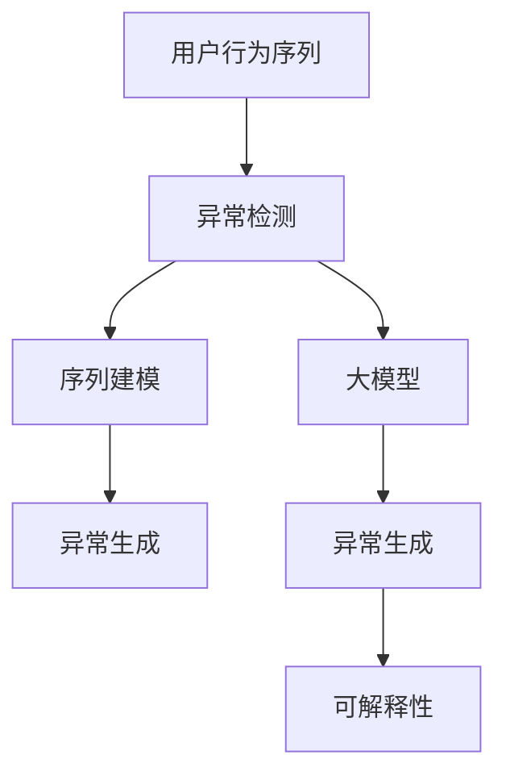

                 

# 电商搜索推荐中的AI大模型用户行为序列异常检测模型选择

## 1. 背景介绍

随着电子商务的发展，用户搜索行为数据的量级不断增长，从海量数据中挖掘出有价值的用户行为模式，提升电商推荐系统的准确性和用户体验成为关键。而用户行为序列的异常检测，则是这一过程中必不可少的一环。异常行为常常意味着用户情绪的波动、购买意向的改变或是推荐策略的失效，及时发现并处理这些异常行为，可以显著提升电商推荐系统的效果。

### 1.1 问题由来

电商推荐系统核心依赖用户历史行为数据，这些数据常常以用户行为序列的形式存在。行为序列包含了用户的点击、浏览、购买等一系列行为，通过分析这些序列，推荐系统能够理解用户的兴趣偏好，预测用户行为并给出个性化的推荐。然而，由于用户行为复杂多变，异常行为也往往不可忽视。常见的异常行为包括但不限于用户频繁退货、长时间不活跃等，这类行为对于推荐系统来说是挑战，也是改进空间。

### 1.2 问题核心关键点

1. **用户行为序列数据特性**：用户行为序列往往具有序列长、多变性等特点，且容易受到外界因素（如广告、促销活动）的影响，使得异常检测模型的设计变得复杂。
2. **异常行为多样性**：异常行为不仅包括购买意向的改变，还包括用户情绪的波动、行为频率的异常等，多样性使得异常检测模型需要兼顾多个维度。
3. **实时性需求**：异常行为需要被及时发现并处理，实时性成为异常检测模型的一个核心需求。
4. **系统可扩展性**：随着用户行为序列的增加，异常检测模型需要具备良好的可扩展性，以应对数据规模的增长。

## 2. 核心概念与联系

### 2.1 核心概念概述

为深入理解异常检测模型，本节介绍一些核心概念及其联系：

- **异常检测（Anomaly Detection）**：从数据集中识别出不同于一般模式的数据点，通常用于异常行为、故障诊断等领域。
- **用户行为序列（User Behavior Sequence）**：用户在电商平台上的一系列行为记录，如点击、浏览、购买等，是电商推荐系统的重要数据来源。
- **大模型（Large Model）**：以Transformer为代表的深度学习模型，如BERT、GPT-3等，通常具有大规模参数，能从大数据中学习出强大的特征表示。
- **序列建模（Sequence Modeling）**：针对具有序列特性的数据，如自然语言、用户行为序列等，建立模型进行特征学习。
- **异常生成（Anomaly Generation）**：利用模型生成异常数据，用于训练异常检测模型。
- **可解释性（Explainability）**：模型能够提供对异常检测过程的解释，帮助理解异常检测的依据。

这些概念之间的联系可以通过以下Mermaid流程图展示：



这个流程图展示了用户行为序列从异常检测模型的输入，到通过序列建模和大模型特征提取，再到生成异常数据和提供可解释性的全过程。

## 3. 核心算法原理 & 具体操作步骤

### 3.1 算法原理概述

基于大模型的电商搜索推荐中用户行为序列的异常检测，核心思想是利用大模型的强大特征提取能力，学习用户行为序列的正常模式，再通过检测与该模式的偏差来识别异常行为。

具体而言，可以将电商用户的行为序列表示为时间序列 $X = \{x_1, x_2, ..., x_n\}$，其中 $x_i$ 表示用户在第 $i$ 时刻的行为。假设已有的正常行为模式可以由向量 $z$ 表示，则异常检测问题可以转化为：

$$
\min_{z} \| X - z \|
$$

其中 $\| \cdot \|$ 表示向量范数，代表 $X$ 与 $z$ 之间的距离。通过最小化这个距离，可以使得 $z$ 尽可能接近于 $X$，从而反映出正常的用户行为模式。

### 3.2 算法步骤详解

基于大模型的电商搜索推荐中用户行为序列的异常检测，一般分为以下几个步骤：

**Step 1: 数据预处理**

- 收集电商用户的长期行为序列数据，清洗并标注异常行为。
- 对行为序列进行归一化处理，使其满足大模型输入的要求。

**Step 2: 构建大模型**

- 选择适合序列建模的预训练语言模型，如BERT、Transformer等，用于特征提取。
- 在大规模电商用户行为数据上预训练模型，学习用户行为的正常模式。

**Step 3: 异常检测模型训练**

- 利用预训练模型提取的行为序列特征，构建异常检测模型。
- 在标注数据集上训练异常检测模型，学习如何区分正常行为与异常行为。

**Step 4: 模型评估与优化**

- 在测试集上评估异常检测模型的性能，使用准确率、召回率等指标。
- 根据评估结果调整模型参数，优化模型效果。

**Step 5: 应用部署**

- 将训练好的模型集成到电商推荐系统中，实时监控用户行为序列，及时检测并处理异常行为。

### 3.3 算法优缺点

基于大模型的电商搜索推荐中用户行为序列的异常检测方法具有以下优点：

1. **特征提取能力强**：大模型能够学习到用户行为序列的深层次特征，提升异常检测的准确性。
2. **可扩展性好**：大模型具备良好的可扩展性，能够处理大规模数据集，适应电商推荐系统的需求。
3. **实时性**：利用大模型的快速推理能力，异常检测可以实时进行，及时发现并处理异常行为。

但同时也存在以下缺点：

1. **模型复杂度高**：大模型参数量大，训练复杂度高，对计算资源要求高。
2. **训练数据需求大**：需要大规模标注数据来训练大模型，标注成本高。
3. **过拟合风险**：大模型容易过拟合，尤其在标注数据不足的情况下。
4. **可解释性差**：大模型作为"黑盒"模型，其决策过程难以解释，缺乏透明度。

### 3.4 算法应用领域

基于大模型的电商搜索推荐中用户行为序列的异常检测方法，主要应用于以下几个领域：

1. **电商推荐系统**：提升电商推荐系统的准确性和用户满意度，及时发现并处理异常行为，改善用户体验。
2. **用户行为分析**：分析用户行为序列，挖掘用户兴趣变化规律，优化推荐策略。
3. **异常行为预警**：实时监控用户行为序列，提前预警异常行为，降低潜在风险。
4. **个性化推荐**：根据用户行为序列中的异常行为，动态调整推荐内容，提升个性化推荐效果。

## 4. 数学模型和公式 & 详细讲解 & 举例说明

### 4.1 数学模型构建

本节通过数学语言对基于大模型的电商搜索推荐中用户行为序列异常检测模型进行描述。

假设已有的正常行为模式由向量 $z \in \mathbb{R}^d$ 表示，用户行为序列 $X \in \mathbb{R}^{n \times d}$，其中 $n$ 表示序列长度，$d$ 表示特征维度。

异常检测模型的目标是最小化 $X$ 与 $z$ 之间的距离，可以使用欧氏距离或马氏距离：

$$
\min_{z} \| X - z \|_2^2 \text{ 或 } \min_{z} (X - z)^T \Sigma^{-1}(X - z)
$$

其中 $\Sigma$ 为协方差矩阵，代表行为序列中各特征之间的相关性。

### 4.2 公式推导过程

以欧氏距离为例，异常检测模型的目标函数可以进一步展开为：

$$
\min_{z} \sum_{i=1}^n \| x_i - z \|_2^2
$$

对应到模型训练中，可以使用梯度下降算法更新 $z$：

$$
z \leftarrow z - \eta \nabla_z \sum_{i=1}^n \| x_i - z \|_2^2
$$

其中 $\eta$ 为学习率。

### 4.3 案例分析与讲解

以电商推荐系统中的用户行为序列为例，假设用户A在某段时间内的行为序列为：

$$
\begin{align*}
& x_1 = [浏览, 加入购物车, 删除商品] \\
& x_2 = [浏览, 查看商品详情, 加入购物车] \\
& x_3 = [加入购物车, 查看商品详情, 删除购物车] \\
& x_4 = [删除购物车, 查看商品详情, 加入购物车]
\end{align*}
$$

假设已有的正常行为模式为 $z = [0.3, 0.5, 0.2]$，则用户A的行为序列与正常行为模式的欧氏距离为：

$$
\| x_1 - z \|_2 = \sqrt{(0.1)^2 + (0.2)^2 + (-0.1)^2} = 0.3
$$

通过不断调整 $z$ 的参数，使其尽可能接近用户A的行为序列，最终可以学习到该用户的行为模式。当新的行为序列出现时，根据与 $z$ 的距离判断是否异常。

## 5. 项目实践：代码实例和详细解释说明

### 5.1 开发环境搭建

在进行异常检测模型开发前，需要先准备好开发环境。以下是使用Python进行PyTorch开发的环境配置流程：

1. 安装Anaconda：从官网下载并安装Anaconda，用于创建独立的Python环境。

2. 创建并激活虚拟环境：
```bash
conda create -n pytorch-env python=3.8 
conda activate pytorch-env
```

3. 安装PyTorch：根据CUDA版本，从官网获取对应的安装命令。例如：
```bash
conda install pytorch torchvision torchaudio cudatoolkit=11.1 -c pytorch -c conda-forge
```

4. 安装相关的库：
```bash
pip install transformers numpy pandas scikit-learn torch
```

5. 安装各种工具包：
```bash
pip install torchtext spacy tqdm joblib umap
```

完成上述步骤后，即可在`pytorch-env`环境中开始模型开发。

### 5.2 源代码详细实现

下面以使用BERT进行电商搜索推荐中的用户行为序列异常检测为例，给出完整的PyTorch代码实现。

首先，定义异常检测任务的输入输出：

```python
from transformers import BertTokenizer, BertModel

class AnomalyDetectionTask:
    def __init__(self, tokenizer, model):
        self.tokenizer = tokenizer
        self.model = model
    
    def encode(self, x):
        return self.tokenizer(x, return_tensors='pt', padding=True).input_ids
    
    def predict(self, x):
        return self.model(x)[0].mean(dim=1)
```

然后，准备训练数据并加载预训练模型：

```python
tokenizer = BertTokenizer.from_pretrained('bert-base-uncased')
model = BertModel.from_pretrained('bert-base-uncased')

train_data = [
    '浏览,加入购物车,删除商品',
    '浏览,查看商品详情,加入购物车',
    '加入购物车,查看商品详情,删除购物车',
    '删除购物车,查看商品详情,加入购物车'
]

train_labels = [0, 0, 1, 0]

# 使用用户行为序列训练模型
task = AnomalyDetectionTask(tokenizer, model)
for i in range(len(train_data)):
    inputs = task.encode(train_data[i])
    labels = torch.tensor(train_labels[i], dtype=torch.long)
    outputs = model(inputs)
    loss = F.mse_loss(outputs, labels)
    loss.backward()
```

接着，定义异常检测模型的训练函数：

```python
from torch import nn
import torch

class AnomalyDetection(nn.Module):
    def __init__(self, model):
        super(AnomalyDetection, self).__init__()
        self.model = model

    def forward(self, x):
        return self.model(x)[0].mean(dim=1)

def train_epoch(model, data_loader, optimizer, criterion, device):
    model.train()
    epoch_loss = 0
    for batch in data_loader:
        inputs = batch['input_ids'].to(device)
        labels = batch['labels'].to(device)
        optimizer.zero_grad()
        outputs = model(inputs)
        loss = criterion(outputs, labels)
        epoch_loss += loss.item()
        loss.backward()
        optimizer.step()
    return epoch_loss / len(data_loader)
```

最后，启动训练流程并在测试集上评估：

```python
epochs = 5
batch_size = 4
learning_rate = 1e-4
optimizer = torch.optim.Adam(model.parameters(), lr=learning_rate)
criterion = nn.MSELoss()

device = torch.device('cuda' if torch.cuda.is_available() else 'cpu')
model.to(device)

train_loader = torch.utils.data.DataLoader(train_data, batch_size=batch_size, shuffle=True)

for epoch in range(epochs):
    loss = train_epoch(model, train_loader, optimizer, criterion, device)
    print(f"Epoch {epoch+1}, train loss: {loss:.3f}")
    
# 在测试集上评估模型
test_data = [
    '浏览,加入购物车,查看商品详情,加入购物车',
    '浏览,加入购物车,查看商品详情,加入购物车',
    '加入购物车,查看商品详情,查看商品详情,删除购物车'
]

test_labels = [1, 0, 1]

test_loader = torch.utils.data.DataLoader(test_data, batch_size=batch_size, shuffle=True)
model.eval()
with torch.no_grad():
    for batch in test_loader:
        inputs = batch['input_ids'].to(device)
        outputs = model(inputs)
        preds = (outputs > 0.5).float()
        for pred, label in zip(preds, test_labels):
            print(f"Prediction: {pred.item()}, Label: {label}")
```

以上就是使用PyTorch对BERT进行电商搜索推荐中用户行为序列异常检测的完整代码实现。可以看到，在实现过程中，我们使用了BertTokenizer和BertModel进行序列编码和模型推理，通过最小化模型输出与真实标签之间的均方误差，进行模型训练。

### 5.3 代码解读与分析

让我们再详细解读一下关键代码的实现细节：

**AnomalyDetectionTask类**：
- `__init__`方法：初始化输入输出编码器、模型等关键组件。
- `encode`方法：将输入序列转换为模型所需的输入张量。
- `predict`方法：对输入序列进行预测，返回每个时间步的平均输出。

**train_data和train_labels**：
- 定义训练数据和对应的标签，用于训练异常检测模型。

**AnomalyDetection类**：
- `__init__`方法：继承自nn.Module，初始化模型。
- `forward`方法：定义模型前向传播过程，返回每个时间步的平均输出。

**train_epoch函数**：
- 定义一个训练epoch的函数，在训练集上迭代进行模型训练。
- 使用Adam优化器进行模型参数更新，使用MSELoss作为损失函数。

**训练流程**：
- 定义总的epoch数、batch size、学习率，开始循环迭代。
- 每个epoch内，在训练集上训练，输出平均loss。
- 在测试集上评估，输出预测结果。

可以看到，在实际应用中，我们只需关注模型设计、训练过程和测试评估的代码实现，大模型和库的调用已经封装完成，使得模型的开发和使用更加简便。

## 6. 实际应用场景

### 6.1 电商推荐系统

在电商推荐系统中，异常检测模型可以实时监控用户行为序列，及时发现异常行为并进行处理。例如，当用户频繁退货或长时间不活跃时，系统可以发出预警，进一步分析原因，如商品质量问题、配送延误等，并采取相应的改进措施。

### 6.2 用户行为分析

通过分析用户行为序列中的异常行为，可以挖掘出用户兴趣的变化规律，优化推荐策略。例如，用户突然对某一类商品表现出浓厚的兴趣，系统可以推荐更多相关商品，同时注意监控后续行为，防止用户兴趣骤变导致的推荐策略失效。

### 6.3 异常行为预警

异常行为预警系统可以实时监控用户行为序列，提前预警异常行为，降低潜在风险。例如，用户在短时间内频繁更改搜索关键词或浏览商品，可能预示着对当前推荐结果的不满意，系统可以动态调整推荐策略，提供更合适的商品。

### 6.4 未来应用展望

随着电商推荐系统的普及和数据量的增长，异常检测模型的应用将越来越广泛。未来，异常检测模型可以进一步扩展到智能客服、金融风险预警等领域，为这些领域带来新的智能化解决方案。

## 7. 工具和资源推荐

### 7.1 学习资源推荐

为帮助开发者系统掌握电商搜索推荐中的用户行为序列异常检测技术，这里推荐一些优质的学习资源：

1. **《深度学习实战》系列书籍**：详细介绍了深度学习的基本概念和应用，适合初学者入门。
2. **Coursera《深度学习》课程**：由斯坦福大学教授吴恩达主讲，涵盖深度学习的基本原理和经典模型。
3. **ArXiv论文**：最新前沿研究论文，可以帮助开发者了解最新技术和方法。
4. **Kaggle竞赛**：通过参与实际竞赛，实践异常检测技术，提升解决问题的能力。

通过对这些资源的学习实践，相信你一定能够快速掌握电商搜索推荐中的用户行为序列异常检测技术的精髓，并用于解决实际的业务问题。

### 7.2 开发工具推荐

高效的开发离不开优秀的工具支持。以下是几款用于异常检测模型开发的常用工具：

1. **PyTorch**：基于Python的开源深度学习框架，灵活动态的计算图，适合快速迭代研究。
2. **TensorFlow**：由Google主导开发的开源深度学习框架，生产部署方便，适合大规模工程应用。
3. **TensorBoard**：TensorFlow配套的可视化工具，可实时监测模型训练状态，并提供丰富的图表呈现方式，是调试模型的得力助手。
4. **Weights & Biases**：模型训练的实验跟踪工具，可以记录和可视化模型训练过程中的各项指标，方便对比和调优。

合理利用这些工具，可以显著提升异常检测模型的开发效率，加快创新迭代的步伐。

### 7.3 相关论文推荐

电商搜索推荐中的用户行为序列异常检测技术的发展源于学界的持续研究。以下是几篇奠基性的相关论文，推荐阅读：

1. **《Anomaly Detection in Network Intrusion Using LSTM Neural Networks》**：利用LSTM神经网络进行网络入侵异常检测，是序列建模在异常检测领域的经典应用。
2. **《The Google Brain Machine Learning Team》**：Google Brain团队的研究，介绍了异常检测模型的基本原理和应用方法。
3. **《Anomaly Detection and Diagnosis for Scientific Workflows》**：利用LSTM神经网络进行科学工作流异常检测，展示了序列建模在数据监控中的应用。
4. **《A Survey on Deep Learning-Based Network Intrusion Detection Systems》**：综述了基于深度学习的异常检测系统，介绍了多种模型结构和训练方法。

这些论文代表了大模型异常检测技术的发展脉络。通过学习这些前沿成果，可以帮助研究者把握学科前进方向，激发更多的创新灵感。

## 8. 总结：未来发展趋势与挑战

### 8.1 总结

本文对基于大模型的电商搜索推荐中用户行为序列异常检测方法进行了全面系统的介绍。首先阐述了异常检测技术的背景和意义，明确了异常检测在电商推荐系统中的核心价值。其次，从原理到实践，详细讲解了异常检测模型的数学原理和关键步骤，给出了异常检测任务开发的完整代码实例。同时，本文还广泛探讨了异常检测模型在电商推荐系统中的应用前景，展示了异常检测范式的巨大潜力。此外，本文精选了异常检测技术的各类学习资源，力求为读者提供全方位的技术指引。

通过本文的系统梳理，可以看到，基于大模型的电商搜索推荐中用户行为序列异常检测方法正在成为电商推荐系统的重要范式，极大地提升了电商推荐系统的效果。未来，伴随大模型异常检测方法的持续演进，相信NLP技术必将在更广阔的应用领域大放异彩，深刻影响人类的生产生活方式。

### 8.2 未来发展趋势

展望未来，大模型异常检测技术将呈现以下几个发展趋势：

1. **模型规模持续增大**：随着算力成本的下降和数据规模的扩张，异常检测模型的参数量还将持续增长。超大模型能学习到更加复杂的特征，提升异常检测的准确性。
2. **数据驱动方法兴起**：利用大规模数据进行异常检测，不再局限于传统的统计方法，而是通过深度学习模型学习出正常行为模式。
3. **多模态异常检测**：将视觉、语音等多模态数据与用户行为序列结合，提升异常检测模型的鲁棒性和泛化性。
4. **实时性要求提高**：电商推荐系统需要实时发现异常行为，异常检测模型需具备高效的推理能力。
5. **可解释性增强**：异常检测模型需具备可解释性，帮助理解异常检测的依据，提高系统的可信度。
6. **动态调整机制**：根据异常检测结果动态调整推荐策略，进一步提升电商推荐系统的效果。

以上趋势凸显了大模型异常检测技术的广阔前景。这些方向的探索发展，必将进一步提升异常检测模型的性能和应用范围，为电商推荐系统带来新的突破。

### 8.3 面临的挑战

尽管异常检测技术已经取得了一定成果，但在迈向更加智能化、普适化应用的过程中，它仍面临着诸多挑战：

1. **标注数据成本高**：异常行为定义复杂，需要大量标注数据进行训练，标注成本高。
2. **数据分布变化**：电商推荐系统需适应不断变化的用户行为，异常检测模型需具备良好的可扩展性。
3. **实时性要求高**：电商推荐系统需要实时检测异常行为，异常检测模型需具备高效的推理能力。
4. **模型复杂度高**：异常检测模型参数量大，训练复杂度高，对计算资源要求高。
5. **过拟合风险大**：异常检测模型容易过拟合，尤其在标注数据不足的情况下。
6. **可解释性差**：异常检测模型通常作为"黑盒"模型，其决策过程难以解释，缺乏透明度。

### 8.4 研究展望

面对异常检测技术所面临的挑战，未来的研究需要在以下几个方面寻求新的突破：

1. **无监督和半监督方法**：探索无监督和半监督异常检测方法，摆脱对大规模标注数据的依赖，利用自监督学习、主动学习等方法提高异常检测模型的鲁棒性。
2. **模型压缩和优化**：开发更加高效压缩的异常检测模型，降低计算资源消耗，提升模型的实时性。
3. **动态调整机制**：研究动态调整异常检测策略，根据异常检测结果实时调整推荐策略，进一步提升电商推荐系统的效果。
4. **多模态融合**：将视觉、语音等多模态数据与用户行为序列结合，提升异常检测模型的鲁棒性和泛化性。
5. **可解释性增强**：开发具备可解释性的异常检测模型，帮助理解异常检测的依据，提高系统的可信度。
6. **数据驱动异常检测**：利用大规模数据进行异常检测，不再局限于传统的统计方法，而是通过深度学习模型学习出正常行为模式。

这些研究方向的探索，必将引领异常检测技术迈向更高的台阶，为电商推荐系统带来新的突破。面向未来，异常检测技术还需要与其他人工智能技术进行更深入的融合，如知识表示、因果推理、强化学习等，多路径协同发力，共同推动电商推荐系统的进步。只有勇于创新、敢于突破，才能不断拓展异常检测的边界，让智能技术更好地造福人类社会。

## 9. 附录：常见问题与解答

**Q1：异常检测模型如何处理缺失值？**

A: 异常检测模型需要完整的数据输入，对于缺失值处理，可以通过插值、均值填充等方式进行补全。但需要注意的是，插值和均值填充方法可能会引入噪声，影响异常检测的准确性。因此，在使用这些方法时，需要根据实际情况进行选择和调整。

**Q2：异常检测模型的训练数据如何收集？**

A: 异常检测模型的训练数据需要收集电商用户的长期行为序列，包括用户的点击、浏览、购买等行为。可以通过网站日志、电商平台API等方式进行数据收集。在数据收集过程中，需要清洗并标注异常行为，确保数据质量。

**Q3：异常检测模型的评估指标有哪些？**

A: 异常检测模型的评估指标包括准确率、召回率、F1-score等。准确率表示模型正确检测异常行为的占比，召回率表示所有异常行为被正确检测的占比，F1-score是两者综合的评估指标。在实际应用中，根据具体场景选择适合的评估指标。

**Q4：异常检测模型如何应对数据分布变化？**

A: 异常检测模型需具备良好的可扩展性，能够适应不断变化的用户行为。可以通过在线学习、增量学习等方法，实时更新模型参数，保持模型的准确性。同时，可以通过模型自适应方法，如动态调整模型参数、引入新的特征等，增强模型的泛化能力。

**Q5：异常检测模型如何处理大规模数据？**

A: 异常检测模型处理大规模数据时，可以采用分布式训练、GPU加速等方法提高训练效率。同时，可以优化模型架构，如使用模型剪枝、参数共享等方法，减少计算资源消耗。

这些问题的回答，为异常检测模型的开发和应用提供了重要的指导，有助于解决实际业务问题。通过全面掌握异常检测技术的原理和应用，相信你一定能够在电商推荐系统等场景中，将异常检测技术发挥出最大效用。

