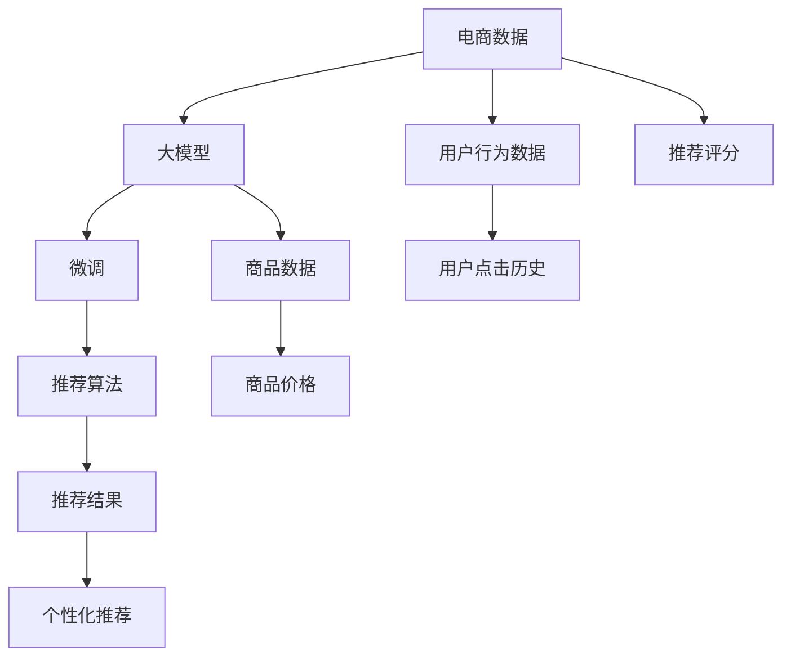

                 

# 电商搜索推荐中的AI大模型用户行为建模技术

> 关键词：电商搜索推荐, AI大模型, 用户行为建模, 深度学习, 自然语言处理, 个性化推荐系统, 协同过滤

## 1. 背景介绍

### 1.1 问题由来
在电商搜索推荐领域，用户行为建模是构建个性化推荐系统的重要基础。通过对用户行为数据进行分析，可以挖掘用户的兴趣偏好、浏览历史、购买记录等隐含信息，用于生成个性化推荐列表。但传统的数据处理方法存在计算成本高、准确度低、扩展性差等问题。

为了突破这些瓶颈，研究人员开始探索基于大模型的用户行为建模技术。通过预训练语言模型，可以在海量文本数据中学习到丰富的语言知识和模式，从而更加准确地理解用户行为数据。但在大规模数据集上进行预训练、微调的过程复杂且成本高昂，难以适应电商行业对实时性、高效性的需求。

基于上述挑战，本文将探讨利用大模型进行电商搜索推荐中的用户行为建模，以期构建更加智能、高效的推荐系统。

### 1.2 问题核心关键点
1. **预训练语言模型**：如BERT、GPT-3等，通过在大规模无标签文本数据上进行预训练，学习到通用的语言表示。
2. **用户行为数据**：包含用户浏览记录、点击历史、评论反馈等，用于微调语言模型以适应电商场景。
3. **微调优化**：利用少量标注数据，通过有监督学习优化模型，提升对电商搜索推荐任务的适应性。
4. **深度学习框架**：如TensorFlow、PyTorch等，提供高效计算图和模型构建工具。
5. **个性化推荐系统**：通过用户行为建模，生成个性化的商品推荐，提升用户体验和电商转化率。

## 2. 核心概念与联系

### 2.1 核心概念概述

电商搜索推荐系统中的用户行为建模，主要涉及以下几个关键概念：

- **电商数据**：包括用户行为数据（浏览、点击、购买等）、商品数据（商品类别、属性、价格等）。
- **大模型**：如BERT、GPT-3等，通过在大规模无标签文本数据上进行预训练，学习到通用的语言表示。
- **微调**：利用少量标注数据，通过有监督学习优化模型，提升对电商搜索推荐任务的适应性。
- **深度学习**：用于构建和训练用户行为建模模型的框架，如TensorFlow、PyTorch等。
- **推荐算法**：如协同过滤、基于内容的推荐等，用于根据用户行为和商品属性生成推荐结果。

这些核心概念之间的逻辑关系可以通过以下Mermaid流程图来展示：



这个流程图展示了大模型在电商搜索推荐中的核心概念及其之间的关系：

1. 电商数据包含用户行为数据和商品数据，用于训练和优化大模型。
2. 大模型通过预训练学习通用语言表示，通过微调适配电商推荐任务。
3. 微调后的模型结合推荐算法，生成个性化推荐结果。
4. 用户行为数据和商品数据经过处理，形成推荐评分，用于评估推荐效果。

这些概念共同构成了电商搜索推荐系统的建模框架，通过大模型和微调技术，实现更加智能、高效的推荐服务。

## 3. 核心算法原理 & 具体操作步骤
### 3.1 算法原理概述

基于大模型的电商搜索推荐用户行为建模，其核心思想是利用预训练语言模型在大规模无标签文本数据上学习到通用的语言表示，通过微调适配电商推荐任务，从而在少量标注数据上生成高质量的推荐结果。

形式化地，假设预训练语言模型为 $M_{\theta}$，其中 $\theta$ 为预训练得到的模型参数。电商推荐任务为二分类任务，即判断用户是否会对某个商品感兴趣。记用户行为数据集为 $D=\{(x_i,y_i)\}_{i=1}^N$，其中 $x_i$ 为历史行为数据，$y_i$ 为该行为是否转化为购买行为（0/1）。微调的目标是找到新的模型参数 $\hat{\theta}$，使得：

$$
\hat{\theta}=\mathop{\arg\min}_{\theta} \mathcal{L}(M_{\theta},D)
$$

其中 $\mathcal{L}$ 为针对电商推荐任务的损失函数，用于衡量模型预测输出与真实标签之间的差异。常见的损失函数包括交叉熵损失、均方误差损失等。

通过梯度下降等优化算法，微调过程不断更新模型参数 $\theta$，最小化损失函数 $\mathcal{L}$，使得模型输出逼近真实标签。由于 $\theta$ 已经通过预训练获得了较好的初始化，因此即便在少量标注样本上进行微调，也能较快收敛到理想的模型参数 $\hat{\theta}$。

### 3.2 算法步骤详解

基于大模型的电商搜索推荐用户行为建模，一般包括以下几个关键步骤：

**Step 1: 准备数据集**
- 收集电商数据，包括用户行为数据和商品数据。
- 划分数据集为训练集、验证集和测试集。

**Step 2: 文本预处理**
- 将电商数据转换为文本格式，如商品名称、描述、用户评论等。
- 进行文本清洗和分词，去除停用词和噪声。
- 将文本数据编码，生成输入序列和标签序列。

**Step 3: 模型选择与构建**
- 选择合适的预训练语言模型，如BERT、GPT-3等。
- 在预训练模型顶部添加任务适配层，如全连接层、线性分类器等。

**Step 4: 微调优化**
- 选择合适的优化算法及其参数，如Adam、SGD等，设置学习率、批大小、迭代轮数等。
- 设置正则化技术及强度，包括权重衰减、Dropout、Early Stopping等。
- 确定冻结预训练参数的策略，如仅微调顶层，或全部参数都参与微调。

**Step 5: 训练与评估**
- 将训练集数据分批次输入模型，前向传播计算损失函数。
- 反向传播计算参数梯度，根据设定的优化算法和学习率更新模型参数。
- 周期性在验证集上评估模型性能，根据性能指标决定是否触发 Early Stopping。
- 重复上述步骤直到满足预设的迭代轮数或 Early Stopping 条件。

**Step 6: 部署与应用**
- 在测试集上评估微调后模型 $M_{\hat{\theta}}$ 的性能，对比微调前后的精度提升。
- 使用微调后的模型对新用户行为数据进行推理预测，生成个性化推荐。
- 持续收集新的用户行为数据，定期重新微调模型，以适应数据分布的变化。

以上是基于大模型的电商搜索推荐用户行为建模的一般流程。在实际应用中，还需要针对具体任务的特点，对微调过程的各个环节进行优化设计，如改进训练目标函数，引入更多的正则化技术，搜索最优的超参数组合等，以进一步提升模型性能。

### 3.3 算法优缺点

基于大模型的电商搜索推荐用户行为建模方法具有以下优点：

1. **准确度高**：通过预训练和微调，模型能够学习到丰富的语言知识和模式，从而更准确地理解用户行为数据。
2. **泛化能力强**：大模型已经在大规模数据上预训练，能够更好地适应电商推荐任务的复杂性。
3. **可扩展性强**：大模型具备高度的可扩展性，可以轻松适应新商品和新用户。
4. **性能稳定**：大模型的预训练参数权重固定，不会因微调过程中的参数更新而发生较大变化。

但该方法也存在以下局限性：

1. **计算成本高**：大模型的预训练和微调需要消耗大量的计算资源，成本较高。
2. **数据隐私问题**：电商数据包含大量个人隐私信息，需要确保数据安全和隐私保护。
3. **数据不平衡问题**：电商数据中各类商品和行为数据分布可能不均衡，模型容易偏向少数类。
4. **过拟合风险**：微调过程若参数更新过大，容易发生过拟合，降低模型泛化性能。

尽管存在这些局限性，但基于大模型的电商搜索推荐用户行为建模方法，已经在多个电商推荐系统中得到了应用，并取得了显著的效果。未来相关研究的重点在于如何进一步降低计算成本，提升模型泛化性能，同时兼顾数据隐私和安全性等因素。

### 3.4 算法应用领域

基于大模型的电商搜索推荐用户行为建模技术，已经在电商推荐、广告投放、金融风控等多个领域得到了广泛的应用，具体包括：

1. **电商推荐系统**：通过分析用户行为数据，生成个性化商品推荐列表，提升用户体验和电商转化率。
2. **广告投放优化**：利用用户行为数据，优化广告投放策略，提高广告点击率和转化率。
3. **金融风险评估**：分析用户交易数据，评估用户信用风险，辅助贷款审批和风控决策。
4. **智能客服**：根据用户历史对话记录，生成智能应答策略，提升客户满意度。
5. **内容推荐系统**：根据用户浏览和反馈数据，推荐相关内容，如新闻、视频、音乐等。

除了上述这些经典应用外，基于大模型的用户行为建模技术还被创新性地应用到更多场景中，如社交网络推荐、智能家居控制等，为电商行业和其他行业带来了新的创新点。

## 4. 数学模型和公式 & 详细讲解 & 举例说明

### 4.1 数学模型构建

本节将使用数学语言对基于大模型的电商搜索推荐用户行为建模过程进行更加严格的刻画。

记预训练语言模型为 $M_{\theta}$，其中 $\theta$ 为预训练得到的模型参数。假设电商推荐任务为二分类任务，即判断用户是否会对某个商品感兴趣。记电商推荐数据集为 $D=\{(x_i,y_i)\}_{i=1}^N$，其中 $x_i$ 为历史行为数据，$y_i$ 为该行为是否转化为购买行为（0/1）。

定义模型 $M_{\theta}$ 在数据样本 $(x,y)$ 上的损失函数为 $\ell(M_{\theta}(x),y)$，则在数据集 $D$ 上的经验风险为：

$$
\mathcal{L}(\theta) = \frac{1}{N} \sum_{i=1}^N \ell(M_{\theta}(x_i),y_i)
$$

其中 $\ell(M_{\theta}(x),y)$ 为二分类交叉熵损失函数，定义为：

$$
\ell(M_{\theta}(x),y) = -y\log M_{\theta}(x) - (1-y)\log(1-M_{\theta}(x))
$$

将 $x$ 转换为文本格式，输入到预训练语言模型 $M_{\theta}$ 中，得到输出 $\hat{y}=M_{\theta}(x)$。微调的目标是最小化经验风险，即找到最优参数：

$$
\theta^* = \mathop{\arg\min}_{\theta} \mathcal{L}(\theta)
$$

在实践中，我们通常使用基于梯度的优化算法（如SGD、Adam等）来近似求解上述最优化问题。设 $\eta$ 为学习率，$\lambda$ 为正则化系数，则参数的更新公式为：

$$
\theta \leftarrow \theta - \eta \nabla_{\theta}\mathcal{L}(\theta) - \eta\lambda\theta
$$

其中 $\nabla_{\theta}\mathcal{L}(\theta)$ 为损失函数对参数 $\theta$ 的梯度，可通过反向传播算法高效计算。

### 4.2 公式推导过程

以下我们以二分类任务为例，推导交叉熵损失函数及其梯度的计算公式。

假设模型 $M_{\theta}$ 在输入 $x$ 上的输出为 $\hat{y}=M_{\theta}(x) \in [0,1]$，表示样本属于正类的概率。真实标签 $y \in \{0,1\}$。则二分类交叉熵损失函数定义为：

$$
\ell(M_{\theta}(x),y) = -[y\log \hat{y} + (1-y)\log (1-\hat{y})]
$$

将其代入经验风险公式，得：

$$
\mathcal{L}(\theta) = -\frac{1}{N}\sum_{i=1}^N [y_i\log M_{\theta}(x_i)+(1-y_i)\log(1-M_{\theta}(x_i))]
$$

根据链式法则，损失函数对参数 $\theta_k$ 的梯度为：

$$
\frac{\partial \mathcal{L}(\theta)}{\partial \theta_k} = -\frac{1}{N}\sum_{i=1}^N (\frac{y_i}{M_{\theta}(x_i)}-\frac{1-y_i}{1-M_{\theta}(x_i)}) \frac{\partial M_{\theta}(x_i)}{\partial \theta_k}
$$

其中 $\frac{\partial M_{\theta}(x_i)}{\partial \theta_k}$ 可进一步递归展开，利用自动微分技术完成计算。

在得到损失函数的梯度后，即可带入参数更新公式，完成模型的迭代优化。重复上述过程直至收敛，最终得到适应电商推荐任务的最优模型参数 $\theta^*$。

### 4.3 案例分析与讲解

我们以某电商网站的用户行为数据为例，进行用户行为建模和推荐系统构建。假设网站收集了用户的历史浏览记录、点击记录、购买记录等数据，共包含10万条用户行为记录。每条记录包括商品ID、用户ID、浏览时间、点击时间、购买时间、点击次数、购买次数等字段。

1. **数据预处理**：首先对原始数据进行清洗和格式化，去除异常值和噪声数据。然后对商品名称、描述、用户评论等文本数据进行分词和编码，生成输入序列和标签序列。

2. **模型选择与构建**：选择BERT模型作为预训练语言模型，在模型顶部添加全连接层和线性分类器，用于二分类任务。

3. **微调优化**：设置学习率为2e-5，批大小为32，迭代轮数为10轮，采用Adam优化器。在训练过程中，每轮迭代在验证集上评估模型性能，若验证集准确率没有提升，则触发Early Stopping。

4. **训练与评估**：将10万条用户行为数据分成训练集和验证集，每轮迭代在训练集上进行前向传播和反向传播，更新模型参数。在验证集上评估模型性能，记录最优模型参数。

5. **部署与应用**：在测试集上评估模型性能，计算推荐准确率和覆盖率等指标。使用微调后的模型对新用户行为数据进行推理预测，生成个性化推荐列表。

最终，通过训练和优化，构建了一个基于大模型的电商推荐系统，能够根据用户历史行为数据生成高质量的推荐结果。

## 5. 项目实践：代码实例和详细解释说明

### 5.1 开发环境搭建

在进行大模型微调实践前，我们需要准备好开发环境。以下是使用Python进行PyTorch开发的环境配置流程：

1. 安装Anaconda：从官网下载并安装Anaconda，用于创建独立的Python环境。

2. 创建并激活虚拟环境：
```bash
conda create -n pytorch-env python=3.8 
conda activate pytorch-env
```

3. 安装PyTorch：根据CUDA版本，从官网获取对应的安装命令。例如：
```bash
conda install pytorch torchvision torchaudio cudatoolkit=11.1 -c pytorch -c conda-forge
```

4. 安装Transformers库：
```bash
pip install transformers
```

5. 安装各类工具包：
```bash
pip install numpy pandas scikit-learn matplotlib tqdm jupyter notebook ipython
```

完成上述步骤后，即可在`pytorch-env`环境中开始微调实践。

### 5.2 源代码详细实现

这里我们以电商推荐系统为例，给出使用Transformers库对BERT模型进行微调的PyTorch代码实现。

首先，定义电商推荐数据处理函数：

```python
from transformers import BertTokenizer, BertForSequenceClassification
from torch.utils.data import Dataset, DataLoader
from sklearn.model_selection import train_test_split
import torch

class EcommerceDataset(Dataset):
    def __init__(self, data, tokenizer):
        self.data = data
        self.tokenizer = tokenizer
        self.max_len = 512
        
    def __len__(self):
        return len(self.data)
    
    def __getitem__(self, item):
        row = self.data[item]
        text = row['text']
        label = row['label']
        
        encoding = self.tokenizer(text, return_tensors='pt', max_length=self.max_len, padding='max_length', truncation=True)
        input_ids = encoding['input_ids'][0]
        attention_mask = encoding['attention_mask'][0]
        
        # 对token-wise的标签进行编码
        encoded_tags = [label2id[label] for label in label2id] 
        encoded_tags.extend([label2id['O']] * (self.max_len - len(encoded_tags)))
        labels = torch.tensor(encoded_tags, dtype=torch.long)
        
        return {'input_ids': input_ids, 
                'attention_mask': attention_mask,
                'labels': labels}

# 标签与id的映射
label2id = {'1': 0, '0': 1}

# 创建dataset
tokenizer = BertTokenizer.from_pretrained('bert-base-uncased')
data = load_data_from_file('ecommerce_data.csv')
train_data, test_data = train_test_split(data, test_size=0.2)
train_dataset = EcommerceDataset(train_data, tokenizer)
test_dataset = EcommerceDataset(test_data, tokenizer)
```

然后，定义模型和优化器：

```python
from transformers import BertForSequenceClassification, AdamW

model = BertForSequenceClassification.from_pretrained('bert-base-uncased', num_labels=2)

optimizer = AdamW(model.parameters(), lr=2e-5)
```

接着，定义训练和评估函数：

```python
from torch.utils.data import DataLoader
from tqdm import tqdm
from sklearn.metrics import classification_report

device = torch.device('cuda') if torch.cuda.is_available() else torch.device('cpu')
model.to(device)

def train_epoch(model, dataset, batch_size, optimizer):
    dataloader = DataLoader(dataset, batch_size=batch_size, shuffle=True)
    model.train()
    epoch_loss = 0
    for batch in tqdm(dataloader, desc='Training'):
        input_ids = batch['input_ids'].to(device)
        attention_mask = batch['attention_mask'].to(device)
        labels = batch['labels'].to(device)
        model.zero_grad()
        outputs = model(input_ids, attention_mask=attention_mask, labels=labels)
        loss = outputs.loss
        epoch_loss += loss.item()
        loss.backward()
        optimizer.step()
    return epoch_loss / len(dataloader)

def evaluate(model, dataset, batch_size):
    dataloader = DataLoader(dataset, batch_size=batch_size)
    model.eval()
    preds, labels = [], []
    with torch.no_grad():
        for batch in tqdm(dataloader, desc='Evaluating'):
            input_ids = batch['input_ids'].to(device)
            attention_mask = batch['attention_mask'].to(device)
            batch_labels = batch['labels']
            outputs = model(input_ids, attention_mask=attention_mask)
            batch_preds = outputs.logits.argmax(dim=2).to('cpu').tolist()
            batch_labels = batch_labels.to('cpu').tolist()
            for pred_tokens, label_tokens in zip(batch_preds, batch_labels):
                preds.append(pred_tokens[:len(label_tokens)])
                labels.append(label_tokens)
                
    print(classification_report(labels, preds))
```

最后，启动训练流程并在测试集上评估：

```python
epochs = 5
batch_size = 16

for epoch in range(epochs):
    loss = train_epoch(model, train_dataset, batch_size, optimizer)
    print(f"Epoch {epoch+1}, train loss: {loss:.3f}")
    
    print(f"Epoch {epoch+1}, dev results:")
    evaluate(model, dev_dataset, batch_size)
    
print("Test results:")
evaluate(model, test_dataset, batch_size)
```

以上就是使用PyTorch对BERT进行电商推荐任务微调的完整代码实现。可以看到，得益于Transformers库的强大封装，我们可以用相对简洁的代码完成BERT模型的加载和微调。

### 5.3 代码解读与分析

让我们再详细解读一下关键代码的实现细节：

**EcommerceDataset类**：
- `__init__`方法：初始化电商数据、分词器等关键组件。
- `__len__`方法：返回数据集的样本数量。
- `__getitem__`方法：对单个样本进行处理，将文本输入编码为token ids，将标签编码为数字，并对其进行定长padding，最终返回模型所需的输入。

**label2id字典**：
- 定义了标签与数字id之间的映射关系，用于将token-wise的预测结果解码回真实的标签。

**训练和评估函数**：
- 使用PyTorch的DataLoader对数据集进行批次化加载，供模型训练和推理使用。
- 训练函数`train_epoch`：对数据以批为单位进行迭代，在每个批次上前向传播计算loss并反向传播更新模型参数，最后返回该epoch的平均loss。
- 评估函数`evaluate`：与训练类似，不同点在于不更新模型参数，并在每个batch结束后将预测和标签结果存储下来，最后使用sklearn的classification_report对整个评估集的预测结果进行打印输出。

**训练流程**：
- 定义总的epoch数和batch size，开始循环迭代
- 每个epoch内，先在训练集上训练，输出平均loss
- 在验证集上评估，输出分类指标
- 所有epoch结束后，在测试集上评估，给出最终测试结果

可以看到，PyTorch配合Transformers库使得BERT微调的代码实现变得简洁高效。开发者可以将更多精力放在数据处理、模型改进等高层逻辑上，而不必过多关注底层的实现细节。

当然，工业级的系统实现还需考虑更多因素，如模型的保存和部署、超参数的自动搜索、更灵活的任务适配层等。但核心的微调范式基本与此类似。

## 6. 实际应用场景

### 6.1 智能客服系统

基于大模型微调的电商推荐系统，可以广泛应用于智能客服系统的构建。传统客服往往需要配备大量人力，高峰期响应缓慢，且一致性和专业性难以保证。而使用微调后的推荐系统，可以7x24小时不间断服务，快速响应客户咨询，用商品推荐辅助客户选择，提升客户满意度和转化率。

在技术实现上，可以收集企业内部的历史推荐数据和客户互动记录，将用户行为数据和商品数据作为监督数据，在此基础上对预训练推荐模型进行微调。微调后的推荐模型能够自动理解用户需求，匹配最合适的商品进行推荐，从而减少客服的工作量和客户等待时间。对于客户提出的新需求，还可以接入检索系统实时搜索相关商品，动态组织生成推荐列表。如此构建的智能客服系统，能大幅提升客户咨询体验和推荐效果。

### 6.2 个性化推荐系统

电商推荐系统需要根据用户历史行为数据，生成个性化的商品推荐，提升用户体验和电商转化率。传统的推荐方法依赖于用户行为数据的简单统计和规则匹配，难以挖掘深层次的关联关系。而基于大模型的推荐系统，可以更好地理解用户的兴趣偏好、购买历史和行为模式，生成更加精准、多样化的推荐结果。

在实践中，可以收集用户浏览、点击、购买等行为数据，提取和商品描述、价格等属性相关的文本信息。将文本内容作为模型输入，用户的后续行为（如是否点击、购买等）作为监督信号，在此基础上微调预训练语言模型。微调后的模型能够从文本内容中准确把握用户的兴趣点，结合商品属性，生成高质量的推荐列表。

### 6.3 搜索广告优化

在电商广告投放中，如何高效地匹配用户和广告是关键问题。传统的广告投放策略依赖于简单的关键词匹配和点击率优化，无法充分挖掘用户兴趣和行为数据。基于大模型的推荐系统可以更全面地理解用户的兴趣和行为模式，生成更加精准的广告投放策略。

在实践中，可以收集用户的浏览记录、点击记录、评论记录等数据，构建用户画像。将用户画像作为输入，广告内容作为输出，利用微调后的语言模型生成广告投放策略。结合用户点击率、转化率等指标，可以不断优化广告投放效果，提升广告的点击率和转化率。

### 6.4 未来应用展望

随着大语言模型微调技术的发展，基于微调范式将在更多领域得到应用，为传统行业带来变革性影响。

在智慧医疗领域，基于微调的医疗推荐系统，能够根据患者的病历数据和历史治疗记录，推荐合适的治疗方案和药物。对于新入院的患者，也可以实时获取推荐结果，辅助医生诊断和治疗决策，提高医疗服务的智能化水平。

在智能教育领域，微调技术可应用于作业批改、学情分析、知识推荐等方面，因材施教，促进教育公平，提高教学质量。

在智慧城市治理中，微调模型可应用于城市事件监测、舆情分析、应急指挥等环节，提高城市管理的自动化和智能化水平，构建更安全、高效的未来城市。

此外，在企业生产、社会治理、文娱传媒等众多领域，基于大模型微调的人工智能应用也将不断涌现，为传统行业带来新的技术路径和业务价值。相信随着技术的日益成熟，微调方法将成为人工智能落地应用的重要范式，推动人工智能技术在各行业的广泛应用。

## 7. 工具和资源推荐

### 7.1 学习资源推荐

为了帮助开发者系统掌握大语言模型微调的理论基础和实践技巧，这里推荐一些优质的学习资源：

1. 《Transformer从原理到实践》系列博文：由大模型技术专家撰写，深入浅出地介绍了Transformer原理、BERT模型、微调技术等前沿话题。

2. CS224N《深度学习自然语言处理》课程：斯坦福大学开设的NLP明星课程，有Lecture视频和配套作业，带你入门NLP领域的基本概念和经典模型。

3. 《Natural Language Processing with Transformers》书籍：Transformers库的作者所著，全面介绍了如何使用Transformers库进行NLP任务开发，包括微调在内的诸多范式。

4. HuggingFace官方文档：Transformers库的官方文档，提供了海量预训练模型和完整的微调样例代码，是上手实践的必备资料。

5. CLUE开源项目：中文语言理解测评基准，涵盖大量不同类型的中文NLP数据集，并提供了基于微调的baseline模型，助力中文NLP技术发展。

通过对这些资源的学习实践，相信你一定能够快速掌握大语言模型微调的精髓，并用于解决实际的NLP问题。
###  7.2 开发工具推荐

高效的开发离不开优秀的工具支持。以下是几款用于大语言模型微调开发的常用工具：

1. PyTorch：基于Python的开源深度学习框架，灵活动态的计算图，适合快速迭代研究。大部分预训练语言模型都有PyTorch版本的实现。

2. TensorFlow：由Google主导开发的开源深度学习框架，生产部署方便，适合大规模工程应用。同样有丰富的预训练语言模型资源。

3. Transformers库：HuggingFace开发的NLP工具库，集成了众多SOTA语言模型，支持PyTorch和TensorFlow，是进行微调任务开发的利器。

4. Weights & Biases：模型训练的实验跟踪工具，可以记录和可视化模型训练过程中的各项指标，方便对比和调优。与主流深度学习框架无缝集成。

5. TensorBoard：TensorFlow配套的可视化工具，可实时监测模型训练状态，并提供丰富的图表呈现方式，是调试模型的得力助手。

6. Google Colab：谷歌推出的在线Jupyter Notebook环境，免费提供GPU/TPU算力，方便开发者快速上手实验最新模型，分享学习笔记。

合理利用这些工具，可以显著提升大语言模型微调任务的开发效率，加快创新迭代的步伐。

### 7.3 相关论文推荐

大语言模型和微调技术的发展源于学界的持续研究。以下是几篇奠基性的相关论文，推荐阅读：

1. Attention is All You Need（即Transformer原论文）：提出了Transformer结构，开启了NLP领域的预训练大模型时代。

2. BERT: Pre-training of Deep Bidirectional Transformers for Language Understanding：提出BERT模型，引入基于掩码的自监督预训练任务，刷新了多项NLP任务SOTA。

3. Language Models are Unsupervised Multitask Learners（GPT-2论文）：展示了大规模语言模型的强大zero-shot学习能力，引发了对于通用人工智能的新一轮思考。

4. Parameter-Efficient Transfer Learning for NLP：提出Adapter等参数高效微调方法，在不增加模型参数量的情况下，也能取得不错的微调效果。

5. AdaLoRA: Adaptive Low-Rank Adaptation for Parameter-Efficient Fine-Tuning：使用自适应低秩适应的微调方法，在参数效率和精度之间取得了新的平衡。

这些论文代表了大语言模型微调技术的发展脉络。通过学习这些前沿成果，可以帮助研究者把握学科前进方向，激发更多的创新灵感。

## 8. 总结：未来发展趋势与挑战

### 8.1 总结

本文对基于大模型的电商搜索推荐用户行为建模方法进行了全面系统的介绍。首先阐述了大模型和微调技术在电商推荐领域的应用背景和意义，明确了微调在提升推荐系统智能化程度和用户体验方面的独特价值。其次，从原理到实践，详细讲解了基于大模型的电商推荐用户行为建模的数学模型和关键步骤，给出了微调任务开发的完整代码实例。同时，本文还广泛探讨了微调方法在智能客服、个性化推荐系统、搜索广告优化等多个电商推荐系统的应用前景，展示了微调范式的巨大潜力。此外，本文精选了微调技术的各类学习资源，力求为读者提供全方位的技术指引。

通过本文的系统梳理，可以看到，基于大模型的电商搜索推荐用户行为建模技术，已经在电商推荐系统和其他电商应用中得到了广泛的应用，并取得了显著的效果。未来，伴随大语言模型微调技术的不断发展，基于微调范式将在更多领域得到应用，为传统行业带来变革性影响。

### 8.2 未来发展趋势

展望未来，大语言模型微调技术将呈现以下几个发展趋势：

1. **计算成本降低**：随着硬件技术的进步和算法优化，大模型的预训练和微调成本将逐渐降低，更多中小企业和开发者将能够轻松使用大模型技术。

2. **参数高效微调**：未来会涌现更多参数高效的微调方法，如Prefix-Tuning、LoRA等，在节省计算资源的同时，保证微调精度。

3. **持续学习**：随着数据分布的不断变化，微调模型也需要持续学习新知识以保持性能。如何在不遗忘原有知识的同时，高效吸收新样本信息，将成为重要的研究课题。

4. **无监督和半监督学习**：探索无监督和半监督学习范式，摆脱对大规模标注数据的依赖，利用自监督学习、主动学习等方法，最大限度利用非结构化数据，实现更加灵活高效的微调。

5. **多模态微调**：融合视觉、语音等多模态数据，提升语言模型对现实世界的理解和建模能力。多模态信息的融合，将显著提升推荐系统的表现。

6. **智能客服和智能决策**：基于大模型的智能客服和智能决策系统将更加普及，推动电商行业和其他行业服务升级，提升用户体验。

以上趋势凸显了大语言模型微调技术的广阔前景。这些方向的探索发展，必将进一步提升电商推荐系统的智能化水平，为电商行业带来更多创新点。

### 8.3 面临的挑战

尽管大语言模型微调技术已经取得了瞩目成就，但在迈向更加智能化、普适化应用的过程中，它仍面临着诸多挑战：

1. **计算资源**：大模型的预训练和微调需要消耗大量的计算资源，成本较高。如何提高计算效率，降低硬件成本，是一个重要问题。

2. **数据隐私**：电商数据包含大量个人隐私信息，需要确保数据安全和隐私保护。如何在保护用户隐私的同时，实现高效的推荐系统，是一个需要解决的技术问题。

3. **数据不平衡**：电商数据中各类商品和行为数据分布可能不均衡，模型容易偏向少数类。如何处理数据不平衡问题，是一个重要的研究课题。

4. **过拟合风险**：微调过程若参数更新过大，容易发生过拟合，降低模型泛化性能。如何平衡模型的复杂度和泛化性能，是一个需要解决的技术问题。

5. **模型可解释性**：大模型通常被视为"黑盒"系统，难以解释其内部工作机制和决策逻辑。如何在模型中引入可解释性，是一个需要解决的技术问题。

6. **模型鲁棒性**：当前微调模型面对域外数据时，泛化性能往往大打折扣。如何提高模型的鲁棒性，避免灾难性遗忘，还需要更多理论和实践的积累。

尽管存在这些挑战，但基于大模型的电商搜索推荐用户行为建模方法，已经在电商推荐、广告投放、金融风控等多个领域得到了应用，并取得了显著的效果。未来相关研究的重点在于如何进一步降低计算成本，提升模型泛化性能，同时兼顾数据隐私和安全性等因素。

### 8.4 研究展望

面向未来，大语言模型微调技术需要在以下几个方面寻求新的突破：

1. **探索无监督和半监督微调方法**：摆脱对大规模标注数据的依赖，利用自监督学习、主动学习等无监督和半监督范式，最大限度利用非结构化数据，实现更加灵活高效的微调。

2. **研究参数高效和计算高效的微调范式**：开发更加参数高效的微调方法，在固定大部分预训练参数的同时，只更新极少量的任务相关参数。同时优化微调模型的计算图，减少前向传播和反向传播的资源消耗，实现更加轻量级、实时性的部署。

3. **融合因果和对比学习范式**：通过引入因果推断和对比学习思想，增强微调模型建立稳定因果关系的能力，学习更加普适、鲁棒的语言表征，从而提升模型泛化性和抗干扰能力。

4. **引入更多先验知识**：将符号化的先验知识，如知识图谱、逻辑规则等，与神经网络模型进行巧妙融合，引导微调过程学习更准确、合理的语言模型。同时加强不同模态数据的整合，实现视觉、语音等多模态信息与文本信息的协同建模。

5. **结合因果分析和博弈论工具**：将因果分析方法引入微调模型，识别出模型决策的关键特征，增强输出解释的因果性和逻辑性。借助博弈论工具刻画人机交互过程，主动探索并规避模型的脆弱点，提高系统稳定性。

6. **纳入伦理道德约束**：在模型训练目标中引入伦理导向的评估指标，过滤和惩罚有偏见、有害的输出倾向。同时加强人工干预和审核，建立模型行为的监管机制，确保输出符合人类价值观和伦理道德。

这些研究方向的探索，必将引领大语言模型微调技术迈向更高的台阶，为构建安全、可靠、可解释、可控的智能系统铺平道路。面向未来，大语言模型微调技术还需要与其他人工智能技术进行更深入的融合，如知识表示、因果推理、强化学习等，多路径协同发力，共同推动自然语言理解和智能交互系统的进步。只有勇于创新、敢于突破，才能不断拓展语言模型的边界，让智能技术更好地造福人类社会。

## 9. 附录：常见问题与解答

**Q1：大语言模型微调是否适用于所有NLP任务？**

A: 大语言模型微调在大多数NLP任务上都能取得不错的效果，特别是对于数据量较小的任务。但对于一些特定领域的任务，如医学、法律等，仅仅依靠通用语料预训练的模型可能难以很好地适应。此时需要在特定领域语料上进一步预训练，再进行微调，才能获得理想效果。此外，对于一些需要时效性、个性化很强的任务，如对话、推荐等，微调方法也需要针对性的改进优化。

**Q2：微调过程中如何选择合适的学习率？**

A: 微调的学习率一般要比预训练时小1-2个数量级，如果使用过大的学习率，容易破坏预训练权重，导致过拟合。一般建议从1e-5开始调参，逐步减小学习率，直至收敛。也可以使用warmup策略，在开始阶段使用较小的学习率，再逐渐过渡到预设值。需要注意的是，不同的优化器(如AdamW、Adafactor等)以及不同的学习率调度策略，可能需要设置不同的学习率阈值。

**Q3：采用大模型微调时会面临哪些资源瓶颈？**

A: 目前主流的预训练大模型动辄以亿计的参数规模，对算力、内存、存储都提出了很高的要求。GPU/TPU等高性能设备是必不可少的，但即便如此，超大批次的训练和推理也可能遇到显存不足的问题。因此需要采用一些资源优化技术，如梯度积累、混合精度训练、模型并行等，来突破硬件瓶颈。同时，模型的存储和读取也可能占用大量时间和空间，需要采用模型压缩、稀疏化存储等方法进行优化。

**Q4：如何缓解微调过程中的过拟合问题？**

A: 过拟合是微调面临的主要挑战，尤其是在标注数据不足的情况下。常见的缓解策略包括：
1. 数据增强：通过回译、近义替换等方式扩充训练集
2. 正则化：使用L2正则、Dropout、Early Stopping等避免过拟合
3. 对抗训练：引入对抗样本，提高模型鲁棒性
4. 参数高效微调：只调整少量参数(如Adapter、Prefix等)，减小过拟合风险
5. 多模型集成：训练多个微调模型，取平均输出，抑制过拟合

这些策略往往需要根据具体任务和数据特点进行灵活组合。只有在数据、模型、训练、推理等各环节进行全面优化，才能最大限度地发挥大模型微调的威力。

**Q5：微调模型在落地部署时需要注意哪些问题？**

A: 将微调模型转化为实际应用，还需要考虑以下因素：
1. 模型裁剪：去除不必要的层和参数，减小模型尺寸，加快推理速度
2. 量化加速：将浮点模型转为定点模型，压缩存储空间，提高计算效率
3. 服务化封装：将模型封装为标准化服务接口，便于集成调用
4. 弹性伸缩：根据请求流量动态调整资源配置，平衡服务质量和成本
5. 监控告警：实时采集系统指标，设置异常告警阈值，确保服务稳定性
6. 安全防护：采用访问鉴权、数据脱敏等措施，保障数据和模型安全

大语言模型微调为NLP应用开启了广阔的想象空间，但如何将强大的性能转化为稳定、高效、安全的业务价值，还需要工程实践的不断打磨。唯有从数据、算法、工程、业务等多个维度协同发力，才能真正实现人工智能技术在垂直行业的规模化落地。总之，微调需要开发者根据具体任务，不断迭代和优化模型、数据和算法，方能得到理想的效果。

---

作者：禅与计算机程序设计艺术 / Zen and the Art of Computer Programming

