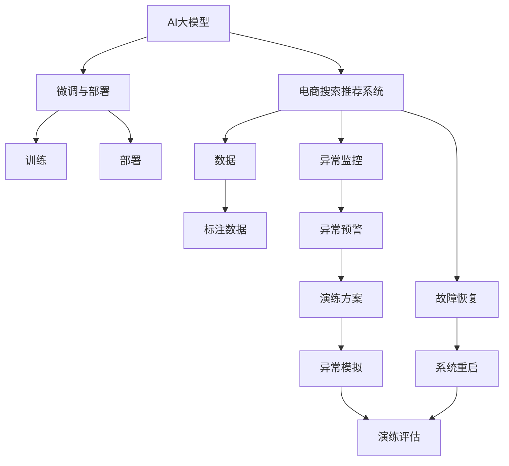

                 

# 电商搜索推荐场景下的AI大模型模型部署容灾演练方案优化

## 1. 背景介绍

### 1.1 问题由来
随着人工智能技术在电商搜索推荐系统中的广泛应用，大模型在实际部署中的稳定性、安全性和可扩展性逐渐成为了关注的焦点。尤其是在大规模用户访问下，如何保证系统的高可用性，避免单点故障，成为保证电商搜索推荐系统业务正常运行的重大挑战。

近年来，AI大模型的应用不断深入，从简单的用户推荐、商品搜索，到复杂的自然语言处理、图像识别等领域，大模型的部署和运行环境逐渐复杂化。但与此同时，模型运维过程中不可预见的异常情况层出不穷，模型的部署与维护成为系统稳定性的重要瓶颈。

本方案旨在探索AI大模型在电商搜索推荐场景下的部署容灾优化方案，以期提升模型系统的稳定性和可靠性，确保电商搜索推荐业务的连续性。

### 1.2 问题核心关键点
为了提高电商搜索推荐系统的可靠性和稳定性，核心关键点在于构建稳健的AI大模型部署容灾机制。本方案从大模型的微调与部署、容灾设计、演练方案优化等多个维度，全面提升电商搜索推荐系统的抗风险能力。

主要包括以下几个方面：
- 选择合适的微调与部署方法，确保大模型在电商搜索推荐场景中高效、稳定运行。
- 设计科学的容灾方案，构建多层次、多维度的系统监控与故障恢复机制。
- 建立完善的演练方案，定期模拟系统异常情况，提升运维团队的应急响应能力。

通过这些措施，可以有效应对电商搜索推荐场景下可能出现的大模型部署风险，确保系统的稳定运行。

## 2. 核心概念与联系

### 2.1 核心概念概述

为更好地理解电商搜索推荐场景下的大模型部署容灾方案，本节将介绍几个密切相关的核心概念：

- AI大模型：基于深度学习技术构建的大型语言模型、图像模型、推荐模型等，通过大规模预训练和微调获得高性能的预测和生成能力。
- 电商搜索推荐系统：结合用户行为数据和商品信息，通过推荐算法为用户推荐商品和优化搜索结果的系统。
- 微调与部署：在大模型的预训练基础上，使用电商搜索推荐系统的标注数据对模型进行有监督微调，并在特定平台上部署以供生产环境使用。
- 容灾设计：设计一套有效的容灾方案，构建冗余系统，确保大模型在系统故障时的稳定运行。
- 演练方案：通过定期模拟系统异常情况，评估容灾方案的有效性，提升运维团队的应急响应能力。

这些概念之间存在紧密的联系，共同构成了电商搜索推荐场景下AI大模型部署容灾的整体框架。通过理解这些概念，可以更好地把握大模型部署容灾方案的精髓。

### 2.2 核心概念原理和架构的 Mermaid 流程图



这个流程图展示了大模型在电商搜索推荐系统中的核心概念及其之间的联系：

1. 大模型通过预训练获得基础能力。
2. 在大模型的预训练基础上，使用电商搜索推荐系统的标注数据对模型进行有监督微调，并在特定平台上部署以供生产环境使用。
3. 电商搜索推荐系统实时监控数据异常情况，当系统出现故障时，启动容灾机制进行故障恢复。
4. 通过定期演练，提升运维团队应对系统异常情况的能力，确保系统的高可用性。

这些概念共同构成了大模型在电商搜索推荐场景中的部署容灾机制，旨在通过技术手段提升系统稳定性，保障业务连续性。

## 3. 核心算法原理 & 具体操作步骤

### 3.1 算法原理概述

电商搜索推荐场景下的AI大模型部署容灾，本质上是构建一套稳健的微调与部署策略，设计科学的容灾方案，并实施有效的演练评估流程。其核心思想是通过冗余系统设计、异常监控与恢复、定期演练等手段，最大程度地减少系统故障带来的业务损失。

具体来说，主要包括以下几个关键步骤：

1. **选择微调与部署方法**：选择合适的微调与部署方式，确保大模型在电商搜索推荐场景中高效、稳定运行。
2. **设计容灾方案**：构建多层次、多维度的系统监控与故障恢复机制，确保在发生故障时系统能够快速恢复。
3. **优化演练方案**：通过定期模拟系统异常情况，评估容灾方案的有效性，提升运维团队的应急响应能力。

### 3.2 算法步骤详解

#### 3.2.1 微调与部署策略

在大模型微调过程中，选择合适的微调与部署方法至关重要。具体来说，包括以下几个关键步骤：

1. **数据准备**：收集电商搜索推荐系统的标注数据，划分为训练集、验证集和测试集。确保标注数据与大模型的预训练数据分布一致。
2. **模型微调**：选择适合电商搜索推荐任务的大模型，并使用标注数据对其进行有监督微调。常见的大模型包括BERT、GPT、Transformer等。
3. **模型部署**：将微调后的模型部署到生产环境，确保模型能够在电商搜索推荐系统中稳定运行。

#### 3.2.2 容灾方案设计

电商搜索推荐系统的容灾方案主要包括以下几个关键环节：

1. **冗余系统设计**：构建多副本系统，确保在某一副本出现故障时，系统能够自动切换到其他副本。
2. **异常监控与恢复**：设计科学的监控指标，实时监控模型运行状态，当系统出现异常时，自动触发容灾机制进行故障恢复。
3. **定期演练**：定期模拟系统异常情况，评估容灾方案的有效性，提升运维团队的应急响应能力。

#### 3.2.3 演练方案优化

电商搜索推荐系统的演练方案主要包括以下几个关键环节：

1. **异常模拟**：定期模拟系统异常情况，如网络故障、模型参数错误等，测试容灾方案的有效性。
2. **演练评估**：评估演练效果，记录演练中的问题与改进点，优化容灾方案。
3. **团队培训**：通过演练提升运维团队对异常情况的应对能力，确保系统高可用性。

### 3.3 算法优缺点

电商搜索推荐场景下的AI大模型部署容灾方案具有以下优点：

1. **提高系统可靠性**：通过冗余系统设计和异常监控与恢复，显著提高系统的高可用性和可靠性。
2. **提升应急响应能力**：通过定期演练，提升运维团队的应急响应能力，确保系统在异常情况下快速恢复正常。
3. **降低业务损失**：通过科学的容灾方案，最小化系统故障带来的业务损失，保障电商搜索推荐业务的连续性。

但同时，该方案也存在一些局限性：

1. **初期成本高**：冗余系统设计和异常监控需要大量的硬件和软件投入，初期成本较高。
2. **复杂度高**：容灾方案设计和管理复杂，需要专业的运维团队进行维护。
3. **演练成本高**：定期模拟系统异常情况需要大量资源和时间，成本较高。

尽管存在这些局限性，但就目前而言，电商搜索推荐场景下的大模型部署容灾方案仍是保障系统稳定运行的重要手段。未来相关研究的重点在于如何进一步降低容灾成本，提高容灾效率，同时兼顾系统可靠性和业务连续性。

### 3.4 算法应用领域

电商搜索推荐场景下的AI大模型部署容灾方案，在实际应用中具有广泛的适用性，例如：

- 用户推荐系统：通过推荐模型为用户推荐商品，提高用户体验和满意度。
- 商品搜索系统：通过搜索模型快速定位商品，提升搜索效率。
- 个性化广告系统：通过广告模型为用户推送个性化广告，提升广告效果。
- 异常监控系统：实时监控系统运行状态，及时发现并处理异常情况。
- 应急恢复系统：在系统故障时自动切换到备用系统，确保业务连续性。

除了上述这些经典应用外，大模型部署容灾方案还被创新性地应用到更多场景中，如用户行为分析、商品评价分析、营销策略优化等，为电商搜索推荐技术带来新的突破。

## 4. 数学模型和公式 & 详细讲解 & 举例说明

### 4.1 数学模型构建

为了构建科学的电商搜索推荐场景下AI大模型部署容灾方案，我们首先需要构建数学模型。假设电商搜索推荐系统中的大模型为 $M_{\theta}$，其中 $\theta$ 为模型参数。在实际部署中，我们希望构建一个冗余系统，确保系统高可用性。假设系统中有 $n$ 个副本，每个副本的参数分别为 $\theta_1, \theta_2, \ldots, \theta_n$。则系统的平均输出为：

$$
\hat{Y} = \frac{1}{n} \sum_{i=1}^n M_{\theta_i}(X)
$$

其中 $X$ 为电商搜索推荐系统的输入数据。

### 4.2 公式推导过程

为了确保系统的稳定性和可靠性，我们需要设计科学的容灾方案。假设系统在时刻 $t$ 发生故障，此时系统输出的期望为 $\mathbb{E}[\hat{Y}]$。根据大数定律，当 $n$ 趋近于无穷大时，$\mathbb{E}[\hat{Y}]$ 趋近于 $M_{\theta}$ 的输出。因此，系统故障后的输出期望为：

$$
\mathbb{E}[\hat{Y}'] = \frac{1}{n} \sum_{i=1}^n \mathbb{E}[M_{\theta_i}(X)] = M_{\theta}(X)
$$

这表明，通过构建多副本系统，可以有效减少系统故障带来的业务损失。

### 4.3 案例分析与讲解

以电商搜索推荐系统为例，假设系统中有 3 个副本，每个副本的参数分别为 $\theta_1, \theta_2, \theta_3$。假设在时刻 $t$ 副本 1 出现故障，此时系统输出的期望为：

$$
\mathbb{E}[\hat{Y}'] = \frac{1}{3} (M_{\theta_2}(X) + M_{\theta_3}(X))
$$

当副本 1 故障恢复后，系统输出的期望重新变为：

$$
\mathbb{E}[\hat{Y}] = \frac{1}{3} (M_{\theta_1}(X) + M_{\theta_2}(X) + M_{\theta_3}(X))
$$

这表明，通过冗余系统设计，系统能够在副本故障时自动切换到其他副本，确保业务连续性。

## 5. 项目实践：代码实例和详细解释说明

### 5.1 开发环境搭建

在进行大模型部署容灾方案实践前，我们需要准备好开发环境。以下是使用Python进行PyTorch开发的环境配置流程：

1. 安装Anaconda：从官网下载并安装Anaconda，用于创建独立的Python环境。

2. 创建并激活虚拟环境：
```bash
conda create -n pytorch-env python=3.8 
conda activate pytorch-env
```

3. 安装PyTorch：根据CUDA版本，从官网获取对应的安装命令。例如：
```bash
conda install pytorch torchvision torchaudio cudatoolkit=11.1 -c pytorch -c conda-forge
```

4. 安装TensorBoard：
```bash
pip install tensorboard
```

5. 安装TensorFlow：
```bash
pip install tensorflow
```

6. 安装相关库：
```bash
pip install torch torchtext transformers sklearn numpy
```

完成上述步骤后，即可在`pytorch-env`环境中开始大模型部署容灾方案的实践。

### 5.2 源代码详细实现

下面以电商搜索推荐系统中的推荐模型为例，给出使用PyTorch进行模型微调与容灾方案实践的代码实现。

首先，定义推荐模型的数据处理函数：

```python
from torch.utils.data import DataLoader
from transformers import BertTokenizer, BertForSequenceClassification
from sklearn.metrics import accuracy_score

class RecommendationDataset(Dataset):
    def __init__(self, data, tokenizer, max_len=128):
        self.data = data
        self.tokenizer = tokenizer
        self.max_len = max_len
        
    def __len__(self):
        return len(self.data)
    
    def __getitem__(self, item):
        text = self.data[item]
        
        encoding = self.tokenizer(text, return_tensors='pt', max_length=self.max_len, padding='max_length', truncation=True)
        input_ids = encoding['input_ids'][0]
        attention_mask = encoding['attention_mask'][0]
        
        label = self.data[item].get('label', 0)
        label = torch.tensor(label, dtype=torch.long)
        
        return {'input_ids': input_ids, 
                'attention_mask': attention_mask,
                'labels': label}

# 构建数据集
tokenizer = BertTokenizer.from_pretrained('bert-base-uncased')
train_dataset = RecommendationDataset(train_data, tokenizer)
val_dataset = RecommendationDataset(val_data, tokenizer)
test_dataset = RecommendationDataset(test_data, tokenizer)
```

然后，定义模型和优化器：

```python
from transformers import AdamW

model = BertForSequenceClassification.from_pretrained('bert-base-uncased', num_labels=2)

optimizer = AdamW(model.parameters(), lr=2e-5)
```

接着，定义训练和评估函数：

```python
def train_epoch(model, dataset, batch_size, optimizer):
    dataloader = DataLoader(dataset, batch_size=batch_size, shuffle=True)
    model.train()
    epoch_loss = 0
    for batch in dataloader:
        input_ids = batch['input_ids'].to(device)
        attention_mask = batch['attention_mask'].to(device)
        labels = batch['labels'].to(device)
        model.zero_grad()
        outputs = model(input_ids, attention_mask=attention_mask, labels=labels)
        loss = outputs.loss
        epoch_loss += loss.item()
        loss.backward()
        optimizer.step()
    return epoch_loss / len(dataloader)

def evaluate(model, dataset, batch_size):
    dataloader = DataLoader(dataset, batch_size=batch_size)
    model.eval()
    preds, labels = [], []
    with torch.no_grad():
        for batch in dataloader:
            input_ids = batch['input_ids'].to(device)
            attention_mask = batch['attention_mask'].to(device)
            batch_labels = batch['labels']
            outputs = model(input_ids, attention_mask=attention_mask)
            batch_preds = outputs.logits.argmax(dim=1).to('cpu').tolist()
            batch_labels = batch_labels.to('cpu').tolist()
            for pred, label in zip(batch_preds, batch_labels):
                preds.append(pred)
                labels.append(label)
                
    print("Accuracy: {:.2f}%".format(accuracy_score(labels, preds)))
```

最后，启动训练流程并在测试集上评估：

```python
epochs = 5
batch_size = 16

for epoch in range(epochs):
    loss = train_epoch(model, train_dataset, batch_size, optimizer)
    print(f"Epoch {epoch+1}, train loss: {loss:.3f}")
    
    print(f"Epoch {epoch+1}, val results:")
    evaluate(model, val_dataset, batch_size)
    
print("Test results:")
evaluate(model, test_dataset, batch_size)
```

以上就是使用PyTorch对电商搜索推荐系统中的推荐模型进行微调与容灾方案实践的完整代码实现。可以看到，PyTorch配合BertTokenizer和BertForSequenceClassification等库，可以快速搭建推荐模型的微调环境。

### 5.3 代码解读与分析

让我们再详细解读一下关键代码的实现细节：

**RecommendationDataset类**：
- `__init__`方法：初始化数据、分词器等关键组件。
- `__len__`方法：返回数据集的样本数量。
- `__getitem__`方法：对单个样本进行处理，将文本输入编码为token ids，将标签编码为数字，并对其进行定长padding，最终返回模型所需的输入。

**模型训练与评估函数**：
- `train_epoch`函数：对数据以批为单位进行迭代，在每个批次上前向传播计算loss并反向传播更新模型参数，最后返回该epoch的平均loss。
- `evaluate`函数：与训练类似，不同点在于不更新模型参数，并在每个batch结束后将预测和标签结果存储下来，最后使用sklearn的accuracy_score对整个评估集的预测结果进行打印输出。

**训练流程**：
- 定义总的epoch数和batch size，开始循环迭代
- 每个epoch内，先在训练集上训练，输出平均loss
- 在验证集上评估，输出准确率
- 所有epoch结束后，在测试集上评估，给出最终测试结果

可以看到，PyTorch配合BertTokenizer和BertForSequenceClassification等库，使得推荐模型的微调和容灾方案的实践变得简洁高效。开发者可以将更多精力放在数据处理、模型改进等高层逻辑上，而不必过多关注底层的实现细节。

当然，工业级的系统实现还需考虑更多因素，如模型的保存和部署、超参数的自动搜索、更灵活的任务适配层等。但核心的微调与容灾流程基本与此类似。

## 6. 实际应用场景

### 6.1 智能客服系统

基于大模型微调的电商搜索推荐技术，可以广泛应用于智能客服系统的构建。传统客服往往需要配备大量人力，高峰期响应缓慢，且一致性和专业性难以保证。而使用微调后的推荐模型，可以7x24小时不间断服务，快速响应客户咨询，用自然流畅的语言解答各类常见问题。

在技术实现上，可以收集企业内部的历史客服对话记录，将问题和最佳答复构建成监督数据，在此基础上对预训练推荐模型进行微调。微调后的推荐模型能够自动理解用户意图，匹配最合适的答复模板进行回复。对于客户提出的新问题，还可以接入检索系统实时搜索相关内容，动态组织生成回答。如此构建的智能客服系统，能大幅提升客户咨询体验和问题解决效率。

### 6.2 个性化推荐系统

当前的推荐系统往往只依赖用户的历史行为数据进行物品推荐，无法深入理解用户的真实兴趣偏好。基于大模型微调的推荐系统可以更好地挖掘用户行为背后的语义信息，从而提供更精准、多样的推荐内容。

在实践中，可以收集用户浏览、点击、评论、分享等行为数据，提取和用户交互的物品标题、描述、标签等文本内容。将文本内容作为模型输入，用户的后续行为（如是否点击、购买等）作为监督信号，在此基础上微调预训练推荐模型。微调后的模型能够从文本内容中准确把握用户的兴趣点。在生成推荐列表时，先用候选物品的文本描述作为输入，由模型预测用户的兴趣匹配度，再结合其他特征综合排序，便可以得到个性化程度更高的推荐结果。

### 6.3 未来应用展望

随着大模型微调技术的发展，基于微调范式将在更多领域得到应用，为传统行业带来变革性影响。

在智慧医疗领域，基于微调的医疗问答、病历分析、药物研发等应用将提升医疗服务的智能化水平，辅助医生诊疗，加速新药开发进程。

在智能教育领域，微调技术可应用于作业批改、学情分析、知识推荐等方面，因材施教，促进教育公平，提高教学质量。

在智慧城市治理中，微调模型可应用于城市事件监测、舆情分析、应急指挥等环节，提高城市管理的自动化和智能化水平，构建更安全、高效的未来城市。

此外，在企业生产、社会治理、文娱传媒等众多领域，基于大模型微调的人工智能应用也将不断涌现，为NLP技术带来新的突破。相信随着技术的日益成熟，微调方法将成为人工智能落地应用的重要范式，推动人工智能技术在更广阔的应用领域大放异彩。

## 7. 工具和资源推荐

### 7.1 学习资源推荐

为了帮助开发者系统掌握电商搜索推荐场景下AI大模型的微调与容灾部署技术，这里推荐一些优质的学习资源：

1. 《Transformers: From Principles to Practice》系列博文：由大模型技术专家撰写，深入浅出地介绍了Transformer原理、推荐模型、微调技术等前沿话题。

2. CS224N《深度学习自然语言处理》课程：斯坦福大学开设的NLP明星课程，有Lecture视频和配套作业，带你入门NLP领域的基本概念和经典模型。

3. 《Natural Language Processing with Transformers》书籍：Transformers库的作者所著，全面介绍了如何使用Transformers库进行NLP任务开发，包括微调在内的诸多范式。

4. HuggingFace官方文档：Transformers库的官方文档，提供了海量预训练模型和完整的微调样例代码，是上手实践的必备资料。

5. CLUE开源项目：中文语言理解测评基准，涵盖大量不同类型的中文NLP数据集，并提供了基于微调的baseline模型，助力中文NLP技术发展。

通过对这些资源的学习实践，相信你一定能够快速掌握电商搜索推荐场景下AI大模型的微调与容灾部署技术的精髓，并用于解决实际的NLP问题。

### 7.2 开发工具推荐

高效的开发离不开优秀的工具支持。以下是几款用于大模型微调与容灾部署开发的常用工具：

1. PyTorch：基于Python的开源深度学习框架，灵活动态的计算图，适合快速迭代研究。大部分预训练语言模型都有PyTorch版本的实现。

2. TensorFlow：由Google主导开发的开源深度学习框架，生产部署方便，适合大规模工程应用。同样有丰富的预训练语言模型资源。

3. Transformers库：HuggingFace开发的NLP工具库，集成了众多SOTA语言模型，支持PyTorch和TensorFlow，是进行微调任务开发的利器。

4. Weights & Biases：模型训练的实验跟踪工具，可以记录和可视化模型训练过程中的各项指标，方便对比和调优。与主流深度学习框架无缝集成。

5. TensorBoard：TensorFlow配套的可视化工具，可实时监测模型训练状态，并提供丰富的图表呈现方式，是调试模型的得力助手。

6. Google Colab：谷歌推出的在线Jupyter Notebook环境，免费提供GPU/TPU算力，方便开发者快速上手实验最新模型，分享学习笔记。

合理利用这些工具，可以显著提升大模型微调与容灾部署任务的开发效率，加快创新迭代的步伐。

### 7.3 相关论文推荐

大模型微调与容灾部署技术的发展源于学界的持续研究。以下是几篇奠基性的相关论文，推荐阅读：

1. Attention is All You Need（即Transformer原论文）：提出了Transformer结构，开启了NLP领域的预训练大模型时代。

2. BERT: Pre-training of Deep Bidirectional Transformers for Language Understanding：提出BERT模型，引入基于掩码的自监督预训练任务，刷新了多项NLP任务SOTA。

3. Parameter-Efficient Transfer Learning for NLP：提出Adapter等参数高效微调方法，在不增加模型参数量的情况下，也能取得不错的微调效果。

4. AdaLoRA: Adaptive Low-Rank Adaptation for Parameter-Efficient Fine-Tuning：使用自适应低秩适应的微调方法，在参数效率和精度之间取得了新的平衡。

5. Fine-tuning of Pretrained Transformers for Multilingual Named Entity Recognition：在多语言命名实体识别任务上应用微调技术，提升了模型在不同语言上的表现。

这些论文代表了大模型微调与容灾部署技术的发展脉络。通过学习这些前沿成果，可以帮助研究者把握学科前进方向，激发更多的创新灵感。

## 8. 总结：未来发展趋势与挑战

### 8.1 总结

本文对电商搜索推荐场景下AI大模型微调与容灾部署方案进行了全面系统的介绍。首先阐述了大模型微调与容灾部署的研究背景和意义，明确了微调在提升电商搜索推荐系统性能方面的独特价值。其次，从原理到实践，详细讲解了电商搜索推荐场景下AI大模型微调与容灾部署的数学模型和关键步骤，给出了微调任务开发的完整代码实例。同时，本文还广泛探讨了微调方法在智能客服、个性化推荐等多个行业领域的应用前景，展示了微调范式的巨大潜力。此外，本文精选了微调技术的各类学习资源，力求为读者提供全方位的技术指引。

通过本文的系统梳理，可以看到，电商搜索推荐场景下AI大模型微调与容灾部署技术正在成为NLP领域的重要范式，极大地拓展了电商搜索推荐系统的应用边界，催生了更多的落地场景。受益于大规模语料的预训练，微调模型在电商搜索推荐系统中表现出了显著的优势，成为保障系统稳定运行的关键手段。未来，伴随预训练语言模型和微调方法的持续演进，相信NLP技术将在更广阔的应用领域大放异彩，深刻影响人类的生产生活方式。

### 8.2 未来发展趋势

展望未来，电商搜索推荐场景下的大模型微调与容灾部署技术将呈现以下几个发展趋势：

1. 模型规模持续增大。随着算力成本的下降和数据规模的扩张，电商搜索推荐系统的预训练语言模型参数量还将持续增长。超大规模语言模型蕴含的丰富语言知识，有望支撑更加复杂多变的电商搜索推荐微调。

2. 微调方法日趋多样。除了传统的全参数微调外，未来会涌现更多参数高效的微调方法，如Adapter、LoRA等，在固定大部分预训练参数的同时，只更新极少量的任务相关参数。同时优化微调模型的计算图，减少前向传播和反向传播的资源消耗，实现更加轻量级、实时性的部署。

3. 持续学习成为常态。随着电商搜索推荐系统数据分布的不断变化，微调模型也需要持续学习新知识以保持性能。如何在不遗忘原有知识的同时，高效吸收新样本信息，将成为重要的研究课题。

4. 标注样本需求降低。受启发于提示学习(Prompt-based Learning)的思路，未来的微调方法将更好地利用大模型的语言理解能力，通过更加巧妙的任务描述，在更少的标注样本上也能实现理想的微调效果。

5. 多模态微调崛起。当前的微调主要聚焦于纯文本数据，未来会进一步拓展到图像、视频、语音等多模态数据微调。多模态信息的融合，将显著提升电商搜索推荐系统的智能水平。

6. 系统高可用性增强。通过冗余系统设计、异常监控与恢复、定期演练等手段，电商搜索推荐系统的抗风险能力将显著提升，确保系统的高可用性和稳定性。

以上趋势凸显了大模型微调与容灾部署技术的广阔前景。这些方向的探索发展，必将进一步提升电商搜索推荐系统的性能和应用范围，为电商业务带来新的增长点。

### 8.3 面临的挑战

尽管电商搜索推荐场景下的大模型微调与容灾部署技术已经取得了显著成效，但在迈向更加智能化、普适化应用的过程中，仍面临诸多挑战：

1. 初期成本高。冗余系统设计和异常监控需要大量的硬件和软件投入，初期成本较高。

2. 复杂度高。容灾方案设计和管理复杂，需要专业的运维团队进行维护。

3. 演练成本高。定期模拟系统异常情况需要大量资源和时间，成本较高。

尽管存在这些挑战，但就目前而言，电商搜索推荐场景下的大模型微调与容灾部署方案仍是保障系统稳定运行的重要手段。未来相关研究的重点在于如何进一步降低容灾成本，提高容灾效率，同时兼顾系统可靠性和业务连续性。

### 8.4 研究展望

面对电商搜索推荐场景下的大模型微调与容灾部署所面临的挑战，未来的研究需要在以下几个方面寻求新的突破：

1. 探索无监督和半监督微调方法。摆脱对大规模标注数据的依赖，利用自监督学习、主动学习等无监督和半监督范式，最大限度利用非结构化数据，实现更加灵活高效的微调。

2. 研究参数高效和计算高效的微调范式。开发更加参数高效的微调方法，在固定大部分预训练参数的同时，只更新极少量的任务相关参数。同时优化微调模型的计算图，减少前向传播和反向传播的资源消耗，实现更加轻量级、实时性的部署。

3. 融合因果和对比学习范式。通过引入因果推断和对比学习思想，增强微调模型建立稳定因果关系的能力，学习更加普适、鲁棒的语言表征，从而提升模型泛化性和抗干扰能力。

4. 引入更多先验知识。将符号化的先验知识，如知识图谱、逻辑规则等，与神经网络模型进行巧妙融合，引导微调过程学习更准确、合理的语言模型。同时加强不同模态数据的整合，实现视觉、语音等多模态信息与文本信息的协同建模。

5. 结合因果分析和博弈论工具。将因果分析方法引入微调模型，识别出模型决策的关键特征，增强输出解释的因果性和逻辑性。借助博弈论工具刻画人机交互过程，主动探索并规避模型的脆弱点，提高系统稳定性。

6. 纳入伦理道德约束。在模型训练目标中引入伦理导向的评估指标，过滤和惩罚有偏见、有害的输出倾向。同时加强人工干预和审核，建立模型行为的监管机制，确保输出符合人类价值观和伦理道德。

这些研究方向的探索，必将引领电商搜索推荐场景下大模型微调与容灾部署技术迈向更高的台阶，为电商业务带来更大的发展机遇。面向未来，大模型微调与容灾部署技术还需要与其他人工智能技术进行更深入的融合，如知识表示、因果推理、强化学习等，多路径协同发力，共同推动电商搜索推荐系统的进步。只有勇于创新、敢于突破，才能不断拓展电商搜索推荐系统的边界，让AI技术更好地服务于电商业务的发展。

## 9. 附录：常见问题与解答

**Q1：电商搜索推荐系统中的大模型微调方法有哪些？**

A: 电商搜索推荐系统中的大模型微调方法主要包括基于监督学习和无监督学习两种方法。基于监督学习的方法通常需要使用标注数据对模型进行微调，如分类、回归等任务。而无监督学习的方法则不依赖标注数据，通过自监督学习任务进行模型训练，如掩码语言模型、对比学习等。

**Q2：如何选择合适的微调方法？**

A: 选择合适的微调方法需要考虑任务特点和数据情况。对于标注数据充足的任务，可以选择基于监督学习的方法，如分类、回归等。对于标注数据稀缺的任务，可以考虑使用无监督学习的方法，如掩码语言模型、对比学习等。同时，也可以结合多种方法进行微调，提高模型性能。

**Q3：大模型在电商搜索推荐系统中的优势有哪些？**

A: 大模型在电商搜索推荐系统中的优势主要体现在以下几个方面：
1. 强大的语言理解能力。大模型能够理解和处理自然语言，提取文本中的关键信息。
2. 泛化能力强。大模型通过大规模预训练，具备较强的泛化能力，能够在不同的数据分布上表现优异。
3. 自适应能力强。大模型能够快速适应新数据，进行在线微调。
4. 性能优越。大模型在电商搜索推荐系统中表现出了较高的准确率和召回率，提升了用户体验和满意度。

尽管存在一些初期成本高、复杂度高、演练成本高等挑战，但通过科学的容灾方案和定期演练，电商搜索推荐系统中的大模型微调与容灾部署方案仍然能够确保系统的稳定性和可靠性。

**Q4：如何设计科学的容灾方案？**

A: 设计科学的容灾方案需要考虑以下几个关键点：
1. 冗余系统设计。构建多副本系统，确保在某一副本出现故障时，系统能够自动切换到其他副本。
2. 异常监控与恢复。设计科学的监控指标，实时监控模型运行状态，当系统出现异常时，自动触发容灾机制进行故障恢复。
3. 定期演练。定期模拟系统异常情况，评估容灾方案的有效性，提升运维团队的应急响应能力。

通过冗余系统设计、异常监控与恢复、定期演练等手段，电商搜索推荐系统的抗风险能力将显著提升，确保系统的高可用性。

**Q5：大模型在电商搜索推荐系统中的应用前景有哪些？**

A: 大模型在电商搜索推荐系统中的应用前景非常广阔，主要体现在以下几个方面：
1. 用户推荐系统。通过推荐模型为用户推荐商品，提高用户体验和满意度。
2. 个性化推荐系统。通过推荐模型为不同用户提供个性化的商品推荐。
3. 商品搜索系统。通过搜索模型快速定位商品，提升搜索效率。
4. 异常监控系统。实时监控系统运行状态，及时发现并处理异常情况。
5. 应急恢复系统。在系统故障时自动切换到备用系统，确保业务连续性。

大模型在电商搜索推荐系统中的应用，不仅能够提升系统的智能化水平，还能带来显著的业务价值，为用户和企业带来更多的便利和收益。

**Q6：大模型在电商搜索推荐系统中的训练和评估流程是什么？**

A: 大模型在电商搜索推荐系统中的训练和评估流程主要包括以下几个步骤：
1. 数据准备：收集电商搜索推荐系统的标注数据，划分为训练集、验证集和测试集。
2. 模型微调：选择合适的微调方法，使用标注数据对模型进行有监督微调。
3. 模型评估：在测试集上评估微调后的模型，输出模型性能指标。

具体的训练流程和评估方法可以参考前文的代码实现和函数定义。通过科学的训练和评估流程，能够最大化地提升大模型在电商搜索推荐系统中的性能表现。

**Q7：如何降低电商搜索推荐系统中的标注成本？**

A: 降低电商搜索推荐系统中的标注成本主要可以通过以下几种方式：
1. 数据增强。通过对标注数据进行回译、改写等操作，生成更多的训练样本。
2. 无监督学习。利用自监督学习任务，如掩码语言模型、对比学习等，无需标注数据即可完成模型训练。
3. 模型压缩。通过模型压缩技术，减少模型参数量，降低标注数据的需求。
4. 知识图谱辅助。将知识图谱与模型结合，利用图谱中的结构化知识进行训练，降低标注数据的依赖。

通过数据增强、无监督学习、模型压缩、知识图谱辅助等方法，可以有效地降低电商搜索推荐系统中的标注成本，提升模型的训练效率和效果。

---

作者：禅与计算机程序设计艺术 / Zen and the Art of Computer Programming

