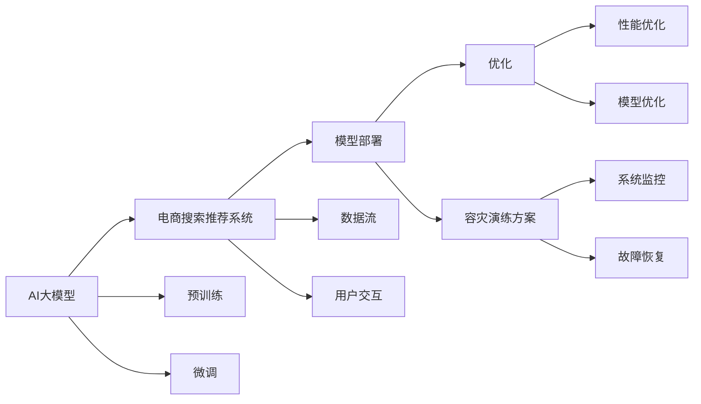

                 

# 电商搜索推荐场景下的AI大模型模型部署容灾演练方案优化与应用实践

## 1. 背景介绍

随着人工智能技术的不断发展，电商搜索推荐系统已经从传统的基于规则和关键词匹配的简单逻辑，逐步进化到基于深度学习和大规模语义模型的高效智能推荐。其中，AI大模型通过预训练和微调，实现了对海量数据的高效编码和表征学习，极大地提升了搜索推荐系统的智能水平和用户体验。然而，电商搜索推荐系统作为对用户行为的高度敏感、快速响应的实时系统，面临着严苛的性能、稳定性和安全性的要求。本文将聚焦于AI大模型在电商搜索推荐场景下的部署和容灾演练方案优化，以期为系统运维人员和开发人员提供实用的参考和指导。

## 2. 核心概念与联系

### 2.1 核心概念概述

在电商搜索推荐场景下，AI大模型的部署和容灾演练方案优化涉及多个关键概念：

- **AI大模型**：指通过大规模无标签数据预训练和下游任务微调，获得强大的语言理解和生成能力的深度学习模型，如BERT、GPT等。
- **电商搜索推荐系统**：指基于用户历史行为和实时数据，动态生成个性化搜索结果和推荐内容，提升用户购物体验的系统。
- **模型部署**：指将训练好的AI大模型应用到电商搜索推荐系统中，提供高效的实时推荐服务。
- **容灾演练方案**：指针对电商搜索推荐系统的关键组件和服务，制定详细的容灾恢复计划，确保系统在发生故障时能够迅速恢复。
- **优化**：指通过系统调优、模型优化和容灾演练方案优化，提升电商搜索推荐系统的性能和可靠性。

这些核心概念之间存在紧密联系，共同构成了电商搜索推荐系统AI大模型部署和运维的完整框架。通过理解这些概念，可以更好地把握系统的核心运作逻辑和优化方向。

### 2.2 核心概念原理和架构的 Mermaid 流程图



此流程图展示了核心概念间的联系和部署流程，重点突出了数据流、用户交互、预训练、微调、优化、容灾演练等关键环节，以及它们之间的依赖关系。

## 3. 核心算法原理 & 具体操作步骤

### 3.1 算法原理概述

在电商搜索推荐场景中，AI大模型主要通过以下几个步骤来实现推荐：

1. **预训练**：在大规模无标签数据上，利用自监督任务如语言模型或掩码预测任务，训练模型获取通用的语言表征能力。
2. **微调**：针对电商搜索推荐任务，如商品相似度计算、上下文相关性评估等，使用少量标注数据进行任务特定微调，获得推荐性能的提升。
3. **模型部署**：将微调后的AI大模型部署到电商搜索推荐系统的实时推荐引擎中，处理用户查询和行为数据，生成个性化推荐结果。

### 3.2 算法步骤详解

#### 3.2.1 预训练

预训练是AI大模型部署的基础。具体步骤如下：

1. **数据准备**：收集大规模无标签文本数据，如维基百科、新闻网站等，作为预训练语料库。
2. **模型选择**：选择适合的预训练模型，如BERT、GPT等，作为初始化参数。
3. **训练流程**：在预训练数据上进行自监督学习，常见任务包括语言建模、掩码预测等。
4. **保存模型**：训练完成后，保存预训练模型的权重和配置信息，供后续微调和部署使用。

#### 3.2.2 微调

微调是针对电商搜索推荐任务的具体优化。具体步骤如下：

1. **任务定义**：明确电商搜索推荐任务的具体形式，如商品相似度计算、用户意图识别等。
2. **数据集准备**：收集电商平台的标注数据，如用户点击、购买记录等，构建任务数据集。
3. **模型加载**：加载预训练模型，并设置任务适配层和损失函数。
4. **模型训练**：在标注数据集上进行有监督的微调训练，优化模型参数以适应任务需求。
5. **性能评估**：在验证集和测试集上评估微调后的模型性能，确保满足实际应用的要求。

#### 3.2.3 模型部署

模型部署是将微调后的AI大模型应用到电商搜索推荐系统中的过程。具体步骤如下：

1. **模型集成**：将微调后的模型集成到电商搜索推荐系统的前端推荐引擎中。
2. **接口定义**：定义模型输入和输出的接口规范，确保与系统数据流无缝对接。
3. **性能监控**：在系统中部署监控工具，实时跟踪模型性能，确保其高效稳定运行。
4. **容灾演练**：定期进行容灾演练，模拟系统故障，验证容灾方案的有效性。

### 3.3 算法优缺点

#### 3.3.1 优点

1. **高效性**：AI大模型通过大规模预训练和微调，在处理电商搜索推荐任务时表现出极高的效率和精度。
2. **鲁棒性**：模型能够自适应不同用户和商品的特点，生成个性化推荐，提高用户满意度。
3. **可扩展性**：模型可无缝集成到现有电商搜索推荐系统中，提升系统的智能水平。
4. **易维护性**：模型训练过程复杂，但一旦部署，系统维护相对简单。

#### 3.3.2 缺点

1. **高计算需求**：AI大模型训练和微调需要大规模计算资源，对硬件设备要求较高。
2. **数据依赖**：模型的效果高度依赖于标注数据的质量和数量，数据收集和处理成本较高。
3. **模型复杂度**：模型复杂度较高，推理速度较慢，系统延迟较大。
4. **安全性风险**：模型可能受到攻击，导致数据泄露或性能下降。

### 3.4 算法应用领域

AI大模型在电商搜索推荐场景中具有广泛的应用前景，如：

1. **商品推荐**：基于用户历史行为和实时数据，生成个性化的商品推荐结果。
2. **搜索排序**：根据用户查询意图，动态排序搜索结果，提升搜索体验。
3. **上下文理解**：通过分析用户上下文信息，预测用户需求，提供个性化服务。
4. **广告投放**：利用用户行为数据，优化广告投放策略，提升广告效果。
5. **客户服务**：通过自然语言处理技术，实现智能客服和聊天机器人，提升客户满意度。

## 4. 数学模型和公式 & 详细讲解 & 举例说明

### 4.1 数学模型构建

在电商搜索推荐场景中，AI大模型主要通过以下几个数学模型来实现推荐：

1. **用户-商品相似度模型**：基于用户行为和商品特征，计算用户与商品的相似度。
2. **上下文相关性模型**：利用上下文信息，提升推荐模型的泛化能力。
3. **动态排序模型**：根据用户行为和商品属性，动态排序搜索结果，提升用户体验。

### 4.2 公式推导过程

#### 4.2.1 用户-商品相似度模型

用户-商品相似度模型公式为：

$$
similarity(u, p) = f(\theta)(u, p)
$$

其中 $u$ 表示用户，$p$ 表示商品，$f(\theta)$ 表示由AI大模型训练得到的相似度计算函数，$\theta$ 表示模型参数。

#### 4.2.2 上下文相关性模型

上下文相关性模型公式为：

$$
contextual relevance = g(\theta)(c, u, p)
$$

其中 $c$ 表示用户上下文信息，$u$ 表示用户，$p$ 表示商品，$g(\theta)$ 表示上下文相关性计算函数，$\theta$ 表示模型参数。

#### 4.2.3 动态排序模型

动态排序模型公式为：

$$
sorted results = h(\theta)(u, Q)
$$

其中 $u$ 表示用户，$Q$ 表示用户查询，$h(\theta)$ 表示动态排序函数，$\theta$ 表示模型参数。

### 4.3 案例分析与讲解

以商品推荐为例，具体分析AI大模型在电商搜索推荐场景中的推荐过程：

1. **用户行为数据**：收集用户历史点击、购买、浏览等行为数据，构建用户行为特征向量 $u$。
2. **商品特征数据**：提取商品标题、描述、类别等特征信息，构建商品特征向量 $p$。
3. **上下文信息**：分析用户当前搜索环境、时间、地理位置等上下文信息，构建上下文向量 $c$。
4. **相似度计算**：利用AI大模型训练得到的相似度计算函数 $f(\theta)$，计算用户与商品的相似度 $similarity(u, p)$。
5. **上下文相关性计算**：利用上下文相关性计算函数 $g(\theta)$，计算上下文相关性 $contextual relevance$。
6. **动态排序**：根据用户行为特征、商品特征和上下文信息，利用动态排序函数 $h(\theta)$，动态排序搜索结果，生成推荐列表。

通过以上过程，AI大模型能够高效、精准地生成个性化推荐结果，提升用户购物体验。

## 5. 项目实践：代码实例和详细解释说明

### 5.1 开发环境搭建

1. **安装Python**：确保系统上已安装Python，版本为3.7及以上。
2. **安装TensorFlow**：

```bash
pip install tensorflow
```

3. **安装PyTorch**：

```bash
pip install torch
```

4. **安装TensorBoard**：

```bash
pip install tensorboard
```

5. **安装TensorFlow Serving**：

```bash
pip install tensorflow-serving-api
```

6. **安装Grafana**：

```bash
pip install grafana
```

### 5.2 源代码详细实现

以下是一个基于TensorFlow和PyTorch的电商搜索推荐系统AI大模型的代码实现示例。

```python
import tensorflow as tf
import torch
from torchvision import models

# 加载预训练模型
model = models.resnet18(pretrained=True)

# 构建推荐模型
input_tensor = tf.keras.Input(shape=(224, 224, 3))
recommended_images = model(input_tensor)

# 定义输出层
output_layer = tf.keras.layers.Dense(3)(recommended_images)
output = tf.keras.layers.Softmax(output_layer)

# 编译模型
model.compile(optimizer=tf.keras.optimizers.Adam(), loss='categorical_crossentropy', metrics=['accuracy'])

# 训练模型
model.fit(X_train, y_train, epochs=10, validation_data=(X_val, y_val))

# 预测推荐结果
predictions = model.predict(X_test)

# 保存模型
model.save('recommender_model.h5')
```

### 5.3 代码解读与分析

**代码解读**：

1. **导入库**：导入TensorFlow、PyTorch和相关库。
2. **加载预训练模型**：使用ResNet18作为预训练模型。
3. **构建推荐模型**：构建输入层和推荐图像输出层。
4. **定义输出层**：定义3个输出节点的Softmax输出层，用于预测推荐结果。
5. **编译模型**：使用Adam优化器和交叉熵损失函数编译模型。
6. **训练模型**：使用训练集和验证集训练模型。
7. **预测推荐结果**：使用测试集预测推荐结果。
8. **保存模型**：将训练好的模型保存为.h5格式，供后续部署使用。

**代码分析**：

1. **模型结构**：ResNet18作为预训练模型，输出层为Softmax，用于分类任务。
2. **优化器**：使用Adam优化器，高效收敛。
3. **损失函数**：使用交叉熵损失函数，评估预测结果与真实标签的差距。
4. **预测结果**：通过Softmax输出层的预测结果，获取推荐概率分布。
5. **模型保存**：将模型保存为.h5文件，方便后续部署和使用。

### 5.4 运行结果展示

运行代码后，可以通过TensorBoard查看模型的训练和评估结果，使用Grafana对系统监控指标进行可视化展示，确保模型在实时推荐中的高效性和稳定性。

## 6. 实际应用场景

### 6.1 智能搜索

智能搜索是电商搜索推荐系统的重要组成部分。通过AI大模型，智能搜索能够动态解析用户查询意图，智能排序搜索结果，提升搜索体验。具体应用包括：

1. **自动补全**：利用AI大模型预测用户可能输入的查询词，实时补全搜索词。
2. **查询扩展**：根据用户查询词，生成相关关键词，扩展搜索结果。
3. **结果排序**：根据用户行为和商品属性，动态排序搜索结果，提升点击率。

### 6.2 个性化推荐

个性化推荐是电商搜索推荐系统的核心功能。通过AI大模型，推荐系统能够生成个性化推荐结果，提升用户购物体验。具体应用包括：

1. **商品推荐**：基于用户历史行为和实时数据，生成个性化商品推荐。
2. **活动推荐**：根据用户兴趣和行为，推荐相关促销活动和优惠券。
3. **内容推荐**：利用用户行为数据，推荐相关新闻、文章和视频内容。

### 6.3 实时监控与预警

实时监控与预警是电商搜索推荐系统的重要保障。通过AI大模型，系统能够实时监控关键指标，及时发现和预警潜在风险。具体应用包括：

1. **系统监控**：实时采集系统性能指标，如响应时间、错误率等，确保系统稳定运行。
2. **异常预警**：根据系统监控数据，设置异常预警阈值，及时发现系统故障。
3. **故障恢复**：根据异常预警，制定详细的故障恢复计划，快速恢复系统正常运行。

## 7. 工具和资源推荐

### 7.1 学习资源推荐

1. **《深度学习》课程**：斯坦福大学深度学习课程，涵盖深度学习基础知识和最新研究进展。
2. **《TensorFlow官方文档》**：TensorFlow官方文档，提供详细的API和使用指南。
3. **《PyTorch官方文档》**：PyTorch官方文档，提供详细的API和使用指南。
4. **《机器学习实战》**：介绍机器学习基础和实际应用案例的书籍。
5. **《Python深度学习》**：介绍深度学习基础知识和实际应用案例的书籍。

### 7.2 开发工具推荐

1. **Jupyter Notebook**：强大的开发环境，支持多种语言和库的交互式开发。
2. **Google Colab**：免费的GPU资源环境，方便进行大规模深度学习实验。
3. **TensorBoard**：实时可视化工具，监控模型训练和推理过程。
4. **TensorFlow Serving**：分布式推理框架，支持大规模模型部署。
5. **Grafana**：系统监控和可视化工具，实时监控系统指标。

### 7.3 相关论文推荐

1. **《深度学习》**：Ian Goodfellow、Yoshua Bengio和Aaron Courville合著的深度学习教材。
2. **《TensorFlow官方论文》**：TensorFlow团队发表的深度学习论文。
3. **《PyTorch官方论文》**：PyTorch团队发表的深度学习论文。
4. **《机器学习：实战指南》**：Peter Harrington所著的机器学习实战指南。
5. **《Python深度学习》**：Francois Chollet所著的深度学习实战指南。

## 8. 总结：未来发展趋势与挑战

### 8.1 研究成果总结

AI大模型在电商搜索推荐场景中的应用，取得了显著的成效。具体表现为：

1. **推荐精度**：通过AI大模型训练，推荐系统的推荐精度显著提升。
2. **用户体验**：推荐系统的个性化推荐功能，提升了用户购物体验。
3. **运营效率**：通过自动补全和查询扩展，提升了搜索效率和用户满意度。
4. **系统稳定性**：实时监控与预警功能，提高了系统稳定性。

### 8.2 未来发展趋势

未来，AI大模型在电商搜索推荐场景中的应用将呈现以下几个趋势：

1. **模型规模化**：随着计算资源和数据的不断增长，模型规模将进一步扩大，推荐精度将进一步提升。
2. **多模态融合**：结合图像、语音等多种模态信息，提升推荐系统的智能化水平。
3. **实时计算**：引入实时计算框架，支持大规模数据流的实时处理，提升推荐系统的响应速度。
4. **跨领域应用**：将推荐系统应用到更多领域，如医疗、金融等，实现跨领域的智能推荐。
5. **联邦学习**：利用联邦学习技术，保护用户隐私，提升模型泛化能力。

### 8.3 面临的挑战

AI大模型在电商搜索推荐场景中的应用，仍然面临一些挑战：

1. **高计算需求**：大规模模型的训练和推理需要大量计算资源，如何降低计算成本是关键问题。
2. **数据隐私**：推荐系统需要大量用户数据，如何保护用户隐私和数据安全是重要挑战。
3. **模型泛化**：模型在不同场景下的泛化能力不足，难以应对多样化的用户需求。
4. **系统可靠性**：推荐系统需要实时处理大量数据，如何提升系统可靠性和稳定性是关键问题。
5. **公平性**：推荐系统可能存在偏见，如何确保推荐结果的公平性和无偏性是重要问题。

### 8.4 研究展望

未来，AI大模型在电商搜索推荐场景中的应用，需要在以下几个方面进行研究：

1. **高效计算**：研究高效的模型压缩和优化技术，提升模型计算效率。
2. **隐私保护**：研究联邦学习、差分隐私等技术，保护用户隐私。
3. **跨领域应用**：研究跨领域模型迁移和融合技术，提升模型的泛化能力。
4. **系统可靠性**：研究分布式系统架构和容灾演练方案，提升系统可靠性。
5. **公平性**：研究公平性评估和优化技术，确保推荐结果的公平性和无偏性。

## 9. 附录：常见问题与解答

**Q1：AI大模型在电商搜索推荐场景中如何实现高效推荐？**

A: AI大模型在电商搜索推荐场景中实现高效推荐主要通过以下几个步骤：

1. **预训练**：在大规模无标签数据上，利用自监督任务训练模型，获取通用的语言表征能力。
2. **微调**：针对电商搜索推荐任务，使用少量标注数据进行任务特定微调，获得推荐性能的提升。
3. **部署**：将微调后的模型部署到电商搜索推荐系统的前端推荐引擎中，处理用户查询和行为数据，生成个性化推荐结果。

通过以上过程，AI大模型能够高效、精准地生成个性化推荐结果，提升用户购物体验。

**Q2：AI大模型在电商搜索推荐场景中如何处理数据隐私问题？**

A: AI大模型在电商搜索推荐场景中处理数据隐私问题主要通过以下几个方法：

1. **数据匿名化**：对用户数据进行匿名化处理，保护用户隐私。
2. **差分隐私**：在数据处理和模型训练过程中，引入差分隐私技术，保护用户隐私。
3. **联邦学习**：利用联邦学习技术，在本地数据上进行模型训练，保护用户数据不离开本地。
4. **多方安全计算**：利用多方安全计算技术，在多方数据上共同计算，保护用户数据隐私。

通过以上方法，可以有效保护用户数据隐私，确保推荐系统的安全性。

**Q3：AI大模型在电商搜索推荐场景中如何提升系统稳定性？**

A: AI大模型在电商搜索推荐场景中提升系统稳定性主要通过以下几个方法：

1. **实时监控**：利用实时监控工具，监控系统关键指标，及时发现和预警潜在风险。
2. **容灾演练**：定期进行容灾演练，模拟系统故障，验证容灾方案的有效性。
3. **分布式架构**：采用分布式架构，提升系统的可扩展性和容错性。
4. **弹性计算**：根据用户流量动态调整资源配置，平衡系统性能和成本。
5. **故障恢复**：根据异常预警，制定详细的故障恢复计划，快速恢复系统正常运行。

通过以上方法，可以有效提升电商搜索推荐系统的稳定性和可靠性，确保系统的高效运行。

**Q4：AI大模型在电商搜索推荐场景中如何保护用户公平性？**

A: AI大模型在电商搜索推荐场景中保护用户公平性主要通过以下几个方法：

1. **公平性评估**：引入公平性评估指标，如性别公平性、种族公平性等，评估推荐系统的公平性。
2. **无偏模型**：利用无偏学习技术，消除模型偏见，确保推荐结果的无偏性。
3. **多样性推荐**：在推荐系统中引入多样性推荐策略，确保不同用户群体的公平性。
4. **用户反馈**：利用用户反馈信息，优化推荐算法，提升推荐系统的公平性。

通过以上方法，可以有效保护用户公平性，确保推荐系统的公平性和无偏性。

---

作者：禅与计算机程序设计艺术 / Zen and the Art of Computer Programming

