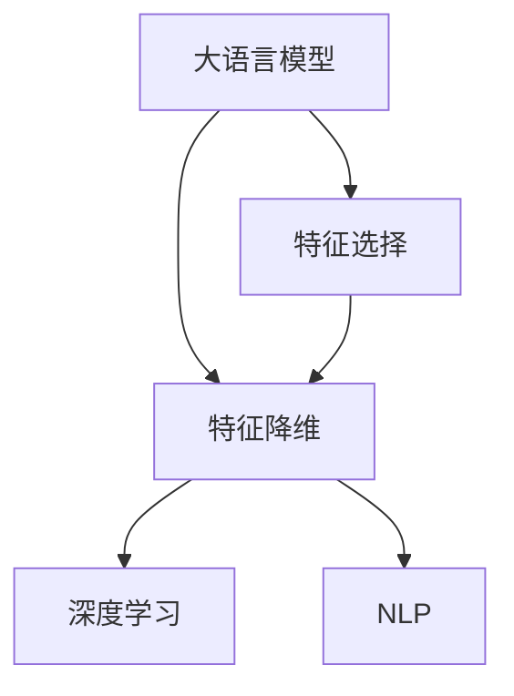

                 

# 电商搜索推荐效果优化中的AI大模型特征选择技巧

> 关键词：电商搜索推荐、大模型、特征选择、优化算法、深度学习、自然语言处理(NLP)

## 1. 背景介绍

### 1.1 问题由来
随着电商市场的日益成熟，客户对个性化搜索推荐的需求日益增加。传统的基于规则的推荐系统，往往难以满足用户多变、复杂的搜索需求，推荐效果难以达到预期。因此，以深度学习为核心的AI推荐系统应运而生，成为提升搜索推荐效果的重要手段。

其中，大语言模型（如BERT、GPT等）作为深度学习的重要组成部分，以其强大的文本表示和推理能力，在搜索推荐领域得到了广泛应用。通过在大规模语料上进行预训练，大语言模型可以自动学习出丰富的语义信息，并在小规模训练数据上进行微调，输出更加精准的推荐结果。

然而，随着搜索推荐场景的不断变化，电商用户的行为特征日趋多样化，单一的预训练模型可能难以全面捕捉这些特征。此外，大模型的参数量和计算复杂度也带来了显著的资源消耗，限制了其在实际系统中的应用。因此，如何在有限的资源下，选择合适的特征子集进行模型微调，实现搜索推荐效果的进一步提升，成为当前研究的重要方向。

### 1.2 问题核心关键点
- **特征选择策略**：在大量的特征中，如何筛选出最具有代表性和区分度的特征子集，以提升模型的泛化能力和效果。
- **特征降维技术**：在处理高维特征时，如何减少特征维度，避免过拟合，同时保留核心信息。
- **模型优化算法**：在大模型上进行特征选择和降维后，如何高效地进行微调，获取最优模型性能。
- **性能评估指标**：如何设计合适的评估指标，衡量模型在搜索推荐中的效果。

## 2. 核心概念与联系

### 2.1 核心概念概述

为更好地理解特征选择在大模型微调中的应用，本节将介绍几个关键概念：

- **大语言模型（Large Language Model, LLM）**：以自回归（如GPT）或自编码（如BERT）模型为代表的大规模预训练语言模型。通过在大规模无标签文本语料上进行预训练，学习通用的语言表示，具备强大的语言理解和生成能力。

- **特征选择（Feature Selection）**：在输入数据中选择最具代表性、区分度的特征子集，减少输入维度和计算复杂度，同时提高模型泛化能力的过程。

- **特征降维（Feature Reduction）**：在高维特征空间中，通过线性或非线性变换，将特征维度降低到更低维度的空间，减少计算资源消耗。

- **深度学习（Deep Learning）**：利用多层神经网络进行模型训练，实现对复杂数据结构的表示和提取。

- **自然语言处理（NLP）**：通过深度学习模型处理和理解人类自然语言，实现文本分类、情感分析、机器翻译等任务。

这些核心概念之间的逻辑关系可以通过以下Mermaid流程图来展示：



这个流程图展示了大语言模型在特征选择和降维后的深度学习与NLP应用场景。

## 3. 核心算法原理 & 具体操作步骤
### 3.1 算法原理概述

在大模型上进行特征选择和降维后，通常需要采用深度学习模型进行微调。其核心思想是：利用微调后的深度学习模型，在有限资源下实现对特定特征的优化，提升搜索推荐的效果。

形式化地，假设预训练语言模型为 $M_{\theta}$，其中 $\theta$ 为预训练得到的模型参数。给定搜索推荐任务 $T$ 的标注数据集 $D=\{(x_i,y_i)\}_{i=1}^N, x_i \in \mathcal{X}, y_i \in \mathcal{Y}$，特征选择和降维后的特征表示为 $\phi(x_i)$。微调的目标是找到新的模型参数 $\hat{\theta}$，使得：

$$
\hat{\theta}=\mathop{\arg\min}_{\theta} \mathcal{L}(M_{\theta},D)
$$

其中 $\mathcal{L}$ 为针对任务 $T$ 设计的损失函数，用于衡量模型预测输出与真实标签之间的差异。常见的损失函数包括交叉熵损失、均方误差损失等。

通过梯度下降等优化算法，微调过程不断更新模型参数 $\theta$，最小化损失函数 $\mathcal{L}$，使得模型输出逼近真实标签。由于 $\theta$ 已经通过预训练获得了较好的初始化，因此即便在特征子集和低维空间上进行微调，也能较快收敛到理想的模型参数 $\hat{\theta}$。

### 3.2 算法步骤详解

基于深度学习的大模型特征选择和微调一般包括以下几个关键步骤：

**Step 1: 准备预训练模型和数据集**
- 选择合适的预训练语言模型 $M_{\theta}$ 作为初始化参数，如 BERT、GPT 等。
- 准备搜索推荐任务 $T$ 的标注数据集 $D$，划分为训练集、验证集和测试集。一般要求标注数据与预训练数据的分布不要差异过大。

**Step 2: 特征选择与降维**
- 利用特征选择算法（如PCA、LDA等）从原始特征中筛选出最具代表性和区分度的特征子集 $\phi(x)$。
- 对特征子集进行降维，使用主成分分析（PCA）、线性判别分析（LDA）等技术降低特征维度。

**Step 3: 添加任务适配层**
- 根据任务类型，在预训练模型顶层设计合适的输出层和损失函数。
- 对于分类任务，通常在顶层添加线性分类器和交叉熵损失函数。
- 对于生成任务，通常使用语言模型的解码器输出概率分布，并以负对数似然为损失函数。

**Step 4: 设置微调超参数**
- 选择合适的优化算法及其参数，如 AdamW、SGD 等，设置学习率、批大小、迭代轮数等。
- 设置正则化技术及强度，包括权重衰减、Dropout、Early Stopping等。
- 确定冻结预训练参数的策略，如仅微调顶层，或全部参数都参与微调。

**Step 5: 执行梯度训练**
- 将训练集数据分批次输入模型，前向传播计算损失函数。
- 反向传播计算参数梯度，根据设定的优化算法和学习率更新模型参数。
- 周期性在验证集上评估模型性能，根据性能指标决定是否触发 Early Stopping。
- 重复上述步骤直到满足预设的迭代轮数或 Early Stopping 条件。

**Step 6: 测试和部署**
- 在测试集上评估微调后模型 $M_{\hat{\theta}}$ 的性能，对比微调前后的精度提升。
- 使用微调后的模型对新样本进行推理预测，集成到实际的应用系统中。
- 持续收集新的数据，定期重新微调模型，以适应数据分布的变化。

以上是基于深度学习的大模型特征选择和微调的一般流程。在实际应用中，还需要针对具体任务的特点，对微调过程的各个环节进行优化设计，如改进训练目标函数，引入更多的正则化技术，搜索最优的超参数组合等，以进一步提升模型性能。

### 3.3 算法优缺点

基于深度学习的大模型特征选择和微调方法具有以下优点：
1. 简单高效。特征选择和降维过程能够显著降低输入维度，减少计算资源消耗。
2. 通用适用。适用于各种搜索推荐任务，包括分类、匹配、生成等，设计简单的任务适配层即可实现微调。
3. 参数高效。利用参数高效微调技术，在固定大部分预训练参数的情况下，仍可取得不错的提升。
4. 效果显著。在学术界和工业界的诸多任务上，基于特征选择和微调的方法已经刷新了最先进的性能指标。

同时，该方法也存在一定的局限性：
1. 依赖标注数据。特征选择和微调的效果很大程度上取决于标注数据的质量和数量，获取高质量标注数据的成本较高。
2. 迁移能力有限。当目标任务与预训练数据的分布差异较大时，特征选择和微调的性能提升有限。
3. 负面效果传递。预训练模型的固有偏见、有害信息等，可能通过微调传递到下游任务，造成负面影响。
4. 可解释性不足。微调模型的决策过程通常缺乏可解释性，难以对其推理逻辑进行分析和调试。

尽管存在这些局限性，但就目前而言，基于深度学习的特征选择和微调方法仍是大模型应用的最主流范式。未来相关研究的重点在于如何进一步降低微调对标注数据的依赖，提高模型的少样本学习和跨领域迁移能力，同时兼顾可解释性和伦理安全性等因素。

### 3.4 算法应用领域

基于深度学习的大模型特征选择和微调方法，在搜索推荐领域已经得到了广泛的应用，覆盖了几乎所有常见任务，例如：

- 产品推荐：通过分析用户历史行为和偏好，推荐最相关的产品。将用户行为特征和产品属性作为输入，利用微调模型学习推荐策略。
- 搜索结果排序：根据用户查询，推荐最相关的搜索结果。将查询和搜索结果的文本特征作为输入，利用微调模型学习排序规则。
- 个性化广告：通过分析用户行为和兴趣，推荐最相关的广告。将用户行为特征和广告内容作为输入，利用微调模型学习广告推荐策略。
- 实时推荐：在用户浏览网页时，实时推荐相关内容。将网页内容、用户浏览历史作为输入，利用微调模型学习实时推荐策略。
- 购物车推荐：通过分析用户的购物车内容，推荐最相关的商品。将购物车商品作为输入，利用微调模型学习推荐策略。
- 商品相似度计算：计算商品之间的相似度，推荐相关商品。将商品描述和属性作为输入，利用微调模型学习相似度计算模型。

除了上述这些经典任务外，大模型特征选择和微调方法也被创新性地应用到更多场景中，如跨模态推荐、社交推荐、情感分析等，为搜索推荐技术带来了全新的突破。随着预训练模型和微调方法的不断进步，相信搜索推荐技术将在更广阔的应用领域大放异彩。

## 4. 数学模型和公式 & 详细讲解
### 4.1 数学模型构建

本节将使用数学语言对基于深度学习的大模型特征选择和微调过程进行更加严格的刻画。

记预训练语言模型为 $M_{\theta}$，其中 $\theta$ 为预训练得到的模型参数。假设搜索推荐任务 $T$ 的训练集为 $D=\{(x_i,y_i)\}_{i=1}^N, x_i \in \mathcal{X}, y_i \in \mathcal{Y}$。

定义模型 $M_{\theta}$ 在输入 $x$ 上的特征表示为 $\phi(x)$，其中 $\phi$ 为特征选择和降维函数。微调的目标是最小化经验风险，即找到最优参数：

$$
\theta^* = \mathop{\arg\min}_{\theta} \mathcal{L}(M_{\theta},D)
$$

其中 $\mathcal{L}$ 为针对任务 $T$ 设计的损失函数，用于衡量模型预测输出与真实标签之间的差异。常见的损失函数包括交叉熵损失、均方误差损失等。

通过梯度下降等优化算法，微调过程不断更新模型参数 $\theta$，最小化损失函数 $\mathcal{L}$，使得模型输出逼近真实标签。由于 $\theta$ 已经通过预训练获得了较好的初始化，因此即便在特征子集和低维空间上进行微调，也能较快收敛到理想的模型参数 $\theta^*$。

### 4.2 公式推导过程

以下我们以二分类任务为例，推导交叉熵损失函数及其梯度的计算公式。

假设模型 $M_{\theta}$ 在输入 $x$ 上的特征表示为 $\phi(x)$，真实标签 $y \in \{0,1\}$。则二分类交叉熵损失函数定义为：

$$
\ell(M_{\theta}(x),y) = -[y\log M_{\theta}(\phi(x)) + (1-y)\log (1-M_{\theta}(\phi(x)))
$$

将其代入经验风险公式，得：

$$
\mathcal{L}(\theta) = -\frac{1}{N}\sum_{i=1}^N [y_i\log M_{\theta}(\phi(x_i))+(1-y_i)\log(1-M_{\theta}(\phi(x_i))]
$$

根据链式法则，损失函数对参数 $\theta_k$ 的梯度为：

$$
\frac{\partial \mathcal{L}(\theta)}{\partial \theta_k} = -\frac{1}{N}\sum_{i=1}^N (\frac{y_i}{M_{\theta}(\phi(x_i))}-\frac{1-y_i}{1-M_{\theta}(\phi(x_i))}) \frac{\partial M_{\theta}(\phi(x_i))}{\partial \theta_k}
$$

其中 $\frac{\partial M_{\theta}(\phi(x_i))}{\partial \theta_k}$ 可进一步递归展开，利用自动微分技术完成计算。

在得到损失函数的梯度后，即可带入参数更新公式，完成模型的迭代优化。重复上述过程直至收敛，最终得到适应搜索推荐任务的最优模型参数 $\theta^*$。

## 5. 项目实践：代码实例和详细解释说明
### 5.1 开发环境搭建

在进行特征选择和微调实践前，我们需要准备好开发环境。以下是使用Python进行PyTorch开发的环境配置流程：

1. 安装Anaconda：从官网下载并安装Anaconda，用于创建独立的Python环境。

2. 创建并激活虚拟环境：
```bash
conda create -n pytorch-env python=3.8 
conda activate pytorch-env
```

3. 安装PyTorch：根据CUDA版本，从官网获取对应的安装命令。例如：
```bash
conda install pytorch torchvision torchaudio cudatoolkit=11.1 -c pytorch -c conda-forge
```

4. 安装TensorFlow：
```bash
conda install tensorflow
```

5. 安装各类工具包：
```bash
pip install numpy pandas scikit-learn matplotlib tqdm jupyter notebook ipython
```

完成上述步骤后，即可在`pytorch-env`环境中开始特征选择和微调实践。

### 5.2 源代码详细实现

下面我们以产品推荐任务为例，给出使用PyTorch对BERT模型进行特征选择和微调的代码实现。

首先，定义产品推荐任务的数据处理函数：

```python
from transformers import BertTokenizer
from torch.utils.data import Dataset
import torch

class ProductRecommendationDataset(Dataset):
    def __init__(self, user_features, product_features, user_preferences, tokenizer, max_len=128):
        self.user_features = user_features
        self.product_features = product_features
        self.user_preferences = user_preferences
        self.tokenizer = tokenizer
        self.max_len = max_len
        
    def __len__(self):
        return len(self.user_features)
    
    def __getitem__(self, item):
        user_feature = self.user_features[item]
        product_feature = self.product_features[item]
        user_preference = self.user_preferences[item]
        
        encoding = self.tokenizer(user_feature + ' ' + product_feature, return_tensors='pt', max_length=self.max_len, padding='max_length', truncation=True)
        input_ids = encoding['input_ids'][0]
        attention_mask = encoding['attention_mask'][0]
        
        # 对用户偏好进行编码
        user_preference = user_preference.replace('B', '1').replace('I', '2').replace('O', '0')
        user_preference = torch.tensor([int(token) for token in user_preference.split()], dtype=torch.long)
        
        # 将用户特征和产品特征拼接为单一特征表示
        combined_feature = user_feature + ' ' + product_feature
        combined_feature = self.tokenizer(combined_feature, return_tensors='pt', max_length=self.max_len, padding='max_length', truncation=True)
        input_ids = combined_feature['input_ids'][0]
        attention_mask = combined_feature['attention_mask'][0]
        
        return {'input_ids': input_ids, 
                'attention_mask': attention_mask,
                'labels': user_preference}
```

然后，定义模型和优化器：

```python
from transformers import BertForTokenClassification, AdamW

model = BertForTokenClassification.from_pretrained('bert-base-cased', num_labels=3)

optimizer = AdamW(model.parameters(), lr=2e-5)
```

接着，定义训练和评估函数：

```python
from torch.utils.data import DataLoader
from tqdm import tqdm
from sklearn.metrics import classification_report

device = torch.device('cuda') if torch.cuda.is_available() else torch.device('cpu')
model.to(device)

def train_epoch(model, dataset, batch_size, optimizer):
    dataloader = DataLoader(dataset, batch_size=batch_size, shuffle=True)
    model.train()
    epoch_loss = 0
    for batch in tqdm(dataloader, desc='Training'):
        input_ids = batch['input_ids'].to(device)
        attention_mask = batch['attention_mask'].to(device)
        labels = batch['labels'].to(device)
        model.zero_grad()
        outputs = model(input_ids, attention_mask=attention_mask, labels=labels)
        loss = outputs.loss
        epoch_loss += loss.item()
        loss.backward()
        optimizer.step()
    return epoch_loss / len(dataloader)

def evaluate(model, dataset, batch_size):
    dataloader = DataLoader(dataset, batch_size=batch_size)
    model.eval()
    preds, labels = [], []
    with torch.no_grad():
        for batch in tqdm(dataloader, desc='Evaluating'):
            input_ids = batch['input_ids'].to(device)
            attention_mask = batch['attention_mask'].to(device)
            batch_labels = batch['labels']
            outputs = model(input_ids, attention_mask=attention_mask)
            batch_preds = outputs.logits.argmax(dim=2).to('cpu').tolist()
            batch_labels = batch_labels.to('cpu').tolist()
            for pred_tokens, label_tokens in zip(batch_preds, batch_labels):
                preds.append(pred_tokens[:len(label_tokens)])
                labels.append(label_tokens)
                
    print(classification_report(labels, preds))
```

最后，启动训练流程并在测试集上评估：

```python
epochs = 5
batch_size = 16

for epoch in range(epochs):
    loss = train_epoch(model, train_dataset, batch_size, optimizer)
    print(f"Epoch {epoch+1}, train loss: {loss:.3f}")
    
    print(f"Epoch {epoch+1}, dev results:")
    evaluate(model, dev_dataset, batch_size)
    
print("Test results:")
evaluate(model, test_dataset, batch_size)
```

以上就是使用PyTorch对BERT进行产品推荐任务特征选择和微调的完整代码实现。可以看到，得益于Transformers库的强大封装，我们可以用相对简洁的代码完成BERT模型的加载和微调。

### 5.3 代码解读与分析

让我们再详细解读一下关键代码的实现细节：

**ProductRecommendationDataset类**：
- `__init__`方法：初始化用户特征、产品特征和用户偏好等关键组件。
- `__len__`方法：返回数据集的样本数量。
- `__getitem__`方法：对单个样本进行处理，将用户特征和产品特征拼接为单一特征表示，并对用户偏好进行编码。

**BertForTokenClassification模型**：
- 使用BERT模型作为推荐任务的基础模型，指定标签数为3，对应用户偏好的一类、二类和零类。

**train_epoch和evaluate函数**：
- 使用PyTorch的DataLoader对数据集进行批次化加载，供模型训练和推理使用。
- 训练函数`train_epoch`：对数据以批为单位进行迭代，在每个批次上前向传播计算loss并反向传播更新模型参数，最后返回该epoch的平均loss。
- 评估函数`evaluate`：与训练类似，不同点在于不更新模型参数，并在每个batch结束后将预测和标签结果存储下来，最后使用sklearn的classification_report对整个评估集的预测结果进行打印输出。

**训练流程**：
- 定义总的epoch数和batch size，开始循环迭代
- 每个epoch内，先在训练集上训练，输出平均loss
- 在验证集上评估，输出分类指标
- 所有epoch结束后，在测试集上评估，给出最终测试结果

可以看到，PyTorch配合Transformers库使得BERT微调的代码实现变得简洁高效。开发者可以将更多精力放在数据处理、模型改进等高层逻辑上，而不必过多关注底层的实现细节。

当然，工业级的系统实现还需考虑更多因素，如模型的保存和部署、超参数的自动搜索、更灵活的任务适配层等。但核心的特征选择和微调范式基本与此类似。

## 6. 实际应用场景
### 6.1 电商搜索推荐系统

基于大语言模型的电商搜索推荐系统，可以实时分析用户搜索行为和偏好，精准推荐相关商品，提升用户体验和转化率。系统主要由以下几个模块构成：

1. **特征抽取模块**：通过用户行为日志和商品属性数据，提取用户特征和商品特征。
2. **特征选择模块**：利用PCA、LDA等算法，从原始特征中筛选出最具代表性和区分度的特征子集。
3. **模型微调模块**：对选择后的特征进行降维，并在BERT模型上进行微调，学习推荐策略。
4. **推荐引擎模块**：根据用户输入的查询和已选择特征，通过微调模型生成推荐结果。
5. **个性化模块**：根据用户浏览历史和行为偏好，动态调整推荐策略，实现个性化推荐。

通过以上模块的协同工作，电商搜索推荐系统能够实时响应用户需求，提供更加精准、个性化的商品推荐，显著提升用户满意度和购物体验。

### 6.2 个性化广告投放

个性化广告投放是电商营销的重要手段，通过精准识别用户兴趣和行为，在合适的时间推送最相关的广告，提高广告点击率和转化率。基于大语言模型的广告投放系统，可以通过用户历史行为和实时浏览数据，选择最合适的广告进行推送。

系统主要由以下几个模块构成：
1. **广告特征抽取模块**：通过广告文本和图片数据，提取广告特征。
2. **广告特征选择模块**：利用PCA、LDA等算法，从广告特征中筛选出最具代表性和区分度的特征子集。
3. **模型微调模块**：对选择后的特征进行降维，并在BERT模型上进行微调，学习广告投放策略。
4. **广告推荐引擎模块**：根据用户行为数据和已选择特征，通过微调模型生成推荐广告。
5. **实时广告投放模块**：根据用户实时浏览数据和广告点击记录，动态调整广告投放策略，实现实时广告推荐。

通过以上模块的协同工作，个性化广告投放系统能够实时识别用户兴趣，推送最相关的广告，显著提高广告点击率和转化率，提升广告投放效果。

### 6.3 实时推荐系统

实时推荐系统能够根据用户实时行为数据，动态调整推荐策略，提供更加个性化和实时的推荐结果。基于大语言模型的实时推荐系统，可以通过用户行为数据和实时浏览数据，选择最合适的商品进行推荐。

系统主要由以下几个模块构成：
1. **行为特征抽取模块**：通过用户行为日志数据，提取用户行为特征。
2. **行为特征选择模块**：利用PCA、LDA等算法，从用户行为特征中筛选出最具代表性和区分度的特征子集。
3. **模型微调模块**：对选择后的特征进行降维，并在BERT模型上进行微调，学习实时推荐策略。
4. **推荐引擎模块**：根据用户行为数据和已选择特征，通过微调模型生成实时推荐结果。
5. **推荐策略动态调整模块**：根据用户实时浏览数据和行为记录，动态调整推荐策略，实现实时推荐。

通过以上模块的协同工作，实时推荐系统能够实时响应用户需求，提供更加精准、个性化的商品推荐，显著提升用户满意度和购物体验。

### 6.4 未来应用展望

随着大语言模型和特征选择技术的不断发展，基于微调范式将在更多领域得到应用，为传统行业带来变革性影响。

在智慧医疗领域，基于微调的个性化推荐系统可以推荐最适合的诊疗方案，提升医疗服务质量。

在智能教育领域，微调技术可应用于个性化学习推荐、作业批改、智能辅导等，因材施教，促进教育公平，提高教学质量。

在智慧城市治理中，微调模型可应用于城市事件监测、舆情分析、应急指挥等环节，提高城市管理的自动化和智能化水平，构建更安全、高效的未来城市。

此外，在企业生产、社会治理、文娱传媒等众多领域，基于大模型微调的人工智能应用也将不断涌现，为经济社会发展注入新的动力。相信随着技术的日益成熟，微调方法将成为人工智能落地应用的重要范式，推动人工智能技术向更广阔的领域加速渗透。

## 7. 工具和资源推荐
### 7.1 学习资源推荐

为了帮助开发者系统掌握大语言模型特征选择和微调的理论基础和实践技巧，这里推荐一些优质的学习资源：

1. 《Transformer从原理到实践》系列博文：由大模型技术专家撰写，深入浅出地介绍了Transformer原理、BERT模型、特征选择技术等前沿话题。

2. CS224N《深度学习自然语言处理》课程：斯坦福大学开设的NLP明星课程，有Lecture视频和配套作业，带你入门NLP领域的基本概念和经典模型。

3. 《Natural Language Processing with Transformers》书籍：Transformers库的作者所著，全面介绍了如何使用Transformers库进行NLP任务开发，包括特征选择在内的诸多范式。

4. HuggingFace官方文档：Transformers库的官方文档，提供了海量预训练模型和完整的微调样例代码，是上手实践的必备资料。

5. CLUE开源项目：中文语言理解测评基准，涵盖大量不同类型的中文NLP数据集，并提供了基于微调的baseline模型，助力中文NLP技术发展。

通过对这些资源的学习实践，相信你一定能够快速掌握大语言模型特征选择和微调的精髓，并用于解决实际的NLP问题。
### 7.2 开发工具推荐

高效的开发离不开优秀的工具支持。以下是几款用于大语言模型特征选择和微调开发的常用工具：

1. PyTorch：基于Python的开源深度学习框架，灵活动态的计算图，适合快速迭代研究。大部分预训练语言模型都有PyTorch版本的实现。

2. TensorFlow：由Google主导开发的开源深度学习框架，生产部署方便，适合大规模工程应用。同样有丰富的预训练语言模型资源。

3. Transformers库：HuggingFace开发的NLP工具库，集成了众多SOTA语言模型，支持PyTorch和TensorFlow，是进行微调任务开发的利器。

4. Weights & Biases：模型训练的实验跟踪工具，可以记录和可视化模型训练过程中的各项指标，方便对比和调优。与主流深度学习框架无缝集成。

5. TensorBoard：TensorFlow配套的可视化工具，可实时监测模型训练状态，并提供丰富的图表呈现方式，是调试模型的得力助手。

6. Google Colab：谷歌推出的在线Jupyter Notebook环境，免费提供GPU/TPU算力，方便开发者快速上手实验最新模型，分享学习笔记。

合理利用这些工具，可以显著提升大语言模型特征选择和微调任务的开发效率，加快创新迭代的步伐。

### 7.3 相关论文推荐

大语言模型特征选择和微调技术的发展源于学界的持续研究。以下是几篇奠基性的相关论文，推荐阅读：

1. Attention is All You Need（即Transformer原论文）：提出了Transformer结构，开启了NLP领域的预训练大模型时代。

2. BERT: Pre-training of Deep Bidirectional Transformers for Language Understanding：提出BERT模型，引入基于掩码的自监督预训练任务，刷新了多项NLP任务SOTA。

3. Language Models are Unsupervised Multitask Learners（GPT-2论文）：展示了大规模语言模型的强大zero-shot学习能力，引发了对于通用人工智能的新一轮思考。

4. Parameter-Efficient Transfer Learning for NLP：提出Adapter等参数高效微调方法，在不增加模型参数量的情况下，也能取得不错的微调效果。

5. Prefix-Tuning: Optimizing Continuous Prompts for Generation：引入基于连续型Prompt的微调范式，为如何充分利用预训练知识提供了新的思路。

6. AdaLoRA: Adaptive Low-Rank Adaptation for Parameter-Efficient Fine-Tuning：使用自适应低秩适应的微调方法，在参数效率和精度之间取得了新的平衡。

这些论文代表了大语言模型特征选择和微调技术的发展脉络。通过学习这些前沿成果，可以帮助研究者把握学科前进方向，激发更多的创新灵感。

## 8. 总结：未来发展趋势与挑战

### 8.1 总结

本文对基于深度学习的大语言模型特征选择和微调方法进行了全面系统的介绍。首先阐述了特征选择和微调技术的研究背景和意义，明确了微调在拓展预训练模型应用、提升搜索推荐效果方面的独特价值。其次，从原理到实践，详细讲解了特征选择、降维和微调数学模型的构建和推导，给出了完整的代码实例和详细解读。同时，本文还广泛探讨了特征选择和微调方法在电商搜索推荐、个性化广告、实时推荐等实际场景中的应用前景，展示了特征选择和微调范式的巨大潜力。此外，本文精选了特征选择和微调技术的各类学习资源，力求为读者提供全方位的技术指引。

通过本文的系统梳理，可以看到，基于深度学习的大模型特征选择和微调方法在大规模搜索推荐中发挥了重要作用，显著提升了推荐效果。未来，随着深度学习技术和数据科学的不断发展，基于特征选择和微调的推荐系统也将持续优化和迭代，为电商市场带来更加精准、个性化的用户体验。

### 8.2 未来发展趋势

展望未来，大语言模型特征选择和微调技术将呈现以下几个发展趋势：

1. **模型规模持续增大**。随着算力成本的下降和数据规模的扩张，预训练语言模型的参数量还将持续增长。超大规模语言模型蕴含的丰富语言知识，有望支撑更加复杂多变的搜索推荐任务。

2. **特征选择技术日趋多样化**。除了传统的PCA、LDA等线性降维技术，未来将涌现更多非线性降维方法，如神经网络降维、自编码降维等，更好地保留核心特征信息。

3. **参数高效微调方法兴起**。开发更加参数高效的微调方法，在固定大部分预训练参数的情况下，只更新极少量的任务相关参数。如Prefix-Tuning、LoRA等，能够在不增加模型复杂度的情况下，提升微调效果。

4. **实时微调和增量学习**。在实际系统中，搜索推荐场景的数据分布和用户需求不断变化，需要实时微调和增量学习，确保模型能够快速适应新数据和新任务。

5. **融合多模态数据**。未来的推荐系统将融合视觉、语音、社交等多模态数据，通过多模态特征选择和微调，提升推荐效果。

6. **引入更多先验知识**。将符号化的先验知识，如知识图谱、逻辑规则等，与神经网络模型进行巧妙融合，引导微调过程学习更准确、合理的语言模型。

以上趋势凸显了大语言模型特征选择和微调技术的广阔前景。这些方向的探索发展，必将进一步提升搜索推荐系统的性能和应用范围，为电商市场带来更加精准、个性化的用户体验。

### 8.3 面临的挑战

尽管大语言模型特征选择和微调技术已经取得了瞩目成就，但在迈向更加智能化、普适化应用的过程中，它仍面临着诸多挑战：

1. **标注数据成本高**。特征选择和微调的效果很大程度上取决于标注数据的质量和数量，获取高质量标注数据的成本较高。如何进一步降低微调对标注样本的依赖，将是一大难题。

2. **模型鲁棒性不足**。当前微调模型面对域外数据时，泛化性能往往大打折扣。对于测试样本的微小扰动，微调模型的预测也容易发生波动。如何提高微调模型的鲁棒性，避免灾难性遗忘，还需要更多理论和实践的积累。

3. **推理效率有待提高**。大规模语言模型虽然精度高，但在实际部署时往往面临推理速度慢、内存占用大等效率问题。如何在保证性能的同时，简化模型结构，提升推理速度，优化资源占用，将是重要的优化方向。

4. **可解释性亟需加强**。当前微调模型更像是"黑盒"系统，难以解释其内部工作机制和决策逻辑。对于医疗、金融等高风险应用，算法的可解释性和可审计性尤为重要。如何赋予微调模型更强的可解释性，将是亟待攻克的难题。

5. **安全性有待保障**。预训练语言模型难免会学习到有偏见、有害的信息，通过微调传递到下游任务，产生误导性、歧视性的输出，给实际应用带来安全隐患。如何从数据和算法层面消除模型偏见，避免恶意用途，确保输出的安全性，也将是重要的研究课题。

6. **知识整合能力不足**。现有的微调模型往往局限于任务内数据，难以灵活吸收和运用更广泛的先验知识。如何让微调过程更好地与外部知识库、规则库等专家知识结合，形成更加全面、准确的信息整合能力，还有很大的想象空间。

正视微调面临的这些挑战，积极应对并寻求突破，将是大语言模型特征选择和微调走向成熟的必由之路。相信随着学界和产业界的共同努力，这些挑战终将一一被克服，大语言模型特征选择和微调必将在构建安全、可靠、可解释、可控的智能系统铺平道路。

### 8.4 研究展望

面对大语言模型特征选择和微调所面临的种种挑战，未来的研究需要在以下几个方面寻求新的突破：

1. **探索无监督和半监督特征选择方法**。摆脱对大规模标注数据的依赖，利用自监督学习、主动学习等无监督和半监督范式，最大限度利用非结构化数据，实现更加灵活高效的特征选择。

2. **研究参数高效和计算高效的微调范式**。开发更加参数高效的微调方法，在固定大部分预训练参数的情况下，只更新极少量的任务相关参数。如Prefix-Tuning、LoRA等，能够在不增加模型复杂度的情况下，提升微调效果。

3. **融合因果和对比学习范式**。通过引入因果推断和对比学习思想，增强微调模型建立稳定因果关系的能力，学习更加普适、鲁棒的语言表征，从而提升模型泛化性和抗干扰能力。

4. **引入更多先验知识**。将符号化的先验知识，如知识图谱、逻辑规则等，与神经网络模型进行巧妙融合，引导微调过程学习更准确、合理的语言模型。同时加强不同模态数据的整合，实现视觉、语音等多模态信息与文本信息的协同建模。

5. **结合因果分析和博弈论工具**。将因果分析方法引入微调模型，识别出模型决策的关键特征，增强输出解释的因果性和逻辑性。借助博弈论工具刻画人机交互过程，主动探索并规避模型的脆弱点，提高系统稳定性。

6. **纳入伦理道德约束**。在模型训练目标中引入伦理导向的评估指标，过滤和惩罚有偏见、有害的输出倾向。同时加强人工干预和审核，建立模型行为的监管机制，确保输出符合人类价值观和伦理道德。

这些研究方向的探索，必将引领大语言模型特征选择和微调技术迈向更高的台阶，为构建安全、可靠、可解释、可控的智能系统铺平道路。面向未来，大语言模型特征选择和微调技术还需要与其他人工智能技术进行更深入的融合，如知识表示、因果推理、强化学习等，多路径协同发力，共同推动自然语言理解和智能交互系统的进步。只有勇于创新、敢于突破，才能不断拓展语言模型的边界，让智能技术更好地造福人类社会。

## 9. 附录：常见问题与解答

**Q1：大语言模型特征选择是否适用于所有NLP任务？**

A: 大语言模型特征选择在大多数NLP任务上都能取得不错的效果，特别是对于数据量较小的任务。但对于一些特定领域的任务，如医学、法律等，仅仅依靠通用语料预训练的模型可能难以很好地适应。此时需要在特定领域语料上进一步预训练，再进行特征选择，才能获得理想效果。此外，对于一些需要时效性、个性化很强的任务，如对话、推荐等，特征选择方法也需要针对性的改进优化。

**Q2：特征选择过程中如何筛选出最具代表性和区分度的特征子集？**

A: 特征选择过程中，通常使用PCA、LDA等算法，从原始特征中筛选出最具代表性和区分度的特征子集。这些算法通过计算特征的方差贡献度和类间离散度，自动选择对模型泛化能力贡献最大的特征。在实践中，可以通过交叉验证等方法，不断调整特征子集的大小，寻找最优的特征组合。

**Q3：特征降维过程中如何减少计算资源消耗？**

A: 特征降维过程中，常用的方法包括PCA、LDA等线性降维技术，以及Autoencoder、GAN等非线性降维方法。这些方法通过线性变换或神经网络变换，将高维特征降低到更低维度的空间，减少计算资源消耗。在实际应用中，需要根据数据特点和任务需求，选择合适的降维方法，并进行参数调优，以达到最佳降维效果。

**Q4：微调过程中如何防止过拟合？**

A: 微调过程中，防止过拟合的方法包括数据增强、正则化、早停等技术。具体来说，可以使用回译、回显、近义词替换等方式，扩充训练集数据。设置权重衰减、Dropout等正则化技术，减少模型复杂度。在验证集上监控模型性能，一旦性能不再提升，立即停止训练。

**Q5：微调模型在落地部署时需要注意哪些问题？**

A: 将微调模型转化为实际应用，还需要考虑以下因素：
1. 模型裁剪：去除不必要的层和参数，减小模型尺寸，加快推理速度。
2. 量化加速：将浮点模型转为定点模型，压缩存储空间，提高计算效率。
3. 服务化封装：将模型封装为标准化服务接口，便于集成调用。
4. 弹性伸缩：根据请求流量动态调整资源配置，平衡服务质量和成本。
5. 监控告警：实时采集系统指标，设置异常告警阈值，确保服务稳定性。
6. 安全防护：采用访问鉴权、数据脱敏等措施，保障数据和模型安全。

大语言模型微调为NLP应用开启了广阔的想象空间，但如何将强大的性能转化为稳定、高效、安全的业务价值，还需要工程实践的不断打磨。唯有从数据、算法、工程、业务等多个维度协同发力，才能真正实现人工智能技术在垂直行业的规模化落地。总之，微调需要开发者根据具体任务，不断迭代和优化模型、数据和算法，方能得到理想的效果。

---

作者：禅与计算机程序设计艺术 / Zen and the Art of Computer Programming

