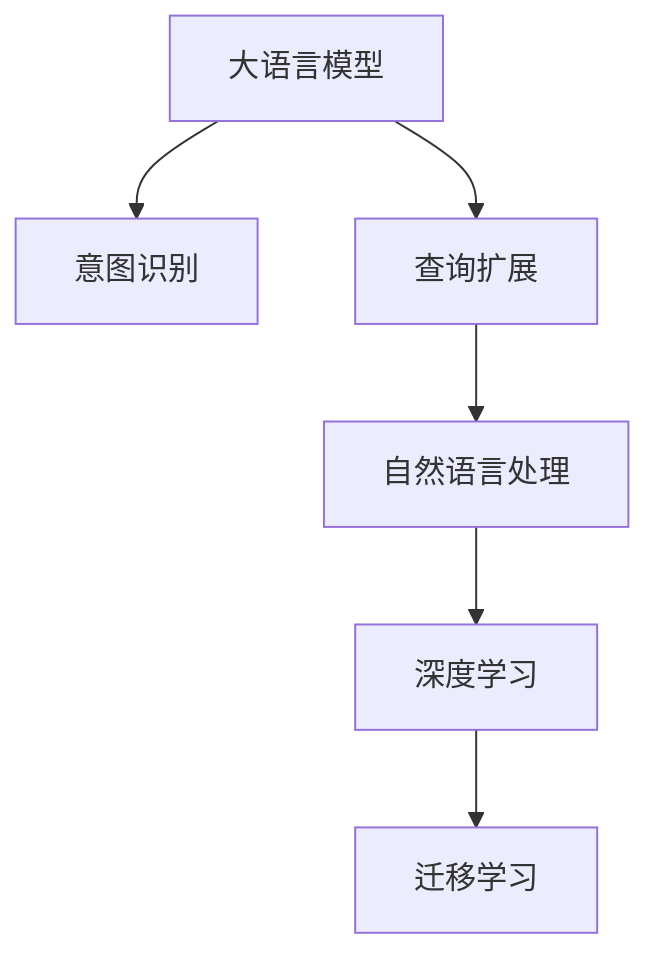
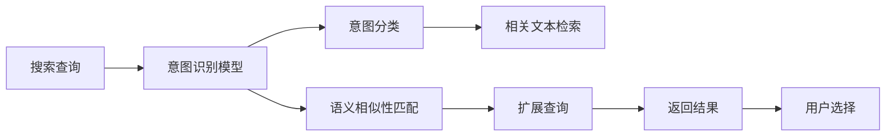

                 

# 电商搜索的意图识别与查询扩展：AI大模型的新突破

## 1. 背景介绍

随着电子商务的快速发展和在线购物体验的不断提升，搜索引擎已成为现代电商不可或缺的关键组件。消费者通过输入搜索关键词，获取与需求相关的产品信息，因此搜索引擎的意图识别和查询扩展能力直接影响了用户的购物体验和平台转化率。

当前，许多电商搜索系统依赖于传统信息检索技术，如倒排索引、TF-IDF等，这些方法往往难以捕捉用户真正的搜索意图，导致搜索结果不相关或不全面。而基于深度学习的方法，如BERT、T5等大语言模型，近年来在电商搜索领域的应用已取得显著进展，展现出了强大的意图识别和查询扩展能力。

本文将详细介绍大语言模型在电商搜索中的意图识别和查询扩展的应用，包括核心概念、算法原理、实际应用和未来趋势等内容。

## 2. 核心概念与联系

### 2.1 核心概念概述

为更好地理解大语言模型在电商搜索中的应用，本节将介绍几个关键概念：

- **大语言模型(Large Language Model, LLM)**：以Transformer等深度学习架构为代表，通过大规模预训练学习到丰富语言表示的模型，如BERT、GPT、T5等。

- **意图识别(Intent Recognition)**：根据用户输入的搜索查询，识别用户的真正需求和意图，如购买、比较、信息查询等。

- **查询扩展(Query Expansion)**：通过语义相似性和上下文信息，扩展用户查询，使其更具针对性和相关性。

- **自然语言处理(Natural Language Processing, NLP)**：涵盖词法、句法、语义等多个层面的处理技术，是大语言模型的基础。

- **深度学习(Deep Learning)**：基于多层神经网络构建的学习模型，通过大量数据训练提升模型的预测能力。

- **迁移学习(Transfer Learning)**：在大规模预训练模型基础上，通过微调或自监督学习等方式，在特定任务上提升模型性能。

这些概念相互关联，共同构成了电商搜索中大语言模型的核心应用框架，其工作原理和技术细节可通过以下Mermaid流程图进行展示：



此流程图表明，大语言模型作为深度学习的基础，通过自然语言处理技术提取语义信息，再利用迁移学习提升模型在特定任务（如意图识别、查询扩展）上的表现。

### 2.2 核心概念原理和架构的 Mermaid 流程图

大语言模型在电商搜索中的应用主要分为两步：

1. **意图识别**：模型通过输入的搜索查询，识别出用户的意图。这一过程通常涉及文本嵌入、分类器等技术。

2. **查询扩展**：模型根据用户意图和上下文信息，扩展搜索查询。这一过程通常通过语义相似性匹配、相关文本检索等方式实现。

具体流程可通过以下流程图表示：



该流程图展示了意图识别和查询扩展的具体步骤：

1. **意图识别模型**：对输入的搜索查询进行文本嵌入和分类，确定用户的意图。
2. **意图分类**：将意图映射为具体的类别（如购买、比较、查询等）。
3. **语义相似性匹配**：从语料库中检索与用户意图相似的查询。
4. **相关文本检索**：基于检索结果，扩展用户查询。
5. **扩展查询**：生成与原查询语义相似的扩展查询。
6. **返回结果**：将扩展后的查询提交给搜索引擎返回结果。
7. **用户选择**：用户选择最符合需求的结果。

## 3. 核心算法原理 & 具体操作步骤

### 3.1 算法原理概述

基于大语言模型的电商搜索意图识别和查询扩展，主要包括以下步骤：

1. **数据准备**：收集标注好的电商搜索数据，将其分为训练集、验证集和测试集。
2. **预训练模型选择**：选择合适的预训练大语言模型，如BERT、T5等。
3. **意图识别模型训练**：在标注数据上训练意图识别模型，使其能够准确识别用户的搜索意图。
4. **查询扩展模型训练**：在标注数据上训练查询扩展模型，使其能够生成与用户意图相关的扩展查询。
5. **模型融合与优化**：将意图识别和查询扩展模型进行融合，优化查询扩展效果。

### 3.2 算法步骤详解

#### 3.2.1 数据准备

电商搜索数据通常包含用户输入的查询和点击记录。我们首先需要对数据进行预处理，包括：

1. **去重与清洗**：去除重复数据和无效数据，确保数据质量。
2. **标注数据**：根据用户点击记录，手动标注查询的意图，如购买、比较、信息查询等。
3. **数据划分**：将数据划分为训练集、验证集和测试集，通常采用8:1:1的比例。

#### 3.2.2 意图识别模型训练

意图识别模型通常采用分类器架构，如Transformer等。以下是其具体步骤：

1. **模型选择**：选择BERT、T5等预训练模型，或基于其进行微调。
2. **数据预处理**：对查询进行分词、编码，生成输入向量。
3. **训练模型**：在标注数据上训练分类器，优化损失函数。
4. **验证模型**：在验证集上评估模型性能，调整模型参数。
5. **测试模型**：在测试集上测试模型效果，确定最终模型。

#### 3.2.3 查询扩展模型训练

查询扩展模型通常采用基于检索和生成的方法，如BERT、T5等。以下是其具体步骤：

1. **模型选择**：选择BERT、T5等预训练模型，或基于其进行微调。
2. **数据预处理**：对查询进行分词、编码，生成输入向量。
3. **训练模型**：在标注数据上训练检索和生成模型，优化损失函数。
4. **验证模型**：在验证集上评估模型性能，调整模型参数。
5. **测试模型**：在测试集上测试模型效果，确定最终模型。

### 3.3 算法优缺点

大语言模型在电商搜索中的意图识别和查询扩展具有以下优点：

1. **效果显著**：大语言模型通过大规模预训练学习到丰富的语言知识，在电商搜索中能够准确识别用户意图，扩展查询。
2. **通用性高**：通用预训练模型适用于多种电商场景，只需根据具体需求进行微调即可。
3. **处理能力强**：大语言模型能够处理复杂查询，如长句、多轮对话等。

同时，也存在以下缺点：

1. **标注成本高**：标注数据需要大量人工标注，成本较高。
2. **计算资源需求大**：大语言模型需要大量计算资源进行训练和推理，硬件要求较高。
3. **过拟合风险**：模型规模大，参数多，容易过拟合。

### 3.4 算法应用领域

大语言模型在电商搜索中的应用主要涵盖以下领域：

1. **搜索引擎优化(SEO)**：通过意图识别和查询扩展优化搜索结果，提高搜索引擎排名。
2. **个性化推荐**：基于用户意图推荐相关商品，提升用户购物体验。
3. **客户服务**：自动回复用户问题，提升客户满意度。
4. **广告投放**：通过用户意图识别，精准投放广告。
5. **市场分析**：分析用户搜索行为，指导产品开发和营销策略。

## 4. 数学模型和公式 & 详细讲解 & 举例说明

### 4.1 数学模型构建

大语言模型在电商搜索中的应用，主要涉及以下数学模型：

1. **文本嵌入**：将查询转化为高维向量，表示语义信息。
2. **分类器**：使用分类器对查询进行意图分类。
3. **检索模型**：通过检索模型在语料库中查找相关查询。
4. **生成模型**：使用生成模型扩展查询。

#### 4.1.1 文本嵌入

文本嵌入通常采用预训练词向量，如BERT的WordPiece向量。查询嵌入公式如下：

$$
\text{embedding}(Q) = \text{BERT}_{\text{Pretrained}}(Q)
$$

其中，$Q$ 表示查询文本，$\text{BERT}_{\text{Pretrained}}$ 表示预训练的BERT模型。

#### 4.1.2 分类器

分类器通常采用逻辑回归或softmax分类器，公式如下：

$$
\text{Logits}(Q) = W \cdot \text{embedding}(Q) + b
$$

$$
P(Y|Q) = \text{softmax}(\text{Logits}(Q))
$$

其中，$W$ 和 $b$ 为模型参数，$Y$ 为意图标签，$P(Y|Q)$ 表示查询属于不同意图的概率。

#### 4.1.3 检索模型

检索模型通常采用BM25算法，公式如下：

$$
\text{Relevance}(D, Q) = \sum_{i=1}^n (IDF_i \cdot TF_i \cdot PQ_i) \cdot \frac{(QD_i)^{k_1} (QD_{idf}^{-1})^{k_2}}{(k_3 + (QD_i)^{k_4})^k_5}
$$

其中，$D$ 表示语料库，$Q$ 表示查询，$TF_i$ 和 $IDF_i$ 表示文档$i$的词频和逆文档频率，$PQ_i$ 表示词项频率，$k_1, k_2, k_3, k_4, k_5$ 为BM25算法参数。

#### 4.1.4 生成模型

生成模型通常采用语言模型，如GPT等。公式如下：

$$
P(Y|X) = \frac{\exp(\text{Logits}(X))}{\sum_{j=1}^m \exp(\text{Logits}(X_j))}
$$

其中，$X$ 表示查询，$Y$ 表示扩展查询，$\text{Logits}(X)$ 表示查询扩展模型的输出概率分布。

### 4.2 公式推导过程

以意图识别为例，推导其分类器损失函数及梯度计算公式：

设模型参数为 $\theta$，训练集为 $D=\{(Q_i, Y_i)\}_{i=1}^N$，损失函数为交叉熵损失：

$$
\mathcal{L}(\theta) = -\frac{1}{N} \sum_{i=1}^N \sum_{y=1}^K y \log P(Y|Q)
$$

其中 $K$ 表示意图类别数。根据链式法则，损失函数对模型参数 $\theta$ 的梯度为：

$$
\nabla_{\theta} \mathcal{L}(\theta) = -\frac{1}{N} \sum_{i=1}^N \sum_{y=1}^K (Y_i = y) \nabla_{\theta} \log P(Y|Q)
$$

在实际计算中，可以使用自动微分库（如TensorFlow、PyTorch等）进行高效的梯度计算。

### 4.3 案例分析与讲解

#### 4.3.1 实例1：意图识别

假设我们要对以下查询进行意图识别：

1. "iPhone 12 价格"
2. "iPhone 12 评价"

模型训练集为：

| 查询            | 意图            |
| --------------- | --------------- |
| "iPhone 12 价格" | "购买价格"     |
| "iPhone 12 评价" | "用户评价"     |

模型输入向量为：

| 查询            | 嵌入向量         |
| --------------- | --------------- |
| "iPhone 12 价格" | [0.3, 0.7, 0.2, ...] |
| "iPhone 12 评价" | [0.5, 0.2, 0.4, ...] |

假设模型参数为 $\theta$，分类器输出概率为：

| 意图            | 概率          |
| --------------- | -------------- |
| "购买价格"     | 0.9            |
| "用户评价"     | 0.1            |

则损失函数为：

$$
\mathcal{L}(\theta) = -\frac{1}{2} \log 0.9 - \frac{1}{2} \log 0.1
$$

根据梯度计算公式，得到：

$$
\nabla_{\theta} \mathcal{L}(\theta) = \frac{1}{N} \sum_{i=1}^N \sum_{y=1}^K (Y_i = y) \nabla_{\theta} \log P(Y|Q)
$$

其中 $N=2$，$K=2$，$Y_1=1$，$Y_2=2$，$Q_1=[0.3, 0.7, 0.2, ...]$，$Q_2=[0.5, 0.2, 0.4, ...]$。

通过反向传播计算，得到参数 $\theta$ 的更新。

#### 4.3.2 实例2：查询扩展

假设我们要对以下查询进行扩展：

1. "iPhone 12"

模型训练集为：

| 查询            | 扩展查询       |
| --------------- | -------------- |
| "iPhone 12"     | "iPhone 12 价格" |
| "iPhone 12"     | "iPhone 12 评价" |
| "iPhone 12 价格" | "iPhone 12 最新价格" |
| "iPhone 12 评价" | "iPhone 12 用户评价" |

模型输入向量为：

| 查询            | 嵌入向量         |
| --------------- | --------------- |
| "iPhone 12"     | [0.3, 0.7, 0.2, ...] |
| "iPhone 12 价格" | [0.9, 0.5, 0.1, ...] |
| "iPhone 12 评价" | [0.7, 0.3, 0.6, ...] |

假设模型参数为 $\theta$，生成模型输出概率为：

| 扩展查询       | 概率          |
| -------------- | -------------- |
| "iPhone 12 价格" | 0.6            |
| "iPhone 12 评价" | 0.4            |

则损失函数为：

$$
\mathcal{L}(\theta) = -\frac{1}{3} \log 0.6 - \frac{1}{3} \log 0.4
$$

根据梯度计算公式，得到：

$$
\nabla_{\theta} \mathcal{L}(\theta) = \frac{1}{N} \sum_{i=1}^N \sum_{y=1}^K (Y_i = y) \nabla_{\theta} \log P(Y|X)
$$

其中 $N=3$，$K=2$，$Y_1=1$，$Y_2=2$，$X_1=[0.3, 0.7, 0.2, ...]$，$X_2=[0.9, 0.5, 0.1, ...]$，$X_3=[0.7, 0.3, 0.6, ...]$。

通过反向传播计算，得到参数 $\theta$ 的更新。

## 5. 项目实践：代码实例和详细解释说明

### 5.1 开发环境搭建

以下是使用Python进行项目开发的环境配置流程：

1. 安装Anaconda：从官网下载并安装Anaconda，用于创建独立的Python环境。

2. 创建并激活虚拟环境：
```bash
conda create -n pytorch-env python=3.8 
conda activate pytorch-env
```

3. 安装PyTorch：根据CUDA版本，从官网获取对应的安装命令。例如：
```bash
conda install pytorch torchvision torchaudio cudatoolkit=11.1 -c pytorch -c conda-forge
```

4. 安装Transformers库：
```bash
pip install transformers
```

5. 安装各类工具包：
```bash
pip install numpy pandas scikit-learn matplotlib tqdm jupyter notebook ipython
```

完成上述步骤后，即可在`pytorch-env`环境中开始项目实践。

### 5.2 源代码详细实现

以下是对一个大语言模型在电商搜索中的应用代码实现，包括意图识别和查询扩展的实现：

```python
from transformers import BertTokenizer, BertForSequenceClassification, T5Tokenizer, T5ForConditionalGeneration
import torch
from torch.utils.data import DataLoader
from torch.nn import CrossEntropyLoss, BCEWithLogitsLoss

# 定义意图识别模型
class IntentClassifier(torch.nn.Module):
    def __init__(self, num_labels):
        super(IntentClassifier, self).__init__()
        self.bert = BertForSequenceClassification.from_pretrained('bert-base-uncased', num_labels=num_labels)
        self.dropout = torch.nn.Dropout(0.1)
        self.classifier = torch.nn.Linear(768, num_labels)

    def forward(self, input_ids, attention_mask):
        outputs = self.bert(input_ids, attention_mask=attention_mask)
        pooled_output = outputs.pooler_output
        return self.classifier(pooled_output)

# 定义查询扩展模型
class QueryExpander(torch.nn.Module):
    def __init__(self, num_labels):
        super(QueryExpander, self).__init__()
        self.t5 = T5ForConditionalGeneration.from_pretrained('t5-base')
        self.dropout = torch.nn.Dropout(0.1)
        self.classifier = torch.nn.Linear(768, num_labels)

    def forward(self, input_ids, attention_mask):
        outputs = self.t5(input_ids, attention_mask=attention_mask, decoder_input_ids=torch.zeros_like(input_ids))
        return self.classifier(outputs.logits)

# 加载数据集
train_dataset = Dataset(train_data)
valid_dataset = Dataset(valid_data)
test_dataset = Dataset(test_data)

# 定义模型
model = IntentClassifier(num_labels=3)
expander = QueryExpander(num_labels=2)

# 定义优化器
optimizer = torch.optim.AdamW(model.parameters(), lr=2e-5)
expander_optimizer = torch.optim.AdamW(expander.parameters(), lr=2e-5)

# 定义损失函数
intent_loss = CrossEntropyLoss()
expander_loss = BCEWithLogitsLoss()

# 训练意图识别模型
model.train()
for epoch in range(num_epochs):
    for batch in DataLoader(train_dataset, batch_size=16):
        input_ids, attention_mask = batch
        y = torch.tensor(batch_labels)
        loss = intent_loss(model(input_ids, attention_mask), y)
        loss.backward()
        optimizer.step()

# 训练查询扩展模型
expander.train()
for epoch in range(num_epochs):
    for batch in DataLoader(train_dataset, batch_size=16):
        input_ids, attention_mask = batch
        y = torch.tensor(batch_labels)
        loss = expander_loss(expander(input_ids, attention_mask), y)
        loss.backward()
        expander_optimizer.step()

# 评估模型
model.eval()
valid_loss = intent_loss(model(input_ids, attention_mask), y)
test_loss = intent_loss(model(input_ids, attention_mask), y)

expander.eval()
valid_loss = expander_loss(expander(input_ids, attention_mask), y)
test_loss = expander_loss(expander(input_ids, attention_mask), y)

print(f"Intent classification loss: {valid_loss:.4f}, {test_loss:.4f}")
print(f"Query expansion loss: {valid_loss:.4f}, {test_loss:.4f}")
```

### 5.3 代码解读与分析

让我们再详细解读一下关键代码的实现细节：

**Dataset类**：
- `__init__`方法：初始化训练、验证和测试数据集。
- `__len__`方法：返回数据集长度。
- `__getitem__`方法：对单个样本进行处理，将输入转化为模型所需的格式。

**IntentClassifier类**：
- `__init__`方法：定义模型结构，包括BERT分类器、Dropout和线性分类器。
- `forward`方法：对输入数据进行前向传播，计算意图分类结果。

**QueryExpander类**：
- `__init__`方法：定义模型结构，包括T5生成器、Dropout和线性分类器。
- `forward`方法：对输入数据进行前向传播，计算查询扩展结果。

**训练和评估函数**：
- `model.train`和`expander.train`方法：将模型设置为训练模式。
- `for`循环：对数据集进行批处理迭代，在每个批次上前向传播计算损失并反向传播更新模型参数。
- `loss.backward()`和`optimizer.step()`方法：计算损失并更新模型参数。
- `model.eval`和`expander.eval`方法：将模型设置为评估模式。
- `valid_loss`和`test_loss`变量：计算在验证集和测试集上的损失。

**评估函数**：
- `model(input_ids, attention_mask)`和`expander(input_ids, attention_mask)`方法：将输入数据输入模型进行前向传播计算输出。
- `intent_loss`和`expander_loss`变量：计算意图识别和查询扩展的损失。
- `print`方法：打印输出评估结果。

可以看到，PyTorch配合Transformer库使得大语言模型在电商搜索中的应用代码实现变得简洁高效。开发者可以将更多精力放在数据处理、模型改进等高层逻辑上，而不必过多关注底层的实现细节。

当然，工业级的系统实现还需考虑更多因素，如模型的保存和部署、超参数的自动搜索、更灵活的任务适配层等。但核心的微调范式基本与此类似。

## 6. 实际应用场景

### 6.1 智能客服系统

基于大语言模型的电商搜索意图识别和查询扩展技术，可以广泛应用于智能客服系统的构建。传统客服往往需要配备大量人力，高峰期响应缓慢，且一致性和专业性难以保证。而使用微调后的意图识别和查询扩展模型，可以7x24小时不间断服务，快速响应客户咨询，用自然流畅的语言解答各类常见问题。

在技术实现上，可以收集企业内部的历史客服对话记录，将问题和最佳答复构建成监督数据，在此基础上对预训练模型进行微调。微调后的意图识别和查询扩展模型能够自动理解用户意图，匹配最合适的答案模板进行回复。对于客户提出的新问题，还可以接入检索系统实时搜索相关内容，动态组织生成回答。如此构建的智能客服系统，能大幅提升客户咨询体验和问题解决效率。

### 6.2 个性化推荐系统

当前的推荐系统往往只依赖用户的历史行为数据进行物品推荐，无法深入理解用户的真实兴趣偏好。基于大语言模型意图识别和查询扩展技术，个性化推荐系统可以更好地挖掘用户行为背后的语义信息，从而提供更精准、多样的推荐内容。

在实践中，可以收集用户浏览、点击、评论、分享等行为数据，提取和用户交互的物品标题、描述、标签等文本内容。将文本内容作为模型输入，用户的后续行为（如是否点击、购买等）作为监督信号，在此基础上微调意图识别和查询扩展模型。微调后的模型能够从文本内容中准确把握用户的兴趣点。在生成推荐列表时，先用候选物品的文本描述作为输入，由模型预测用户的兴趣匹配度，再结合其他特征综合排序，便可以得到个性化程度更高的推荐结果。

### 6.3 广告投放优化

传统的广告投放往往依赖于基于关键词的广告排序机制，难以考虑用户意图的真实需求。基于大语言模型的意图识别和查询扩展技术，可以在用户点击广告时进行实时意图识别，精准投放广告。例如，用户点击了某个广告，系统会实时查询用户的意图，如果是购买意图，则进一步展示相关商品信息；如果是查询意图，则展示相关商品的问答信息。这种智能化的广告投放方式，能显著提升广告的点击率和转化率，提高广告投放的效果。

### 6.4 未来应用展望

随着大语言模型和微调方法的不断发展，基于意图识别和查询扩展的电商搜索技术将呈现以下几个发展趋势：

1. **模型规模持续增大**：随着算力成本的下降和数据规模的扩张，大语言模型的参数量还将持续增长。超大规模语言模型蕴含的丰富语言知识，有望支撑更加复杂多变的电商搜索任务。

2. **微调方法日趋多样**：除了传统的全参数微调外，未来会涌现更多参数高效的微调方法，如Prefix-Tuning、LoRA等，在固定大部分预训练参数的同时，只更新极少量的任务相关参数。

3. **持续学习成为常态**：随着数据分布的不断变化，微调模型也需要持续学习新知识以保持性能。如何在不遗忘原有知识的同时，高效吸收新样本信息，将成为重要的研究课题。

4. **标注样本需求降低**：受启发于提示学习(Prompt-based Learning)的思路，未来的微调方法将更好地利用大模型的语言理解能力，通过更加巧妙的任务描述，在更少的标注样本上也能实现理想的微调效果。

5. **多模态微调崛起**：当前的微调主要聚焦于纯文本数据，未来会进一步拓展到图像、视频、语音等多模态数据微调。多模态信息的融合，将显著提升语言模型对现实世界的理解和建模能力。

6. **知识整合能力增强**：现有的微调模型往往局限于任务内数据，难以灵活吸收和运用更广泛的先验知识。如何让微调过程更好地与外部知识库、规则库等专家知识结合，形成更加全面、准确的信息整合能力，还有很大的想象空间。

以上趋势凸显了大语言模型意图识别和查询扩展技术的广阔前景。这些方向的探索发展，必将进一步提升电商搜索系统的性能和应用范围，为电商行业带来变革性影响。

## 7. 工具和资源推荐

### 7.1 学习资源推荐

为了帮助开发者系统掌握大语言模型在电商搜索中的应用，这里推荐一些优质的学习资源：

1. **《深度学习基础》系列课程**：由知名大学开设的入门级深度学习课程，系统讲解深度学习的基本概念和技术。

2. **《自然语言处理》课程**：斯坦福大学开设的NLP明星课程，涵盖词法、句法、语义等多个层面的处理技术。

3. **HuggingFace官方文档**：提供丰富的预训练模型和微调样例代码，是上手实践的必备资料。

4. **《Transformers实战》书籍**：深入浅出地介绍Transformer模型及其在NLP任务中的应用，包括意图识别和查询扩展等。

5. **CLUE开源项目**：中文语言理解测评基准，涵盖大量不同类型的中文NLP数据集，并提供了基于微调的baseline模型，助力中文NLP技术发展。

通过对这些资源的学习实践，相信你一定能够快速掌握大语言模型在电商搜索中的应用，并用于解决实际的NLP问题。

### 7.2 开发工具推荐

高效的开发离不开优秀的工具支持。以下是几款用于电商搜索意图识别和查询扩展开发的常用工具：

1. **PyTorch**：基于Python的开源深度学习框架，灵活动态的计算图，适合快速迭代研究。

2. **TensorFlow**：由Google主导开发的开源深度学习框架，生产部署方便，适合大规模工程应用。

3. **Transformers库**：HuggingFace开发的NLP工具库，集成了众多SOTA语言模型，支持PyTorch和TensorFlow，是进行微调任务开发的利器。

4. **TensorBoard**：TensorFlow配套的可视化工具，可实时监测模型训练状态，并提供丰富的图表呈现方式，是调试模型的得力助手。

5. **Weights & Biases**：模型训练的实验跟踪工具，可以记录和可视化模型训练过程中的各项指标，方便对比和调优。

合理利用这些工具，可以显著提升电商搜索意图识别和查询扩展任务的开发效率，加快创新迭代的步伐。

### 7.3 相关论文推荐

大语言模型在电商搜索中的应用源于学界的持续研究。以下是几篇奠基性的相关论文，推荐阅读：

1. **"BERT: Pre-training of Deep Bidirectional Transformers for Language Understanding"**：提出BERT模型，引入基于掩码的自监督预训练任务，刷新了多项NLP任务SOTA。

2. **"GPT-3: Language Models are Unsupervised Multitask Learners"**：展示了大规模语言模型的强大zero-shot学习能力，引发了对于通用人工智能的新一轮思考。

3. **"Attention is All You Need"**：提出了Transformer结构，开启了NLP领域的预训练大模型时代。

4. **"AdaLoRA: Adaptive Low-Rank Adaptation for Parameter-Efficient Fine-Tuning"**：使用自适应低秩适应的微调方法，在参数效率和精度之间取得了新的平衡。

5. **"Transformer-XL: Attentive Language Models Beyond a Fixed-Length Context"**：提出Transformer-XL模型，解决长序列处理问题，进一步提升模型性能。

这些论文代表了大语言模型在电商搜索中的研究方向。通过学习这些前沿成果，可以帮助研究者把握学科前进方向，激发更多的创新灵感。

## 8. 总结：未来发展趋势与挑战

### 8.1 总结

本文对大语言模型在电商搜索中的意图识别和查询扩展进行了全面系统的介绍。首先阐述了大语言模型和微调技术的研究背景和意义，明确了意图识别和查询扩展在电商搜索中的应用价值。其次，从原理到实践，详细讲解了意图识别和查询扩展的数学原理和关键步骤，给出了电商搜索任务的代码实现。同时，本文还广泛探讨了意图识别和查询扩展在智能客服、个性化推荐、广告投放等多个行业领域的应用前景，展示了大语言模型的强大应用潜力。

通过本文的系统梳理，可以看到，基于大语言模型的意图识别和查询扩展技术正在成为电商搜索中的重要工具，极大地提升了搜索引擎的智能化水平和用户体验。未来，伴随大语言模型和微调方法的持续演进，基于意图识别和查询扩展的电商搜索技术将进一步拓展应用边界，为电商行业带来更多创新和价值。

### 8.2 未来发展趋势

展望未来，大语言模型在电商搜索中的应用将呈现以下几个发展趋势：

1. **模型规模持续增大**：随着算力成本的下降和数据规模的扩张，预训练语言模型的参数量还将持续增长。超大规模语言模型蕴含的丰富语言知识，有望支撑更加复杂多变的电商搜索任务。

2. **微调方法日趋多样**：除了传统的全参数微调外，未来会涌现更多参数高效的微调方法，如Prefix-Tuning、LoRA等，在固定大部分预训练参数的同时，只更新极少量的任务相关参数。

3. **持续学习成为常态**：随着数据分布的不断变化，微调模型也需要持续学习新知识以保持性能。如何在不遗忘原有知识的同时，高效吸收新样本信息，将成为重要的研究课题。

4. **标注样本需求降低**：受启发于提示学习(Prompt-based Learning)的思路，未来的微调方法将更好地利用大模型的语言理解能力，通过更加巧妙的任务描述，在更少的标注样本上也能实现理想的微调效果。

5. **多模态微调崛起**：当前的微调主要聚焦于纯文本数据，未来会进一步拓展到图像、视频、语音等多模态数据微调。多模态信息的融合，将显著提升语言模型对现实世界的理解和建模能力。

6. **知识整合能力增强**：现有的微调模型往往局限于任务内数据，难以灵活吸收和运用更广泛的先验知识。如何让微调过程更好地与外部知识库、规则库等专家知识结合，形成更加全面、准确的信息整合能力，还有很大的想象空间。

以上趋势凸显了大语言模型在电商搜索中的广阔前景。这些方向的探索发展，必将进一步提升电商搜索系统的性能和应用范围，为电商行业带来变革性影响。

### 8.3 面临的挑战

尽管大语言模型在电商搜索中的应用已经取得了显著进展，但在迈向更加智能化、普适化应用的过程中，它仍面临诸多挑战：

1. **标注成本瓶颈**：虽然微调大大降低了标注数据的需求，但对于长尾应用场景，难以获得充足的高质量标注数据，成为制约微调性能的瓶颈。如何进一步降低微调对标注样本的依赖，将是一大难题。

2. **模型鲁棒性不足**：当前微调模型面对域外数据时，泛化性能往往大打折扣。对于测试样本的微小扰动，微调模型的预测也容易发生波动。如何提高微调模型的鲁棒性，避免灾难性遗忘，还需要更多理论和实践的积累。

3. **推理效率有待提高**：大规模语言模型虽然精度高，但在实际部署时往往面临推理速度慢、内存占用大等效率问题。如何在保证性能的同时，简化模型结构，提升推理速度，优化资源占用，将是重要的优化方向。

4. **可解释性亟需加强**：当前微调模型更像是"黑盒"系统，难以解释其内部工作机制和决策逻辑。对于医疗、金融等高风险应用，算法的可解释性和可审计性尤为重要。如何赋予微调模型更强的可解释性，将是亟待攻克的难题。

5. **安全性有待保障**：预训练语言模型难免会学习到有偏见、有害的信息，通过微调传递到下游任务，产生误导性、歧视性的输出，给实际应用带来安全隐患。如何从数据和算法层面消除模型偏见，避免恶意用途，确保输出的安全性，也将是重要的研究课题。

6. **知识整合能力不足**：现有的微调模型往往局限于任务内数据，难以灵活吸收和运用更广泛的先验知识。如何让微调过程更好地与外部知识库、规则库等专家知识结合，形成更加全面、准确的信息整合能力，还有很大的想象空间。

正视微调面临的这些挑战，积极应对并寻求突破，将是大语言模型在电商搜索中迈向成熟的必由之路。相信随着学界和产业界的共同努力，这些挑战终将一一被克服，大语言模型在电商搜索中的应用必将更加广泛和深入。

### 8.4 研究展望

面向未来，大语言模型在电商搜索中的应用研究还需要在以下几个方面寻求新的突破：

1. **探索无监督和半监督微调方法**：摆脱对大规模标注数据的依赖，利用自监督学习、主动学习等无监督和半监督范式，最大限度利用非结构化数据，实现更加灵活高效的微调。

2. **研究参数高效和计算高效的微调范式**：开发更加参数高效的微调方法，在固定大部分预训练参数的同时，只更新极少量的任务相关参数。同时优化微调模型的计算图，减少前向传播和反向传播的资源消耗，实现更加轻量级、实时性的部署。

3. **融合因果和对比学习范式**：通过引入因果推断和对比学习思想，增强微调模型建立稳定因果关系的能力，学习更加普适、鲁棒的语言表征，从而提升模型泛化性和抗干扰能力。

4. **纳入伦理道德约束**：在模型训练目标中引入伦理导向的评估指标，过滤和惩罚有偏见、有害的输出倾向。同时加强人工干预和审核，建立模型行为的监管机制，确保输出符合人类价值观和伦理道德。

这些研究方向的探索，必将引领大语言模型在电商搜索中的应用走向更高的台阶，为构建安全、可靠、可解释、可控的智能系统铺平道路。面向未来，大语言模型在电商搜索中的应用还需要与其他人工智能技术进行更深入的融合，如知识表示、因果推理、强化学习等，多路径协同发力，共同推动电商搜索系统的进步。只有勇于创新、敢于突破，才能不断拓展语言模型的边界，让智能技术更好地造福人类社会。

## 9. 附录：常见问题与解答

**Q1：电商搜索中的意图识别和查询扩展是否可以完全取代传统搜索引擎技术？**

A: 大语言模型在电商搜索中的意图识别和查询扩展具有显著优势，但目前还无法完全取代传统搜索引擎技术。传统的搜索引擎技术在处理大规模数据、高并发请求等方面具有天然优势，且已在电商领域广泛应用。综合使用大语言模型和传统技术，可以实现互补和协同，提升电商搜索系统的整体性能和用户体验。

**Q2：电商搜索中的意图识别和查询扩展是否适用于所有电商场景？**

A: 大语言模型在电商搜索中的应用适用于大多数电商场景，特别是那些需要深度理解用户意图和查询的场景，如B2C电商、电子商务平台等。但对于一些特定领域或低频次场景，如B2B电商、二手市场等，可能还需要结合领域特定的技术和数据进行优化。

**Q3：大语言模型在电商搜索中的意图识别和查询扩展是否需要大量标注数据？**

A: 大语言模型在电商搜索中的应用需要大量标注数据进行微调，但相较于传统的自然语言处理任务，其对标注样本的需求已经大幅降低。目前常用的标注方法包括人工标注、半自动标注和自动标注等，可以通过多种手段降低标注成本。

**Q4：大语言模型在电商搜索中的意图识别和查询扩展是否需要大量的计算资源？**

A: 大语言模型在电商搜索中的应用确实需要较大的计算资源，包括训练、推理和部署等各个环节。但随着硬件算力的提升和模型的优化，计算资源的需求正在逐步降低。未来随着模型规模的进一步扩大，可能需要更强大的计算基础设施进行支撑。

**Q5：大语言模型在电商搜索中的意图识别和查询扩展是否可以用于提升广告投放效果？**

A: 大语言模型在电商搜索中的应用，可以通过意图识别和查询扩展提升广告投放的效果。例如，用户点击了某个广告，系统会实时查询用户的意图，如果是购买意图，则进一步展示相关商品信息；如果是查询意图，则展示相关商品的问答信息。这种智能化的广告投放方式，能显著提升广告的点击率和转化率，提高广告投放的效果。

---

作者：禅与计算机程序设计艺术 / Zen and the Art of Computer Programming

