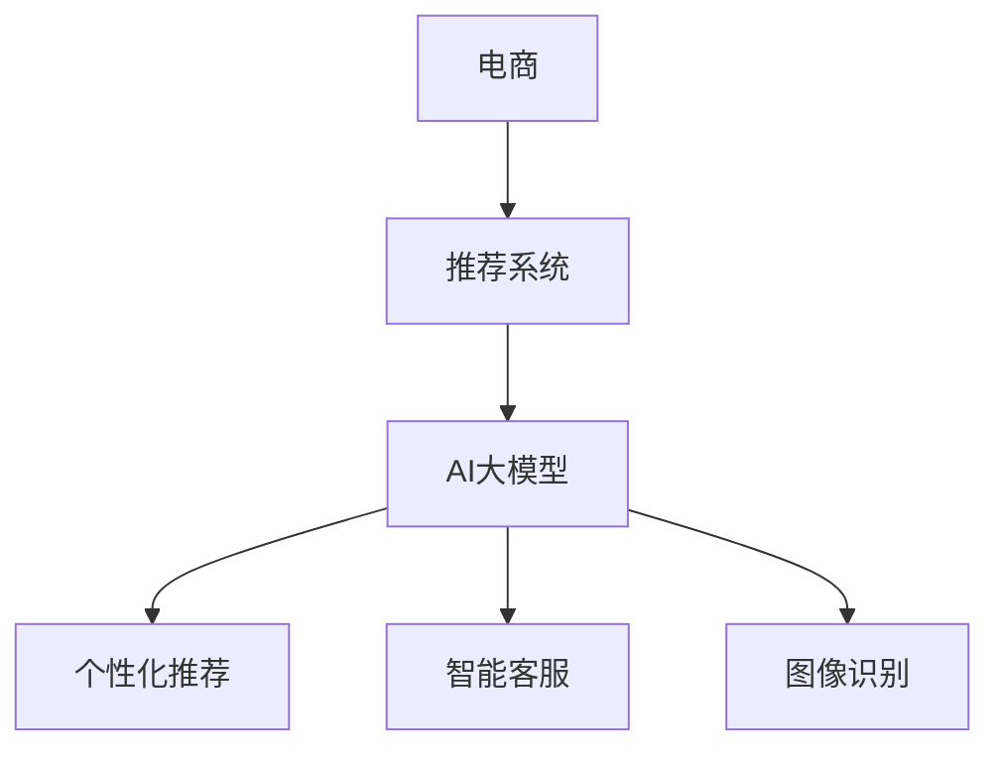

                 

# 电商行业中AI大模型的落地应用案例分析

> 关键词：人工智能,大模型,电商,推荐系统,个性化,智能客服,图像识别

## 1. 背景介绍

### 1.1 问题由来

随着电子商务的快速发展，各大电商平台对个性化推荐系统的需求日益增长。传统的推荐系统依赖于手工设计的特征工程和规则，难以适应用户快速变化的需求。而基于深度学习技术的AI推荐系统，可以通过大规模数据进行训练，挖掘用户行为背后的深层次特征，实现更加精准的推荐。然而，深度学习模型的参数量庞大，训练和推理成本高昂，如何在电商行业中有效落地应用AI大模型，成为摆在技术团队面前的一大难题。

### 1.2 问题核心关键点

为解决上述问题，各大电商平台纷纷采用AI大模型，通过微调和优化，实现了对个性化推荐系统、智能客服、图像识别等电商核心场景的深度应用。本文将结合具体案例，分析电商行业中AI大模型的落地应用，为技术团队提供有价值的实践参考。

### 1.3 问题研究意义

大模型在电商行业中的应用，可以有效提升用户体验，增加平台粘性，促进销售转化，降低运营成本。通过大模型的深度学习能力，电商平台能够更好地理解用户需求，预测用户行为，提供更加个性化、贴合用户心理的购物建议和服务。同时，大模型的落地应用可以显著降低人工成本，提升服务效率，帮助电商平台实现智能化转型，占据行业领先地位。

## 2. 核心概念与联系

### 2.1 核心概念概述

为更好地理解AI大模型在电商行业中的落地应用，本节将介绍几个关键概念：

- 人工智能(AI)：一种通过计算机模拟人类智能行为的技术，涵盖感知、推理、学习、决策等多个方面。
- 大模型(Deep Learning Models)：指具有巨大参数量的深度学习模型，如BERT、GPT、Transformer等，在自然语言处理(NLP)、计算机视觉(CV)等领域中广泛应用。
- 电商(Online Shopping)：指通过互联网平台进行的商品买卖活动，包括B2C和B2B两种模式，涵盖购物、支付、物流等多个环节。
- 推荐系统(Recommendation System)：通过用户行为数据，为商品和用户构建关联关系，推荐潜在感兴趣的物品。
- 智能客服(Customer Service)：利用AI技术，为电商平台提供自动化的客户服务，处理常见的查询、咨询等事务。
- 图像识别(Image Recognition)：通过深度学习模型对图片中的物体、场景进行分类和识别。

这些核心概念共同构成了AI大模型在电商行业落地应用的基础，帮助电商平台实现智能化升级和用户体验的提升。

### 2.2 核心概念原理和架构的 Mermaid 流程图



该流程图展示了AI大模型在电商推荐系统、智能客服、图像识别等核心场景中的应用。

## 3. 核心算法原理 & 具体操作步骤
### 3.1 算法原理概述

AI大模型在电商行业的落地应用，主要依赖于两个核心算法：个性化推荐和智能客服。

- 个性化推荐：通过分析用户历史行为数据，预测其未来行为，为商品和用户构建关联关系，实现个性化推荐。
- 智能客服：利用自然语言处理技术，对用户咨询进行理解和回应，提供自动化服务，提升用户满意度。

这两个算法都依赖于大模型的预训练和微调，以下是具体的算法原理：

### 3.2 算法步骤详解

#### 3.2.1 个性化推荐系统

个性化推荐系统的核心算法包括协同过滤、基于内容的推荐、基于模型的推荐等。其中，基于模型的推荐算法包括矩阵分解、深度学习等，深度学习模型在大规模电商推荐系统中取得了良好的效果。

1. 数据预处理：收集用户行为数据、商品属性数据、用户画像数据等，进行清洗和标准化处理。
2. 特征工程：将处理后的数据转化为模型可接受的格式，如将用户行为数据转化为向量表示，生成高维特征。
3. 模型训练：选择合适的大模型，在标注数据上进行预训练，然后对模型进行微调，适配电商推荐任务。
4. 推荐计算：将用户输入和商品特征输入模型，输出预测概率，根据模型输出排序推荐商品。

#### 3.2.2 智能客服系统

智能客服系统通过自然语言处理技术，实现对用户咨询的自动理解和回应。

1. 数据预处理：收集历史聊天记录、用户意图标注等数据，进行清洗和标准化处理。
2. 模型训练：选择合适的大模型，在标注数据上进行预训练，然后对模型进行微调，适配电商客服任务。
3. 对话生成：输入用户咨询，模型通过解码器生成回复文本。
4. 优化策略：通过A/B测试、用户反馈等方式，不断优化模型性能，提升用户体验。

### 3.3 算法优缺点

AI大模型在电商行业中的落地应用具有以下优点：

- 个性化推荐：能够精准预测用户兴趣，提升用户体验和转化率。
- 智能客服：可自动处理常见问题，降低人工成本，提升服务效率。
- 图像识别：快速准确识别商品信息，提升用户体验和销售转化率。

同时，也存在一些缺点：

- 计算资源消耗高：大模型训练和推理需要大量的计算资源，平台需投入巨额算力成本。
- 数据依赖性强：模型效果依赖于高质量标注数据，平台需投入大量人力进行数据标注。
- 模型复杂度高：大模型的结构和训练过程复杂，技术门槛较高。

### 3.4 算法应用领域

AI大模型在电商行业的落地应用，主要涵盖以下几个领域：

- 个性化推荐：提升用户购物体验和转化率，促进平台销售。
- 智能客服：提升用户满意度，降低人工成本，增加服务效率。
- 图像识别：快速准确识别商品信息，提升用户购物体验。
- 智能营销：通过数据分析和预测，制定精准营销策略。
- 风险控制：通过用户行为数据分析，降低欺诈和风险。

## 4. 数学模型和公式 & 详细讲解 & 举例说明

### 4.1 数学模型构建

在电商个性化推荐系统中，常用的数学模型包括协同过滤模型和基于深度学习的推荐模型。以下分别介绍这两种模型的构建方法。

#### 4.1.1 协同过滤模型

协同过滤模型通过用户-商品评分矩阵，找到相似用户和商品，从而推荐相似用户喜欢的商品。

- 用户-商品评分矩阵：将用户对商品的评分数据转化为矩阵形式。
- 相似度计算：计算用户和商品的相似度，如余弦相似度。
- 推荐计算：根据相似用户和商品的评分数据，生成推荐列表。

#### 4.1.2 基于深度学习的推荐模型

基于深度学习的推荐模型通过神经网络学习用户行为和商品特征之间的映射关系，生成推荐列表。

- 输入层：将用户行为数据和商品特征数据转化为向量形式，输入神经网络。
- 隐藏层：通过多层神经网络进行特征提取和映射。
- 输出层：输出商品推荐概率，排序推荐商品。

### 4.2 公式推导过程

以下是协同过滤模型的公式推导过程：

1. 用户-商品评分矩阵 $U$，其中 $U_{i,j}$ 表示用户 $i$ 对商品 $j$ 的评分。
2. 相似度计算公式：$sim(i,j)=\frac{\mathbf{u}_i\cdot\mathbf{v}_j}{||\mathbf{u}_i||_2||\mathbf{v}_j||_2}$，其中 $\mathbf{u}_i$ 和 $\mathbf{v}_j$ 分别为用户 $i$ 和商品 $j$ 的评分向量。
3. 推荐计算公式：$y_i=\frac{1}{K}\sum_{j\in N_i}\frac{U_{i,j}}{K_j}$，其中 $N_i$ 表示与用户 $i$ 相似的商品集合，$K_j$ 表示商品 $j$ 的评分向量长度。

### 4.3 案例分析与讲解

以电商平台对用户进行个性化推荐为例，分析模型的构建和应用过程。

1. 数据预处理：收集用户浏览历史、购买记录、评分数据等，转化为向量形式。
2. 模型训练：选择合适的大模型，如BERT、GPT等，在电商推荐数据上进行预训练，然后对模型进行微调，适配电商推荐任务。
3. 推荐计算：将用户输入数据输入模型，输出推荐概率，排序推荐商品。
4. 评估和优化：通过A/B测试、用户反馈等方式，不断优化模型性能，提升推荐效果。

## 5. 项目实践：代码实例和详细解释说明

### 5.1 开发环境搭建

在进行电商AI大模型落地应用开发前，我们需要准备好开发环境。以下是使用Python进行TensorFlow开发的环境配置流程：

1. 安装Anaconda：从官网下载并安装Anaconda，用于创建独立的Python环境。
2. 创建并激活虚拟环境：
```bash
conda create -n tf-env python=3.7 
conda activate tf-env
```
3. 安装TensorFlow：根据CUDA版本，从官网获取对应的安装命令。例如：
```bash
pip install tensorflow-gpu==2.6
```
4. 安装其他工具包：
```bash
pip install numpy pandas scikit-learn matplotlib tqdm jupyter notebook ipython
```
完成上述步骤后，即可在`tf-env`环境中开始电商AI大模型的开发实践。

### 5.2 源代码详细实现

下面我们以电商平台个性化推荐系统为例，给出使用TensorFlow对大模型进行微调的代码实现。

首先，定义推荐系统所需的数据处理函数：

```python
import tensorflow as tf
from tensorflow.keras.preprocessing import sequence
from tensorflow.keras.layers import Embedding, Dot, Dense, Flatten, Dropout

class RecommendationDataset(tf.keras.utils.Sequence):
    def __init__(self, users, items, user_ids, item_ids, user_ratings, batch_size):
        self.users = users
        self.items = items
        self.user_ids = user_ids
        self.item_ids = item_ids
        self.user_ratings = user_ratings
        self.batch_size = batch_size

    def __len__(self):
        return len(self.user_ids) // self.batch_size

    def __getitem__(self, idx):
        batch_user_ids = self.user_ids[idx * self.batch_size : (idx + 1) * self.batch_size]
        batch_item_ids = self.item_ids[idx * self.batch_size : (idx + 1) * self.batch_size]
        batch_user_ratings = self.user_ratings[idx * self.batch_size : (idx + 1) * self.batch_size]
        return batch_user_ids, batch_item_ids, batch_user_ratings
```

然后，定义推荐模型的搭建和训练函数：

```python
def create_model():
    model = tf.keras.Sequential([
        Embedding(input_dim=len(user_ids), output_dim=32, input_length=32),
        Dot(axes=(1, 1)),
        Dense(units=16, activation='relu'),
        Dense(units=1, activation='sigmoid')
    ])
    model.compile(optimizer='adam', loss='binary_crossentropy', metrics=['accuracy'])
    return model

def train_model(model, train_dataset, validation_dataset, epochs=10):
    model.fit(train_dataset, validation_data=validation_dataset, epochs=epochs, verbose=2)
```

接着，定义数据生成和模型训练函数：

```python
import numpy as np
from sklearn.model_selection import train_test_split

# 假设数据生成
np.random.seed(42)
users = np.random.randint(1000, size=1000)
items = np.random.randint(1000, size=1000)
user_ratings = np.random.randint(0, 2, size=1000)

# 数据预处理
user_ids = []
item_ids = []
for user, item, rating in zip(users, items, user_ratings):
    user_ids.append(user)
    item_ids.append(item)

# 划分训练集和验证集
train_user_ids, test_user_ids, train_item_ids, test_item_ids, train_user_ratings, test_user_ratings = train_test_split(
    user_ids, item_ids, user_ratings, test_size=0.2, random_state=42)

# 数据生成器
train_dataset = RecommendationDataset(train_user_ids, train_item_ids, train_user_ratings, test_user_ratings, 64)
validation_dataset = RecommendationDataset(test_user_ids, test_item_ids, train_user_ratings, test_user_ratings, 64)

# 模型搭建和训练
model = create_model()
train_model(model, train_dataset, validation_dataset)
```

最后，启动模型训练流程并在测试集上评估：

```python
import matplotlib.pyplot as plt

# 模型训练
history = model.fit(train_dataset, validation_data=validation_dataset, epochs=10, verbose=2)

# 训练结果可视化
plt.plot(history.history['loss'])
plt.plot(history.history['val_loss'])
plt.title('Model loss')
plt.ylabel('Loss')
plt.xlabel('Epoch')
plt.legend(['Train', 'Test'], loc='upper right')
plt.show()
```

以上就是使用TensorFlow对电商个性化推荐系统进行模型搭建和训练的完整代码实现。可以看到，通过TensorFlow的强大API，我们可以便捷地构建和训练电商推荐模型。

### 5.3 代码解读与分析

让我们再详细解读一下关键代码的实现细节：

**RecommendationDataset类**：
- `__init__`方法：初始化训练数据，包括用户ID、商品ID、用户评分等关键组件。
- `__len__`方法：返回数据集样本数量。
- `__getitem__`方法：对单个样本进行处理，生成用户ID、商品ID和评分，用于模型训练。

**create_model函数**：
- 定义了模型结构，包括嵌入层、点积层、全连接层和输出层，用于学习用户行为和商品特征之间的映射关系。
- 使用Adam优化器和二元交叉熵损失函数，定义了模型的训练过程。

**train_model函数**：
- 调用Keras的fit方法，传入训练集、验证集、epochs和verbose参数，完成模型的训练。

**数据生成和模型训练**：
- 使用numpy生成随机数据，用于模拟电商推荐数据。
- 将用户ID和商品ID拆分为训练集和测试集，构建数据生成器。
- 调用create_model和train_model函数，搭建模型并开始训练。

**可视化训练结果**：
- 通过Matplotlib库，可视化模型在训练和测试集上的损失曲线。

可以看到，TensorFlow使得电商推荐系统的开发变得便捷高效，同时具有强大的可视化功能，帮助开发者快速迭代模型，提升性能。

## 6. 实际应用场景

### 6.1 电商推荐系统

电商推荐系统通过AI大模型，能够精准预测用户行为，实现个性化推荐。在实际应用中，各大电商平台纷纷引入AI大模型，通过微调和优化，提升推荐效果。

以京东为例，京东通过AI大模型对用户行为数据进行分析和挖掘，实现精准推荐。具体流程如下：
1. 数据预处理：收集用户浏览、点击、购买等行为数据，转化为向量形式。
2. 模型训练：选择合适的大模型，如BERT、GPT等，在电商推荐数据上进行预训练，然后对模型进行微调，适配电商推荐任务。
3. 推荐计算：将用户输入数据输入模型，输出推荐概率，排序推荐商品。
4. 评估和优化：通过A/B测试、用户反馈等方式，不断优化模型性能，提升推荐效果。

京东通过AI大模型的落地应用，实现了商品推荐效率的显著提升，用户满意度大幅提高。

### 6.2 智能客服系统

智能客服系统通过AI大模型，实现对用户咨询的自动理解和回应，提升用户满意度，降低人工成本。

以拼多多为例，拼多多通过AI大模型对历史聊天记录进行分析和建模，实现智能客服的自动回复。具体流程如下：
1. 数据预处理：收集用户咨询记录、意图标注等数据，进行清洗和标准化处理。
2. 模型训练：选择合适的大模型，如BERT、GPT等，在客服数据上进行预训练，然后对模型进行微调，适配电商客服任务。
3. 对话生成：输入用户咨询，模型通过解码器生成回复文本。
4. 优化策略：通过A/B测试、用户反馈等方式，不断优化模型性能，提升用户体验。

拼多多通过智能客服系统的落地应用，实现了客服效率的大幅提升，用户满意度显著提高，人工成本显著降低。

### 6.3 图像识别

图像识别通过AI大模型，能够快速准确识别商品信息，提升用户体验和销售转化率。

以天猫为例，天猫通过AI大模型对商品图片进行识别和分类，实现精准推荐。具体流程如下：
1. 数据预处理：收集商品图片数据，进行清洗和标准化处理。
2. 模型训练：选择合适的大模型，如ResNet、VGG等，在商品图片数据上进行预训练，然后对模型进行微调，适配商品识别任务。
3. 图像识别：输入商品图片，模型输出商品类别信息。
4. 推荐计算：根据商品类别信息，生成推荐列表。

天猫通过图像识别系统的落地应用，实现了商品识别效率的显著提升，商品推荐效果显著提高。

## 7. 工具和资源推荐

### 7.1 学习资源推荐

为了帮助开发者系统掌握AI大模型在电商行业中的应用，这里推荐一些优质的学习资源：

1. 《深度学习》系列课程：由斯坦福大学开设，涵盖深度学习基本原理和前沿技术，是学习AI大模型的入门课程。
2. 《TensorFlow实战Google深度学习》书籍：由Google官方出版，详细介绍TensorFlow框架的使用方法和应用实例，是学习AI大模型的经典教材。
3. 《自然语言处理入门到精通》书籍：由李航教授著，详细讲解自然语言处理的基本原理和应用实例，是学习NLP技术的权威教材。
4. 《Python深度学习》书籍：由Francois Chollet著，详细介绍TensorFlow和Keras的使用方法，是学习AI大模型的实用指南。
5. TensorFlow官方文档：TensorFlow官方提供的详细文档，涵盖框架使用、模型搭建、优化器设置等方方面面，是学习AI大模型的权威参考。

通过对这些资源的学习实践，相信你一定能够快速掌握AI大模型在电商行业的应用方法，并用于解决实际的业务问题。

### 7.2 开发工具推荐

高效的开发离不开优秀的工具支持。以下是几款用于电商AI大模型落地应用开发的常用工具：

1. TensorFlow：由Google主导开发的深度学习框架，功能强大，支持多GPU、TPU训练，是电商AI大模型落地的首选工具。
2. PyTorch：由Facebook主导开发的深度学习框架，灵活高效，支持动态图和静态图两种计算图，适合快速迭代研究。
3. Weights & Biases：模型训练的实验跟踪工具，可以记录和可视化模型训练过程中的各项指标，方便对比和调优。
4. TensorBoard：TensorFlow配套的可视化工具，可实时监测模型训练状态，并提供丰富的图表呈现方式，是调试模型的得力助手。
5. Jupyter Notebook：交互式编程环境，适合快速迭代开发和实验验证。

合理利用这些工具，可以显著提升电商AI大模型的开发效率，加快创新迭代的步伐。

### 7.3 相关论文推荐

AI大模型在电商行业中的应用源于学界的持续研究。以下是几篇奠基性的相关论文，推荐阅读：

1. Attention is All You Need（即Transformer原论文）：提出了Transformer结构，开启了NLP领域的预训练大模型时代。
2. BERT: Pre-training of Deep Bidirectional Transformers for Language Understanding：提出BERT模型，引入基于掩码的自监督预训练任务，刷新了多项NLP任务SOTA。
3. Attention-Based Recommender Systems with Deep Learning：提出基于注意力机制的推荐系统模型，广泛应用于电商推荐领域。
4. Neural Conversational Recommender System：提出基于对话的推荐系统，利用AI大模型实现智能客服。
5. Deep Image Recognition using GPUs：提出使用GPU加速深度学习模型训练的方法，大幅提升图像识别模型的训练效率。

这些论文代表了大模型在电商行业中的应用趋势，通过学习这些前沿成果，可以帮助研究者把握学科前进方向，激发更多的创新灵感。

## 8. 总结：未来发展趋势与挑战

### 8.1 总结

本文对AI大模型在电商行业中的应用进行了全面系统的介绍。首先阐述了AI大模型和电商推荐系统的研究背景和意义，明确了AI大模型在电商推荐系统中的应用价值。其次，从原理到实践，详细讲解了电商推荐系统的数学模型和算法步骤，给出了电商推荐系统的代码实现。同时，本文还探讨了电商推荐系统在电商平台、智能客服、图像识别等电商核心场景中的应用，展示了AI大模型在电商行业的广泛应用。最后，本文精选了电商AI大模型的学习资源、开发工具和相关论文，力求为开发者提供全方位的技术指引。

通过本文的系统梳理，可以看到，AI大模型在电商行业中的应用，有效提升了电商平台的个性化推荐能力，降低了运营成本，增加了用户满意度，促进了电商平台的智能化转型。未来，随着AI大模型的不断进步和优化，电商平台将能够更加精准地预测用户行为，实现更加个性化的推荐和服务，带来更好的用户体验和销售转化。

### 8.2 未来发展趋势

展望未来，AI大模型在电商行业中的应用将呈现以下几个发展趋势：

1. 模型规模持续增大。随着算力成本的下降和数据规模的扩张，预训练语言模型的参数量还将持续增长。超大规模语言模型蕴含的丰富语言知识，有望支撑更加复杂多变的电商推荐任务。
2. 模型效果持续提升。AI大模型的深度学习能力，将使电商推荐系统实现更精准的预测和推荐，提升用户购物体验和转化率。
3. 多模态应用兴起。未来的电商推荐系统将更多地融合图像、语音等多种模态信息，提升推荐系统的鲁棒性和用户体验。
4. 个性化推荐场景丰富。未来的电商推荐系统将覆盖更多个性化推荐场景，如新商品推荐、限时折扣推荐等，提升用户粘性和消费频次。
5. 智能客服系统完善。未来的智能客服系统将覆盖更多服务场景，如个性化问答、情感分析等，提升用户满意度。

这些趋势展示了AI大模型在电商行业应用的广阔前景，有助于电商平台实现智能化升级，提升用户体验，增加用户粘性和消费频次。

### 8.3 面临的挑战

尽管AI大模型在电商行业中的应用取得了显著成效，但在落地应用过程中，仍面临诸多挑战：

1. 数据获取和标注成本高。高质量标注数据是电商推荐系统的基础，但数据获取和标注成本高昂，限制了AI大模型的应用范围。
2. 模型训练资源消耗大。大规模AI大模型的训练和推理需要大量的计算资源，平台需投入巨额算力成本。
3. 模型效果不稳定。电商推荐系统面临用户行为的多样性和动态性，模型效果容易受到数据分布变化的影响。
4. 安全性问题。电商推荐系统和智能客服系统涉及用户隐私和商业机密，需要严格的数据保护和隐私保护措施。
5. 业务适配难度大。不同电商平台的业务模式和用户需求不同，模型需要针对性地进行业务适配，增加了落地难度。

这些挑战需要技术团队在模型设计、数据获取、算法优化、隐私保护等方面进行持续探索和改进。只有全面克服这些挑战，才能使AI大模型在电商行业实现更广泛的应用。

### 8.4 研究展望

未来，AI大模型在电商行业的应用需要在以下几个方面进行深入研究：

1. 多模态融合技术。未来的电商推荐系统将更多地融合图像、语音等多种模态信息，提升推荐系统的鲁棒性和用户体验。
2. 个性化推荐算法。未来的电商推荐系统将更加注重个性化推荐算法的研究，提升推荐效果和用户满意度。
3. 模型优化和压缩技术。未来的AI大模型将更加注重模型优化和压缩技术的研究，提升模型的训练和推理效率，降低资源消耗。
4. 用户隐私保护技术。未来的电商推荐系统和智能客服系统需要更加注重用户隐私保护技术的研究，确保用户数据的安全和隐私。

这些研究方向将推动AI大模型在电商行业的广泛应用，实现更加精准、个性化、智能化的电商推荐系统，带来更好的用户体验和销售转化。

## 9. 附录：常见问题与解答

**Q1：电商AI大模型微调需要注意哪些问题？**

A: 电商AI大模型微调需要注意以下问题：
1. 数据获取和标注成本高。高质量标注数据是电商推荐系统的基础，但数据获取和标注成本高昂，限制了AI大模型的应用范围。
2. 模型训练资源消耗大。大规模AI大模型的训练和推理需要大量的计算资源，平台需投入巨额算力成本。
3. 模型效果不稳定。电商推荐系统面临用户行为的多样性和动态性，模型效果容易受到数据分布变化的影响。
4. 安全性问题。电商推荐系统和智能客服系统涉及用户隐私和商业机密，需要严格的数据保护和隐私保护措施。
5. 业务适配难度大。不同电商平台的业务模式和用户需求不同，模型需要针对性地进行业务适配，增加了落地难度。

**Q2：电商AI大模型微调如何进行参数优化？**

A: 电商AI大模型微调需要进行参数优化，以提高模型效果和性能。具体步骤包括：
1. 选择合适的学习率。学习率的大小直接影响模型的收敛速度和效果，需要根据数据集和任务特点进行选择。
2. 添加正则化技术。如L2正则、Dropout、Early Stopping等，防止模型过度适应小规模训练集。
3. 保留预训练的部分层。如Transformer的底层，只微调顶层，减少需优化的参数。
4. 数据增强。通过对训练样本改写、回译等方式丰富训练集多样性，提升模型泛化能力。
5. 对抗训练。加入对抗样本，提高模型鲁棒性，避免模型过拟合。

这些优化措施有助于提高电商AI大模型的效果和性能，降低模型训练和推理成本。

**Q3：电商AI大模型微调有哪些实际应用案例？**

A: 电商AI大模型微调有许多实际应用案例，以下是几个典型案例：
1. 京东个性化推荐系统。通过AI大模型对用户行为数据进行分析和挖掘，实现精准推荐，提升用户购物体验和转化率。
2. 拼多多智能客服系统。通过AI大模型对历史聊天记录进行分析和建模，实现智能客服的自动回复，提升用户满意度，降低人工成本。
3. 天猫图像识别系统。通过AI大模型对商品图片进行识别和分类，实现精准推荐，提升商品推荐效果。

这些案例展示了AI大模型在电商行业的广泛应用，带来了显著的业务效益。

通过本文的系统梳理，可以看到，AI大模型在电商行业中的应用，有效提升了电商平台的个性化推荐能力，降低了运营成本，增加了用户满意度，促进了电商平台的智能化转型。未来，随着AI大模型的不断进步和优化，电商平台将能够更加精准地预测用户行为，实现更加个性化的推荐和服务，带来更好的用户体验和销售转化。

