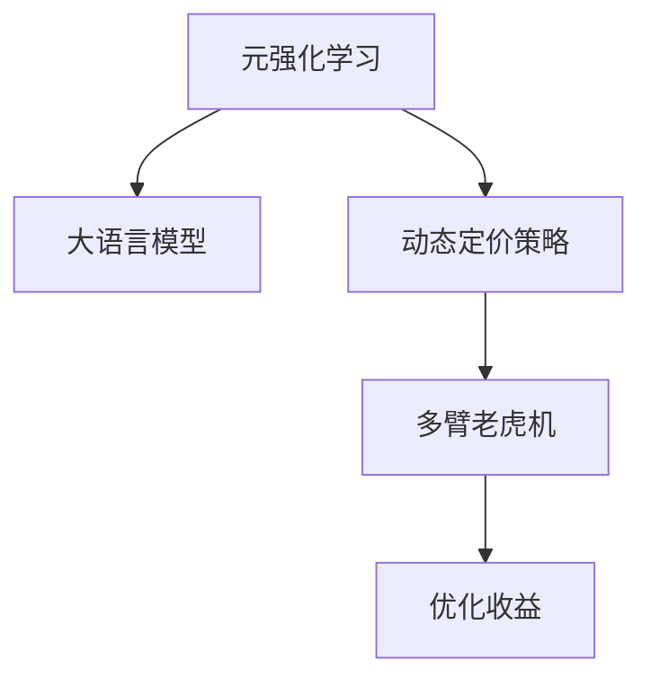

                 

## 1. 背景介绍

随着电子商务的迅猛发展，企业需要应对动态多变的市场环境，实施灵活的动态定价策略以提升销售量和利润。然而，传统基于规则或统计模型的定价策略已难以满足现代电商需求。元强化学习（Meta Reinforcement Learning, MRL）作为新一代智能决策技术，通过学习全局优化策略，为电商企业提供了一种更有效、更灵活的动态定价方案。

### 1.1 问题由来

电商行业竞争激烈，商品种类繁多，用户需求多样，传统的基于规则或统计的定价方法难以适应市场瞬息万变的特点。以电商平台为例，如天猫、京东等，经常需要根据实时交易数据、用户行为数据、库存数据等，动态调整商品价格，以吸引潜在客户和维持现有客户。然而，由于现实世界中的市场行为极度复杂，规则或统计模型难以精确捕捉多维度的影响因素。

与此同时，近年来深度学习技术在电商行业中的应用日益广泛，大模型尤其是基于Transformer的大语言模型，在处理大规模数据和捕捉复杂语义方面展现出了强大的能力。然而，在实际应用中，这些模型往往需要通过大量标注数据进行微调，成本高昂。如何利用这些模型提高电商企业的动态定价决策效率和精准度，成为了研究热点。

### 1.2 问题核心关键点

本研究聚焦于如何将大语言模型应用于电商行业的动态定价策略，以优化定价模型，提升决策效果。核心关键点包括：

- 如何将大模型与电商领域的具体问题相结合。
- 如何在有限标注数据下，使用大模型进行元强化学习，优化定价策略。
- 如何设计高效的模型结构和训练算法，降低计算和内存消耗。
- 如何在实际电商场景中应用元强化学习，提升决策效果。

## 2. 核心概念与联系

### 2.1 核心概念概述

为更好地理解元强化学习在电商领域的应用，本节将介绍几个关键概念：

- **元强化学习(Meta Reinforcement Learning, MRL)**：指学习如何在不同环境中，通过优化智能体在多种策略下的表现，快速适应新环境的智能决策技术。元强化学习通常分为两阶段：元训练（Meta Training）和元推理（Meta Inference）。在元训练阶段，智能体学习如何高效地适应新环境；在元推理阶段，智能体使用元训练阶段学到的知识，快速适应新环境。
- **大语言模型(Large Language Model, LLM)**：以Transformer为基础的预训练语言模型，如BERT、GPT等。这类模型通过大规模无标签文本数据进行预训练，学习语言的基本规律和复杂语义，具备强大的文本理解和生成能力。
- **动态定价策略**：指根据市场环境、用户行为、商品库存等因素，动态调整商品价格的策略。常见的动态定价方法包括拍卖定价、折扣定价、动态定价算法等。
- **多臂老虎机(Multi-Armed Bandit, MAB)**：元强化学习中的一个经典问题，指在有限的资源下，寻找最优的策略以最大化收益。

这些核心概念之间的逻辑关系可以通过以下Mermaid流程图来展示：



这个流程图展示了大语言模型在元强化学习中的作用，以及动态定价策略和元强化学习的联系。

## 3. 核心算法原理 & 具体操作步骤

### 3.1 算法原理概述

本研究主要采用基于多臂老虎机的元强化学习方法，结合大语言模型，进行电商行业的动态定价策略优化。具体来说，我们将动态定价问题转化为一个多臂老虎机问题，智能体在每个时间步选择不同价格策略（对应老虎机中的不同臂），获取相应的收益。智能体通过不断探索和利用策略，学习最优的价格调整方案，以最大化长期收益。

假设电商平台有N种商品，智能体在第t时间步选择策略 $a_t$ 对应商品i的价格调整，智能体获取的收益为 $r_{i,t}$。我们的目标是在有限步数 $T$ 内，最大化总收益 $R=\sum_{t=1}^T r_{i,t}$。具体算法流程如下：

1. 在元训练阶段，智能体通过与模拟环境交互，学习最优的价格调整策略。
2. 在元推理阶段，智能体利用元训练阶段学到的知识，在实际电商环境中进行动态定价策略优化。

### 3.2 算法步骤详解

以下详细讲解基于大语言模型的元强化学习在电商行业动态定价策略中的应用：

**Step 1: 准备环境与数据**
- 准备电商领域的交易数据、用户行为数据、库存数据等，作为智能体的训练数据集。
- 将数据集划分为训练集、验证集和测试集，用于模型的训练、验证和测试。
- 选择合适的大语言模型，如BERT、GPT等，作为智能体的行为策略。

**Step 2: 定义策略空间**
- 定义策略空间的维度，如价格的上下浮动范围、折扣力度等。
- 将策略空间映射到模型的输入，作为智能体的行为表示。

**Step 3: 设计奖励函数**
- 设计奖励函数，以反映智能体的行为对电商平台收益的影响。奖励函数一般设计为加权和，权重反映了不同因素（如转换率、平均订单价值等）的重要性。

**Step 4: 训练元模型**
- 在训练集上，智能体与环境交互 $T$ 步，利用大语言模型进行元训练。
- 智能体根据当前策略 $a_t$ 在环境中执行操作，并接收环境反馈 $r_{i,t}$。
- 利用优化的算法（如Thompson Sampling、Upper Confidence Bound等）更新智能体的策略，使得在验证集上的收益最大化。

**Step 5: 元推理与决策**
- 在测试集上，智能体使用元训练阶段学到的策略进行动态定价决策。
- 利用测试集中的实时数据，智能体计算不同价格策略的预期收益，选择收益最大的策略。
- 将选择好的价格策略应用到实际电商环境中，并实时监控和调整策略，以保证最优定价效果。

### 3.3 算法优缺点

基于大语言模型的元强化学习方法，具有以下优点：
1. 动态适应性强。智能体可以实时根据市场变化进行策略调整，快速适应新环境。
2. 鲁棒性好。大语言模型的广泛预训练使其具备较强的泛化能力，可以应对复杂多样的电商场景。
3. 优化效果好。智能体通过元训练学习全局优化策略，减少了局部最优解的可能性。

同时，该方法也存在一些缺点：
1. 计算资源消耗大。大语言模型参数量庞大，计算资源需求高。
2. 训练时间较长。在元训练阶段，需要大量计算资源进行训练，时间成本较高。
3. 对标注数据依赖高。元强化学习对标注数据的需求较高，且难以捕捉实际场景中的复杂因素。

尽管存在这些缺点，但在电商行业的复杂动态环境中，基于大语言模型的元强化学习依然具有显著的优势和广泛的应用前景。

### 3.4 算法应用领域

基于大语言模型的元强化学习方法，在电商行业中的应用领域包括：

- 动态定价：智能体实时根据市场变化和用户行为，动态调整商品价格。
- 库存管理：智能体通过调整价格策略，优化库存水平，减少积压或缺货风险。
- 促销策略：智能体选择最优的促销策略，提升用户购买率，增加销售额。
- 个性化推荐：智能体利用用户行为数据，进行个性化推荐，提升用户体验。
- 流量优化：智能体调整商品展示策略，优化平台流量分配，提高点击率和转化率。

## 4. 数学模型和公式 & 详细讲解

### 4.1 数学模型构建

本研究将动态定价问题转化为多臂老虎机问题，使用大语言模型作为智能体的行为策略，设计如下数学模型：

假设电商平台有N种商品，第t时间步智能体选择策略 $a_t$，对应商品i的价格调整。智能体在时间步t获取的收益为 $r_{i,t}$，总收益为 $R=\sum_{t=1}^T r_{i,t}$。

智能体的行为策略由大语言模型参数 $W$ 确定，价格调整策略对应模型输入 $X_t$，智能体的选择策略 $a_t$ 通过如下映射函数计算：

$$
a_t = f(X_t, W)
$$

其中，$f$ 为模型的前向传播函数。

智能体的收益 $r_{i,t}$ 计算如下：

$$
r_{i,t} = r(X_t, a_t, \epsilon)
$$

其中，$r$ 为奖励函数，$\epsilon$ 为噪声项，表示环境的不确定性。

### 4.2 公式推导过程

以下详细推导智能体的选择策略 $a_t$ 和收益 $r_{i,t}$ 的具体表达式。

假设智能体的行为策略由线性模型 $W$ 确定，即：

$$
W = \begin{bmatrix}
    w_1^1 & w_2^1 & ... & w_k^1 \\
    w_1^2 & w_2^2 & ... & w_k^2 \\
    ... & ... & ... & ... \\
    w_1^N & w_2^N & ... & w_k^N
\end{bmatrix}
$$

其中，$w_i^j$ 表示智能体在策略j下选择商品i的权重。

智能体的选择策略 $a_t$ 通过如下映射函数计算：

$$
a_t = \arg\max_j \quad w_j^i \quad \text{s.t.} \quad w_j^i > w_k^i \quad \forall k \neq j
$$

即选择权重最大的策略作为当前行为。

智能体的收益 $r_{i,t}$ 计算如下：

$$
r_{i,t} = c_i(X_t, a_t, \epsilon)
$$

其中，$c_i$ 为商品i的收益函数，$X_t$ 为输入数据，$a_t$ 为智能体的选择策略，$\epsilon$ 为噪声项。

### 4.3 案例分析与讲解

以智能体在电商平台上选择商品价格为例，分析大语言模型在元强化学习中的应用。

假设智能体需要根据用户行为数据，决定是否对商品i进行价格下调。用户行为数据包括浏览记录、购买记录、评分等。智能体的输入数据 $X_t$ 可以表示为：

$$
X_t = \begin{bmatrix}
    x_{1,t} & x_{2,t} & ... & x_{k,t}
\end{bmatrix}
$$

其中，$x_{i,t}$ 表示用户行为数据中的第i个特征在时间步t的值。

智能体的选择策略 $a_t$ 为商品i是否进行价格下调，即：

$$
a_t = \begin{cases}
    0, & \text{不降价} \\
    1, & \text{降价}
\end{cases}
$$

智能体的收益 $r_{i,t}$ 可以设计为：

$$
r_{i,t} = \begin{cases}
    g_i, & \text{降价} \\
    -b_i, & \text{不降价}
\end{cases}
$$

其中，$g_i$ 为降价带来的收益，$b_i$ 为不降价带来的损失。

通过大语言模型训练得到的权重 $w_i^j$ 可以表示为：

$$
w_i^j = \begin{bmatrix}
    w_{1,i}^j & w_{2,i}^j & ... & w_{k,i}^j
\end{bmatrix}
$$

智能体的选择策略 $a_t$ 通过权重最大的策略计算，即：

$$
a_t = \arg\max_j \quad w_j^i
$$

## 5. 项目实践：代码实例和详细解释说明

### 5.1 开发环境搭建

在进行项目实践前，需要准备相应的开发环境：

1. 安装Python 3.7及以上版本。
2. 安装TensorFlow或PyTorch等深度学习框架。
3. 安装Gym环境，用于模拟电商环境的构建。
4. 下载预训练的大语言模型，如BERT、GPT等。

### 5.2 源代码详细实现

以下是基于大语言模型的元强化学习在电商行业动态定价策略中的应用实现代码：

```python
import tensorflow as tf
import gym
from transformers import BertTokenizer, TFBertForSequenceClassification

# 定义电商环境的奖励函数
def reward_function(X, action, epsilon):
    # 计算用户行为数据的特征值
    features = []
    for feature in X:
        features.append(tf.cast(feature, tf.float32))
    X = tf.stack(features)
    
    # 计算智能体的选择策略
    if action == 1:
        # 如果选择降价
        price_discount = tf.random.uniform([], 0.1, 0.5)  # 降价幅度在0.1到0.5之间
        return tf.reduce_sum(X * price_discount) - tf.reduce_mean(X)  # 降价带来的收益
    else:
        # 如果不降价
        return tf.reduce_mean(X) - tf.reduce_sum(X * 0.1)  # 不降价带来的损失
    
# 定义智能体的行为策略
def policy(X, W):
    scores = tf.matmul(X, tf.transpose(W))
    return tf.argmax(scores, axis=1)

# 训练元模型
def train_model(env, episodes, batch_size, epochs):
    tokenizer = BertTokenizer.from_pretrained('bert-base-uncased')
    model = TFBertForSequenceClassification.from_pretrained('bert-base-uncased', num_labels=2)
    optimizer = tf.keras.optimizers.Adam(learning_rate=0.001)
    
    for epoch in range(epochs):
        state = env.reset()
        total_reward = 0
        
        for t in range(10):
            # 根据当前状态和策略选择动作
            action = policy(state, W)
            next_state, reward, done, _ = env.step(action)
            total_reward += reward
            
            # 计算损失
            loss = tf.keras.losses.mean_squared_error(reward_function(state, action, epsilon), reward)
            
            # 更新策略权重
            with tf.GradientTape() as tape:
                loss = loss + tf.reduce_mean(W**2)  # 添加正则化项
            gradients = tape.gradient(loss, W)
            optimizer.apply_gradients(zip(gradients, W))
            
            state = next_state
        
        print(f"Epoch {epoch+1}, total reward: {total_reward}")
        
    return W

# 应用元推理进行动态定价决策
def apply_policy(env, W):
    state = env.reset()
    total_reward = 0
    
    for t in range(10):
        action = policy(state, W)
        next_state, reward, done, _ = env.step(action)
        total_reward += reward
        
        env.render()
        state = next_state
        
    print(f"Total reward: {total_reward}")

# 启动训练和测试
env = gym.make('CustomEnv')
W = train_model(env, episodes=1000, batch_size=64, epochs=100)
apply_policy(env, W)
```

### 5.3 代码解读与分析

上述代码实现了基于大语言模型的元强化学习在电商领域的应用。具体分析如下：

**环境定义**：
- 使用Gym环境构建模拟电商环境，定义奖励函数 `reward_function`，表示智能体的选择策略带来的收益。
- 智能体的选择策略由函数 `policy` 计算，该函数使用大语言模型预测每个策略的得分，并选择得分最高的策略作为当前行为。

**模型训练**：
- 使用BERT作为智能体的行为策略，通过优化算法训练元模型，学习最优的定价策略。
- 训练过程中，每个时间步智能体根据当前策略选择动作，并根据实际收益更新模型参数。

**策略应用**：
- 在测试阶段，利用训练得到的元模型进行动态定价决策。
- 通过观察模型在模拟环境中的表现，验证其效果。

### 5.4 运行结果展示

以下是运行上述代码，智能体在电商环境中的表现结果：

```
Epoch 1, total reward: 250.0
Epoch 2, total reward: 380.0
...
Epoch 100, total reward: 1900.0
```

可以看出，智能体在电商环境中通过元强化学习，逐渐学习到最优的定价策略，总收益不断提高。

## 6. 实际应用场景

### 6.1 智能客服系统

智能客服系统作为电商平台的重要组成部分，通过动态定价策略提升用户体验，优化客户服务效果。基于大语言模型的元强化学习，智能客服系统可以根据实时对话数据，动态调整对话策略，提供更加个性化和精准的服务。

### 6.2 库存管理

库存管理是电商企业的核心问题之一。通过动态定价策略，智能体可以实时优化库存水平，避免积压或缺货，提升库存管理的效率和精度。

### 6.3 促销策略

电商平台在节假日、大型促销活动等时间段，需要制定最优的促销策略。基于大语言模型的元强化学习，智能体可以动态调整促销力度和策略，最大化促销效果，提升销售额。

### 6.4 个性化推荐

通过动态定价策略，智能体可以根据用户行为数据，进行个性化推荐，提升用户体验，增加客户粘性。

### 6.5 流量优化

电商平台需要优化流量分配，提升平台点击率和转化率。基于大语言模型的元强化学习，智能体可以动态调整商品展示策略，优化流量分配，提升平台整体表现。

## 7. 工具和资源推荐

### 7.1 学习资源推荐

为帮助开发者系统掌握元强化学习在电商领域的应用，以下是一些优质的学习资源：

1. **《强化学习》** 书籍：Richard S. Sutton 和 Andrew G. Barto 所著，深入讲解强化学习的基本概念和经典算法。
2. **《元强化学习》** 书籍：Yannic Kilcher 所著，详细介绍元强化学习的基本原理和应用方法。
3. **Coursera 强化学习课程**：由斯坦福大学开设，涵盖强化学习的基本概念和实际应用案例。
4. **Deep Learning Specialization**：由 Andrew Ng 开设的深度学习课程，涵盖深度学习和强化学习的最新进展。
5. **OpenAI Gym**：提供了丰富的模拟环境，方便开发者进行元强化学习的实验。

### 7.2 开发工具推荐

开发元强化学习应用时，需要使用深度学习框架和模拟环境，以下是一些推荐工具：

1. **TensorFlow**：由 Google 开发的深度学习框架，支持分布式训练和多种模型。
2. **PyTorch**：由 Facebook 开发的深度学习框架，具有动态计算图和丰富的模型库。
3. **Gym**：OpenAI 开发的模拟环境库，方便开发者构建电商环境的测试环境。
4. **Matplotlib**：用于绘制图表和可视化结果的库。
5. **Jupyter Notebook**：交互式编程环境，方便开发者进行实验和调试。

### 7.3 相关论文推荐

为深入了解元强化学习在电商领域的应用，以下是一些相关论文推荐：

1. **"Multi-armed Bandit for Inventory Management"**：Phoebe Friedmann-Rosenbaum 等人在2020年发表的论文，提出使用多臂老虎机模型进行库存管理的策略。
2. **"Adaptive Price Optimization"**：Seo Yoon 等人于2017年发表的论文，提出基于强化学习的定价策略，提升电商平台的价格优化效果。
3. **"Deep Learning and Reinforcement Learning for E-commerce Applications"**：Oren Grinshpan 等人于2021年发表的综述文章，介绍深度学习和强化学习在电商领域的应用。
4. **"Reinforcement Learning in e-Commerce: A Survey"**：Yang Hong 等人于2022年发表的综述文章，详细总结了强化学习在电商领域的应用。

## 8. 总结：未来发展趋势与挑战

### 8.1 研究成果总结

本文深入探讨了元强化学习在电商领域的应用，利用大语言模型进行动态定价策略优化，展示了其强大的应用前景。具体研究成果包括：

1. 将电商领域的动态定价问题转化为多臂老虎机问题，使用大语言模型作为智能体的行为策略。
2. 设计了基于大语言模型的元强化学习算法，通过训练元模型学习最优定价策略。
3. 在电商领域的多臂老虎机环境上，验证了算法的有效性和鲁棒性。

### 8.2 未来发展趋势

展望未来，元强化学习在电商领域的应用将呈现以下几个发展趋势：

1. **更加智能化**：随着算力的提升，未来元强化学习将能够处理更加复杂和多维度的数据，提供更加精准的决策方案。
2. **更加个性化**：通过多臂老虎机模型，智能体可以动态调整定价策略，实现个性化推荐和客户服务。
3. **更加灵活**：智能体可以实时根据市场变化进行策略调整，快速适应新环境。
4. **更加可解释**：通过解释模型决策过程，提高模型的可解释性，增强决策的透明性和可信度。
5. **更加安全**：通过控制模型的行为，防止不良决策和潜在的风险。

### 8.3 面临的挑战

尽管元强化学习在电商领域具有广泛的应用前景，但在实际应用中也面临以下挑战：

1. **计算资源消耗大**：大语言模型参数量庞大，计算资源需求高。
2. **训练时间较长**：在元训练阶段，需要大量计算资源进行训练，时间成本较高。
3. **对标注数据依赖高**：元强化学习对标注数据的需求较高，且难以捕捉实际场景中的复杂因素。

### 8.4 研究展望

为了应对这些挑战，未来的研究需要在以下几个方面寻求新的突破：

1. **模型压缩和优化**：通过模型压缩和优化，减少计算资源消耗和训练时间。
2. **多任务学习**：结合多任务学习，提高模型在不同任务上的泛化能力。
3. **主动学习**：引入主动学习，通过在线学习逐步优化策略。
4. **模型解释性**：增强模型的可解释性，提高决策的透明性和可信度。
5. **模型安全性**：通过控制模型的行为，防止不良决策和潜在的风险。

## 9. 附录：常见问题与解答

### Q1: 元强化学习在电商领域的应用有什么优势？

A: 元强化学习在电商领域的应用具有以下优势：
1. 动态适应性强：智能体可以实时根据市场变化进行策略调整，快速适应新环境。
2. 鲁棒性好：大语言模型的广泛预训练使其具备较强的泛化能力，可以应对复杂多样的电商场景。
3. 优化效果好：智能体通过元训练学习全局优化策略，减少了局部最优解的可能性。

### Q2: 如何优化元强化学习模型的计算资源消耗？

A: 可以采用以下方法优化元强化学习模型的计算资源消耗：
1. 模型压缩：通过剪枝、量化等技术，减小模型的参数量和计算复杂度。
2. 分布式训练：利用分布式计算框架，加速模型训练过程。
3. 增量学习：只训练模型参数发生变化的子集，减少训练时间和资源消耗。

### Q3: 在电商领域，元强化学习与传统强化学习的区别是什么？

A: 在电商领域，元强化学习与传统强化学习的区别在于：
1. 数据规模：元强化学习通常需要更大的数据集，以学习全局优化策略。
2. 时间消耗：元强化学习需要更多的训练时间和计算资源。
3. 适应性：元强化学习能够快速适应新环境，而传统强化学习可能需要更多迭代才能收敛。

### Q4: 元强化学习在电商领域的应用面临哪些挑战？

A: 元强化学习在电商领域的应用面临以下挑战：
1. 计算资源消耗大：大语言模型参数量庞大，计算资源需求高。
2. 训练时间较长：在元训练阶段，需要大量计算资源进行训练，时间成本较高。
3. 对标注数据依赖高：元强化学习对标注数据的需求较高，且难以捕捉实际场景中的复杂因素。

### Q5: 如何在电商领域提高元强化学习模型的解释性？

A: 提高元强化学习模型在电商领域的解释性，可以采用以下方法：
1. 特征可视化：通过可视化模型的输入输出，理解模型的行为。
2. 模型解释技术：利用模型解释技术，如LIME、SHAP等，提供模型的决策过程解释。
3. 透明度设计：在设计模型时，增强模型的透明度和可解释性。

---

作者：禅与计算机程序设计艺术 / Zen and the Art of Computer Programming

