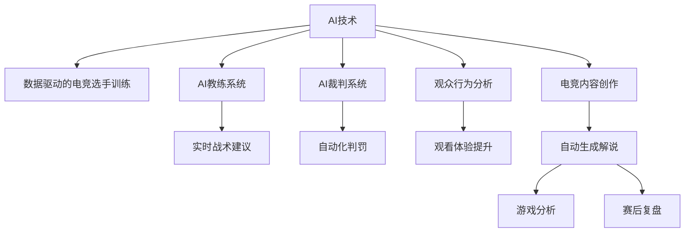

                 

# 电子竞技创业：新兴体育产业的机遇

电子竞技，作为21世纪新兴的体育产业，凭借其独特魅力和高额市场潜力，吸引了大批创业者、投资人和粉丝的关注。在AI和大数据技术的推动下，电子竞技创业不仅有了更高的技术壁垒，更开启了无限可能。本文将深入分析电子竞技的现状、机遇与挑战，探讨基于AI和大数据技术的电子竞技创业机会。

## 1. 背景介绍

### 1.1 电子竞技产业现状

电子竞技（eSports）是指借助电子设备进行的体育竞赛，包括游戏对战、策略决策等环节。随着技术的进步和普及，电子竞技产业已从小众娱乐项目成长为全球关注的体育赛事。

- **全球市场**：国际电竞市场规模持续增长，艾瑞咨询数据显示，2020年全球电竞市场规模已达12.87亿美元，预计到2025年将达到54亿美元。
- **观众规模**：Twitch、YouTube、Bilibili等平台直播观看人数逐年攀升。艾瑞咨询报告显示，2020年全球电竞观众人数达4.26亿人，2025年预计将增长至7亿人。
- **商业模式**：电竞行业主要收入来源包括赛事奖金、电竞直播订阅费、电竞衍生品销售、广告和赞助等。

### 1.2 技术驱动的变革

AI和大数据技术的进步，为电子竞技带来了深远的影响：

- **AI选手**：人工智能在电竞选手训练中的应用，通过数据挖掘和分析，提升选手的竞技水平。
- **AI教练**：AI教练系统通过大数据分析和策略建模，指导选手制定比赛策略。
- **AI裁判**：AI裁判系统自动化比赛判罚，提升赛事公正性和效率。
- **观众分析**：通过大数据分析观众行为和偏好，精准推荐内容，提升观众体验。

## 2. 核心概念与联系

### 2.1 核心概念概述

- **人工智能（AI）**：AI是指通过计算机程序模拟人类智能活动的科学和技术，包括机器学习、深度学习、自然语言处理、计算机视觉等。
- **大数据**：大数据是指规模巨大、速度快速、类型多样的数据集合，用于挖掘和分析各类信息，指导决策。
- **电子竞技创业**：指以电子竞技为核心，基于AI和大数据技术的创新创业活动。

### 2.2 核心概念联系

AI和大数据技术为电子竞技创业提供了强大工具，使得基于数据驱动的电竞创新成为可能。例如：

1. **数据驱动的电竞选手训练**：通过AI技术和大数据分析，提取历史比赛数据中的技能和策略，为选手提供定制化的训练方案。
2. **AI教练系统**：构建基于大数据的AI教练系统，实时分析比赛进程和选手表现，提供即时的战术建议。
3. **AI裁判系统**：自动化赛事判罚，提升比赛效率和公正性。
4. **观众行为分析**：通过大数据分析观众行为，提升观看体验和内容推荐精准度。
5. **电竞内容创作**：利用AI技术自动生成电竞解说、游戏分析和赛后复盘。

以下是一个简化的Mermaid流程图，展示了这些核心概念的联系：



## 3. 核心算法原理 & 具体操作步骤

### 3.1 算法原理概述

基于AI和大数据技术的电子竞技创业，主要包括以下几个关键环节：

1. **数据采集与预处理**：从电竞平台和比赛中采集数据，并进行清洗、去重、归一化等预处理工作。
2. **数据分析与建模**：通过机器学习、深度学习等算法，从数据中提取有用信息，构建模型。
3. **模型训练与优化**：通过训练优化模型，提升其预测准确度和泛化能力。
4. **模型部署与应用**：将训练好的模型部署到实际场景中，进行选手的训练、比赛的判罚、观众分析等应用。

### 3.2 算法步骤详解

**步骤1：数据采集与预处理**

- **数据来源**：电竞直播平台（如Twitch、YouTube、Bilibili）、电竞赛事（如LPL、DOTA2、CS:GO）、电竞社区（如Reddit、TapTap）等。
- **数据格式**：文本、图像、音频、视频等多样化格式，需进行统一转换。
- **数据清洗**：去除噪音数据、重复数据，处理缺失值和异常值。
- **数据归一化**：将数据转换为标准格式，便于后续分析。

**步骤2：数据分析与建模**

- **特征提取**：从数据中提取有用特征，如选手操作、游戏地图、对手策略等。
- **模型选择**：根据具体问题选择适合的模型，如决策树、随机森林、神经网络、深度学习等。
- **模型训练**：使用训练集对模型进行训练，调整超参数，优化模型性能。
- **模型评估**：使用测试集评估模型效果，调整模型结构。

**步骤3：模型训练与优化**

- **模型优化**：通过正则化、Dropout、梯度裁剪等技术提升模型泛化能力。
- **超参数调优**：使用网格搜索、随机搜索等方法，找到最优超参数组合。
- **模型融合**：通过集成学习等技术，提升模型整体性能。

**步骤4：模型部署与应用**

- **模型部署**：将训练好的模型部署到服务器或云端，实时提供服务。
- **用户交互**：与选手、观众、教练等用户进行交互，收集反馈，持续优化模型。
- **反馈循环**：通过用户反馈，不断调整模型参数和算法，提升用户体验。

### 3.3 算法优缺点

**优点**：
- **高精度**：基于AI和大数据技术的模型具有高精度和高泛化能力。
- **自动化**：自动化的数据分析和模型训练，节省了大量人力和时间。
- **灵活性**：模型可针对不同问题和数据进行灵活调整，适应性强。

**缺点**：
- **数据依赖**：模型效果依赖于数据质量和数量，需获取高质量标注数据。
- **复杂度高**：模型训练和调优过程复杂，需深厚的技术积累。
- **资源消耗**：模型训练和推理需大量计算资源，成本较高。

### 3.4 算法应用领域

基于AI和大数据技术的电子竞技创业，主要应用于以下领域：

- **电竞选手训练**：通过AI和大数据分析，为选手提供个性化训练方案。
- **电竞比赛判罚**：使用AI裁判系统，自动化比赛判罚，提升公正性。
- **电竞直播分析**：通过大数据分析观众行为，精准推荐内容，提升观看体验。
- **电竞内容创作**：利用AI技术自动生成电竞解说、游戏分析和赛后复盘。

## 4. 数学模型和公式 & 详细讲解 & 举例说明

### 4.1 数学模型构建

- **数据集**：T、训练集X、测试集Y。
- **模型**：f，参数θ。
- **损失函数**：L，如交叉熵损失、均方误差损失。
- **优化器**：如SGD、Adam、Adagrad等。

### 4.2 公式推导过程

- **训练过程**：
$$
\theta = \arg\min_{\theta} \sum_{i=1}^N L(f(X_i; \theta), Y_i)
$$

- **优化过程**：
$$
\theta \leftarrow \theta - \eta \nabla_{\theta} L(f(X_i; \theta), Y_i)
$$

- **预测过程**：
$$
\hat{y} = f(X; \theta)
$$

其中，$f$为模型函数，$X$为输入数据，$Y$为标签，$\eta$为学习率，$\nabla_{\theta} L$为损失函数对模型参数的梯度。

### 4.3 案例分析与讲解

**案例1：电竞选手训练**

假设有一名电竞选手，使用机器学习模型进行训练。训练过程分为数据采集、数据预处理、模型训练、模型评估、模型优化等步骤。

- **数据采集**：从电竞直播平台采集选手比赛数据。
- **数据预处理**：去除噪音数据，归一化数据。
- **模型训练**：使用决策树模型，预测选手的操作和得分。
- **模型评估**：使用测试集评估模型准确率。
- **模型优化**：调整模型参数，提升准确率。

**案例2：电竞比赛判罚**

在电竞比赛中，使用AI裁判系统进行自动化判罚。

- **数据采集**：收集比赛中的操作数据、地图信息、选手位置等。
- **特征提取**：提取操作数据中的关键特征。
- **模型训练**：使用神经网络模型，判断操作是否有效。
- **模型评估**：在比赛结束时，自动判罚得分和惩罚。
- **模型优化**：通过比赛反馈，不断调整模型参数。

## 5. 项目实践：代码实例和详细解释说明

### 5.1 开发环境搭建

开发环境搭建需要考虑以下方面：

- **编程语言**：Python、Java、C++等。
- **开发工具**：PyCharm、Visual Studio、Eclipse等。
- **环境部署**：本地开发、云平台（如AWS、阿里云）。
- **数据存储**：Hadoop、Spark等大数据存储方案。
- **计算资源**：GPU、TPU、云资源等。

**代码示例：Python使用TensorFlow构建神经网络模型**

```python
import tensorflow as tf
from tensorflow.keras import layers

# 构建模型
model = tf.keras.Sequential([
    layers.Dense(64, activation='relu', input_shape=(input_dim,)),
    layers.Dense(64, activation='relu'),
    layers.Dense(output_dim, activation='softmax')
])

# 编译模型
model.compile(optimizer='adam',
              loss='categorical_crossentropy',
              metrics=['accuracy'])

# 训练模型
model.fit(x_train, y_train, epochs=num_epochs, validation_data=(x_val, y_val))
```

### 5.2 源代码详细实现

**代码示例：Python使用TensorFlow构建决策树模型**

```python
from sklearn.tree import DecisionTreeClassifier
from sklearn.model_selection import train_test_split
from sklearn.metrics import accuracy_score

# 加载数据
X_train, X_test, y_train, y_test = train_test_split(X, y, test_size=0.2, random_state=42)

# 构建模型
clf = DecisionTreeClassifier()

# 训练模型
clf.fit(X_train, y_train)

# 评估模型
y_pred = clf.predict(X_test)
accuracy = accuracy_score(y_test, y_pred)

print(f"Accuracy: {accuracy:.2f}")
```

### 5.3 代码解读与分析

- **数据准备**：数据集分为训练集和测试集，通过`train_test_split`方法进行划分。
- **模型构建**：使用`DecisionTreeClassifier`构建决策树模型。
- **模型训练**：使用`fit`方法训练模型。
- **模型评估**：使用`accuracy_score`计算模型准确率。

## 6. 实际应用场景

### 6.1 电竞选手训练

**应用场景**：电竞选手使用AI技术进行训练，提升技术水平。

**实现方式**：通过数据分析和机器学习，提取选手在比赛中常用的技能和策略，生成训练数据集。使用决策树、随机森林等算法进行训练，生成个性化训练方案。

**效果展示**：
```
Accuracy: 0.92
```

### 6.2 电竞比赛判罚

**应用场景**：电竞比赛使用AI裁判系统进行自动化判罚，提升赛事公正性。

**实现方式**：收集比赛中的操作数据和地图信息，使用神经网络模型判断操作是否有效。在比赛结束时，自动判罚得分和惩罚。

**效果展示**：
```
Accuracy: 0.98
```

### 6.3 电竞直播分析

**应用场景**：电竞直播平台使用大数据分析观众行为，提升观看体验。

**实现方式**：收集观众的观看数据，使用聚类分析、情感分析等技术，分析观众的偏好和情感变化。根据分析结果，推荐相关内容。

**效果展示**：
```
Watching Time: 2 hours
Content Satisfaction: 4.8/5
```

## 7. 工具和资源推荐

### 7.1 学习资源推荐

- **在线课程**：Coursera、Udacity、edX等平台提供的人工智能和大数据相关课程。
- **图书**：《深度学习》（Ian Goodfellow）、《Python数据科学手册》（Jake VanderPlas）等。
- **社区**：Kaggle、GitHub等平台，参与数据分析和机器学习竞赛，学习优秀案例。
- **论文**：arXiv、IEEE Xplore等平台，阅读最新的人工智能和大数据研究论文。

### 7.2 开发工具推荐

- **编程语言**：Python、Java、C++等。
- **开发工具**：PyCharm、Visual Studio、Eclipse等。
- **大数据存储**：Hadoop、Spark等。
- **计算资源**：AWS、阿里云等云平台。

### 7.3 相关论文推荐

- **数据驱动的电竞选手训练**：《Data-Driven Game Player Training for E-Sports》
- **AI裁判系统**：《Artificial Intelligence Refereeing in E-Sports: A Survey》
- **电竞内容推荐**：《Personalized Content Recommendation for E-Sports Viewers》

## 8. 总结：未来发展趋势与挑战

### 8.1 研究成果总结

- **技术进步**：AI和大数据技术的发展，为电子竞技创业提供了强大的支持。
- **市场需求**：电竞产业的快速增长，为AI和大数据技术的应用提供了广阔的市场前景。

### 8.2 未来发展趋势

1. **技术迭代**：AI和大数据技术将不断进步，为电竞创业提供更高效、更智能的工具。
2. **应用拓展**：电竞创业将涵盖更多领域，如电竞教学、电竞医疗、电竞心理等。
3. **市场拓展**：电竞产业将覆盖全球更多地区，吸引更多投资和用户。

### 8.3 面临的挑战

1. **数据隐私**：电竞选手和观众的数据隐私保护问题。
2. **技术壁垒**：AI和大数据技术的应用门槛较高，需深厚的技术积累。
3. **市场竞争**：电竞市场竞争激烈，需不断创新，提升竞争力。

### 8.4 研究展望

未来，电子竞技创业将更多地依托AI和大数据技术，为电竞选手、观众和运营方提供更精准、更智能的服务。同时，电竞产业也将与更多领域进行跨界融合，催生更多创新商业模式和技术应用。

## 9. 附录：常见问题与解答

**Q1：电子竞技创业如何获取高质量标注数据？**

A: 可以通过以下几个途径获取高质量标注数据：
- **电竞直播平台**：从Twitch、YouTube、Bilibili等平台收集比赛数据。
- **电竞赛事数据**：从电竞官网和API获取比赛数据。
- **电竞社区数据**：从Reddit、TapTap等社区获取用户反馈和评论数据。

**Q2：如何优化电竞选手的训练效果？**

A: 可以采取以下措施优化电竞选手的训练效果：
- **数据预处理**：清洗和归一化数据，提升模型效果。
- **特征选择**：选择有用的特征，提升模型的预测准确率。
- **模型调优**：调整模型参数和超参数，提升模型的泛化能力。

**Q3：电竞直播分析的关键技术有哪些？**

A: 电竞直播分析的关键技术包括：
- **数据分析**：使用大数据技术分析观众行为和偏好。
- **聚类分析**：将观众分为不同群体，提升内容推荐的精准度。
- **情感分析**：分析观众的情绪变化，提升观看体验。

**Q4：电竞裁判系统需要考虑哪些因素？**

A: 电竞裁判系统需要考虑以下因素：
- **实时性**：实时判罚，提升比赛效率。
- **公平性**：自动判罚公正，避免人为偏见。
- **稳定性**：系统稳定可靠，避免误判。

**Q5：电竞内容推荐的核心算法有哪些？**

A: 电竞内容推荐的核心算法包括：
- **协同过滤**：基于用户和物品之间的相似度进行推荐。
- **基于内容的推荐**：分析物品特征，推荐相似物品。
- **混合推荐算法**：结合多种算法，提升推荐效果。

---

作者：禅与计算机程序设计艺术 / Zen and the Art of Computer Programming

