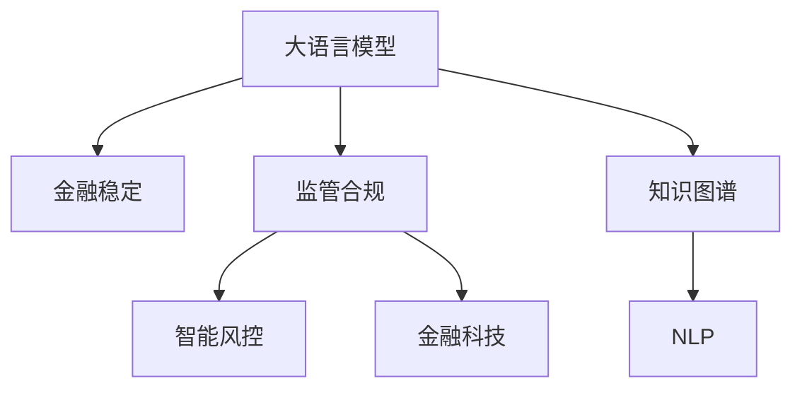

                 

# 监管合规：LLM 确保金融稳定

> 关键词：大语言模型, 金融稳定, 监管合规, 智能风控, 金融科技

## 1. 背景介绍

### 1.1 问题由来
随着金融科技的飞速发展，各大金融机构纷纷引入人工智能和大数据技术，以提高运营效率和服务水平。然而，随之而来的问题也不容忽视：模型的不透明性、黑箱特性和算法偏见可能导致严重的合规风险和监管挑战。特别是涉及大规模资金交易、信用评估等核心业务，金融行业的监管合规问题显得尤为关键。

针对这一挑战，大语言模型（Large Language Model, LLM）以其强大的自然语言处理能力，在金融监管合规领域展现出巨大潜力。通过对监管文件、合同协议等文本数据进行智能分析，LLM 能够帮助金融机构识别风险点、生成合规报告、优化内部流程，从而确保金融业务的合法合规，维护金融稳定。

### 1.2 问题核心关键点
LLM在金融监管合规中的应用，主要包括以下几个方面：

1. **监管文本分析**：利用LLM对监管文件、法律条文等进行自然语言理解，提取关键信息，生成精简报告。
2. **风险预警系统**：通过监控新闻、社交媒体等外部信息，利用LLM识别潜在的风险因素和市场波动，提供预警提示。
3. **合规文档生成**：在金融业务操作过程中，利用LLM自动生成合规文档，如合同协议、风险评估报告等。
4. **智能客服与咨询**：通过LLM构建智能客服系统，解答客户合规咨询，提高服务效率和准确性。
5. **审计与反洗钱监控**：利用LLM分析交易记录，识别异常行为，加强反洗钱和审计监控。

## 2. 核心概念与联系

### 2.1 核心概念概述

为更好地理解LLM在金融监管合规中的应用，本节将介绍几个密切相关的核心概念：

- **大语言模型(LLM)**：基于Transformer架构的预训练语言模型，能够理解复杂的自然语言，应用于各类NLP任务。
- **金融稳定(Financial Stability)**：指金融系统能够抵抗各种冲击（如市场波动、信用危机等），维持平稳运行的状态。
- **监管合规(Regulatory Compliance)**：金融机构必须遵守的法律法规和监管要求，确保业务操作的合法合规。
- **智能风控(Intelligent Risk Control)**：利用AI技术，特别是大语言模型，提高风险识别和控制能力。
- **金融科技(Fintech)**：融合金融与科技，运用大数据、AI等技术提升金融服务效率和创新性。
- **知识图谱(Knowledge Graph)**：将各类知识点及其关系组织成结构化的图，便于LLM进行知识推理。
- **NLP(自然语言处理)**：使计算机理解、处理、生成自然语言的技术，是LLM的底层技术之一。

这些核心概念之间的逻辑关系可以通过以下Mermaid流程图来展示：



这个流程图展示了大语言模型在金融监管合规中的应用及其与其他核心概念的联系：

1. 大语言模型通过自然语言处理技术，理解金融监管文本，提取关键信息。
2. 在金融稳定方面，LLM可以帮助识别和防范风险，确保金融系统的稳定性。
3. 监管合规方面，LLM可用于生成合规文档，确保业务操作的合法性。
4. 在智能风控中，LLM可分析交易记录，识别异常行为，提高风险识别能力。
5. 金融科技领域，LLM可提升客户服务效率，加强系统审计监控。
6. 知识图谱为LLM提供了更丰富的背景知识，有助于准确推理。
7. NLP技术是LLM的底层支持，使大模型能够进行自然语言理解和生成。

## 3. 核心算法原理 & 具体操作步骤
### 3.1 算法原理概述

LLM在金融监管合规中的应用，本质上是一个文本分析和信息提取的过程。其核心思想是：将预训练的LLM作为文本处理工具，通过理解金融监管文本，提取其中的关键信息，辅助金融机构的合规工作。

具体而言，LLM通过以下步骤实现：

1. **文本预处理**：对监管文件、合同协议等文本数据进行清洗、分词、标注等预处理。
2. **模型输入**：将预处理后的文本输入LLM，让其进行语义理解和信息提取。
3. **结果输出**：LLM输出提取的关键信息，供金融机构的合规部门进行分析和使用。

### 3.2 算法步骤详解

下面以“金融监管文本分析”为例，详细讲解LLM的具体操作步骤：

**Step 1: 文本预处理**
- 收集金融监管文件、合同协议等文本数据。
- 对文本进行清洗，去除噪声和特殊字符。
- 分词处理，将文本转换为LLM可处理的格式。
- 标注关键词和实体，以便模型理解。

**Step 2: 模型输入**
- 将预处理后的文本输入LLM，让其进行语义理解。
- 设定LLM的输入和输出格式，如BertTokenizer等。
- 选择合适的模型和配置，如BERT、RoBERTa等。

**Step 3: 结果输出**
- 获取LLM的输出结果，提取其中的关键信息。
- 利用NLP技术对输出结果进行进一步处理，如实体识别、关系抽取等。
- 将提取的关键信息整理成结构化数据，供合规部门使用。

**Step 4: 应用部署**
- 将处理后的数据和模型部署到实际系统中，如反洗钱监控系统、风险预警平台等。
- 根据系统需求，设定LLM的触发条件和响应机制。
- 定期更新模型和数据，保持系统的高效运行。

### 3.3 算法优缺点

LLM在金融监管合规中的应用，具有以下优点：

1. **高效性**：LLM能够快速处理大规模文本数据，提高合规工作的工作效率。
2. **准确性**：LLM对自然语言的理解能力，使其能够准确提取关键信息，减少人工错误。
3. **可扩展性**：LLM的预训练权重可复用，只需添加特定领域的文本数据进行微调即可。
4. **智能化**：LLM可进行智能分析和推理，辅助金融合规决策。

同时，LLM也存在以下局限性：

1. **依赖数据质量**：LLM的效果很大程度上取决于输入文本的质量，文本噪声和歧义可能导致误提取。
2. **解释性不足**：LLM的决策过程不够透明，难以解释其内部逻辑。
3. **模型偏见**：LLM可能继承训练数据的偏见，对少数群体或特殊情况处理不当。
4. **计算资源消耗大**：LLM需要强大的计算资源支持，对系统硬件要求较高。

### 3.4 算法应用领域

LLM在金融监管合规中的应用，已经广泛应用于多个领域，如：

- **合规文档生成**：自动化生成金融合同、合规报告等文档，提高工作效率。
- **风险预警系统**：监控金融新闻、社交媒体等外部信息，识别潜在的市场风险。
- **智能客服与咨询**：通过智能客服系统，解答客户合规咨询，提升服务质量。
- **反洗钱监控**：分析交易记录，识别异常行为，加强反洗钱监控。
- **审计与合规检查**：利用LLM分析审计记录，生成审计报告，确保合规操作。
- **合同审查与批准**：自动审查和批准合同文本，减少人工审核的繁琐工作。

除了这些典型应用外，LLM还被创新性地应用于更多场景中，如：

- **财务报表生成**：自动生成财务报表和分析报告，帮助财务部门快速完成工作。
- **法律咨询**：利用LLM提供法律咨询，辅助律师进行案件分析。
- **客户关系管理**：通过LLM分析客户行为，提高客户关系管理的精准性。
- **市场研究**：利用LLM分析市场数据，提供市场洞察和预测。

## 4. 数学模型和公式 & 详细讲解 & 举例说明（备注：数学公式请使用latex格式，latex嵌入文中独立段落使用 $$，段落内使用 $)
### 4.1 数学模型构建

本文中，我们将使用BERT模型作为LLM的基础架构，来构建金融监管文本分析的数学模型。

设文本输入为$x$，预训练的BERT模型为$M_{\theta}$，其中$\theta$为模型参数。文本分析的目标是最大化模型输出与真实标签之间的相似度，即：

$$
\max_{\theta} \mathcal{L}(M_{\theta}(x), y)
$$

其中$\mathcal{L}$为损失函数，$y$为真实标签。

### 4.2 公式推导过程

为了实现文本分析，我们可以采用二分类损失函数，如交叉熵损失函数：

$$
\mathcal{L}(y, \hat{y}) = -y\log \hat{y} - (1-y)\log (1-\hat{y})
$$

将$y$和$\hat{y}$分别替换为模型的预测结果和真实标签，得：

$$
\mathcal{L}(\hat{y}, y) = -y\log \hat{y} - (1-y)\log (1-\hat{y})
$$

对模型参数$\theta$进行梯度下降优化：

$$
\theta \leftarrow \theta - \eta \nabla_{\theta}\mathcal{L}(\theta, y)
$$

其中$\eta$为学习率，$\nabla_{\theta}\mathcal{L}(\theta, y)$为损失函数对模型参数的梯度。

### 4.3 案例分析与讲解

假设我们要分析一段监管文本，提取其中的关键信息，如监管条款、处罚措施等。我们可以将文本输入BERT模型，输出层会生成一个向量表示，通过指定头部的输出，模型会输出该文本是否符合监管要求。

以金融合同文本分析为例，假设我们要检测合同中是否有“双倍赔偿”条款，可以构造一个二分类问题，标记符合“双倍赔偿”为正例，不符合为负例。将合同文本输入BERT模型，输出层的第一个神经元的输出表示为$\hat{y}$，则损失函数为：

$$
\mathcal{L}(\hat{y}, y) = -y\log \hat{y} - (1-y)\log (1-\hat{y})
$$

其中$y$为0或1，表示合同是否符合“双倍赔偿”条款。通过反向传播和梯度下降，不断更新模型参数，直至模型输出与真实标签一致。

## 5. 项目实践：代码实例和详细解释说明
### 5.1 开发环境搭建

在进行LLM在金融监管合规中的实践前，我们需要准备好开发环境。以下是使用Python进行PyTorch开发的环境配置流程：

1. 安装Anaconda：从官网下载并安装Anaconda，用于创建独立的Python环境。

2. 创建并激活虚拟环境：
```bash
conda create -n llm-env python=3.8 
conda activate llm-env
```

3. 安装PyTorch：根据CUDA版本，从官网获取对应的安装命令。例如：
```bash
conda install pytorch torchvision torchaudio cudatoolkit=11.1 -c pytorch -c conda-forge
```

4. 安装Transformers库：
```bash
pip install transformers
```

5. 安装各类工具包：
```bash
pip install numpy pandas scikit-learn matplotlib tqdm jupyter notebook ipython
```

完成上述步骤后，即可在`llm-env`环境中开始LLM在金融监管合规的实践。

### 5.2 源代码详细实现

下面我以“监管文本分析”任务为例，给出使用Transformers库对BERT模型进行微调的PyTorch代码实现。

首先，定义监管文本分析的任务数据处理函数：

```python
from transformers import BertTokenizer
from torch.utils.data import Dataset
import torch

class RegulatoryAnalysisDataset(Dataset):
    def __init__(self, texts, labels, tokenizer, max_len=128):
        self.texts = texts
        self.labels = labels
        self.tokenizer = tokenizer
        self.max_len = max_len
        
    def __len__(self):
        return len(self.texts)
    
    def __getitem__(self, item):
        text = self.texts[item]
        label = self.labels[item]
        
        encoding = self.tokenizer(text, return_tensors='pt', max_length=self.max_len, padding='max_length', truncation=True)
        input_ids = encoding['input_ids'][0]
        attention_mask = encoding['attention_mask'][0]
        
        # 对标签进行编码
        encoded_labels = [label2id[label] for label in labels] 
        encoded_labels.extend([label2id['O']] * (self.max_len - len(encoded_labels)))
        labels = torch.tensor(encoded_labels, dtype=torch.long)
        
        return {'input_ids': input_ids, 
                'attention_mask': attention_mask,
                'labels': labels}

# 标签与id的映射
label2id = {'O': 0, '符合': 1, '不符合': 2}
id2label = {v: k for k, v in label2id.items()}

# 创建dataset
tokenizer = BertTokenizer.from_pretrained('bert-base-cased')

train_dataset = RegulatoryAnalysisDataset(train_texts, train_labels, tokenizer)
dev_dataset = RegulatoryAnalysisDataset(dev_texts, dev_labels, tokenizer)
test_dataset = RegulatoryAnalysisDataset(test_texts, test_labels, tokenizer)
```

然后，定义模型和优化器：

```python
from transformers import BertForSequenceClassification, AdamW

model = BertForSequenceClassification.from_pretrained('bert-base-cased', num_labels=len(label2id))

optimizer = AdamW(model.parameters(), lr=2e-5)
```

接着，定义训练和评估函数：

```python
from torch.utils.data import DataLoader
from tqdm import tqdm
from sklearn.metrics import classification_report

device = torch.device('cuda') if torch.cuda.is_available() else torch.device('cpu')
model.to(device)

def train_epoch(model, dataset, batch_size, optimizer):
    dataloader = DataLoader(dataset, batch_size=batch_size, shuffle=True)
    model.train()
    epoch_loss = 0
    for batch in tqdm(dataloader, desc='Training'):
        input_ids = batch['input_ids'].to(device)
        attention_mask = batch['attention_mask'].to(device)
        labels = batch['labels'].to(device)
        model.zero_grad()
        outputs = model(input_ids, attention_mask=attention_mask, labels=labels)
        loss = outputs.loss
        epoch_loss += loss.item()
        loss.backward()
        optimizer.step()
    return epoch_loss / len(dataloader)

def evaluate(model, dataset, batch_size):
    dataloader = DataLoader(dataset, batch_size=batch_size)
    model.eval()
    preds, labels = [], []
    with torch.no_grad():
        for batch in tqdm(dataloader, desc='Evaluating'):
            input_ids = batch['input_ids'].to(device)
            attention_mask = batch['attention_mask'].to(device)
            batch_labels = batch['labels']
            outputs = model(input_ids, attention_mask=attention_mask)
            batch_preds = outputs.logits.argmax(dim=2).to('cpu').tolist()
            batch_labels = batch_labels.to('cpu').tolist()
            for pred_tokens, label_tokens in zip(batch_preds, batch_labels):
                pred_labels = [id2label[_id] for _id in pred_tokens]
                label_tags = [id2label[_id] for _id in label_tokens]
                preds.append(pred_labels[:len(label_tags)])
                labels.append(label_tags)
                
    print(classification_report(labels, preds))
```

最后，启动训练流程并在测试集上评估：

```python
epochs = 5
batch_size = 16

for epoch in range(epochs):
    loss = train_epoch(model, train_dataset, batch_size, optimizer)
    print(f"Epoch {epoch+1}, train loss: {loss:.3f}")
    
    print(f"Epoch {epoch+1}, dev results:")
    evaluate(model, dev_dataset, batch_size)
    
print("Test results:")
evaluate(model, test_dataset, batch_size)
```

以上就是使用PyTorch对BERT进行金融监管文本分析的完整代码实现。可以看到，得益于Transformers库的强大封装，我们可以用相对简洁的代码完成BERT模型的加载和微调。

### 5.3 代码解读与分析

让我们再详细解读一下关键代码的实现细节：

**RegulatoryAnalysisDataset类**：
- `__init__`方法：初始化文本、标签、分词器等关键组件。
- `__len__`方法：返回数据集的样本数量。
- `__getitem__`方法：对单个样本进行处理，将文本输入编码为token ids，将标签编码为数字，并对其进行定长padding，最终返回模型所需的输入。

**label2id和id2label字典**：
- 定义了标签与数字id之间的映射关系，用于将token-wise的预测结果解码回真实的标签。

**训练和评估函数**：
- 使用PyTorch的DataLoader对数据集进行批次化加载，供模型训练和推理使用。
- 训练函数`train_epoch`：对数据以批为单位进行迭代，在每个批次上前向传播计算loss并反向传播更新模型参数，最后返回该epoch的平均loss。
- 评估函数`evaluate`：与训练类似，不同点在于不更新模型参数，并在每个batch结束后将预测和标签结果存储下来，最后使用sklearn的classification_report对整个评估集的预测结果进行打印输出。

**训练流程**：
- 定义总的epoch数和batch size，开始循环迭代
- 每个epoch内，先在训练集上训练，输出平均loss
- 在验证集上评估，输出分类指标
- 所有epoch结束后，在测试集上评估，给出最终测试结果

可以看到，PyTorch配合Transformers库使得BERT微调的代码实现变得简洁高效。开发者可以将更多精力放在数据处理、模型改进等高层逻辑上，而不必过多关注底层的实现细节。

当然，工业级的系统实现还需考虑更多因素，如模型的保存和部署、超参数的自动搜索、更灵活的任务适配层等。但核心的微调范式基本与此类似。

## 6. 实际应用场景
### 6.1 智能客服系统

基于LLM的金融监管合规技术，可以广泛应用于智能客服系统的构建。传统客服往往需要配备大量人力，高峰期响应缓慢，且一致性和专业性难以保证。而使用微调后的LLM，可以7x24小时不间断服务，快速响应客户咨询，用自然流畅的语言解答各类合规咨询。

在技术实现上，可以收集企业内部的历史客户咨询记录，将问题和最佳回复构建成监督数据，在此基础上对预训练LLM进行微调。微调后的LLM能够自动理解客户咨询，匹配最合适的回复，并进行合规风险提示，确保客服操作合法合规。对于客户提出的新问题，还可以接入检索系统实时搜索相关内容，动态组织生成回答。如此构建的智能客服系统，能大幅提升客户咨询体验和问题解决效率。

### 6.2 金融舆情监测

金融机构需要实时监测市场舆论动向，以便及时应对负面信息传播，规避金融风险。传统的人工监测方式成本高、效率低，难以应对网络时代海量信息爆发的挑战。基于LLM的金融舆情监测技术，可以为金融机构提供新的解决方案。

具体而言，可以收集金融领域相关的新闻、报道、评论等文本数据，并对其进行情感分析。利用微调后的LLM，实时监测社交媒体、新闻网站等外部信息，识别潜在的市场风险和负面信息，提供预警提示，帮助金融机构及时采取措施，防止潜在的金融危机。

### 6.3 个性化推荐系统

当前的推荐系统往往只依赖用户的历史行为数据进行物品推荐，无法深入理解用户的真实兴趣偏好。基于LLM的个性化推荐系统，可以更好地挖掘用户行为背后的语义信息，从而提供更精准、多样的推荐内容。

在实践中，可以收集用户浏览、点击、评论、分享等行为数据，提取和用户交互的物品标题、描述、标签等文本内容。将文本内容作为模型输入，用户的后续行为（如是否点击、购买等）作为监督信号，在此基础上微调预训练语言模型。微调后的模型能够从文本内容中准确把握用户的兴趣点。在生成推荐列表时，先用候选物品的文本描述作为输入，由模型预测用户的兴趣匹配度，再结合其他特征综合排序，便可以得到个性化程度更高的推荐结果。

### 6.4 未来应用展望

随着LLM和微调方法的不断发展，基于微调范式将在更多领域得到应用，为传统行业带来变革性影响。

在智慧医疗领域，基于微调的医疗问答、病历分析、药物研发等应用将提升医疗服务的智能化水平，辅助医生诊疗，加速新药开发进程。

在智能教育领域，微调技术可应用于作业批改、学情分析、知识推荐等方面，因材施教，促进教育公平，提高教学质量。

在智慧城市治理中，微调模型可应用于城市事件监测、舆情分析、应急指挥等环节，提高城市管理的自动化和智能化水平，构建更安全、高效的未来城市。

此外，在企业生产、社会治理、文娱传媒等众多领域，基于LLM微调的人工智能应用也将不断涌现，为NLP技术带来新的突破。随着预训练语言模型和微调方法的持续演进，相信NLP技术将在更广阔的应用领域大放异彩，深刻影响人类的生产生活方式。

## 7. 工具和资源推荐
### 7.1 学习资源推荐

为了帮助开发者系统掌握LLM在金融监管合规中的应用，这里推荐一些优质的学习资源：

1. 《自然语言处理与深度学习》系列博文：深入浅出地介绍了自然语言处理的基础理论和前沿技术，适合初学者和进阶者。

2. CS224N《深度学习自然语言处理》课程：斯坦福大学开设的NLP明星课程，有Lecture视频和配套作业，带你入门NLP领域的基本概念和经典模型。

3. 《深度学习框架PyTorch教程》书籍：详细介绍了PyTorch的使用方法和实例，适合想要深入了解PyTorch的开发者。

4. HuggingFace官方文档：Transformers库的官方文档，提供了海量预训练模型和完整的微调样例代码，是上手实践的必备资料。

5. Weights & Biases：模型训练的实验跟踪工具，可以记录和可视化模型训练过程中的各项指标，方便对比和调优。与主流深度学习框架无缝集成。

6. Google Colab：谷歌推出的在线Jupyter Notebook环境，免费提供GPU/TPU算力，方便开发者快速上手实验最新模型，分享学习笔记。

通过对这些资源的学习实践，相信你一定能够快速掌握LLM在金融监管合规中的应用，并用于解决实际的NLP问题。
###  7.2 开发工具推荐

高效的开发离不开优秀的工具支持。以下是几款用于LLM在金融监管合规中应用的常用工具：

1. PyTorch：基于Python的开源深度学习框架，灵活动态的计算图，适合快速迭代研究。大部分预训练语言模型都有PyTorch版本的实现。

2. TensorFlow：由Google主导开发的开源深度学习框架，生产部署方便，适合大规模工程应用。同样有丰富的预训练语言模型资源。

3. Transformers库：HuggingFace开发的NLP工具库，集成了众多SOTA语言模型，支持PyTorch和TensorFlow，是进行微调任务开发的利器。

4. Weights & Biases：模型训练的实验跟踪工具，可以记录和可视化模型训练过程中的各项指标，方便对比和调优。与主流深度学习框架无缝集成。

5. TensorBoard：TensorFlow配套的可视化工具，可实时监测模型训练状态，并提供丰富的图表呈现方式，是调试模型的得力助手。

6. Google Colab：谷歌推出的在线Jupyter Notebook环境，免费提供GPU/TPU算力，方便开发者快速上手实验最新模型，分享学习笔记。

合理利用这些工具，可以显著提升LLM在金融监管合规中的应用效率，加快创新迭代的步伐。

### 7.3 相关论文推荐

LLM在金融监管合规中的应用，源于学界的持续研究。以下是几篇奠基性的相关论文，推荐阅读：

1. Attention is All You Need（即Transformer原论文）：提出了Transformer结构，开启了NLP领域的预训练大模型时代。

2. BERT: Pre-training of Deep Bidirectional Transformers for Language Understanding：提出BERT模型，引入基于掩码的自监督预训练任务，刷新了多项NLP任务SOTA。

3. Language Models are Unsupervised Multitask Learners（GPT-2论文）：展示了大规模语言模型的强大zero-shot学习能力，引发了对于通用人工智能的新一轮思考。

4. Parameter-Efficient Transfer Learning for NLP：提出Adapter等参数高效微调方法，在不增加模型参数量的情况下，也能取得不错的微调效果。

5. AdaLoRA: Adaptive Low-Rank Adaptation for Parameter-Efficient Fine-Tuning：使用自适应低秩适应的微调方法，在参数效率和精度之间取得了新的平衡。

这些论文代表了大语言模型微调技术的发展脉络。通过学习这些前沿成果，可以帮助研究者把握学科前进方向，激发更多的创新灵感。

## 8. 总结：未来发展趋势与挑战

### 8.1 总结

本文对基于LLM的金融监管合规技术进行了全面系统的介绍。首先阐述了LLM在金融监管合规中的研究背景和意义，明确了LLM在确保金融稳定中的独特价值。其次，从原理到实践，详细讲解了LLM的应用流程和核心算法，给出了LLM在金融监管合规中的完整代码实例。同时，本文还广泛探讨了LLM在智能客服、金融舆情、个性化推荐等多个行业领域的应用前景，展示了LLM技术的广阔潜力。此外，本文精选了LLM技术的各类学习资源，力求为读者提供全方位的技术指引。

通过本文的系统梳理，可以看到，基于LLM的金融监管合规技术正在成为金融科技行业的重要范式，极大地拓展了金融机构的合规工作能力，提升了金融服务的智能化水平。未来，伴随LLM和微调方法的不断进步，相信NLP技术将在更多领域得到应用，为经济社会发展注入新的动力。

### 8.2 未来发展趋势

展望未来，LLM在金融监管合规中的应用将呈现以下几个发展趋势：

1. **模型规模持续增大**：随着算力成本的下降和数据规模的扩张，预训练语言模型的参数量还将持续增长。超大模型蕴含的丰富语言知识，有望支撑更加复杂多变的金融监管合规任务。

2. **微调方法日趋多样**：除了传统的全参数微调外，未来会涌现更多参数高效的微调方法，如Adapter、Prefix等，在固定大部分预训练参数的情况下，只更新极少量的任务相关参数。

3. **持续学习成为常态**：随着数据分布的不断变化，LLM需要持续学习新知识以保持性能。如何在不遗忘原有知识的同时，高效吸收新样本信息，将成为重要的研究课题。

4. **标注样本需求降低**：受启发于提示学习(Prompt-based Learning)的思路，未来的微调方法将更好地利用LLM的语言理解能力，通过更加巧妙的任务描述，在更少的标注样本上也能实现理想的微调效果。

5. **计算资源消耗减少**：未来可能开发更高效的LLM架构和训练算法，降低对计算资源的需求，使更大规模的模型成为可能。

6. **多模态微调崛起**：当前的微调主要聚焦于纯文本数据，未来会进一步拓展到图像、视频、语音等多模态数据微调。多模态信息的融合，将显著提升LLM对现实世界的理解和建模能力。

7. **跨领域迁移能力增强**：经过海量数据的预训练和多领域任务的微调，未来的LLM将具备更强大的跨领域迁移能力，逐步迈向通用人工智能(AGI)的目标。

以上趋势凸显了LLM在金融监管合规中的广阔前景。这些方向的探索发展，必将进一步提升LLM系统的性能和应用范围，为金融科技行业带来变革性影响。

### 8.3 面临的挑战

尽管LLM在金融监管合规中的应用已经取得了瞩目成就，但在迈向更加智能化、普适化应用的过程中，它仍面临诸多挑战：

1. **标注成本瓶颈**：虽然LLM的效果很大程度上取决于输入文本的质量，但标注金融文本的成本较高，尤其是涉及法律法规、合同条款等专业领域的标注数据，获取和处理难度大。如何进一步降低微调对标注样本的依赖，将是一大难题。

2. **模型鲁棒性不足**：LLM面对域外数据时，泛化性能往往大打折扣。对于测试样本的微小扰动，LLM的预测也容易发生波动。如何提高LLM的鲁棒性，避免灾难性遗忘，还需要更多理论和实践的积累。

3. **推理效率有待提高**：大规模语言模型虽然精度高，但在实际部署时往往面临推理速度慢、内存占用大等效率问题。如何在保证性能的同时，简化模型结构，提升推理速度，优化资源占用，将是重要的优化方向。

4. **可解释性亟需加强**：LLM的决策过程不够透明，难以解释其内部逻辑。对于金融合规等高风险应用，算法的可解释性和可审计性尤为重要。如何赋予LLM更强的可解释性，将是亟待攻克的难题。

5. **安全性有待保障**：LLM可能学习到有害信息，通过微调传递到下游任务，产生误导性、歧视性的输出，给实际应用带来安全隐患。如何从数据和算法层面消除模型偏见，避免恶意用途，确保输出的安全性，也将是重要的研究课题。

6. **知识整合能力不足**：现有的LLM往往局限于任务内数据，难以灵活吸收和运用更广泛的先验知识。如何让LLM过程更好地与外部知识库、规则库等专家知识结合，形成更加全面、准确的信息整合能力，还有很大的想象空间。

正视LLM面临的这些挑战，积极应对并寻求突破，将是大语言模型在金融监管合规中走向成熟的必由之路。相信随着学界和产业界的共同努力，这些挑战终将一一被克服，LLM必将在构建安全、可靠、可解释、可控的智能系统铺平道路。

### 8.4 研究展望

面向未来，LLM在金融监管合规领域的研究展望主要包括以下几个方面：

1. **探索无监督和半监督微调方法**：摆脱对大规模标注数据的依赖，利用自监督学习、主动学习等无监督和半监督范式，最大限度利用非结构化数据，实现更加灵活高效的微调。

2. **研究参数高效和计算高效的微调范式**：开发更加参数高效的微调方法，在固定大部分预训练参数的同时，只更新极少量的任务相关参数。同时优化微调模型的计算图，减少前向传播和反向传播的资源消耗，实现更加轻量级、实时性的部署。

3. **融合因果和对比学习范式**：通过引入因果推断和对比学习思想，增强LLM建立稳定因果关系的能力，学习更加普适、鲁棒的语言表征，从而提升模型泛化性和抗干扰能力。

4. **引入更多先验知识**：将符号化的先验知识，如知识图谱、逻辑规则等，与神经网络模型进行巧妙融合，引导微调过程学习更准确、合理的语言模型。同时加强不同模态数据的整合，实现视觉、语音等多模态信息与文本信息的协同建模。

5. **结合因果分析和博弈论工具**：将因果分析方法引入LLM，识别出模型决策的关键特征，增强输出解释的因果性和逻辑性。借助博弈论工具刻画人机交互过程，主动探索并规避模型的脆弱点，提高系统稳定性。

6. **纳入伦理道德约束**：在模型训练目标中引入伦理导向的评估指标，过滤和惩罚有偏见、有害的输出倾向。同时加强人工干预和审核，建立模型行为的监管机制，确保输出符合人类价值观和伦理道德。

这些研究方向的探索，必将引领LLM在金融监管合规领域迈向更高的台阶，为金融科技行业带来变革性影响。

## 9. 附录：常见问题与解答

**Q1：LLM在金融监管合规中是否适用于所有NLP任务？**

A: 虽然LLM在大多数NLP任务上都能取得不错的效果，但对于一些特定领域的任务，如医学、法律等，仅仅依靠通用语料预训练的模型可能难以很好地适应。此时需要在特定领域语料上进一步预训练，再进行微调，才能获得理想效果。此外，对于一些需要时效性、个性化很强的任务，如对话、推荐等，微调方法也需要针对性的改进优化。

**Q2：微调过程中如何选择合适的学习率？**

A: 微调的学习率一般要比预训练时小1-2个数量级，如果使用过大的学习率，容易破坏预训练权重，导致过拟合。一般建议从1e-5开始调参，逐步减小学习率，直至收敛。也可以使用warmup策略，在开始阶段使用较小的学习率，再逐渐过渡到预设值。需要注意的是，不同的优化器(如AdamW、Adafactor等)以及不同的学习率调度策略，可能需要设置不同的学习率阈值。

**Q3：采用LLM微调时会面临哪些资源瓶颈？**

A: 目前主流的预训练LLM动辄以亿计的参数规模，对算力、内存、存储都提出了很高的要求。GPU/TPU等高性能设备是必不可少的，但即便如此，超大批次的训练和推理也可能遇到显存不足的问题。因此需要采用一些资源优化技术，如梯度积累、混合精度训练、模型并行等，来突破硬件瓶颈。同时，模型的存储和读取也可能占用大量时间和空间，需要采用模型压缩、稀疏化存储等方法进行优化。

**Q4：如何缓解LLM微调过程中的过拟合问题？**

A: 过拟合是LLM微调面临的主要挑战，尤其是在标注数据不足的情况下。常见的缓解策略包括：
1. 数据增强：通过回译、近义替换等方式扩充训练集
2. 正则化：使用L2正则、Dropout、Early Stopping等避免过拟合
3. 对抗训练：引入对抗样本，提高模型鲁棒性
4. 参数高效微调：只调整少量参数(如Adapter、Prefix等)，减小过拟合风险
5. 多模型集成：训练多个微调模型，取平均输出，抑制过拟合

这些策略往往需要根据具体任务和数据特点进行灵活组合。只有在数据、模型、训练、推理等各环节进行全面优化，才能最大限度地发挥LLM的潜力。

**Q5：LLM在金融监管合规中需要注意哪些问题？**

A: 在实际应用中，LLM在金融监管合规中还需要考虑以下问题：
1. 模型裁剪：去除不必要的层和参数，减小模型尺寸，加快推理速度
2. 量化加速：将浮点模型转为定点模型，压缩存储空间，提高计算效率
3. 服务化封装：将模型封装为标准化服务接口，便于集成调用
4. 弹性伸缩：根据请求流量动态调整资源配置，平衡服务质量和成本
5. 监控告警：实时采集系统指标，设置异常告警阈值，确保服务稳定性
6. 安全防护：采用访问鉴权、数据脱敏等措施，保障数据和模型安全

LLM在金融监管合规中的应用，需要考虑数据隐私、模型安全等多方面的问题，确保系统的高效性和安全性。

---

作者：禅与计算机程序设计艺术 / Zen and the Art of Computer Programming

